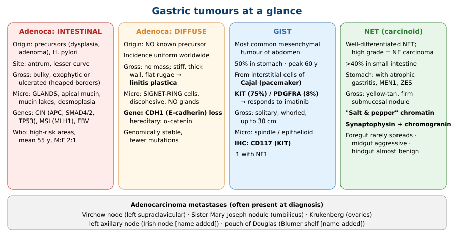
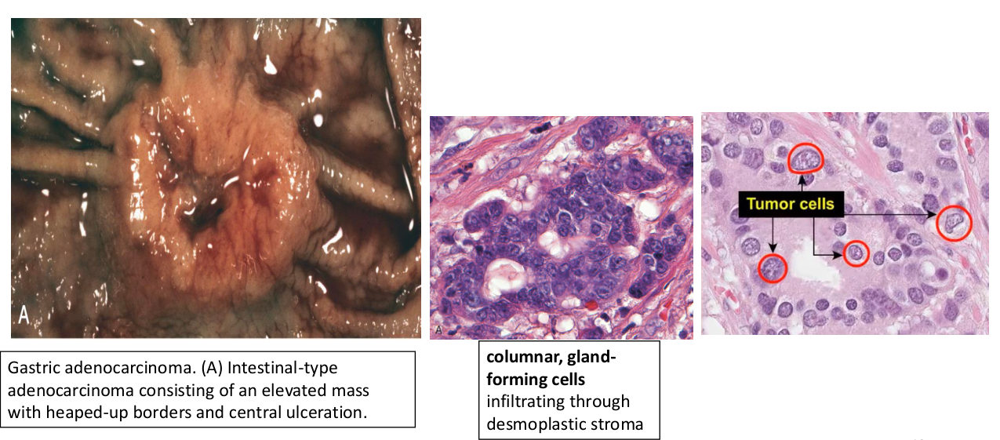
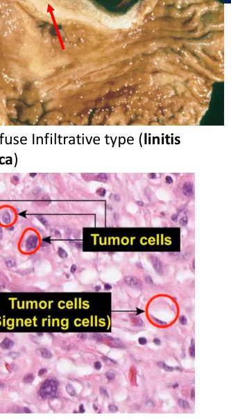
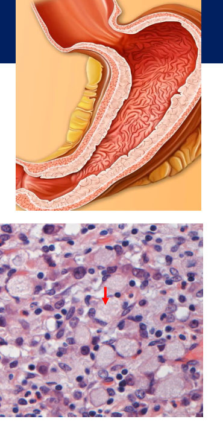
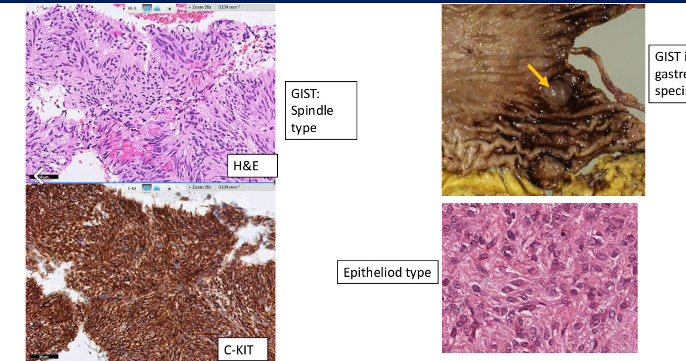
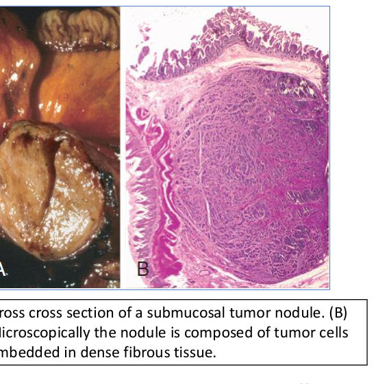
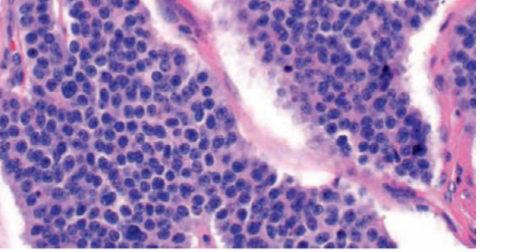

# Gastric Tumours
**Discipline: Pathology · Block M3 (Digestion & Defence)** | Source: `8-_Gastric__tumors_202627_DD3_1.pdf` (29 slides) · Refs: Robbins, Cotran & Kumar 11th ed.; AMBOSS

> **Legend:** ⭐ = high-yield · *[added]* = not on slides. Text **highlighted on the slides** (yellow/orange/underlined) is treated as lecturer emphasis and starred. Images marked "Slide N" come from the lecture; "Added diagram" = drawn for these notes.

---

## 1. Title / Objectives
| Objective | Likely tested as |
|---|---|
| ⭐ Describe **aetiology, pathogenesis, morphology and clinical features** of gastric neoplasms | Intestinal vs diffuse adenocarcinoma; H. pylori; CDH1; linitis plastica; signet-ring; metastatic eponyms; GIST (KIT/CD117, Cajal); NET (salt-and-pepper, synaptophysin/chromogranin, carcinoid syndrome) |

**Flow:** Introduction → Adenocarcinoma (epidemiology → aetiology → pathogenesis → morphology → clinical features → metastases) → GIST → Neuroendocrine tumours (carcinoid) → Summary → Case.

---

## 2. Main Content (Lecture Order)

### 2.1 Introduction (Slide 3)
- Gastric cancer = malignant transformation of gastric cells; **hereditary or sporadic**
- ⭐ **Types:** **adenocarcinoma, MALT lymphoma, leiomyosarcoma, GIST, NET**
- ⭐ **Adenocarcinoma = most common gastric malignancy (> 90%)**
- ⭐ Two morphological types:
  1. **Intestinal**: forms **bulky masses**
  2. **Diffuse**: **infiltrates and thickens** the wall
- ⭐ **Early symptoms** mimic chronic gastritis: **dyspepsia, dysphagia, nausea**
- ⭐ Usually found **late**, with **weight loss, anorexia, altered bowel habits, anaemia, haemorrhage**

> 🔁 **Recap: Intro.** Adenocarcinoma is > 90% of gastric cancers, split into intestinal (mass) and diffuse (infiltrative). Early symptoms look like gastritis, so diagnosis is usually late.
> 🔗 **Link:** First, who gets it and why.
> ▶️ **Up next: Epidemiology and aetiology.**

---

### 2.2 Adenocarcinoma: Epidemiology & Aetiology (Slides 4–6)
**Epidemiology:**
- ⭐ Incidence varies **markedly by geography**: ⭐ **Japan**, Chile, Costa Rica, Eastern Europe up to ⭐ **20× higher** than North America, northern Europe, Africa, SE Asia
- Peak **55–80 y**; rare < 50
- ⭐ **M:F = 2–3 : 1**

**Aetiology:**
- ⭐ Most sporadic cancers relate to ⭐ **H. pylori**
- ⭐ **Chronic H. pylori = the main cause of non-cardia (distal) gastric cancer**
- ⭐ **EBV** (~10% of gastric cancers)
- ⭐ **Smoking**
- ⭐ **Heavy alcohol**

**Other proposed risk factors:** diet (**salt, preserved meats**, coffee) · low socioeconomic status · obesity · **pernicious anaemia** · **previous gastric surgery** · race/ethnicity · **blood group A**

> 🔁 **Recap: Who and why.** Japan-type high-risk regions, men (2–3:1), 55–80 y. H. pylori is the main cause of distal cancer; also EBV, smoking, alcohol, salty/preserved food, pernicious anaemia, prior gastric surgery, blood group A.
> 🔗 **Link:** The two histological types arise through different molecular routes.
> ▶️ **Up next: Pathogenesis.**

---

### 2.3 Adenocarcinoma: Pathogenesis (Slides 7–8)
⭐⭐ **Diffuse type:**
- ⭐ **Loss-of-function mutation of the tumour-suppressor gene CDH1**: **~30% of hereditary** and **~50% of sporadic** diffuse gastric cancer
- ⭐ **CDH1 encodes E-cadherin** (cell-adhesion protein); ⭐ **E-cadherin loss is the key step** → cells become **discohesive** *[link to morphology added]*
- Hereditary diffuse cancer: **α-catenin mutation**
- ⭐ Diffuse tumours are **genomically stable** with **fewer mutations** than intestinal type

⭐⭐ **Intestinal type: 3 molecular subtypes:**
| Subtype | Genes / features | Site |
|---|---|---|
| ⭐ **Chromosomal instability (CIN)** | **APC, SMAD4, SMAD2, TP53** | ⭐ **Antrum and pyloric channel** |
| ⭐ **Microsatellite instability (MSI)** | ⭐ **MLH1 silencing** | ⭐ **Gastric body** |
| ⭐ **EBV-associated** | Silencing of **CDKN2A**, **PIK3CA**; ⭐ **↑ PD-L1/2** | ⭐ **Fundus and proximal body** |

*[added: ↑ PD-L1/2 makes EBV-associated tumours candidates for immune-checkpoint inhibitors.]*

> 🔁 **Recap: Pathogenesis.** Diffuse = CDH1/E-cadherin loss (α-catenin in hereditary), genomically stable. Intestinal = CIN (APC, SMAD, TP53; antrum), MSI (MLH1; body), EBV (CDKN2A, PIK3CA, PD-L1; fundus).
> 🔗 **Link:** Molecules explain the appearance: cohesive glands vs single loose cells.
> ▶️ **Up next: Morphology.**

---

### 2.4 Adenocarcinoma: Morphology (Slides 9–12)
**⭐ Intestinal type:**
- Most distal cancers arise in the ⭐ **antrum**; ⭐ **lesser curvature > greater curvature**
- ⭐ **Bulky**, **gland-forming**, grow along **broad cohesive fronts**
- **Exophytic mass** or **ulcerated infiltrative tumour** (heaped-up borders, central ulcer)
- Cells have **apical mucin vacuoles**; mucin in gland lumina; **extracellular mucin lakes**
- Micro: **columnar, gland-forming cells infiltrating desmoplastic stroma**

**⭐ Diffuse type:**
- **Hard to see a mass**
- Infiltration provokes a **desmoplastic reaction** → **stiff wall**
- Large areas → ⭐ **flat rugae + rigid thick wall = "leather bottle stomach" (linitis plastica)**
- Micro: ⭐ **signet-ring cells**: large **mucin vacuole pushing the nucleus to the periphery**; **small clusters / single discohesive cells**; ⭐ **no glands**; mucin lakes

 

> 🔁 **Recap: Morphology.** Intestinal = antrum/lesser curve, bulky or ulcerated, glands. Diffuse = no mass, desmoplasia, linitis plastica, signet-ring cells, no glands.
> 🔗 **Link:** Morphology also predicts who gets it and how it behaves.
> ▶️ **Up next: Clinical features and prognosis.**

---

### 2.5 Adenocarcinoma: Clinical Features, Prognosis, Metastases (Slides 13–15)
| | **Intestinal** | **Diffuse** |
|---|---|---|
| Geography | ⭐ **Predominates in high-risk areas** | ⭐ **Uniform** across countries |
| Precursors | ⭐ **Flat dysplasia, adenomas** | ⭐ **None identified** |
| Age / sex | ⭐ **Mean 55 y, M:F 2:1** | |

⭐⭐ **Prognosis (Slide 14):**
- ⭐ **Depth of invasion + extent of nodal and distant metastases = the most powerful prognostic indicators**
- Local invasion into **duodenum, pancreas, retroperitoneum** is common
- ⭐ **Early gastric cancer + resection → 5-year survival > 90%**, **even with nodal metastases**
- ⭐ **Advanced gastric cancer → 5-year survival < 20%**

⭐⭐⭐ **Metastases (often present at diagnosis) (Slide 15):**
| Site | Eponym |
|---|---|
| ⭐ **Supraclavicular sentinel node** | ⭐ **Virchow node** *[added: left side]* |
| ⭐ **Periumbilical node** | ⭐ **Sister Mary Joseph nodule** |
| ⭐ **Ovaries** | ⭐ **Krukenberg tumour** |
| **Left axillary node** | *[added: Irish node]* |
| **Pouch of Douglas** | *[added: Blumer shelf, felt on rectal exam]* |

> 🔁 **Recap: Clinical.** Intestinal = high-risk areas, precursors, 55 y, men. Diffuse = everywhere, no precursor. Stage (depth, nodes, metastases) rules prognosis: early > 90% vs advanced < 20% at 5 years. Know Virchow, Sister Mary Joseph, Krukenberg.
> 🔗 **Link:** Not every gastric mass is epithelial. The commonest mesenchymal one is GIST.
> ▶️ **Up next: GIST.**

---

### 2.6 Gastrointestinal Stromal Tumour, GIST (Slides 16–19)
**General:**
- ⭐ **Most common mesenchymal tumour of the abdomen**
- Anywhere along the tubular GIT; ⭐ **50% in the stomach**
- ⭐ Arises from the **interstitial cells of Cajal** (**pacemaker cells**)
- ⭐ ↑ incidence with **neurofibromatosis type 1**
- Peak age **60 y**; symptoms from **mass effect**

⭐⭐ **Pathogenesis:**
| Mutation | Frequency | Imatinib response |
|---|---|---|
| ⭐ **KIT (c-KIT)**, gain-of-function receptor tyrosine kinase | ⭐ **75%** | ⭐ **Often responds** |
| ⭐ **PDGFRA** | **8%** | **Often responds** |
| Neither | Remainder | ⭐ **Generally resistant** |
*[link: KIT is a receptor tyrosine kinase, an enzyme-linked receptor type I from Physiology Lecture 06.]*

**Morphology:**
- Up to ⭐ **30 cm**; **solitary, well-circumscribed, fleshy**, overlying mucosa often **ulcerated**
- Cut surface: ⭐ **whorled**
- Metastases: **serosal nodules** in the peritoneal cavity or **liver**
- ⭐ **Spindle-cell type** (thin elongated cells) vs **epithelioid type** (plump, epithelial-looking)
- ⭐⭐ **Most useful IHC marker: KIT (CD117)**

> 🔁 **Recap: GIST.** Cajal-cell tumour, 50% gastric, NF1-linked, 60 y. KIT 75% / PDGFRA 8% → imatinib. Whorled, up to 30 cm, spindle or epithelioid. CD117 positive.
> 🔗 **Link:** The last gastric tumour arises from neuroendocrine cells.
> ▶️ **Up next: Neuroendocrine tumours (carcinoid).**

---

### 2.7 Neuroendocrine Tumours / Carcinoid (Slides 20–25)
**Terminology:**
- NETs arise from **neuroendocrine cells**, found throughout the body
- ⭐ **Carcinoid = well-differentiated NET**, so named because it grows **more slowly than carcinomas**
- Current WHO: **low- or intermediate-grade NET**; ⭐ **high grade = neuroendocrine carcinoma**

**Sites & associations:**
- Most in the GI tract; ⭐ **> 40% in the small intestine**; also **tracheobronchial tree/lungs**
- ⭐ Gastric NETs are associated with: **endocrine cell hyperplasia**, ⭐ **autoimmune chronic atrophic gastritis**, ⭐ **MEN1**, ⭐ **Zollinger–Ellison syndrome**

**Morphology:**
- Gross: **polypoid intramural or submucosal mass**; in the stomach arises within **oxyntic mucosa**; mucosa intact or ulcerated; ⭐ **yellow or tan**; ⭐ **firm** (intense **desmoplasia**) → may **obstruct** the small bowel; intestinal tumours may invade the **mesentery**
- Histology: **islands, trabeculae, strands, glands, sheets** of **uniform cells**, scant **pink granular cytoplasm**, round–oval nucleus with ⭐⭐ **"salt-and-pepper" chromatin**
- ⭐⭐ IHC: **synaptophysin** and **chromogranin A**

 

**Clinical features:**
- Most common in the **6th decade** (any age)
- Symptoms reflect **secreted hormones**; ⭐ **gastrin-producing → Zollinger–Ellison syndrome**
- ⭐⭐ **Carcinoid syndrome** (< 10% of patients): vasoactive substances in the **systemic circulation** → ⭐ **flushing**, sweating, ⭐ **bronchospasm**, colicky pain, ⭐ **diarrhoea**, ⭐ **right-sided cardiac valve fibrosis**, facial/chest cyanosis, intermittent hypertension, palpitations
  *[added: usually requires liver metastases, since the liver otherwise inactivates serotonin; the lung inactivates it before the left heart, which is why valve disease is right-sided.]*

⭐⭐ **Behaviour by embryological origin (Slide 25):**
| Origin | Site | Behaviour |
|---|---|---|
| **Foregut** | **Stomach, duodenum** | ⭐ **Rarely metastasise; cured by resection** |
| **Midgut** | **Jejunum, ileum** | ⭐ **Often multiple; aggressive** |
| **Hindgut** | **Appendix, colorectum** | ⭐ **Almost always benign** |

> 🔁 **Recap: NET.** Carcinoid = slow, well-differentiated; high grade = NE carcinoma. Gastric NETs are linked to atrophic gastritis, MEN1, ZES. Yellow firm submucosal nodules; salt-and-pepper chromatin; synaptophysin/chromogranin A. Carcinoid syndrome (< 10%): flushing, diarrhoea, bronchospasm, right-heart valves. Midgut aggressive; foregut and hindgut indolent.

---

### 2.8 Summary (Slide 26)
- **Adenocarcinoma** = most common gastric malignancy (**> 90%**)
- **Intestinal vs diffuse** types with distinct morphology
- **H. pylori** = main cause of **non-cardia** cancer; also **EBV, smoking, heavy alcohol**
- **Intestinal** = gland-forming; **diffuse** = discohesive **signet-ring** cells, may cause **linitis plastica**
- **Depth of invasion + nodal/distant metastases** = most powerful prognostic indicators
- **GIST**: interstitial cells of Cajal, often gastric, frequent **KIT** mutations; **spindle or epithelioid**; **CD117** = best IHC marker
- **NETs**: **salt-and-pepper** chromatin; **synaptophysin, chromogranin A** positive

---

## 3. High-Yield Comparison Tables

### Table A: Intestinal vs diffuse adenocarcinoma
| | **Intestinal** | **Diffuse** |
|---|---|---|
| Gross | Bulky, exophytic or ulcerated mass | No mass; **linitis plastica** |
| Micro | **Glands**, apical mucin | **Signet-ring**, discohesive, **no glands** |
| Key gene | CIN (APC, SMAD4/2, TP53), MSI (MLH1), EBV | ⭐ **CDH1 / E-cadherin** (hereditary: α-catenin) |
| Genome | Unstable, many mutations | **Stable**, fewer mutations |
| Precursor | **Dysplasia, adenoma** | **None** |
| Geography | High-risk areas | Uniform |
| Demography | Mean 55 y, M:F 2:1 | *[added: younger, F ≈ M]* |
| Site | **Antrum, lesser curve** | Anywhere / whole wall |

### Table B: Molecular subtypes of intestinal type *(see §2.3)*

### Table C: GIST vs NET vs adenocarcinoma
| | Adenocarcinoma | GIST | NET |
|---|---|---|---|
| Cell of origin | Gastric epithelium | **Interstitial cells of Cajal** | **Neuroendocrine cells** |
| Key marker | *[added: CK, CDX2 intestinal]* | ⭐ **CD117 (KIT)** | ⭐ **Synaptophysin, chromogranin A** |
| Key histology | Glands / signet ring | **Spindle / epithelioid**, whorled | **Salt-and-pepper** chromatin |
| Gene | CDH1, CIN, MSI, EBV | **KIT, PDGFRA** | *[added: MEN1 in syndromic]* |
| Targeted drug | *[added: trastuzumab (HER2+), PD-1 inhibitors]* | ⭐ **Imatinib** | *[added: somatostatin analogues]* |
| Associations | H. pylori, EBV, smoking, alcohol | **NF1** | **Atrophic gastritis, MEN1, ZES** |

### Table D: Metastatic eponyms *(see §2.5)*

### Table E: NET behaviour by gut origin *(see §2.7)*

---

## 4. Rules, Exceptions, Patterns
- **> 90% of gastric cancer = adenocarcinoma.**
- **H. pylori → distal (non-cardia)** cancer.
- **Glands = intestinal; signet-ring + no glands = diffuse.**
- **CDH1 / E-cadherin loss → discohesive cells → diffuse type.**
- **Intestinal has precursors; diffuse has none.**
- **Prognosis = stage** (depth, nodes, metastases), not histological type alone.
- **Early gastric cancer can be cured (> 90%) even with positive nodes.**
- **CD117 = GIST. Synaptophysin/chromogranin = NET.**
- **KIT/PDGFRA-mutant GIST → imatinib-sensitive; wild-type → resistant.**
- **Midgut NETs are the aggressive ones.**
- **Carcinoid syndrome is uncommon (< 10%).**

---

## 5. Clinical Correlations
- **Left supraclavicular node in a patient with weight loss** → think gastric cancer (Virchow node; Troisier's sign *[added]*).
- **Bilateral ovarian masses with signet-ring cells** → Krukenberg tumour from a gastric primary.
- **Umbilical nodule** → Sister Mary Joseph nodule (peritoneal spread).
- **H. pylori eradication** reduces gastric cancer risk *[added]*.
- **Hereditary diffuse gastric cancer (CDH1 germline)** → prophylactic gastrectomy considered *[added]*; also ↑ lobular breast cancer *[added]*.
- **GIST on imatinib**: KIT/PDGFRA testing predicts response.
- **Flushing + diarrhoea + wheeze + tricuspid/pulmonary valve disease** → carcinoid syndrome (check urinary 5-HIAA *[added]*).
- **Pernicious anaemia / autoimmune atrophic gastritis** → ↑ gastrin → ECL-cell hyperplasia → gastric NET *[mechanism added]*.

---

## 6. Rapid Revision (Last-Day)
- Gastric tumours: **adenoca (> 90%)**, MALT lymphoma, leiomyosarcoma, **GIST**, **NET**.
- Early: dyspepsia, dysphagia, nausea. Late: weight loss, anorexia, anaemia, bleeding.
- **Japan, Chile, Costa Rica, E. Europe (20×)**; 55–80 y; **M:F 2–3:1**.
- Causes: **H. pylori (non-cardia)**, **EBV 10%**, smoking, alcohol; salt/preserved meat, pernicious anaemia, prior surgery, **blood group A**.
- Diffuse: **CDH1 → E-cadherin** (30% hereditary, 50% sporadic); hereditary **α-catenin**; genomically stable.
- Intestinal: **CIN** (APC, SMAD4/2, TP53; antrum) · **MSI** (MLH1; body) · **EBV** (CDKN2A, PIK3CA, PD-L1/2; fundus).
- Intestinal morphology: **antrum, lesser curve**, bulky/ulcerated, **glands**, mucin lakes.
- Diffuse morphology: **linitis plastica**, **signet-ring**, discohesive, **no glands**.
- Intestinal: high-risk areas, **precursors**, **55 y, 2:1**. Diffuse: uniform, **no precursors**.
- Prognosis: **depth + nodes + metastases**. Early **> 90%**, advanced **< 20%** 5-yr survival.
- Mets: **Virchow**, **Sister Mary Joseph**, **Krukenberg**, left axillary, **pouch of Douglas**.
- **GIST**: most common abdominal mesenchymal tumour; **50% stomach**; **Cajal cells**; **NF1**; 60 y; **KIT 75%**, **PDGFRA 8%** → **imatinib**; up to 30 cm, **whorled**; spindle/epithelioid; **CD117**.
- **NET**: carcinoid = well-differentiated; high grade = NE carcinoma; **> 40% small bowel**; gastric with **atrophic gastritis, MEN1, ZES**; yellow, firm; **salt-and-pepper**; **synaptophysin, chromogranin A**; 6th decade.
- **Carcinoid syndrome < 10%**: flushing, sweating, bronchospasm, pain, diarrhoea, **right-sided valve fibrosis**.
- **Foregut rarely spreads · midgut aggressive · hindgut benign.**

---

## 7. Exam-Style Questions

**Q1 (MCQ, lecture case, Slide 27).** 53 ♀, 5 months of nausea, vomiting, epigastric pain. Barium study: **gastric outlet obstruction**. Endoscopy: **2 × 4 cm ulcerated mass at the pylorus**. Most likely biopsy finding?
(A) Non-Hodgkin lymphoma (B) Neuroendocrine carcinoma (C) Squamous cell carcinoma **(D) Adenocarcinoma** (E) Leiomyosarcoma
**Answer: D.** *[reasoning added; the slide gives no key]* Adenocarcinoma is > 90% of gastric malignancies, and the intestinal type favours the **distal stomach (antrum/pylorus)** as an **ulcerated mass**. Squamous carcinoma belongs to the oesophagus; lymphoma, NET and leiomyosarcoma are much rarer.

**Q2 (MCQ).** A gastrectomy shows a thick rigid wall with flattened rugae; microscopy shows single cells with mucin pushing the nucleus aside. The key molecular event is:
a) KIT mutation **b) Loss of E-cadherin (CDH1)** c) MLH1 silencing d) APC mutation
**Answer: b.** Linitis plastica + signet-ring cells = diffuse type.

**Q3 (MCQ).** A gastric spindle-cell tumour with a whorled cut surface. Best IHC marker?
a) Chromogranin A b) Cytokeratin **c) CD117 (KIT)** d) Synaptophysin
**Answer: c.** GIST.

**Q4 (MCQ).** Which feature is the most powerful prognostic indicator in gastric adenocarcinoma?
a) Histological type b) Tumour size **c) Depth of invasion and nodal/distant metastases** d) Patient age
**Answer: c.**

**Q5 (Short answer).** A patient has flushing, diarrhoea, wheeze and a tricuspid valve lesion. Name the syndrome, its histology hallmark and IHC markers, and the gut segment whose tumours are most aggressive.
**Answer:** **Carcinoid syndrome** from a **neuroendocrine tumour**; histology: **uniform cells with "salt-and-pepper" chromatin**; IHC: **synaptophysin, chromogranin A**. **Midgut** (jejunum/ileum) NETs are the most aggressive.

---

## 8. Exam Pitfalls & Traps
1. **Intestinal ↔ diffuse features swapped.** Glands and precursors = intestinal; signet-ring, no glands, no precursors, CDH1 = diffuse.
2. **Diffuse type is genomically unstable.** No, it's **stable** with **fewer** mutations.
3. **H. pylori causes cardia cancer.** The lecture says **non-cardia (distal)**.
4. **Early gastric cancer with nodes has a poor prognosis.** No: **> 90%** 5-year survival after resection.
5. **GIST comes from smooth muscle.** No, from **interstitial cells of Cajal**; marker **CD117**.
6. **All GISTs respond to imatinib.** Only **KIT/PDGFRA-mutant** ones generally do.
7. **NET marker confusion:** NET = **synaptophysin/chromogranin**; GIST = **CD117**.
8. **Carcinoid syndrome is common.** It occurs in **< 10%**.
9. **Most aggressive NETs are foregut.** No: **midgut**; hindgut almost always benign.
10. ⚠️ **M:F ratio:** Slide 4 says **2–3 : 1** overall; Slide 13 says **2 : 1** for the intestinal type. Use the one that matches the question.
11. ⚠️ **Slide typo:** "Leiomosarcoma" = **leiomyosarcoma**. MALT lymphoma is listed but not discussed further.
