# Parathyroid Disorders I: Hyperparathyroidism & Hypercalcaemia
**Internal Medicine Department** | Source: `7-Hyperparathyroidism.pdf` (40 slides)

> **Legend:** ⭐ = high-yield · *[added]* = not on slides. Images marked "Slide N" come from the lecture; "Added diagram" = drawn for these notes.

> 🔗 **Bridge from earlier lectures:**
> - **Hormones & receptors / regulatory systems (Physiology):** PTH is a **peptide** hormone in a classic negative-feedback loop; Ca²⁺ is the controlled variable.
> - **Thyroid 2:** **medullary thyroid cancer** belongs to **MEN 2A** together with **parathyroid hyperplasia**. Thyroid surgery is the commonest cause of the opposite problem, **hypo**parathyroidism (next lecture).
> - **Lung cancer:** **squamous cell carcinoma → PTHrP → hypercalcaemia** (the paraneoplastic counterpart of this lecture).
> - **Hypertension:** primary hyperparathyroidism was on the endocrine HTN list, and **thiazides raise Ca** while loops lower it.
> - **Gastric tumours / PUD:** peptic ulcer + hypercalcaemia → think **MEN 1 / Zollinger–Ellison**.

---

## 1. Title / Objectives

| Domain | Objective | Likely tested as |
|---|---|---|
| Knowledge | Pathophysiology and etiology of parathyroid disorders | 1ry vs 2ry vs 3ry, ectopic |
| Knowledge | ⭐ Epidemiology, manifestations, complications and management of **hyperparathyroidism** | "Stones, bones, groans, moans"; surgery indications |
| Knowledge | ⭐ **Calcium homeostasis** | PTH / vit D / calcitonin table; corrected Ca |
| Knowledge | ⭐ Causes and manifestations of **hypercalcaemia** | Differential MCQ |
| Skill | Interpret clinical findings and investigations → diagnosis | Lab pattern (Ca, PO₄, ALP, PTH) |
| Skill | Evidence-based management plan for HPT | Surgery vs medical |
| Skill | ⭐ Recognise emergencies (**hypercalcaemic crisis**) | Saline first, then furosemide |

**Lecture flow:** Calcium homeostasis (PTH, vit D, calcitonin; assessment; functions) → Hyperparathyroidism (causes, clinical picture, osteitis fibrosa cystica, investigations, radiology, localisation, Dent test) → Treatment (surgery, hungry bone, medical) → Hypercalcaemic crisis → Differential diagnosis (causes of hypercalcaemia; generalised bone disease) → Case → Summary.

---

## 2. Main Content (Lecture Order)

### 2.1 Calcium Homeostasis (Slides 4–6) ⭐
- **Low blood Ca²⁺** → parathyroid glands release **PTH** → **bones** release Ca²⁺, **kidneys** reabsorb Ca²⁺ and **activate vitamin D**, **intestine** absorbs Ca²⁺ → blood Ca²⁺ rises.
- **High blood Ca²⁺** → thyroid **C cells** secrete **calcitonin** → bones take up Ca²⁺ → blood Ca²⁺ falls.
- Serum Ca and PO₄ are controlled by three hormones: **parathormone, calcitonin, active vitamin D**.
- Regulation involves three sites: **bone, intestine, kidney**.

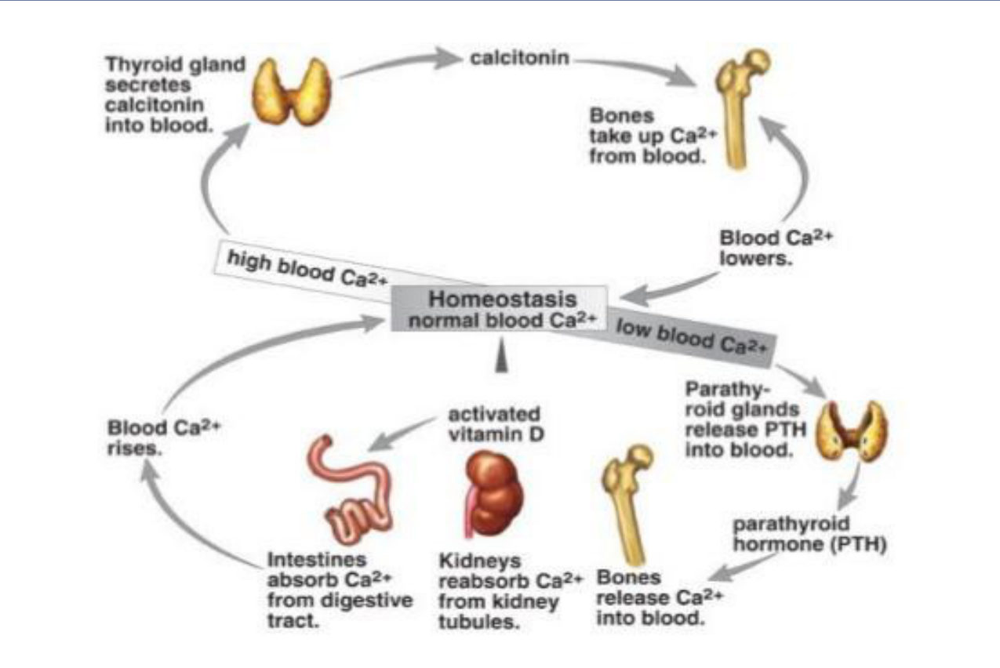

**Hormone actions (slide 6):**

| Site | **PTH*** | **Vitamin D** | **Calcitonin** |
|---|---|---|---|
| Absorption (intestine) | ↑ Ca, ↓ P | ↑ Ca, ↑ P | ↓ Ca |
| Reabsorption (kidney) | ↑ Ca, **↓ P** (phosphaturia) | ↑ Ca, ↑ P | ↓ Ca, ↓ P |
| Resorption (bone) | ↑ Ca, ↑ P | ↑ Ca, ↑ P | ↓ Ca, ↓ P |
| ⭐ **Blood (net result)** | **↑ Ca, ↓ P** | **↑ Ca, ↑ P** | **↓ Ca, ↓ P** |

\* **PTH acts directly on bone and kidney, and indirectly on the intestine** (through activation of vitamin D: 1α-hydroxylase in the kidney *[added]*).

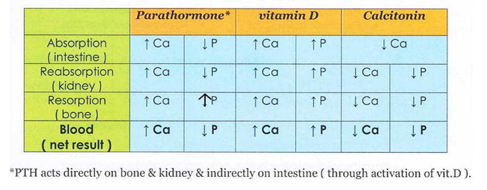

> **Mnemonic:** **PTH = "Phosphate Trashing Hormone"** *[added]* → raises Ca but **dumps PO₄ in the urine**. Vitamin D raises **both**. Calcitonin lowers **both**.

### 2.2 Assessment of Calcium (Slides 7–8) ⭐

| Fraction | % of serum Ca | Note |
|---|---|---|
| Body distribution | **99% in bone**, **1% extracellular** | |
| **Ionized (active)** | **50%** | The physiologically active part |
| Non-ionized (reserve): bound to **albumin** | **40%** | Changes with albumin |
| Non-ionized: other complexes | **10%** | Carbonate, phosphate… |

- **Normal total Ca: 8.4–10.2 mg%** (slide 7) / **8.5–10.5 mg/dL** (slides 7–8).
- **Ionized Ca normal: 4.65–5.25 mg/dL** (slide 8). The slide labels **< 4.5 mg/dL** as low.
- ⭐ **Liver cirrhosis and nephrotic syndrome** → ↓ albumin → **low total Ca but NO tetany**, because **ionized Ca is still normal**.
- Ca is closely related to **P** (normal **3–4.5 mg%**). The slide states **Ca × P = constant (~40)**.

⭐ **Corrected Ca = serum Ca + 0.8 × (normal albumin − patient's albumin)**. Add **0.8 mg/dL of Ca for each 1 g/dL of albumin below 4** *(the slide writes "mg/dl" for albumin; it means g/dL)*.

*[added] Worked example: Ca 7.6, albumin 2.0 → 7.6 + 0.8 × 2 = **9.2 (normal)**. No treatment needed.*

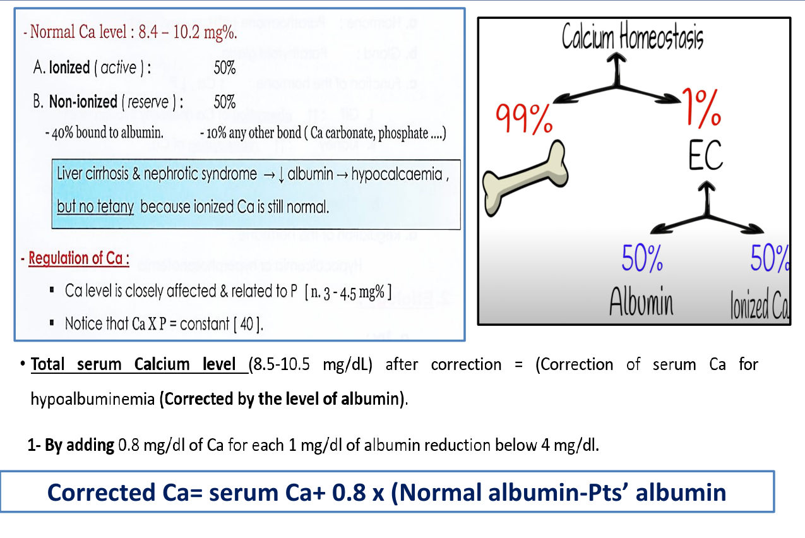

**Functions of calcium (slide 8).** Mnemonic **"C keeps the 3 B's strong"**:
- **C** = **C**ontracts the muscles
- **B**one
- **B**lood (clotting, factor IV)
- **B**eats (heart)

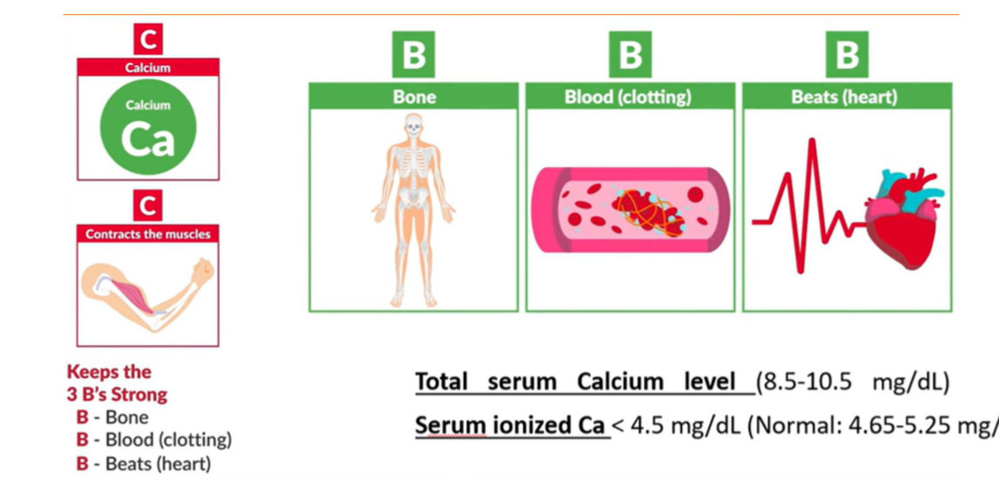

> 🔁 **Recap: Homeostasis.** PTH: ↑ Ca, ↓ PO₄ (direct on bone and kidney, indirect on gut via vit D). Vit D: ↑ both. Calcitonin: ↓ both. 99% of Ca is in bone. Of serum Ca, 50% is ionized and 40% is albumin-bound, so correct for albumin (+0.8 per 1 g/dL below 4). Low albumin = low total Ca without tetany.
> 🔗 **Link:** When PTH is secreted in excess, every arrow in that table is pushed too far.
> ▶️ **Up next: Hyperparathyroidism.**

---

### 2.3 Hyperparathyroidism: Causes (Slides 9–10) ⭐
HPT = **excess PTH secretion**.

| Type | Mechanism | Causes |
|---|---|---|
| **1. Primary** | Autonomous gland | ⭐ **Adenoma (90%)** · hyperplasia · carcinoma · part of **MEN I or II** |
| **2. Secondary** | Appropriate response to a **tendency to low serum Ca** | ⭐ **Chronic renal failure ("renal osteodystrophy")** · **malabsorption** and **post-gastrectomy** · *[added]* vit D deficiency |
| **3. Tertiary** | **Autonomous PTH secretion superimposed on long-standing 2ry HPT** | Usually CKD / post-transplant *[added]* |
| **4. Ectopic PTH** | Tumour secretes PTH | **Very rare**: **bronchogenic carcinoma**, **hypernephroma** (RCC) |

*Most malignancy-associated hypercalcaemia is due to **PTHrP**, which is not detected by the PTH assay, rather than true ectopic PTH. Slide 29 lists "ectopic PTH secretion (PTHrP)" in bronchogenic carcinoma.*

*[added] MEN 1 (Wermer) = **P**arathyroid, **P**ituitary, **P**ancreas. MEN 2A (Sipple) = **M**edullary thyroid, **P**heochromocytoma, **P**arathyroid. MEN 2B has no parathyroid involvement.*

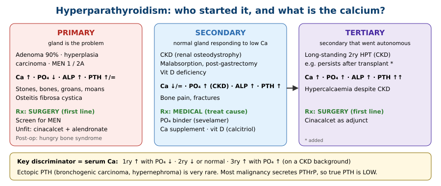

### 2.4 Clinical Picture (Slides 11–13) ⭐
**Clinical pearl (slide 13):** ⭐ **The majority of patients are asymptomatic** (found on routine Ca testing *[added]*).

> **Mnemonic: "Stones, bones, abdominal groans, thrones and psychiatric overtones"** (slides 12–13)
> - **Painful bones**
> - **Renal stones**
> - **Abdominal groans**
> - **Sitting on the throne** (polyuria, constipation)
> - **Psychiatric overtones**

**Slide 11 (hand-drawn) and slide 12 by system.** Hypercalcaemia causes **metastatic calcification**.

| System | Manifestations |
|---|---|
| **Skeletal** | Osteomalacia, osteoporosis, **bone cysts**; ⭐ **osteitis fibrosa cystica** (**von Recklinghausen's disease of bone**, ~10% of cases); **pathological fractures**, which **heal rapidly** because of the hypercalcaemia; bone pain |
| **Renal** | **Excessive Ca diuresis → polyuria + polydipsia ("Ca diabetes")**; ⭐ **recurrent bilateral kidney stones** and **nephrocalcinosis** → renal colic, haematuria, hydronephrosis, infection, **renal failure** if untreated |
| **GIT** | Anorexia, nausea, vomiting, intestinal atony → **constipation**; ⭐ **peptic ulcer** (in 15% of cases → suggests **Zollinger–Ellison**/MEN 1); **cholelithiasis**; **pancreatitis** (Ca activates trypsinogen; Ca precipitates in alkaline medium → duct obstruction) |
| **Neuromuscular / articular** | Fatigue, **apathy**, drowsiness, **depression**, **psychosis**; **pseudogout** (Ca deposition in tendons and joint capsules); muscular hypotonia (**myopathy**) → **waddling gait** |
| **Cardiovascular** | **Hypertension** (↑ vascular reactivity, ↑ renin); **hypotension** in severe cases (dehydration); **arrhythmia** (cardiac arrest in systole); ECG: ⭐ **short QT** |
| **Eyes** | Ca deposits in the conjunctiva and lateral corneal edges → ⭐ **band keratopathy** |
| **Neck** | **Nodule in the neck** (rarely palpable; *[added]* a palpable mass with very high Ca suggests carcinoma) |
| **Skin** | **Dry**, **pruritus** (itching) |

- PTH also **lowers blood phosphorus**.
- When **Ca × P rises**, calcium phosphate precipitates in tissues → **metastatic calcification**.

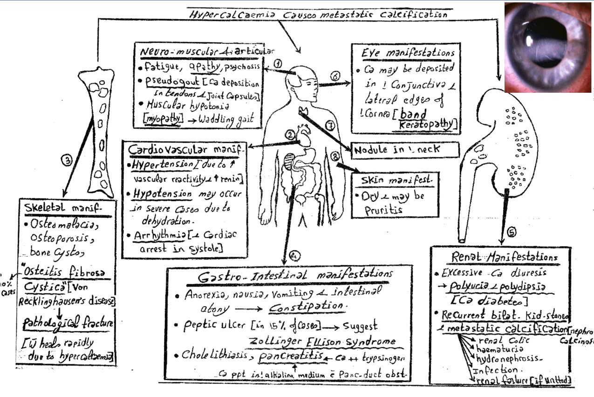

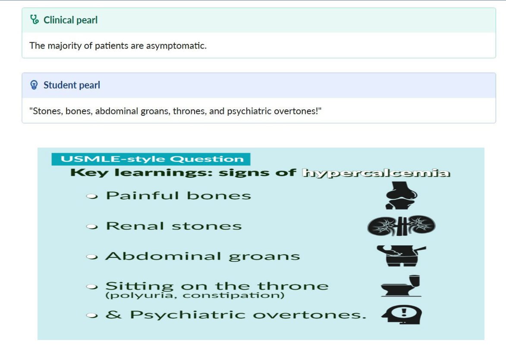

### 2.5 Osteitis Fibrosa Cystica (Slide 14) ⭐
- **Classic localised bone lesion of HPT.** PTH-driven **osteoclasts** lyse bone, and the **marrow is replaced by highly vascular fibrous tissue**. Stress on the weakened bone → **haemorrhage and cyst formation**.
- Old term: ⭐ **"brown tumour"**. The brown colour comes from **massive haemosiderin deposition**.
- Typically in the **jaw and long bones**; may cause **pathological fractures**.
- Distinguished from other **giant cell tumours of bone** by measuring **serum Ca**.

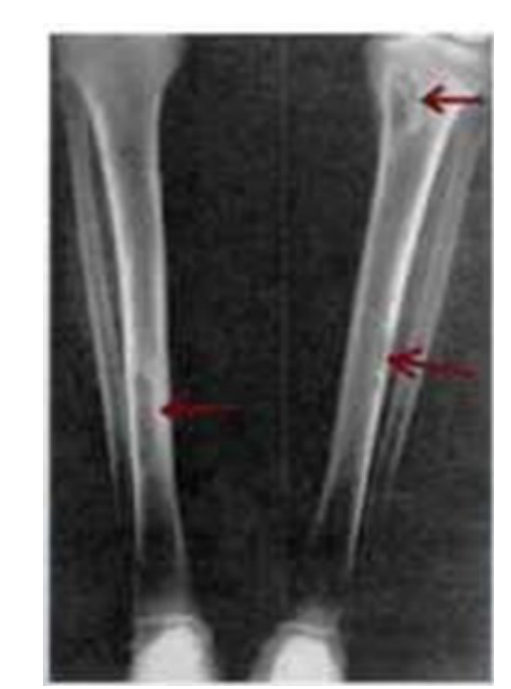

### 2.6 Investigations (Slides 15–20) ⭐

| # | Test | Finding |
|---|---|---|
| 1 | **Serum Ca** | ↑ (slide 15 gives N = 9–10.5 mg%) |
| 2 | **Serum phosphate** | ↓ (**except with renal failure**). N = 2.5–4 mg% |
| 3 | **Alkaline phosphatase** | ↑ in patients with **bone disease** |
| 4 | ⭐ **Plasma PTH** | ↑. **Urinary cAMP ↑** in HPT but not in other causes of hypercalcaemia |
| 5 | **Hypercalciuria** | **> 300 mg/24 h on a low-Ca diet** is consistent with HPT (**not diagnostic**) |
| 6 | **Radiology** | See below |
| 7 | **Localisation** of the adenoma | Arteriography · **US and CT of the neck** · **technetium–thallium subtraction scan** |
| 8 | ⭐ **Steroid suppression (Dent) test** | Hypercalcaemia of HPT **does NOT suppress with hydrocortisone**, unlike other hypercalcaemic states |

**Radiological findings (slide 16):**
- **A. Kidneys:** **stones** and **nephrocalcinosis**.
- **B. Skeleton:**
    - **Osteitis fibrosa cystica (generalisata)**.
    - ⭐ **"Salt and pepper" skull**: tiny punched-out lesions.
    - ⭐ **"Cod-fish spine"**: diffuse softening; the discs indent the vertebral bodies.
    - **Milkman fracture / Looser zone (pseudofracture)**: a tongue of radiolucency extending into the bone from the surface, mostly at the **upper femur and humerus** (*due to osteomalacia*).
    - *[added]* **Subperiosteal resorption of the radial side of the middle phalanges** is the most specific X-ray sign of HPT. Also distal clavicle resorption.
- **C. Soft tissue calcification.**

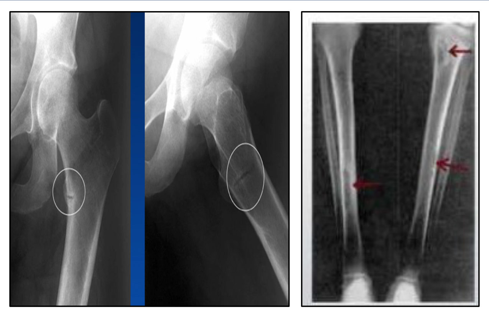 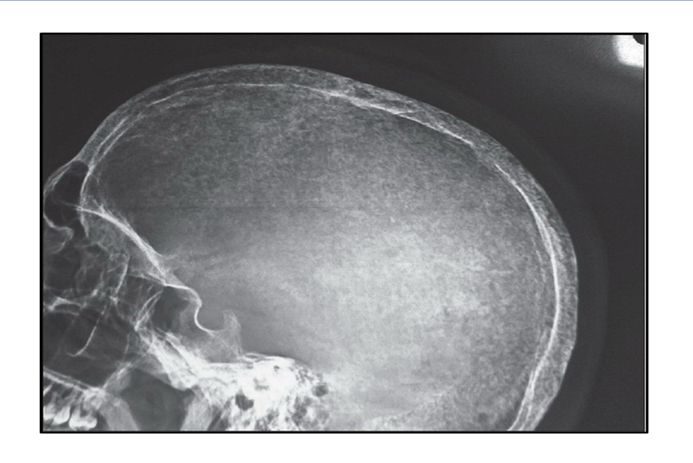

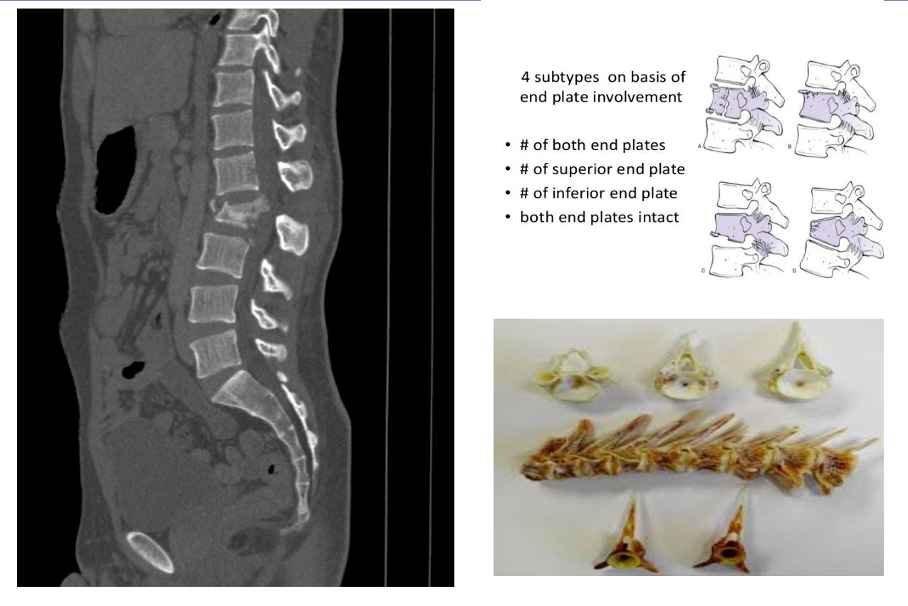

*Slide 19: 4 subtypes of vertebral fracture by end-plate involvement: (1) both end plates · (2) superior end plate · (3) inferior end plate · (4) both end plates intact.*

**Localisation (slide 20):**
- **Technetium visualises only the thyroid; thallium visualises thyroid AND parathyroid.** Subtracting one from the other leaves the parathyroid.
- *[added]* The modern standard is the **⁹⁹ᵐTc-sestamibi** scan. The adenoma retains tracer on the 2-hour delayed image while the thyroid washes out, as shown on the slide's 15-minute vs 2-hour images.
- ⭐ **Clinical pearl:** **parathyroid imaging is for surgical planning, NOT for the initial diagnosis.** The diagnosis is **biochemical** (Ca + PTH).

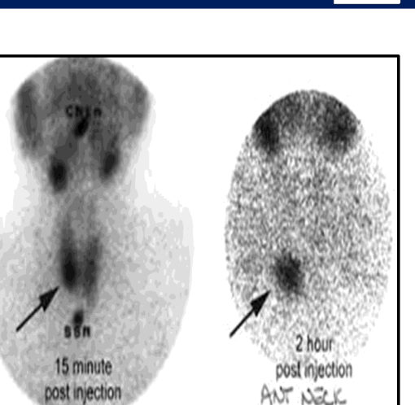

> 🔁 **Recap: HPT diagnosis.** 1ry = adenoma 90% (also hyperplasia, carcinoma, MEN). 2ry = CKD, malabsorption. 3ry = autonomous after long 2ry. Ectopic PTH is very rare. Most patients are asymptomatic; otherwise stones, bones, groans, moans, thrones. Brown tumours = osteitis fibrosa cystica (haemosiderin). Labs: ↑Ca, ↓PO₄, ↑ALP, ↑PTH, urinary cAMP ↑, hypercalciuria. X-ray: salt-and-pepper skull, cod-fish spine, stones. Imaging only localises for surgery. Dent test: HPT hypercalcaemia does not suppress with steroids.
> 🔗 **Link:** Confirmed 1ry HPT with indications is a surgical disease. Surgery brings its own early complication.
> ▶️ **Up next: Treatment of HPT.**

---

### 2.7 Treatment: Surgical (Slides 21–22) ⭐
**Indications:** **all symptomatic patients**, and **asymptomatic patients** with ANY of:

| Criterion | Threshold |
|---|---|
| Age | **< 50 years** |
| Hypercalcaemia | Serum Ca **> 1 mg/dL above the ULN** |
| Renal involvement | **eGFR < 60 mL/min** · **hypercalciuria** · **nephrolithiasis or nephrocalcinosis** on imaging |
| Skeletal involvement | Reduced BMD (**T-score ≤ −2.5** at any site) · **vertebral fracture** |

> **Mnemonic: "50 – 1 – 60 – 2.5"** = age < **50**, Ca **1** above ULN, GFR < **60**, T-score ≤ −**2.5**, plus any stone or fracture.

**Operation (slide 22):**
- **Adenoma → removed.**
- **Hyperplasia → subtotal resection**: 3 glands removed and the 4th partially removed (3½-gland parathyroidectomy).

⭐ **Complication: hungry bone syndrome (slide 22)**
- **Cause:** rapid **mineralisation of decalcified bone**, in patients with **bone disease before surgery**.
- **Presentation:** **tetany** due to **hypocalcaemia + hypomagnesaemia**.
- **Prevention:** give **vitamin D before the operation**.
- **Treatment of post-op tetany:** **IV Ca + MgSO₄** (2–4 mL of 50% solution IV infusion every 4 h).

*[added] Also distinguish transient hypoparathyroidism from suppression of the remaining glands: PTH is low in that case, while in hungry bone PTH is normal or high and PO₄ is low.*

### 2.8 Treatment: Medical (Slide 23, Summary Slide 27)
**Indications:**
- Previous **unsuccessful surgery**
- Patient **refuses** the operation
- Patient **unfit** for surgery

**Drugs listed (slide 23):**
- **Orthophosphate salts** 1–3 g/day
- **Oestrogen** in women (found to ↓ serum Ca in 1ry HPT)
- **Dichloroethylene diphosphate** (experimental)

**Summary-slide (27) modern options:** ⭐ **cinacalcet** (a **calcimimetic** that lowers Ca and PTH) + **alendronate** (bisphosphonate for bone).

*Slide 23 lists older therapy. For exams, answer **cinacalcet** (± bisphosphonate) as the medical option, as on the summary slide.*

---

### 2.9 Hypercalcaemic Crisis (Slides 24–26) ⭐
**Definition:** serum Ca **> 13 mg%** (slide 24). The caution box on slide 25: **start immediate treatment if Ca > 14 mg/dL (> 3.5 mmol/L)**.

**Causes:**
1. **1ry HPT**
2. **Osteolytic carcinoma**
3. **Multiple myeloma**

**Manifestations:**
- **GIT:** abdominal pain, vomiting, constipation
- **Polyuria → dehydration**, weakness
- **Confusion → coma**
- **CVS:** arrhythmia, ⭐ **shortened QT**

**Treatment (slides 25–26):**

**1. Agents that ↑ urinary Ca excretion**

| Step | Detail |
|---|---|
| a) ⭐ **Hydration with isotonic saline: THE FIRST GOAL** | **4–6 L/day** may be needed |
| b) ⭐ **Furosemide** IV 100 mg/h **after the patient is rehydrated** | **NEVER without saline infusion**, or dehydration will worsen |
| c) **Dialysis** | For hypercalcaemia **complicated by renal failure** |

**2. Agents that affect bone Ca fluxes**

| Drug | Mechanism / indication |
|---|---|
| **Mithramycin** | Inhibits bone resorption; used particularly in **malignant** hypercalcaemia |
| **PG inhibitors** (indomethacin, aspirin) | Hypercalcaemia from **osteolytic metastases** |
| ⭐ **Bisphosphonates**: IV **pamidronate** | **Drug of choice (malignancy)**. Inhibit osteoclastic activity *(the slide adds "↑ phosphate level → ↓ Ca")* |
| **Calcitonin** (SC) | ↑ Ca excretion in urine, ↓ Ca release from bone. *[added]* **Fastest onset** (hours); tachyphylaxis after 48 h |
| ⭐ **Corticosteroids** (prednisone) | ↓ bone resorption + ↓ intestinal absorption. **First line for hypercalcaemia from vitamin D excess**: **myeloma, lymphoma, sarcoidosis**. **NOT beneficial in hyperparathyroidism** |

*[added] Others: **denosumab** (RANKL antibody; for bisphosphonate-refractory disease or renal failure); **cinacalcet** for parathyroid carcinoma.*

*Slide 25 is incomplete on the slide ("Diuretics:", "Steroids (Cortisone): is.", "→ ↓ serum Ca"). Slide 26 gives the complete content, which is used above.*

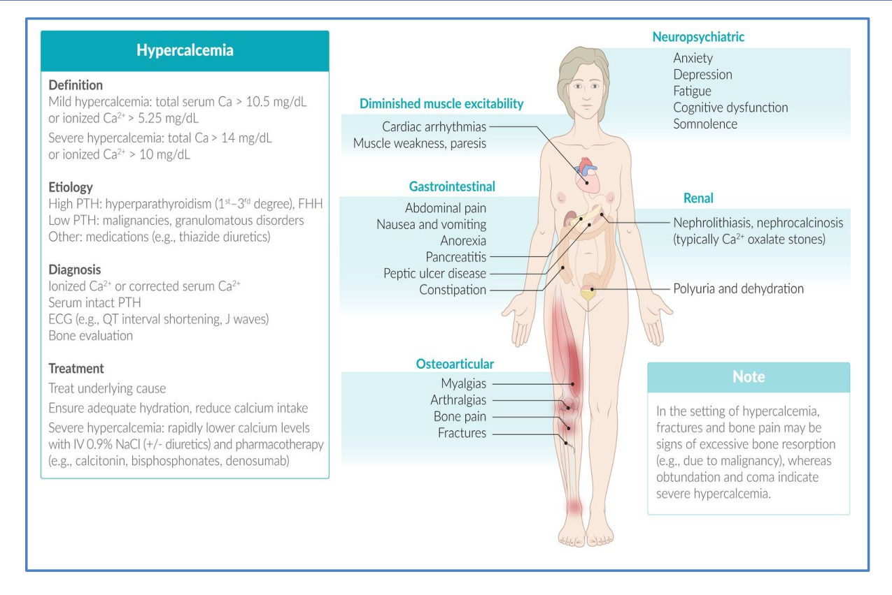

*Slide 34 definitions:*
- **Mild:** total Ca **> 10.5 mg/dL** or ionized **> 5.25**.
- **Severe:** total Ca **> 14 mg/dL** or ionized **> 10**.
- **Etiology:**
    - High PTH: HPT (1ry–3ry), **FHH**.
    - Low PTH: **malignancy**, **granulomatous disease**.
    - Other: **thiazides**.
- **ECG:** **short QT, J (Osborn) waves**.
- **Treatment:** severe → **IV 0.9% NaCl (± diuretics)** + calcitonin, bisphosphonates, denosumab.
- **Note:** fractures and bone pain suggest excessive bone resorption (e.g., malignancy); **obtundation and coma indicate severe hypercalcaemia**.

> 🔁 **Recap: Treatment and crisis.** Operate on symptomatic patients and on asymptomatic ones with age < 50, Ca > 1 above ULN, GFR < 60, stones/hypercalciuria, or T ≤ −2.5/fracture. Adenoma → excise; hyperplasia → 3½ glands. Hungry bone → tetany (low Ca + low Mg) → IV Ca + MgSO₄; prevent with pre-op vit D. Medical: cinacalcet ± alendronate. Crisis (> 13–14): saline first (4–6 L), furosemide only after rehydration, bisphosphonate (pamidronate) for malignancy, calcitonin, steroids for vit D-mediated causes (not HPT), dialysis if renal failure.
> 🔗 **Link:** HPT is only one cause of a high Ca. The differential is broad, and bone disease mimics it.
> ▶️ **Up next: Differential diagnosis.**

---

### 2.10 Differential Diagnosis: Causes of Hypercalcaemia (Slides 28–31) ⭐

| Group | Causes |
|---|---|
| **1. Endocrine** | **Hyperparathyroidism** · **hyperthyroidism** · **Addison's disease** · **acromegaly** |
| **2. Malignant** | ⭐ **Osteolytic metastases**: local bone destruction via **prostaglandins** or **osteoclast-activating factor (OAF)** · ⭐ **multiple myeloma (OAF)** · some **lymphomas secrete 1,25(OH)₂D₃** · ectopic **PTH/PTHrP** (e.g., **bronchogenic carcinoma**) |
| **3. Iatrogenic** | **Hypervitaminosis D** (treated with **cortisone**, which blocks vit D action on bone and intestine) · **hypervitaminosis A** · ⭐ **milk-alkali (Burnett) syndrome** · *[added]* **thiazides, lithium** |
| **4. Miscellaneous** | **Sarcoidosis** · **Paget's disease of bone** (only if **immobilised**) · **immobilisation** (paraplegia, fracture) · **idiopathic infantile hypercalcaemia (IIH)** |

**Milk-alkali (Burnett) syndrome (slide 30).** Seen in peptic ulcer patients who take excess milk and alkali for a long time.
- **Early:** mild **alkalosis**, **hypercalcaemia**, **hypercalciuria**.
- **Later:** **nephrocalcinosis**, renal damage, **uraemia** → **↓ serum Ca** and **renal acidosis**.
- *[added]* Modern version: **calcium carbonate supplements** for osteoporosis or dyspepsia.

**Idiopathic infantile hypercalcaemia (slide 31):**

| Form | Cause | Picture |
|---|---|---|
| **Reversible** | ↑ vit D intake by the mother **during lactation** | Failure to thrive, vomiting, abdominal pain, constipation |
| **Irreversible** | ↑ vit D intake by the mother **during pregnancy** | ⭐ **Supravalvular aortic stenosis**, **elfin facies**, mental retardation → **renal failure**. *[added]* This is the **Williams syndrome** phenotype (7q11.23 deletion); the "maternal vit D" mechanism on the slide is historical |

> **Mnemonic for hypercalcaemia: "CHIMPANZEES"** *[added]*
> - **C**alcium supplements (milk-alkali)
> - **H**yperparathyroidism / **H**yperthyroidism
> - **I**atrogenic (thiazides) / **I**mmobilisation
> - **M**ultiple myeloma / **M**ilk-alkali
> - **P**aget's (immobilised)
> - **A**ddison's / **A**cromegaly
> - **N**eoplasm
> - **Z**ollinger–Ellison (MEN 1)
> - **E**xcess vit **D**
> - **E**xcess vit **A**
> - **S**arcoidosis

### 2.11 Causes of Generalised Bone Disease (Slides 32–33)
These conditions can mimic HPT bone disease:

1. **Renal osteodystrophy** (see chronic renal failure)
2. **Osteomalacia, osteoporosis**
3. **Paget's disease of bone:**
    - **High ALP**
    - ↑ Ca **only if the patient is immobilised**
    - X-ray: **lytic areas alongside dense areas** (new bone formation)
    - Slide figure: chronic osteitis of older people, with thickening, hypertrophy and **deformity of long and flat bones**, e.g. bowed tibia
4. **McCune–Albright syndrome** (rare):
    - **Fibrous dysplasia (unilateral)**
    - **Areas of pigmentation** (*[added]* café-au-lait with a "coast of Maine" border)
    - **Precocious puberty (in girls)**
5. **Osteoblastoma:** radiological appearance **similar to osteitis fibrosa cystica but with NO biochemical changes**

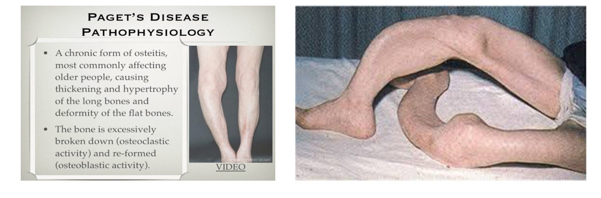 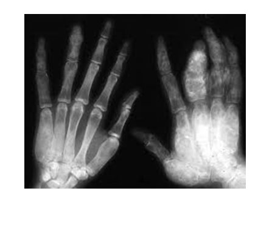

### 2.12 Case & Summary (Slides 27, 35–38)
**Case (slides 35–37):**
- **Patient:** 63-year-old woman on **dialysis** with **CKD**, DM, HTN and depression, on **sevelamer** and **sodium bicarbonate**.
- **Presentation:** severe low back pain, L2 tenderness. X-ray: **wedge compression fracture of L2**.
- **Labs:** Ca **8.2**, creatinine **3.8**, BUN 33, Hb 10.1, platelets 130 000.
- **Question:** most likely explanation? *(Answered in §7, Q1.)*

**Summary table (slide 27)** ⭐

| Type | Ca | PO₄ | ALP | PTH | Management |
|---|---|---|---|---|---|
| **Primary** | ↑ | ↓ | ↑ | ↑ / = | **Screen for MEN**; **surgical removal is first line**; unfit → **alendronate + cinacalcet** |
| **Secondary** | ↓ | ↑ | ↑ | ↑ | **Medical therapy first line**, treat the cause. CKD: **phosphate binders (sevelamer)**, **Ca supplements**, **vit D replacement** |
| **Tertiary** | ↑ | ↑ | ↑ | ↑ | **Surgical removal first line**; **cinacalcet** as adjunct |

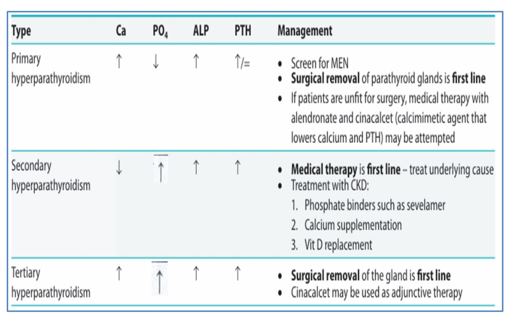

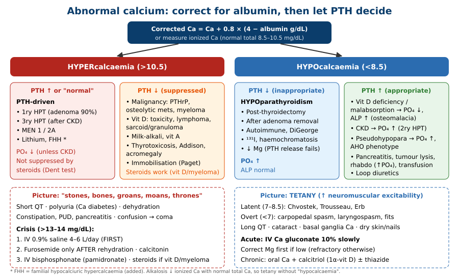

> 🔁 **Recap: Differential.**
> - **Endocrine:** HPT, thyrotoxicosis, Addison's, acromegaly.
> - **Malignancy:** osteolytic mets (PG/OAF), myeloma (OAF), lymphoma (calcitriol), PTHrP.
> - **Iatrogenic:** vit D/A, milk-alkali.
> - **Miscellaneous:** sarcoid, immobilisation, Paget's if immobilised, IIH.
> - **Bone mimics:** renal osteodystrophy, osteomalacia, osteoporosis, Paget's (↑ALP), McCune–Albright, osteoblastoma (normal biochemistry).
> - **The three HPT types:** 1ry ↑Ca ↓PO₄ → surgery; 2ry ↓Ca ↑PO₄ → binders + Ca + vit D; 3ry ↑Ca ↑PO₄ → surgery.

---

## 3. High-Yield Comparison Tables

### Table A: Lab Patterns
| Condition | Ca | PO₄ | ALP | PTH | Extra |
|---|---|---|---|---|---|
| **1ry HPT** | ↑ | ↓ | ↑ (if bone disease) | ↑ / inappropriately normal | ↑ urinary cAMP, hypercalciuria |
| **2ry HPT (CKD)** | ↓ / N | ↑ | ↑ | ↑ | ↓ calcitriol, ↑ creatinine |
| **2ry HPT (vit D def / malabsorption)** | ↓ / N | ↓ | ↑ | ↑ | ↓ 25-OH-D *[added]* |
| **3ry HPT** | ↑ | ↑ | ↑ | ↑↑ | CKD / post-transplant |
| **Malignancy (PTHrP)** | ↑↑ | ↓ | ± | **↓** | ↑ PTHrP *[added]* |
| **Osteolytic mets / myeloma** | ↑ | N / ↑ | ↑ (mets) / **N (myeloma)** *[added]* | ↓ | M-protein, Bence Jones |
| **Vit D excess / granuloma / lymphoma** | ↑ | **↑** | N | ↓ | ↑ 1,25-D; **steroid-responsive** |
| **Milk-alkali** | ↑ | N / ↑ | N | ↓ | **Metabolic alkalosis**, renal impairment |
| **Paget's** | N (↑ if immobilised) | N | **↑↑** | N | Lytic + sclerotic X-ray |
| **Osteoblastoma** | N | N | N | N | X-ray mimics OFC |

### Table B: Hypercalcaemia Drugs
| Drug | Onset *[added]* | Best for | Caution |
|---|---|---|---|
| **IV normal saline** | Immediate | **ALL: first step** | Fluid overload in HF/CKD |
| **Furosemide** | Hours | After rehydration | **Never before saline** |
| **Calcitonin** (SC) | **4–6 h** | Bridge while bisphosphonate acts | Tachyphylaxis |
| **IV pamidronate / zoledronate** | 2–4 days | ⭐ **Malignancy (drug of choice)** | Renal function, jaw ONJ *[added]* |
| **Glucocorticoids** | Days | ⭐ **Vit D excess, myeloma, lymphoma, sarcoid** | **Useless in HPT** |
| **Mithramycin** | | Malignant (historical) | Toxic |
| **Indomethacin/aspirin** | | Osteolytic mets (PG-mediated) | |
| **Dialysis** | Immediate | **Renal failure** | |
| **Cinacalcet** | | 1ry HPT unfit for surgery, 3ry, parathyroid Ca | Hypocalcaemia |

### Table C: Primary vs Secondary vs Tertiary
| | Primary | Secondary | Tertiary |
|---|---|---|---|
| Driver | Gland (adenoma 90%) | Low Ca (CKD, malabsorption) | Autonomous after long 2ry |
| Ca | **↑** | **↓ / N** | **↑** |
| PO₄ | **↓** | ↑ (CKD) | ↑ |
| First-line Rx | **Surgery** | **Medical** | **Surgery** |
| Medical option | Cinacalcet + alendronate | Sevelamer + Ca + vit D | Cinacalcet (adjunct) |

### Table D: Radiology Signs
| Sign | Meaning |
|---|---|
| **Salt-and-pepper skull** | HPT (punched-out lesions) |
| **Brown tumour** (osteitis fibrosa cystica) | HPT; haemosiderin; jaw and long bones |
| **Cod-fish spine** | Softened vertebrae indented by discs (HPT / osteomalacia) |
| **Looser zone / Milkman fracture** | Pseudofracture of **osteomalacia** (upper femur, humerus) |
| **Nephrocalcinosis / stones** | Hypercalciuria |
| *[added]* **Rugger-jersey spine** | **Renal osteodystrophy** (2ry HPT) |
| *[added]* **Subperiosteal resorption, radial middle phalanges** | Most specific sign of HPT |
| **Lytic + dense areas, ↑ ALP** | **Paget's** |

---

## 4. Rules, Exceptions, Patterns

| Rule | Exception / nuance |
|---|---|
| Low total Ca → tetany | **Low albumin** (cirrhosis, nephrotic) → low total, **normal ionized → no tetany** |
| PTH lowers PO₄ | In **renal failure** PO₄ stays **high** (2ry / 3ry HPT) |
| HPT → ↑ Ca | **2ry HPT → Ca low or normal** |
| HPT patients are symptomatic | ⭐ **Most are asymptomatic** |
| Fractures heal slowly in bone disease | HPT fractures **heal rapidly** (hypercalcaemia) (slide 11) |
| Steroids lower Ca | **Not in HPT** (basis of the **Dent test**); they work for vit D-mediated causes (myeloma, lymphoma, sarcoid, vit D toxicity) |
| Diuretics treat hypercalcaemia | **Loop only**, **after saline**. **Thiazides raise Ca** |
| Paget's has normal Ca | **↑ Ca if immobilised** |
| Imaging finds the adenoma | Use **only for surgical planning**, never for diagnosis |
| Parathyroid surgery cures | Watch for **hungry bone** → hypocalcaemia + **hypomagnesaemia** |
| Malignancy hypercalcaemia = ectopic PTH | Usually **PTHrP**; true ectopic PTH is **very rare** |
| Osteoblastoma looks like OFC | **Biochemistry is normal** |

---

## 5. Clinical Correlations
- **Routine bloods show Ca 11.2, low PO₄, high PTH in an asymptomatic 45-year-old** → 1ry HPT. Age < 50 → **parathyroidectomy**. Image (sestamibi/US) only to plan the operation.
- **Recurrent renal stones + peptic ulcers + pituitary adenoma** → **MEN 1**.
- **HPT + medullary thyroid cancer + pheochromocytoma** → **MEN 2A**. *[added]* **Remove the pheo first.**
- **Dialysis patient with bone pain, high PO₄, high PTH, low/normal Ca** → **2ry HPT / renal osteodystrophy** → sevelamer, calcitriol, Ca, cinacalcet.
- **Renal transplant recipient whose Ca is now high** → **3ry HPT** → parathyroidectomy.
- **Smoker with hilar mass, Ca 14, low PTH** → **squamous cell carcinoma → PTHrP** → saline + bisphosphonate. *[Lung cancer lecture link]*
- **Elderly patient with back pain, anaemia, renal impairment, hypercalcaemia** → **myeloma** → saline + bisphosphonate + **steroids**.
- **Sarcoidosis patient with hypercalcaemia** → granuloma 1α-hydroxylase → **steroids**.
- **Patient taking antacids + milk for an ulcer, with alkalosis, high Ca and renal impairment** → **milk-alkali**.
- **Day 2 after parathyroidectomy: tingling, Chvostek positive** → **hungry bone** → IV Ca gluconate + MgSO₄.
- **Confused, vomiting, polyuric patient with short QT and Ca 15** → crisis → **IV saline first**.

---

## 6. Rapid Revision (Last-Day)
1. **PTH:** ↑Ca ↓PO₄ (direct bone + kidney; indirect gut via vit D). **Vit D:** ↑ both. **Calcitonin:** ↓ both.
2. 99% of Ca is in bone. Serum Ca: **50% ionized**, 40% albumin-bound, 10% complexed.
3. **Corrected Ca = Ca + 0.8 × (4 − albumin)**. Low albumin → no tetany.
4. Normal total Ca **8.5–10.5 mg/dL**; ionized **4.65–5.25 mg/dL**; PO₄ **3–4.5**.
5. **1ry HPT:** adenoma **90%**, hyperplasia, carcinoma, MEN 1/2A. **2ry:** CKD, malabsorption, gastrectomy. **3ry:** autonomous after 2ry. **Ectopic:** bronchogenic carcinoma, RCC (rare).
6. **Most patients are asymptomatic.** Otherwise **stones, bones, abdominal groans, thrones, psychiatric overtones**.
7. **Ca diabetes** (polyuria), **band keratopathy**, **pseudogout**, **short QT**, HTN, **PUD (ZES)**, **pancreatitis**, constipation, dry itchy skin.
8. **Osteitis fibrosa cystica = brown tumour** (haemosiderin; jaw and long bones).
9. Labs: ↑Ca, ↓PO₄ (unless CKD), ↑ALP (bone), ↑PTH, **↑ urinary cAMP**, urine Ca **> 300 mg/24 h**.
10. X-ray: **salt-and-pepper skull**, **cod-fish spine**, stones, nephrocalcinosis, soft-tissue Ca. **Looser zones = osteomalacia.**
11. Localisation: US/CT neck, **Tc–thallium** (subtraction), arteriography. **Imaging is for surgery, not diagnosis.**
12. **Dent test:** HPT hypercalcaemia is **not steroid-suppressible**.
13. **Surgery if symptomatic**, or asymptomatic with **age < 50, Ca > 1 above ULN, eGFR < 60, hypercalciuria/stones, T ≤ −2.5, vertebral fracture**.
14. Adenoma → excise; hyperplasia → **3½ glands**.
15. **Hungry bone:** tetany (↓Ca + ↓Mg) → **IV Ca + MgSO₄**; prevent with **pre-op vit D**.
16. Medical: **cinacalcet + alendronate** (older: orthophosphate, oestrogen).
17. **Crisis > 13 (treat immediately > 14):** **saline 4–6 L FIRST** → furosemide after rehydration → **pamidronate (DOC in malignancy)**, calcitonin, **steroids for vit D excess/myeloma/lymphoma/sarcoid (not HPT)**, dialysis if renal failure.
18. Hypercalcaemia causes: endocrine (HPT, thyrotoxicosis, Addison, acromegaly), malignant, iatrogenic (vit D/A, **milk-alkali**), miscellaneous (sarcoid, immobilisation, Paget's if immobilised, IIH).
19. Bone mimics: renal osteodystrophy, osteomalacia, osteoporosis, **Paget's (↑ALP)**, **McCune–Albright** (fibrous dysplasia + pigmentation + precocious puberty), **osteoblastoma (normal biochemistry)**.
20. **1ry ↑Ca ↓PO₄ → surgery · 2ry ↓Ca ↑PO₄ → medical · 3ry ↑Ca ↑PO₄ → surgery.**

---

## 7. Exam-Style Questions

**Q1 (lecture case, slides 35–37).** A 63-year-old woman on dialysis for CKD (taking sevelamer and sodium bicarbonate) has an L2 wedge compression fracture. Ca is 8.2 mg/dL and creatinine 3.8 mg/dL. What is the most likely explanation?
A. Tertiary HPT · B. Senile osteoporosis · C. Secondary HPT · D. Postmenopausal osteoporosis · E. Elder abuse · F. Pseudohypoparathyroidism · G. Primary HPT

> **Answer: C. Secondary hyperparathyroidism** (renal osteodystrophy). *[reasoning added; key not on slides]*
> - In CKD, ↓ calcitriol and ↑ PO₄ lead to low/normal Ca and a chronic rise in PTH. That causes high-turnover bone loss and fragility fractures.
> - She is on **sevelamer**, a phosphate binder for 2ry HPT (slide 27).
> - **Tertiary** and **primary** HPT would give **high** Ca; hers is 8.2.
> - Osteoporosis alone ignores the CKD-mineral bone disorder.
> - The family conflict is a distractor for **elder abuse**; fracture pattern and context fit metabolic bone disease.
> - **Pseudohypoparathyroidism** is congenital, with AHO features.

**Q2.** A 52-year-old woman has kidney stones. Ca 11.6 mg/dL (ULN 10.5), PO₄ 2.1, PTH raised, eGFR 85, DEXA T-score −1.8. Which is the most appropriate management?
A. Observation with yearly Ca · B. Parathyroidectomy · C. Cinacalcet · D. Prednisolone · E. Sestamibi scan to confirm the diagnosis

> **Answer: B.**
> - This is **1ry HPT** with **nephrolithiasis**, and her Ca is **> 1 mg/dL above the ULN**. Either alone is a surgical indication (slide 21).
> - **Cinacalcet** is for patients unfit for or refusing surgery.
> - **Steroids don't work** in HPT.
> - **Imaging is for localisation, not diagnosis** (slide 20).

**Q3.** A 70-year-old man is confused and vomiting. Ca 15.2 mg/dL, dry mucosa, BP 98/60, creatinine mildly raised. What is the FIRST step?
A. IV furosemide · B. IV pamidronate · C. IV 0.9% saline · D. SC calcitonin · E. Oral prednisolone

> **Answer: C.**
> - **Rehydration with isotonic saline is the first goal** (slide 26).
> - **Furosemide must never precede saline**, because it worsens dehydration.
> - Bisphosphonate and calcitonin come next.

**Q4.** Hypercalcaemia that does NOT fall after a course of hydrocortisone most likely comes from:
A. Sarcoidosis · B. Vitamin D intoxication · C. Multiple myeloma · D. **Primary hyperparathyroidism** · E. Lymphoma

> **Answer: D.**
> - This is the **Dent steroid suppression test** (slide 20): **HPT hypercalcaemia does not suppress**.
> - Steroids work in vit D-mediated causes (A, B, C, E) (slide 26).

**Q5.** The day after removal of a parathyroid adenoma, a patient with long-standing osteitis fibrosa cystica develops perioral tingling and carpopedal spasm. Ca is 6.9, Mg is low, PO₄ is low. What is the best treatment, and how could it have been prevented?
A. Oral Ca; nothing · B. **IV Ca + MgSO₄; pre-operative vitamin D** · C. IV saline; pre-op bisphosphonate · D. Thiazide; pre-op cinacalcet · E. PTH injection; pre-op oestrogen

> **Answer: B.**
> - This is **hungry bone syndrome**: rapid remineralisation causes **hypocalcaemia + hypomagnesaemia**.
> - Treat with **IV Ca + MgSO₄**; prevent with **vit D before surgery** (slide 22).

---

## 8. Exam Pitfalls & Traps
- **Normal-range conflicts in the lecture:**
    - Total Ca is given as **8.4–10.2** (slide 7), **8.5–10.5** (slides 7, 8, 34) and **9–10.5** (slide 15). Use **8.5–10.5 mg/dL** unless the question gives a range.
    - Ionized Ca: slide 8 says "< 4.5 mg/dL" with a normal of **4.65–5.25**.
- **Albumin units:** slide 7 writes "below 4 **mg**/dL". Albumin is in **g/dL**; the formula is unchanged.
- **Crisis threshold:** slide 24 says **> 13 mg%**; slide 25 and slide 34 say **> 14 mg/dL**. Know both and quote the source the question implies.
- **Slide 25 is incomplete** ("Diuretics:", "Steroids (Cortisone): is."). Slide 26 gives the full regimen.
- **Medical therapy:** slide 23 lists old drugs (orthophosphate, oestrogen, dichloroethylene diphosphate), while the summary slide uses **cinacalcet + alendronate**. Modern MCQs expect **cinacalcet**.
- **Bisphosphonate mechanism:** the slide says "↑ phosphate level → ↓ Ca". The core mechanism is **osteoclast inhibition**.
- **Furosemide before saline** is a classic wrong answer.
- **Steroids for HPT hypercalcaemia** is a wrong answer. Steroids are right for **myeloma, lymphoma, sarcoid and vit D toxicity**.
- **2ry HPT has LOW/normal Ca.** A dialysis patient with **high** Ca → **tertiary**.
- **Thiazide-induced hypercalcaemia** can unmask 1ry HPT. Loop diuretics lower Ca.
- **Looser zones** belong to **osteomalacia**, even though slide 16 lists them under HPT radiology.
- **Paget's** gives very high ALP with **normal Ca** unless the patient is immobilised.
- **Osteoblastoma vs OFC:** same X-ray, but osteoblastoma has **normal labs**.
- **Irreversible IIH** (supravalvular AS, elfin facies) = **Williams syndrome** phenotype. The slide's maternal-vit D explanation is outdated *[added]*.
- **Ectopic PTH** is "very rare". Most cancer hypercalcaemia = **PTHrP** (squamous lung, breast, RCC) or osteolysis, with **suppressed PTH**.
