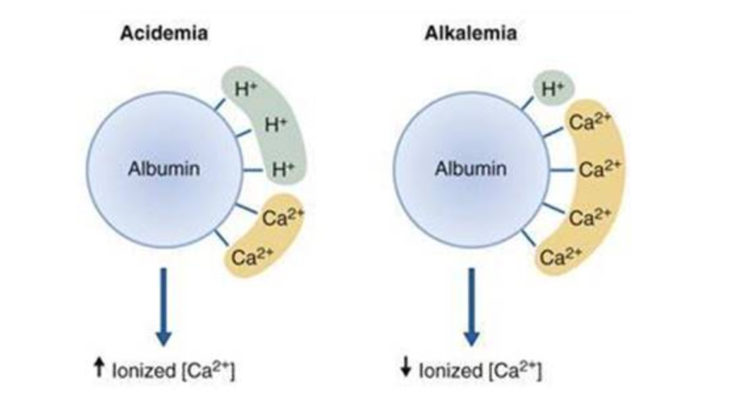
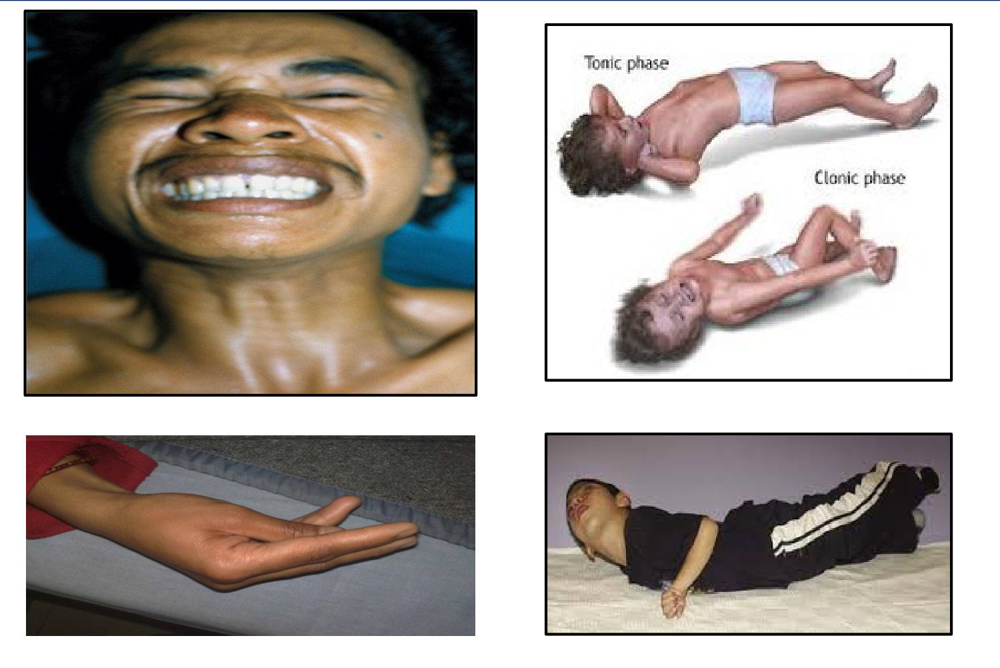
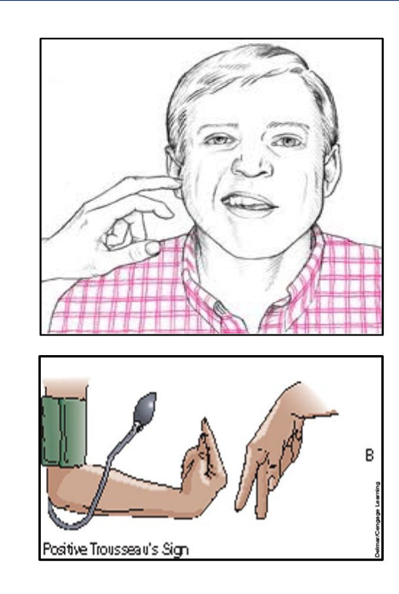
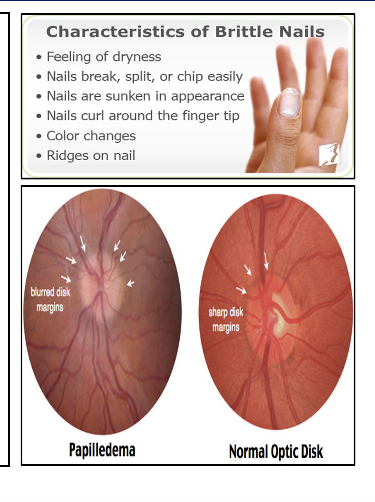
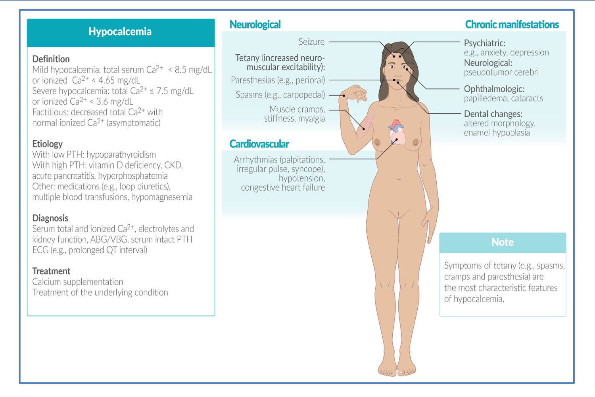
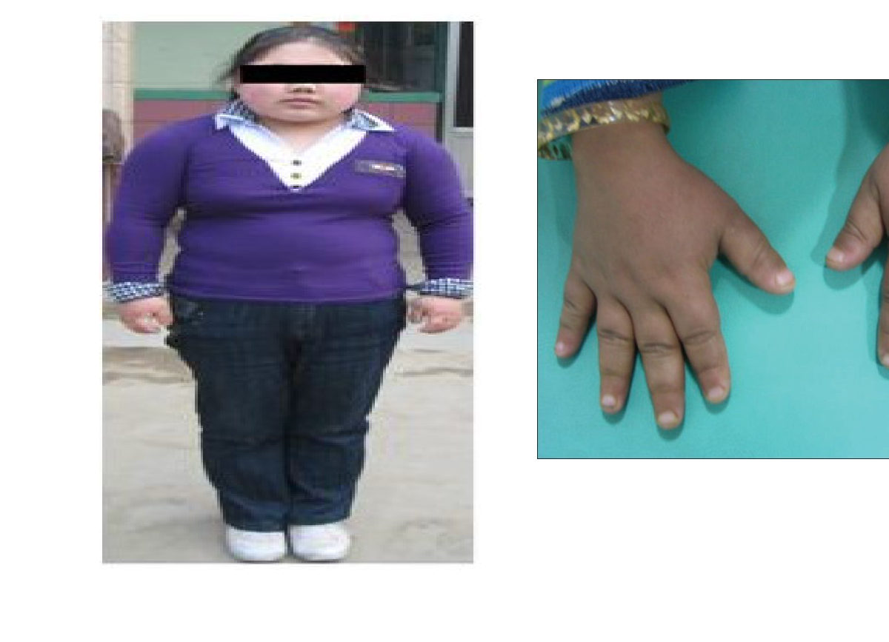
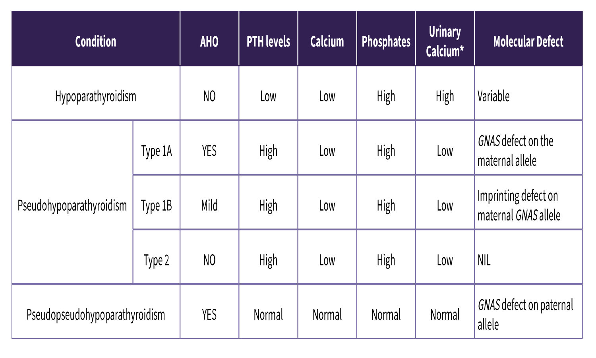
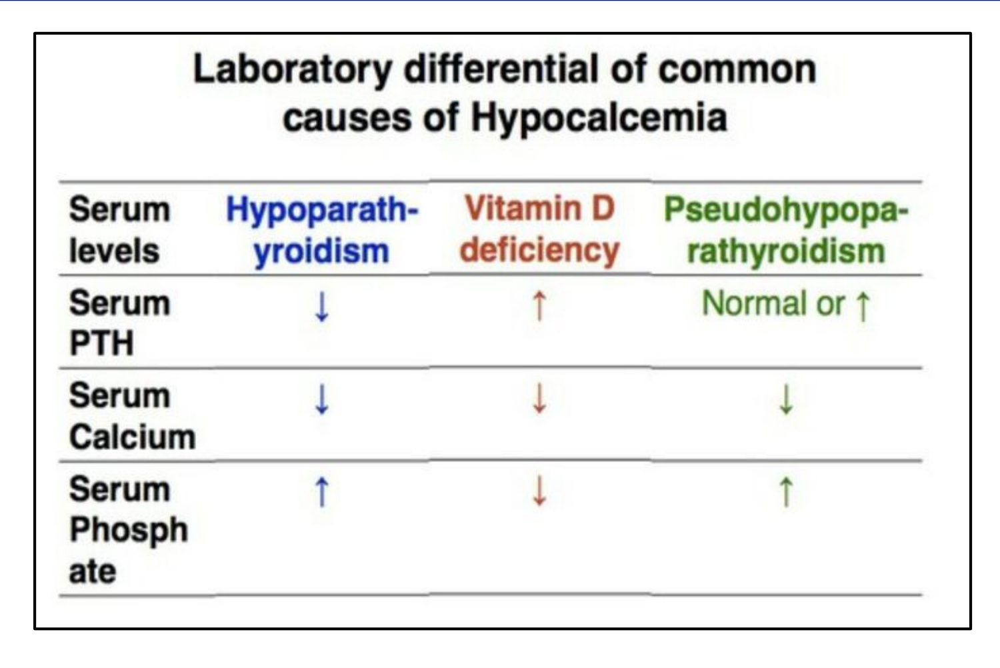

# Parathyroid Disorders II: Hypoparathyroidism & Approach to Hypocalcaemia
**Internal Medicine Department** | Source: `8-Hypoparathyroidism-Approach_to_a_case_of_calcium_disorders.pdf` (28 slides)

> **Legend:** ⭐ = high-yield · *[added]* = not on slides. Images marked "Slide N" come from the lecture; "Added diagram" = drawn for these notes.

> 🔗 **Bridge from Parathyroid Disorders I (Hyperparathyroidism):**
> - Same physiology: PTH raises Ca and lowers PO₄; corrected Ca = Ca + 0.8 × (4 − albumin); **low albumin gives low total Ca without tetany**.
> - This lecture is the mirror image. **Excess PTH** gave stones, bones, groans and a **short QT**. **Too little PTH** (or too little ionized Ca) gives **tetany** and a **long QT**.
> - Two links to remember:
>     - **Hungry bone syndrome** after parathyroidectomy was the bridge case.
>     - **Thyroidectomy** (Thyroid 2 lecture) is the commonest cause of hypoparathyroidism.

---

## 1. Title / Objectives

| Domain | Objective | Likely tested as |
|---|---|---|
| Knowledge | Pathophysiology and etiology of parathyroid disorders | Hereditary vs acquired causes |
| Knowledge | ⭐ Manifestations, complications and management of **hypoparathyroidism** | Tetany signs; IV Ca gluconate |
| Knowledge | ⭐ Causes and manifestations of **hypocalcaemia** | PTH-low vs PTH-high differential |
| Skill | Interpret findings and investigations → diagnosis | Ca / PO₄ / PTH / ALP pattern |
| Skill | Management plan for hypoparathyroidism | Acute vs maintenance |
| Skill | ⭐ Emergency recognition (laryngospasm, seizures) | Post-thyroidectomy tetany |

**Lecture flow:** Tetany (definition, causes: hypocalcaemia / alkalosis / hypomagnesaemia) → Clinical picture (overt vs latent tetany, chronic manifestations) → Investigation and treatment of tetany → Hypoparathyroidism (causes, CP, investigations, treatment) → Differential diagnosis (pseudohypoparathyroidism, pseudo-pseudohypoparathyroidism) → Lab tables → Cases.

---

## 2. Main Content (Lecture Order)

### 2.1 Tetany: Definition & Causes (Slides 4–6) ⭐
**Tetany** = a state of **↑ neuromuscular excitability** with intermittent muscular spasms.

**1. Hypocalcaemia: a *quantitative* ↓ of serum Ca**

| | Cause | Mechanism |
|---|---|---|
| A | ⭐ **Hypoparathyroidism** | ↓ PTH |
| B | **↓ Ca intake** | Prolonged starvation, anorexia, dysphagia |
| C | **Defective absorption** | **Steatorrhoea** (fat + Ca → **Ca soaps**); **vit D deficiency** (rickets, osteomalacia) |
| D | **Severe acute hyperphosphataemia** | **Acute renal failure**, **tumour lysis** (Ca × P precipitates) |
| E | **Precipitation of Ca in tissues** | ⭐ **Acute pancreatitis** (saponification) |

**2. Alkalosis: a *qualitative* change**
- **Total Ca is unchanged** but the **ionized fraction ↓**; **P is normal**.
- Mechanism: in alkalaemia, albumin releases H⁺ and binds more Ca²⁺. Acidaemia does the opposite.
- Causes:
    - Excess **alkali ingestion**
    - Frequent **vomiting**
    - **Hypokalaemic alkalosis** (e.g., **Conn's syndrome**)
    - ⭐ **Hyperventilation** (hysterical)

**3. Magnesium tetany: ↓ Mg**
- Prolonged **IV infusion without Mg supplementation**
- **Severe diarrhoea**
- **Malabsorption**
- *[added]* Also PPIs, alcohol, loop/thiazide diuretics, cisplatin. Low Mg **impairs PTH secretion and action**.

> **Mnemonic: tetany = "Low Ca, High pH, Low Mg"** *[added]*. Only the first is a true low total calcium.

### 2.2 Clinical Picture: Overt (Manifest) Tetany, Serum Ca < 7 mg% (Slides 7–8) ⭐

| | Feature | Detail |
|---|---|---|
| A | **Paraesthesia** | Extremities and **around the mouth** (perioral) |
| B | ⭐ **Carpopedal spasm** | Painful spasms. **Hands:** adduction of the thumb, flexion of the wrist and MCP joints, **extension of the fingers**. **Feet:** plantar flexion of the toes with inversion; the patient may fall on their face |
| C | **Spasm of other muscles** | ⭐ **Laryngospasm** → respiratory obstruction → sudden dyspnoea in children (**laryngismus stridulus**), may be fatal · facial and masseter → ⭐ **risus sardonicus** · back muscles → **opisthotonus** |
| D | **Tonic and clonic spasms** | May end in **generalised convulsions** |

### 2.3 Latent Tetany, Serum Ca 7–8.5 mg% (Slides 9–10) ⭐
**A. Provoked by:**

| Sign | How | Positive result |
|---|---|---|
| ⭐ **Chvostek's sign** | **Tap the facial nerve in front of the ear** | **Twitching of facial muscles** (same side) |
| ⭐ **Trousseau's sign** | **Occlude the radial pulse with a BP cuff for 4 min** | **Carpal spasm** (*main d'accoucheur*, "obstetrician's hand") |
| **Erb's sign** | Electrical stimulation | Contraction with **< 4 mA** (normally **≥ 8 mA** needed) |

*[added] Trousseau is more specific than Chvostek. Chvostek is positive in ~10% of normal people.*

**B. Manifestations (chronic):**

| System | Features |
|---|---|
| **Skin** (only in **hypocalcaemia**, not alkalosis) | **Dry skin**, **sparse hair**, **brittle nails**, **hypoplastic teeth** |
| **CNS** | Irritability, anxiety, psychosis, **epilepsy** (*[added]* basal ganglia calcification → parkinsonism) |
| **CVS** | **Hypotension**, **refractory heart failure**, ⭐ **prolonged QT**, arrhythmias |
| **Eyes** | ⭐ **Cataract**, **papilloedema** |
| **Articular** | **Periarticular calcification** (chondrocalcinosis) |

**Slide 20 (hypocalcaemia overview):**
- **Definition:**
    - Mild: total Ca **< 8.5** or ionized **< 4.65 mg/dL**.
    - Severe: total **≤ 7.5** or ionized **< 3.6**.
    - **Factitious:** low total with **normal ionized** (asymptomatic).
- **Etiology:**
    - Low PTH: **hypoparathyroidism**.
    - High PTH: **vit D deficiency, CKD, acute pancreatitis, hyperphosphataemia**.
    - Other: **loop diuretics**, **multiple blood transfusions** (citrate), **hypomagnesaemia**.
- **Diagnosis:** total and ionized Ca, electrolytes, renal function, **ABG/VBG**, **intact PTH**, **ECG (long QT)**.
- **Chronic features:** anxiety/depression, **pseudotumour cerebri**, papilloedema, cataracts, dental enamel hypoplasia.
- **Note:** **tetany (spasms, cramps, paraesthesia) is the most characteristic feature.**

### 2.4 Investigation & Treatment of Tetany (Slide 11)
**Investigation (for the cause):**

| Cause | Findings |
|---|---|
| **Hypoparathyroidism** | **↓ PTH, ↓ serum Ca, ↑ P** |
| **Hypomagnesaemia** | Low Mg; slide says "**refractory hypokalaemia**" (*[added]* also **refractory hypocalcaemia**: Ca won't correct until Mg is replaced) |
| **Alkalosis** | **↑ pH, ↓ ionized Ca** (total Ca normal) |

**Treatment:**
- **a. Acute attack:** ⭐ **IV Ca gluconate 10 mL of 10%, very slowly**.
- **b. Treat the cause:**
    - Hypocalcaemia → **oral Ca + vit D**
    - Hypomagnesaemia → **oral Mg**
    - Alkalosis → treat the cause; **acidifying drug**

*[added]:*
- **Hyperventilation tetany:** rebreathe into a bag / reassure.
- **Never give IV Ca with bicarbonate in the same line** (it precipitates).
- **Calcium chloride extravasation** causes necrosis.
- **Monitor ECG**, especially if the patient is on **digoxin** (IV Ca increases toxicity).

> 🔁 **Recap: Tetany.** Increased neuromuscular excitability from three causes: low Ca (hypopara, low intake or absorption, high PO₄, pancreatitis), alkalosis (normal total, low ionized: vomiting, Conn's, hyperventilation), or low Mg. Overt (< 7): perioral paraesthesia, carpopedal spasm, laryngospasm, risus sardonicus, opisthotonus, fits. Latent (7–8.5): Chvostek, Trousseau (4 min), Erb (< 4 mA). Chronic: dry skin/brittle nails, cataract, papilloedema, long QT, refractory HF. Acute treatment: slow IV Ca gluconate 10%, then treat the cause.
> 🔗 **Link:** The prototype of PTH-deficient hypocalcaemia is hypoparathyroidism itself.
> ▶️ **Up next: Hypoparathyroidism.**

---

### 2.5 Hypoparathyroidism: Causes (Slides 12–13) ⭐

| Type | Causes |
|---|---|
| **1. Hereditary** | **Isolated**, or combined with other endocrine deficiencies (ovaries, adrenals…) from autoantibodies → **polyglandular autoimmune deficiency syndrome** (*[added]* APS-1: hypopara + Addison + mucocutaneous candidiasis, AIRE gene) · with **absent thymus → DiGeorge syndrome** (*[added]* 22q11 deletion; **CATCH-22**: Cardiac, Abnormal facies, Thymic aplasia, Cleft palate, Hypocalcaemia) |
| **2. Acquired** | ⭐ **Accidental surgical removal during thyroidectomy** (commonest) · **after removal of a parathyroid adenoma** (the other 3 glands were suppressed by the high Ca) → **temporary** · **intraglandular haemorrhage in the newborn** (*tetania neonatorum*) · **after ¹³¹I treatment** of the thyroid · **haemochromatosis** (*[added]* also Wilson's, metastatic infiltration, **hypomagnesaemia**) |

### 2.6 Clinical Picture & Investigations (Slide 14)
1. **Acute hypoparathyroidism** → usually **manifest tetany**.
2. **Chronic hypoparathyroidism** → **latent tetany + ectodermal + CNS changes**.

⭐ **NB:** soft-tissue Ca deposition is **promoted by the hyperphosphataemia of PTH deficiency**. In **vit D deficiency**, the low Ca comes with **normal or low PO₄**, so there is no such deposition.

**Investigations:**
- **↓ serum Ca**
- **↑ serum P**
- **↓ serum PTH**
- *[added]* **Normal ALP** (no osteomalacia)
- *[added]* **Check Mg**

### 2.7 Treatment (Slide 15) ⭐

| Phase | Regimen |
|---|---|
| **A. Acute hypoparathyroidism (tetany)** | ⭐ **Ca gluconate 20 mL 10% IV** (can be ↑ to **100 mL / 4 h**) |
| **B. Maintenance** | 1. **Ca gluconate 1.5–3 g t.d.s.** + 2. **Vit D (calciferol)** 50,000 IU/day (1.25 mg; 1 mg = 40,000 IU), or better **dihydrotachysterol (AT 10)**, OR 3. ⭐ **1α-vit D₃ / calcitriol 0.2–1 µg/day** · 4. ⭐ **Thiazides → ↓ urinary Ca excretion** · 5. Treat the cause of **alkalosis** if present |

*[added]:*
- Calcitriol (or alfacalcidol) is preferred because **without PTH, the kidney cannot 1α-hydroxylate** vitamin D.
- Aim for **low-normal Ca** (~8–8.5) to limit **hypercalciuria → stones/nephrocalcinosis**: without PTH, renal Ca reabsorption is lost.
- **Recombinant PTH** (rhPTH 1-84 / palopegteriparatide) is used for refractory cases.

> 🔁 **Recap: Hypoparathyroidism.** Hereditary: autoimmune polyglandular, DiGeorge (absent thymus). Acquired: thyroidectomy (commonest), post-adenoma removal (temporary), neonatal haemorrhage, ¹³¹I, haemochromatosis. Acute → manifest tetany; chronic → latent tetany + ectodermal + CNS features. Labs ↓Ca ↑PO₄ ↓PTH, and the high PO₄ drives soft-tissue calcification. Treatment: IV Ca gluconate 10% acutely; maintenance oral Ca + vit D (calcitriol best) ± thiazide.
> 🔗 **Link:** The same chemistry (↓Ca, ↑PO₄) with a **high** PTH means the gland is fine but the target organ is deaf.
> ▶️ **Up next: Differential diagnosis, pseudohypoparathyroidism.**

---

### 2.8 Differential Diagnosis (Slides 16–19) ⭐
**I. From other causes of hypocalcaemia and tetany** (§2.1). **II. From other types of hypoparathyroidism:**

**1. Pseudohypoparathyroidism (PHP):**
- **Autosomal dominant** inheritance; ⭐ **peripheral (end-organ) resistance to PTH**. PTH is **normal or ↑**.
- **All physical and biochemical features of hypoparathyroidism** (↓Ca, ↑PO₄).
- **Subnormal intelligence** and **basal ganglia calcification** are more frequent.
- Additional characteristic features (⭐ **Albright hereditary osteodystrophy, AHO**):
    - **Round face**
    - **Short stature**
    - **Obesity**
    - **Short metacarpals** (*[added]* 4th/5th: the "knuckle-knuckle-dimple-dimple" sign)

**2. Pseudo-pseudohypoparathyroidism (PPHP):**
- An **incomplete form of PHP**; may occur in **siblings** of affected patients.
- **Only the phenotype (AHO)** is present, **without hypocalcaemia or hyperphosphataemia**.

**Slide 18: molecular table**

| Condition | AHO | PTH | Ca | PO₄ | Urinary Ca* | Molecular defect |
|---|---|---|---|---|---|---|
| **Hypoparathyroidism** | No | **Low** | Low | High | High | Variable |
| **PHP type 1A** | **Yes** | **High** | Low | High | Low | **GNAS defect on the MATERNAL allele** |
| **PHP type 1B** | Mild | High | Low | High | Low | **Imprinting defect** of the maternal GNAS allele |
| **PHP type 2** | No | High | Low | High | Low | Nil (unknown) |
| ⭐ **Pseudo-PHP** | **Yes** | **Normal** | **Normal** | **Normal** | Normal | **GNAS defect on the PATERNAL allele** |

\*Urinary Ca is "high" in hypoparathyroidism relative to the serum level, because without PTH the kidney cannot reabsorb Ca.

> **Mnemonic:**
> - **PHP = "Pseudo = PTH present but ignored"**: high PTH, low Ca.
> - **PPHP = "Pseudo twice = looks only"**: AHO body, normal labs.
> - **Mum's gene** gives the full disease (1A); **Dad's gene** gives the look only (PPHP). *[added]*
> - **Type 1A vs type 2:** in **1A, PTH injection does not raise urinary cAMP** (receptor/Gsα defect). In **2, cAMP rises but PO₄ excretion doesn't** (post-cAMP defect). *[added]*

**Slide 19: lab differential of common causes of hypocalcaemia** ⭐

| Serum | **Hypoparathyroidism** | **Vitamin D deficiency** | **Pseudohypoparathyroidism** |
|---|---|---|---|
| PTH | **↓** | **↑** | **Normal or ↑** |
| Calcium | ↓ | ↓ | ↓ |
| Phosphate | **↑** | **↓** | **↑** |

> 🔁 **Recap: Differential.** Low Ca with **low PTH + high PO₄** = hypoparathyroidism. **High PTH + low PO₄ (+ high ALP)** = vit D deficiency. **High PTH + high PO₄ + AHO** = pseudohypoparathyroidism (GNAS, maternal). **AHO + normal labs** = pseudo-pseudo (paternal). CKD also gives high PTH + high PO₄, but with ↑ creatinine.

---

### 2.9 Cases (Slides 21–25)
Three cases, all answered in §7 (Q1–Q3).

---

## 3. High-Yield Comparison Tables

### Table A: Causes of Tetany
| Type | Total Ca | Ionized Ca | PO₄ | PTH | pH | Key clue |
|---|---|---|---|---|---|---|
| **Hypoparathyroidism** | ↓ | ↓ | **↑** | **↓** | N | Neck scar, autoimmune, DiGeorge |
| **Vit D deficiency / malabsorption** | ↓ | ↓ | **↓** | **↑** | N | ↑ ALP, bone pain, Looser zones, steatorrhoea |
| **Pseudohypoparathyroidism** | ↓ | ↓ | ↑ | **↑** | N | **AHO** (round face, short 4th MC) |
| **CKD / acute renal failure** | ↓ | ↓ | **↑** | ↑ | ↓ | ↑ creatinine |
| **Acute pancreatitis** | ↓ | ↓ | N | ↑ | N | Saponification, epigastric pain |
| **Alkalosis** | **N** | **↓** | N | N | **↑** | Vomiting, hyperventilation, Conn's |
| **Hypomagnesaemia** | ↓ | ↓ | N | **↓/inappropriate** | N | Diarrhoea, PPIs, alcohol; Ca refractory until Mg is given |
| **Hypoalbuminaemia** | ↓ | **N** | N | N | N | **No tetany** (cirrhosis, nephrotic) |

### Table B: Overt vs Latent Tetany
| | **Overt (manifest)** | **Latent** |
|---|---|---|
| Serum Ca | **< 7 mg%** | **7–8.5 mg%** |
| Typical in | **Acute** hypoparathyroidism | **Chronic** hypoparathyroidism |
| Signs | Paraesthesia, **carpopedal spasm**, **laryngospasm**, risus sardonicus, opisthotonus, convulsions | Only on provocation: **Chvostek, Trousseau, Erb** |
| Associated | Emergency | Ectodermal (skin, nails, teeth), cataract, CNS, long QT |

### Table C: Hypercalcaemia vs Hypocalcaemia (from both lectures)
| Feature | **Hyper**calcaemia | **Hypo**calcaemia |
|---|---|---|
| Neuromuscular | ↓ excitability: weakness, hypotonia | **↑ excitability: tetany** |
| ECG | **Short QT** | **Long QT** |
| Mental | Depression, confusion, coma | Anxiety, psychosis, seizures |
| Kidney | Polyuria, stones, nephrocalcinosis | (Hypercalciuria on treatment) |
| Eye | **Band keratopathy** | **Cataract**, papilloedema |
| Skin | Dry, itchy | Dry, sparse hair, **brittle nails** |
| Emergency Rx | **IV saline** → furosemide, bisphosphonate | **IV Ca gluconate 10%** (+ Mg) |

### Table D: Hypoparathyroidism vs PHP vs PPHP
| | Hypopara | PHP 1A | PPHP |
|---|---|---|---|
| Problem | No PTH | **PTH resistance** | Phenotype only |
| PTH | ↓ | ↑ | N |
| Ca / PO₄ | ↓ / ↑ | ↓ / ↑ | N / N |
| AHO | No | **Yes** | **Yes** |
| GNAS | — | Maternal | Paternal |
| Basal ganglia Ca, low IQ | ± | **More frequent** | — |

---

## 4. Rules, Exceptions, Patterns

| Rule | Exception / nuance |
|---|---|
| Tetany = low Ca | **Alkalosis** → tetany with **normal total Ca** (low ionized) |
| Low total Ca = tetany | **Low albumin** → low total, **normal ionized → no tetany** |
| Give Ca for hypocalcaemia | ⭐ **If Mg is low, Ca won't correct**: give **Mg first** |
| Hypocalcaemia → raise PTH | **Hypopara and hypo-Mg** → PTH low/inappropriately normal |
| ↓Ca + ↑PO₄ = hypoparathyroidism | **PHP** and **CKD** also give ↓Ca ↑PO₄, but with **high PTH** |
| Vit D deficiency mimics hypopara | **PO₄ is LOW** in vit D deficiency (high in hypopara); **ALP is high** |
| Pseudo = disease | **Pseudo-pseudo** = phenotype only, **normal biochemistry** |
| Post-adenoma hypocalcaemia = permanent hypopara | Usually **temporary** suppression of the other glands, or **hungry bone** |
| Ectodermal changes in tetany | **Only in true hypocalcaemia**, not alkalosis (slide 10) |
| Vit D replacement = calciferol | In hypopara, **calcitriol** works better (no PTH → no renal 1α-hydroxylation) *[added]* |
| Thiazides cause hypercalcaemia | That property is **used** in hypopara to ↓ urinary Ca loss |

---

## 5. Clinical Correlations
- **Day 1–4 after total thyroidectomy: perioral numbness, cramps, Trousseau positive, PTH undetectable** → **post-surgical hypoparathyroidism** → **IV Ca gluconate** (Case 2).
- **After parathyroid adenoma removal with long-standing bone disease** → **hungry bone** (low PO₄, low Mg) vs transient hypopara (low PTH).
- **Child with recurrent infections, conotruncal heart defect, cleft palate, neonatal seizures** → **DiGeorge**.
- **Hypocalcaemia + mucocutaneous candidiasis + Addison's** → **APS-1**.
- **Anxious patient overbreathing with carpal spasm** → **respiratory alkalosis** → reassure, rebreathe.
- **Vomiting patient (pyloric stenosis) with tetany** → metabolic alkalosis.
- **Alcoholic on PPIs with persistent hypocalcaemia despite IV Ca** → **hypomagnesaemia** → IV Mg.
- **Acute pancreatitis + low Ca** → saponification; a **poor prognostic** sign (Ranson) *[added]*.
- **Massive transfusion** → citrate chelates Ca → tetany and arrhythmia.
- **Short, obese child with round face and short 4th metacarpals, low Ca, high PTH** → **PHP 1A**. Their **parent with the same look but normal labs** → **PPHP**.
- **Hypocalcaemia + long QT** → risk of torsades. Correct Ca before QT-prolonging drugs.

---

## 6. Rapid Revision (Last-Day)
1. **Tetany** = ↑ neuromuscular excitability. Causes: **hypocalcaemia** (quantitative), **alkalosis** (qualitative: total N, ionized ↓, P N), **hypomagnesaemia**.
2. Hypocalcaemia causes: **hypopara**, ↓ intake, ↓ absorption (**steatorrhoea → Ca soaps**, **vit D deficiency**), **acute hyperphosphataemia** (ARF, tumour lysis), **acute pancreatitis**.
3. Alkalosis causes: alkali ingestion, **vomiting**, **Conn's** (hypoK alkalosis), **hyperventilation**.
4. Mg tetany: **IV fluids without Mg**, severe diarrhoea, malabsorption.
5. **Overt tetany < 7 mg%:** perioral/extremity paraesthesia, **carpopedal spasm** (thumb adducted, wrist and MCP flexed, fingers extended), **laryngospasm (laryngismus stridulus)**, **risus sardonicus**, **opisthotonus**, convulsions.
6. **Latent tetany 7–8.5 mg%:** **Chvostek** (tap facial nerve), **Trousseau** (cuff 4 min → *main d'accoucheur*), **Erb** (< 4 mA vs normal ≥ 8 mA).
7. Chronic: **dry skin, sparse hair, brittle nails, hypoplastic teeth**; anxiety, psychosis, **epilepsy**; **hypotension, refractory HF, long QT**; **cataract, papilloedema**; periarticular calcification.
8. Tetany Rx: **IV Ca gluconate 10% slowly**; oral Ca + vit D; Mg if low; treat the alkalosis.
9. **Hypopara causes:** hereditary (**autoimmune polyglandular**, **DiGeorge**); acquired (**thyroidectomy**, post-adenoma removal (temporary), neonatal haemorrhage, **¹³¹I**, **haemochromatosis**).
10. Acute → **manifest** tetany; chronic → **latent** + ectodermal + CNS.
11. Labs: **↓Ca, ↑P, ↓PTH**. The high PO₄ drives soft-tissue calcification (not seen in vit D deficiency).
12. Acute Rx: **Ca gluconate 10% IV 20 mL** (up to 100 mL/4 h). Maintenance: **Ca 1.5–3 g tds + vit D** (calciferol 50,000 IU/day, or **calcitriol 0.2–1 µg/day**) **+ thiazide**.
13. **PHP:** AD, **PTH resistance**, PTH N/↑, ↓Ca ↑PO₄, **AHO** (round face, short stature, obesity, **short metacarpals**), low IQ, basal ganglia calcification.
14. **PPHP:** AHO **without** biochemical change; siblings or relatives; **paternal GNAS**.
15. **Hypopara ↓PTH ↑PO₄ · vit D def ↑PTH ↓PO₄ · PHP ↑PTH ↑PO₄.**

---

## 7. Exam-Style Questions

**Q1 (lecture case, slides 21–22).** A 68-year-old man with a 45-pack-year smoking history has fatigue, cramps and hand tingling. Carpopedal spasm appears during BP measurement. ALP is normal (55 U/L), the ECG shows a prolonged QT, and his father died of lung cancer. Medications: salbutamol, ibuprofen, ramipril. What is the most likely underlying cause?
a) MEN · b) Ectopic hormone production · c) Medication side effect · d) Destruction of parathyroid glands · e) Albright hereditary osteodystrophy · f) Vitamin D deficiency

> **Answer: d. Destruction of parathyroid glands.** *[reasoning added; key not on slides]*
> - He has symptomatic **hypocalcaemia** with **normal ALP**. That argues **against vit D deficiency/osteomalacia** (f), where ALP rises.
> - Elimination:
>     - **Ectopic hormone** (PTHrP from lung cancer) causes **hyper**calcaemia (b).
>     - **MEN** causes **hyper**parathyroidism (a).
>     - His drugs don't cause hypocalcaemia (c).
>     - **AHO** is a lifelong phenotype that presents young (e).
> - In a heavy smoker, the likely mechanism is **infiltrative destruction of the parathyroids** (e.g., metastatic lung cancer), causing acquired hypoparathyroidism.
> - Caveat: the stem gives no PO₄ or PTH. The answer depends on the normal ALP and on elimination.

**Q2 (lecture case, slides 23–24).** Four days after total thyroidectomy, a 41-year-old man has perioral numbness, upper-limb cramps and a positive Trousseau sign. Mg 1.7 mg/dL, PO₄ 4.3, 25-OH-D 20 ng/mL, **PTH 2 pg/mL**. What is the most appropriate **initial** pharmacotherapy?
a) Oral calcium citrate · b) IM calcitonin · c) IV magnesium · d) IV calcium gluconate · e) Oral vitamin D · f) SC PTH

> **Answer: d. IV calcium gluconate.** *[reasoning added; key not on slides]*
> - This is **post-surgical hypoparathyroidism** (PTH almost undetectable) with **symptomatic tetany**.
> - The acute treatment is **IV Ca gluconate 10%** (slides 11, 15).
> - Why the others are wrong:
>     - **Mg is normal** (1.7), so c is not first.
>     - **Oral Ca and vit D** (a, e) are **maintenance** after the acute phase. Calcitriol is preferred because PTH is absent.
>     - **Calcitonin** lowers Ca (b).
>     - **PTH injection** is reserved for refractory chronic disease (f).

**Q3 (lecture Case 1, slide 25).** A 63-year-old smoker has 6 weeks of cramps and perioral/acral tingling, and a positive Chvostek sign. ALP normal, **PO₄ 5.2 mg/dL** (high), creatinine 1.1 (normal), long QT. What is the most likely cause?
a) Vitamin D deficiency · b) Ectopic hormone production · c) Destruction of parathyroid glands · d) 1ry hyperparathyroidism

> **Answer: c.** *[reasoning added]*
> - **Hypocalcaemia + hyperphosphataemia + normal renal function + normal ALP** = **hypoparathyroidism** pattern (slide 19).
> - Vit D deficiency gives **low** PO₄ and high ALP.
> - Ectopic hormone and 1ry HPT cause **hyper**calcaemia.

**Q4.** A patient has low Ca, high PO₄ and high PTH. They are short and obese, with a round face and short 4th and 5th metacarpals. Their mother has the same body habitus but normal calcium. What does the patient have?
A. Hypoparathyroidism · B. Vitamin D deficiency · C. **Pseudohypoparathyroidism type 1A** · D. Pseudo-pseudohypoparathyroidism · E. CKD

> **Answer: C.**
> - **End-organ PTH resistance** (high PTH, low Ca, high PO₄) **with AHO** = PHP 1A (**maternal GNAS**).
> - **D** describes the phenotype with **normal** biochemistry.
> - *[added]* This is the classic pedigree. The mother has **PPHP**: she inherited the GNAS mutation from her father, so she has the look but normal labs. She passes it on **maternally**, so her child gets **PHP 1A**.

**Q5.** A 30-year-old woman has a panic attack with tingling and carpal spasm. Total Ca and albumin are normal; ABG shows pH 7.55, PaCO₂ 24. What is the mechanism and management?
A. Hypoparathyroidism; IV Ca · B. **Respiratory alkalosis → ↓ ionized Ca; rebreathing/reassurance** · C. Hypomagnesaemia; IV Mg · D. Vit D deficiency; calciferol · E. Hypoalbuminaemia; no treatment

> **Answer: B.**
> - **Alkalosis** increases Ca binding to albumin → **↓ ionized Ca** with **normal total Ca** (slide 6).
> - Treat the cause (slide 11).

---

## 8. Exam Pitfalls & Traps
- **Dose conflict in the lecture:** slide 11 says acute tetany → **Ca gluconate 10 mL 10% IV very slowly**. Slide 15 says **20 mL 10% IV, can be increased to 100 mL / 4 h**. Both are 10% calcium gluconate given slowly. *[added]* Common practice: 10–20 mL over 10 min, then infusion if needed.
- **Slide 11 wording:** "hypomagnesaemia → **refractory hypokalaemia**". Hypomagnesaemia also causes **refractory hypocalcaemia**, which is the point in tetany questions: **replace Mg or the Ca won't stick**.
- **Alkalosis tetany has NORMAL total Ca** and normal P. Don't pick "hypocalcaemia" as the mechanism.
- **Hypoalbuminaemia** = low total Ca **without** tetany. Correct the Ca first.
- **Ectodermal changes** (skin, hair, nails, teeth) occur **only in true hypocalcaemia**, not in alkalosis.
- **PO₄ is the discriminator:** high in **hypopara, PHP, CKD**; low in **vit D deficiency** (2ry HPT kicks in).
- **ALP:** normal in hypopara; **high in vit D deficiency/osteomalacia**. The lecture's Q1 relies on this.
- **Pseudo-pseudo has NORMAL labs.** The "pseudo twice" patient only looks the part.
- **Maternal vs paternal GNAS** (slide 18): PHP 1A = maternal; PPHP = paternal.
- **Urinary Ca "High" in hypoparathyroidism** (slide 18) means relative to the low serum Ca (lost PTH-dependent reabsorption). It also explains why over-treatment causes **stones/nephrocalcinosis** and why **thiazides** are added.
- **Post-adenoma hypocalcaemia** is usually **temporary** (suppressed glands) or **hungry bone**, not permanent hypopara.
- **Chvostek alone** can be positive in normal people. **Trousseau** is more specific *[added]*.
- **Vit D units on slide 15:** "1 mg = 40,000 IU" and "50,000 IU/day (1.25 mg)" are consistent (40 IU = 1 µg).
- **Laryngospasm in children** (laryngismus stridulus) can be fatal. Overt tetany with stridor = emergency **IV Ca**.
