# Introduction to Human Physiology
**Physiology** | Source: `01_introduction_to_Physiology.pdf` (24 slides) · References: Guyton & Hall 13th ed. (Unit V, ch. 25); Ganong 25th ed. (Section I, ch. 2)

> **Legend:** ⭐ = high-yield / likely exam target · *[added]* = not on slides. Images marked "Slide N" come from the lecture; "Added diagram" = drawn for these notes.
> This is a short foundation lecture (≈ 900 words of slide text). The notes stay close to it; anything beyond the slides is marked.

---

## 1. Title / Objectives

| Objective (slide) | Likely tested as |
|---|---|
| **Define human physiology** | One-line definition; levels of organisation |
| ⭐ **Identify the body compartments** | 60–40–20 volumes, ionic composition, **which marker measures which compartment** |
| ⭐ **Describe homeostasis and its types** | SRACEER components; **negative vs positive feedback** examples |

**Lecture flow:** Human physiology (definition, levels of organisation) → Body compartments (composition, TBW, volumes, ions, measurement) → Homeostasis (definition, components, feedback types) → Conclusion → Case.

---

## 2. Main Content (Lecture Order)

### 2.1 Human Physiology (Slides 4–6)
- ⭐ **Physiology** = the study of the **normal function of living things**
- **Human physiology** = how the **human body works**: the functions of **organs and systems and their integration**
- ⭐ The body has **75–100 trillion (10¹²) cells** *[note: 1 trillion = 10¹², so 75–100 trillion ≈ 10¹⁴]*

⭐ **Levels of organisation (Slide 6):**
1. **Cells**
2. **Tissues**: cells with similar properties (e.g., muscular tissue)
3. **Organs**: different tissues combined (e.g., heart, brain, liver)
4. **Systems**: organs with complementary functions (e.g., cardiovascular, nervous)

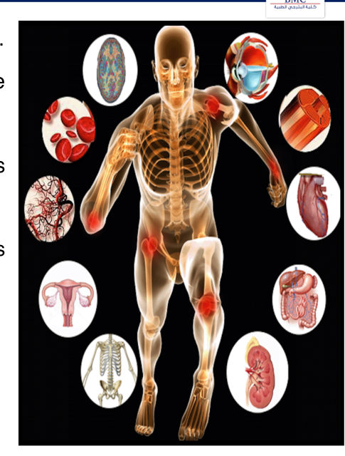 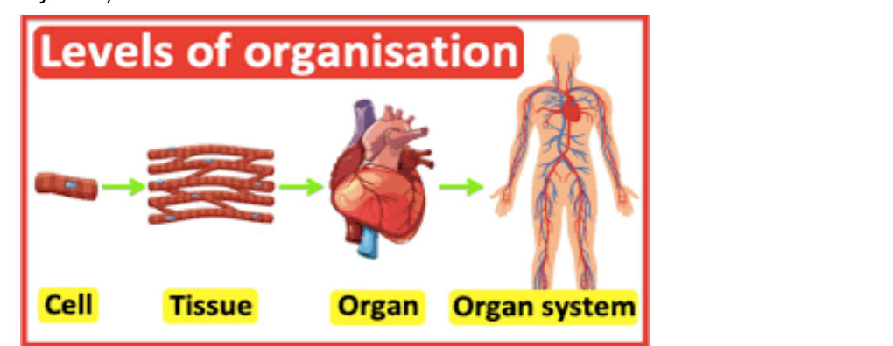

> 🔁 **Recap: Physiology.** Physiology is normal function. The body is 75–100 trillion cells organised into tissues → organs → systems that work together.
> 🔗 **Link:** Every one of those trillions of cells lives in fluid. To understand function, first know where the body's water is and what it contains.
> ▶️ **Up next: Body compartments.**

---

### 2.2 Body Compartments (Slides 7–13)

#### A. Body composition (Slide 8), average adult male
| Component | % body weight |
|---|---|
| ⭐ **Water** | ⭐ **60%** |
| Protein & related substances | **18%** |
| Fats | **15%** |
| Minerals | **7%** |

The body is divided into **intracellular (ICF)** and **extracellular (ECF)** compartments.

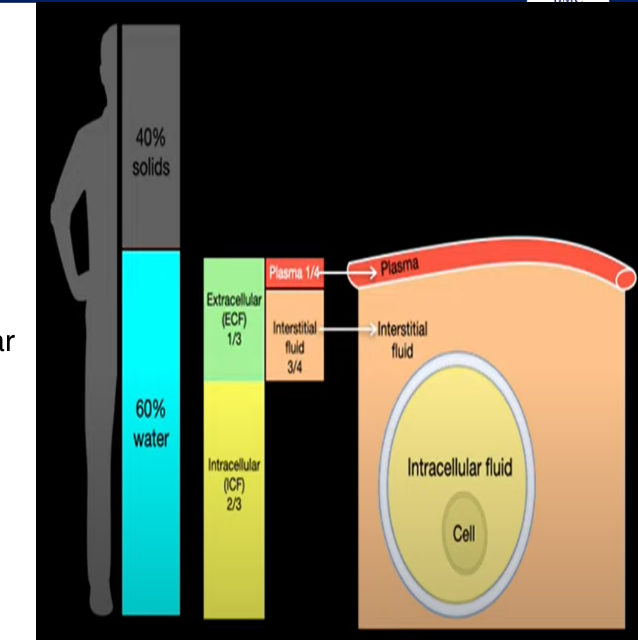

#### B. ⭐⭐ Total body water (TBW) varies with age, sex, fat (Slide 9)
| Group | TBW (% body weight) |
|---|---|
| ⭐ **Infants** | ⭐ **70–75%** |
| ⭐ **Adult male** | ⭐ **60%** |
| ⭐ **Adult female** | ⭐ **~54%** (slide figure shows ~50%) |
| **Obese** | **< 60%** (varies with obesity type) |
| Elderly | ~50% (slide figure only) |

⭐ **Why lower in women and the obese:** **high fat content** (fat holds little water).

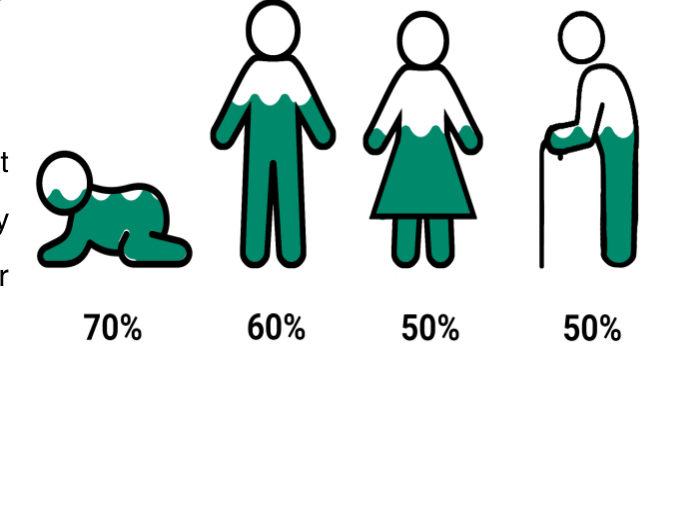

#### C. ⭐⭐⭐ Compartment volumes, 70-kg adult male (Slide 10)
| Compartment | Volume | % body weight | Fraction of TBW *[added]* |
|---|---|---|---|
| ⭐ **Total body water** | **≈ 42 L** | **60%** | 1 |
| ⭐ **ICF** | **≈ 28 L** | **40%** | ⅔ |
| ⭐ **ECF** | **≈ 14 L** | **20%** | ⅓ |
| ↳ **Plasma** (intravascular fluid, IVF) | **≈ 3 L** | **5%** | ¼ of ECF |
| ↳ **Interstitial fluid** (extravascular, EVF / ISF) | **≈ 11 L** | **15%** | ¾ of ECF |

*Mnemonic [added]:* **"60–40–20"** (TBW–ICF–ECF), then ECF splits **15 : 5** (ISF : plasma), i.e., **3 : 1**.

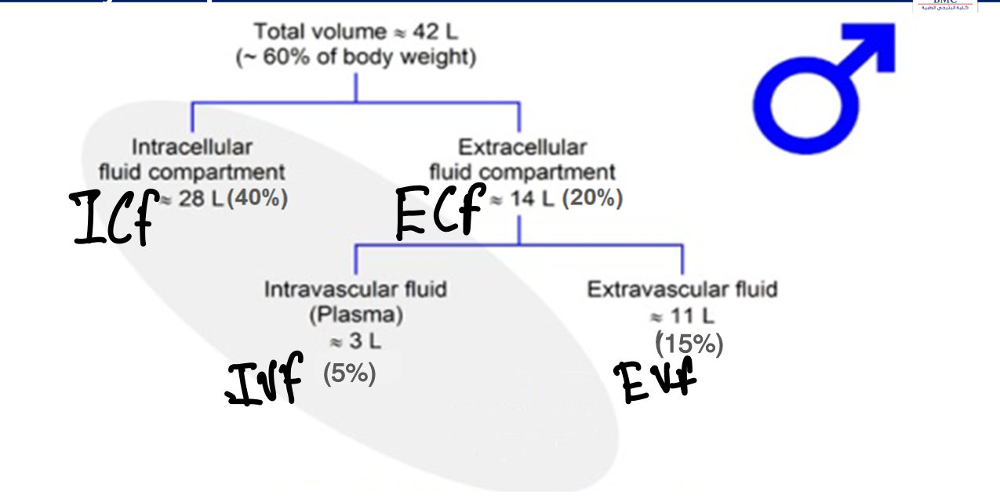

#### D. Other facts (Slide 11)
- ⭐ **Total blood volume ≈ 8% of body weight** (plasma + cells)
- ⭐ **ICF differs significantly from ECF** in composition
- ⭐ **Lymph bridges ISF and IVF** (plasma)
- ⭐ **Total +ve and −ve charges are equal everywhere EXCEPT along the cell membrane surfaces** *[added: this local charge separation creates the resting membrane potential]*

#### E. ⭐⭐⭐ Ionic composition (Slide 11)
| | **ICF** | **Plasma** | **ISF** |
|---|---|---|---|
| **Cations (mmol/L)** | | | |
| ⭐ **Na⁺** | **14** | ⭐ **145** | **140** |
| ⭐ **K⁺** | ⭐ **140** | **4.5** | **4.0** |
| **Ca²⁺** | **0.1 × 10⁻³** | **2.5** | **1.2** |
| **Mg²⁺** | ⭐ **58** | 1.2 | 1.2 |
| **Anions (mmol/L)** | | | |
| ⭐ **Cl⁻** | **3** | ⭐ **115** | **110** |
| **HCO₃⁻** | **10** | **28** | **27** |
| ⭐ **HPO₄²⁻** | ⭐ **75** | 4 | 4 |
| **Non-charged (mg/dL)** | | | |
| **Glucose** | **0–20** | **70–140** | **70–140** |
| ⭐ **Osmolarity (mOsm/L)** | ⭐ **290** | ⭐ **290** | ⭐ **290** |

**Patterns to learn:**
- ⭐ **ICF:** main cation **K⁺**, main anions **phosphates + proteins**; high **Mg²⁺**
- ⭐ **ECF:** main cation **Na⁺**, main anions **Cl⁻ + HCO₃⁻**
- ⭐ **Plasma vs ISF:** almost identical except **protein** (plasma has more, see Slide 12), which is why plasma has slightly more Na⁺ and Cl⁻ *[added: Gibbs–Donnan effect]*
- ⭐ **Osmolarity is equal (290) in all compartments**: water moves freely until it is

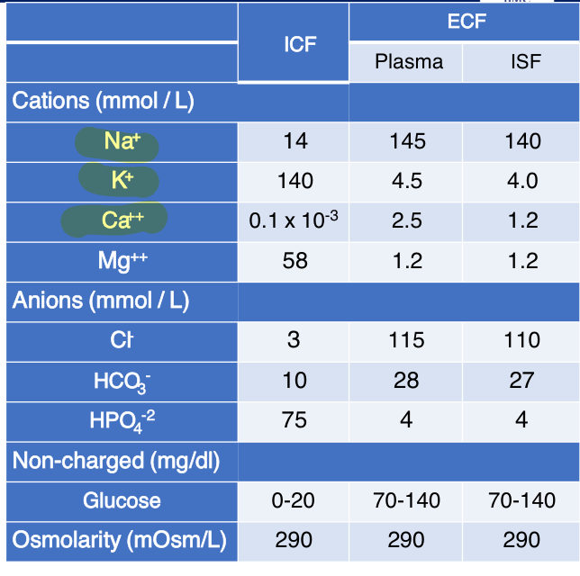

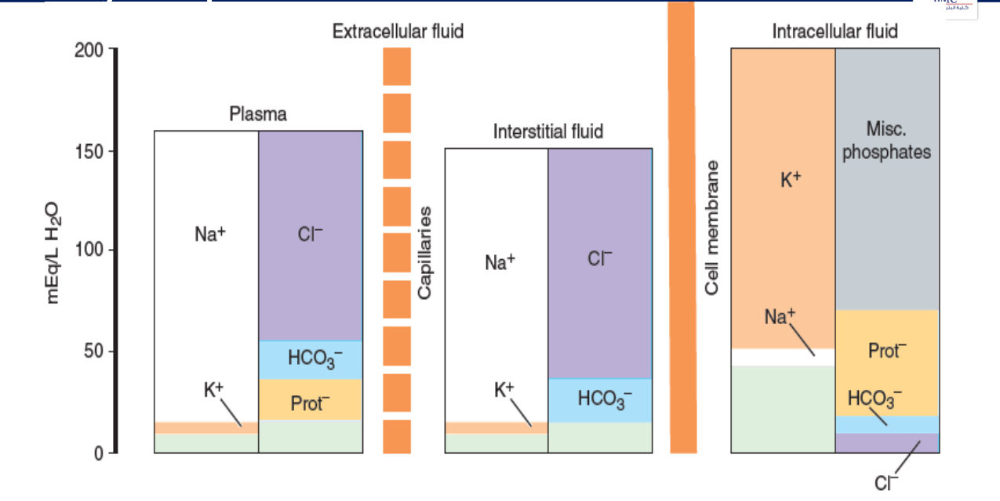

#### F. ⭐⭐⭐ Measuring the compartments (Slide 13)
**Principle:** ⭐ **Fick's (indicator-dilution) principle** *[added formula: Volume = amount of marker injected ÷ equilibrium concentration (minus any amount excreted/metabolised)]*

| # | Compartment | Method | Marker(s) |
|---|---|---|---|
| 1 | ⭐ **TBW** | **Measured** | ⭐ **D₂O (heavy water)** or **antipyrine** (enter all compartments) |
| 2 | ⭐ **ECF** | **Measured** | ⭐ **Inulin** or **Na thiocyanate** (do not enter cells) |
| 3 | ⭐ **Plasma** | **Measured** | ⭐ **Evans blue dye** or **plasma proteins labelled with radioactive iodine** |
| 4 | ⭐ **ICF** | **Calculated** | **TBW − ECF** |
| 5 | ⭐ **ISF** | **Calculated** | **ECF − plasma volume** |

📝 **Lecturer's handwritten note on the slide:** ⭐ ***"The ICF and ISF cannot be measured; it can be calculated only."***

*Mnemonic [added]:* **"D-I-E"**: **D**₂O → whole body; **I**nulin → ECF; **E**vans blue → plasma. ICF and ISF are only **subtracted**.

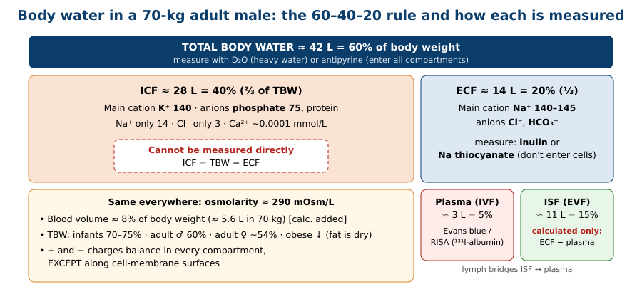

> 🔁 **Recap: Compartments.** 60% water (infants 70–75, women ~54). TBW 42 L = ICF 28 (40%) + ECF 14 (20%). ECF = ISF 11 (15%) + plasma 3 (5%). Blood is 8% of body weight. ICF is K⁺/phosphate/Mg²⁺; ECF is Na⁺/Cl⁻/HCO₃⁻. Osmolarity is 290 everywhere. Measure TBW (D₂O), ECF (inulin) and plasma (Evans blue); calculate ICF and ISF.
> 🔗 **Link:** The ISF bathing every cell is the cell's "internal environment". Its composition must stay within narrow limits, and keeping it there is homeostasis.
> ▶️ **Up next: Homeostasis.**

---

### 2.3 Homeostasis (Slides 14–18)
⭐⭐ **Definition:** keeping the conditions of the **internal environment constant**.
- Most body systems work, **directly or indirectly**, to maintain homeostasis
- ⭐ Cells are surrounded by **ISF**, which is **the internal environment** for those cells
- Life is compatible only within **narrow limits** of change in the internal environment's chemical/physical properties
- **Examples:** control of **body temperature**, **pH**, and concentrations of **O₂, CO₂, nutrients, waste products**

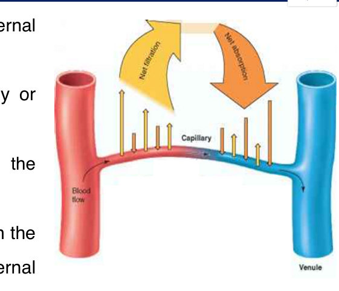

#### ⭐⭐⭐ Components of a homeostatic system: "SRACEER" (Slide 16, mnemonic on slide)
| # | Letter | Component | Role |
|---|---|---|---|
| 1 | **S** | **Stimulus** | A **change** in the environment |
| 2 | **R** | **Receptor** (sensor) | **Detects** the change |
| 3 | **A** | **Afferent** (input) | Carries detected information to the centre |
| 4 | **C** | **Control centre** | Corrects the change back to the ⭐ **set point** (the optimum condition for the system) |
| 5 | **E** | **Efferent** (output) | Carries orders from the centre |
| 6 | **E** | **Effectors** | **Execute** the orders |
| 7 | **R** | **Response** | ⭐ **Return to the set point** |

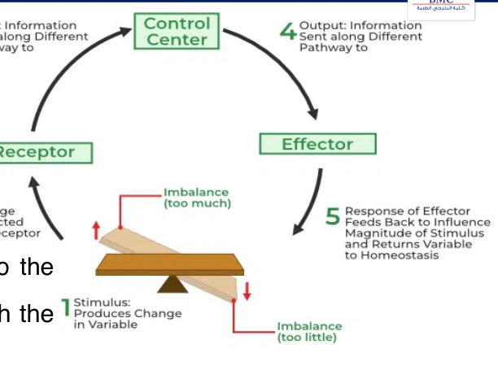

#### ⭐⭐⭐ Feedback control (Slides 17–18)
**Purpose:** ⭐ **prevents over- or under-compensation.**

| | **A. Negative feedback** | **B. Positive feedback** |
|---|---|---|
| Frequency | ⭐ **Used by most body systems** (most common) | **Used in some cases** (less common) |
| Effect | ⭐ **Reverses** the change (response opposes the stimulus) | ⭐ Input **increases / accelerates** the response (amplifies) |
| Result | **Stability** around the set point | A **self-amplifying cycle** until an end-event *[added: e.g., delivery of the baby]* |
| Slide example | ⭐ **Body temperature** (↑ temp → sweating/cooling → ↓ temp; ↓ temp → heat conservation → ↑ temp) | ⭐ **Childbirth / oxytocin** |
| Other examples *[added]* | BP (baroreceptor reflex), blood glucose (insulin/glucagon), TSH–T4 axis | Blood clotting cascade, LH surge before ovulation, action-potential Na⁺ influx, milk ejection |

⭐ **Oxytocin positive-feedback loop (Slide 18):**
1. **Oxytocin** released
2. → ↑ **frequency and strength of uterine contractions**
3. → baby pushed against the **cervix**
4. → **cervical stretch** sends nerve impulses to the brain
5. → **more oxytocin** released from the **pituitary** into the blood
6. → cycle repeats (until delivery *[added]*)

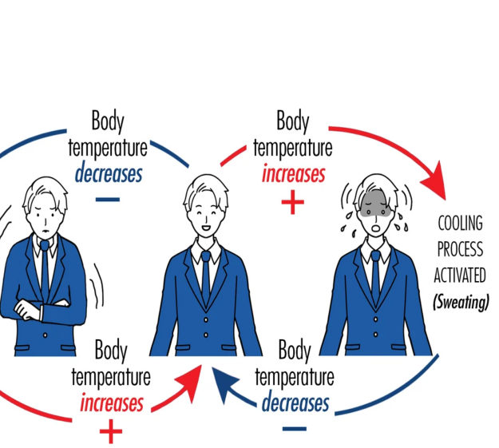 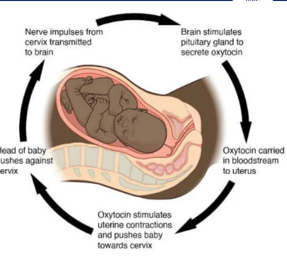

> 🔁 **Recap: Homeostasis.** Keep the ISF constant. The loop is SRACEER: stimulus → receptor → afferent → control centre (set point) → efferent → effector → response. Negative feedback (most systems, e.g., temperature) opposes change. Positive feedback (rare, e.g., oxytocin in labour) amplifies it.
> 🔗 **Link:** The lecture closes with a conclusion slide and one case that tests the compartment markers.
> ▶️ **Up next:** Conclusion + case (§7).

---

### 2.4 Conclusion (Slide 20)
- Physiology = the study of the **normal function of living things**
- Homeostasis = keeping the **composition of the internal environment constant**
- Feedback can be **negative (most common)** or **positive (less common)**
- ⭐ **Cells have different methods of communication** *(stated in the conclusion but not covered in this lecture's slides, so expect it in a later lecture)*

---

## 3. High-Yield Comparison Tables

### Table A: Compartment volumes (70-kg male)
| | L | % BW | Marker |
|---|---|---|---|
| TBW | 42 | 60 | D₂O, antipyrine |
| ICF | 28 | 40 | TBW − ECF |
| ECF | 14 | 20 | Inulin, Na thiocyanate |
| ISF | 11 | 15 | ECF − plasma |
| Plasma | 3 | 5 | Evans blue, ¹³¹I-albumin |
| Blood | ~5.6 *[added calc.]* | 8 | |

### Table B: ICF vs ECF
| | **ICF** | **ECF** |
|---|---|---|
| Main cation | **K⁺ (140)** | **Na⁺ (140–145)** |
| Main anion | **Phosphate (75)**, protein | **Cl⁻ (110–115)**, HCO₃⁻ |
| Mg²⁺ | **High (58)** | Low (1.2) |
| Ca²⁺ | **Tiny (10⁻⁴)** | 1.2–2.5 |
| Glucose | 0–20 mg/dL | 70–140 mg/dL |
| Osmolarity | **290** | **290** |

### Table C: Plasma vs ISF
| | **Plasma** | **ISF** |
|---|---|---|
| Volume | 3 L (5%) | 11 L (15%) |
| Protein | **High** | Low |
| Na⁺ / Cl⁻ | 145 / 115 | 140 / 110 |
| Ca²⁺ | 2.5 | 1.2 |
| Separated by | **Capillary wall** (connected by lymph) | |

### Table D: Negative vs positive feedback *(see §2.3)*

### Table E: TBW by group *(see §2.2 B)*

---

## 4. Rules, Exceptions, Patterns
- **60–40–20**: TBW 60%, ICF 40%, ECF 20% of body weight.
- **ECF = ¼ plasma + ¾ ISF.**
- **TBW falls** from infancy (70–75%) to adult male (60%) to female (~54%) and the obese, because **fat holds little water**.
- **K⁺ inside, Na⁺ outside. Cl⁻ outside, phosphate inside.**
- **Osmolarity is equal across compartments (290)**, even though the ions differ.
- **Electroneutrality holds everywhere EXCEPT at the cell membrane surface.**
- **Only TBW, ECF and plasma are measured. ICF and ISF are calculated.**
- **Marker must stay only in the target space:** inulin can't enter cells (ECF); Evans blue binds albumin and stays in vessels (plasma) *[mechanism added]*.
- **Negative feedback = most systems; positive feedback = exceptions** (oxytocin in labour).
- **Feedback exists to prevent over- or under-compensation.**

---

## 5. Clinical Correlations *[added; the lecture has no clinical slide, so these are illustrative]*
- **Infants dehydrate faster** because a larger share of body weight is water (70–75%) and turnover is high.
- **Elderly women and obese patients** have less water reserve and are more prone to dehydration; water-soluble drug dosing differs.
- **Hyperkalaemia or hypokalaemia** disturbs the K⁺ gradient (140 inside vs 4 outside) → arrhythmias.
- **Oedema** = expansion of the ISF compartment; plasma protein keeps fluid in vessels.
- **Fever** is a reset of the temperature set point, not a failure of negative feedback.
- **Oxytocin (Syntocinon) infusion** is used to induce/augment labour by harnessing the positive-feedback loop.

---

## 6. Rapid Revision (Last-Day)
- Physiology = normal function; human physiology = organs + systems + integration.
- **75–100 trillion cells** → tissues → organs → systems.
- Adult ♂: **60% water, 18% protein, 15% fat, 7% minerals**.
- TBW: **infant 70–75%**, **♂ 60%**, **♀ ~54%**, obese < 60%.
- **TBW 42 L · ICF 28 L (40%) · ECF 14 L (20%) · ISF 11 L (15%) · plasma 3 L (5%)**.
- **Blood volume ≈ 8% BW.** Lymph links ISF and plasma.
- ICF: **K⁺ 140, Na⁺ 14, Mg²⁺ 58, HPO₄²⁻ 75, Cl⁻ 3, HCO₃⁻ 10, Ca²⁺ 0.1 × 10⁻³**.
- Plasma: **Na⁺ 145, K⁺ 4.5, Ca²⁺ 2.5, Cl⁻ 115, HCO₃⁻ 28**. ISF: **Na⁺ 140, K⁺ 4, Cl⁻ 110**.
- **Osmolarity 290 everywhere.** Charges balance except at membrane surfaces.
- **Fick principle.** TBW: **D₂O / antipyrine**. ECF: **inulin / Na thiocyanate**. Plasma: **Evans blue / ¹³¹I-protein**. **ICF = TBW − ECF. ISF = ECF − plasma** (calculated only).
- Homeostasis = constant internal environment (**ISF**): temperature, pH, O₂, CO₂, nutrients, wastes.
- **SRACEER**: Stimulus, Receptor, Afferent, Control centre (set point), Efferent, Effector, Response.
- Feedback prevents over/under-compensation. **Negative = most (temperature)**; **positive = few (oxytocin in labour)**.

---

## 7. Exam-Style Questions

**Q1 (MCQ, lecture case, Slide 21).** A healthy 25-year-old man receives an IV tracer that distributes **only within the ECF**, not entering cells. Its dilution is used to calculate ECF volume. Which tracer?
a) Evans blue dye **b) Inulin** c) Deuterium oxide (D₂O) d) ¹³¹I-labelled albumin
**Answer: b. Inulin** (highlighted on the slide). Inulin (or Na thiocyanate) crosses capillaries but not cell membranes → ECF. **Evans blue and ¹³¹I-albumin** stay in the vessels → **plasma**. **D₂O** enters all compartments → **TBW**.

---

**Q2 (MCQ).** Which compartment volume **cannot be measured directly** with a single marker?
a) Total body water b) Plasma c) ECF **d) Interstitial fluid**
**Answer: d.** ISF = **ECF − plasma** (and ICF = TBW − ECF); both are calculated only.

---

**Q3 (MCQ).** Which is an example of **positive** feedback per the lecture?
a) Sweating when body temperature rises b) Shivering in the cold **c) Oxytocin release during labour** d) Baroreceptor reflex
**Answer: c.** Contractions push the baby on the cervix → more oxytocin → stronger contractions (amplification). a, b and d are negative feedback.

---

**Q4 (Calculation).** In a 70-kg man, D₂O gives TBW = 42 L and inulin gives ECF = 14 L; Evans blue gives plasma = 3 L. Calculate ICF and ISF.
**Answer:** **ICF = 42 − 14 = 28 L** (40% BW). **ISF = 14 − 3 = 11 L** (15% BW).

---

**Q5 (Short answer).** List the seven components of a homeostatic control system in order.
**Answer:** **S**timulus → **R**eceptor → **A**fferent pathway → **C**ontrol centre (compares with the set point) → **E**fferent pathway → **E**ffector → **R**esponse (return to the set point): **SRACEER**.

---

## 8. Exam Pitfalls & Traps
1. **Mixing up markers:** Evans blue = **plasma** (not ECF); inulin = **ECF** (not TBW); D₂O = **TBW**.
2. **Claiming ICF or ISF can be measured directly.** The lecturer's handwritten note says **calculated only**.
3. **ISF vs plasma share of ECF:** ISF is the **bigger** part (15% vs 5%).
4. **Assuming osmolarity differs between ICF and ECF.** The ions differ, but osmolarity is **290 in all**.
5. **"Electroneutrality everywhere."** Correct **except at the membrane surfaces**.
6. **Women vs men TBW:** women are **lower** (~54%) because of more fat, not less muscle water.
7. **Positive feedback is "bad".** It's physiological in labour; it is just **less common**.
8. ⚠️ **Cell number wording:** the slide says "75–100 trillion (10¹²)". A trillion is 10¹², so the total is ≈ **7.5–10 × 10¹³**. Quote "75–100 trillion".
9. ⚠️ **Female TBW:** the text says **~54%**, the figure shows **50%**. Use **~54%** (text) unless asked about the figure.
10. **Conclusion mentions "cell communication"** but this lecture doesn't teach it; it's likely the next lecture's topic.
