# An Approach to a Case of Wheezing: Asthma
**Dr. Essam Kotb, Associate Professor, Internal Medicine** | Source: `5-Asthma_updated.pdf` (34 slides) · Refs: Step-Up 5th ed.; Harrison 20th ed.; AMBOSS; Cecil 10th ed.; First Aid IM Boards 4th ed.

> **Legend:** ⭐ = high-yield · *[added]* = not on slides. Images marked "Slide N" come from the lecture; "Added diagram" = drawn for these notes.

> 🔗 **Bridge from the COPD lecture (same lecturer):** COPD = **irreversible** obstruction in older **smokers**, driven by **neutrophils and proteases**. Asthma = **reversible** obstruction, often starting in **childhood**, driven by **Th2 cells and eosinophils**. The objectives explicitly ask you to **differentiate the two**, so the comparison diagram comes first.

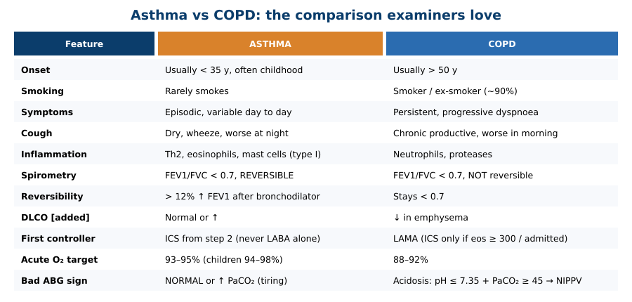

---

## 1. Title / Objectives
| Domain | Objective | Likely tested as |
|---|---|---|
| Knowledge | ⭐ Define asthma (chronic inflammation, **hyperresponsiveness**, **reversible** obstruction) | Definition keywords |
| Knowledge | ⭐ Allergic vs non-allergic; clinical subtypes | Extrinsic vs intrinsic table; aspirin, exercise, cough-variant |
| Knowledge | ⭐ Th2 inflammation, type I hypersensitivity, mast cells, smooth-muscle hypertrophy, oedema, mucus plugging | Mechanism MCQ |
| Knowledge | Symptoms and signs | Silent chest, pulsus paradoxus |
| Knowledge | ⭐ Diagnostic tests; **severity classification** (mild intermittent → severe persistent) | Spirometry reversibility > 12%; methacholine; classification table |
| Knowledge | ⭐ Controller/reliever drugs; acute exacerbation protocol | Stepwise steps 1–6; acute algorithm |
| Skills | Interpret history, exam, spirometry, PEF, ABG, CXR; classify severity; plan treatment; **differentiate from COPD** | Case vignettes |
| Values | Inhaler technique, adherence, trigger avoidance, self-monitoring | |

**Flow:** Definition → Epidemiology & aetiology → Pathophysiology → Clinical features → Subtypes → Diagnostics → Classification → Management → Acute exacerbation (definition, risk factors, pathogenesis, features, management) → Summary → Cases.

---

## 2. Main Content (Lecture Order)

### 2.1 Definition (Slide 5)
⭐ **Asthma = a chronic inflammatory disease** of the respiratory system characterised by **bronchial hyperresponsiveness**, causing respiratory symptoms and a ⭐ **reversible airflow obstruction**.

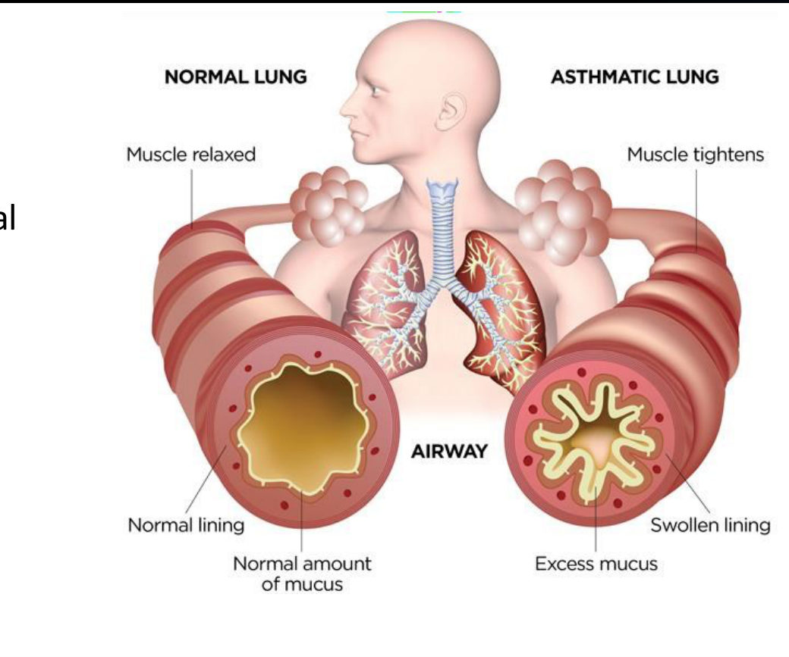

---

### 2.2 Epidemiology & Aetiology (Slides 6–7)
| Type | Typical onset |
|---|---|
| ⭐ **Allergic** | **Childhood** |
| ⭐ **Non-allergic** | **> 40 years** |

**Risk factors:** ⭐ **family history** · **allergy** · ⭐ **atopy** · environmental and socioeconomic factors (**pollution from cooking and heating**).

⭐⭐ **Allergic vs non-allergic (Slide 7 table):**
| | ⭐ **Allergic** | ⭐ **Non-allergic** |
|---|---|---|
| Synonym | **Extrinsic** | **Intrinsic** |
| Onset | **Early** | **Late** |
| Worse with allergens | + | − |
| Personal / family atopy | + / + | − / − |
| ⭐ **NSAID intolerance** | Less frequent | ⭐ **More frequent** |
| Pathophysiology | ⭐ **Type I hypersensitivity** | **Unknown** |
| Total IgE | ⭐ **Elevated** | **Normal** |
| Specific IgE | + | − |
| Eosinophils (blood/sputum) | + | + or − |
| Course | **More favourable** | **Less favourable** |

⭐ Slide 7 highlight (red): **non-allergic asthma is "irritant asthma", mostly with aspirin or NSAIDs.**

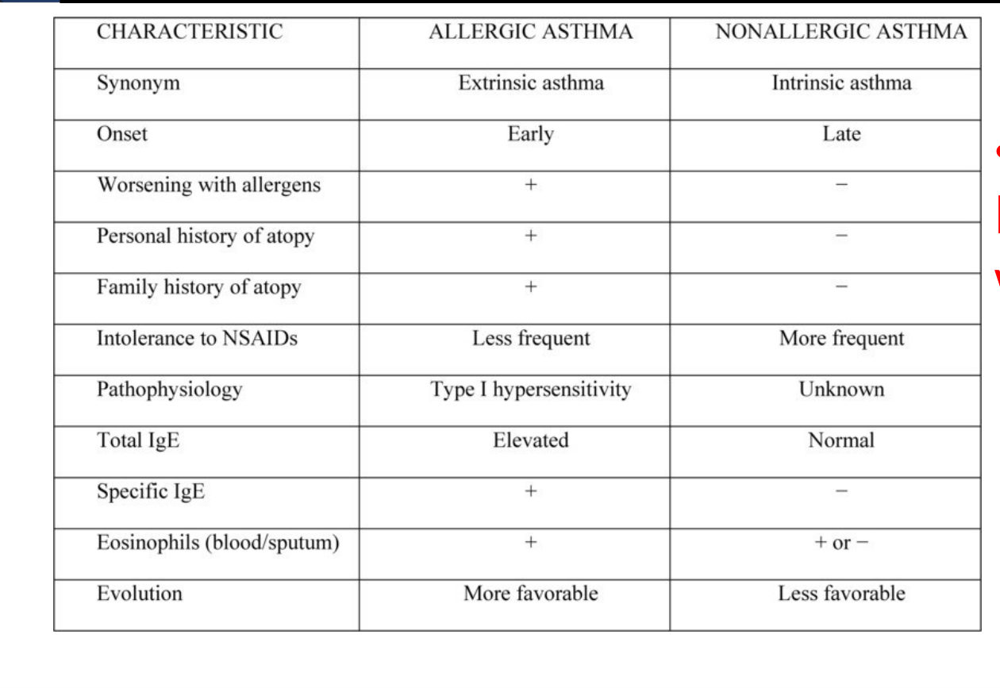

> 🔁 **Recap: Who.** Allergic (extrinsic) = childhood, atopy, high IgE, type I, better outlook. Non-allergic (intrinsic) = after 40, normal IgE, often aspirin/NSAID-triggered, worse outlook.
> 🔗 **Link:** Both share the same three airway processes.
> ▶️ **Up next: Pathophysiology.**

---

### 2.3 Pathophysiology (Slide 8)
⭐ An inflammatory disease driven by ⭐ **T-helper type 2 (Th2) cells** in **genetically predisposed** people. Three processes:
1. ⭐ **Bronchial hyperresponsiveness**
2. ⭐ **Bronchial inflammation**: inhaled antigen → **eosinophil activation** → **submucosal oedema** → **bronchiolar collapse**
3. ⭐ **Endobronchial obstruction** from:
   - **↑ parasympathetic tone** → **reversible bronchospasm**
   - **↑ mucus production**
   - **Mucosal oedema with goblet-cell hyperplasia**

*[added from the objectives, not on the slide: allergen cross-links IgE on mast cells → degranulation (histamine, leukotrienes) → early-phase bronchospasm; Th2 cytokines (IL-4, IL-5, IL-13) drive IgE, eosinophils and mucus → late phase; chronic remodelling = smooth-muscle hypertrophy.]*

> 🔁 **Recap: Mechanism.** Th2-driven hyperresponsiveness + eosinophilic inflammation + obstruction (bronchospasm, mucus, oedema/goblet cells). All largely reversible.
> 🔗 **Link:** These processes come and go, which is why symptoms are episodic.
> ▶️ **Up next: Clinical features.**

---

### 2.4 Clinical Features (Slides 9–10)
**History:**
- Symptoms triggered by stimuli (e.g., **dust**); ⭐ **usually asymptomatic between attacks**
- During attacks: ⭐ **dyspnoea**, ⭐ **cough** (persistent dry; ↑ with exercise and irritants; ⭐ **worse at night**), **chest tightness**, ⭐ **wheezing**
- **Past history:** ⭐ **atopy** (eczema/atopic dermatitis, allergic rhinitis, allergic conjunctivitis)
- **Family/social:** atopy or asthma; **mould, carpet, tobacco, pets**

**Signs:** **wheeze** · **prolonged expiration** · ⭐ **silent chest (severe)** · **hyperresonance** · tachypnoea, tachycardia · **cyanosis** · **lethargy** · ⭐ **pulsus paradoxus**

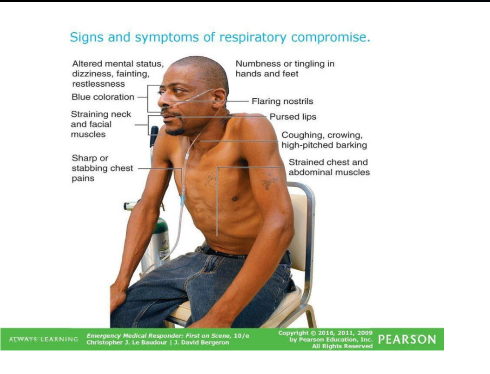

---

### 2.5 Subtypes & Variants (Slides 11–13)
| Subtype | Key features |
|---|---|
| ⭐ **Allergic** | **Most common**; childhood intermittent symptoms; allergen-triggered; **atopy**; ⭐ **responds well to ICS** |
| ⭐ **Non-allergic** | Less common; triggered by **viral URTI, cold air, GERD**; no atopy; ⭐ **responds poorly to ICS** |
| **Adult-onset** | Uncommon; first symptoms in adulthood; usually non-allergic; **poor ICS response** |
| ⭐ **Cough-variant** | **Chronic dry cough** without other typical asthma symptoms |
| **Aspirin-exacerbated respiratory disease** | *[added: asthma + nasal polyps + aspirin/NSAID sensitivity (Samter triad)]* |
| **Asthma–COPD overlap** | Features of both |
| **Occupational** | Workplace exposure |
| ⭐ **Exercise-induced** | Symptoms **within 15 min** of intense exercise, **resolve within 1 h** |

⭐ **Exercise-induced asthma management:**
- Non-pharmacological measures
- ⭐ **Inhaled β-agonist 15–30 min before exercise**
- ⭐ **Needed ≥ 4 times/week → daily ICS**

> 🔁 **Recap: Subtypes.** Allergic (common, ICS-responsive) vs non-allergic/adult-onset (poor ICS response). Cough-variant = cough only. Exercise-induced: onset within 15 min, gone in 1 h; SABA 15–30 min before; daily ICS if ≥ 4×/week.
> 🔗 **Link:** Suspicion needs objective proof: obstruction that reverses.
> ▶️ **Up next: Diagnostics.**

---

### 2.6 Diagnostics (Slides 14–18)
⭐⭐⭐ **Spirometry (PFT):**
- ⭐ **FEV1/FVC < 70%** (obstructive), **↓ FEV1**
- ⭐ **Reversibility: > 12% ↑ in FEV1 after bronchodilator**

⭐⭐ **Bronchoprovocation test:** ⭐ **↓ FEV1 > 20% with methacholine or histamine** *[added: used when spirometry is normal but asthma is suspected]*

**Peak expiratory flow (PEF):** varies with **age, sex, height**; normal ≈ **400–600 L/min**

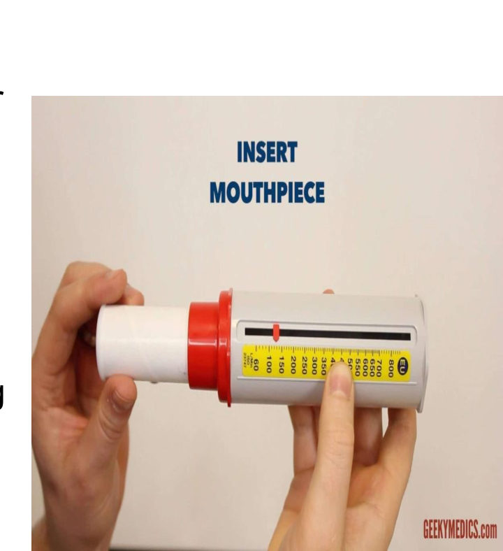 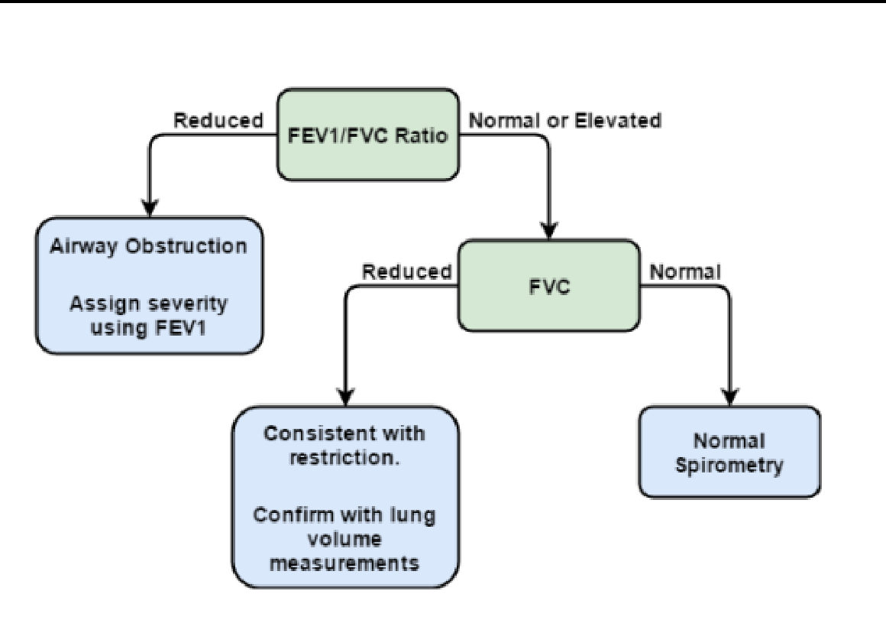

| Test | Findings |
|---|---|
| **CBC** | Possible ⭐ **eosinophilia** (± leukocytosis) |
| **Antibodies** | ⭐ **↑ total IgE**, ↑ **allergen-specific IgE** |
| **Skin allergy tests** | **Skin prick** or **intradermal** |
| ⭐ **Sputum** | May look purulent; ⭐ **Curschmann spirals** (mucus plugs of shed epithelium); ⭐ **Charcot–Leyden crystals** (eosinophilic inflammation) |
| **CXR** | ⭐ **Normal in mild–moderate**; **hyperinflation** in severe; needed in severe asthma to **exclude other conditions** |
| ⭐⭐ **ABG** | ⭐ **Hypocarbia is common**; ⭐ **normal or ↑ PaCO₂ is a BAD sign** (bad prognosis if hypercapnic) |

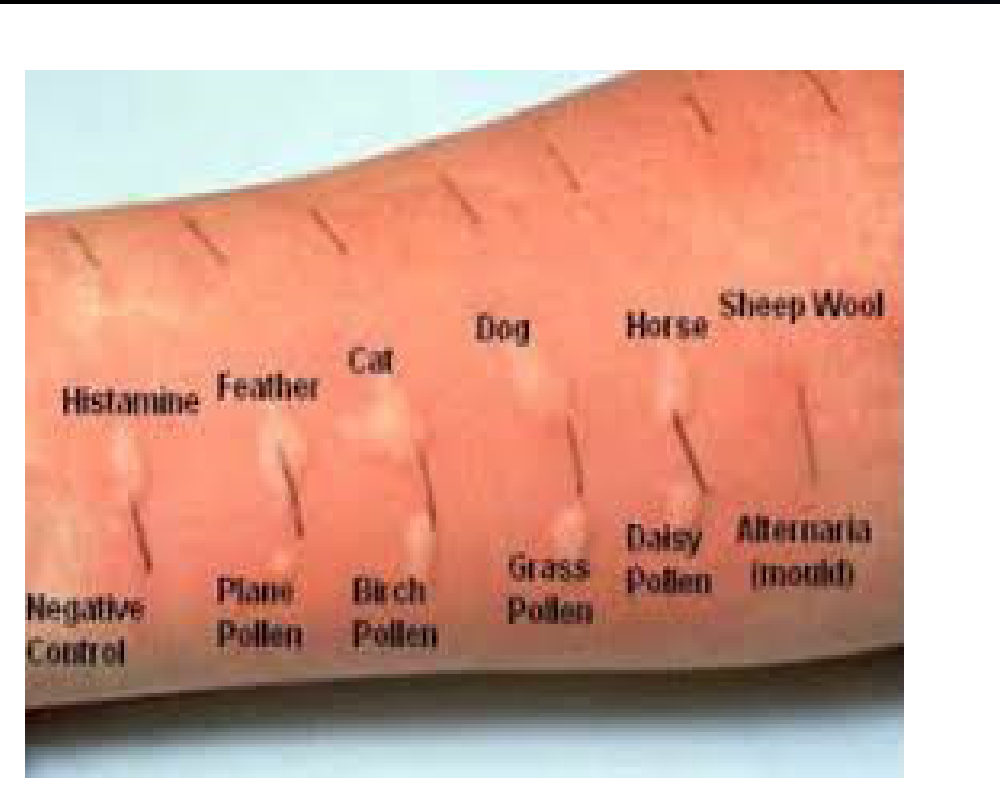 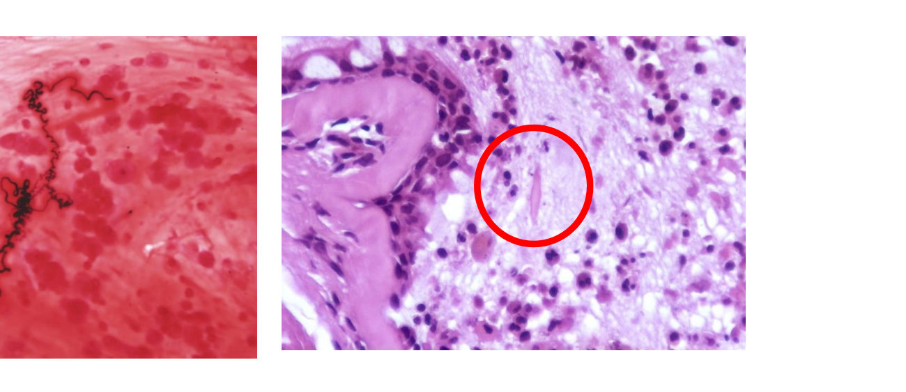

*[added: why a normal PaCO₂ is bad: an attack causes hyperventilation, so CO₂ should be low; a "normal" or rising CO₂ means the patient is tiring.]*

> 🔁 **Recap: Diagnosis.** Obstruction (< 70%) that reverses (> 12% FEV1). If spirometry is normal: methacholine (> 20% fall). Eosinophilia, ↑ IgE, positive skin prick, Curschmann spirals, Charcot–Leyden crystals. CXR often normal. In an attack, low CO₂ is expected; normal/high CO₂ is danger.
> 🔗 **Link:** Once confirmed, severity classification decides the starting treatment step.
> ▶️ **Up next: Classification and stepwise management.**

---

### 2.7 Classification & Stepwise Management (Slides 19–21)
⭐⭐⭐ **Severity classification:**
| Class | Daytime symptoms | Night-time symptoms | PEF or FEV1 |
|---|---|---|---|
| **Mild intermittent** | **≤ 2/week** | **< 2/month** | **≥ 80%** |
| **Mild persistent** | **> 2/week but < 1/day** | **> 2/month** | **≥ 80%** |
| **Moderate persistent** | **Daily** | **> 1/week** | **60–80%** |
| **Severe persistent** | **Continuous** | **Frequent** | **< 60%** |

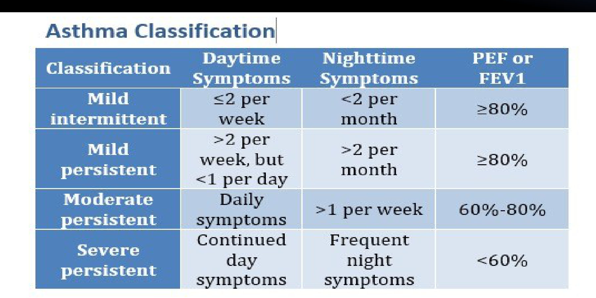

⭐⭐⭐ **Stepwise approach, adults (Slide 20, NHLBI 2007):**
| Step | Severity | ⭐ Preferred | Alternative |
|---|---|---|---|
| **1** | Intermittent | ⭐ **SABA prn** | |
| **2** | Mild persistent | ⭐ **Low-dose ICS** | Cromolyn, LTRA, or theophylline |
| **3** | Moderate persistent | ⭐ **Low-dose ICS + LABA** or **medium-dose ICS** | Low-dose ICS + LTRA, theophylline or zileuton |
| **4** | Severe persistent | ⭐ **Medium-dose ICS + LABA** | Medium-dose ICS + LTRA, theophylline or zileuton |
| **5** | Severe persistent | ⭐ **High-dose ICS + LABA**, consider **omalizumab** (allergic) | |
| **6** | Severe persistent | ⭐ **High-dose ICS + LABA + oral corticosteroid**, consider **omalizumab** | |

- ⭐ **Step up if needed**, but **first check adherence, inhaler technique, environmental control, comorbidities**
- ⭐ **Step down if possible** once **well controlled for ≥ 3 months**
- SABA as needed at every step

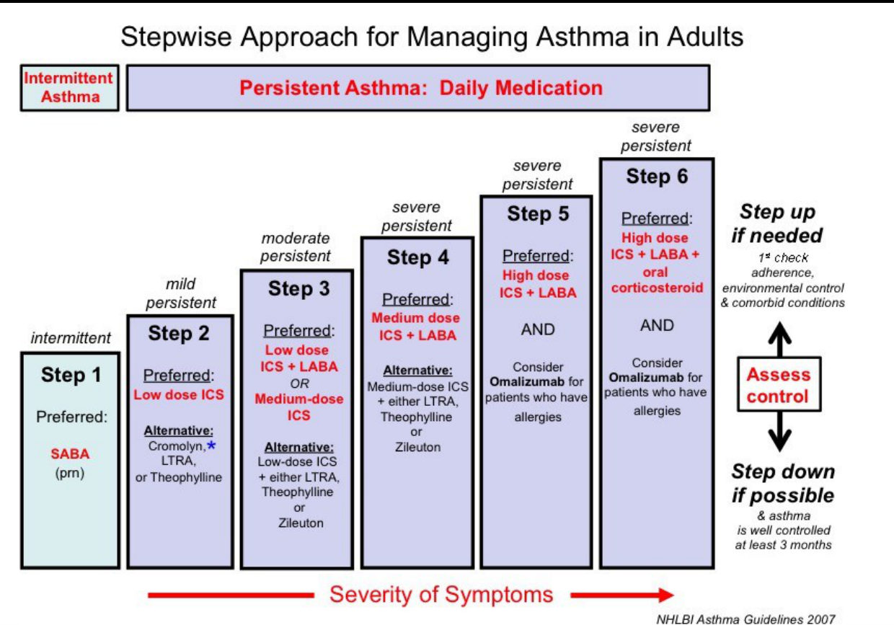

**Drug classes (Slide 21):** inhaled **β2-agonists** · **corticosteroids** (inhaled and oral) · **montelukast** (leukotriene modifier) · **theophylline** · ⭐ **omalizumab** (anti-IgE monoclonal antibody)

⚠️ *[added: current GINA guidance (2019+) advises against SABA-only treatment. Even mild asthma should get ICS-containing reliever therapy (e.g., as-needed low-dose ICS–formoterol). The lecture's own risk-factor slide lists "SABA-only treatment" as a cause of exacerbations. For this exam, answer by the lecture's NHLBI table, but know the update.]*

> 🔁 **Recap: Stepwise.** Classify by day symptoms, night symptoms and FEV1 (≥ 80 / 60–80 / < 60). Step 1 SABA; 2 low ICS; 3 low ICS + LABA; 4 medium ICS + LABA; 5 high ICS + LABA ± omalizumab; 6 + oral steroid. Check adherence/technique before stepping up; step down after 3 months controlled.
> 🔗 **Link:** Even controlled asthma can flare acutely, and that's where patients die.
> ▶️ **Up next: Acute exacerbation.**

---

### 2.8 Acute Asthma Exacerbation (Slides 22–27)
**Definitions (Slide 22):**
| Term | Meaning |
|---|---|
| **Asthma exacerbation** | Usually **reversible** lower-airway obstruction (bronchospasm); symptoms **worsen over a short time** (acute/subacute) with a **change from baseline lung function** |
| **Bronchospasm** | Bronchial-muscle constriction causing obstruction **within seconds to minutes**; can also be triggered by **drugs** or **mechanical ventilation** |
| ⭐ **Status asthmaticus** | **Severe exacerbation that progresses rapidly and does not respond to standard therapy** |

⭐⭐ **Risk factors for exacerbations (Slide 23):**
- **Trigger exposure**
- ⭐ **SABA-only treatment / SABA overuse**
- ⭐ **Inadequate ICS or poor adherence**
- **Incorrect inhaler technique**
- ⭐ **Prior intubation or ICU admission**
- **≥ 1 severe exacerbation in the past year**
- ⭐ **FEV1 < 60% predicted**
- **High bronchodilator responsiveness**
- **Blood eosinophilia**

**Pathogenesis (Slide 24, Calgary Guide):** triggers (**viral URI, allergen, pollution**, others) → immune activation (↑ **leukotrienes**) → inflammatory mediators → **airway inflammation** (cough, wheeze, dyspnoea) + **bronchoconstriction** → ↑ **RV and PCO₂**, **air trapping** (↑ intra-alveolar pressure → **pulsus paradoxus**, **pneumothorax**, loss of consciousness) → ↓ oxygenation (**drowsiness/confusion, central cyanosis, tachycardia**) → **respiratory failure**.
- **Mild–moderate: PEF ≥ 50%** → titrate O₂ to SpO₂ ≥ 92%, **SABA + steroids** → good response (**PEF ≥ 80%**) → home with SABA prn + steroids + education
- **Severe: PEF ≤ 50%** → O₂ to SpO₂ ≥ 93%, **SABA, steroids, magnesium sulfate**
- **Worsening / respiratory failure → don't delay intubation**, ICU, SABA, steroids, MgSO₄
- **Pneumothorax** → observe or chest tube

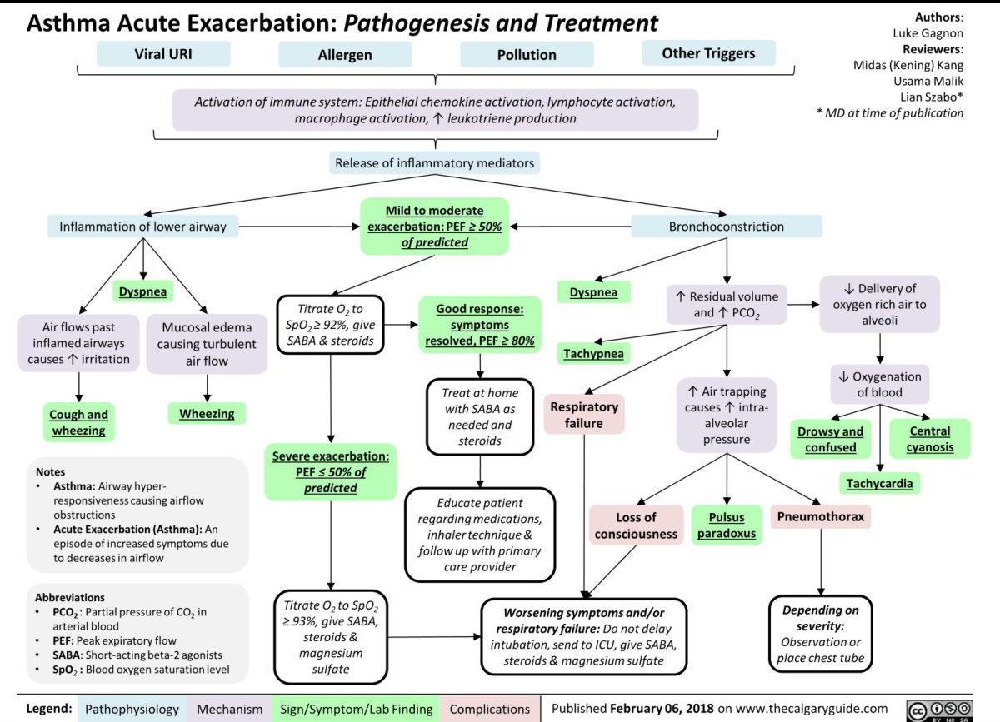

**Clinical features (Slide 25):** dyspnoea, ↑ cough · tachypnoea, tachycardia, ⭐ **pulsus paradoxus**, ⭐ **hypoxaemia (SpO₂ < 90%, possible cyanosis)**, ⭐ **altered mental status** · prolonged expiration, wheeze, ⭐ **silent chest**, hyperresonance, **low, poorly moving diaphragm** · **accessory muscles**

⭐⭐⭐ **Triage by worst feature (Slide 27):**
| | **Mild / moderate** | ⭐ **Severe** |
|---|---|---|
| Speech | **Phrases** | ⭐ **Words** |
| Posture | Prefers sitting | **Sits hunched forward** |
| Agitation | Not agitated | **Agitated** |
| RR | Increased | ⭐ **> 30/min** |
| Accessory muscles | Not used | ⭐ **Used** |
| Pulse | **100–120** | ⭐ **> 120** |
| SpO₂ (air) | **90–95%** | ⭐ **< 90%** |
| PEF | **> 50%** | ⭐ **≤ 50%** |
| Treatment | **SABA**, consider ipratropium, O₂ to **93–95%** (children **94–98%**), **oral steroids** | **SABA + ipratropium**, O₂ to 93–95%, **oral or IV steroids**, ⭐ **consider IV magnesium**, consider high-dose ICS |

⭐ **Red flags first (Slide 27):** ⭐ **drowsiness, confusion, silent chest** → **consult ICU, start SABA + O₂, prepare for intubation**.
⭐ If deteriorating → treat as severe and reassess for ICU. ⭐ **Reassess lung function 1 hour after initial treatment** in all patients.

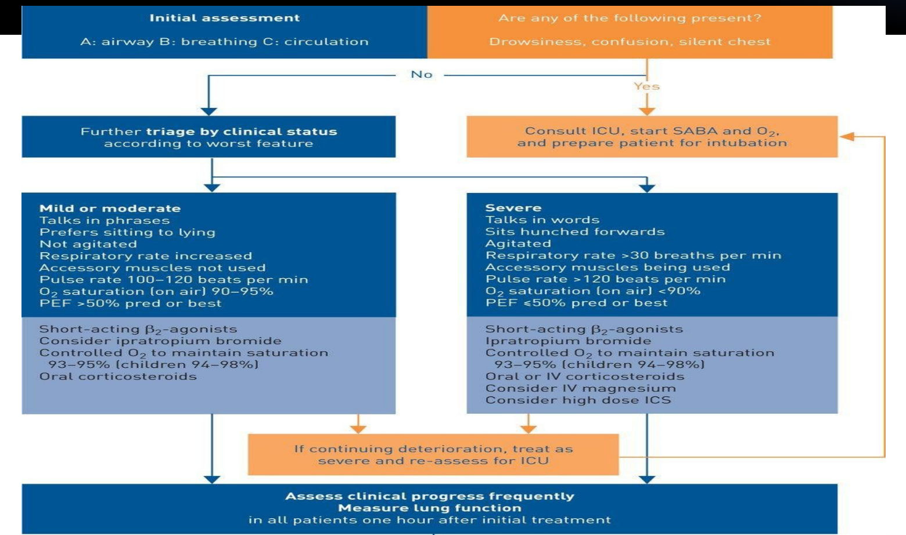

⭐⭐ **Severe / life-threatening management (Slide 26):**
1. **Urgent respiratory support**: O₂; **prepare for intubation and ventilation**; watch for impending respiratory failure
2. **Maximise drugs**: ⭐ **nebulised SABA + nebulised SAMA + oral or IV glucocorticoids**; ⭐ **consider single dose IV magnesium sulfate**; consider ICS
3. **Fluids** (preferably oral) in infants and young children

> 🔁 **Recap: Acute.** Severe = words only, RR > 30, HR > 120, SpO₂ < 90%, PEF ≤ 50%. Treat with nebulised SABA + ipratropium, steroids, O₂ 93–95%, IV Mg if severe. Drowsy, confused or silent chest → ICU and intubate. Reassess at 1 hour.

---

### 2.9 Summary (Slide 28)
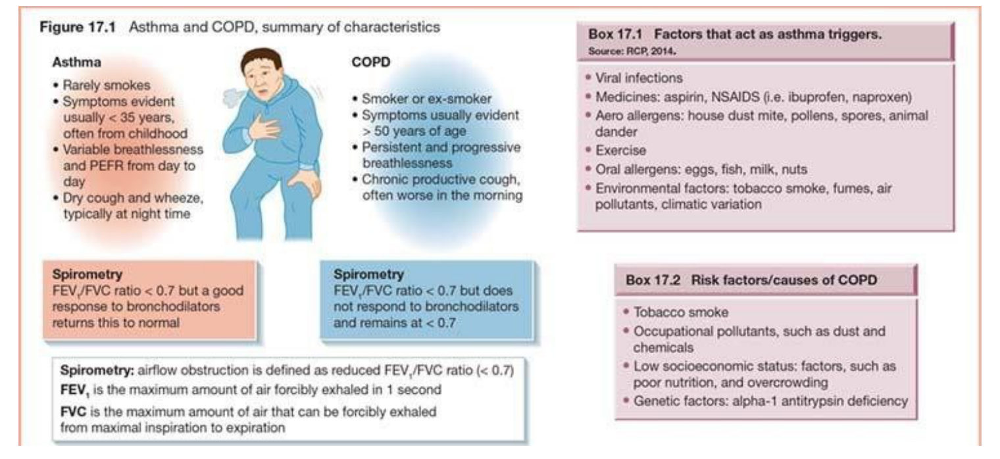

⭐ **Asthma triggers (Box 17.1):** **viral infections** · **aspirin/NSAIDs** (ibuprofen, naproxen) · **aero-allergens** (house-dust mite, pollen, spores, animal dander) · **exercise** · **oral allergens** (eggs, fish, milk, nuts) · environment (**tobacco smoke**, fumes, pollutants, **climate change**)

---

## 3. High-Yield Comparison Tables

### Table A: Asthma vs COPD *(see the added diagram at the top)*

### Table B: Allergic vs non-allergic *(see §2.2)*

### Table C: Severity classification *(see §2.7)*

### Table D: Stepwise therapy *(see §2.7)*

### Table E: Mild/moderate vs severe exacerbation *(see §2.8)*

### Table F: Diagnostic thresholds
| Test | Asthma threshold |
|---|---|
| FEV1/FVC | < 70% (during obstruction) |
| Bronchodilator reversibility | ⭐ **> 12% ↑ FEV1** |
| Methacholine/histamine challenge | ⭐ **> 20% ↓ FEV1** |
| PEF normal | ~400–600 L/min |
| Severe exacerbation PEF | ≤ 50% |
| Good response | PEF ≥ 80% |

---

## 4. Rules, Exceptions, Patterns
- **Reversible = asthma; irreversible = COPD.**
- **Reversibility > 12%; provocation fall > 20%.**
- **Allergic asthma responds to ICS; non-allergic/adult-onset responds poorly.**
- **Aspirin/NSAIDs mostly provoke non-allergic (intrinsic) asthma.**
- **CXR is normal in mild–moderate asthma.**
- **In an attack, low PaCO₂ is expected; normal/high PaCO₂ = tiring = danger.**
- **Silent chest is worse than wheeze**: no air is moving.
- **Check adherence and inhaler technique before stepping up.**
- **Step down only after ≥ 3 months of control.**
- **Omalizumab (anti-IgE) for allergic severe asthma (steps 5–6).**
- **Exercise-induced: SABA 15–30 min before; daily ICS if ≥ 4×/week.**
- **O₂ target: asthma 93–95% (children 94–98%); COPD 88–92%.**

---

## 5. Clinical Correlations
- **Child with eczema + allergic rhinitis + nocturnal cough/wheeze** → allergic asthma (atopic march *[added]*).
- **Middle-aged adult with nasal polyps and attacks after ibuprofen** → aspirin-exacerbated respiratory disease *[polyps added]*.
- **Chronic dry cough only, normal exam** → cough-variant asthma → methacholine challenge.
- **New mould or damp housing** → environmental trigger (Case 2).
- **β-blockers** can precipitate bronchospasm in asthmatics *[added]*.
- **Sudden deterioration with unilateral absent breath sounds in an attack** → pneumothorax (air trapping, Slide 24).
- **Over-use of SABA (> 2 canisters/month *[added]*)** = poor control, high exacerbation risk.

---

## 6. Rapid Revision (Last-Day)
- Asthma = chronic inflammation + **hyperresponsiveness** + **reversible** obstruction.
- Allergic: childhood, **extrinsic**, atopy, **↑ IgE**, type I, better course. Non-allergic: > 40 y, **intrinsic**, normal IgE, **aspirin/NSAIDs**, worse course.
- Risks: family history, allergy, atopy, pollution (cooking/heating).
- **Th2-driven**: hyperresponsiveness · eosinophilic inflammation (oedema → collapse) · obstruction (vagal bronchospasm, mucus, goblet-cell hyperplasia).
- Symptoms: episodic dyspnoea, **night-time dry cough**, chest tightness, wheeze; atopy history.
- Signs: wheeze, prolonged expiration, **silent chest**, hyperresonance, **pulsus paradoxus**, cyanosis.
- Subtypes: allergic (ICS works), non-allergic/adult-onset (ICS poor), **cough-variant**, aspirin-exacerbated, overlap, occupational, **exercise-induced** (15 min / 1 h; SABA 15–30 min before; ICS if ≥ 4×/wk).
- Spirometry: **FEV1/FVC < 70%**, **> 12% reversibility**. **Methacholine: > 20% fall.** PEF 400–600 L/min.
- Eosinophilia, ↑ IgE, skin prick; **Curschmann spirals, Charcot–Leyden crystals**. CXR normal (mild–moderate). **Normal/↑ PaCO₂ = bad.**
- Classification: intermittent (≤ 2/wk, < 2/mo night, ≥ 80%) · mild persistent (> 2/wk, > 2/mo, ≥ 80%) · moderate (daily, > 1/wk, 60–80%) · severe (continuous, frequent, < 60%).
- Steps: **1 SABA · 2 low ICS · 3 low ICS + LABA · 4 med ICS + LABA · 5 high ICS + LABA ± omalizumab · 6 + oral steroid.**
- Exacerbation risk: SABA-only/overuse, poor ICS adherence, bad technique, **prior ICU/intubation**, recent severe attack, **FEV1 < 60%**, eosinophilia.
- Severe attack: **words, RR > 30, HR > 120, SpO₂ < 90%, PEF ≤ 50%**. Rx: **nebulised SABA + ipratropium, steroids, O₂ 93–95%, IV MgSO₄**.
- **Drowsy/confused/silent chest → ICU, intubate.** Reassess at 1 h.
- **Status asthmaticus** = severe, rapidly progressive, unresponsive to standard therapy.

---

## 7. Exam-Style Questions

**Q1 (MCQ, lecture Case 1, Slide 29).** 20 ♂, 4 months of episodic dyspnoea and dry cough, **2 episodes/week**, resolving with rest; **wakes 2×/month**. Exam normal, SpO₂ 98%. **FEV1/FVC 0.85, FEV1 81%.** Best initial pharmacotherapy?
**a. Albuterol inhaler** b. Fluticasone c. Montelukast d. Cromolyn e. Mometasone + zafirlukast f. Salmeterol
**Answer: a** (per the lecture's NHLBI table). *[reasoning added; no key on the slide]* Daytime ≤ 2/week, night-time ≈ 2/month, FEV1 ≥ 80% → **mild intermittent → step 1: SABA prn**. ⚠️ Night waking "twice a month" sits on the boundary (< 2 vs > 2/month), and current GINA would advise as-needed **ICS–formoterol** rather than SABA alone. Salmeterol (LABA) must **never be used alone** in asthma *[added]*.

**Q2 (MCQ, lecture Case 2, Slide 30).** 6-year-old with eczema, 2 months of cough, nasal congestion and **intermittent wheeze**; family moved into new affordable housing 3 months ago; scattered wheezes. Next step?
a) B-cell flow cytometry **b) Spirometry** c) Skin prick testing d) Throat culture e) IgA levels f) DHR test
**Answer: b.** *[reasoning added]* Atopy (eczema) + recurrent wheeze + a possible new environmental trigger → suspect asthma → **confirm with spirometry and reversibility** (feasible from about age 5). Skin prick testing identifies triggers after diagnosis. The immunodeficiency tests (flow cytometry, IgA, DHR for CGD) don't fit 3 self-limited URTIs and one otitis media.

**Q3 (MCQ, lecture Case 3, Slide 31).** 6-year-old asthmatic, missed medicines; RR 40, retractions, wheeze; given nebulised albuterol + ipratropium and IV methylprednisolone. One hour later: **limp, lethargic**; MgSO₄ given; **HR 150, RR falls to 22, no wheeze heard**. Next step?
**b) Intubate with mechanical ventilation**
**Answer: b.** *[reasoning added]* **Lethargy + "silent chest" + falling RR = exhaustion and impending respiratory failure**, not improvement (Slide 27: drowsiness, confusion, silent chest → prepare for intubation). NIPPV needs a cooperative, alert patient. Needle thoracostomy needs signs of tension pneumothorax (unilateral findings, hypotension). More drugs waste time.

**Q4 (MCQ).** Which ABG during an acute attack is most worrying?
a) pH 7.48, PaCO₂ 30 **b) pH 7.38, PaCO₂ 42** c) pH 7.46, PaCO₂ 33 d) pH 7.50, PaCO₂ 28
**Answer: b.** "Normal" CO₂ in an attack means the patient is tiring.

**Q5 (Short answer).** A patient has daily symptoms, wakes > 1 night/week, FEV1 70%. Classify, and give the preferred treatment step.
**Answer:** **Moderate persistent** → **step 3**: **low-dose ICS + LABA or medium-dose ICS** (+ SABA prn). Check adherence and technique first; review and step down after 3 months of control.

---

## 8. Exam Pitfalls & Traps
1. **Asthma = irreversible obstruction.** No: **reversible** (> 12% FEV1).
2. **Methacholine threshold:** a **> 20% fall** in FEV1, not 12%.
3. **Normal PaCO₂ in an attack is reassuring.** It's a **danger sign**.
4. **Silent chest = improving.** It's **life-threatening** (no airflow).
5. **LABA alone** in asthma. Always with ICS *[added safety point]*.
6. **Non-allergic asthma responds well to ICS.** It responds **poorly**; allergic responds well.
7. **High IgE in intrinsic asthma.** Total IgE is **normal** in non-allergic.
8. **Stepping up without checking adherence/technique.** The slide says check these **first**.
9. **O₂ target confusion:** asthma **93–95%** (children 94–98%); COPD **88–92%**.
10. **CXR to diagnose asthma.** It's normal in mild–moderate; used in severe attacks to exclude other causes.
11. ⚠️ **Guideline age:** the stepwise slide is **NHLBI 2007** (SABA alone at step 1). The lecture's own risk-factor slide calls SABA-only treatment a risk. Current GINA avoids SABA-only. Answer per the lecture unless asked about current guidance.
12. ⚠️ **Slide numbers vs Calgary figure:** the triage slide targets O₂ **93–95%**, while the Calgary figure says titrate to SpO₂ **≥ 92%** (mild) / **≥ 93%** (severe). They're close; quote 93–95% for adults.
