# An Approach to a Case of Cough: Chronic Obstructive Pulmonary Disease (COPD)
**Dr. Essam Kotb, Associate Professor, Internal Medicine** | Source: `COPD_-.pdf` (34 slides) · Refs: Step-Up 5th ed.; Harrison 20th ed.; AMBOSS; Cecil 10th ed.; First Aid IM Boards 4th ed.

> **Legend:** ⭐ = high-yield · *[added]* = not on slides. Images marked "Slide N" come from the lecture; "Added diagram" = drawn for these notes.

> 🔗 **Bridge from the Pulmonary Vascular lecture (same lecturer):** That lecture listed **chronic lung disease (COPD)** as a cause of **Group 3 pulmonary hypertension** via **hypoxic vasoconstriction**, with **O₂ for COPD patients with PaO₂ < 60**. This lecture covers the disease itself, and you'll see the same chain here (hypoxia → pulmonary HTN → cor pulmonale).

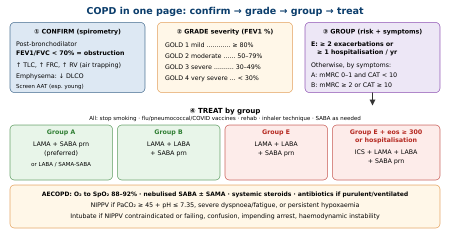

---

## 1. Title / Objectives
| Domain | Objective | Likely tested as |
|---|---|---|
| Knowledge | ⭐ Define **COPD, chronic bronchitis, emphysema**; epidemiology | The "3 months × 2 years" definition |
| Knowledge | Exogenous and endogenous risk factors | Smoking ~90%; α1-antitrypsin |
| Knowledge | ⭐ Mechanisms: inflammation, mucus, fibrosis, alveolar destruction, elastic recoil loss, air trapping, V/Q mismatch | Pathogenesis flowchart |
| Knowledge | ⭐ Clinical features | Pink puffer vs blue bloater; no clubbing |
| Knowledge | ⭐ **GOLD 1–4** (FEV1%) and **Groups A, B, E** (mMRC/CAT + exacerbations) | Grading/grouping calculations |
| Knowledge | ⭐ Non-drug measures, stable maintenance (SABA, LABA, LAMA, ICS), AECOPD (O₂ targets, steroids, bronchodilators, antibiotics, NIPPV) | Treatment by group; NIPPV indications |
| Skills | Differentiate phenotypes; interpret **spirometry, ABG, imaging**; calculate **mMRC**; plan stable and acute treatment | Case vignettes |
| Values | Smoking-cessation counselling, inhaler technique, compliance, empathy | |

**Flow:** Definition → Aetiology → Pathophysiology → GOLD classification → Clinical features → Types (pink puffer / blue bloater) → Diagnostics → Management → Acute exacerbation → Summary → Cases.

---

## 2. Main Content (Lecture Order)

### 2.1 Introduction & Definitions (Slides 5–6)
⭐ **Obstructive lung disease / COPD:** persistent respiratory **symptoms (cough, dyspnoea)** + **airflow limitation**, caused by a combination of ⭐ **small-airway obstruction** and ⭐ **parenchymal destruction**.

| Term | ⭐ Definition |
|---|---|
| ⭐ **Chronic bronchitis** | **Productive cough ≥ 3 months per year for 2 consecutive years**, not explained by another diagnosis (a **clinical** definition) |
| ⭐ **Emphysema** | **Permanent dilatation of air spaces distal to the terminal bronchioles** from **destruction of alveolar walls and pulmonary capillaries** (a **pathological** definition) |

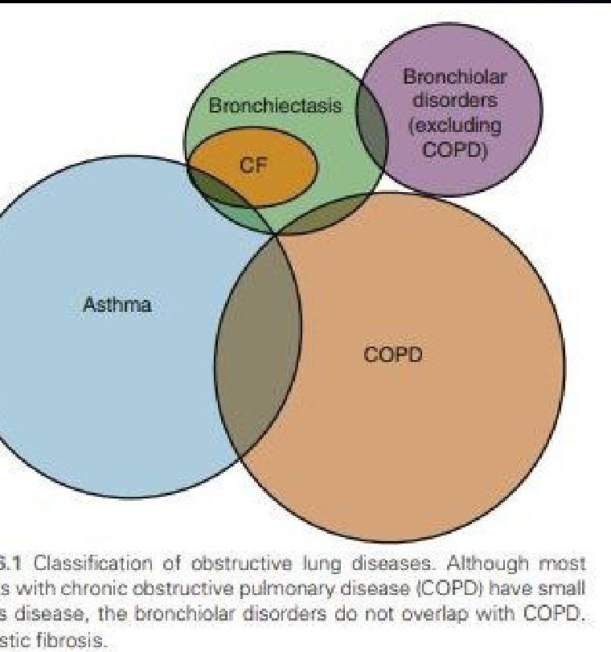

**Epidemiology (summary slide 29):** ⭐ **M:F 3:2** · US prevalence **~6%** · ⭐ **third most common cause of death worldwide** · **no curative therapy**.

> 🔁 **Recap: Definitions.** COPD = persistent symptoms + airflow limitation from small-airway disease + parenchymal destruction. Chronic bronchitis is clinical (cough 3 months × 2 years); emphysema is pathological (destroyed alveoli distal to the terminal bronchiole).
> 🔗 **Link:** Next, what causes it.
> ▶️ **Up next: Aetiology.**

---

### 2.2 Aetiology (Slide 7)
| ⭐ Exogenous | Endogenous |
|---|---|
| ⭐ **Tobacco smoke (~90% of cases)** | ⭐ **α1-antitrypsin deficiency** |
| **Air pollution / fine dusts** (occupational) | **Lung growth & development abnormalities**: recurrent pulmonary infections and **TB**, **premature birth** |
| | **Airway hyperresponsiveness** |
| | **Antibody deficiency** (e.g., **IgA deficiency**) |
| | **Primary ciliary dyskinesia** (e.g., **Kartagener syndrome**) |

⭐ **Fletcher–Peto curve (Slide 7 graph):** FEV1 declines faster in **susceptible smokers**; **stopping smoking slows the decline** (stopping at 45 helps far more than stopping at 65) *[curve name added]*.

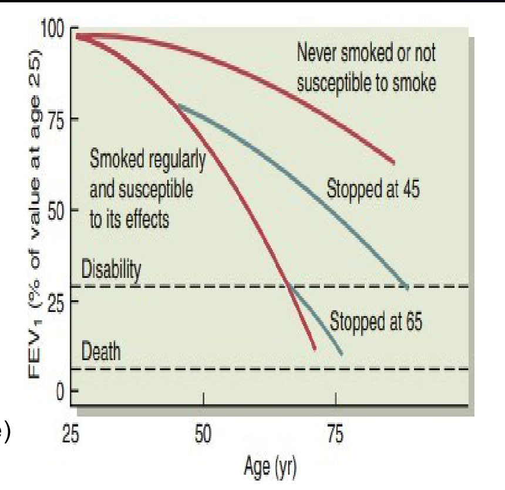

> 🔁 **Recap: Aetiology.** Smoking ~90%; also pollution/dust. Endogenous: α1-AT deficiency, abnormal lung development (infections, TB, prematurity), hyperresponsiveness, IgA deficiency, ciliary dyskinesia. Quitting earlier saves more FEV1.
> 🔗 **Link:** These insults trigger two processes, inflammation and destruction.
> ▶️ **Up next: Pathophysiology.**

---

### 2.3 Pathophysiology (Slides 8–9)
**A. ⭐ Chronic inflammation** (→ chronic bronchitis)
- ↑ **Neutrophils** → cytokine release
- ↑ **Growth factors** → **airway narrowing**
- ⭐ **Goblet-cell proliferation/hypertrophy → mucus hypersecretion → chronic productive cough**
- ⭐ **Hypoxic pulmonary vasoconstriction → pulmonary hypertension**

**B. ⭐ Tissue destruction** (→ emphysema)
- ⭐ **Nicotine inactivates protease inhibitors (especially α1-antitrypsin)** → **protease–antiprotease imbalance** → **loss of elastic tissue**
- → **Enlarged airspaces** → ⭐ **↓ DLCO** → **hypoxaemia and hypercapnia**

⭐⭐ **Pathogenesis flowchart (Slide 9):**
1. **Genetic susceptibility** (α1-AT deficiency) → ↓ lung's ability to prevent damage
2. **Environmental insult** (smoking, pollution, infection) → **free radicals** + **inactivated anti-proteases**
3. → **Lung inflammation**: ↑ oxidative stress, cytokines, protease activity
4. Two branches:
   - **Bronchial tree injury** → neutrophil infiltration → **fibrosis and narrowing** · goblet cells/↑ mucus + death of ciliated cells → **trapped mucus = nidus for infection** → ⭐ **CHRONIC BRONCHITIS**
   - **Proteolytic destruction of parenchyma** → ↓ elastic recoil → **air trapping** · ↓ structural support → **airway collapse** · permanent alveolar enlargement → **hyperinflation, bullae** → ⭐ **EMPHYSEMA**
5. Both → **COPD**

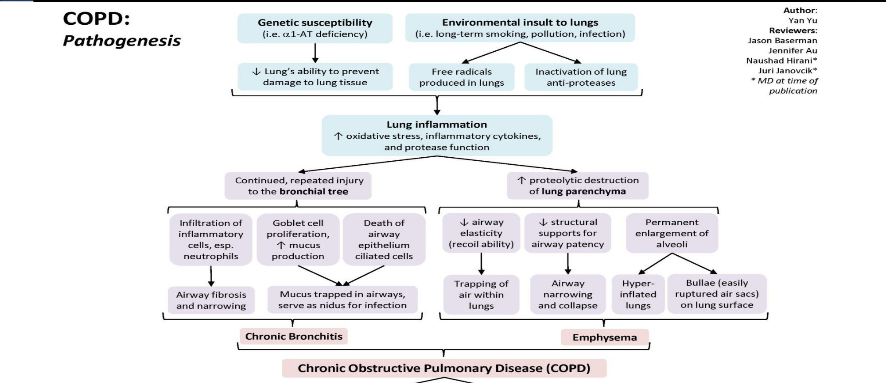

> 🔁 **Recap: Mechanism.** Inflammation (neutrophils, goblet cells, mucus, narrowing) = chronic bronchitis. Protease excess (nicotine blocks α1-AT) destroys elastin = emphysema (air trapping, ↓ DLCO). Hypoxic vasoconstriction → pulmonary HTN.
> 🔗 **Link:** Damage is measured by airflow (FEV1) and its impact on the patient (symptoms, exacerbations), which is GOLD.
> ▶️ **Up next: GOLD classification.**

---

### 2.4 GOLD Classification (Slides 10–11)
⭐⭐⭐ **Spirometric grade (post-bronchodilator FEV1 % predicted):**
| Grade | FEV1 |
|---|---|
| **GOLD 1: mild** | **≥ 80%** |
| **GOLD 2: moderate** | **50–79%** |
| **GOLD 3: severe** | **30–49%** |
| **GOLD 4: very severe** | **< 30%** |
*Mnemonic [added]:* **"80-50-30"**.

⭐⭐⭐ **GOLD groups (exacerbation risk + symptoms):**
| Group | Exacerbations in past year | mMRC | CAT |
|---|---|---|---|
| **A** | **0, or 1 not leading to admission** | **0–1** | **< 10** (0–9) |
| **B** | **0, or 1 not leading to admission** | **≥ 2** | **≥ 10** |
| ⭐ **E** | ⭐ **≥ 2, or ≥ 1 leading to hospital admission** | **Any** | **Any** |

⭐ **mMRC dyspnoea scale (Slide 24 table):**
| Grade | Breathless… |
|---|---|
| **0** | Only with **strenuous exercise** |
| **1** | **Hurrying on level ground** or walking up a **slight hill** |
| **2** | **Walks slower than peers** on level ground, or **stops for breath at own pace** |
| **3** | **Stops after ~100 yards** or a few minutes on level ground |
| **4** | **Too breathless to leave the house** / breathless **when dressing** |

> 🔁 **Recap: GOLD.** Grades 1–4 by FEV1 (80/50/30). Groups: E = ≥ 2 exacerbations or ≥ 1 admission; otherwise A (mMRC 0–1, CAT < 10) or B (mMRC ≥ 2 or CAT ≥ 10).
> 🔗 **Link:** Now what the patient looks like at the bedside.
> ▶️ **Up next: Clinical features.**

---

### 2.5 Clinical Features (Slides 12–14)
⭐ **Symptoms are minimal/non-specific until advanced.**
- **Chronic cough**, **prolonged expiration**, **dyspnoea**, **wheezing**
- **Chest hyperinflation**; **distant breath and heart sounds**
- ⭐ **Clubbing is NOT seen in COPD** *[added: if present, look for lung cancer, bronchiectasis or ILD]*
- **Accessory-muscle use**
- **Cyanosis** ("**blue bloater**"); **pursed-lip breathing** ("**pink puffer**")

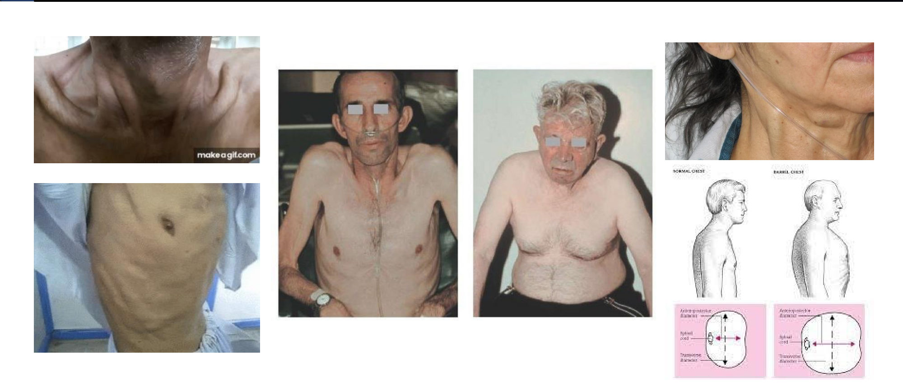

⭐⭐ **Advanced COPD (Slide 14):**
- **Congested neck veins**
- ⭐ **Barrel chest**: most common in **emphysema**
- **Asynchronous chest/abdomen movement**; accessory muscles (diaphragm dysfunction)
- ⭐ **Hyperresonance, ↓ diaphragmatic excursion, ↓ cardiac dullness**
- ⭐ **↓ breath sounds ("silent lung")**
- **Peripheral oedema**, ⭐ **RV hypertrophy & cor pulmonale**, **hepatomegaly**
- **Weight loss, cachexia**
- ⭐ **Secondary polycythaemia**
- **Confusion** (hypoxaemia, hypercapnia)

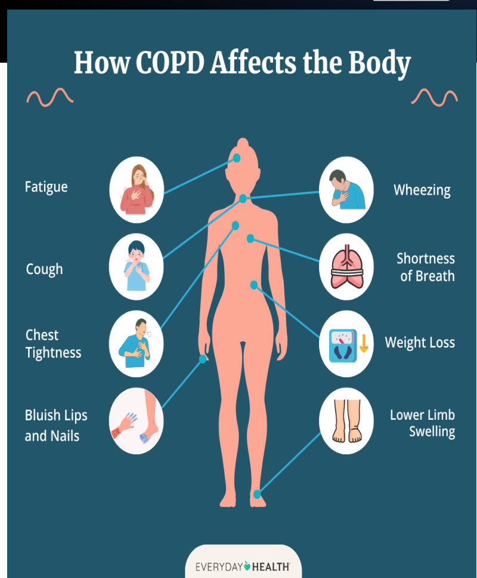

---

### 2.6 Types: Pink Puffer vs Blue Bloater (Slides 15–16)
⭐ Usually **hard to separate**; a **combination usually exists**.
| | ⭐ **Pink puffer** | ⭐ **Blue bloater** |
|---|---|---|
| Main mechanism | **Emphysema** | **Chronic bronchitis** |
| Look | **Non-cyanotic**, ⭐ **cachectic**, ⭐ **pursed-lip breathing** | ⭐ **Cyanosed**, **overweight**, ⭐ **peripheral oedema** |
| Cough | **Mild** | ⭐ **Productive** |
| PaO₂ | **Slightly ↓** | ⭐ **Markedly ↓** |
| PaCO₂ | **Normal** (hypercapnia only late) | ⭐ **↑ (early hypercapnia)** |

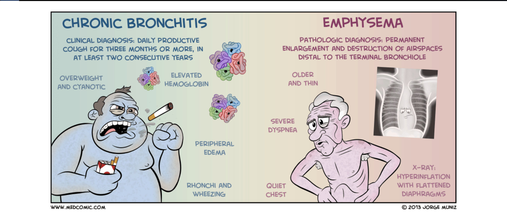

> 🔁 **Recap: Clinical.** Cough, dyspnoea, wheeze, hyperinflation, no clubbing. Advanced: barrel chest, hyperresonance, silent chest, cor pulmonale, polycythaemia, cachexia, confusion. Pink puffer (emphysema: thin, pursed lips, near-normal gases) vs blue bloater (bronchitis: cyanosed, oedematous, ↑ CO₂).
> 🔗 **Link:** Suspicion is confirmed with spirometry; imaging and ABG support it.
> ▶️ **Up next: Diagnostics.**

---

### 2.7 Diagnostics (Slides 17–21)
**History** (smoking / noxious gases) + **examination** + **investigations:**

| Test | ⭐ Findings |
|---|---|
| ⭐ **CXR** | **↑ AP diameter**, **flattened diaphragm**, **horizontal ("transverse") ribs**, **long narrow heart**, **widened intercostal spaces**, **hyperlucent lungs** |
| **Chest CT** | Similar to CXR (emphysematous spaces, bullae) |
| ⭐ **Serum α1-antitrypsin** | **Screen all patients, especially the young** |
| **ABG** | ⭐ **Chronic CO₂ retention, ↓ PO₂** |
| ⭐⭐ **Spirometry (PFT)** | ⭐ **FEV1/FVC < 70%**, **↓ FEV1**, **↑ TLC, ↑ FRC, ↑ RV**; "scooped-out" expiratory flow–volume curve |

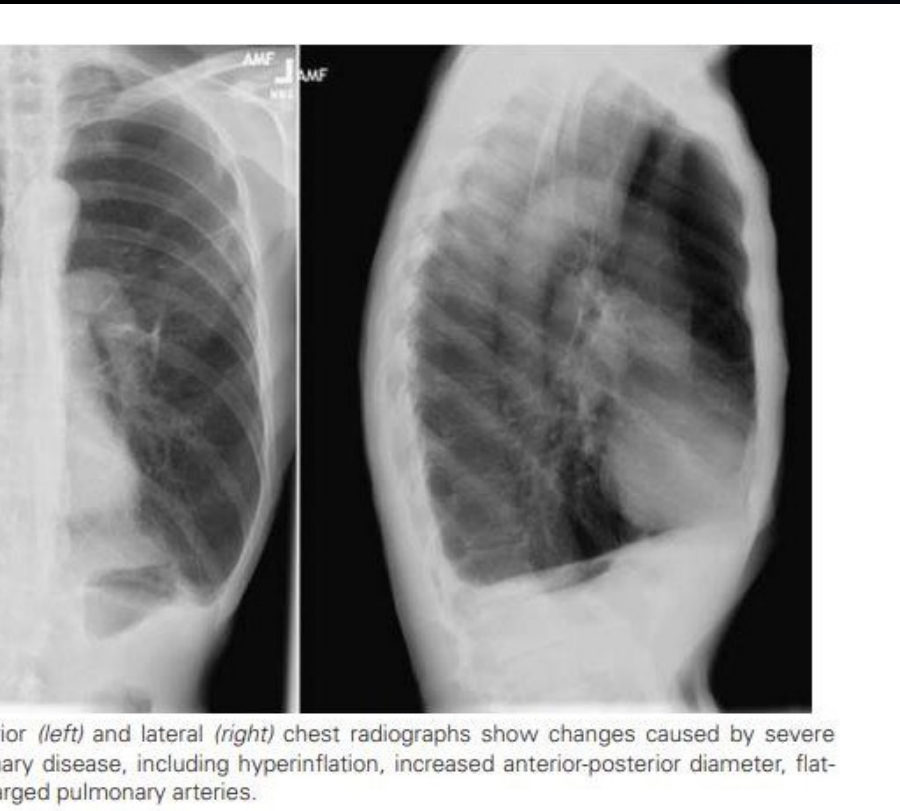 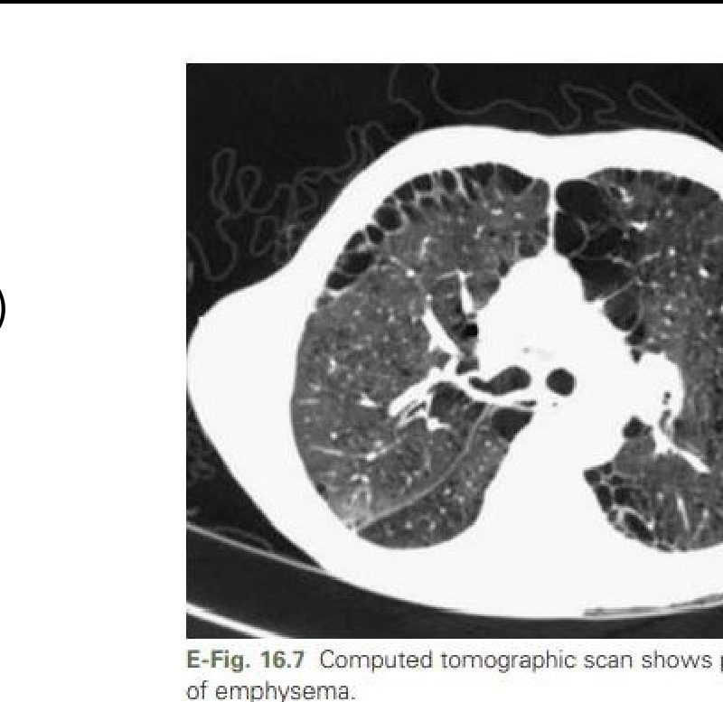

⭐⭐ **Spirometry interpretation (Slide 21):**
1. **FEV1/FVC reduced** → ⭐ **obstruction** → **grade by FEV1**
2. **FEV1/FVC normal/high** → look at **FVC**:
   - **FVC reduced** → **restriction**, confirm with lung volumes
   - **FVC normal** → **normal spirometry**

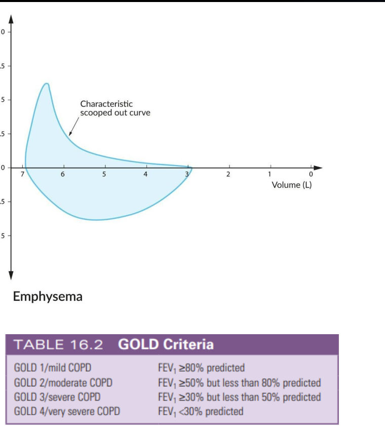 

> 🔁 **Recap: Diagnosis.** FEV1/FVC < 70% confirms obstruction; FEV1 grades it. Volumes ↑ (TLC, FRC, RV). CXR hyperinflation. ABG ↑ CO₂ ↓ O₂. Check α1-AT, especially in the young.
> 🔗 **Link:** With the grade and group known, treatment follows the GOLD group.
> ▶️ **Up next: Management of stable COPD.**

---

### 2.8 Management of Stable COPD (Slides 22–24)
**Approach (Slide 22):**
1. Assess **symptoms + exacerbation history → GOLD group**; and **comorbidities** (e.g., asthma)
2. ⭐ **Non-pharmacological care for everyone**
3. ⭐ **Drugs based on GOLD group**
4. Follow-up: ⭐ **review inhaler technique**, adjust to symptoms, ⭐ **annual spirometry** (FEV1 decline)
5. Advanced disease: **long-term oxygen**, **interventional treatment**

**⭐ Non-pharmacological:** ⭐ **smoking cessation** · ⭐ **vaccines: influenza, pneumococcal (+ COVID-19 per algorithm)** · **pulmonary rehab** · regular physical activity

**⭐ Pharmacological (Slide 23):**
- ⭐ **Oxygen if SpO₂ ≤ 88% at rest**
- ⭐ **Inhaled muscarinic antagonists = main line**
- Inhaled corticosteroids · inhaled β2-agonists · pulmonary rehab
- **Mucolytics** (N-acetylcysteine, erdosteine): break **disulfide bonds** of mucoproteins; may ↓ exacerbations in some patients
- **Additional:** surgery, antibiotics, **PDE-4 inhibitors**, opiates, theophylline

⭐ **Inhaler table (Slide 23):**
| Duration | **LABA** | **LAMA** | **Inhaled steroids** |
|---|---|---|---|
| **12 h** | Salmeterol, formoterol | Aclidinium, darotropium | Beclomethasone, budesonide, fluticasone propionate |
| **24 h** | Indacaterol, vilanterol, olodaterol, abediterol, carmoterol | ⭐ **Tiotropium**, glycopyrronium, umeclidinium | Ciclesonide, mometasone, fluticasone furoate |
*Mnemonic [added]:* **"-terol" = β-agonist; "-ium" = antimuscarinic; "-sone/-nide" = steroid.*

⭐⭐⭐ **Treatment by GOLD group (Slide 24 algorithm):**
| Group | Initial therapy (+ SABA as needed for acute dyspnoea) |
|---|---|
| **A** | ⭐ **LAMA + as-needed SABA (preferred)**; or LABA + SAMA-SABA/SABA; or as-needed SAMA-SABA/SABA |
| **B** | ⭐ **LAMA–LABA dual bronchodilator** |
| **E** (eos < 300, no admission) | **LAMA–LABA** |
| **E** with ⭐ **eosinophils ≥ 300/µL** or **hospitalisation for exacerbation** | ⭐ **ICS–LAMA–LABA (triple)** |

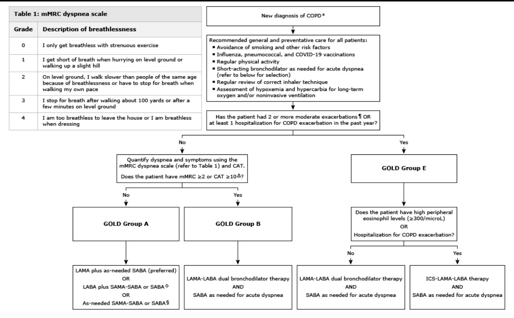

> 🔁 **Recap: Stable.** Everyone: quit smoking, vaccines, rehab, inhaler check, SABA prn. A → LAMA; B and E → LAMA + LABA; E with eosinophils ≥ 300 or admission → add ICS (triple). O₂ if SpO₂ ≤ 88% at rest. Repeat spirometry yearly.
> 🔗 **Link:** Even well-managed patients flare. Exacerbations drive decline and admissions.
> ▶️ **Up next: Acute exacerbation.**

---

### 2.9 Acute Exacerbation of COPD, AECOPD (Slides 25–28)
⭐ **Definition:** **worsening dyspnoea, ↑ cough, and a change in sputum volume or purulence**.
**Cause:** ⭐ **viral or bacterial infection (pneumonia)**.
**Investigations:** **CXR, ABG, flu swab, sputum culture**.

**Mechanism (Slide 25):** trigger → ↑ pulmonary (± systemic) inflammation → **worse airflow limitation** → ⭐ **dynamic hyperinflation** → worse gas exchange and cardiovascular strain → **worsening symptoms**.

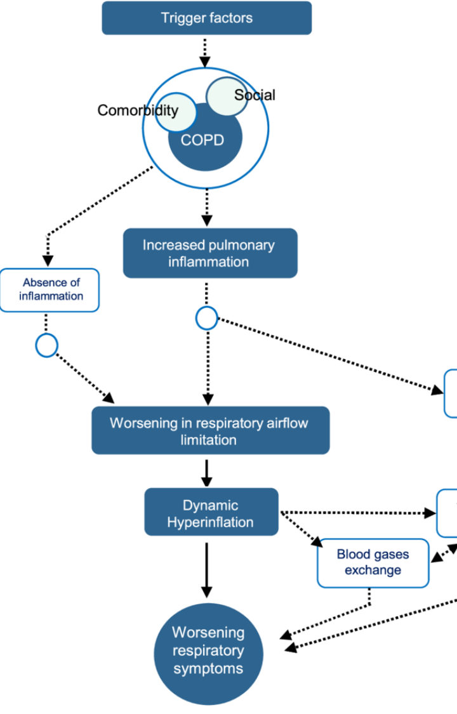

⭐⭐⭐ **Hospital management (Slide 26):**
1. ⭐ **O₂ to SpO₂ 88–92%** *[added: higher targets risk worsening hypercapnia]*
2. ⭐ **Bronchodilators**: nebulised **SABA ± SAMA** (± ICS per slide)
3. ⭐ **Systemic glucocorticoids**
4. ⭐ **Antibiotics if indicated**: **profuse purulent sputum** or **needing ventilation**
5. Adjuncts if indicated (e.g., **diuretics** for pulmonary hypertension)
6. Watch for **impending respiratory failure** (cyanosis, tachypnoea) → **ICU**
7. ⭐ **Serial ABGs**; if hypercapnia or persistent hypoxaemia, **titrate O₂ to target**

⭐⭐⭐ **NIPPV indications (Slide 27):**
- ⭐ **Respiratory acidosis: PaCO₂ ≥ 45 mm Hg and pH ≤ 7.35**
- **Severe dyspnoea** with ↑ work of breathing / **respiratory-muscle fatigue**
- **Persistent hypoxaemia despite O₂**

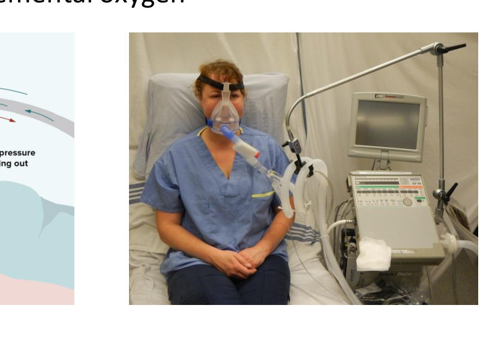

⭐⭐ **Intubation indications (Slide 28):**
- **NIPPV contraindicated**: **facial trauma, repeated vomiting, uncooperative patient**
- **Confusion**
- ⭐ **Persistent respiratory acidosis despite NIPPV**
- **Impending respiratory arrest**
- **Haemodynamic instability**

> 🔁 **Recap: AECOPD.** Worse dyspnoea + cough + sputum change, usually infection. O₂ 88–92%, nebulised SABA/SAMA, systemic steroids, antibiotics if purulent or ventilated, serial ABGs. NIPPV if pH ≤ 7.35 with PaCO₂ ≥ 45, fatigue or refractory hypoxaemia. Intubate if NIPPV fails or can't be used, or with confusion, arrest risk or shock.

---

### 2.10 Summary (Slide 29)
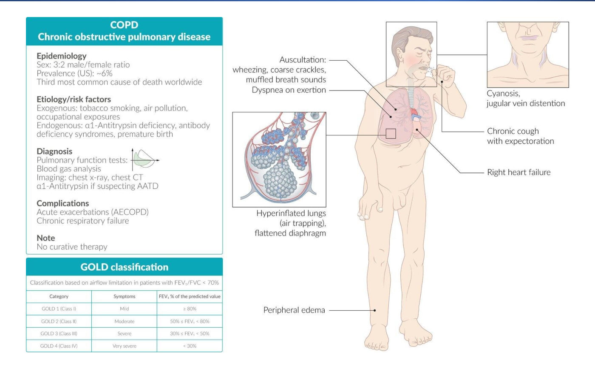
- **Epidemiology:** M:F **3:2**, prevalence ~6%, **3rd cause of death worldwide**
- **Risk:** smoking, pollution, occupation; α1-AT deficiency, antibody deficiency, prematurity
- **Diagnosis:** PFT, ABG, CXR/CT, **α1-AT if AATD suspected**
- **Complications:** **AECOPD**, **chronic respiratory failure** (and right heart failure on the figure)
- **No curative therapy**

---

## 3. High-Yield Comparison Tables

### Table A: Chronic bronchitis vs emphysema
| | Chronic bronchitis | Emphysema |
|---|---|---|
| Definition type | **Clinical** (cough 3 mo × 2 y) | **Pathological** (destruction distal to terminal bronchiole) |
| Mechanism | Inflammation, goblet cells, mucus | Protease > antiprotease, elastin loss |
| Phenotype | Blue bloater | Pink puffer |
| DLCO | Normal-ish *[added]* | ⭐ **↓** |
| CO₂ | ↑ early | Normal until late |
| Cor pulmonale | ⭐ Early/common | Late |

### Table B: GOLD grades and groups *(see §2.4)*

### Table C: Stable vs acute treatment
| | Stable | Exacerbation |
|---|---|---|
| O₂ | If SpO₂ ≤ 88% at rest | Target **88–92%** |
| Bronchodilator | Long-acting (LAMA ± LABA) + SABA prn | **Nebulised short-acting** (SABA ± SAMA) |
| Steroid | **Inhaled** (only if eos ≥ 300 / admitted) | **Systemic** |
| Antibiotic | Selected cases | If purulent sputum / ventilated |
| Ventilation | Long-term NIV in selected patients | **NIPPV** → intubation |

### Table D: NIPPV vs intubation
| NIPPV | Intubation |
|---|---|
| pH ≤ 7.35 + PaCO₂ ≥ 45 · severe dyspnoea/fatigue · persistent hypoxaemia | NIPPV contraindicated (facial trauma, vomiting, uncooperative) · confusion · acidosis despite NIPPV · impending arrest · haemodynamic instability |

### Table E: Obstructive vs restrictive spirometry *[restrictive column partly added]*
| | Obstructive (COPD) | Restrictive |
|---|---|---|
| FEV1/FVC | **↓ (< 70%)** | Normal or ↑ |
| FVC | Normal or ↓ | **↓** |
| TLC, RV | **↑** | **↓** |

---

## 4. Rules, Exceptions, Patterns
- **Spirometry confirms COPD: post-bronchodilator FEV1/FVC < 70%.**
- **FEV1 grades severity (80/50/30); exacerbations + symptoms decide the group.**
- **One hospital admission alone puts the patient in Group E.**
- **LAMA is the main line**; add LABA for B/E; add ICS only for eosinophils ≥ 300 or hospitalisation.
- **No clubbing in COPD.**
- **Emphysema: ↓ DLCO.** Asthma/pure bronchitis: DLCO normal or ↑ *[added]*.
- **O₂ stable: give if SpO₂ ≤ 88%. O₂ in AECOPD: target 88–92%** (avoid over-oxygenation).
- **Systemic steroids in exacerbations, inhaled steroids in selected stable patients.**
- **Screen α1-AT in all, especially the young.**
- **Smoking cessation is the only measure that clearly slows FEV1 decline** (Fletcher–Peto) *[added emphasis]*.

---

## 5. Clinical Correlations
- **Young patient (< 45) with basal emphysema, little smoking** → **α1-antitrypsin deficiency** *[basal and liver-disease link added]*.
- **Blue bloater with ankle oedema, raised JVP** → **cor pulmonale** (Group 3 PH, see the Pulmonary Vascular lecture).
- **Secondary polycythaemia** from chronic hypoxaemia.
- **Confusion and drowsiness in AECOPD** → CO₂ narcosis → check ABG; NIPPV/intubation.
- **Infertility + situs inversus + bronchiectasis** → Kartagener syndrome (ciliary dyskinesia).
- **Clubbing in a COPD patient** → look for lung cancer *[added]*.
- **Shipyard work** → asbestos and dust exposure (Case 1).

---

## 6. Rapid Revision (Last-Day)
- COPD = persistent symptoms + airflow limitation from small-airway disease + parenchymal destruction.
- **Chronic bronchitis: productive cough ≥ 3 mo/yr × 2 consecutive yrs. Emphysema: destroyed alveoli distal to terminal bronchiole.**
- M:F 3:2, ~6%, **3rd cause of death**, no cure.
- **Smoking ~90%**; pollution/dust. Endogenous: **α1-AT**, prematurity, TB/infections, hyperresponsiveness, **IgA deficiency**, **Kartagener**.
- Inflammation: neutrophils, goblet cells → mucus → cough; hypoxic vasoconstriction → pulmonary HTN.
- Destruction: **nicotine inactivates α1-AT** → elastin loss → **↓ DLCO**, hypoxaemia, hypercapnia.
- **GOLD 1 ≥ 80 · 2 50–79 · 3 30–49 · 4 < 30.**
- **A: ≤ 1 non-admitted exacerbation, mMRC 0–1, CAT < 10. B: mMRC ≥ 2 / CAT ≥ 10. E: ≥ 2 exacerbations or ≥ 1 admission.**
- Signs: cough, prolonged expiration, wheeze, hyperinflation, **no clubbing**, accessory muscles, pursed lips, cyanosis.
- Advanced: barrel chest, hyperresonance, silent lung, cor pulmonale, hepatomegaly, polycythaemia, cachexia, confusion.
- **Pink puffer = emphysema (thin, pursed lips, near-normal gases). Blue bloater = bronchitis (cyanosed, oedema, early ↑ CO₂).**
- CXR: ↑ AP diameter, flat diaphragm, horizontal ribs, narrow heart, hyperlucency.
- **PFT: FEV1/FVC < 70%, ↓ FEV1, ↑ TLC/FRC/RV.** α1-AT screen. ABG ↑ CO₂ ↓ O₂.
- Stable: quit smoking, flu + pneumococcal vaccines, rehab, inhaler technique, annual spirometry; **O₂ if SpO₂ ≤ 88%**; **LAMA = main line**.
- **A: LAMA + SABA. B: LAMA + LABA. E: LAMA + LABA → + ICS if eos ≥ 300 or admitted.**
- AECOPD: dyspnoea + cough + sputum change; infection. **O₂ 88–92%**, nebulised SABA ± SAMA, **systemic steroids**, antibiotics if purulent/ventilated, serial ABG.
- **NIPPV: pH ≤ 7.35 + PaCO₂ ≥ 45**, fatigue, refractory hypoxaemia. **Intubate**: NIPPV contraindicated or failing, confusion, arrest, shock.

---

## 7. Exam-Style Questions

**Q1 (MCQ, lecture Case 1, Slide 30).** 68 ♂, 1 year of increasing dyspnoea and productive cough; ex-shipyard worker; **30 pack-years**, quit 16 years ago; childhood asthma. SpO₂ 93%, scattered wheeze and rhonchi. **FEV1/FVC 63%, FEV1 65%**, ⭐ **DLCO 40%**. Most likely cause?
A) Asthma B) Chronic bronchitis C) CHF D) Pulmonary HTN E) Bronchiectasis **F) Emphysema**
**Answer: F.** *[reasoning added; the slide gives no key]* Obstruction (ratio < 70%, GOLD 2 by FEV1 65%) with a **markedly reduced DLCO** = alveolar–capillary destruction = **emphysema**. Asthma and chronic bronchitis typically have **normal DLCO**. Pulmonary HTN doesn't cause obstruction. ⚠️ He has a productive cough (bronchitis feature), but DLCO is the discriminator the question is built on.

**Q2 (MCQ, lecture Case 2, Slide 31).** 65 ♀ with COPD on salmeterol: 2 days of worse dyspnoea, cough, **yellower sputum**; HR 104, RR 28, **SpO₂ 85%**, wheeze, CXR hyperinflation without consolidation; on nasal O₂. Most appropriate initial drug therapy?
A) Prednisone + roflumilast B) Albuterol + montelukast C) Prednisone + salmeterol D) Albuterol + theophylline **E) Prednisone + albuterol** F) Prednisone + tiotropium
**Answer: E.** *[reasoning added]* AECOPD → **short-acting bronchodilator (SABA) + systemic corticosteroid**. Long-acting agents (salmeterol, tiotropium) and roflumilast are maintenance drugs. Montelukast and theophylline aren't first-line. Antibiotics would also be reasonable given the sputum colour change, but weren't offered as an option.

**Q3 (MCQ).** Spirometry FEV1/FVC 0.62, FEV1 42% predicted. GOLD grade?
a) 1 b) 2 **c) 3** d) 4
**Answer: c** (30–49%).

**Q4 (MCQ).** A COPD patient had **one hospital admission** for an exacerbation last year; mMRC 1, CAT 8. GOLD group?
a) A b) B **c) E** d) Can't classify
**Answer: c.** ≥ 1 admission = E regardless of symptoms.

**Q5 (Short answer).** List the NIPPV indications in AECOPD and three reasons to intubate instead.
**Answer:** NIPPV: **respiratory acidosis (PaCO₂ ≥ 45 mm Hg and pH ≤ 7.35)**, **severe dyspnoea with fatigue / ↑ work of breathing**, **persistent hypoxaemia despite O₂**. Intubate: **NIPPV contraindicated** (facial trauma, repeated vomiting, uncooperative), **confusion**, **persistent acidosis despite NIPPV**, **impending arrest**, **haemodynamic instability**.

---

## 8. Exam Pitfalls & Traps
1. **Chronic bronchitis is defined by spirometry.** No, it's **clinical** (cough 3 mo × 2 y); emphysema is **pathological**.
2. **Clubbing in COPD.** Not a feature; look for another cause.
3. **Group by FEV1.** Groups use **exacerbations + mMRC/CAT**; FEV1 gives the **grade** only.
4. **Group E needs 2 exacerbations.** **Or one hospitalisation.**
5. **ICS for everyone.** Only Group E with **eosinophils ≥ 300** or admission (triple therapy).
6. **High-flow O₂ to 98% in AECOPD.** Target **88–92%**.
7. **Long-acting bronchodilators for an acute attack.** Use **short-acting** (nebulised SABA ± SAMA) + **systemic steroids**.
8. **Low DLCO = bronchitis.** **Low DLCO = emphysema.**
9. **Pink puffer is cyanosed.** No, the **blue bloater** is.
10. ⚠️ **Slide inconsistency:** the stable-management bullet says "**inhaled muscarinic antagonists (main line)**" and lists ICS before β2-agonists, but the GOLD algorithm adds ICS only for eosinophils ≥ 300 / admission. Follow the algorithm.
11. ⚠️ **AECOPD slide** lists "nebulised SBA, SAB/SAMA & ICS"; read as **SABA ± SAMA**; systemic steroids are the key steroid in exacerbations.
12. ⚠️ **Slide typos:** "thiopheline" = **theophylline**; "fascial trauma" = **facial trauma**; "darotropium" appears in the LAMA list.
