# An Approach to a Case of Cough: Lung Abscess, Bronchiectasis & Cystic Fibrosis
**Dr. Essam Kotb, Associate Professor, Internal Medicine** | Source: `6-Lung_abscess_Cystic_Fibrosis__Bronchiactasis_updated.pdf` (44 slides) · Refs: Step-Up 5th ed.; Harrison 20th ed.; AMBOSS; Cecil 10th ed.; First Aid IM Boards 4th ed.

> **Legend:** ⭐ = high-yield · *[added]* = not on slides. Images marked "Slide N" come from the lecture; "Added diagram" = drawn for these notes.

> 🔗 **Bridge from the COPD and Asthma lectures:** those were **obstructive** airway diseases. This lecture covers **suppurative** (pus-forming) disease, and the links are direct: **COPD, α1-antitrypsin deficiency, aspiration and Kartagener syndrome** (all named in the COPD lecture) are **causes of bronchiectasis**, and **CF** is the classic genetic cause. The CF defect is a **faulty ATP-gated Cl⁻ channel**, the kind of membrane transport covered in Physiology Lectures 02–03.

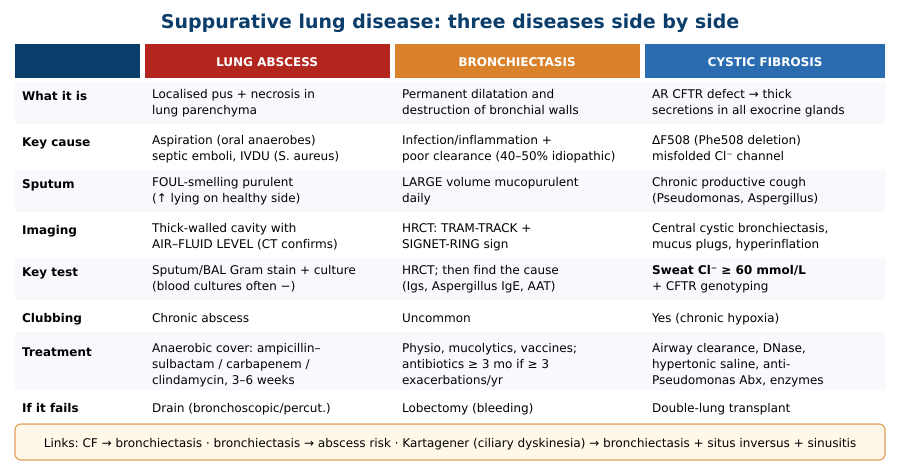

---

## 1. Title / Objectives
| Domain | Objective | Likely tested as |
|---|---|---|
| Knowledge | ⭐ Define bronchiectasis, lung abscess, CF | Definitions |
| Knowledge | ⭐ Pathophysiology: the **vicious cycle** of bronchiectasis, abscess formation, **CFTR dysfunction** | Cole's cycle; sweat vs airway Cl⁻ |
| Knowledge | Congenital, infectious, obstructive and systemic causes | Cause lists |
| Knowledge | ⭐ Clinical features and multi-organ complications: respiratory failure, clubbing, pancreatic insufficiency, CF liver disease, infertility | CF organ systems |
| Knowledge | ⭐ Management: airway clearance, CFTR modulators, **anti-Pseudomonas** antibiotics, replacement therapy | Drug choices |
| Skills | ⭐ Imaging signs on CXR/HRCT; differential of chronic cough, dyspnoea, haemoptysis; choose tests; plan acute vs chronic care | Air–fluid level; tram-track; signet ring; sweat test |
| Values | Burden of chronic illness; nutrition; immunisation | |

**Flow:** Suppurative lung disease → **Lung abscess** (definition, organisms, risks, pathophysiology, features, diagnosis, location, treatment) → **Bronchiectasis** (definition, causes, vicious cycle, features, HRCT signs, cause work-up, management) → **Cystic fibrosis** (definition, genetics, sweat vs airway pathophysiology, organ features, diagnosis, management) → Summaries → Cases.

---

## 2. Main Content (Lecture Order)

### 2.1 Suppurative Lung Disease (Slide 5)
- **Suppurative** = pus formation
- ⭐ **Suppurative lung disease** = chronic inflammation with **formation or discharge of pus** within the **airways or lung tissue**
- **Main types:** 1. **Lung abscess** · 2. **Bronchiectasis** · 3. **Cystic fibrosis** · 4. **Pneumonia**

---

### 2.2 Lung Abscess: Definition & Organisms (Slides 6–7)
⭐ **Definition:** a **localised collection of pus and necrotic tissue** within lung parenchyma caused by **microbial infection**.

| Type | Meaning |
|---|---|
| ⭐ **Primary** | In **normal lung**, typically from ⭐ **aspiration** |
| ⭐ **Secondary** | In **immunocompromise** or **pre-existing disease** (e.g., **lung neoplasm**), or from **haematogenous spread** (**septic emboli, IV drug use**) |

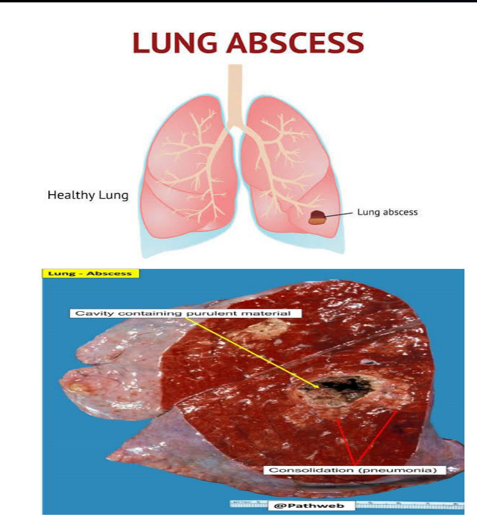

⭐⭐ **Organisms:**
- ⭐ **Most common: oral anaerobes**: **Peptostreptococcus, Prevotella, Bacteroides, Fusobacterium**
- Less common aerobes: **microaerophilic and viridans streptococci**; **S. aureus, Klebsiella pneumoniae, Pseudomonas, group A Strep, S. anginosus, H. influenzae**
- **Parasitic:** **Entamoeba histolytica**
- **Fungal:** **Aspergillus, Cryptococcus, Coccidioides, Histoplasma**

*Summary slide adds:* **Klebsiella in diabetics**; **TB, M. avium, M. kansasii**; **Paragonimus westermani**.

### 2.3 Risk Factors & Pathophysiology (Slides 8–9)
⭐ **Risk factors:**
- ⭐ **Aspiration risk**: **impaired consciousness** (alcohol *[summary slide]*, seizures *[added]*), **impaired swallowing** (neurological disease, **vocal-cord paralysis**, oesophageal dysmotility)
- ⭐ **More oral bacteria**: **periodontal disease, dental abscess, tonsillitis** (poor dentition)
- ⭐ **Bronchial obstruction**: **lung cancer, foreign body, bronchial stenosis**
- **Immunocompromise**
- **Pneumonia, bronchiectasis**
- **Impaired mucus clearance** (e.g., **CF**)
- *Summary slide:* **IV drug use, large-bore feeding tubes, DM**

⭐ **Pathophysiology sequence (Slide 9):**
1. **Aspiration** of infected material or a foreign body
2. **Pneumonitis** impairs drainage of fluid / aspirated material
3. **Inflammatory vascular obstruction**
4. **Tissue necrosis, liquefaction**
5. ⭐ **Abscess formation** *(summary slide: necrosis about **7–14 days** after aspiration)*

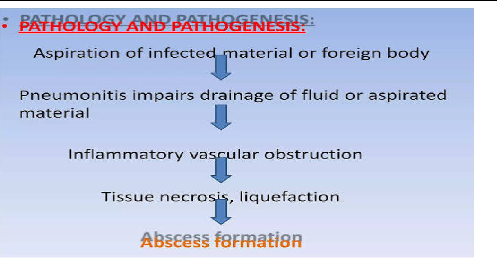

### 2.4 Clinical Features (Slide 10)
| Onset | Duration |
|---|---|
| **Acute** | Symptoms **< 4–6 weeks** |
| **Chronic** | Symptoms **> 6 weeks** |

**Symptoms:** ⭐ **fever** (~80% > 38 °C) · ⭐ **cough with foul-smelling purulent sputum** (⭐ **↑ when lying on the healthy side**, as the cavity drains *[mechanism added]*) · **night sweats** · **haemoptysis** · anorexia, **weight loss**, fatigue · **pleuritic chest pain**
**Signs:** ⭐ **clubbing in chronic abscess** · **dullness** over the area · **bronchial breath sounds** · poor dentition / gingival disease

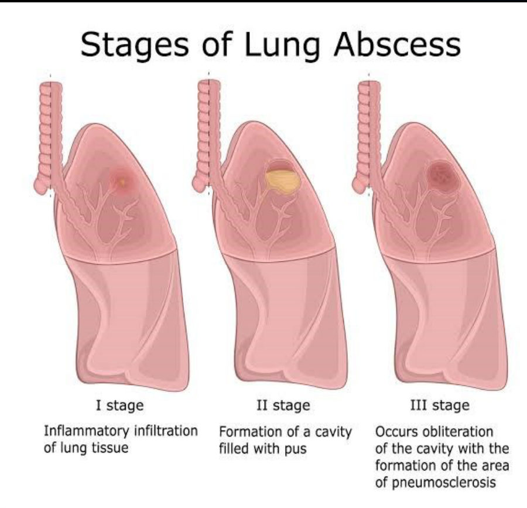

### 2.5 Diagnosis & Location (Slides 11–12)
| Test | Finding / rule |
|---|---|
| CBC | **↑ WBC** (± anaemia) |
| CRP, procalcitonin | **↑** |
| Blood culture | ⭐ **Often negative in anaerobic infection** |
| ⭐ **Sputum / BAL Gram stain and culture** | ⭐ **Don't wait for results**: take samples, **start empirical antibiotics immediately**, adjust later |
| HIV screen | If **atypical pathogens** grow |
| Bronchoscopy | Suspected **malignancy** or **foreign body** |
| Echocardiography | Suspected **endocarditis** (septic emboli) |
| **CXR** | First imaging (may be non-diagnostic early) |
| ⭐ **CT chest with IV contrast** | ⭐ **Confirms the diagnosis** |

⭐⭐ **Imaging hallmark:** **spherical intraparenchymal cavity with thick irregular walls** + ⭐ **air–fluid level**.

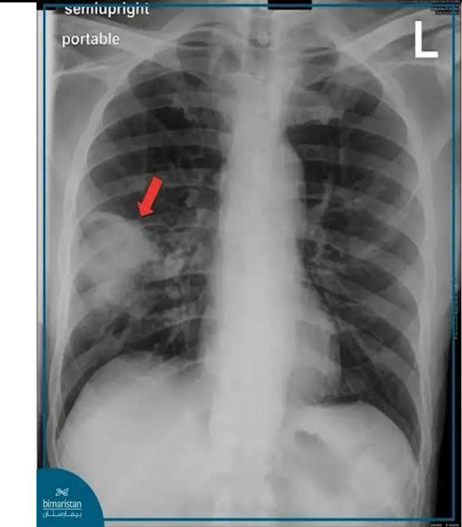 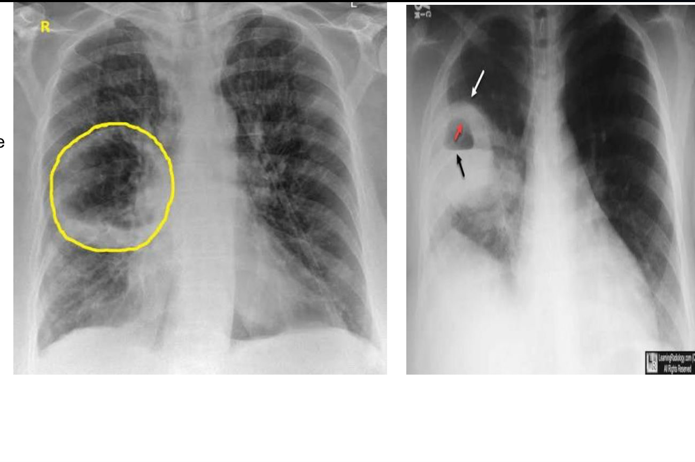

⭐ **Location (Slide 12):**
- **Aspiration** → typically **unilateral**, **right-sided** (right main bronchus is wider and more vertical *[added]*)
  - **Right middle lobe**: per slide, aspiration while **prone**
  - **Posterior segments of upper lobes / superior segments of lower lobes**: aspiration while **recumbent (supine)**
- **Haematogenous** → typically ⭐ **bilateral and multiple**

### 2.6 Treatment (Slide 13)
⭐⭐ **Antibiotics:**
- ⭐ **Broad-spectrum with anaerobic cover**: **ampicillin–sulbactam, carbapenems, or clindamycin**
- **IV drug use** → make sure **gram-positive cocci (S. aureus)** are covered
- Adjust to **culture and response**
- ⭐ Continue **3–6 weeks** or until clinical and radiological improvement
- *Summary slide:* IV ampicillin–sulbactam; piperacillin–tazobactam (Pseudomonas); carbapenems; **IV clindamycin if penicillin-allergic**; switch to oral once stable

⭐ **Interventional therapy:**
| Indications | Options |
|---|---|
| **Large abscess** *(summary: > 6 cm)* | ⭐ **First line: bronchoscopic or image-guided percutaneous drainage** |
| **Significant haemoptysis** | **Rarely: surgical resection** (segmentectomy, lobectomy, pneumonectomy) |
| **Poor response**: persistent fever/purulent sputum *(summary: fever > 10 days)*, poor radiological resolution | |

*Summary slide:* **10–15%** need lobectomy/pneumonectomy if antibiotics fail; a delayed response should prompt a search for **foreign body, cancer or bronchial stenosis**. **Differential:** vasculitis (granulomatosis with polyangiitis), malignancy, aspirated foreign body, bronchostenosis.

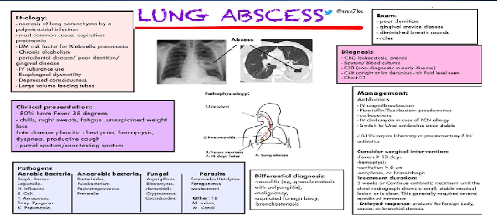

> 🔁 **Recap: Lung abscess.** Pus + necrosis, mostly from aspiration of oral anaerobes (poor teeth, impaired consciousness/swallowing). Fever, foul sputum, night sweats, weight loss, clubbing if chronic. Cavity with air–fluid level; CT confirms. Start anaerobic-covering antibiotics immediately (ampicillin–sulbactam, carbapenem, clindamycin) for 3–6 weeks. Drain if large, bleeding, or not responding.
> 🔗 **Link:** An abscess destroys a localised area of parenchyma. Repeated infection and inflammation in the **airways** instead cause permanent bronchial widening: bronchiectasis.
> ▶️ **Up next: Bronchiectasis.**

---

### 2.7 Bronchiectasis: Definition & Mechanism (Slides 14–15)
⭐⭐ **Definition:** **permanent, abnormal dilatation and destruction of bronchial walls** with **chronic infection, sputum production, airway collapse, and ciliary loss/dysfunction** → **impaired clearance of secretions**.

⭐ **It needs two processes together:**
1. **Local infection or inflammation**, plus
2. **Inadequate clearance of secretions, airway obstruction, or impaired host defence**
→ **permanent airway dilatation**

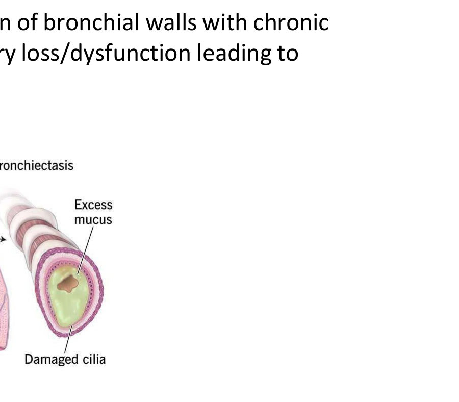

### 2.8 Causes (Slides 16–17)
| Group | Causes |
|---|---|
| **Infection / inflammation** | ⭐ **Recurrent infection**; necrotising pneumonia (**TB/mycobacteria, S. aureus, Aspergillus, influenza**); **autoimmune** disease |
| ⭐ **Clearance defects / mucus plugging** | ⭐ **Cystic fibrosis** · ⭐ **primary ciliary dyskinesia** · ⭐ **ABPA** · ⭐ **Kartagener syndrome** (bronchiectasis + **situs inversus** + **sinusitis**) · **smoking** (poor ciliary motility) |
| ⭐ **Obstruction** | **COPD**, **aspiration**, **tumours**, **foreign body**, **α1-antitrypsin deficiency**, tracheomalacia, bronchogenic cyst |
| **Immunodeficiency** | **Humoral** (hypogammaglobulinaemia), **HIV** |
| **Chronic inflammatory disease** | **Rheumatoid arthritis, Sjögren, Crohn, SLE**, post-transplant |
| ⭐ **Idiopathic** | ⭐ **40–50% of cases** |

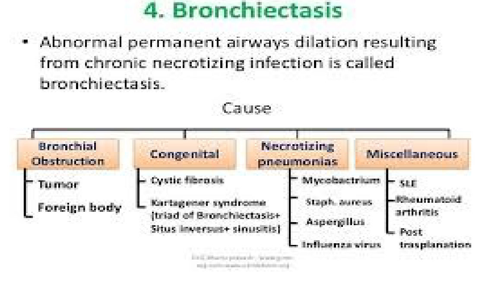

### 2.9 Pathophysiology: The Vicious Cycle (Slides 17–18)
⭐⭐⭐ **Initiation:** **congenital defect** (CF, ciliary dyskinesia, Ig deficiency) or **airway inflammation** (post-infection, ABPA, aspiration, RA, COPD) → **bacterial colonisation and infection of bronchi** →
⭐ **Continuation (vicious cycle):** **exuberant inflammatory response** (neutrophils, serine proteases) → **further bronchial damage** → **further impairment of host defences** (poor mucus clearance) → **more colonisation** → round again.
*[added: this is Cole's "vicious cycle" hypothesis.]*

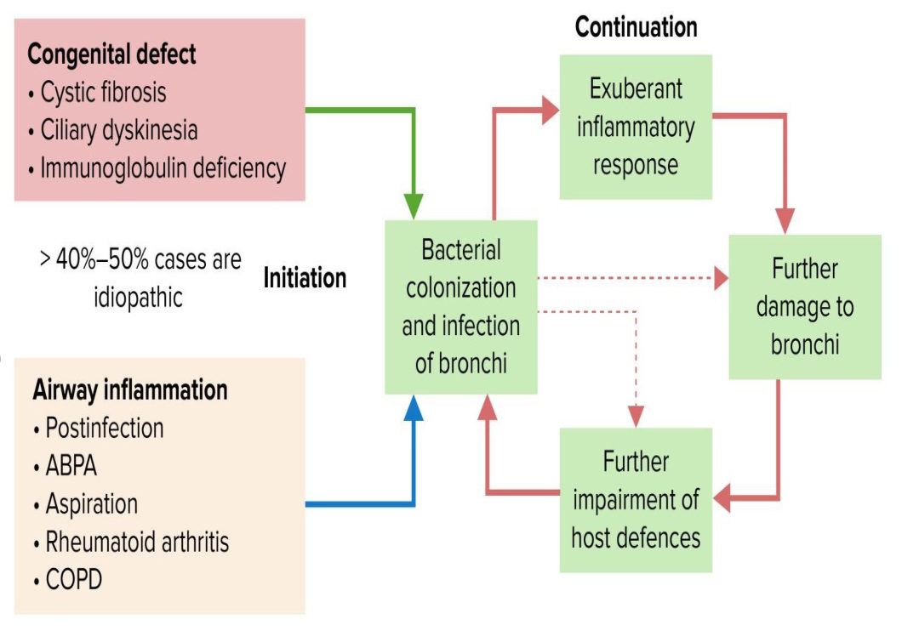 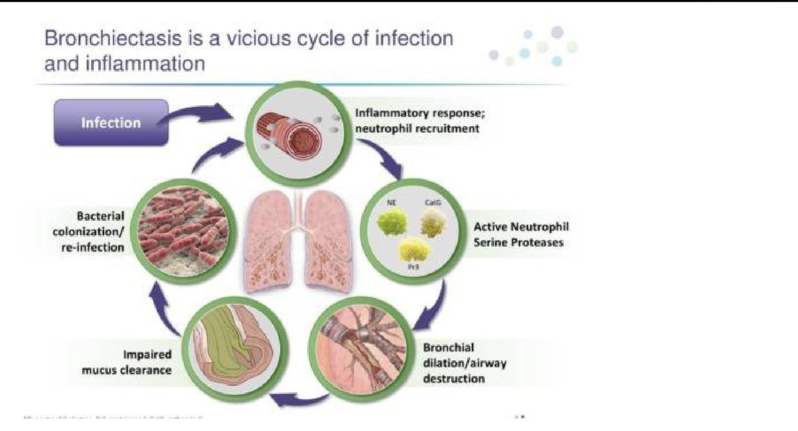

### 2.10 Clinical Features (Slides 19–20)
- ⭐ **Chronic cough with LARGE amounts of mucopurulent sputum**
- **Dyspnoea**
- ⭐ **Haemoptysis: mild, self-limiting** (can be major from bronchial vessels *[added]*)
- Non-specific: **fatigue, weight loss, pallor** (anaemia)
- **Clubbing: uncommon** (per slide)
- ⭐ **Exacerbations**: recurrent pneumonia/acute infection of dilated bronchi, ⭐ **often Pseudomonas aeruginosa**; ↑ sputum above baseline, **low-grade fever** *(figure: worsening > 2 days, needing treatment change)*
- **Auscultation:** ⭐ **coarse crackles and rhonchi**; **wheeze** (secretions, airway collapse, or coexisting disease)
- Complications (figure): **hypoxaemia, pulmonary hypertension, right heart failure**
- "Dry" bronchiectasis (figure): **non-tuberculous mycobacteria**, little sputum

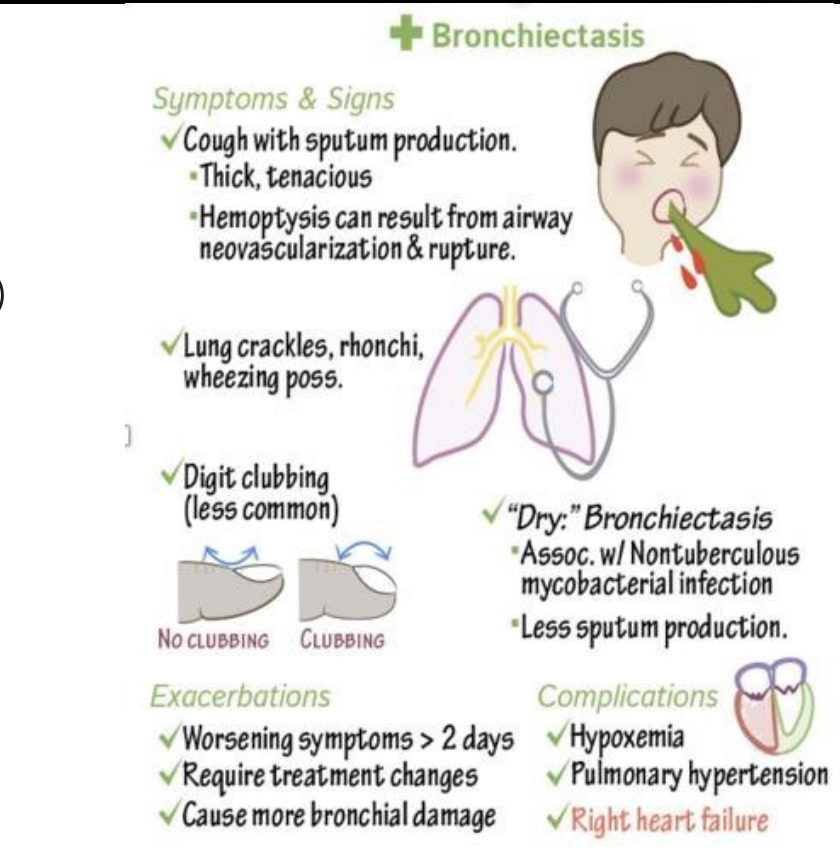

### 2.11 Diagnostics (Slides 21–24)
⭐⭐⭐ **High-resolution CT (HRCT) = the diagnostic test**:
| Sign | ⭐ Meaning |
|---|---|
| ⭐ **Tram-track sign** | **Parallel lines** of **thickened bronchial walls** around **lucent air** in dilated bronchi (bronchi that don't taper) |
| ⭐ **Signet-ring sign** | Cross-section of a **dilated bronchus larger than its adjacent pulmonary artery** (the artery is the "jewel") |

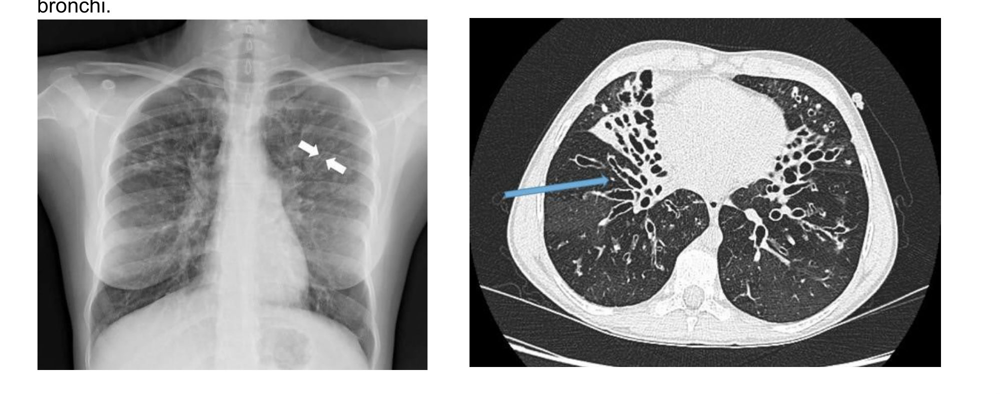 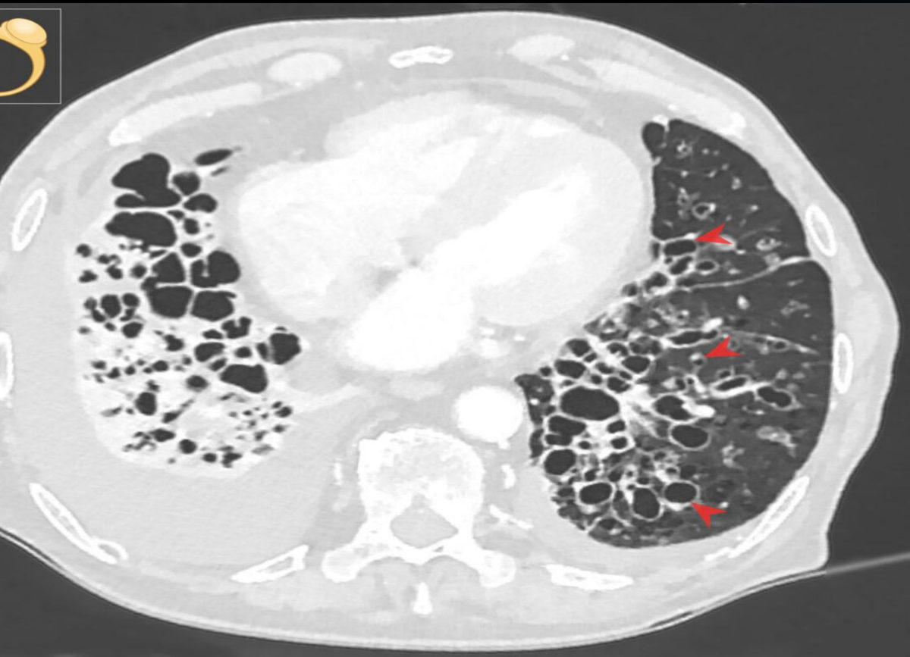

- **CXR:** abnormal but **non-specific**; may miss mild cases
- **PFTs:** obstructive pattern (not needed for diagnosis; useful to **monitor**; may be obstructive, restrictive or mixed)
- **Sputum culture** (induced sputum or BAL)

⭐⭐ **Find the cause (Slide 24):** often **idiopathic**
- **CBC:** ↓ Hb, variable WBC, ↑ platelets
- **ABG:** may show **hypercapnia**
- ⭐ **Serum immunoglobulins + electrophoresis** → exclude **immunodeficiency**
- ⭐ **Aspergillus fumigatus IgG and IgE** → exclude **ABPA**
- ⭐ **Serum AAT** → **α1-antitrypsin deficiency**
- *[added: sweat chloride / CFTR genetics if CF suspected (younger patients)]*

### 2.12 Management (Slide 25)
- ⭐ **Antibiotics**: suppress bacteria, reduce symptoms and exacerbations. ⭐ **Secondary prevention if ≥ 3 exacerbations/year**: give **for ≥ 3 months**, extend by response
- ⭐ **Vaccination**: influenza + pneumococcal
- ⭐ **Chest physiotherapy** (airway clearance)
- **Mucolytics**
- **Bronchodilators**: **limited benefit**, case-by-case
- **Oxygen therapy**
- ⭐ **Surgical resection**: **lobectomy for bronchial haemorrhage** (localised disease)

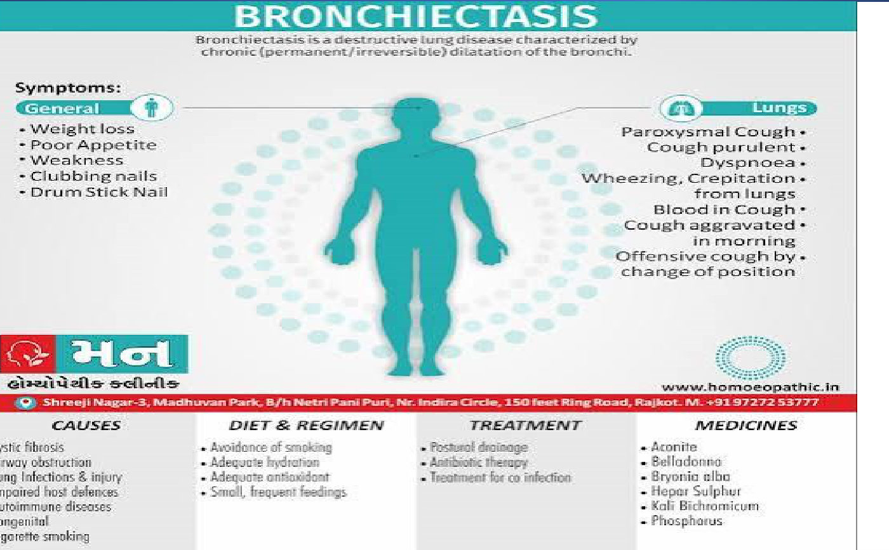

> 🔁 **Recap: Bronchiectasis.** Permanently dilated, destroyed bronchi from infection/inflammation + poor clearance (vicious cycle); 40–50% idiopathic; CF, ciliary dyskinesia, Kartagener, ABPA, immunodeficiency, COPD, AAT deficiency. Large volumes of daily purulent sputum, crackles, haemoptysis, Pseudomonas exacerbations. HRCT: tram-track + signet ring. Look for the cause (Igs, Aspergillus serology, AAT). Physio, vaccines, mucolytics; long-term antibiotics if ≥ 3 exacerbations/year; lobectomy for bleeding.
> 🔗 **Link:** The most important genetic cause of bronchiectasis is CF, which affects every exocrine gland, not only the lungs.
> ▶️ **Up next: Cystic fibrosis.**

---

### 2.13 Cystic Fibrosis: Definition & Genetics (Slides 26–27)
⭐ **Definition:** a defect in a **chloride-channel protein** → impaired **Cl⁻ and water transport** → ⭐ **thick, viscous secretions** in the **respiratory tract, exocrine pancreas, sweat glands, intestines and genitourinary tract**.

⭐⭐ **Genetics:**
- ⭐ **Autosomal recessive**
- **CFTR** (cystic fibrosis transmembrane conductance regulator) gene mutations
- ⭐ Most common: **codon deletion → absent phenylalanine at position 508 (ΔF508)**

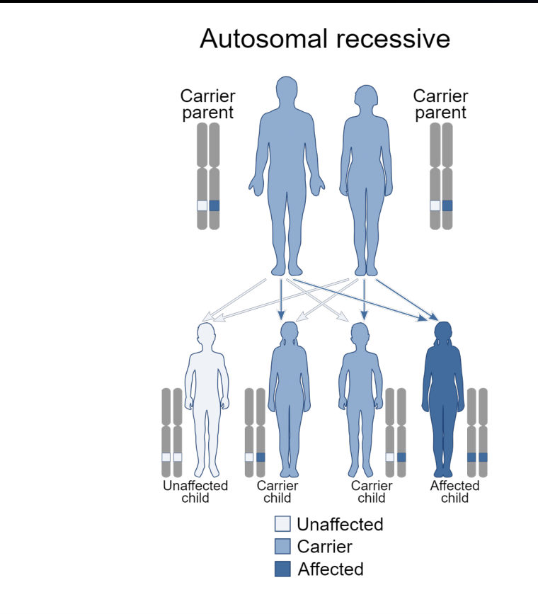

### 2.14 Pathophysiology: Sweat vs Other Glands (Slides 28–29)
⭐ Mutated CFTR → **misfolded protein** → **no ATP-gated Cl⁻ channel** on epithelial surfaces.

⭐⭐⭐ **The channel runs in opposite directions in different glands:**
| | **Sweat glands** | **All other exocrine glands** (lungs, GI) |
|---|---|---|
| Normal CFTR job | Cl⁻ **lumen → cell (reabsorption)** | Cl⁻ **cell → lumen (secretion)** |
| In CF | Can't **reabsorb** Cl⁻ → **less Na⁺ and water reabsorbed** | Can't **secrete** Cl⁻ (and water) → intracellular Cl⁻ builds up → **↑ Na⁺ and water reabsorption** |
| Result | ⭐ **Salty sweat (↑ NaCl)** → basis of the **sweat test** | ⭐ **Dehydrated, hyperviscous mucus** → **blocks small passages** |

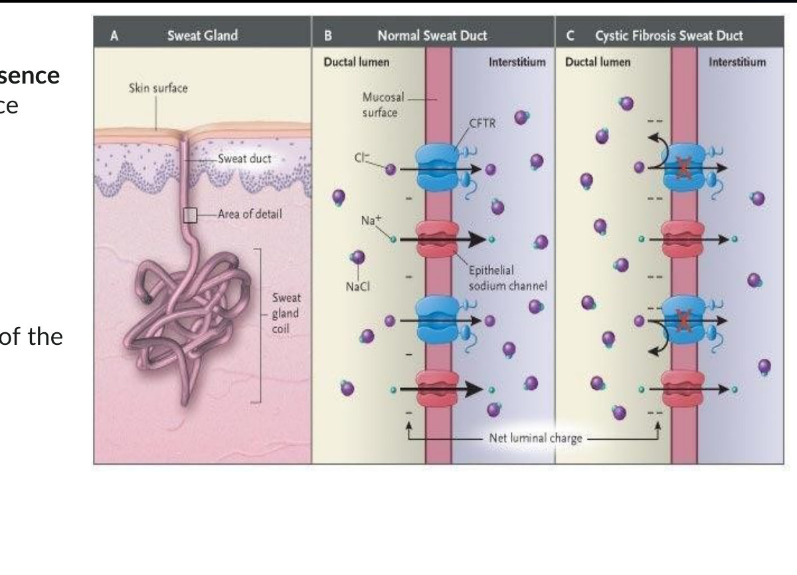

### 2.15 Clinical Features by System (Slides 30–33)
**⭐ Respiratory** (common in **adulthood**):
- **Chronic obstructive lung disease with bronchiectasis**
- **Chronic sinusitis**, ⭐ **nasal polyps**
- Recurrent productive cough and infections; ⭐ susceptibility to **Pseudomonas aeruginosa, Aspergillus**
- Wheeze/dyspnoea (obstruction, hyperreactivity)
- **Barrel chest**, moist rales, **hyperresonance**
- **Haemoptysis**
- ⭐ **Clubbing** (chronic hypoxia)

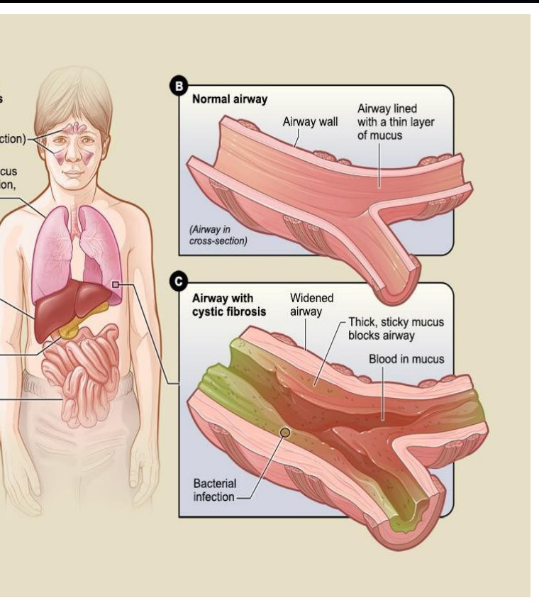

**⭐ Gastrointestinal** (common in **children**):
- ⭐ **Meconium ileus** (newborn)
- ⭐ **Failure to thrive**
- **Pancreas:** pancreatitis; ⭐ **CF-related diabetes**; ⭐ **exocrine pancreatic insufficiency** → **foul-smelling steatorrhoea**, ⭐ **fat-soluble vitamin (A, D, E, K) deficiency**, malabsorption, abdominal distension, diarrhoea, **hypoproteinaemia**
- **Liver/biliary:** gallstones, **cholestasis**, **fatty liver → cirrhosis**, ⭐ **biliary cirrhosis with portal hypertension**
- **Intestinal obstruction** (distension, pain, palpable mass) *[added: distal intestinal obstruction syndrome]*
- ⭐ **Rectal prolapse**

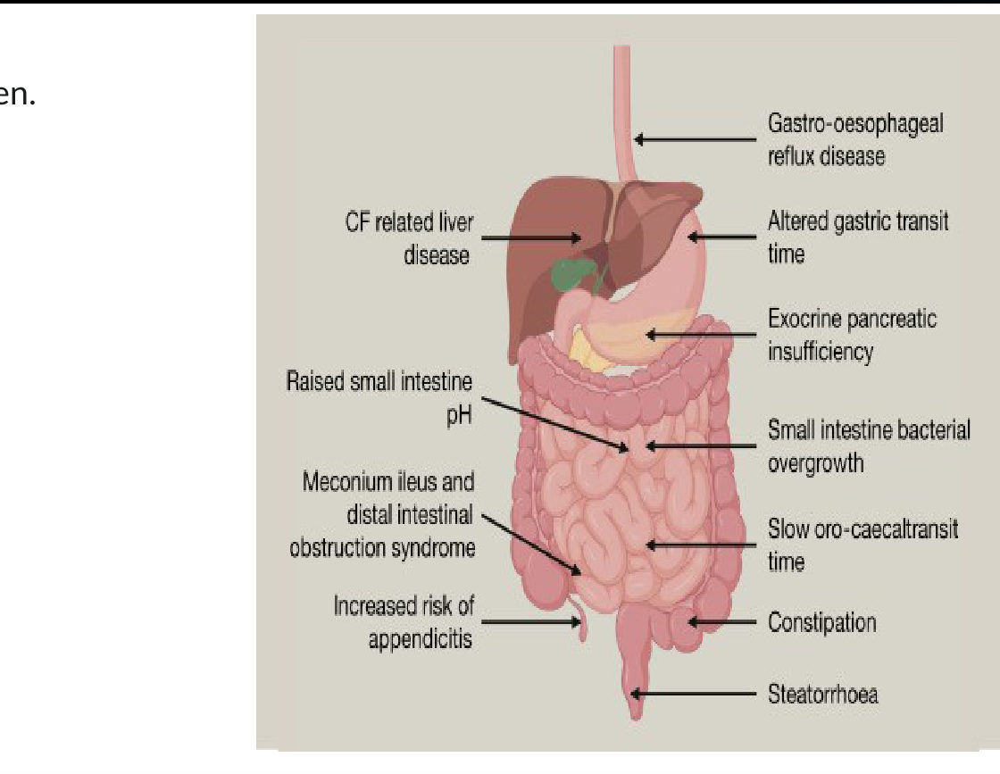

**Other systems:**
| System | Features |
|---|---|
| **Sweat** | ⭐ **Very salty sweat**; possible **electrolyte wasting** |
| **Musculoskeletal** | **Fractures from osteopenia**; **kyphoscoliosis** |
| **Urinary** | **Nephrolithiasis, nephrocalcinosis**; frequent **UTIs** |
| ⭐ **Male genital** | ⭐ **Usually infertile**: **obstructive azoospermia** (spermatogenesis may be intact); ⭐ **absent vas deferens**; undescended testis |
| **Female genital** | **Reduced fertility** (viscous cervical mucus); **menstrual abnormalities** (amenorrhoea) |
| **Development** | **Delayed secondary sexual characteristics** |

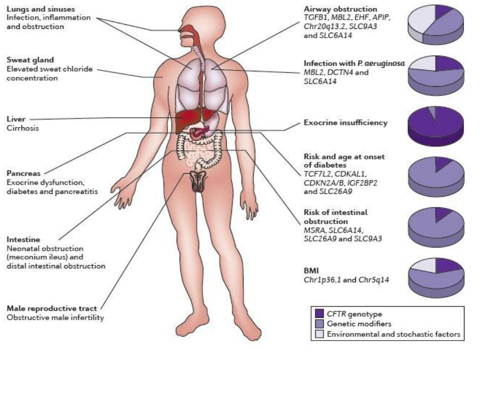

### 2.16 Diagnostics (Slide 34)
- ⭐⭐ **Sweat chloride test: ≥ 60 mmol/L** (diagnostic)
- ⭐ **CFTR genotyping**
- **Nasal potential difference** (Cl⁻ movement)
- **CXR** (central cystic bronchiectasis, mucus plugging)
- **PFTs**: obstructive pattern

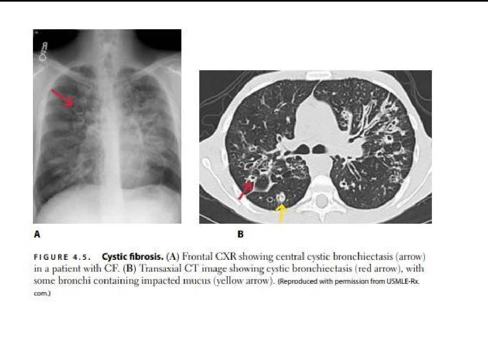

### 2.17 Management (Slides 35–36)
**⭐ Pharmacological:**
| Therapy | Detail |
|---|---|
| **High-dose ibuprofen** | Slows lung decline; consider in **6–17 y with mild disease** |
| **Bronchodilators (SABA, LABA)** | Before inhaled therapy / physio, or for hyperresponsiveness; **not routine long-term** |
| ⭐ **Mucolytics** | ⭐ **Hypertonic saline (6–7%) nebulised** (osmotic + mucociliary effect) · ⭐ **Dornase alfa** (aerosolised recombinant **DNase**: breaks down DNA in mucus) |
| ⭐ **Antibiotics** | For infections, ⭐ **especially Pseudomonas** |
| **Oxygen** | **Intermittent**: desaturation with exercise/sleep · **Long-term**: hypoxia on room air, or borderline hypoxia + cor pulmonale |
| ⭐ **Double-lung transplant** | End-stage |
| *CFTR modulators* | *Named in the objectives only [added: e.g., ivacaftor; elexacaftor–tezacaftor–ivacaftor for ΔF508]* |

**⭐ Non-pharmacological:**
- ⭐ **Airway clearance techniques**: **mainstay** of CF care
- **Vaccinations** (influenza, pneumococcal)
- ⭐ **Chest physiotherapy**: postural drainage with percussion/clapping
- **Exercise** (swimming, jogging, cycling)

**⭐ Treat other systems:** ⭐ **pancreatic enzyme replacement**; ⭐ **fat-soluble vitamin supplements**

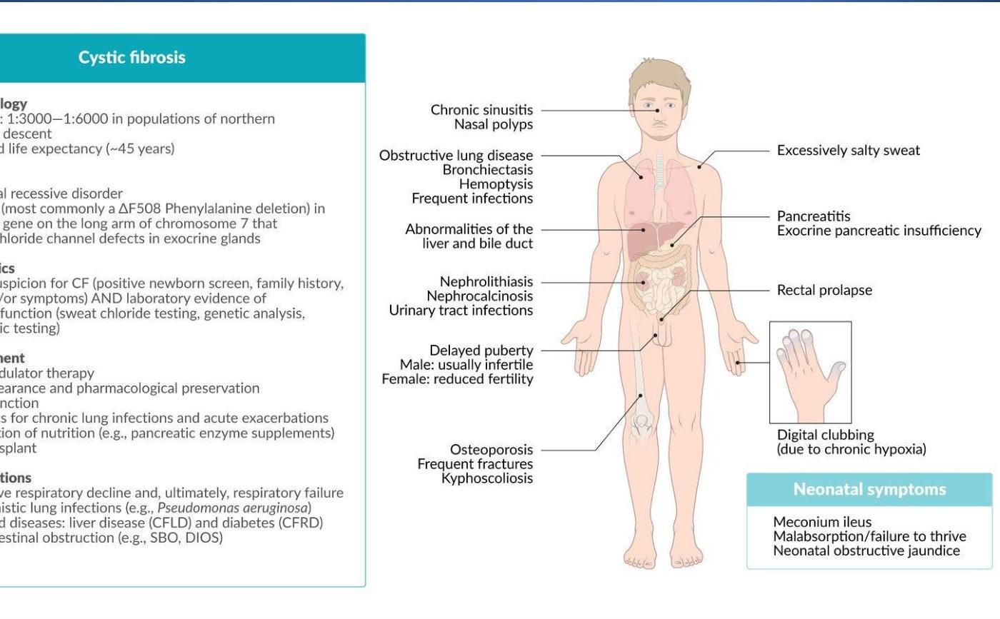

> 🔁 **Recap: CF.** Autosomal recessive CFTR defect (ΔF508). Sweat glands can't reabsorb Cl⁻ (salty sweat); other glands can't secrete it (thick mucus). Lungs: bronchiectasis, Pseudomonas, polyps, clubbing. GI: meconium ileus, failure to thrive, steatorrhoea, ADEK deficiency, CF diabetes, biliary cirrhosis, rectal prolapse. Infertile men (absent vas). Sweat Cl⁻ ≥ 60. Airway clearance, DNase, hypertonic saline, anti-Pseudomonas antibiotics, enzymes and vitamins, transplant.

---

## 3. High-Yield Comparison Tables

### Table A: The three diseases *(see the added diagram at the top)*

### Table B: CFTR in sweat vs airway *(see §2.14)*

### Table C: Imaging signs
| Sign | Disease |
|---|---|
| Thick-walled cavity + **air–fluid level** | **Lung abscess** |
| **Tram-track** (parallel thick walls) | **Bronchiectasis** |
| **Signet ring** (bronchus > artery) | **Bronchiectasis** |
| Central cystic bronchiectasis + mucus plugs | **CF** |

### Table D: Bronchiectasis work-up
| Test | Looks for |
|---|---|
| Immunoglobulins + electrophoresis | Humoral immunodeficiency |
| Aspergillus IgG/IgE | ABPA |
| Serum AAT | α1-antitrypsin deficiency |
| Sweat chloride / genetics *[added]* | CF |
| Sputum culture | Pseudomonas, NTM |

### Table E: Antibiotic rules
| Disease | Antibiotic rule |
|---|---|
| Lung abscess | **Anaerobic cover** (amp–sulbactam, carbapenem, clindamycin), **3–6 weeks**; add S. aureus cover in IVDU |
| Bronchiectasis | Treat exacerbations (often Pseudomonas); **≥ 3 months prophylaxis if ≥ 3 exacerbations/yr** |
| CF | **Anti-Pseudomonas** |

---

## 4. Rules, Exceptions, Patterns
- **Abscess = oral anaerobes via aspiration** until proven otherwise; **multiple bilateral = haematogenous**.
- **Blood cultures are often negative in anaerobic abscess**; culture sputum/BAL.
- **Start antibiotics immediately after sampling**; don't wait.
- **CT with contrast confirms an abscess; HRCT confirms bronchiectasis.**
- **Drainage, not surgery, is first-line intervention** for an abscess.
- **Bronchiectasis needs infection/inflammation PLUS impaired clearance/defence.**
- **40–50% of bronchiectasis is idiopathic.**
- **Pseudomonas = the exacerbation organism** in bronchiectasis and CF.
- **CFTR reabsorbs Cl⁻ in sweat ducts but secretes Cl⁻ elsewhere**, hence salty sweat but dry mucus.
- **Sweat Cl⁻ ≥ 60 mmol/L = CF.**
- **Lungs dominate in adults; GI dominates in children** with CF.
- **Male CF infertility is obstructive** (absent vas); spermatogenesis may be normal.

---

## 5. Clinical Correlations
- **Alcoholic or post-stroke patient with poor teeth and foul sputum** → aspiration lung abscess.
- **IV drug user with multiple bilateral cavities** → septic emboli (right-sided endocarditis) → echocardiogram, S. aureus cover.
- **Abscess not resolving on antibiotics** → bronchoscopy for **cancer or foreign body**.
- **Situs inversus + chronic sinusitis + bronchiectasis + male infertility** → Kartagener syndrome.
- **Asthmatic with worsening wheeze, eosinophilia, central bronchiectasis** → ABPA (Aspergillus IgE) *[central detail added]*.
- **Newborn with meconium ileus** → CF until proven otherwise.
- **Child with recurrent pneumonia + greasy stools + poor growth** → sweat test (Case 2).
- **Young man with azoospermia and absent vas deferens** → check CFTR.
- **Massive haemoptysis in bronchiectasis** → bronchial artery embolisation *[added]* or lobectomy (slide).

---

## 6. Rapid Revision (Last-Day)
- Suppurative lung disease: **abscess, bronchiectasis, CF, pneumonia**.
- **Abscess** = localised pus + necrosis. Primary (aspiration, normal lung) vs secondary (immunocompromise, cancer, septic emboli/IVDU).
- Organisms: **oral anaerobes** (Peptostreptococcus, Prevotella, Bacteroides, Fusobacterium); aerobes (S. aureus, Klebsiella, Pseudomonas, Strep); **E. histolytica**; fungi.
- Risks: impaired consciousness/swallowing, **poor dentition**, obstruction (cancer, foreign body), immunocompromise, CF.
- Sequence: aspiration → pneumonitis → vascular obstruction → necrosis/liquefaction → abscess (7–14 days).
- Acute < 4–6 weeks; chronic > 6 weeks. **Fever, foul purulent sputum** (↑ lying on healthy side), night sweats, haemoptysis, weight loss, pleuritic pain; **clubbing if chronic**.
- ↑ WBC, CRP, PCT; **blood cultures often negative**; sputum/BAL culture; **start empirical antibiotics immediately**; **CT with contrast confirms**; **cavity + air–fluid level**.
- Location: aspiration → right; prone → RML (slide); supine → posterior upper / superior lower segments; haematogenous → **bilateral, multiple**.
- Rx: **ampicillin–sulbactam / carbapenem / clindamycin**, **3–6 weeks**; drainage if large, bleeding or failing; surgery rarely.
- **Bronchiectasis** = permanent dilatation/destruction; infection/inflammation + poor clearance; **vicious cycle**; **40–50% idiopathic**.
- Causes: recurrent infection, **CF, PCD, ABPA, Kartagener**, smoking, **COPD, aspiration, tumour, AAT deficiency**, immunodeficiency, RA/Sjögren/Crohn.
- **Large daily mucopurulent sputum**, dyspnoea, mild haemoptysis, crackles/rhonchi; clubbing uncommon; exacerbations (**Pseudomonas**).
- **HRCT: tram-track + signet ring.** Work-up: **Igs, Aspergillus IgG/IgE, AAT**.
- Rx: **antibiotics ≥ 3 mo if ≥ 3 exacerbations/yr**, vaccines, **physio**, mucolytics, O₂, **lobectomy for bleeding**.
- **CF** = AR, **CFTR ΔF508**, misfolded ATP-gated Cl⁻ channel. Sweat: can't reabsorb → **salty**. Airway/GI: can't secrete → **thick mucus**.
- CF lungs: bronchiectasis, **Pseudomonas/Aspergillus**, sinusitis, **nasal polyps**, clubbing. GI: **meconium ileus**, failure to thrive, **steatorrhoea, ADEK deficiency**, CF diabetes, biliary cirrhosis, **rectal prolapse**. Male **infertility (absent vas)**.
- **Sweat Cl⁻ ≥ 60 mmol/L**; genotyping; nasal potential difference.
- CF Rx: **airway clearance (mainstay)**, **hypertonic saline, dornase alfa**, anti-Pseudomonas antibiotics, ibuprofen (6–17 y), O₂, **enzymes + ADEK**, vaccines, **double-lung transplant**.

---

## 7. Exam-Style Questions

**Q1 (MCQ, lecture Case 1, Slide 40).** 65 ♂, long-standing productive cough, worse since a **stroke 3 years ago**; 40 pack-years; now **copious blood-tinged sputum**, fever 38 °C, SpO₂ 92%, ⭐ **clubbing**, **coarse crackles**. CXR: ⭐ **tram-track opacities** in the right lower field. Diagnosis?
**a. Bronchiectasis** b. Chronic bronchitis c. Aspiration pneumonia d. Emphysema e. PE f. Lung cancer
**Answer: a.** *[reasoning added; no key on the slide]* **Tram-track sign** + chronic copious sputum + haemoptysis + crackles = bronchiectasis. Recurrent **aspiration after the stroke** (right lower lobe) is the likely cause. Chronic bronchitis and emphysema don't give tram tracks; aspiration pneumonia doesn't explain years of symptoms.

**Q2 (MCQ, lecture Case 2, Slide 41).** 2-year-old: productive cough, **4 pneumonias in a year**, **foul-smelling, bulky, greasy stools**, **3rd percentile height, 5th weight**. Best initial test for the cause?
**e. Sweat chloride test**
**Answer: e.** Recurrent chest infections + steatorrhoea (pancreatic insufficiency) + failure to thrive = **cystic fibrosis** → **sweat chloride (≥ 60 mmol/L)** first. Genetic testing confirms or follows *[ordering added]*. Immunoglobulins would suit immunodeficiency, but that doesn't explain steatorrhoea.

**Q3 (MCQ).** An alcoholic man has fever, foul-smelling sputum and a thick-walled cavity with an air–fluid level. Best initial antibiotic?
a) Azithromycin **b) Ampicillin–sulbactam** c) Ciprofloxacin d) Vancomycin alone
**Answer: b** (anaerobic cover; clindamycin if penicillin-allergic).

**Q4 (MCQ).** On HRCT, a bronchus appears larger than its accompanying pulmonary artery. This is the:
a) Tram-track sign **b) Signet-ring sign** c) Air-crescent sign d) Halo sign
**Answer: b.**

**Q5 (Short answer).** Explain why CF patients have salty sweat but thick airway mucus.
**Answer:** CFTR normally **reabsorbs** Cl⁻ from the **sweat duct lumen** but **secretes** Cl⁻ into the lumen in **airway/GI glands**. Without it, sweat Cl⁻ (and Na⁺) **can't be reabsorbed** → salty sweat. In the airways Cl⁻ and water **aren't secreted** while Na⁺ and water reabsorption rises → **dehydrated, viscous mucus**.

---

## 8. Exam Pitfalls & Traps
1. **Blood cultures are usually positive in lung abscess.** Often **negative** with anaerobes; use sputum/BAL.
2. **Waiting for culture before antibiotics.** Start **empirically** after sampling.
3. **Surgery first for an abscess.** First-line intervention is **drainage**; surgery is rare.
4. **Haematogenous abscesses are single.** They're **bilateral and multiple**.
5. **CXR diagnoses bronchiectasis.** It's non-specific; **HRCT** is needed.
6. **Clubbing is common in bronchiectasis.** The slide says **uncommon**; it's typical of chronic abscess and CF.
7. **CFTR direction:** reabsorbs Cl⁻ in **sweat** but secretes it in **airways/GI**.
8. **CF male infertility = no sperm production.** It's **obstructive** (absent vas); spermatogenesis may be intact.
9. **Bronchodilators are core in bronchiectasis/CF.** **Limited benefit**; not routine long-term.
10. ⚠️ **Location slide:** the lecture says aspiration while **prone → right middle lobe**. Many texts teach **upright → basal segments of the right lower lobe** and **supine → posterior upper / superior lower lobe segments**. Answer per the lecture, but know the standard teaching.
11. ⚠️ **Antibiotic thresholds:** bronchiectasis prophylaxis is for **≥ 3 exacerbations/year**, for **≥ 3 months**. Don't confuse with abscess treatment (3–6 weeks).
12. ⚠️ **Slide typo:** "Bronchiactasis" in the file title = bronchiectasis. **CFTR modulators** appear in the objectives but not on any slide.
