# Lung Cancer: An Approach to a Case of Haemoptysis
**Dr. Essam Kotb, Associate Professor, Internal Medicine** | Source: `8-Lung_Cancer_Updated.pdf` (35 slides) · Refs: Step-Up 5th ed.; Harrison 20th ed.; AMBOSS; Cecil 10th ed.; First Aid IM Boards 4th ed.; Osmosis

> **Legend:** ⭐ = high-yield · *[added]* = not on slides. Images marked "Slide N" come from the lecture; "Added diagram" = drawn for these notes.

> 🔗 **Bridge from the Pleura lecture (same lecturer):** malignancy was a cause of **exudative effusion** and **haemothorax**, and **lymphocyte-rich exudate** suggested TB or cancer. Lung cancer was also a cause of **lung abscess** (bronchial obstruction) and **clubbing in COPD** (a red flag). This lecture covers the cancer itself and the symptom it often presents with: **haemoptysis**.

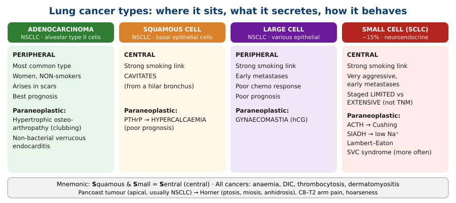

---

## 1. Title / Objectives
| Domain | Objective | Likely tested as |
|---|---|---|
| Knowledge | ⭐ Epidemiology and risk factors: smoking, **radon**, **asbestos**, other carcinogens | Smoking 80–90%; radon #2 |
| Knowledge | ⭐ Histological types: location and cell of origin | Central vs peripheral; adeno in non-smokers |
| Knowledge | ⭐ Presentation: pulmonary, constitutional, local invasion, metastatic | SVC, Pancoast, Horner |
| Knowledge | ⭐⭐ **Paraneoplastic syndromes by subtype** | SIADH/ACTH/Lambert–Eaton = SCLC; PTHrP = squamous |
| Knowledge | ⭐ **TNM (NSCLC) vs limited/extensive (SCLC)** | Staging system choice |
| Knowledge | Haemoptysis differential and work-up; **low-dose CT screening** | Screening criteria |
| Skills | Interpret CXR/CT; **solitary nodule algorithm**; **massive vs non-massive haemoptysis**; tissue diagnosis and staging; treatment by stage/type; resuscitation in massive haemoptysis | Case vignettes |
| Values | Multidisciplinary care, guidelines, screening | |

**Flow:** Risk factors → Types → Staging (TNM, SCLC) → Signs & symptoms (local invasion: SVC, Pancoast, Horner; pulmonary; extrapulmonary; metastases; paraneoplastic) → Diagnostics → Management → Screening → Solitary nodule → Haemoptysis (history, exam, DDx, work-up, massive) → Summary → Cases.

---

## 2. Main Content (Lecture Order)

### 2.1 Risk Factors (Slide 5)
- ⭐⭐ **Smoking**: **80–90%** of lung cancers; related to **pack-years**
- ⭐ **Occupational / environmental:** **passive smoking** · ⭐ **radon (2nd leading cause)** and uranium · ⭐ **asbestos** · arsenic, silica · air pollution
- **Family history** (genetic predisposition)
- **Others:** **pulmonary scarring**, **previous radiation**, **pulmonary fibrosis**, chronic infection (**TB, HIV**)

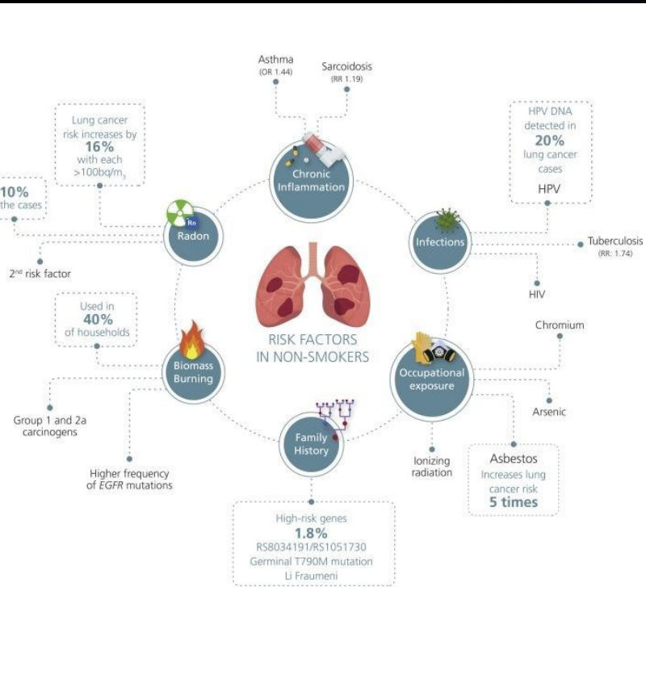

---

### 2.2 Types (Slides 6–7)
| | **SCLC** | **NSCLC** |
|---|---|---|
| Share | **~15%** | ⭐ **~85%** |
| Subtypes | Small cell (neuroendocrine) | **Adenocarcinoma** (alveolar type II cells) · **Squamous** (basal epithelial cells) · **Large cell** (various epithelial cells) |

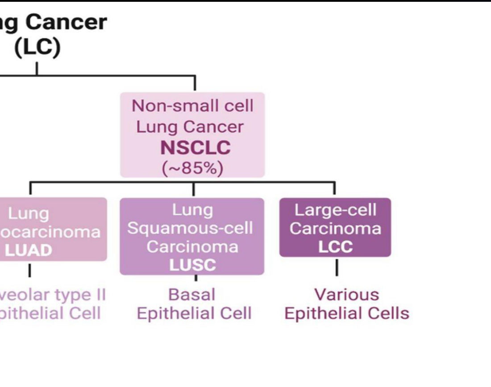

⭐⭐⭐ **Type comparison (Slide 7):**
| Type | ⭐ Location | ⭐ Key features |
|---|---|---|
| **Adenocarcinoma** | ⭐ **Peripheral** | ⭐ **Most common primary lung cancer**; ⭐ **more common in women and non-smokers**; **hypertrophic osteoarthropathy**; ⭐ **commonest cancer arising in scars**; **better prognosis** |
| **Squamous cell** | ⭐ **Central** | **Strong smoking link**; ⭐ **cavitating** lesions from a hilar bronchus; ⭐ **PTHrP → hypercalcaemia** |
| **Large cell** | **Peripheral** | Strong smoking link; **poor chemo response**; **early metastases**; **poor prognosis** |
| ⭐ **Small cell** (neuroendocrine) | ⭐ **Central** | Strong smoking link; ⭐ **many paraneoplastic syndromes**; **undifferentiated, very aggressive, early metastases** |

*Mnemonic [added]:* **"S & S are Sentral"**: **S**quamous and **S**mall cell are **central**; adeno and large cell are peripheral.

---

### 2.3 Staging (Slides 8–9)
⭐⭐ **NSCLC → TNM (IASLC 8th edition, Slide 8):**
| | Criteria |
|---|---|
| **T1** | **≤ 3 cm**; invasion distal to lobar bronchus; superficial spreading tumour limited to bronchial wall |
| **T2** | **> 3 to ≤ 5 cm**; main bronchus (not carina) with atelectasis/obstructive pneumonia; **visceral pleura**; crosses fissure / two adjacent lobes |
| **T3** | **> 5 to ≤ 7 cm**; **parietal pericardium, phrenic nerve, parietal pleura, chest wall**; separate nodules in the **same lobe** |
| **T4** | **> 7 cm**; **trachea, recurrent laryngeal nerve, great vessels, diaphragm, oesophagus, vertebra, carina**; nodules in a **different ipsilateral lobe** |
| **N1** | Ipsilateral **hilar/intrapulmonary/peribronchial** |
| **N2** | **Subcarinal**, ipsilateral **mediastinal** |
| **N3** | **Contralateral** mediastinal/hilar; any **supraclavicular or scalene** |
| **M1a** | Contralateral lung nodule, **pleural nodule or malignant pleural effusion** |
| **M1b** | **Single** extrathoracic metastasis |
| **M1c** | **Multiple** extrathoracic metastases |
*Size mnemonic [added]:* **"3–5–7"** cm.

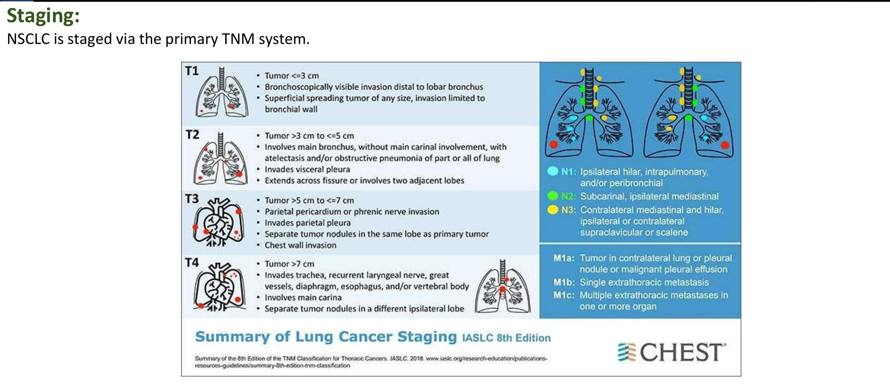

⭐⭐ **SCLC → limited vs extensive (Slide 9):**
| **Limited** | **Extensive** |
|---|---|
| **Confined to the chest + supraclavicular nodes** (not cervical or axillary) | **Beyond the chest and supraclavicular nodes** |

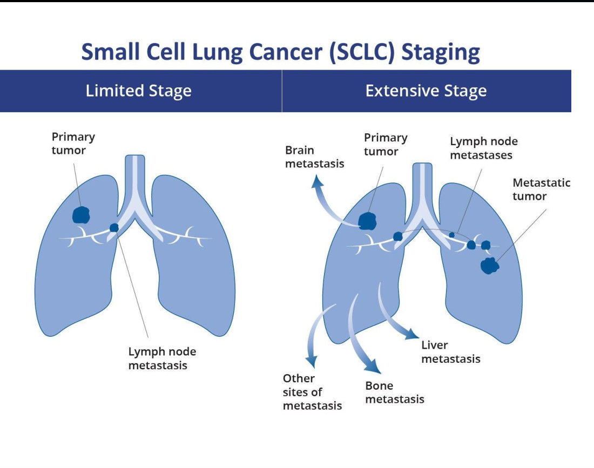

> 🔁 **Recap: Types and staging.** NSCLC ~85% (adeno peripheral/non-smokers/scars; squamous central/cavitating/hypercalcaemia; large cell peripheral/aggressive). SCLC ~15% (central, aggressive, paraneoplastic). NSCLC → TNM (3–5–7 cm; N1 hilar, N2 mediastinal, N3 contralateral/supraclavicular; M1a pleural). SCLC → limited vs extensive.
> 🔗 **Link:** Tumour site and type predict the symptoms.
> ▶️ **Up next: Clinical features.**

---

### 2.4 Signs & Symptoms (Slides 10–19)
⭐ **Five groups:** local invasion · local (pulmonary) symptoms · constitutional · metastatic · paraneoplastic.

#### A. ⭐⭐ Superior vena cava syndrome (Slide 11)
- **Obstruction of the SVC** by a **mediastinal tumour**; ⭐ **more common with SCLC**
- Blood diverts to the **IVC via collaterals** → **prominent veins on the upper body**; congestion above the block
- Findings: ⭐ **facial fullness**, **facial and arm oedema**, **dilated veins over chest, arms and face**, ⭐ **JVD**; hoarseness, dysphagia, post-obstructive pneumonia, dyspnoea (diaphragmatic paralysis)

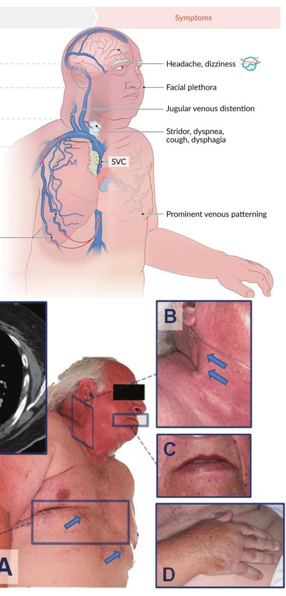

#### B. ⭐⭐ Pancoast tumour (Slides 12, 14)
- ⭐ **Apical (superior sulcus) tumour** involving **C8 and T1–T2** → ⭐ **shoulder pain radiating down the arm**
- **Usually NSCLC**
- **Pancoast syndrome** (mass effect):
  - **Brachial plexus** → pain, motor/sensory deficit, **wasting of small hand muscles**
  - ⭐ **Cervical sympathetic ganglion → Horner syndrome**
  - **Recurrent laryngeal nerve → hoarseness**
  - **Brachiocephalic vein → facial swelling, unilateral arm oedema**
  - **Phrenic nerve → hemidiaphragm paralysis**

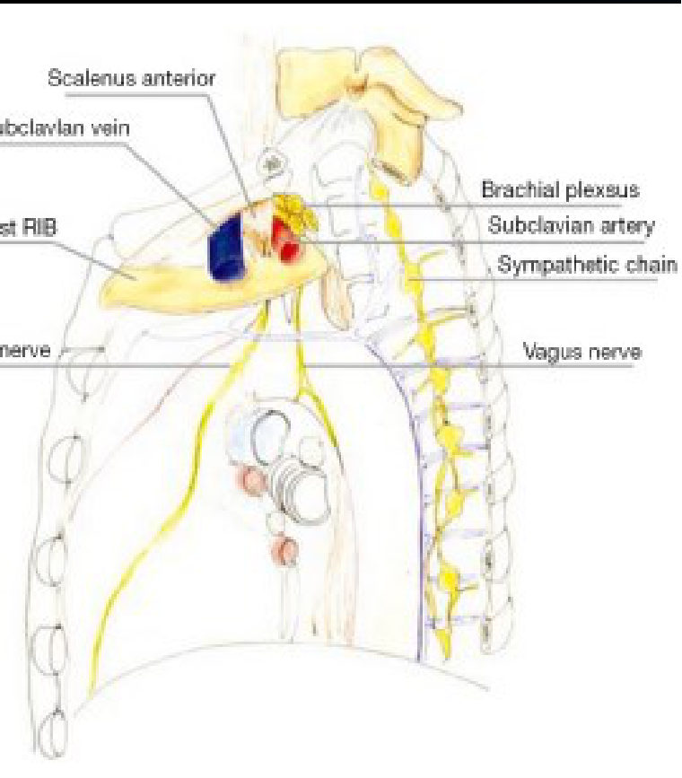 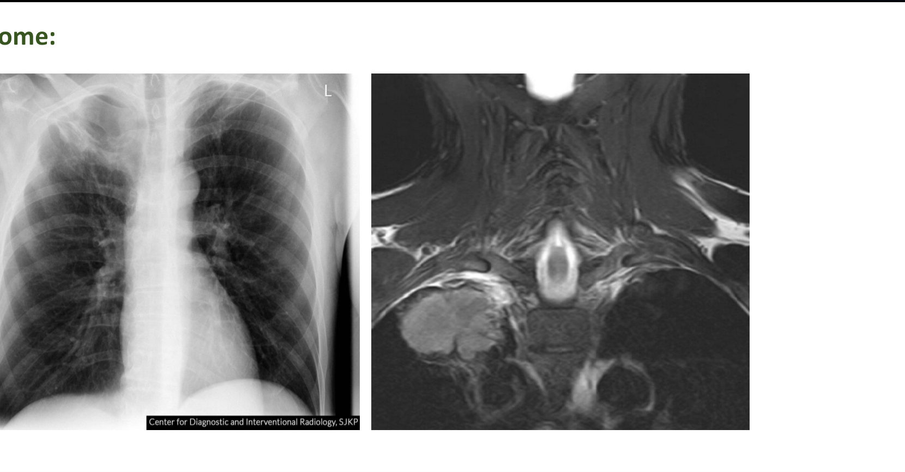

#### C. ⭐ Horner syndrome (Slide 13)
- Invasion of the **cervical sympathetic chain** by an apical tumour
- ⭐ **Ipsilateral ptosis + miosis + facial anhidrosis**

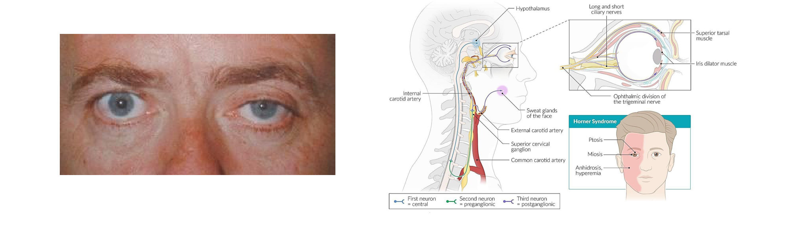

#### D. Pulmonary symptoms (Slide 15)
⭐ **Cough, haemoptysis**, **progressive dyspnoea**, **wheeze** (localised, from obstruction *[added]*), **chest pain**

#### E. Extrapulmonary (Slide 16)
- ⭐ **Constitutional:** **weight loss, fever, weakness**
- **Local infiltration/compression:** **SVC syndrome**, **hoarseness** (recurrent laryngeal), **dyspnoea + raised hemidiaphragm** (phrenic), **malignant pleural effusion** (dullness, ↓ breath sounds), **post-obstructive pneumonia**, **dysphagia** (oesophageal compression)

#### F. ⭐ Metastases (Slides 17–18)
| Site | Features |
|---|---|
| ⭐ **Brain** | **Headache, seizures, focal motor deficits** |
| **Liver** | **Nausea, jaundice, ascites** |
| ⭐ **Adrenal** | **Usually asymptomatic** |
| ⭐ **Bone** | **Bone pain, ↑ ALP and calcium** |

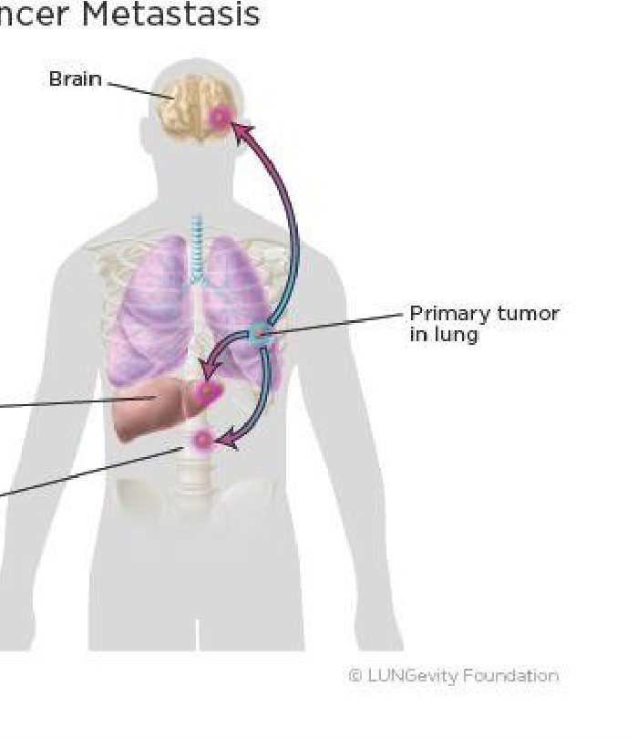 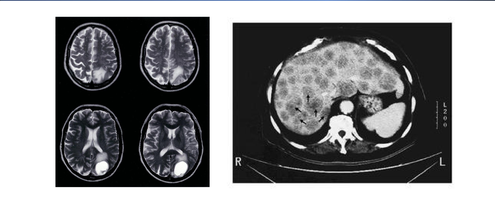

#### G. ⭐⭐⭐ Paraneoplastic syndromes (Slide 19)
| Type | Syndrome |
|---|---|
| ⭐ **Small cell** | ⭐ **Ectopic Cushing (ACTH)**: moon face · ⭐ **SIADH** (low urine output, hyponatraemia) · ⭐ **Lambert–Eaton myasthenic syndrome** and other immune-mediated neurological syndromes |
| **Adenocarcinoma** | **Non-bacterial verrucous (thrombotic) endocarditis** |
| ⭐ **Squamous cell** | ⭐ **Hypercalcaemia (PTHrP)**: poor prognosis |
| **Large cell** | **Gynaecomastia** |
| **NSCLC** | ⭐ **Hypertrophic pulmonary osteoarthropathy** (Marie–Bamberger syndrome; rare): **periostitis, arthropathy, clubbing** |
| **All lung cancers** | **Anaemia, DIC, granulocytosis, thrombocytosis, dermatomyositis** |

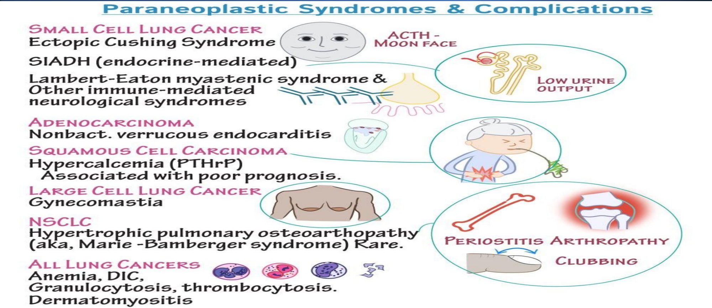

> 🔁 **Recap: Clinical.** Cough, haemoptysis, dyspnoea, weight loss. SVC syndrome (SCLC): facial swelling, dilated chest veins, JVD. Pancoast (apical NSCLC): arm pain, hand wasting, Horner, hoarseness. Metastases to brain, liver, adrenals, bone. Paraneoplastic: SCLC → ACTH, SIADH, Lambert–Eaton; squamous → PTHrP hypercalcaemia; large cell → gynaecomastia; adeno → marantic endocarditis; NSCLC → HPOA.
> 🔗 **Link:** Suspicion leads to imaging, tissue diagnosis and staging.
> ▶️ **Up next: Diagnostics, treatment and screening.**

---

### 2.5 Diagnostics (Slides 20–22)
1. **CXR**
2. ⭐ **CT with IV contrast**
3. ⭐ **Fibre-optic bronchoscopy with endobronchial ultrasound (EBUS)** *(central lesions, mediastinal nodes)*
4. **Transthoracic needle biopsy** *(peripheral lesions)*
5. ⭐ **Histopathology** (tissue diagnosis)
6. **Sputum cytology**
7. ⭐ **Genetic testing** (driver mutations → targeted therapy)
8. **Immunohistochemistry**
9. ⭐ **Staging: MRI (brain) and PET-CT**

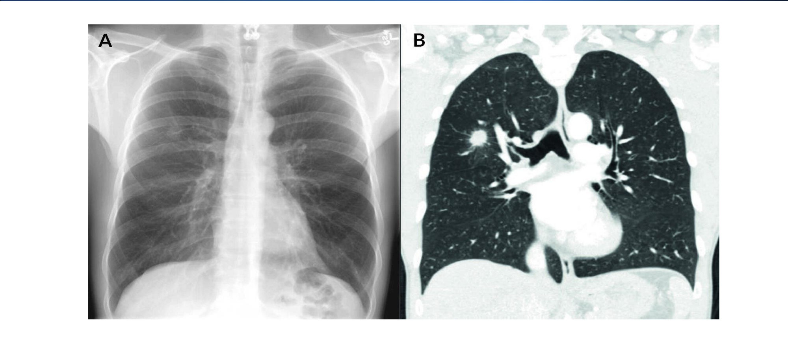 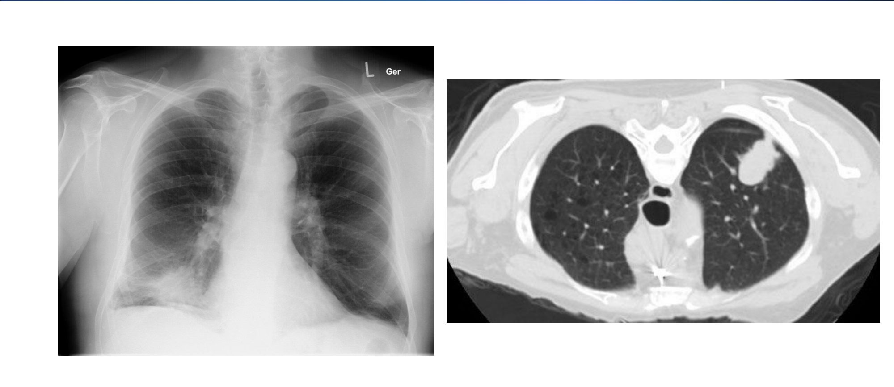

### 2.6 Management (Slide 23)
| Modality | Examples |
|---|---|
| **Surgery** | **Resection** (early NSCLC *[added]*) |
| **Radiotherapy** | **External beam (EBRT)**, **IMRT** |
| **Chemotherapy** | **Cisplatin, etoposide, paclitaxel** |
| ⭐ **Immunotherapy** | **Nivolumab, pembrolizumab, atezolizumab** (PD-1/PD-L1 inhibitors *[added]*) |
| ⭐ **Targeted therapy** | **Crizotinib** (ALK), **sotorasib** (KRAS G12C), **osimertinib** (EGFR) *[targets added]* |

*[added principle: early NSCLC → surgery; locally advanced → chemoradiation ± immunotherapy; metastatic → targeted therapy if a driver mutation, else immunotherapy ± chemo. SCLC → chemotherapy ± radiotherapy; rarely surgical.]*

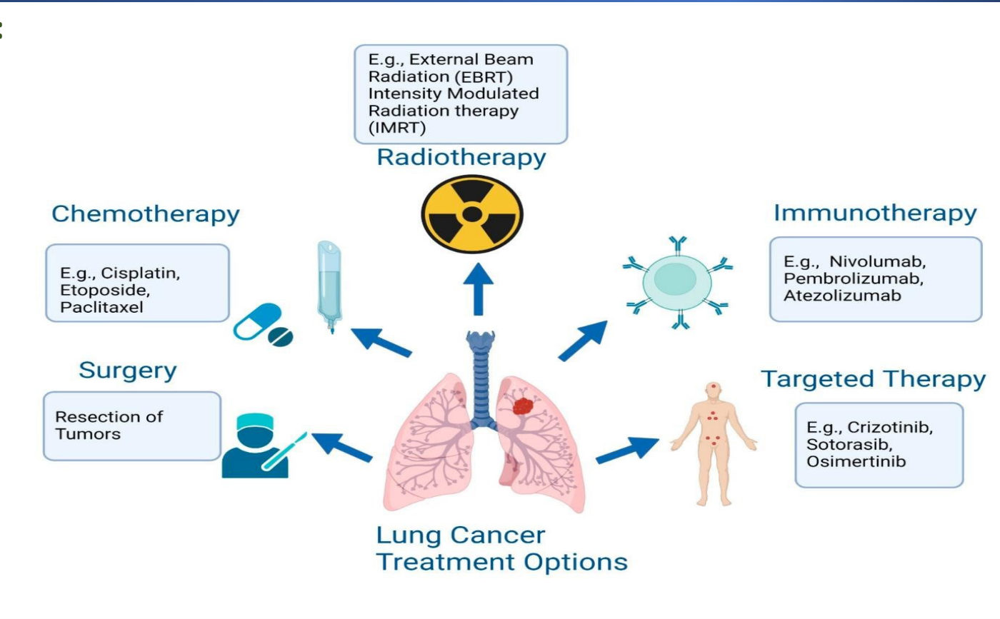

### 2.7 ⭐⭐ Screening (Slide 24)
**Annual low-dose CT** if **all** of:
- ⭐ **Age 50–80**
- ⭐ **≥ 20 pack-year** history
- ⭐ **Currently smoking or quit within the past 15 years**
→ ⭐ **Reduces lung-cancer mortality by 20%** (National Lung Screening Trial, NEJM 2011)

*Mnemonic [added]:* **"50–80, 20 pack-years, quit < 15"**.

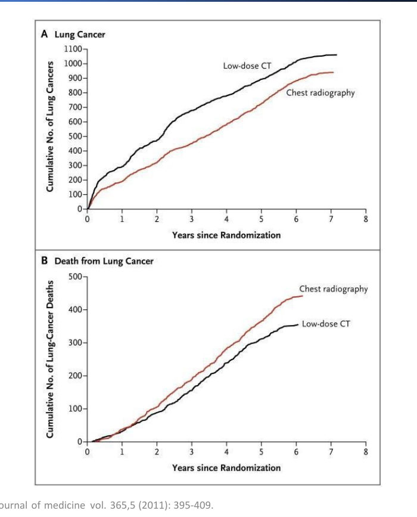

### 2.8 ⭐ Solitary Lung Nodule (Slide 25)
**Approach:**
1. ⭐ **Review previous imaging**
2. ⭐ **Thin-slice CT chest**
3. Assess **size and features**:
   - ⭐ **Malignant features:** **irregular (spiculated) margins**, **larger size**, **upper-lobe location**
   - ⭐ **Benign features:** **calcification** *[added: popcorn or central/laminated patterns]*

**Algorithm (Slide 25):** old CXR →
- ⭐ **Unchanged for > 2 years** → **stop work-up, follow yearly** *[added: solid nodule stable 2 years = benign]*
- **Changed, new, or no old films** → **thin-section CT** →
  - **Suspicious** → **biopsy or resect**
  - **Benign** → **follow every 3 months**

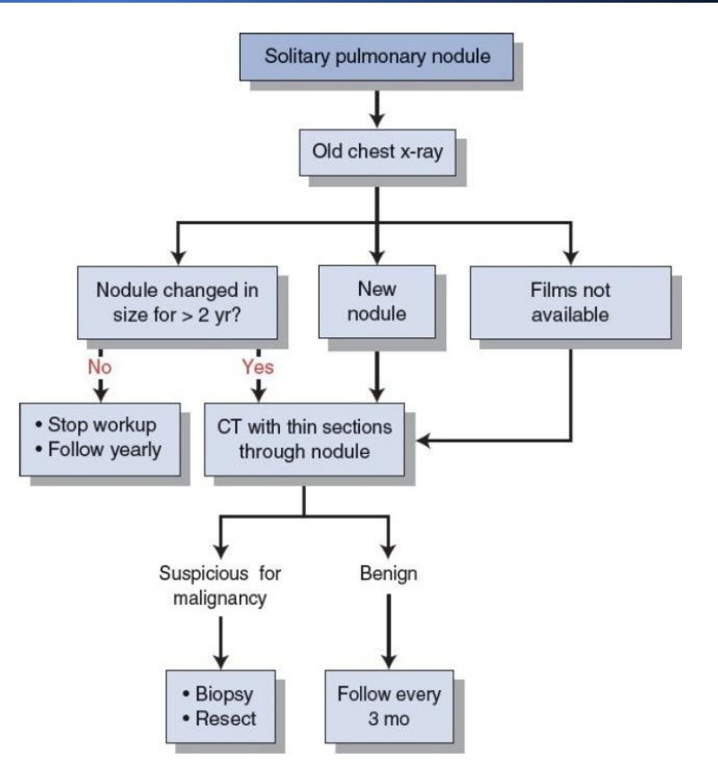

> 🔁 **Recap: Diagnosis and treatment.** CT with contrast; tissue via bronchoscopy/EBUS (central) or needle biopsy (peripheral); genetics; stage with PET-CT and brain MRI. Surgery, radiotherapy, chemo, immunotherapy, targeted drugs. Screen 50–80, ≥ 20 pack-years, quit < 15 years → low-dose CT (−20% mortality). Nodule: compare old films; stable > 2 years → benign; otherwise thin-slice CT → biopsy if suspicious.
> 🔗 **Link:** Lung cancer often presents with haemoptysis, but most haemoptysis isn't cancer.
> ▶️ **Up next: Approach to haemoptysis.**

---

### 2.9 Approach to Haemoptysis (Slides 26–30)
⭐ **Key history (Slide 26):** onset · dyspnoea · cough/sputum · fever · **weight loss** · heart-disease symptoms · trauma · ⭐ **smoking** · **bleeding elsewhere** · ⭐ **medications (anticoagulants)**

**Key exam (Slide 27):** vital signs · **pulse oximetry** · ⭐ **nasal mucosa and oropharynx** (exclude upper-airway source) · heart · lungs · nodes and extremities (⭐ **clubbing**, cyanosis, oedema)

⭐⭐ **Differential (Slide 28):**
| Group | Causes |
|---|---|
| **Respiratory** | ⭐ **Bronchial carcinoma**, **pneumonia**, ⭐ **TB (commonest worldwide)**, **chronic bronchitis**, **bronchiectasis**, pulmonary oedema, **Goodpasture**, **Wegener's (GPA)** |
| **Vascular** | ⭐ **Pulmonary embolism**, **pulmonary hypertension (mitral stenosis)**, **hereditary haemorrhagic telangiectasia** |
| **Systemic** | **Coagulation disorders** |

**Work-up:**
| General | Specific |
|---|---|
| **CBC, CXR, coagulation (PT, PTT, INR), sputum analysis, ECG** | **CT, TB testing, echo, bronchoscopy, BMP (renal), urinalysis** (pulmonary–renal syndromes *[added]*) |

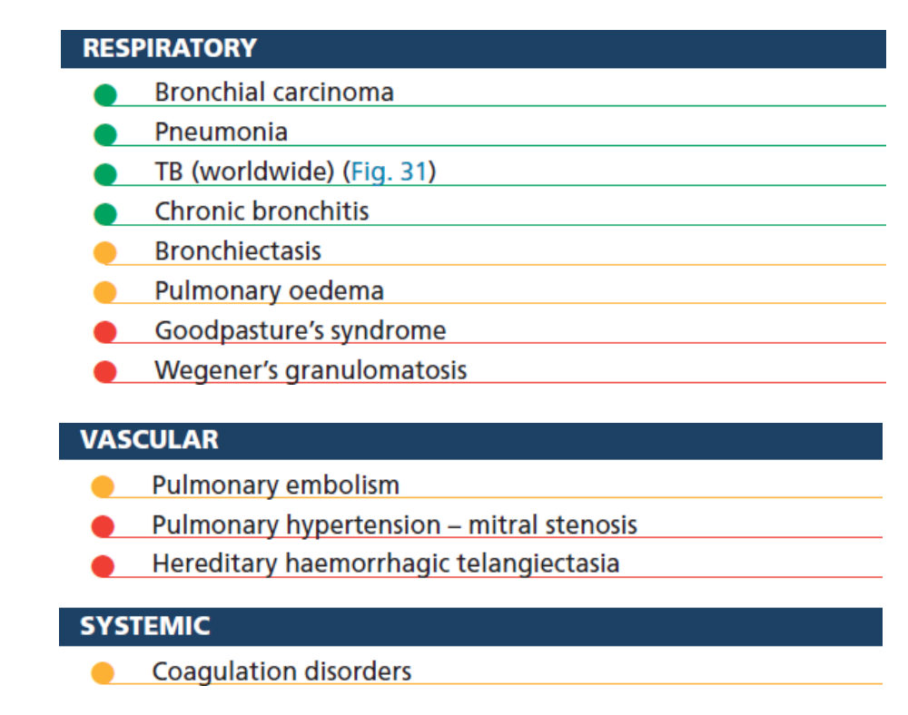

⭐⭐⭐ **Massive haemoptysis (Slide 29):**
1. ⭐ **Blood group and cross-match**
2. **IV access**
3. ⭐ **Secure the airway** *[added: place the bleeding side down; consider selective intubation]*
4. Work-up: **CXR, coagulation, renal function, sputum**
5. ⭐ **Control haemorrhage**: **tranexamic acid**, **FFP**, **platelets if < 50**, **red cells** as needed
6. **Source control** (by cause)

⭐⭐ **Summary algorithm (Slide 30, Harrison):**
1. History and exam → ⭐ **rule out other sources** (**oropharynx, GI tract**)
2. Quantify bleeding:
   - **Non-massive, no risk factors** → treat underlying disease (usually infection) → if persistent, investigate
   - **Non-massive, risk factors** → **CXR, CBC, UA, creatinine, coagulation → CT → bronchoscopy** → treat the cause
   - ⭐ **Massive** → **protect the airway** → stops: work up; continues → ⭐ **embolisation or resection**

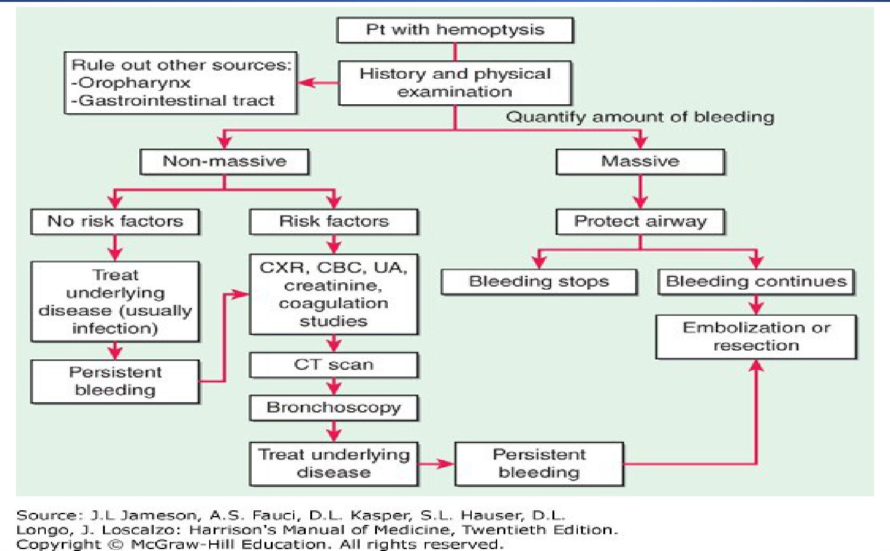

> 🔁 **Recap: Haemoptysis.** Exclude nose, mouth and GI sources. Common causes: infection, bronchitis, bronchiectasis, TB, cancer, PE. Risk factors (smoker, age, weight loss) → CXR → CT → bronchoscopy. Massive: airway first, cross-match, IV access, TXA/FFP/platelets, then bronchial-artery embolisation or surgery.

---

## 3. High-Yield Comparison Tables

### Table A: Cancer types *(see §2.2 and the added diagram)*

### Table B: Paraneoplastic syndromes *(see §2.4 G)*

### Table C: TNM vs SCLC staging
| | NSCLC | SCLC |
|---|---|---|
| System | **TNM** | **Limited vs extensive** |
| Key cut-offs | T: 3/5/7 cm; N1 hilar, N2 mediastinal/subcarinal, N3 contralateral/supraclavicular; M1a pleural/contralateral | Limited = chest + supraclavicular nodes |

### Table D: Local invasion syndromes
| Structure | Result |
|---|---|
| SVC | Facial/arm oedema, dilated veins, JVD |
| Cervical sympathetic chain | **Horner**: ptosis, miosis, anhidrosis |
| Brachial plexus (C8–T2) | Arm pain, hand-muscle wasting |
| Recurrent laryngeal nerve | Hoarseness |
| Phrenic nerve | Raised hemidiaphragm, dyspnoea |
| Oesophagus | Dysphagia |
| Pleura | Malignant effusion |

### Table E: Nodule features
| Malignant | Benign |
|---|---|
| Irregular/spiculated margins, large, upper lobe, growing | Calcified, stable > 2 years |

### Table F: Massive vs non-massive haemoptysis *(see §2.9)*

---

## 4. Rules, Exceptions, Patterns
- **Smoking = 80–90%; radon = 2nd cause.**
- **Adenocarcinoma: most common, peripheral, non-smokers and women, scars.**
- **Squamous and small cell are central.**
- **Squamous cavitates and causes hypercalcaemia (PTHrP).**
- **SCLC: SIADH, ACTH, Lambert–Eaton, SVC syndrome; staged limited vs extensive.**
- **NSCLC: TNM; Pancoast tumour is usually NSCLC.**
- **Malignant pleural effusion = M1a (stage IV).**
- **Adrenal metastases are usually silent.**
- **Screen 50–80 y, ≥ 20 pack-years, current or quit < 15 y, with annual low-dose CT.**
- **Nodule stable > 2 years → stop work-up; calcification suggests benign.**
- **Massive haemoptysis: airway first.** Persistent → embolisation or resection.
- **TB is the commonest cause of haemoptysis worldwide.**

---

## 5. Clinical Correlations
- **Smoker with hyponatraemia and confusion** → SIADH from SCLC.
- **Smoker with hypercalcaemia, normal PTH, cavitating hilar mass** → squamous cell carcinoma (Case 1).
- **Smoker with proximal weakness that improves on repeated effort** → Lambert–Eaton (anti-VGCC antibodies *[added]*).
- **Facial swelling and dilated chest veins in a smoker** → SVC syndrome → urgent imaging ± stent/radiotherapy *[added]*.
- **Shoulder pain + ptosis + small pupil + hand wasting** → Pancoast tumour.
- **Non-smoking woman with a peripheral nodule** → adenocarcinoma (EGFR testing → osimertinib *[added]*).
- **Asbestos worker with effusion** → mesothelioma or lung cancer (smoking + asbestos multiply risk *[added]*).
- **Haemoptysis + haematuria + renal failure** → Goodpasture or GPA (urinalysis + BMP).

---

## 6. Rapid Revision (Last-Day)
- Risks: **smoking 80–90%** (pack-years), passive smoking, **radon (#2)**, uranium, **asbestos**, arsenic, silica, pollution, family history, scars, radiation, fibrosis, TB, HIV.
- **NSCLC ~85%** (adeno, squamous, large cell) vs **SCLC ~15%**.
- **Adeno:** peripheral, most common, women/non-smokers, scars, HPOA, better prognosis.
- **Squamous:** central, smokers, **cavitates**, **PTHrP → hypercalcaemia**.
- **Large cell:** peripheral, smokers, early metastases, poor prognosis, **gynaecomastia**.
- **SCLC:** central, smokers, very aggressive, **ACTH, SIADH, Lambert–Eaton**, SVC syndrome.
- TNM: **T 3/5/7 cm**; **N1** hilar, **N2** mediastinal/subcarinal, **N3** contralateral/supraclavicular; **M1a** pleural/effusion/contralateral, **M1b** single, **M1c** multiple distant.
- **SCLC: limited (chest + supraclavicular) vs extensive.**
- **SVC syndrome:** facial/arm oedema, dilated veins, JVD.
- **Pancoast:** apical, C8–T2 → arm pain, hand wasting, **Horner (ptosis, miosis, anhidrosis)**, hoarseness, phrenic palsy.
- Metastases: **brain** (headache, seizures), **liver** (jaundice), **adrenal** (silent), **bone** (pain, ↑ ALP, ↑ Ca).
- All cancers: anaemia, DIC, thrombocytosis, dermatomyositis.
- Dx: CXR, **CT with contrast**, **bronchoscopy/EBUS**, needle biopsy, histology, cytology, genetics, IHC, **PET-CT + MRI** staging.
- Rx: surgery, radiotherapy, **cisplatin/etoposide/paclitaxel**, **nivolumab/pembrolizumab/atezolizumab**, **crizotinib/sotorasib/osimertinib**.
- **Screening: 50–80 y, ≥ 20 pack-years, smoking or quit < 15 y → yearly low-dose CT, −20% mortality.**
- **Nodule:** compare old films; **stable > 2 y → stop, yearly**; else thin CT → suspicious → biopsy/resect; benign → every 3 months.
- **Haemoptysis DDx:** cancer, pneumonia, **TB**, bronchitis, bronchiectasis, oedema, Goodpasture, GPA, **PE**, mitral stenosis, HHT, coagulopathy.
- **Massive haemoptysis:** cross-match, IV access, **airway**, CXR/coagulation/renal, **TXA, FFP, platelets < 50, RBCs**, then **embolisation or resection**.

---

## 7. Exam-Style Questions

**Q1 (MCQ, lecture Case 1, Slide 31).** 69 ♂, 30 pack-years; 3 months of dry cough, **blood-streaked sputum**, fatigue, **5-kg weight loss**, worsening **back pain**; localised **wheeze in the right lower field**; ⭐ **calcium 12.3 mg/dL**, normal Hb and total protein. CXR shown (mass). Most likely diagnosis?
**f. Squamous cell lung carcinoma**
**Answer: f.** *[reasoning added; no key on the slide]* Smoker + haemoptysis + weight loss + central obstruction (localised wheeze) + **hypercalcaemia** = **squamous cell carcinoma with PTHrP** (back pain may be bone metastasis). **SCLC** causes SIADH/ACTH, not hypercalcaemia. **Myeloma**: normal Hb and total protein make it unlikely. TB/pneumonia don't explain the hypercalcaemia.

**Q2 (MCQ, lecture Case 2, Slide 32).** 50 ♂, ex-smoker (10 pack-years, quit 18 years ago), recent travel; incidental **5-mm nodule** in the right upper lung on CXR after a fall; **no previous X-rays**. Next step?
**e. CT scan of the chest**
**Answer: e.** Per the lecture algorithm, **no prior films → thin-section CT** to characterise the nodule. PET is for larger suspicious lesions. Bronchoscopy is premature. Interval CXR/reassurance skip characterisation. He doesn't meet screening criteria, but this is an **incidental nodule**, not screening *[added]*.

**Q3 (MCQ).** A smoker presents with confusion and Na⁺ 118 mmol/L. CT shows a central hilar mass. Most likely histology?
a) Adenocarcinoma b) Squamous **c) Small cell** d) Large cell
**Answer: c** (SIADH).

**Q4 (MCQ).** Which patient qualifies for annual low-dose CT screening?
a) 45 y, 30 pack-years, current smoker **b) 62 y, 25 pack-years, quit 10 years ago** c) 70 y, 15 pack-years, current d) 65 y, 40 pack-years, quit 20 years ago
**Answer: b.** (a) too young; (c) < 20 pack-years; (d) quit > 15 years.

**Q5 (Short answer).** List the first steps in massive haemoptysis.
**Answer:** **Secure the airway** (bleeding side down, intubate if needed), **IV access**, **group and cross-match**, labs (CBC, coagulation, renal) and **CXR**, **control bleeding** (TXA, FFP, platelets if < 50, RBCs), then **source control**: **bronchial-artery embolisation or surgical resection** if it continues.

---

## 8. Exam Pitfalls & Traps
1. **Small cell → hypercalcaemia.** No: **squamous (PTHrP)**. SCLC → SIADH, ACTH, Lambert–Eaton.
2. **Adenocarcinoma is central.** No, it's **peripheral**; squamous and small cell are central.
3. **SCLC staged by TNM** (in this lecture). Use **limited vs extensive**.
4. **Most lung cancer in non-smokers is squamous.** It's **adenocarcinoma**.
5. **Malignant pleural effusion = local (T) disease.** It's **M1a** (metastatic).
6. **Screening criteria:** age **50–80**, **≥ 20 pack-years**, quit **< 15 years**. Each cut-off matters.
7. **Calcified nodule = cancer.** Calcification usually means **benign**.
8. **Stable nodule needs CT every 3 months.** If **stable > 2 years** → stop work-up, follow yearly.
9. **Massive haemoptysis: CT first.** **Airway and resuscitation first.**
10. **Horner triad:** ptosis, **miosis** (not mydriasis), **anhidrosis**.
11. ⚠️ **Slide inconsistency:** the **Pancoast** slide says "usually NSCLC", while **SVC syndrome** is "more common with SCLC". Both are correct; don't swap them.
12. ⚠️ **Slide typos:** "Fascial swelling" = **facial**; "myastenic" = myasthenic.
