# Lung Physiology Primer & Diagnostic Studies (Chest Anatomy & Investigations)
**Dr. Essam Kotb, Associate Professor, Internal Medicine** | Source: `3-chest_anatomy__invest_-_Updated.pdf` (27 slides) · Refs: Harrison 20th ed.; AMBOSS; Cecil 10th ed.; POCUS Atlas

> **Legend:** ⭐ = high-yield · *[added]* = not on slides. Images marked "Slide N" come from the lecture; "Added diagram" = drawn for these notes.

> 🔗 **Where this fits:** This is the **foundation lecture** of the respiratory series (lecture 3 in the course order). Every later lecture uses it: **V/Q mismatch** (PE = dead space; pneumonia/oedema = shunt), **lung volumes** (↑ TLC/RV in COPD; ↓ all in restrictive disease), **DLCO** (↓ emphysema and ILD; normal/↑ asthma), **bronchoprovocation** (asthma), and the **PFT algorithm**. If you've already read the COPD, Asthma and Restrictive notes, this is the "why" behind their tests.

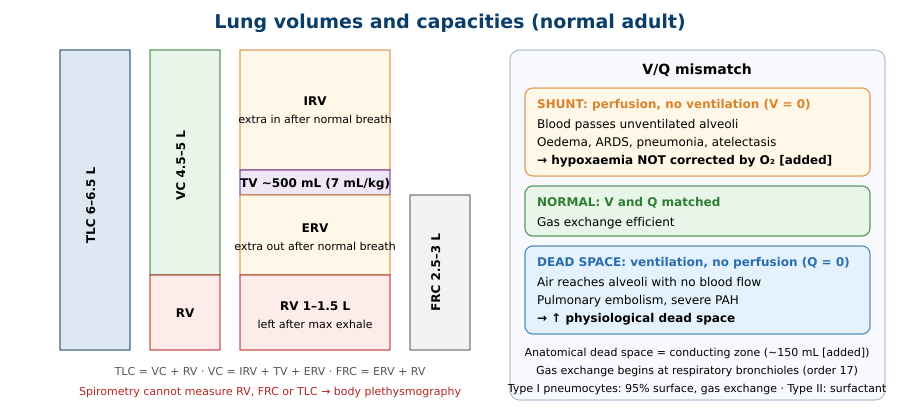

---

## 1. Title / Objectives
| Domain | Objective | Likely tested as |
|---|---|---|
| Knowledge | Anatomy: respiratory tract divisions, lobes, mediastinum, pleura | Right 3 lobes / left 2 |
| Knowledge | ⭐ **Conducting zone (anatomical dead space) vs respiratory zone** | Which generation exchanges gas |
| Knowledge | ⭐ **Type I vs type II pneumocytes** | 95% vs 5%; gas exchange vs surfactant |
| Knowledge | ⭐⭐ **V/Q matching: shunt (V = 0) vs dead space (Q = 0)** | PE vs pneumonia/ARDS |
| Knowledge | ⭐⭐ **Lung volumes (TV, IRV, ERV, RV, VC, FRC, TLC) and normal values** | Numbers |
| Knowledge | ⭐⭐ **Obstructive vs restrictive by spirometry, volumes, flow loops** | PFT table |
| Knowledge | ⭐ Plethysmography, **DLCO**, bronchoprovocation | What each measures |
| Skills | Correlate exam with pathology; choose imaging/invasive tests; **PFT algorithm** | Case 1 |

**Flow:** Introduction (function, V/Q) → Anatomy (lungs, airway, conducting vs respiratory zone, alveoli) → Lung volumes → Lung function tests (spirometry, plethysmography, DLCO, obstructive vs restrictive, other modalities) → Evaluation of lung disease (imaging, V/Q, bronchoscopy) → Summary algorithm → Case.

---

## 2. Main Content (Lecture Order)

### 2.1 Introduction: Lung Function & V/Q (Slide 4)
⭐ **Primary function:** deliver **O₂** to pulmonary capillary blood and **excrete CO₂**, via:
1. **Ventilation (V)**
2. **Perfusion / gas exchange (Q)**
3. ⭐ **Ventilation–perfusion (V/Q) matching**

⭐⭐ **V/Q mismatch (Slide 4 figure):**
| | ⭐ **Intrapulmonary shunt** | **Normal** | ⭐ **Dead-space ventilation** |
|---|---|---|---|
| Definition | **Perfusion WITHOUT ventilation (V = 0)** | V and Q matched | **Ventilation WITHOUT perfusion (Q = 0)** |
| Partial (↓) | **Lobar pneumonia, atelectasis** (↓ V) | | **Segmental PE** (↓ Q) |
| Severe (↓↓) | **Pulmonary oedema, ARDS** (↓↓ V) | | **Massive PE, right-to-left shunt, severe PAH** (↓↓ Q) |

*[added: shunt hypoxaemia responds poorly to supplemental O₂ (the blood never meets the oxygen); dead-space problems respond better. Links: PE pathogenesis in the Pulmonary Vascular lecture.]*

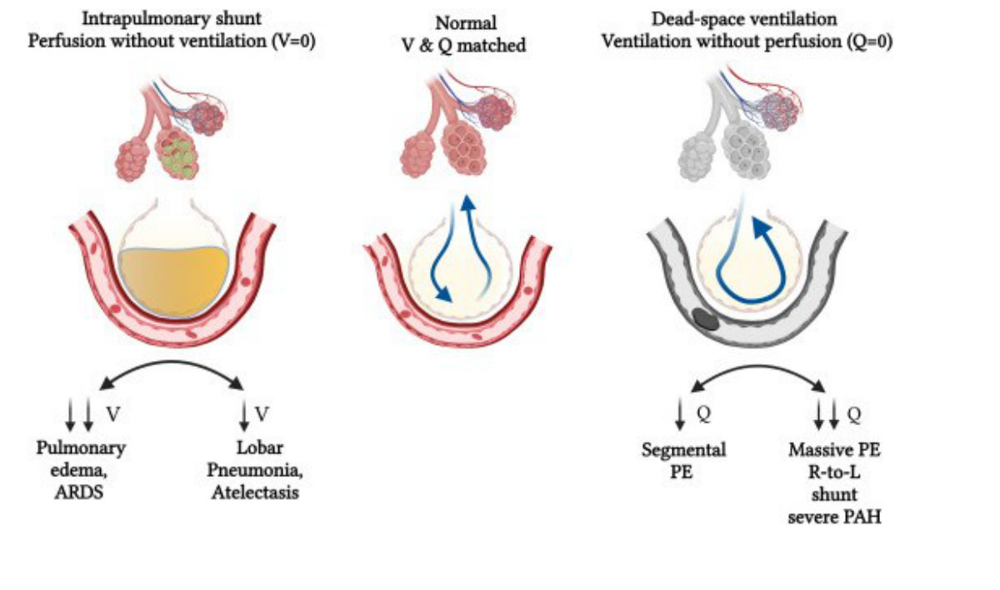

---

### 2.2 Anatomy (Slides 5–9)
**Lungs (Slide 5):**
- ⭐ **Right lung: 3 lobes** (slightly larger); ⭐ **left lung: 2 lobes**
- Separated by the ⭐ **mediastinum** (heart, trachea, oesophagus, many lymph nodes)
- Covered by **pleura**; separated from the abdomen by the **diaphragm**

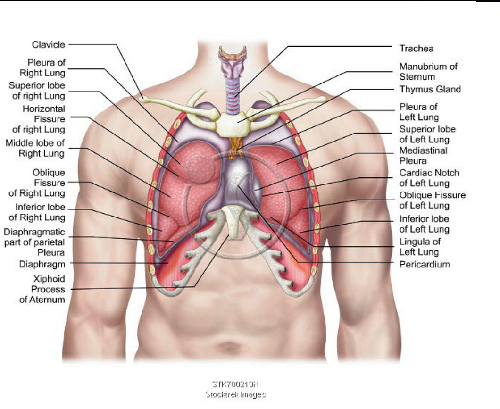

**Gas pathway (Slide 6):** inhaled air → **trachea → bronchi → alveoli** (surrounded by capillaries) → O₂ crosses the thin alveolar membrane → **RBCs** carry O₂ to tissues and return **CO₂** → CO₂ released into alveoli → exhaled.

**Respiratory tract divisions (Slide 7):**
| ⭐ **Upper** | ⭐ **Lower** |
|---|---|
| **Nose, nasal cavity, pharynx** | **Larynx, trachea, bronchi, lungs** |
- Trachea (from the larynx) → **two main bronchi** → **bronchioles** → **alveoli**
- ⭐ **Alveoli = functional units** and site of gas exchange

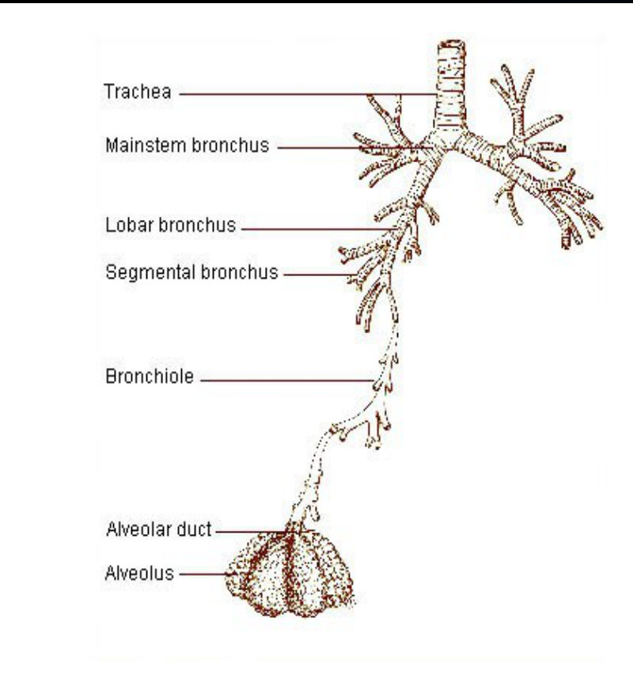

⭐⭐ **Airway zones (Slide 8, Weibel table):**
| Zone | Generations (order no.) | Structures | Key facts |
|---|---|---|---|
| ⭐ **Conducting zone = anatomical dead space** | **0–16** | Larynx, trachea (0), bronchi (1–), **bronchioles to terminal bronchioles (16)** | No gas exchange; cross-section ~2.5 cm² at the trachea; **most resistance in large airways** (0.5 vs 0.2 cm H₂O·L⁻¹·s in small airways) |
| ⭐ **Respiratory zone** | **17–23** | **Respiratory bronchioles (17–19), alveolar ducts (20–22), alveoli (23)** | **Gas exchange**; cross-section explodes to **5.6 × 10⁷ cm²** |
*[added: small airways contribute little resistance because their total cross-sectional area is huge, so early small-airway disease is "silent" on spirometry.]*

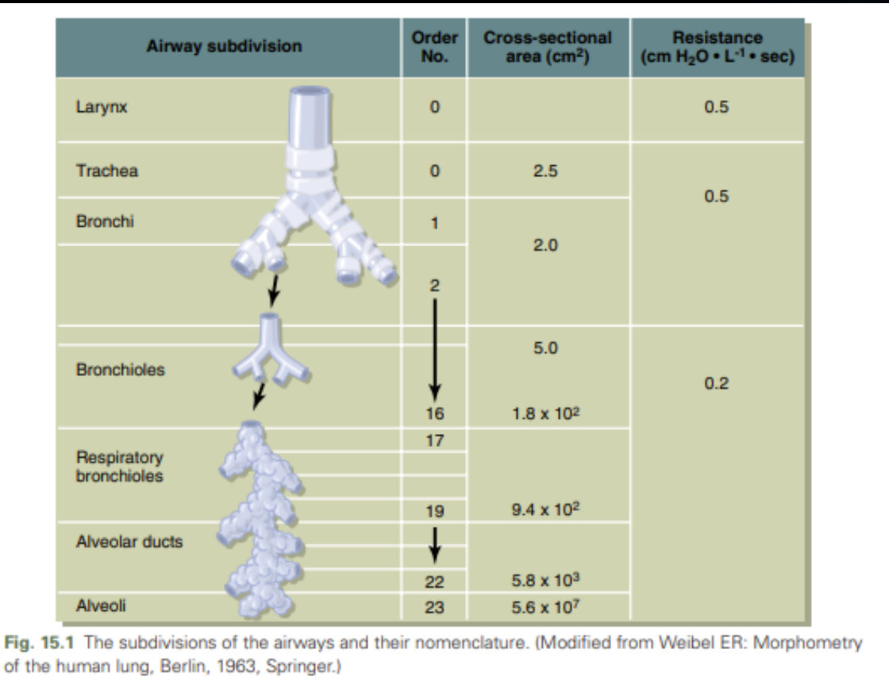

⭐⭐ **Alveoli (Slide 9):** ⭐ **~300 million sacs**
| | ⭐ **Type I pneumocyte** | ⭐ **Type II pneumocyte** |
|---|---|---|
| Share | **95%** of alveolar surface | **5%** of surface |
| Shape | **Extremely thin** | **Rounded** |
| Function | ⭐ **Gas exchange** | ⭐ **Secrete surfactant** *[added: and regenerate type I cells; origin of adenocarcinoma (Lung Cancer lecture)]* |

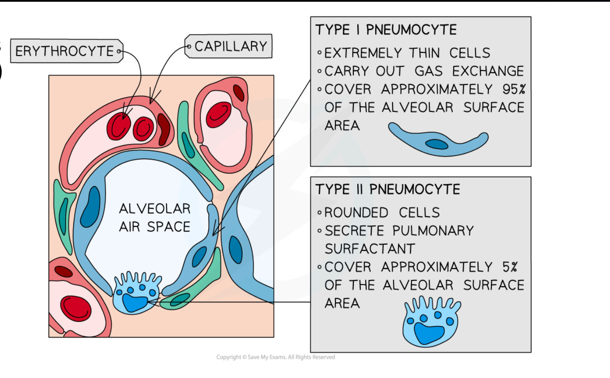

> 🔁 **Recap: Anatomy.** Right 3 lobes, left 2. Upper tract to the pharynx; lower tract from the larynx. Conducting zone (generations 0–16) = anatomical dead space; respiratory zone (17–23) exchanges gas. Type I = thin, gas exchange, 95%; type II = surfactant, 5%.
> 🔗 **Link:** How much air moves in and out is quantified as lung volumes.
> ▶️ **Up next: Lung volumes.**

---

### 2.3 Lung Volumes (Slides 10–11)
⭐⭐⭐ **Normal values:**
| Volume | Definition | ⭐ Normal |
|---|---|---|
| ⭐ **Total lung capacity (TLC)** | Air in the lungs **after maximal inhalation** | **6–6.5 L** |
| ⭐ **Vital capacity (VC)** | **Maximal inhalation → maximal exhalation** | **4.5–5 L** |
| ⭐ **Residual volume (RV)** | Air **left after maximal exhalation** | **1–1.5 L** |
| ⭐ **Tidal volume (TV)** | Normal resting breath | **~500 mL (7 mL/kg)** |
| ⭐ **Functional residual capacity (FRC)** | Air left **after a normal exhalation** | **2.5–3 L** |
*IRV and ERV are named in the objectives but not given values on the slides.* *[added: IRV ≈ 3 L, ERV ≈ 1.2 L; TLC = VC + RV; FRC = ERV + RV.]*

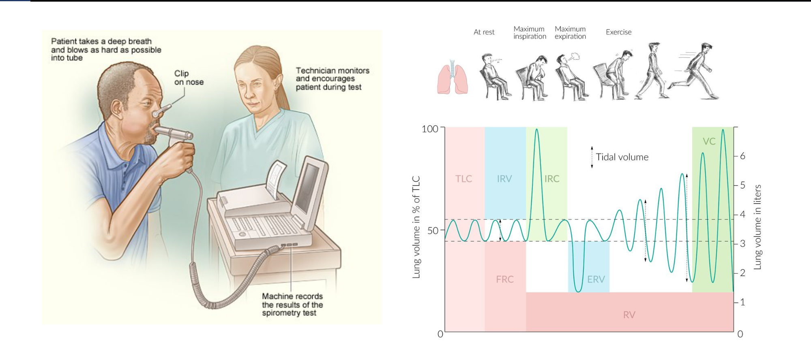

---

### 2.4 Pulmonary Function Testing (Slides 12–14)
⭐ **PFTs** measure lung volumes and function; diagnose ventilatory disorders; separate **obstructive vs restrictive**.
| Test | What it does |
|---|---|
| ⭐ **Spirometry** (most common) | Forced breathing into a device; cheap, simple; measures dynamic and static volumes and flows, ⭐ **EXCEPT RV and TLC** |
| ⭐ **Body plethysmography** | Measures ⭐ **RV and TLC** in a sealed chamber |
| ⭐ **DLCO** (single-breath diffusing capacity) | Is the alveolar membrane **thickened** (fibrosis), **destroyed** (emphysema), or is the **pulmonary vasculature** affected (pulmonary hypertension)? |

⭐ **A diagnosis cannot be made from PFTs alone.**

⭐⭐⭐ **Obstructive vs restrictive (Slide 13):**
| | ⭐ **Obstructive** | ⭐ **Restrictive** |
|---|---|---|
| **FEV1** | **↓ < 80% predicted** (or < LLN) | Normal or ↓ |
| ⭐ **FEV1/FVC** | ⭐ **↓** (FEV1 falls more than FVC) | ⭐ **Normal or ↑** (FEV1 falls in proportion to FVC) |
| **VC** | ↓ < 80% predicted | **↓** |
| ⭐ **RV** (plethysmography) | ⭐ **↑ ≥ 120% predicted** (air trapping) | Normal or ↓ |
| ⭐ **TLC** (plethysmography) | **Normal or ↑** | ⭐ **↓** |
| ⭐ **DLCO** | Variable: **↓ emphysema**, **↑ or normal asthma**, **normal chronic bronchitis** | Variable: **normal extrinsic**, **↓ intrinsic** |

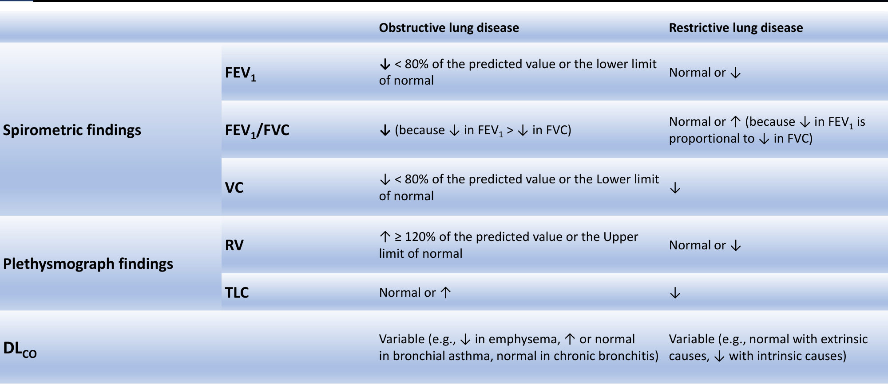

**Other modalities (Slide 14):**
- ⭐ **Bronchoprovocation testing** (methacholine/histamine; triggers airway hyperresponsiveness; see Asthma: FEV1 fall > 20%)
- ⭐ **Arterial blood gas (ABG)**: acid–base, PaO₂, PaCO₂
- **6-minute walk distance** *[added: functional capacity, prognosis in ILD/PAH]*

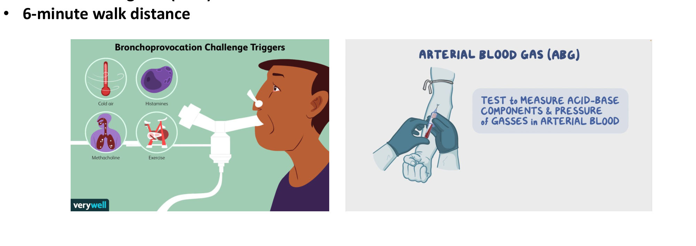

> 🔁 **Recap: PFTs.** Spirometry (not RV/TLC) → plethysmography for RV/TLC → DLCO for membrane/vessels. Obstructive: FEV1/FVC ↓, RV ↑, TLC normal/↑. Restrictive: FEV1/FVC normal/↑, TLC ↓. DLCO ↓ in emphysema and intrinsic ILD; normal/↑ in asthma; normal in bronchitis and extrinsic restriction.
> 🔗 **Link:** Function tells you the pattern; imaging and invasive tests show the structure.
> ▶️ **Up next: Evaluation of lung disease.**

---

### 2.5 Evaluating Lung Disease: Imaging & Invasive (Slides 15–22)
⭐ **Modalities:** **CXR, CT, MRI, CTPA** · **fluoroscopy** · **ultrasound (POCUS)** · **pulmonary angiography** · **V/Q scan** · **bronchoscopy**

| Modality | ⭐ Best use *[uses partly added from other lectures]* |
|---|---|
| **CXR** (PA + lateral) | First-line: consolidation, effusion, pneumothorax, mass, hyperinflation |
| **POCUS** | Bedside: effusion, pneumothorax (absent lung sliding *[added]*), B-lines (oedema) |
| **CT chest / HRCT** | Nodules, masses, ILD (honeycombing), bronchiectasis (tram-track/signet ring) |
| ⭐ **CTPA** | ⭐ **Pulmonary embolism** (filling defect) |
| **MRI** | Selected: chest wall, Pancoast/superior sulcus, mediastinum *[added]* |
| ⭐ **V/Q scan** | **PE when CTPA contraindicated** (renal failure, contrast allergy, pregnancy with normal CXR) |
| ⭐ **Bronchoscopy** | Visualise airways; biopsy (central tumours, EBUS), BAL, foreign body |

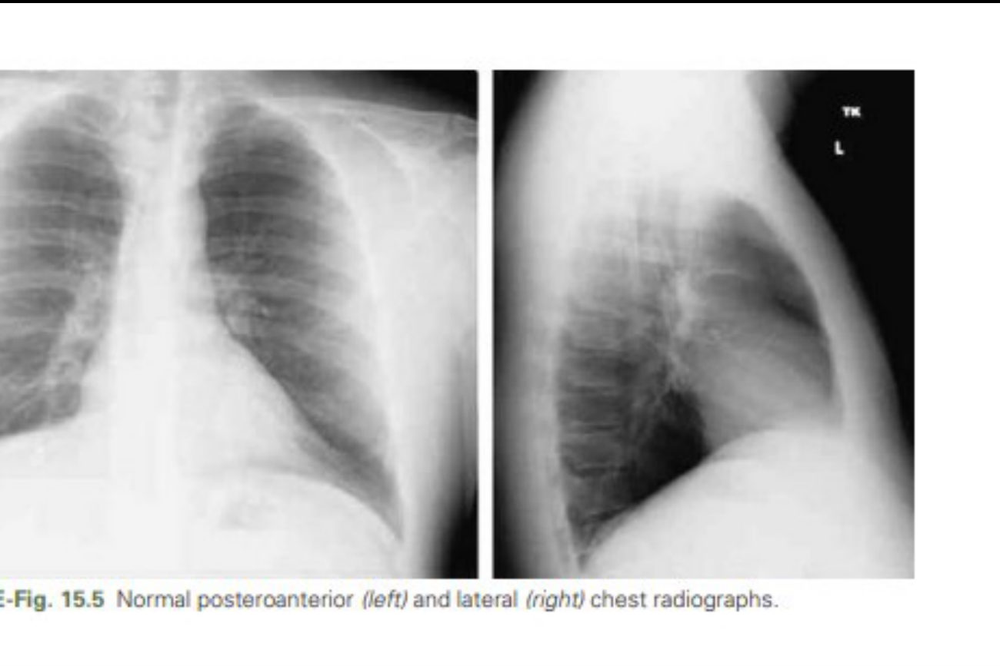 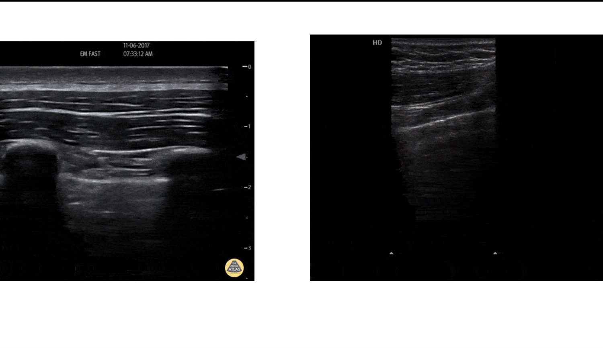

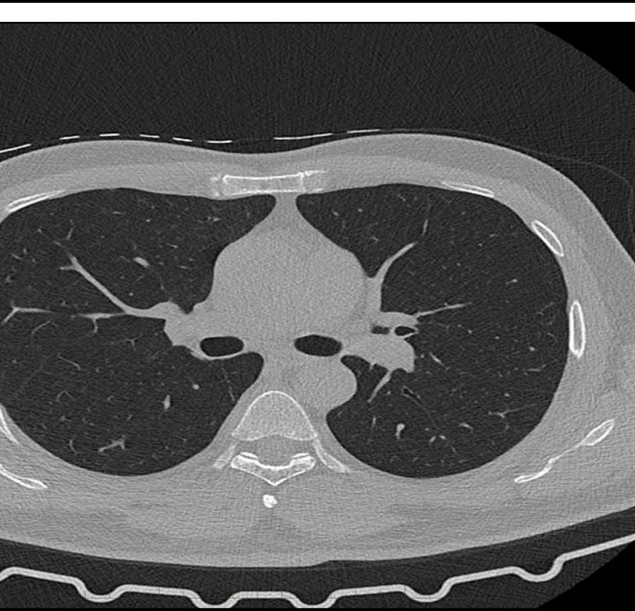 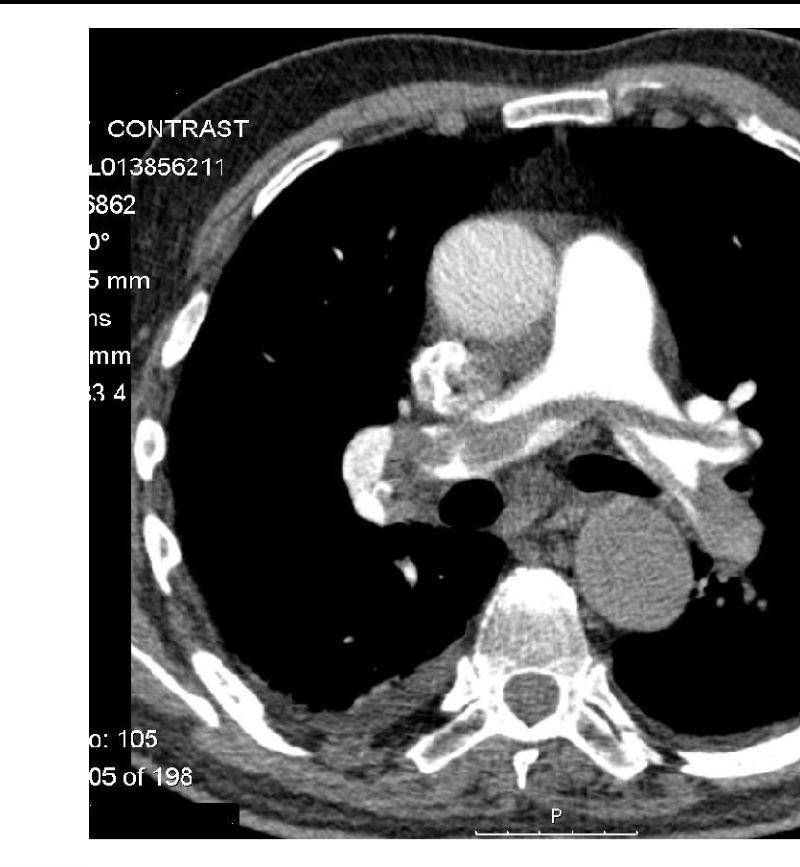

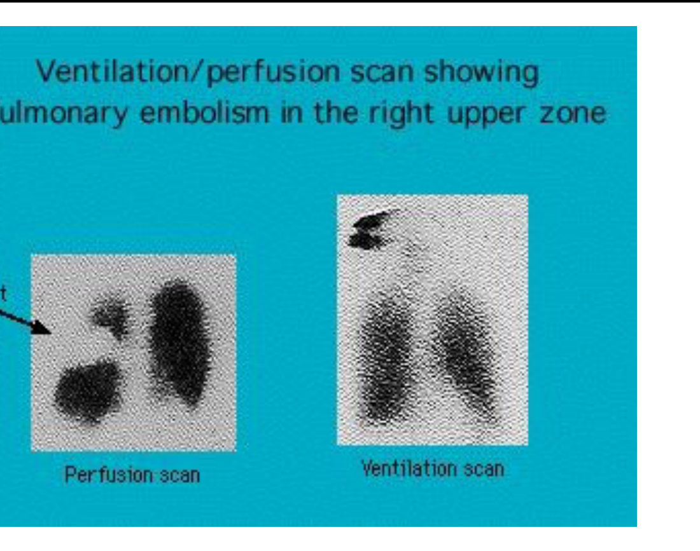 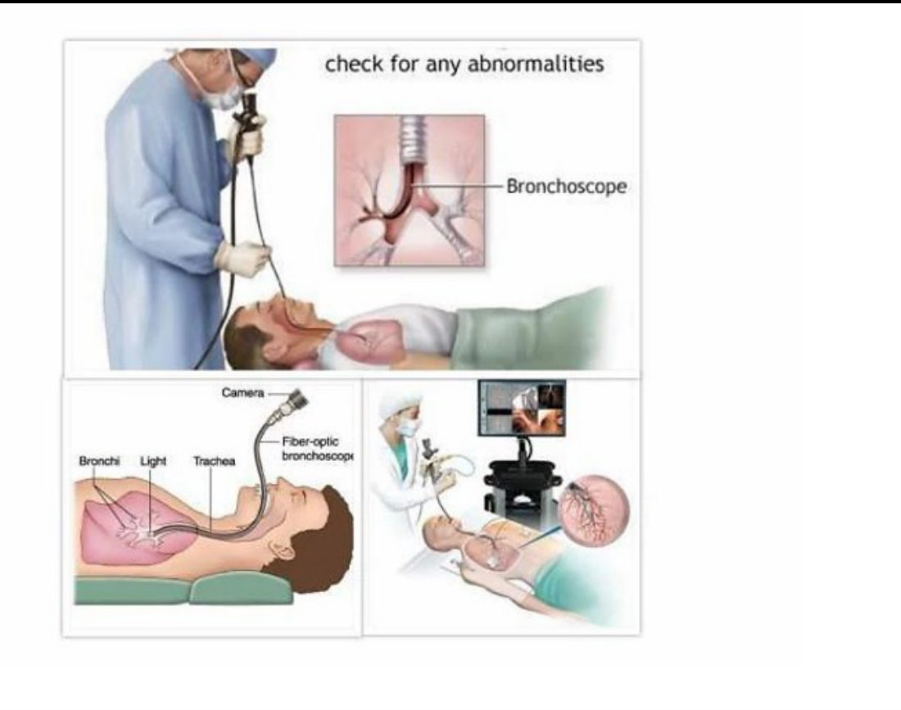

---

### 2.6 ⭐⭐⭐ Summary: The Dyspnoea / PFT Algorithm (Slide 23)
1. **Dyspnoea → history and examination → PFTs**
2. **Normal PFTs (? asthma)** → ⭐ **bronchoprovocation test** → positive = **hyperreactive airways**
3. ⭐ **Obstructive pattern (↓ FEV1 and FEV1/FVC)** → asthma, COPD, other:
   - **DLCO low** → ⭐ **emphysema**
   - **DLCO normal** → **asthma or chronic bronchitis**
   - **FEV1 change after bronchodilator > 12%** → ⭐ **asthma** (reversible)
4. ⭐ **Restrictive pattern (↓ TLC)** → **chest-wall defect, neuromuscular disorder, or ILD**:
   - **MVV / NIF test** (muscle strength) → **abnormal** → **neuromuscular / chest-wall defect**
   - **Normal** → **DLCO**:
     - **Normal** → neuromuscular / chest-wall defect
     - **Abnormal** → **cardiac evaluation** → abnormal = **CHF**; normal = ⭐ **ILD**

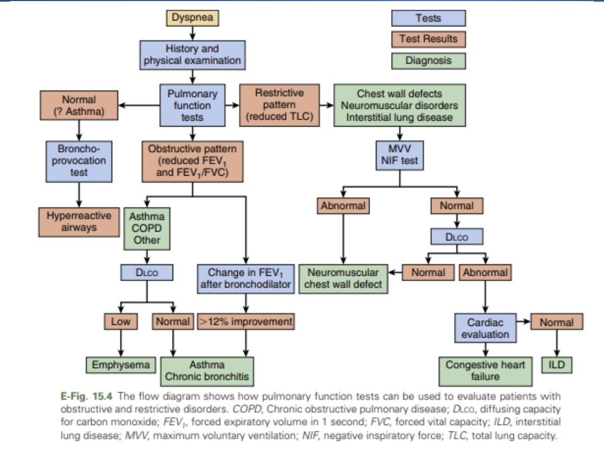

> 🔁 **Recap: Algorithm.** Normal PFT → methacholine. Obstruction → DLCO (low = emphysema; normal = asthma/bronchitis) + bronchodilator (> 12% = asthma). Restriction → muscle tests (MVV/NIF) → DLCO → heart → ILD.

---

## 3. High-Yield Comparison Tables

### Table A: Shunt vs dead space
| | Shunt (V = 0) | Dead space (Q = 0) |
|---|---|---|
| Problem | Blood without air | Air without blood |
| Examples | Pneumonia, atelectasis, oedema, ARDS | PE, severe PAH |
| O₂ response *[added]* | Poor | Better |

### Table B: Conducting vs respiratory zone *(see §2.2)*

### Table C: Type I vs type II pneumocytes *(see §2.2)*

### Table D: Volumes *(see §2.3 and the added diagram)*

### Table E: Obstructive vs restrictive *(see §2.4)*

### Table F: DLCO
| ↓ DLCO | Normal DLCO | ↑ DLCO *[↑ causes partly added]* |
|---|---|---|
| **Emphysema**, **ILD / pulmonary fibrosis**, **pulmonary hypertension / PE**, anaemia *[added]* | **Chronic bronchitis**, **asthma** (or ↑), **extrinsic restriction** (chest wall, neuromuscular, obesity) | **Asthma**, polycythaemia, alveolar haemorrhage |

---

## 4. Rules, Exceptions, Patterns
- **Right lung 3 lobes, left 2.**
- **Conducting zone (to terminal bronchioles, gen 16) = anatomical dead space; gas exchange starts at respiratory bronchioles (gen 17).**
- **Type I = gas exchange (95%); type II = surfactant (5%).**
- **Shunt = V 0 (pneumonia, oedema, ARDS); dead space = Q 0 (PE).**
- **Spirometry can't measure RV, FRC or TLC; plethysmography can.**
- **FEV1/FVC ↓ = obstruction; normal/↑ with ↓ TLC = restriction.**
- **RV ≥ 120% = air trapping (obstruction).**
- **DLCO separates emphysema (↓) from asthma/bronchitis (normal/↑), and intrinsic (↓) from extrinsic (normal) restriction.**
- **PFTs alone never make the diagnosis.**
- **Normal spirometry + suspected asthma → bronchoprovocation.**

---

## 5. Clinical Correlations
- **Hypoxaemic patient with lobar pneumonia not improving on high-flow O₂** → shunt physiology.
- **Sudden dyspnoea, clear lungs, hypoxaemia** → dead space from PE → CTPA (or V/Q).
- **Premature neonate with respiratory distress** → surfactant deficiency (type II pneumocytes) *[added]*.
- **Smoker with FEV1/FVC 0.62, ↑ TLC, ↓ DLCO** → emphysema (Case 1).
- **Obese patient with ↓ TLC but normal DLCO** → extrinsic restriction.
- **Myasthenia/ALS with restriction** → MVV/NIF abnormal (neuromuscular).
- **Asthmatic with normal spirometry between attacks** → methacholine challenge.

---

## 6. Rapid Revision (Last-Day)
- Lungs: deliver O₂, remove CO₂ via **ventilation, perfusion, V/Q matching**.
- **Shunt (V = 0):** pneumonia, atelectasis, oedema, ARDS. **Dead space (Q = 0):** segmental/massive PE, R→L shunt, severe PAH.
- Right lung **3 lobes**, left **2**; mediastinum (heart, trachea, oesophagus, nodes); pleura; diaphragm.
- Upper tract: nose, nasal cavity, pharynx. Lower: larynx, trachea, bronchi, lungs. **Alveoli = functional unit.**
- **Conducting zone (0–16) = anatomical dead space; respiratory zone (17–23).**
- **~300 million alveoli; type I 95% (gas exchange, thin); type II 5% (surfactant, rounded).**
- **TLC 6–6.5 L · VC 4.5–5 L · RV 1–1.5 L · TV ~500 mL (7 mL/kg) · FRC 2.5–3 L.**
- Spirometry: most common; **not RV/TLC**. **Plethysmography: RV, TLC.** **DLCO:** thickened (fibrosis), destroyed (emphysema), vascular (PH).
- **Obstructive:** FEV1 < 80%, **FEV1/FVC ↓**, VC ↓, **RV ≥ 120%**, TLC normal/↑, DLCO variable.
- **Restrictive:** FEV1 normal/↓, **FEV1/FVC normal/↑**, VC ↓, RV normal/↓, **TLC ↓**, DLCO normal (extrinsic) / ↓ (intrinsic).
- Other: **bronchoprovocation, ABG, 6-minute walk**.
- Imaging: **CXR, CT, MRI, CTPA**, fluoroscopy, **POCUS**, angiography, **V/Q**, **bronchoscopy**.
- Algorithm: normal → bronchoprovocation; obstructive → DLCO (low = emphysema) + bronchodilator (> 12% = asthma); restrictive → MVV/NIF → DLCO → cardiac → ILD.

---

## 7. Exam-Style Questions

**Q1 (MCQ, lecture Case 1, Slide 24).** 60 ♂, **40 pack-years**, 2 months of progressive exertional dyspnoea and dry cough; **BMI 19** (thin); **prolonged expiration, end-expiratory wheeze**. Post-bronchodilator **FEV1/FVC 62%**, **FEV1 60%**, ⭐ **TLC 125%**, ⭐ **DLCO ↓**. Diagnosis?
**c. COPD**
**Answer: c.** *[reasoning added; no key on the slide]* **Obstruction persisting after bronchodilator** (< 70%) + **hyperinflation (TLC ↑)** + **↓ DLCO** in a thin heavy smoker = **COPD (emphysema-predominant, "pink puffer")**, GOLD 2 (FEV1 60%). **Asthma**: reversible, DLCO normal/↑. **ILD/HP**: restrictive (TLC ↓). **Bronchiectasis**: copious purulent sputum.

**Q2 (MCQ).** Which volume can **not** be measured by spirometry?
a) Tidal volume b) Vital capacity **c) Residual volume** d) FEV1
**Answer: c** (also TLC and FRC) → body plethysmography.

**Q3 (MCQ).** A large pulmonary embolism produces which V/Q abnormality?
a) Shunt **b) Dead-space ventilation** c) Normal V/Q d) Diffusion limitation only
**Answer: b.** Ventilated alveoli with no perfusion (Q = 0).

**Q4 (MCQ).** Which cell secretes surfactant?
a) Type I pneumocyte **b) Type II pneumocyte** c) Alveolar macrophage d) Club cell
**Answer: b.**

**Q5 (Short answer).** A patient has ↓ TLC with normal FEV1/FVC. Muscle strength tests (MVV/NIF) are normal and DLCO is reduced; cardiac evaluation is normal. Diagnosis?
**Answer:** **Interstitial lung disease** (restrictive, intrinsic, normal heart), per the Slide 23 algorithm.

---

## 8. Exam Pitfalls & Traps
1. **Shunt vs dead space:** shunt = **no ventilation** (pneumonia, ARDS); dead space = **no perfusion** (PE).
2. **Spirometry measures TLC.** No: **plethysmography** measures RV and TLC.
3. **Obstruction → TLC ↓.** No: **normal or ↑** (air trapping); restriction → TLC ↓.
4. **Restriction → FEV1/FVC ↓.** No: **normal or ↑**.
5. **DLCO ↓ in asthma.** It's **normal or ↑**; ↓ in emphysema.
6. **Type I pneumocytes make surfactant.** Type **II** do; type I do gas exchange.
7. **Gas exchange starts in terminal bronchioles.** It starts in **respiratory bronchioles** (generation 17); terminal bronchioles are still conducting.
8. **PFTs can diagnose alone.** The slide says **no**: combine with clinical findings and imaging.
9. ⚠️ **Slide title vs file name:** the file is "chest anatomy & investigations"; the slide title is **"Lung Physiology primer & diagnostic studies"**. Same lecture.
10. ⚠️ **Slide 4 labels "Gas exchange (Q)"**; Q strictly means **perfusion** (blood flow).
