# Pleural Diseases: An Approach to a Case of Chest Pain
**Dr. Essam Kotb, Associate Professor, Internal Medicine** | Source: `7-Pleura_Updated.pdf` (38 slides) · Refs: Step-Up 5th ed.; Harrison 20th ed.; AMBOSS; Cecil 10th ed.; First Aid IM Boards 4th ed.; Osmosis

> **Legend:** ⭐ = high-yield · *[added]* = not on slides. Images marked "Slide N" come from the lecture; "Added diagram" = drawn for these notes.

> 🔗 **Bridge from earlier respiratory lectures (same lecturer):** Pleural disease ties the series together. **Pneumonia** and **lung abscess** cause **empyema**; **COPD, CF and asthma** cause **secondary pneumothorax**; **PE** causes **effusion and pleurisy**; **cancer** (next lecture) causes **malignant effusion**. Pneumothorax was a complication in the Asthma lecture's Calgary flowchart.

---

## 1. Title / Objectives
| Domain | Objective | Likely tested as |
|---|---|---|
| Knowledge | Visceral vs parietal pleura; how fluid or air accumulates | Anatomy |
| Knowledge | ⭐ **Transudate vs exudate** by cause | Cause lists |
| Knowledge | ⭐ Pneumothorax types (spontaneous, traumatic, iatrogenic, **tension**) | Classification |
| Knowledge | ⭐⭐ **Light's criteria**; pleural-fluid interpretation | Numbers: 0.5 / 0.6 / ⅔; pH 7.2; glucose 60/30 |
| Knowledge | ⭐ Management: transudate, uncomplicated vs complicated parapneumonic, empyema, pneumothorax | Drain or not; needle vs tube |
| Skills | Signs; CXR, US, CT, fluid labs; choose procedure by stability; ⭐ **treat tension pneumothorax without waiting for imaging** | Case vignettes |
| Values | Evidence-based practice; safety in conservative vs invasive choices | |

**Flow:** Introduction → Pleurisy → Pleural effusion (definition, types, transudate vs exudate, Light's, fluid analysis, features, diagnosis, management) → Pneumothorax (definition, classification, risk factors, features, diagnosis, size, management, procedures, algorithm) → Summary → Cases.

---

## 2. Main Content (Lecture Order)

### 2.1 Introduction & Pleurisy (Slides 5–7)
⭐ The **pleura** is a thin membrane:
- **Visceral pleura**: covers the **entire lung surface**
- **Parietal pleura**: lines the **inner rib cage, diaphragm and mediastinum**

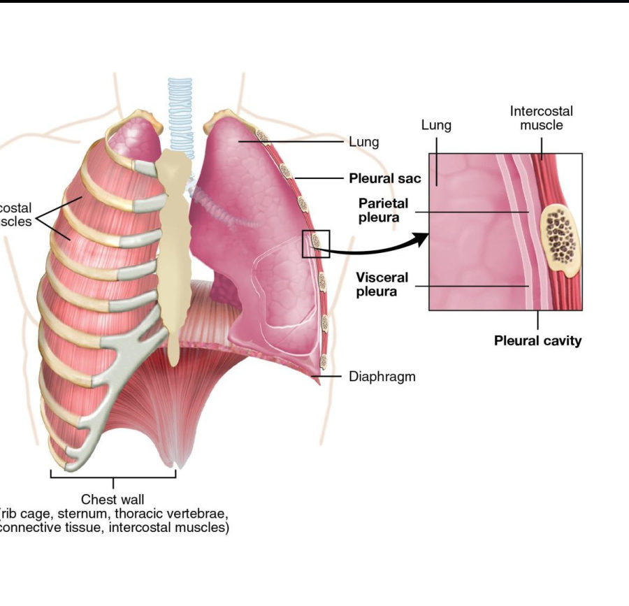

⭐ **Pleurisy** = inflammation of the pleura.
| Group | Causes |
|---|---|
| ⭐ **Viral (most common)** | **Adenovirus, coxsackie**, CMV, EBV, **influenza**, parainfluenza |
| **Bacterial** | **Pneumonia** (parapneumonic pleuritis), **TB** |
| **Inflammatory** | **Uraemia**, **SLE**, **rheumatoid arthritis** |
| **Pulmonary** | Pneumothorax, **asbestosis**, malignancy (**mesothelioma**), ⭐ **PE** |
| **Cardiac** | **MI**, cardiac surgery |
| **Drugs** | **Amiodarone, bleomycin, methotrexate, isoniazid, hydralazine** |

**Features (Slide 7):** ⭐ **pleuritic chest pain** (sharp, worse on breathing/coughing), **pleural friction rub**, dry cough, dyspnoea, fever. **Treatment:** analgesia (NSAIDs), treat the cause.

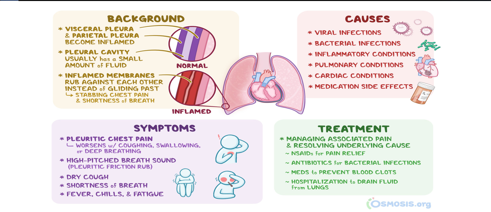

> 🔁 **Recap: Pleurisy.** Inflamed pleura; viral is commonest; also pneumonia/TB, SLE/RA/uraemia, PE, MI, drugs. Sharp pain on breathing + friction rub.
> 🔗 **Link:** Inflamed or pressured pleura can fill with fluid.
> ▶️ **Up next: Pleural effusion.**

---

### 2.2 Pleural Effusion: Definition & Types (Slides 8–12)
⭐ **Definition:** **excess fluid between the pleural layers** that impairs lung expansion.
**Mechanisms:** ↑ **drainage into** the pleural space · ↑ **production** by cells in the space · ↓ **drainage out** of the space.

| Fluid | Name |
|---|---|
| Blood | ⭐ **Haemothorax** |
| Pus | ⭐ **Empyema** |
| Chyle (lymph) | ⭐ **Chylothorax** |

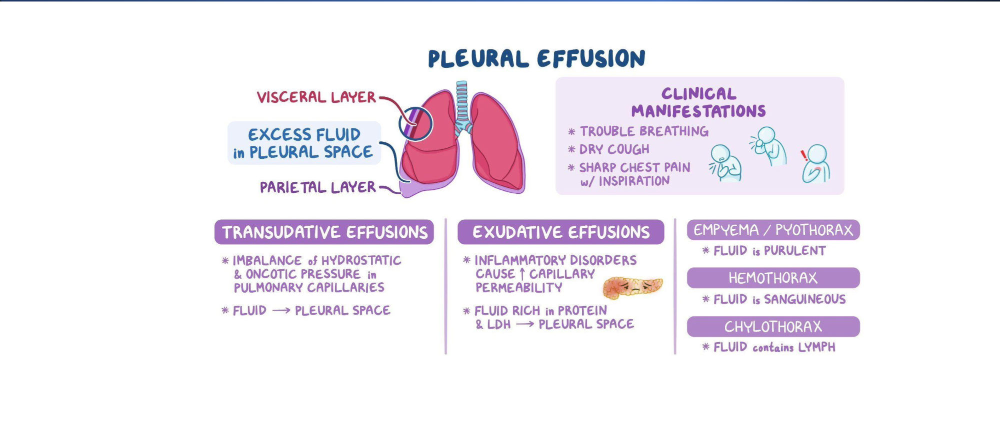

⭐⭐ **Transudate vs exudate (Slides 10–11):**
| | **Transudate** | **Exudate** |
|---|---|---|
| Mechanism | ↑ **hydrostatic** or ↓ **oncotic** pressure | **Inflammation**, ↑ capillary **permeability** |
| Protein & LDH | **Low** | **High** |
| ⭐ Causes | **CHF, cirrhosis, nephrotic syndrome, peritoneal dialysis, hypoalbuminaemia, atelectasis, PE** | **Bacterial pneumonia, TB, malignancy/metastases, viral infection, PE, collagen vascular disease** |
*Note: **PE appears in both lists.***

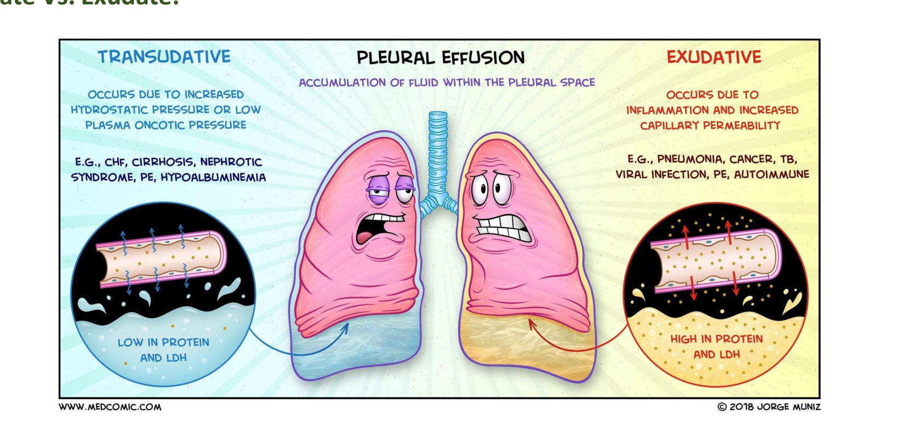

**Other effusion causes (Slide 12):**
| Type | Causes |
|---|---|
| ⭐ **Empyema** | **Most common: pneumonia**; also infected haemothorax, **ruptured lung abscess**, **oesophageal tear**, thoracic trauma |
| ⭐ **Chylothorax** | **Trauma** (incl. iatrogenic), **malignancy** (lymphoma, bronchogenic cancer), congenital lymphatic anomalies, **thoracic duct obstruction** |
| **Haemothorax** | Bleeding disorders, malignancy (**mesothelioma**) *[added: trauma is the commonest cause]* |

### 2.3 ⭐⭐⭐ Light's Criteria & Fluid Analysis (Slides 13–14, 18)
**Light's criteria (Slide 13):** an effusion is an **EXUDATE if ANY one** is met:
| Test | Transudate | ⭐ Exudate |
|---|---|---|
| **Protein** (pleural/serum) | **≤ 0.5** | **> 0.5** |
| **LDH** (pleural/serum) | **≤ 0.6** | **> 0.6** |
| **Pleural LDH** vs serum ULN | **≤ ⅔ upper limit of normal** | **> ⅔ upper limit of normal** |

*Mnemonic [added]:* **"0.5 – 0.6 – ⅔"**: any one over = exudate.

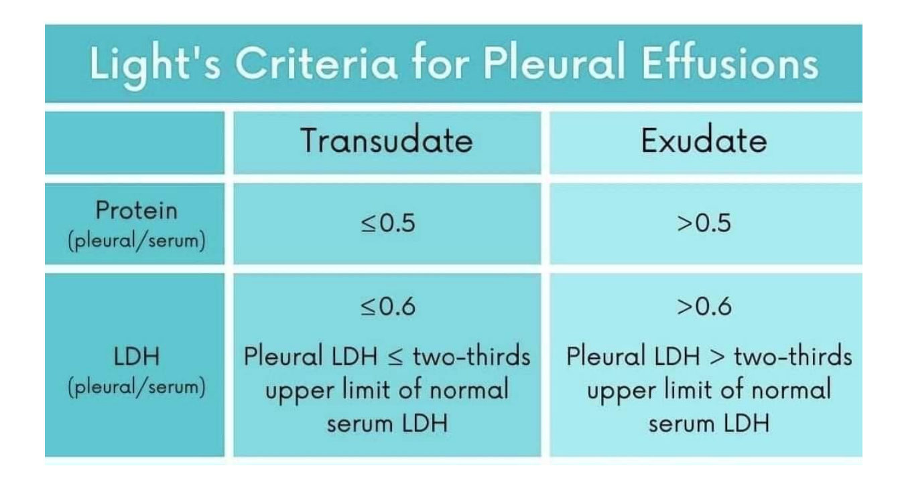

⭐⭐⭐ **Pleural-fluid interpretation (Slide 14, Table 4.10):**
| Test | Interpretation |
|---|---|
| ⭐ **pH** | **< 7.2 with parapneumonic effusion → drainage required** |
| ⭐ **Haematocrit** | **> 50% of peripheral Hct → haemothorax** |
| ⭐ **Glucose** | **< 60 mg/dL** → complicated parapneumonic or malignancy; ⭐ **< 30 → think RA** |
| ⭐ **Triglycerides** | **> 110 mg/dL → chylothorax** (milky white; thoracic duct disruption; lymphoma, cancer, trauma, lymphangioleiomyomatosis) |
| ⭐ **Lymphocytes** | **> 50% → TB or malignancy** |
| **Eosinophils** | **> 10%** with air or blood, ⭐ **most commonly pneumothorax**; also drugs, asbestos, paragonimiasis, Churg–Strauss, PE |
| **Amylase** | ↑ → **acute pancreatitis, pancreaticopleural fistula, oesophageal perforation** |

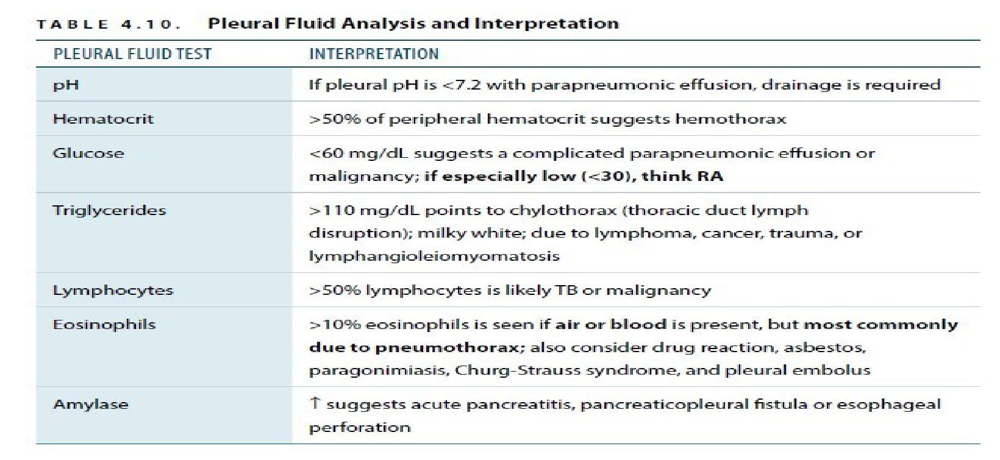

⭐ **Work-up algorithm (Slide 18):** pleural fluid →
- **Transudate** (all criteria low) → **CHF, cirrhosis**
- **Exudate** → **pH > 7.2 = not complicated**; **pH < 7.2 = complicated → drainage**
- **Bacteria/pus** → **drainage**
- **Malignant cells** → **mesothelioma or metastatic cancer**

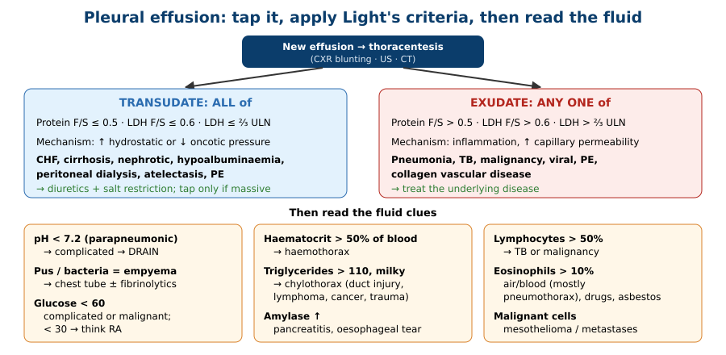

### 2.4 Clinical Features & Diagnosis (Slides 15–17)
- ⭐ **Small effusions (< 300 mL) are often asymptomatic**
- **Dyspnoea**, **pleuritic chest pain**, **dry cough**, symptoms of the cause
- **Exam:** ⭐ **asymmetric expansion / lagging** on the affected side · ⭐ **↓ tactile fremitus** · ⭐ **faint or absent breath sounds** · ⭐ **stony dullness to percussion**

**Diagnosis:**
- ⭐ **CXR: look for blunting** (costophrenic angle) *[added: about 200 mL needed on PA, about 50 mL on lateral film]*
- **CT and ultrasound** (US also guides the tap)
- ⭐ **Thoracentesis is indicated in ALL new effusions**: **diagnostic vs therapeutic**

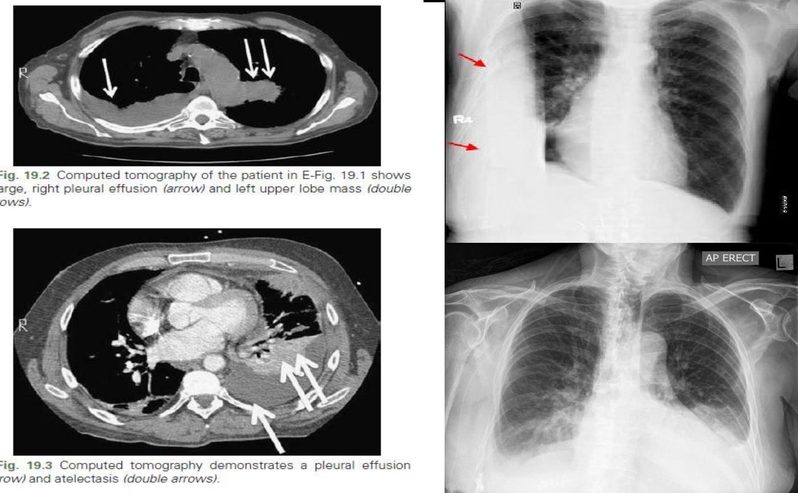 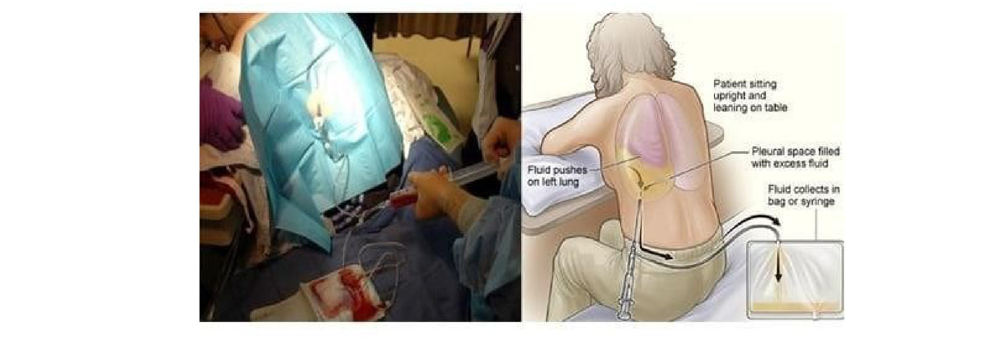

### 2.5 Management (Slide 19)
1. ⭐ **Transudative**: **diuretics + sodium restriction**; **therapeutic thoracentesis only if massive and causing dyspnoea**
2. ⭐ **Exudative**: **treat the underlying disease**
3. ⭐ **Parapneumonic**:
   - **Uncomplicated** → **antibiotics alone**
   - ⭐ **Complicated or empyema** → **chest-tube drainage** ± **intrapleural fibrinolytics**

> 🔁 **Recap: Effusion.** Fluid in the pleural space; blood = haemothorax, pus = empyema, chyle = chylothorax. Tap every new effusion. Light's: protein > 0.5, LDH > 0.6, or LDH > ⅔ ULN = exudate. pH < 7.2 or pus = drain. Glucose < 30 = RA; TG > 110 = chyle; Hct > 50% = blood; lymphocytes > 50% = TB/cancer. Transudate → diuretics; exudate → treat the cause.
> 🔗 **Link:** Air in the pleural space is the other big pleural emergency.
> ▶️ **Up next: Pneumothorax.**

---

### 2.6 Pneumothorax: Definition & Classification (Slides 20–25)
⭐ **Definition:** **air in the pleural space**; if large, the lung **collapses** and stops working.

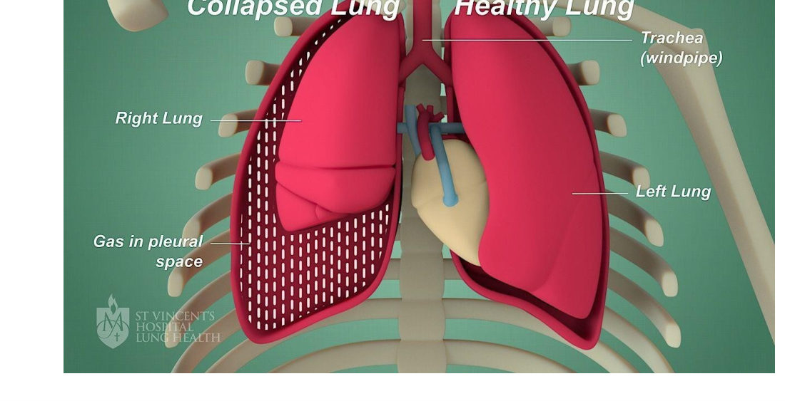

⭐⭐ **Classification:**
| Type | Features |
|---|---|
| ⭐ **Primary spontaneous** | **No known lung disease**; ruptured **subpleural apical blebs**. Risk: ⭐ **tall, thin young men**, **smoking (90%; up to 20× risk, dose-related)**, family history, **Marfan**, **cocaine** |
| ⭐ **Secondary spontaneous** | **Underlying lung disease**: ⭐ **COPD** (ruptured emphysematous bullae), **TB**, **Pneumocystis** (cavity rupture), ⭐ **CF**, ILD, malignancy |
| **Traumatic** | **Blunt** (car accident) or **penetrating** (gunshot, stab); **barotrauma** from ventilation |
| **Iatrogenic** | **Thoracentesis, bronchoscopy, central line**, mechanical ventilation |
| ⭐⭐ **Tension** | **Life-threatening**: **progressively rising pressure** in the chest → **cardiorespiratory compromise** |

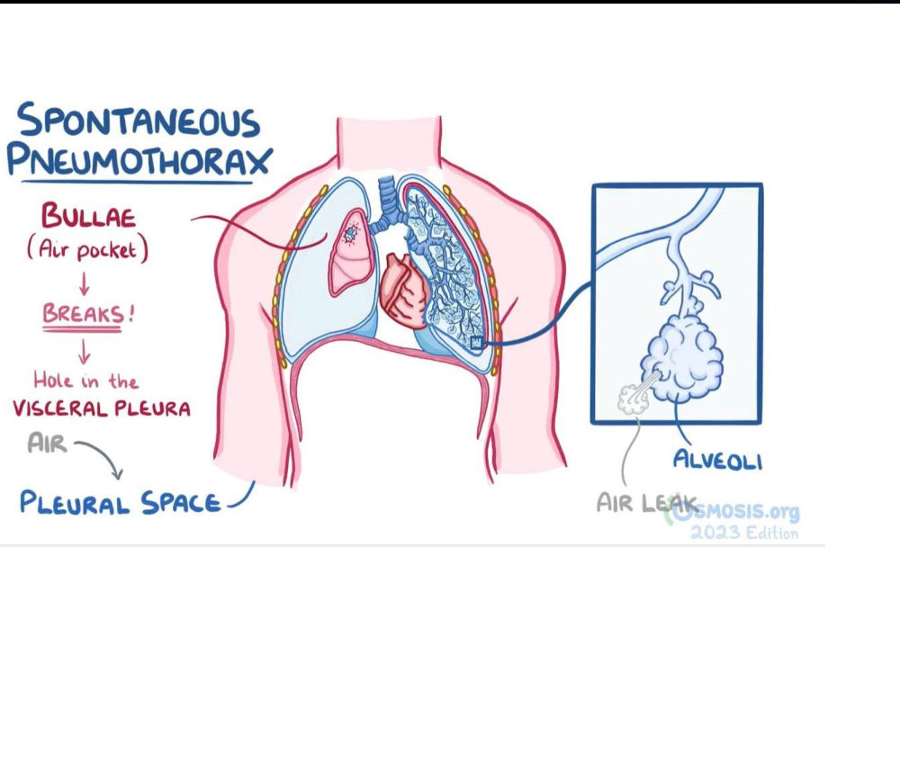 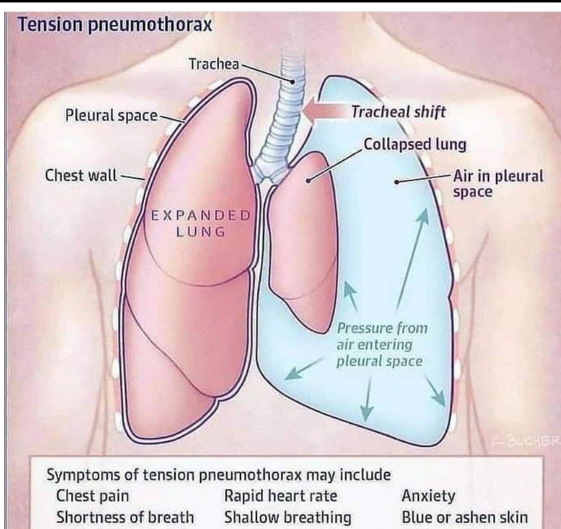

**By mechanism (Slide 24):**
| **Closed** | **Open** | ⭐ **Tension** |
|---|---|---|
| Air enters from the lung; chest wall intact | **Chest-wall defect**; air moves in and out (sucking wound) | **One-way valve**: air enters and **can't escape**, pressure builds, **mediastinum shifts** |

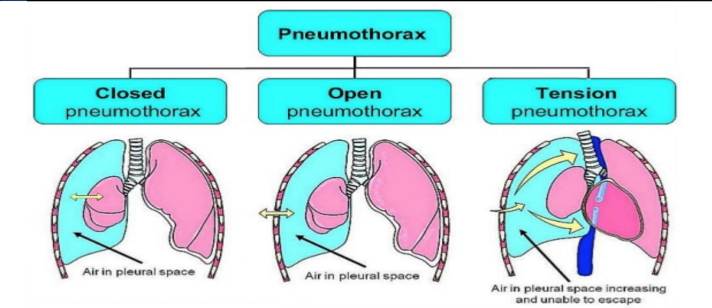

### 2.7 Clinical Features (Slide 26)
- Ranges from **asymptomatic** to **haemodynamic compromise**
- ⭐ **Sudden, severe, stabbing, ipsilateral pleuritic pain + dyspnoea**
- ⭐ **↓ or absent breath sounds, HYPERRESONANCE, ↓ fremitus** on the same side

⭐ **Mnemonic on slide: "P-THORAX"**: **P**leuritic pain · **T**rachea deviation · **H**yperresonance · **O**nset sudden · **R**educed breath sounds (& dyspnoea) · **A**bsent fremitus · **X**-ray shows collapse

⭐⭐ **Extra signs of TENSION pneumothorax:**
- **Severe respiratory distress**: cyanosis, restlessness
- **Reduced ipsilateral chest expansion**
- ⭐ **Distended neck veins + haemodynamic instability** (obstructive shock)
- Trachea deviated **away** from the affected side *[direction added]*
- Secondary injuries (open/closed wounds)
- ⭐ **In ventilated patients:** **rapid fall in SpO₂**, **reduced airflow**, ⭐ **rising ventilation pressure**, **subcutaneous emphysema**

### 2.8 Diagnosis & Size (Slides 27–28)
- **Clinical diagnosis**; **CXR to confirm** (visceral pleural line, absent lung markings, deep sulcus sign); **POCUS**; **CT**
- ⭐⭐ **Tension pneumothorax is a CLINICAL diagnosis: don't delay treatment for imaging**
- **Size** measured on imaging; method depends on guidelines; ⭐ key cut-off **apex-to-cupola ≥ 3 cm = large**

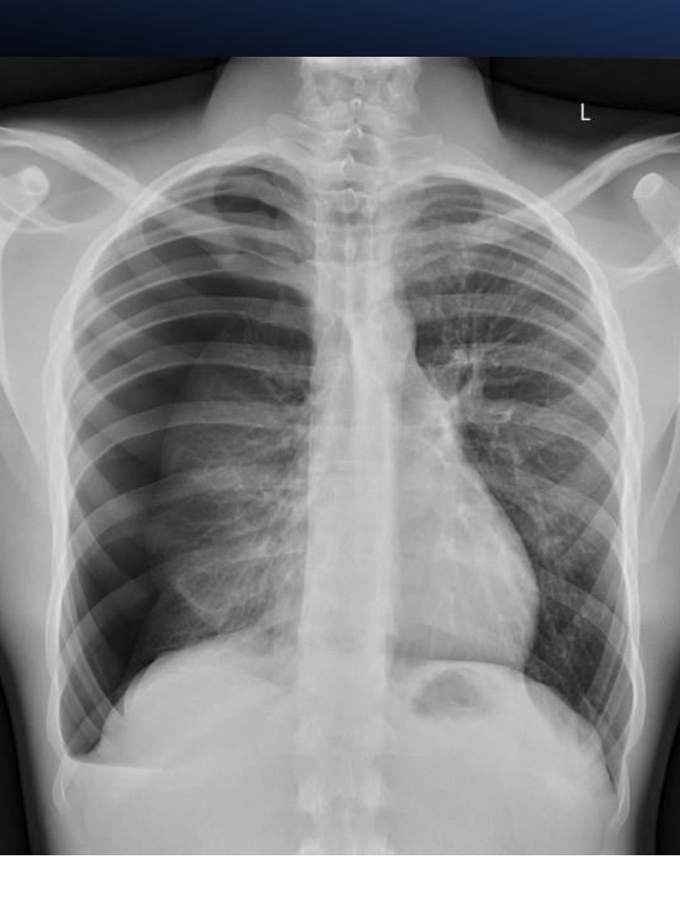

### 2.9 Management (Slides 29–32)
**All patients:** assess **stability**, give **respiratory support**, treat dyspnoea, determine **type and size**.

⭐⭐ **Unstable / high risk** (tension, bilateral, or on ventilator) → ⭐ **immediate chest decompression**; treat **obstructive shock**.

| Situation | Management |
|---|---|
| ⭐ **Stable, small / low risk** | **Observation + O₂** (conservative) |
| **Stable, larger or symptomatic** | **Simple aspiration** or **small-bore chest tube** |
| ⭐⭐ **Unstable / suspected tension** | ⭐ **Emergency needle thoracostomy → then chest tube immediately** |
| **Traumatic** | **Most need a chest tube** |

⭐⭐ **Procedure sites (Slide 31):**
| Procedure | Site |
|---|---|
| ⭐ **Needle thoracostomy** | ⭐ **2nd intercostal space, mid-clavicular line** *(figure also shows the 4th–5th ICS anterior axillary line as an alternative)* |
| ⭐ **Chest tube** | ⭐ **4th–5th intercostal space (nipple line), between the anterior and mid-axillary lines** (the "safe triangle" *[term added]*) |

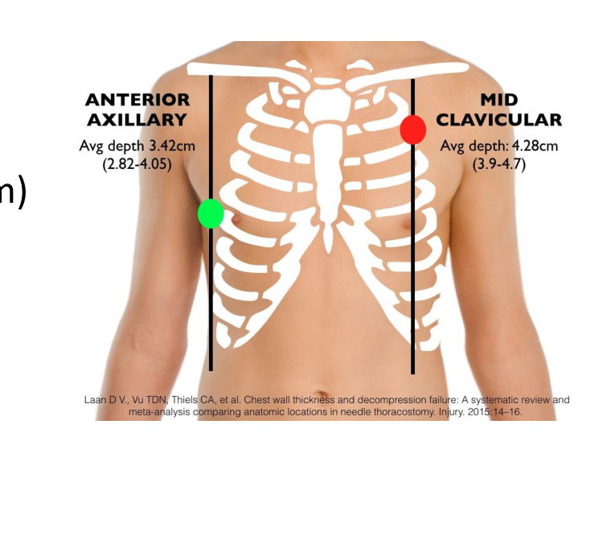

⭐⭐ **Algorithm (Slide 32):**
1. **Trauma?** → follow **ATLS**
2. Support: **upright, 100% O₂, analgesia**
3. ⭐ **Unstable if ≥ 1:** **RR ≥ 24**, **SpO₂ ≤ 90%**, **speaking in incomplete sentences**, **HR < 60 or > 120**, **SBP < 90**
   - Suspected tension (distended neck veins, pulsus paradoxus) → ⭐ **emergency chest tube; consider needle thoracostomy**
4. Stable → **CXR** (modality of choice), lung US, CT; **bilateral → chest tube**
5. ⭐ **Secondary if age > 50 with significant smoking history, or lung disease on exam/imaging**:
   - **Apex-to-cupola < 3 cm** → observe 24 h with serial CXR (or chest tube); progression → tube
   - **≥ 3 cm** → ⭐ **chest tube, ICU, thoracic surgery consult**
6. ⭐ **Primary**: if **all of** **age 18–50**, **apex-to-cupola < 3 cm**, **mobilising without dyspnoea on room air** → **conservative**, repeat **CXR in 3–6 h** → discharge with follow-up
   - Otherwise → **consider needle aspiration** → if unsuccessful or significant residual → **chest tube**
7. ⭐ **Any pneumothorax on mechanical ventilation → chest tube** (prevents tension)

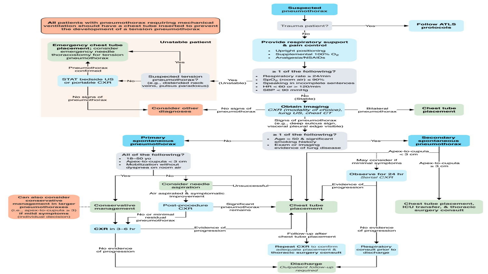

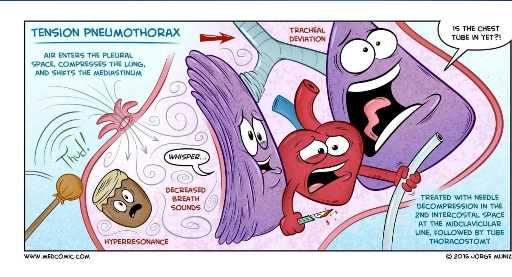

> 🔁 **Recap: Pneumothorax.** Air in the pleural space. Primary (tall young smoker, apical bleb) vs secondary (COPD, CF, TB, PCP) vs traumatic/iatrogenic vs tension. Sudden pleuritic pain, hyperresonance, absent breath sounds (P-THORAX). Tension adds JVD, shock, tracheal shift, rising ventilator pressure → needle at the 2nd ICS MCL, then chest tube, without waiting for an X-ray. Stable: small → observe/O₂; large (≥ 3 cm) or secondary → aspirate or tube.

---

## 3. High-Yield Comparison Tables

### Table A: Transudate vs exudate *(see §2.2 and the added diagram)*

### Table B: Fluid clues *(see §2.3)*

### Table C: Effusion vs pneumothorax exam
| Sign | **Effusion** | **Pneumothorax** |
|---|---|---|
| Percussion | ⭐ **Dull** (stony) | ⭐ **Hyperresonant** |
| Fremitus | ↓ | ↓ / absent |
| Breath sounds | ↓ / absent | ↓ / absent |
| Trachea (if large) | Away *[added]* | Away (tension) |
| CXR | Blunted angle, meniscus | Pleural line, no lung markings |

### Table D: Pneumothorax types
| | Primary | Secondary | Tension |
|---|---|---|---|
| Lung | Normal (blebs) | Diseased | Any |
| Typical patient | Tall thin young male smoker | > 50, COPD/CF/TB | Trauma, ventilated, any |
| Management | Observe / aspirate | Lower threshold for tube; admit | **Needle → chest tube now** |

### Table E: Procedures *(see §2.9)*

---

## 4. Rules, Exceptions, Patterns
- **Tap every new effusion** (diagnostic ± therapeutic).
- **Exudate if ANY Light's criterion is met.**
- **PE can be transudate OR exudate.**
- **pH < 7.2 in a parapneumonic effusion = drain.** Pus = drain.
- **Glucose < 30 = rheumatoid**; < 60 = complicated or malignant.
- **Lymphocytic exudate = TB or cancer.**
- **Transudates are treated with diuretics, not drains** (unless massive and symptomatic).
- **Dull = fluid; hyperresonant = air.**
- **Tension pneumothorax: treat first, image later.**
- **Needle: 2nd ICS MCL. Chest tube: 4th–5th ICS, anterior–mid-axillary.**
- **Ventilated patient + pneumothorax = chest tube.**
- **Secondary pneumothorax (> 50, smoker, lung disease) is treated more aggressively.**

---

## 5. Clinical Correlations
- **Heart-failure patient with bilateral effusions** → transudate; treat with diuretics.
- **Fever + effusion after pneumonia; pH 7.0, glucose 30** → complicated parapneumonic/empyema → chest tube (Case 2).
- **Effusion with very low glucose in a woman with joint disease** → rheumatoid pleurisy.
- **Lymphocytic exudate in a migrant with weight loss** → TB (check adenosine deaminase *[added]*).
- **Milky fluid after thoracic surgery** → chylothorax.
- **Asbestos exposure + effusion + chest pain** → mesothelioma.
- **Tall young smoker with sudden pleuritic pain** → primary spontaneous pneumothorax.
- **COPD patient suddenly worse with unilateral hyperresonance** → secondary pneumothorax (bullae).
- **Ventilated patient: falling SpO₂, rising airway pressure** → tension pneumothorax.
- **Central line insertion followed by dyspnoea** → iatrogenic pneumothorax.

---

## 6. Rapid Revision (Last-Day)
- Visceral pleura covers the lung; parietal lines the chest wall, diaphragm, mediastinum.
- Pleurisy: **viral #1**; pneumonia, TB, SLE, RA, uraemia, PE, MI; drugs (amiodarone, bleomycin, methotrexate, INH, hydralazine).
- Effusion = excess pleural fluid; blood = haemothorax, pus = empyema, chyle = chylothorax.
- **Transudate**: CHF, cirrhosis, nephrotic, peritoneal dialysis, hypoalbuminaemia, atelectasis, PE.
- **Exudate**: pneumonia, TB, malignancy, viral, PE, collagen vascular disease.
- **Light's: protein > 0.5, LDH > 0.6, LDH > ⅔ ULN → exudate (any one).**
- **pH < 7.2 → drain · Hct > 50% → haemothorax · glucose < 60 (< 30 RA) · TG > 110 → chyle · lymphocytes > 50% → TB/cancer · eosinophils > 10% → pneumothorax/air/blood · amylase ↑ → pancreatitis/oesophageal tear.**
- Features: < 300 mL silent; dyspnoea, pleuritic pain, dry cough; ↓ expansion, ↓ fremitus, ↓ breath sounds, **dullness**.
- CXR blunting; US/CT; **tap all new effusions**.
- Rx: transudate → diuretics + salt restriction (tap only if massive); exudate → cause; uncomplicated parapneumonic → antibiotics; **complicated/empyema → chest tube ± fibrinolytics**.
- **Pneumothorax**: primary (apical blebs; tall thin male smokers, Marfan, cocaine; smoking 90%, 20×) · secondary (COPD, TB, PCP, CF, ILD, cancer) · traumatic · iatrogenic · **tension**.
- Closed / open / tension (one-way valve).
- **P-THORAX**; tension: distress, JVD, shock, tracheal shift; ventilated: ↓ SpO₂, ↑ pressure, subcutaneous emphysema.
- **Tension = clinical diagnosis → needle (2nd ICS MCL) → chest tube (4th–5th ICS, anterior–mid-axillary).**
- Unstable criteria: **RR ≥ 24, SpO₂ ≤ 90%, incomplete sentences, HR < 60/> 120, SBP < 90.**
- Small stable → observe + O₂; large (**≥ 3 cm**)/symptomatic → aspirate or small-bore tube; secondary ≥ 3 cm → tube + ICU + surgery; **ventilated → tube**.

---

## 7. Exam-Style Questions

**Q1 (MCQ, lecture Case 1, Slide 34).** 23 ♂, high-speed car crash; **confused**, RR 28, **BP 91/65**, **SpO₂ 88%**; 3-cm wound at the left 5th ICS MCL; ⭐ **JVD**; **↓ breath sounds and hyperresonance on the left**. Next step?
**e. Needle decompression**
**Answer: e.** *[reasoning added; no key on the slide]* Hypotension + JVD + unilateral hyperresonance/absent breath sounds = **tension pneumothorax**: a **clinical diagnosis** → **immediate needle decompression** (then chest tube). CT, CXR and echo delay treatment. Pericardiocentesis is for tamponade (JVD + hypotension but **normal** breath sounds and percussion). Thoracotomy is for penetrating trauma with arrest or massive haemothorax.

**Q2 (MCQ, lecture Case 2, Slide 35).** 49 ♂, alcohol misuse with recent intoxication (aspiration risk), **poor dentition**; 10 days of cough, fever 38.5 °C, right pleuritic pain; ⭐ **loculated right effusion** with consolidation. Pleural fluid will most likely show:
**g. Glucose of 30 mg/dL**
**Answer: g.** *[reasoning added]* Aspiration pneumonia → **complicated parapneumonic effusion / empyema** (loculated) → **exudate with low pH (< 7.2) and low glucose (< 60)**. pH 7.5 (b), LDH ratio 0.5 (d), LDH 45 (f) and protein ratio 0.4 (h) all describe a **transudate/normal**. Amylase 200 suggests pancreatitis or oesophageal tear; Hct 30% suggests haemothorax; > 90% lymphocytes suggests TB or cancer.

**Q3 (MCQ).** Pleural fluid: protein ratio 0.4, LDH ratio 0.5, pleural LDH 100 (serum ULN 220). Classification and most likely cause?
**Answer:** **Transudate** (all three criteria below the cut-offs; ⅔ × 220 ≈ 147) → e.g., **CHF** → diuretics.

**Q4 (MCQ).** Where is a chest tube inserted?
a) 2nd ICS MCL **b) 4th–5th ICS between the anterior and mid-axillary lines** c) 7th ICS posterior axillary d) Subxiphoid
**Answer: b.** (a) is the needle-decompression site.

**Q5 (Short answer).** A 22-year-old tall smoker has a 2-cm apical pneumothorax, is comfortable on room air and walking without breathlessness. Management?
**Answer:** **Primary spontaneous pneumothorax** meeting all conservative criteria (18–50 y, < 3 cm, no dyspnoea on room air) → **conservative management** (± O₂), **repeat CXR in 3–6 h**; if stable, **discharge with follow-up** and **smoking cessation**.

---

## 8. Exam Pitfalls & Traps
1. **Exudate needs all three Light's criteria.** No, **any one** is enough.
2. **PE is always transudative.** It can be **either**.
3. **Transudates need a chest tube.** Treat the cause (diuretics); tap only if massive and symptomatic.
4. **Waiting for CXR in suspected tension pneumothorax.** Decompress first.
5. **Needle site confusion:** needle = **2nd ICS MCL**; tube = **4th–5th ICS, anterior–mid-axillary**.
6. **Dull vs hyperresonant:** fluid = **dull**; air = **hyperresonant**.
7. **Tension vs tamponade:** both cause JVD + hypotension; tension also gives **unilateral hyperresonance and absent breath sounds**.
8. **Low glucose = only empyema.** Also **malignancy** and especially **RA (< 30)**.
9. **Eosinophilic effusion = parasite.** Most commonly due to **air or blood (pneumothorax)**.
10. ⚠️ **Slide inconsistency:** Slide 31 lists the needle thoracostomy indication as "stable patients with a large (≥ 3 cm)" pneumothorax and the chest tube as "unstable patients / ≥ 3 cm". Read with Slide 30: **unstable/tension → needle then tube**; **stable large → aspiration or small-bore tube**.
11. ⚠️ The main-subtopics slide lists **lung collapse** (in brackets) but no slide covers it.
