# Pulmonary Vascular Disease: An Approach to a Case of Dyspnea
**Dr. Essam Kotb, Internal Medicine** | Source: `10-_Pulmonary_vascular_Updated.pdf` (39 slides)

> **Legend:** ⭐ = high-yield / likely exam target · *[added]* = not on slides (context, mnemonic, or reasoning). Everything else comes from the lecture.
> ⚠️ The slides contain **internal inconsistencies** (two different Wells cut-off systems, a "↓ probability" label on the high-risk arm, and overlapping DVT score cut-offs). They are reproduced as shown and explained in §8 (Pitfalls).

---

## 1. Title / Objectives

| Domain | Objective | Likely tested as |
|---|---|---|
| Knowledge | ⭐ Define PE, DVT, PH; **Virchow's triad**; VTE risk factors | Risk-factor MCQ, triad components |
| Knowledge | ⭐ Classify **PH into clinical groups**; genetic/environmental causes; secondary complications | "Which group?" / cor pulmonale |
| Knowledge | Signs, symptoms, objective findings of PE, DVT, PH | Vignette recognition |
| Skill | ⭐ Interpret **CXR, ECG, CTPA, V/Q, echo, ABG** | S1Q3T3, Hampton hump, resp. alkalosis |
| Skill | ⭐ Apply **Wells criteria (PE & DVT)** → pretest probability → algorithm | Score calculation → next step |
| Skill | ⭐ Management by **stability**: anticoagulation (DOACs, heparin, warfarin), thrombolytics, vasoactive therapy; **contraindications** | Unstable → alteplase; stable → anticoagulate |
| Values | Recognize **contraindications to anticoagulation/invasive procedures** | Absolute vs relative table |

**Lecture flow:** PE (definition → etiology → Virchow → risk factors → pathogenesis → features → diagnostics → Wells/clinical approach → pregnancy → management: unstable vs stable) → DVT → Pulmonary hypertension (definition/etiology → pathophysiology → features → diagnostics → management) → Summary → Cases.

---

## 2. Main Content (Lecture Order)

### 2.1 PE: Definition & Etiology (Slides 5–6)
⭐ **PE = blockage of the pulmonary artery or its branches by an embolus** (blood clot, tumor, fat fragment, or air) **that originates somewhere else in the body**.

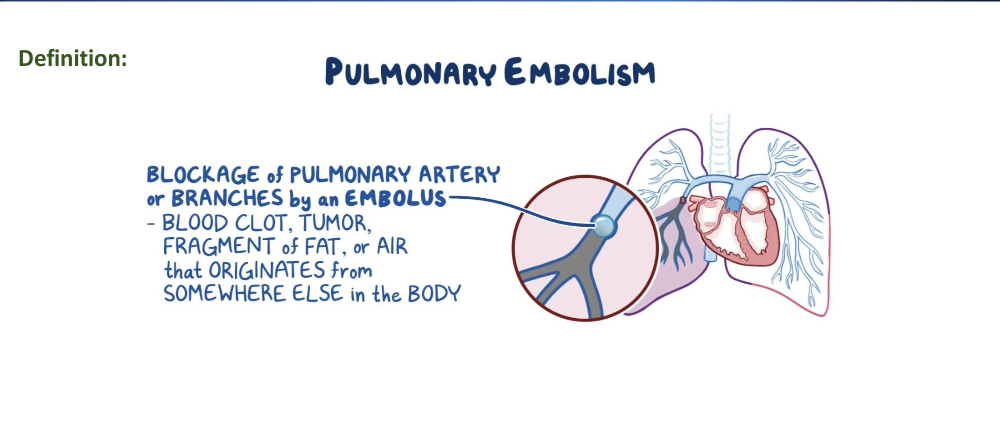


⭐ **Source:** most PEs arise from **DVT of the lower extremities *above the knee***:
1. **Iliac**
2. **Femoral**
3. **Popliteal**

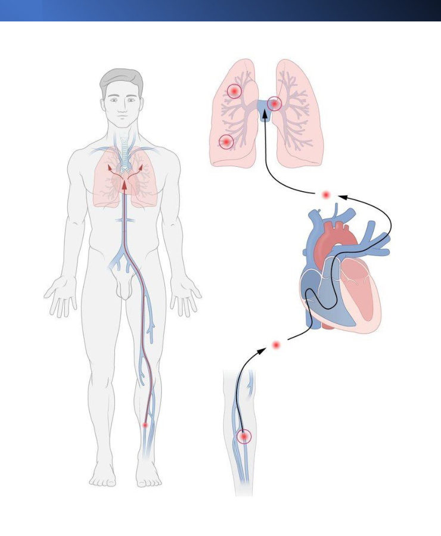


⭐ **Etiology mnemonic (on slide): "PE is FATAL"**
| Letter | Embolus |
|---|---|
| **F** | **Fat** (less common) |
| **A** | **Air** (less common) |
| **T** | ⭐ **Thrombus** (most common) |
| **AL** | **Amniotic fluid** (less common) |

> 🔁 **Recap: Definition.** PE = embolus lodged in the pulmonary arterial tree. It is almost always a thrombus from a proximal leg DVT (iliac, femoral, popliteal). Others: fat, air, amniotic fluid (**FATAL**).
> 🔗 **Link:** If thrombus is the main culprit, the next question is why clots form in the deep veins at all. Virchow's triad answers that.
> ▶️ **Up next: Virchow's triad and risk factors.** The 3 mechanisms, and the clinical conditions that trigger them.

---

### 2.2 Virchow's Triad & Risk Factors (Slides 7–8)
⭐ **Virchow's triad → thrombosis (DVT):**
1. **Stasis**
2. **Vessel wall injury** (endothelial injury)
3. **Hypercoagulability**

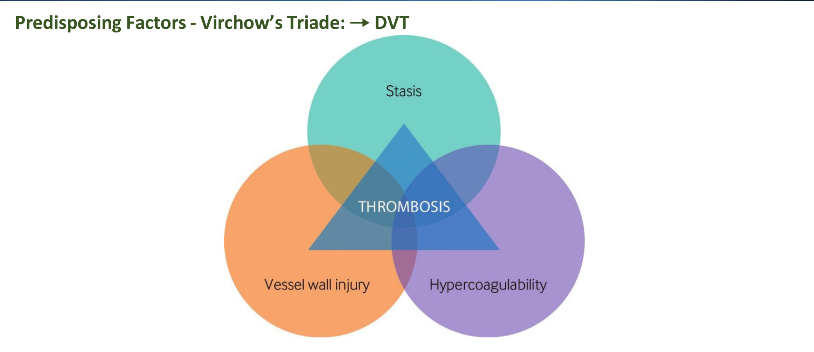


⭐ **VTE risk factors (Slide 8):**
| Risk factor | Triad arm *[mapping added]* |
|---|---|
| **Age > 60 years** | Multiple |
| **Malignancy** | Hypercoagulability |
| **Prior DVT/PE** | Multiple |
| **Hereditary thrombophilia**: **factor V Leiden**, **protein C & S deficiency**, **antithrombin III deficiency** | Hypercoagulability |
| **Prolonged immobilization / bed rest / long-distance travel** | Stasis |
| **Cardiac disease** | Stasis |
| **Obesity** | Stasis |
| **Nephrotic syndrome** | Hypercoagulability (urinary loss of antithrombin III *[added]*) |
| ⭐ **Major surgery, especially pelvic/orthopedic** | Injury + stasis |
| **Major trauma** | Injury |
| **Pregnancy, estrogen (OCPs)** | Hypercoagulability + stasis |

> 🔁 **Recap: Risk.** Stasis + injury + hypercoagulability. The big clinical triggers are age >60, cancer, prior VTE, thrombophilia, immobility, orthopedic surgery, trauma, pregnancy/OCPs, and nephrotic syndrome.
> 🔗 **Link:** Once the clot forms and travels to the lung, it does three things: infarcts tissue, disrupts gas exchange, and strains the right heart. That explains every symptom that follows.
> ▶️ **Up next: Pathogenesis.** The 3 mechanisms, each mapped to its presentation.

---

### 2.3 PE: Pathogenesis (Slides 9, 11)
⭐⭐ **Three mechanisms → presentations:**
| Mechanism | Pathophysiology | Presentation |
|---|---|---|
| **1. Local infarction** | Ischemia → **pleural and lung inflammation** | **Fever, hemoptysis, pleuritic chest pain** |
| **2. Impaired gas exchange** | ↓ Perfusion with preserved ventilation → **↑ V/Q (dead space)** → **↓ PaO₂, ↑ A-a gradient** → hyperventilation → **↓ PaCO₂ → respiratory alkalosis** | **Dyspnea, cough, wheezing** |
| **3. Cardiac compromise** | **RV overload** → **↑ pulmonary artery pressure** → **↓ cardiac output** | **Tachycardia, shock/syncope** |

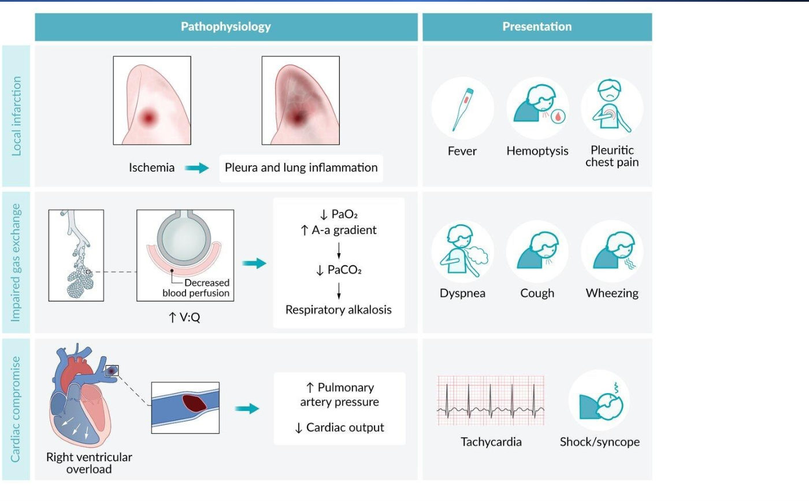


**Pathogenesis cascade (Slide 11, Calgary Guide):**
1. Virchow's triad → **DVT** (source of **95% of PE**)
2. Clot dislodges → **IVC → right atrium → right ventricle → pulmonary artery**
3. The body tries to break down the clot → **fibrin(ogen) degradation products** → ⭐ **positive D-dimer**
4. Clot occludes the artery →
   - Ischemia distal to the clot → **Hampton hump** (X-ray) + **pleuritic pain**
   - Ventilation preserved, perfusion lost → **V/Q mismatch** (V/Q scan) → **↓ arterial O₂** → chemoreceptors → **tachypnea**
   - RV can't pump past the clot → **↑ RV pressure → RV strain** → ↑ RV workload + ↓ RV coronary perfusion → **↑ troponin, hypotension, ↑ lactate**
   - RV strain findings: **Echo ↑ RV size / ↓ RV function**, **ECG S1Q3T3**, **↑ BNP**, chest pain, tachycardia
   - **CT-PA: filling defect**

**Calgary Guide notes (Slide 11):**
- **D-dimer is only done if clinical suspicion is low** (Wells)
- ⭐ **CT-PA = current diagnostic test for PE**
- **V/Q scan when CT contrast is contraindicated**
- ⭐ **X-ray is usually normal** (except Hampton hump: rare but specific)

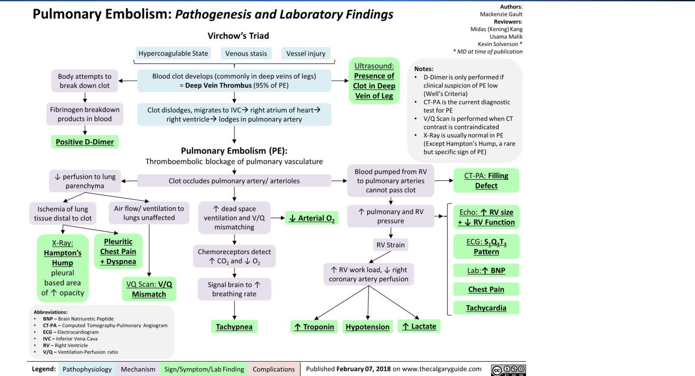


> 🔁 **Recap: Pathogenesis.** Infarction → pleuritic pain, hemoptysis, fever. Dead space → hypoxemia, ↑ A-a gradient, respiratory alkalosis. RV overload → tachycardia, shock, S1Q3T3, ↑ troponin/BNP.
> 🔗 **Link:** Knowing the three mechanisms, you can predict the clinical picture and separate common from massive PE.
> ▶️ **Up next: Clinical features.** Common, less common, and massive.

---

### 2.4 PE: Clinical Features (Slide 10)
| Common | Less common | ⭐ Massive PE |
|---|---|---|
| **Acute onset** | ↓ Breath sounds | **Presyncope / syncope** |
| ⭐ **Dyspnea** (most common) | Dullness to percussion | **JVD + Kussmaul sign** |
| **Tachycardia + tachypnea** | **Split S2** | **Hypotension + obstructive shock** |
| **Sudden pleuritic chest pain** | Low-grade fever | **Circulatory collapse** |
| Cough, hemoptysis | | |
| Features of DVT | | |

⭐ **Summary mnemonic (Slide 34): "DEAD SUDDENLY"**
| | |
|---|---|
| **D**yspnea | **U**nilateral leg swelling |
| **E**levated D-dimer | **D**VT source |
| **A**cute chest pain | **D**rops SpO₂ |
| **D**ead if missed | **E**CG: S1Q3T3 (**rare**) |
| **S**piral CT to diagnose | **N**eeds anticoagulation fast |
| | **L**ungs clear |
| | **Y**ou better not miss it |

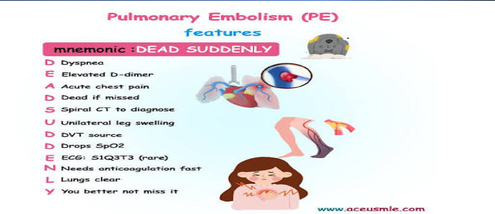


> 🔁 **Recap: Features.** Sudden dyspnea + tachycardia/tachypnea + pleuritic pain ± hemoptysis ± DVT signs, often with clear lungs. Massive PE = syncope, JVD/Kussmaul, obstructive shock.
> 🔗 **Link:** The presentation is nonspecific (many conditions cause dyspnea and tachycardia), so the diagnosis rests on tests. Each has a defined role.
> ▶️ **Up next: Diagnostics.** CXR, CTPA, V/Q, ECG.

---

### 2.5 PE: Diagnostics (Slides 12–16)
**1. Chest X-ray (Slide 12)**
- ⭐ **Usually normal**
- Classic signs are **rarely present**:
  - **Hampton hump**: pleural-based wedge-shaped opacity (infarct)
  - **Westermark sign**: regional oligemia (↓ vascular markings distal to the clot) *[descriptions added]*

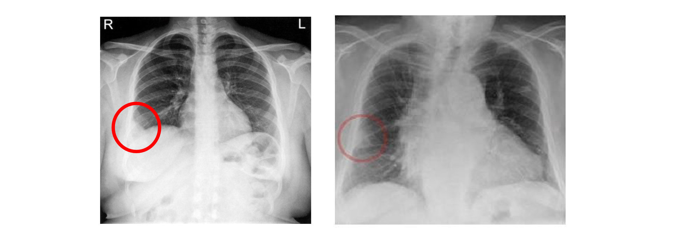


**2. CT pulmonary angiography (CTA/CTPA) (Slide 13)**
- ⭐ **Sensitivity > 90%**, good specificity
- Finding: ⭐ **intraluminal filling defects** in central, segmental, or lobular pulmonary arteries
- ⭐ **Cannot be done in significant renal insufficiency** (contrast)

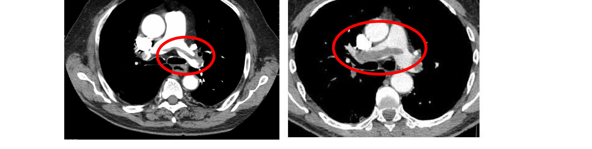


**3. V/Q scan (Slide 14)**. Used when **CTA is contraindicated**:
1. History of **anaphylaxis** (to contrast)
2. **Acute kidney injury**
3. **Severe CKD**
4. **Hyperthyroidism** (iodinated contrast)
- Finding: **V/Q mismatch** (ventilation normal, perfusion absent)

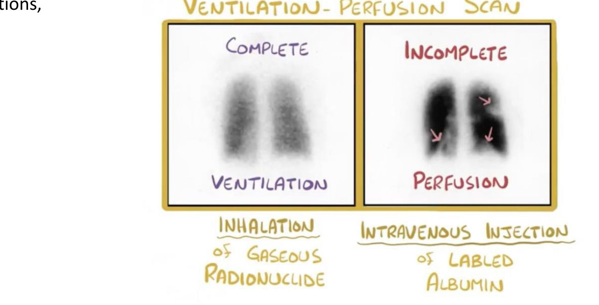


**4. ECG (Slides 15–16)**
- ⭐ **Most common: sinus tachycardia**
- **Less common: S1Q3T3**: **large S in lead I, Q wave in lead III, inverted T in lead III**
- Other signs shown: **T-wave inversion V1–V3 (V2–V3)**, **late transition** (RV strain)

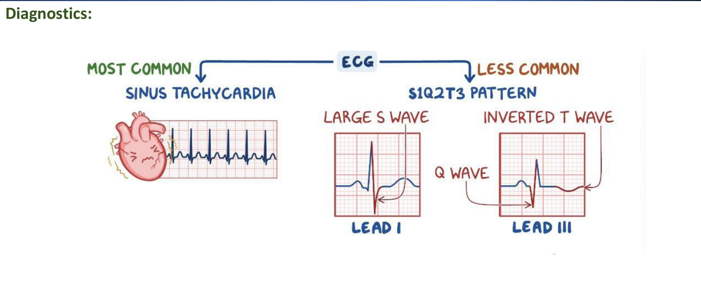

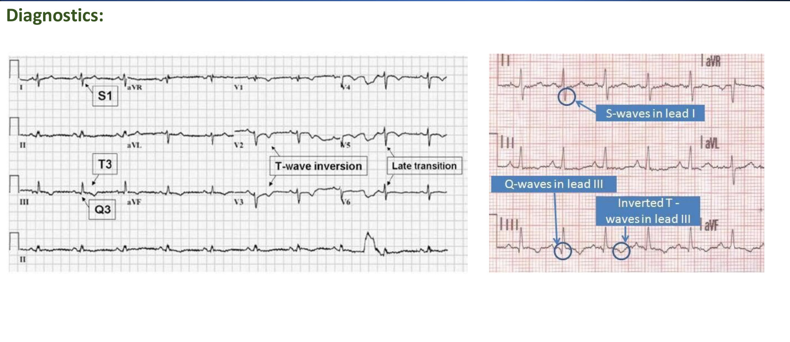


*Mnemonic [added]:* **"CTA if kidneys OK; V/Q if kidneys (or contrast) not OK."**

> 🔁 **Recap: Diagnostics.** CXR is usually normal (Hampton/Westermark rare). CTPA is the test of choice (>90% sensitive, filling defect) unless renal failure, contrast allergy, or hyperthyroidism, in which case use V/Q. ECG: sinus tachycardia most common; S1Q3T3 is rare.
> 🔗 **Link:** Tests aren't ordered blindly. Which test comes first (D-dimer or CTPA) depends on the pretest probability, calculated with the Wells score.
> ▶️ **Up next: Clinical approach.** Wells criteria and the diagnostic algorithm.

---

### 2.6 PE: Clinical Approach (Wells) (Slides 17–18)
⭐⭐⭐ **Modified Wells criteria for PE (Slide 17):**
| Finding | Points |
|---|---|
| **Clinical signs of DVT** (leg swelling, pain on palpation) | **3.0** |
| **Other diagnosis less likely than PE** | **3.0** |
| **HR > 100** | **1.5** |
| **Immobilization ≥ 3 days or surgery in previous 4 weeks** | **1.5** |
| **Previous DVT/PE** | **1.5** |
| **Hemoptysis** | **1.0** |
| **Malignancy** | **1.0** |
| **Interpretation** | ⭐ **> 4 = PE likely; ≤ 4 = PE unlikely** |

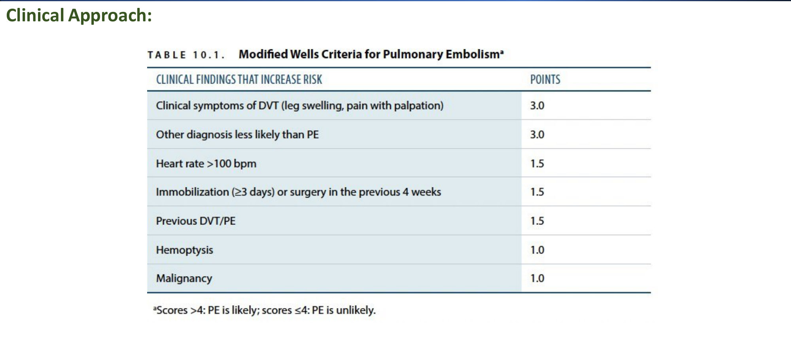


*Mnemonic [added]:* **"3-3, 1.5 × 3, 1-1"**: two 3s (DVT signs, PE most likely), three 1.5s (HR, immobile/surgery, prior VTE), two 1s (hemoptysis, cancer).

⭐⭐ **Diagnostic algorithm (Slide 18):**
```
Calculate Wells for all patients
├── Wells ≤ 4 (PE unlikely) → D-dimer
│     ├── ≤ 500 ng/mL → PE essentially ruled out (low D-dimer + low suspicion)
│     └── > 500 ng/mL → further testing → CT angiography
└── Wells > 4 (PE likely) → CT angiography directly
      ├── Negative → PE essentially ruled out
      ├── Inconclusive → lower-extremity duplex ultrasound
      └── Positive → ANTICOAGULATE
```

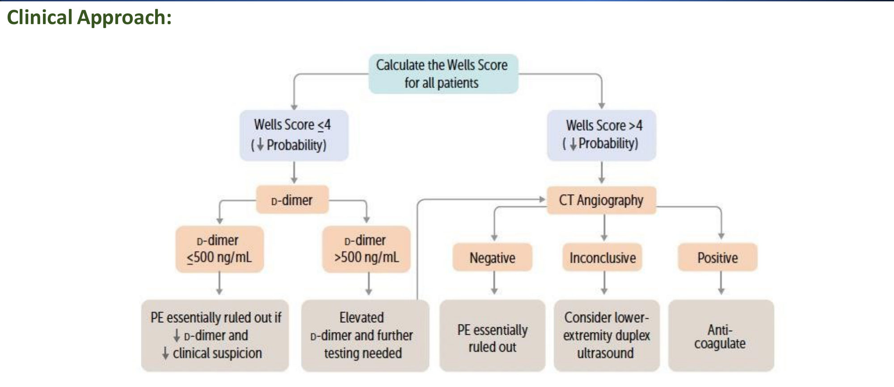

> 🔁 **Recap: Wells.** 3 + 3 + 1.5 × 3 + 1 + 1. ≤4 → D-dimer (≤500 rules out, >500 → CTA). >4 → straight to CTA. Negative rules out, inconclusive → leg duplex, positive → anticoagulate.
> 🔗 **Link:** This algorithm assumes a standard patient. Pregnancy breaks two of its tools: Wells isn't validated, and radiation/contrast matter. So there is a separate pathway.
> ▶️ **Up next: PE in pregnancy.**

---

### 2.7 PE: Diagnostics in Pregnancy (Slide 19)
1. **Initial evaluation:** use **clinical suspicion** to decide on imaging
   - ⭐ **Do NOT use the Wells score** (not validated in pregnancy/postpartum)
2. **Initial imaging:** ⭐ **CXR**
3. **Further imaging:**
   - ⭐ **CXR normal → V/Q scan**
   - ⭐ **CXR abnormal → CTPA**
4. PE may be diagnosed from **clinical suspicion + Doppler ultrasound showing lower-extremity DVT**

> 🔁 **Recap: Pregnancy.** No Wells. CXR first → normal: V/Q; abnormal: CTPA. A positive leg Doppler + clinical suspicion is enough to diagnose.
> 🔗 **Link:** Once PE is suspected or diagnosed, management depends on one question above all: is the patient hemodynamically stable?
> ▶️ **Up next: Management of unstable PE.** Treat before confirmation; thrombolysis vs embolectomy.

---

### 2.8 PE Management: Hemodynamically Unstable (Slides 20–21)
⭐ **Begin management of massive PE *before* diagnostic confirmation.**
1. **Assess for RV dysfunction:**
   - **ECG**
   - **Bedside echo / focused cardiac ultrasound**
2. Consider **DVT point-of-care ultrasound**
3. **Confirmatory imaging (CTPA or V/Q) once stable enough for transport**

⭐ **Indications for thrombolysis:**
- **Massive PE with hemodynamic instability (persistent hypotension)**
- **Evidence of right heart failure** (thrombolysis can reverse this)

⭐⭐ **Unstable pathway (Slide 21):** emergent CTPA → **assess bleeding risk** (bleeding disorders, uncontrolled HTN, recent major trauma or surgery)
| Bleeding risk | Therapy |
|---|---|
| **Low / none** | ⭐ **Thrombolytic therapy → alteplase** |
| **High** (contraindication to lysis) | ⭐ **Surgical embolectomy** or **percutaneous catheter-directed therapy** |

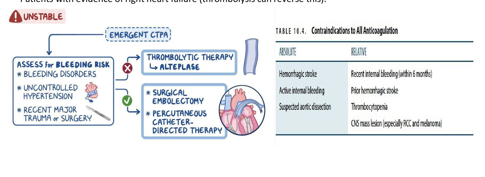


⭐ **Contraindications to all anticoagulation (Table 10.4):**
| Absolute | Relative |
|---|---|
| **Hemorrhagic stroke** | **Recent internal bleeding (≤ 6 months)** |
| **Active internal bleeding** | **Prior hemorrhagic stroke** |
| **Suspected aortic dissection** | **Thrombocytopenia** |
| | **CNS mass lesion** (especially **RCC and melanoma** metastases) |

> 🔁 **Recap: Unstable PE.** Don't wait for imaging. Bedside echo/ECG for RV strain. Lyse with alteplase if hypotensive or in RV failure and bleeding risk allows. Otherwise surgical or catheter embolectomy. Contraindications: hemorrhagic stroke, active bleeding, dissection (absolute).
> 🔗 **Link:** Most PE patients are stable. For them the question isn't "lyse or not" but "how likely is PE, and which anticoagulant for how long."
> ▶️ **Up next: Management of stable PE.** PTP-based workup, anticoagulant choice, duration.

---

### 2.9 PE Management: Hemodynamically Stable (Slides 22–24)
**Stable = e.g., SBP > 90 mm Hg → assess PTP (Slide 23):**
| PTP | Step |
|---|---|
| **Low** | **PE rule-out criteria (PERC) = 0 → no further testing**. **PERC > 0 → D-dimer** → elevated: imaging; normal: stop, consider other diagnoses |
| **Intermediate** | **D-dimer** → elevated: imaging; normal: no further testing |
| **High** | ⭐ **Confirmatory imaging directly** (no D-dimer) |

*The slide says "rule-out criteria based on Wells score = 0". PERC is a separate 8-item rule, not the Wells score [clarification added, see §8].*

⭐ **Anticoagulant choice by Wells (Slide 22):** three-tier Wells (**< 2 low; 2–6 moderate; > 6 high**)
- Default: ⭐ **anticoagulation with DOACs**
- ⚠️ **Hepatic impairment → DOACs contraindicated**
- ⚠️ **Suspected larger emboli → heparin or fondaparinux**

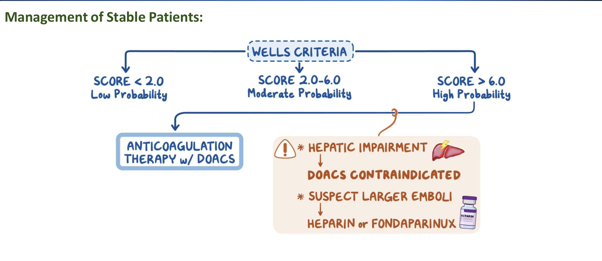


⭐⭐ **Anticoagulation regimens (Slide 24):**
| Approach | Regimen |
|---|---|
| **Standard** | **LMWH or UFH ≥ 5 days** + **simultaneously VKA (warfarin), INR 2–3**, continued **≥ 3 months** |
| **New, option 1** | **LMWH or UFH ≥ 5 days** → then **dabigatran ≥ 3 months** |
| **New, option 2** | **Rivaroxaban or apixaban ≥ 3 months** (no heparin lead-in needed) |

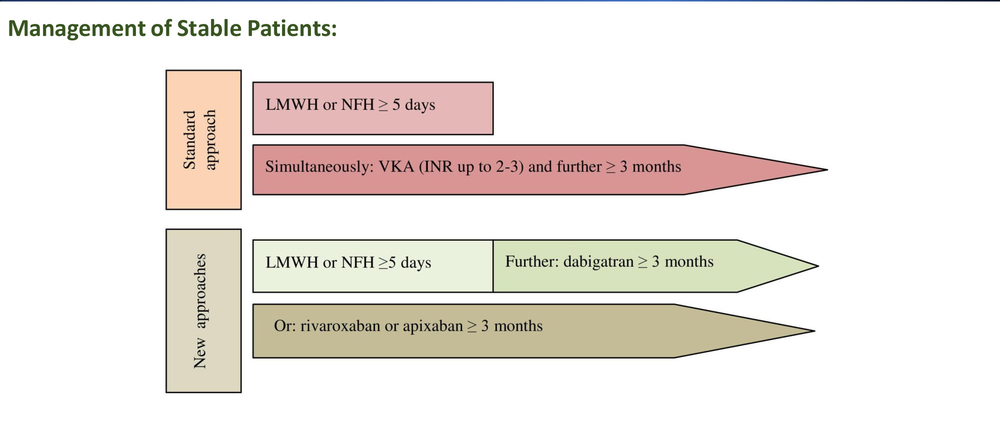


*Key rule:* **minimum treatment duration = 3 months**. Warfarin needs heparin overlap (≥5 days, until INR 2–3). **Dabigatran needs a heparin lead-in**. **Rivaroxaban/apixaban can be started alone.**

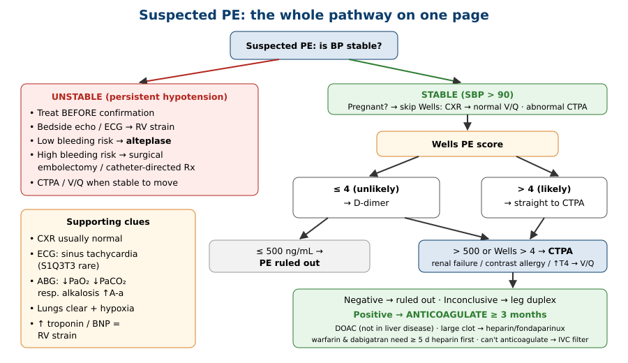


> 🔁 **Recap: Stable PE.** Low PTP → PERC/D-dimer. Intermediate → D-dimer. High → image. Treat with a DOAC (not with liver disease; heparin/fondaparinux for large clots). Warfarin needs ≥5 d heparin overlap to INR 2–3. Dabigatran needs a heparin lead-in; riva/apixaban are standalone. All for ≥3 months.
> 🔗 **Link:** PE is the complication. DVT is the source. The lecture now looks at the leg clot itself: how to recognize it, score it, and when anticoagulation isn't possible.
> ▶️ **Up next: Deep vein thrombosis.**

---

### 2.10 Deep Vein Thrombosis (Slides 25–26)
**Clinical features:**
- **Pain, swelling, or erythema** of the affected limb
- **Palpable cord**
- **Low-grade fever**
- **Tender calf muscle** (calf pain on dorsiflexion, the Homans sign, is in Case 1 *[name added]*)

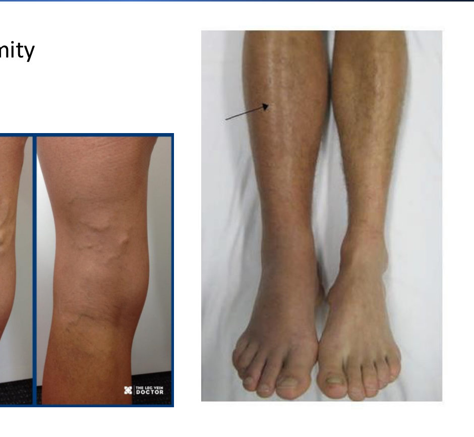


⭐⭐ **Wells criteria for DVT (Table 10.6):**
| Finding | Points |
|---|---|
| Active cancer | 1 |
| Paralysis, paresis, or recent plaster immobilization of the leg | 1 |
| Bedridden ≥ 3 days, or major surgery within 12 weeks (general/regional anesthesia) | 1 |
| Localized tenderness along the deep venous system | 1 |
| Entire leg swollen | 1 |
| **Calf swelling > 3 cm** vs the other leg | 1 |
| Pitting edema confined to the symptomatic leg | 1 |
| Non-varicose collateral superficial veins | 1 |
| Previously documented DVT | 1 |
| ⭐ **Alternative diagnosis at least as likely as DVT** | ⭐ **−2** |
| **Interpretation** | **< 0 low · 1–2 moderate · ≥ 3 high** |

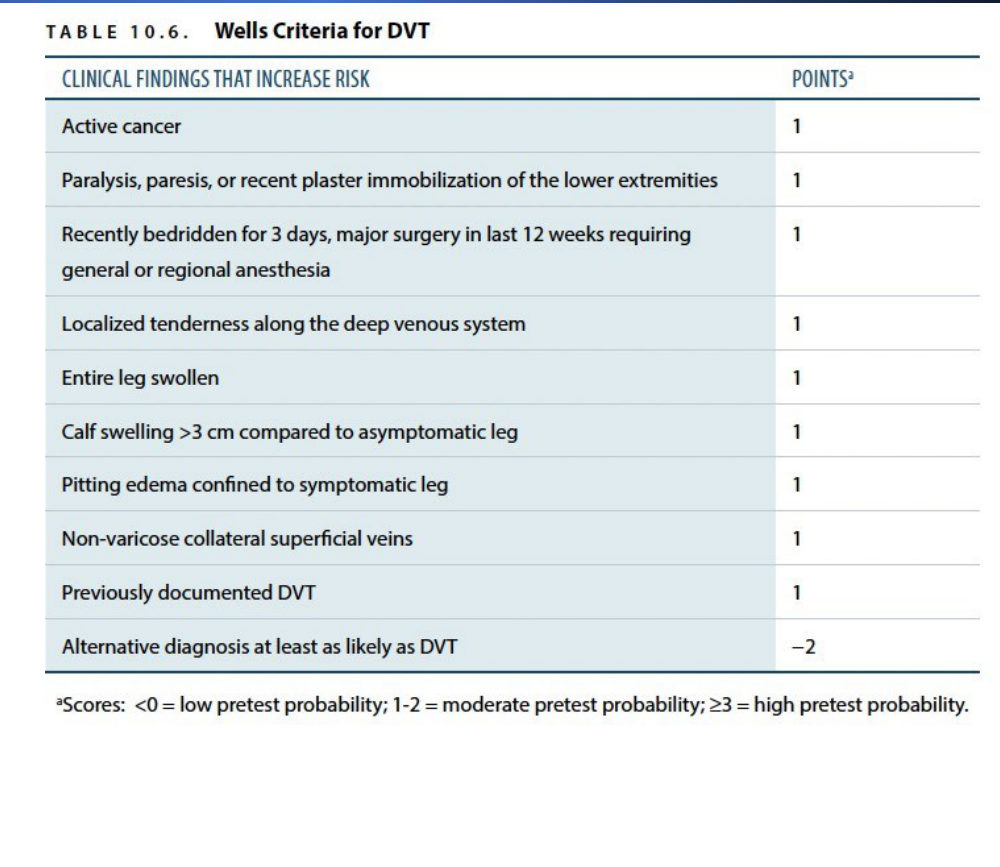


**Diagnostics (per slide):**
- ⭐ **DVT Wells > 1 → duplex ultrasonography**
- ⭐ **DVT Wells < 1 → D-dimer**

**Management:**
- **Similar to PE**
- ⭐ **Contraindication to anticoagulation → IVC filter**

> 🔁 **Recap: DVT.** Painful swollen leg, cord, calf tenderness. Wells DVT: nine +1 items and one −2 (alternative diagnosis). Wells >1 → duplex; <1 → D-dimer. Treat like PE; IVC filter if anticoagulation is contraindicated.
> 🔗 **Link:** Acute PE is a sudden pressure load on the right heart. When the pulmonary circulation is under chronically raised pressure (from recurrent emboli or other causes), the result is pulmonary hypertension, the second half of the lecture.
> ▶️ **Up next: Pulmonary hypertension.** Definition and etiologic groups.

---

### 2.11 Pulmonary Hypertension: Definition & Etiology (Slide 27)
⭐⭐ **PH = mean pulmonary arterial pressure (mPAP) > 20 mm Hg at rest.**

⭐ **Etiologic groups (WHO numbering added):**
| Group *[number added]* | Category (slide) | Examples (slide) |
|---|---|---|
| **1** | **Pulmonary arterial hypertension (PAH)** | **Idiopathic, hereditary**; **drug-induced** (**methamphetamine, sympathomimetic appetite suppressants**); associated: **connective tissue disease**, **congenital heart disease (Eisenmenger syndrome)** |
| **2** | **Left heart disease** | **CHF**; **valvular disease** (aortic stenosis, mitral stenosis) |
| **3** | **Chronic lung disease** | **Obstructive lung disease** (COPD), **obstructive sleep apnea**, **restrictive lung disease** |
| **4** | **Pulmonary artery obstruction** | ⭐ **Chronic thromboembolic (CTEPH)** |
| 5 *[added]* | Unclear/multifactorial | *Not on slide* (e.g., sarcoidosis, hematologic disorders) |

*Mnemonic [added]:* **"PAH – Left – Lung – Clot – Misc" → 1-2-3-4-5.**

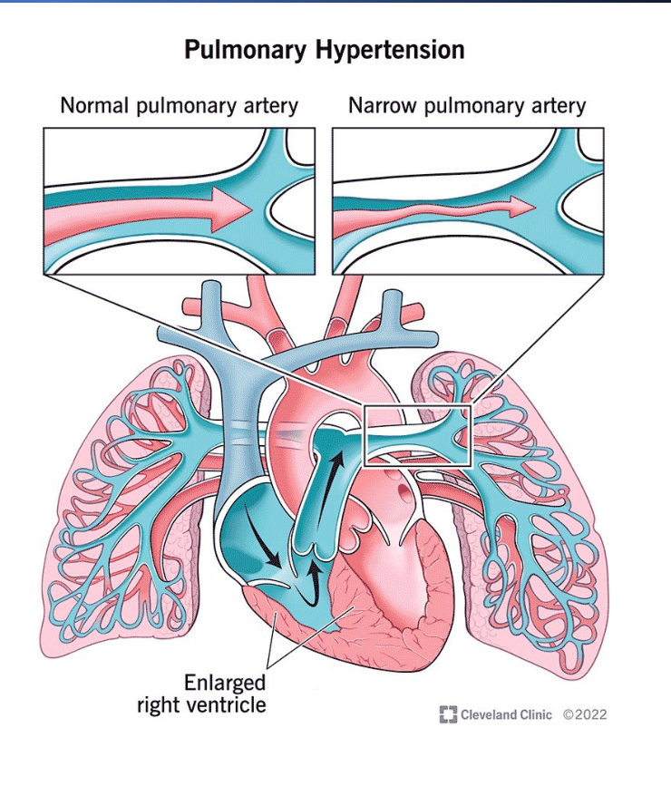

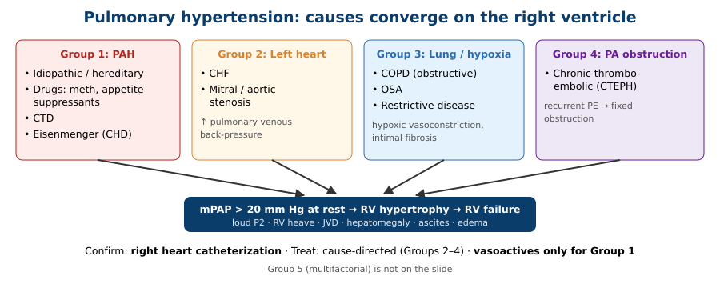


> 🔁 **Recap: PH definition.** mPAP >20 at rest. Group 1 PAH (idiopathic/hereditary/drugs/CTD/Eisenmenger), 2 left heart, 3 lung/hypoxia, 4 chronic thromboembolic.
> 🔗 **Link:** Different causes, but they all converge on the same end-point: raised pulmonary vascular resistance or flow → a pressure-loaded right ventricle.
> ▶️ **Up next: PH pathophysiology.**

---

### 2.12 Pulmonary Hypertension: Pathophysiology (Slide 28)
**A. ↑ Pulmonary vascular resistance**
- **Occlusive vasculopathy**
- ⭐ **Hypoxic pulmonary vasoconstriction**
- ⭐ **↑ Pulmonary vessel pressure → RV hypertrophy & failure** (cor pulmonale *[term added]*)
- **Inflammation** (e.g., COPD) → inflammatory cell infiltration of the intima → **intimal fibrosis**
- **↑ Pulmonary venous pressure**: volume/pressure overload from **left-sided heart disease**

**B. ↑ Pulmonary blood flow**
- ⭐ **Left-to-right shunt** (**ASD, VSD, PDA**)
- **Portopulmonary hypertension**

> 🔁 **Recap: Pathophysiology.** ↑ Resistance (vasculopathy, hypoxic vasoconstriction, intimal fibrosis, back-pressure from the left heart) or ↑ flow (L→R shunts, portopulmonary). Either way the RV hypertrophies and then fails.
> 🔗 **Link:** A failing, pressure-loaded right heart produces a recognizable exam: loud P2, RV heave, and signs of right-sided congestion.
> ▶️ **Up next: PH clinical features.**

---

### 2.13 Pulmonary Hypertension: Clinical Features (Slide 29)
- ⭐ **Dyspnea on exertion** (earliest/most common *[added]*)
- **Fatigue**
- **Exertional chest pain**
- ⭐ **Exertional syncope**
- **Clubbing, cyanosis**
- ⭐ **Loud P2** (pulmonic component of S2)
- ⭐ **RV heave** (sign of RV dilatation)
- ⭐ **Right-sided HF: JVD, hepatomegaly, ascites, peripheral edema**

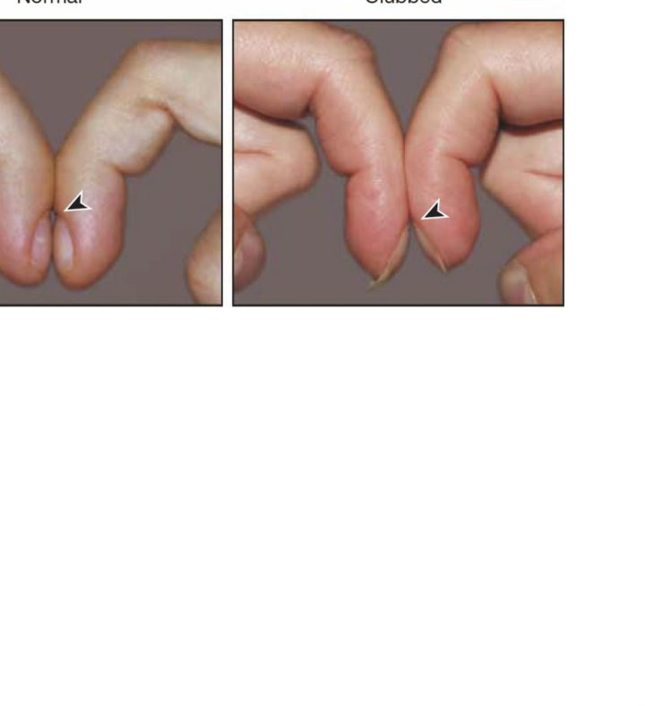


> 🔁 **Recap: PH features.** Exertional dyspnea, fatigue, chest pain, syncope. Loud P2 + RV heave. Right HF (JVD, hepatomegaly, ascites, edema).
> 🔗 **Link:** These signs raise suspicion. Confirmation needs a pressure measurement, and the lecture builds from ECG to CXR to echo to the only confirmatory test.
> ▶️ **Up next: PH diagnostics.**

---

### 2.14 Pulmonary Hypertension: Diagnostics (Slides 30–32)
| Test | Findings |
|---|---|
| **ECG** | Often **RV hypertrophy**; ⭐ **right axis deviation (+90° to +150°)**: **lead I negative, aVF positive** (Slide 30) |
| **CXR** | ⭐ **Enlarged pulmonary arteries**, with or without **clear lung fields** depending on the cause |
| **Echo** | ⭐ **Dilated pulmonary artery**; **RA/RV dilatation/hypertrophy**; **abnormal interventricular septal motion** (from ↑ RV volume) |
| ⭐⭐ **Right heart catheterization** | ⭐ **Required for confirmatory diagnosis** (measures mPAP) |

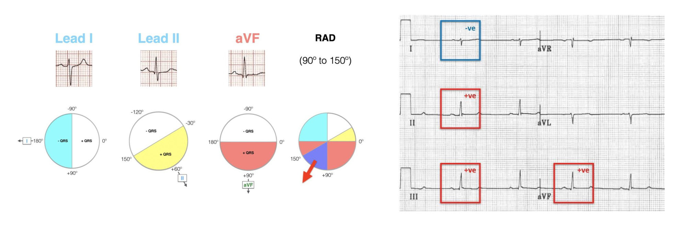

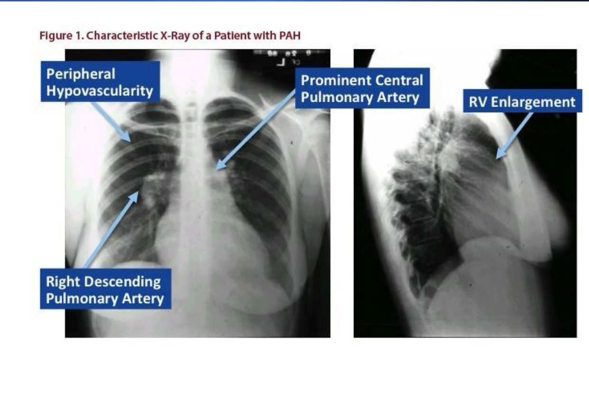

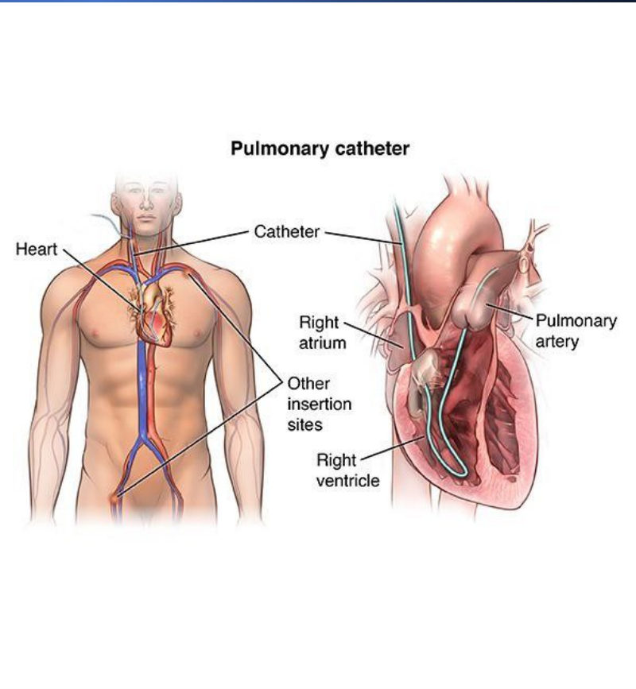


> 🔁 **Recap: PH diagnostics.** ECG: RVH/RAD. CXR: big pulmonary arteries. Echo: dilated PA, RA/RV, septal shift (screening). Right heart cath confirms.
> 🔗 **Link:** Treatment follows the classification: for most groups, treat the underlying disease. Only Group 1 gets PH-specific vasoactive drugs.
> ▶️ **Up next: PH management.**

---

### 2.15 Pulmonary Hypertension: Management (Slide 33)
**Supportive:**
- ⭐ **Oxygen** for **COPD with PaO₂ < 60 mm Hg**
- **Diuretics** for volume overload

**Cause-directed:**
- ⭐ If PH is **secondary** (e.g., **recurrent PE, HF**) → **treat and optimize the underlying disease**
- ⭐ **Vasoactive agents: typically used in PAH (Group 1)**

⭐⭐ **PAH vasoactive drugs (Slide 33 table):**
| Class | Drugs |
|---|---|
| **Calcium channel blockers** | e.g., **amlodipine** |
| **Endothelin receptor antagonists** | **Ambrisentan, bosentan, macitentan** |
| **PDE-5 inhibitors** (NO pathway) | **Sildenafil, tadalafil** |
| **Guanylate cyclase stimulators** (NO pathway) | **Riociguat** |
| **Prostacyclin analogues** | **Epoprostenol (IV)**, **iloprost (inhaled)**, **treprostinil (SC)** |

*Mnemonic [added]:* **"-sentan" = endothelin antagonist · "-afil" = PDE-5 · "-ciguat" = guanylate cyclase · "-prost" = prostacyclin.** *[added: CCBs help only the minority who respond to vasoreactivity testing.]*

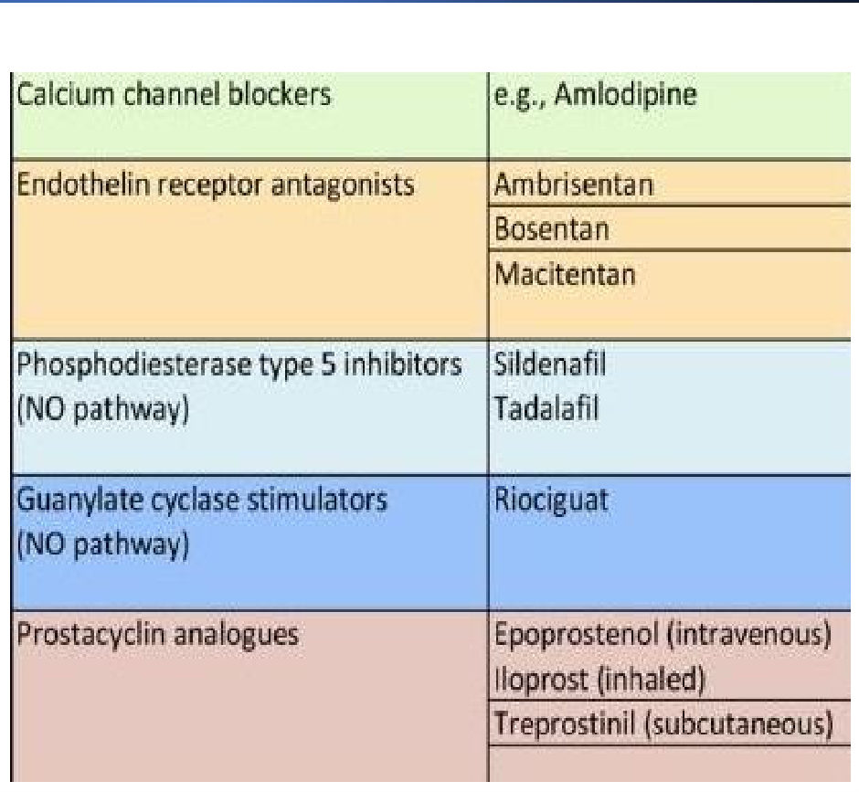

> 🔁 **Recap: PH management.** O₂ if COPD with PaO₂ <60, diuretics for overload, treat the cause (PE → anticoagulate; HF → optimize). Vasoactive drugs are reserved for Group 1 PAH.
> 🔗 **Link:** The lecture ends with a summary mnemonic (DEAD SUDDENLY, §2.4) and two cases, one for each half of the lecture: acute post-op PE and chronic recurrent PE leading to right heart failure.
> ▶️ **Up next:** Cases 1 & 2, answered in §7.

---

## 3. High-Yield Comparison Tables

### Table A: PE diagnostic modalities
| Test | Role | Key finding | Limitation |
|---|---|---|---|
| **CXR** | Initial, excludes alternatives; first test in pregnancy | Usually **normal**; Hampton hump / Westermark (rare) | Insensitive |
| **ECG** | Initial | **Sinus tachycardia** (most common); S1Q3T3 (rare); RAD | Nonspecific |
| **ABG** | Supportive | **↓ PaO₂, ↓ PaCO₂, resp. alkalosis, ↑ A-a gradient** | Nonspecific |
| **D-dimer** | **Rule OUT** in low/intermediate PTP | **≤ 500 ng/mL** excludes | High false positives (post-op, pregnancy, cancer *[added]*) |
| **CTPA** | ⭐ **Test of choice** | **Intraluminal filling defect**; sens > 90% | **Renal failure, contrast allergy, hyperthyroidism** |
| **V/Q scan** | When CTPA is contraindicated; pregnancy with normal CXR | **V/Q mismatch** | Less definitive with abnormal CXR |
| **Echo** | Unstable patients (bedside) | **↑ RV size, ↓ RV function** | Not diagnostic alone |
| **Leg duplex** | DVT confirmation; inconclusive CTPA; pregnancy | Non-compressible vein / clot | |
| **Troponin / BNP / lactate** | RV strain severity | ↑ | Prognostic |

### Table B: Wells PE vs Wells DVT
| | **Wells PE** | **Wells DVT** |
|---|---|---|
| Items | 7 | 10 |
| Highest points | **DVT signs (3), PE most likely (3)** | All 1 point |
| Negative item | None | **Alternative diagnosis as likely: −2** |
| Surgery window | **Previous 4 weeks** | **Previous 12 weeks** |
| Immobilization | ≥ 3 days | Bedridden ≥ 3 days / plaster cast |
| Cut-offs | **≤ 4 unlikely / > 4 likely** (also 3-tier: < 2 / 2–6 / > 6) | **< 0 low / 1–2 moderate / ≥ 3 high** |
| Next step | ≤ 4 → D-dimer; > 4 → CTPA | > 1 → duplex; < 1 → D-dimer |

### Table C: Stable vs unstable PE
| | **Stable** (SBP > 90) | **Unstable** (persistent hypotension / RV failure) |
|---|---|---|
| Diagnosis first? | Yes: PTP → D-dimer/CTPA | ⭐ **No: treat before confirmation**; bedside echo/ECG |
| Main therapy | **Anticoagulation** (DOAC / heparin → VKA) | ⭐ **Thrombolysis (alteplase)** |
| If lysis contraindicated | n/a | **Surgical embolectomy / catheter-directed therapy** |
| If anticoagulation contraindicated | **IVC filter** | IVC filter *[added]* |

### Table D: Anticoagulants
| Drug | Class | Heparin lead-in? | Notes |
|---|---|---|---|
| **UFH / LMWH** | Heparins | n/a | ≥ 5 days in standard/dabigatran regimens; preferred for large emboli |
| **Fondaparinux** | Factor Xa (indirect) | n/a | Alternative to heparin |
| **Warfarin (VKA)** | Vitamin K antagonist | ⭐ **Yes, overlap ≥ 5 d**, INR **2–3** | ≥ 3 months |
| **Dabigatran** | Direct thrombin inhibitor | ⭐ **Yes, ≥ 5 d** | ≥ 3 months |
| **Rivaroxaban / apixaban** | Direct Xa inhibitors | ⭐ **No** | ≥ 3 months |
| **DOACs (all)** | | | ⚠️ **Contraindicated in hepatic impairment** |

### Table E: Contraindications
| | Absolute | Relative |
|---|---|---|
| **All anticoagulation** | Hemorrhagic stroke; active internal bleeding; suspected aortic dissection | Recent internal bleeding (≤ 6 mo); prior hemorrhagic stroke; thrombocytopenia; CNS mass (RCC, melanoma) |
| **Thrombolysis (bleeding-risk screen)** | Bleeding disorders; uncontrolled HTN; recent major trauma or surgery → use embolectomy/catheter therapy | |
| **CTPA** | Significant renal insufficiency (AKI, severe CKD); prior anaphylaxis; hyperthyroidism → use V/Q | |

### Table F: PH groups *(see §2.11)*

### Table G: Acute PE vs chronic PH (right heart)
| | **Acute PE** | **Pulmonary hypertension** |
|---|---|---|
| Onset | **Sudden** | **Progressive/exertional** |
| RV | Acute dilatation/strain | **Hypertrophy → failure** |
| Key sign | Tachycardia, hypoxia, clear lungs | **Loud P2, RV heave, right HF** |
| ECG | Sinus tachycardia; S1Q3T3 | **RVH, RAD** |
| Confirm | **CTPA** | **Right heart catheterization** |
| Treat | Anticoagulate / lyse | Treat cause; O₂; diuretics; vasoactives (Group 1) |
| Link | Recurrent PE → **CTEPH (Group 4)** | |

---

## 4. Rules, Exceptions, Patterns
- **PE source = proximal leg DVT** (iliac, femoral, popliteal), which is above the knee.
- **Thrombus is the commonest embolus.** Exceptions: **fat, air, amniotic fluid** (FATAL).
- **CXR is usually normal in PE.** A normal CXR in a hypoxic dyspneic patient should raise suspicion *[added]*.
- **Most common ECG finding = sinus tachycardia**, not S1Q3T3.
- **D-dimer only rules OUT**, and only when PTP is low/intermediate. **Never use D-dimer in high PTP**; go straight to imaging.
- **CTPA is the test of choice.** Exceptions → **V/Q**: renal failure, contrast anaphylaxis, hyperthyroidism, pregnancy with a normal CXR.
- **Pregnancy: no Wells.** CXR first.
- **Unstable PE: treat first, confirm later.**
- **Thrombolysis** for hypotension or RV failure. Exception: high bleeding risk → **embolectomy/catheter therapy**.
- **Anticoagulate for ≥ 3 months.**
- **Warfarin and dabigatran need a heparin lead-in.** Rivaroxaban/apixaban don't.
- **DOACs are contraindicated in hepatic impairment.** For larger emboli, use heparin/fondaparinux.
- **Anticoagulation contraindicated → IVC filter.**
- **Hemorrhagic stroke**: current = absolute, prior = relative (per slide).
- **PH = mPAP > 20 mm Hg at rest.** **Right heart cath confirms.** Echo only suggests.
- **Vasoactive drugs are for Group 1 PAH only.** Other groups: treat the underlying cause.
- **O₂ in PH** only when **COPD with PaO₂ < 60 mm Hg**.

---

## 5. Clinical Correlations
- **Post-op orthopedic patient** (hip/knee replacement, pelvic surgery) with sudden dyspnea → PE until proven otherwise (Case 1).
- **Cancer patient with recurrent PE** → **CTEPH (Group 4)** → **cor pulmonale**. Right HF with congestive hepatopathy (icterus, ascites) can mimic liver disease (Case 2).
- **Nephrotic syndrome** → loss of antithrombin III → VTE (renal vein thrombosis classic) *[mechanism added]*.
- **Young woman on OCPs + long-haul flight** → stasis + hypercoagulability → DVT/PE.
- **Eisenmenger syndrome**: an untreated L→R shunt (ASD/VSD/PDA) → PH → shunt reversal (R→L) → cyanosis and clubbing *[mechanism added]*.
- **COPD** → hypoxic vasoconstriction + intimal fibrosis → Group 3 PH → give O₂ if PaO₂ < 60.
- **Methamphetamine / appetite suppressants** → drug-induced PAH (Group 1).
- **CNS metastases from RCC/melanoma** bleed readily, so they are a relative contraindication to anticoagulation.
- **Fat embolism** after long-bone fracture; **amniotic fluid embolism** during/after delivery; **air embolism** from central lines *[contexts added]*.

---

## 6. Rapid Revision (Last-Day)
- PE = embolus from elsewhere blocking the pulmonary artery. **FATAL**: Fat, Air, Thrombus, Amniotic fluid.
- Source: **iliac, femoral, popliteal** (above knee). DVT causes **95%** of PE.
- Virchow: **stasis, vessel injury, hypercoagulability**.
- Risk: age **> 60**, cancer, prior VTE, **FVL / protein C & S / ATIII deficiency**, immobility/travel, cardiac disease, obesity, nephrotic syndrome, **pelvic/orthopedic surgery**, trauma, pregnancy/OCPs.
- Mechanisms: infarction (pleuritic pain, hemoptysis, fever) · dead space (**↓ PaO₂, ↑ A-a, ↓ PaCO₂, resp. alkalosis**) · RV overload (tachycardia, shock).
- Massive PE: **syncope, JVD, Kussmaul sign, hypotension, obstructive shock**.
- **DEAD SUDDENLY** mnemonic.
- CXR usually **normal**. **Hampton hump / Westermark sign** are rare.
- CTPA: **sens > 90%**, **filling defect**. Contraindicated in **renal failure**.
- V/Q if: **anaphylaxis, AKI, severe CKD, hyperthyroidism**.
- ECG: **sinus tachycardia** (most common). **S1Q3T3** is rare.
- Wells PE: **DVT signs 3, PE most likely 3, HR >100 1.5, immobile/surgery 4 wk 1.5, prior VTE 1.5, hemoptysis 1, cancer 1**. **> 4 likely**.
- ≤4 → D-dimer (**≤ 500 ng/mL** rules out). >4 → CTPA.
- Pregnancy: **no Wells** → CXR → normal: **V/Q**; abnormal: **CTPA**.
- Unstable: treat **before** confirmation. **Alteplase**. High bleeding risk → **embolectomy / catheter therapy**.
- Anticoagulation CI (absolute): **hemorrhagic stroke, active bleeding, aortic dissection**.
- Stable: **DOAC** (not with liver disease). Large clot → **heparin/fondaparinux**.
- Standard: **LMWH/UFH ≥ 5 d + warfarin (INR 2–3)**. Dabigatran after heparin. Riva/apixaban alone. **≥ 3 months**.
- DVT Wells: 1 point each, **−2 for alternative diagnosis**. **> 1 → duplex**; **< 1 → D-dimer**. Anticoagulation CI → **IVC filter**.
- PH: **mPAP > 20 mm Hg at rest**. Groups: **PAH / left heart / lung / CTEPH**.
- PH signs: **exertional dyspnea/syncope, loud P2, RV heave, right HF**.
- PH tests: ECG **RVH/RAD** · CXR **enlarged PAs** · echo **dilated PA/RV, septal shift** · ⭐ **RHC confirms**.
- PH Rx: **O₂ (COPD, PaO₂ < 60)**, diuretics, **treat cause**, **vasoactives for Group 1**.

---

## 7. Exam-Style Questions

**Q1 (MCQ, lecture Case 1, Slide 35).** 68 ♂, **2 days after left total hip replacement**, sudden dyspnea and chest pain. T 37.8 °C, **HR 110, RR 30, BP 106/70**, **SpO₂ 89%**, **lungs clear**, **swollen right leg with calf pain on dorsiflexion**. Hct 30%, **creatinine 1.2 mg/dL**. ABG: **pH 7.48, pCO₂ 27, pO₂ 68, HCO₃ 23**. ECG: sinus tachycardia, **right axis deviation**. O₂ and IV fluids started. *In addition to IV anticoagulation*, next step?
a) Compression US b) Alteplase **c) Spiral CT angiography** d) D-dimer e) CXR f) Echo g) V/Q scan

**Answer: c.** *[reasoning added; the lecture doesn't give its key]*
- **Wells PE** = DVT signs **3** + PE most likely **3** + HR > 100 **1.5** + surgery < 4 wk **1.5** = **9 → PE likely → CTPA**.
- **Hemodynamically stable** (BP 106/70), so **no alteplase (b)**. Recent major surgery also raises bleeding risk.
- **Creatinine normal** → no contraindication to contrast, so **V/Q (g) isn't needed**.
- **D-dimer (d)** is useless in high PTP (and is elevated post-op anyway).
- ABG = **acute respiratory alkalosis with hypoxemia**, consistent with PE.
- Compression US (a) could show a DVT but does not assess the pulmonary circulation. With a PE-likely score and no contraindication, CTPA is the direct confirmatory test.

---

**Q2 (MCQ, lecture Case 2, Slide 36).** 67 ♀, ovarian cancer on paclitaxel, **2 PEs in the past year**, 3 months of progressive **leg swelling, exertional dyspnea, abdominal discomfort**, weight loss. HR 115, BP 135/85. **Conjunctival icterus, ascites (fluid wave, shifting dullness), 2+ pitting edema, JVD, clear lungs.** Most likely explanation?
a) Liver metastases b) Drug toxicity **c) Right ventricular failure** d) Cirrhosis e) Hepatic vein obstruction

**Answer: c.** Recurrent PE → **chronic thromboembolic PH (Group 4)** → **RV failure (cor pulmonale)**. The deciding sign is **JVD**: a raised systemic venous pressure is **not** explained by liver metastases, cirrhosis, or Budd-Chiari (e), all of which cause ascites **without JVD** *[reasoning added]*. Icterus and ascites come from **congestive hepatopathy**.

---

**Q3 (MCQ).** A 30-year-old woman at 24 weeks' gestation has acute pleuritic chest pain and tachycardia. CXR is normal. Next step?
a) Wells score b) D-dimer **c) V/Q scan** d) CTPA e) Right heart catheterization
**Answer: c.** In pregnancy, **don't use Wells**. **CXR first → normal → V/Q scan**. CTPA only if the CXR is abnormal. Lower-extremity Doppler showing DVT would also suffice.

---

**Q4 (MCQ).** A patient with confirmed PE is hypotensive (BP 78/50) with a dilated, hypokinetic RV on bedside echo. He had a **hemorrhagic stroke 2 months ago**. Best treatment?
a) Alteplase b) Rivaroxaban c) Warfarin alone **d) Surgical embolectomy / catheter-directed therapy** e) IVC filter alone
**Answer: d.** Unstable PE with RV failure needs reperfusion, but **hemorrhagic stroke = absolute contraindication** (high bleeding risk) → **embolectomy or catheter-directed therapy** (Slide 21 pathway).

---

**Q5 (Short answer).** State the definition of pulmonary hypertension, the confirmatory test, and which group receives vasoactive therapy.
**Answer:** **mPAP > 20 mm Hg at rest**. Confirmed by **right heart catheterization**. **Vasoactive agents are typically for Group 1 (PAH)**. Secondary PH is managed by treating the underlying disease (e.g., anticoagulation for recurrent PE, optimizing HF) plus supportive O₂ (COPD, PaO₂ < 60) and diuretics.

---

## 8. Exam Pitfalls & Traps
1. **S1Q3T3 is not the most common ECG finding in PE. Sinus tachycardia is.**
2. **A normal CXR does not exclude PE.** It is usually normal.
3. **Ordering D-dimer in high PTP.** Go straight to CTPA. D-dimer only rules out in low/intermediate PTP (and is falsely raised post-op and in pregnancy/cancer).
4. **CTPA in renal failure / contrast allergy / hyperthyroidism.** Use V/Q instead.
5. **Using Wells in pregnancy.** It is not validated.
6. **Waiting for CTPA in an unstable patient.** Treat first. Bedside echo shows RV strain.
7. **Thrombolysing a stable patient**, or one with a hemorrhagic stroke / active bleeding / aortic dissection.
8. **Starting warfarin (or dabigatran) without a heparin lead-in.** Rivaroxaban/apixaban are the only standalone options.
9. **Giving DOACs with hepatic impairment.**
10. **Stopping anticoagulation before 3 months.**
11. ⚠️ **Two Wells systems on the slides:** Slide 17/18 uses **≤ 4 vs > 4** (two-tier). Slide 22 uses **< 2 / 2–6 / > 6** (three-tier). Know both, and match the question's wording ("likely/unlikely" → two-tier; "low/moderate/high" → three-tier).
12. ⚠️ **Slide 18 labels "Wells > 4" as "(↓ Probability)".** That is a slide error. **> 4 = PE LIKELY / high probability.**
13. ⚠️ **Slide 23 says "rule-out criteria based on Wells score = 0".** The **PERC rule** is a separate 8-item tool *[added: age ≥50, HR ≥100, SpO₂ <95%, hemoptysis, estrogen use, prior VTE, unilateral leg swelling, surgery/trauma ≤4 wk]*. PERC is applied only when PTP is already low. If all 8 are absent, no D-dimer is needed.
14. ⚠️ **DVT Wells cut-offs overlap on the slide:** the table legend says **< 0 low / 1–2 moderate / ≥ 3 high**, while the text says **> 1 → duplex, < 1 → D-dimer**. A score of exactly 0 or 1 falls in a gap. Answer per the question's framing, and ask your instructor which cut-off is examinable.
15. **Hemorrhagic stroke appears in both columns** of the anticoagulation-contraindication table: **current/recent = absolute**, **prior = relative**.
16. **Echo does not confirm PH. Right heart catheterization does.**
17. **Giving vasoactive PAH drugs to Group 2/3 PH.** Treat the cause instead.
18. **Mistaking cor pulmonale for liver disease.** Ascites + icterus **plus JVD** = right heart failure (Case 2).
19. **PH threshold**: the current definition is **mPAP > 20 mm Hg**. Older textbooks use ≥ 25. Use the lecture's value.
