# Diffuse Parenchymal Lung Diseases (Restrictive Lung Disease): An Approach to a Case of Dyspnoea
**Dr. Essam Kotb, Associate Professor, Internal Medicine** | Source: `9-Restrictive_lung_disease_Updated.pdf` (35 slides) · Refs: Step-Up 5th ed.; Harrison 20th ed.; UpToDate; Osmosis; AMBOSS

> **Legend:** ⭐ = high-yield · *[added]* = not on slides. Images marked "Slide N" come from the lecture; "Added diagram" = drawn for these notes.

> 🔗 **Bridge from earlier respiratory lectures:** COPD and asthma were **obstructive** (FEV1/FVC < 70%). Here the pattern flips: **restrictive** = small, stiff lungs with a **normal or high FEV1/FVC** and **low volumes**. The **spirometry algorithm** shown in the COPD lecture is reused here, now taking the "FVC reduced → restriction" branch. Links back: **asbestos** (lung cancer, mesothelioma, pleural plaques), **silicosis → TB**, **sarcoidosis → hypercalcaemia** (compare squamous-cell PTHrP), and ILD → **Group 3 pulmonary hypertension** (Pulmonary Vascular lecture).

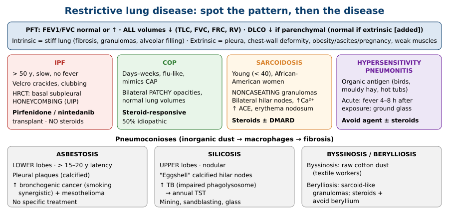

---

## 1. Title / Objectives
| Domain | Objective | Likely tested as |
|---|---|---|
| Knowledge | ⭐ Define restrictive disease; classify DPLDs (idiopathic, exposure-related, systemic) | Intrinsic vs extrinsic; DPLD tree |
| Knowledge | ⭐ Mechanisms: injury → fibroblasts → matrix → fibrosis; **particle phagocytosis** (pneumoconioses); **non-caseating granulomas** (sarcoidosis) | Pathogenesis |
| Knowledge | ⭐ Signs, extrapulmonary features, complications (pulmonary HTN, ↑ cancer and infection) | Velcro crackles; sarcoid organs; silica → TB; asbestos → cancer |
| Knowledge | ⭐ PFT, imaging and treatment findings | Restrictive PFT + ↓ DLCO; honeycombing; antifibrotics |
| Skills | Differentiate intrinsic vs extrinsic restriction; plan diagnosis and treatment (sarcoid, drug-induced) | Case vignettes |
| Values | Professionalism with complex respiratory patients | |

**Flow:** Overview (restrictive disease, intrinsic vs extrinsic) → DPLDs (definition, pathophysiology, features, CXR/CT/PFT, classification) → IPF → COP → AIP/NSIP → Radiation pneumonitis → Treatment (IPF vs non-IPF) → Sarcoidosis → Hypersensitivity pneumonitis → Pneumoconioses (asbestosis, silicosis, byssinosis) → Cases.

---

## 2. Main Content (Lecture Order)

### 2.1 Overview: Restrictive Lung Disease (Slides 5–6)
⭐ **Restrictive** = **inhalation fills the lungs less than normal** → **↓ lung volumes**. Two families:
- ⭐ **Diffuse parenchymal (interstitial) lung disease**: lung tissue damaged → **fibrotic, rigid lung** with **↓ compliance, ↑ recoil**
- ⭐ **Extrapulmonary**: lung normal, but expansion is limited

| ⭐ **Intrinsic** (parenchymal) | ⭐ **Extrinsic** (extrapulmonary mechanics) |
|---|---|
| ILD / DPLD · **sarcoidosis** · **pneumoconioses** · **ARDS** · **IPF** · **hypersensitivity pneumonitis** (extrinsic allergic alveolitis) · **granulomatosis with polyangiitis** · **radiation** lung injury · **drug-induced** ILD · **alveolar filling** (pneumonia, oedema, haemorrhage) | **Pleural disease** (chronic effusion, pneumothorax) · **thoracic deformity / mechanical limitation** (kyphoscoliosis, ankylosing spondylitis, pregnancy, ascites) · **respiratory-muscle weakness** (phrenic palsy, myasthenia gravis) |

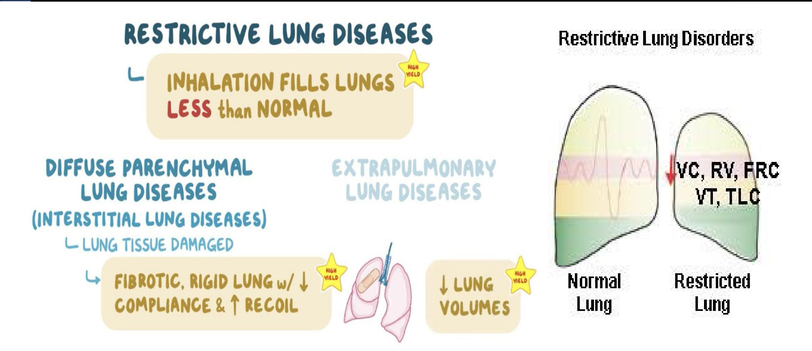

---

### 2.2 Diffuse Parenchymal Lung Diseases: Definition & Mechanism (Slides 7–8)
⭐ **DPLD** (formerly **interstitial lung disease, ILD**): a **diverse group of rare, highly morbid** disorders with a **progressive inflammatory process** that leads to **widespread scarring (fibrosis)**.

⭐ **Shared pathophysiology:** **repeated tissue injury** in the parenchyma + **aberrant wound healing** → **collagenous fibrosis** → **remodelling of the interstitium**. *Sequence on the figure: alveolar injury → inflammatory cells → fibroblast proliferation → extracellular matrix deposition.*

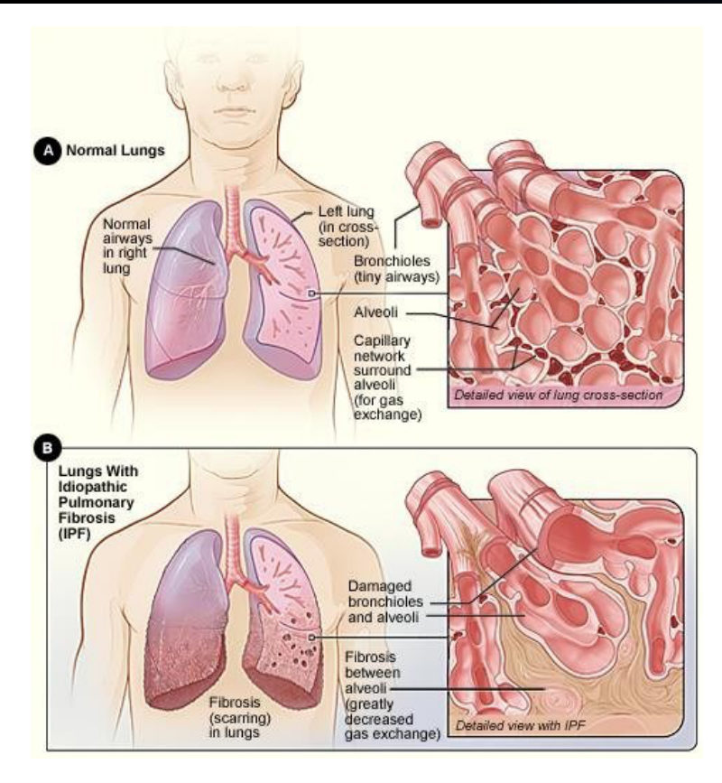

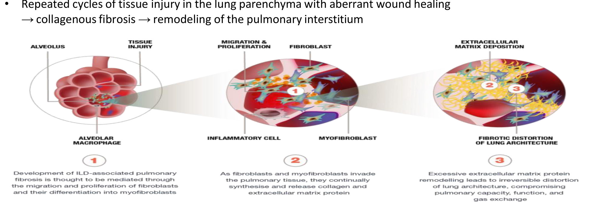

### 2.3 Clinical Features (Slide 9)
- ⭐ **Progressive dyspnoea** (exertion first, then at rest)
- ⭐ **Persistent dry cough**
- ⭐ **Bibasilar inspiratory "Velcro" (fine) crackles**
- **Fatigue**; ⭐ **clubbing**
- **Fever** (in **hypersensitivity pneumonitis and sarcoidosis**)
- Clues to **connective tissue disease, sarcoidosis, vasculitis**
- **Advanced:** clubbing (chronic hypoxia), **cyanosis**, loud inspiratory wheeze
- *Figure:* complication = **pulmonary arterial hypertension**

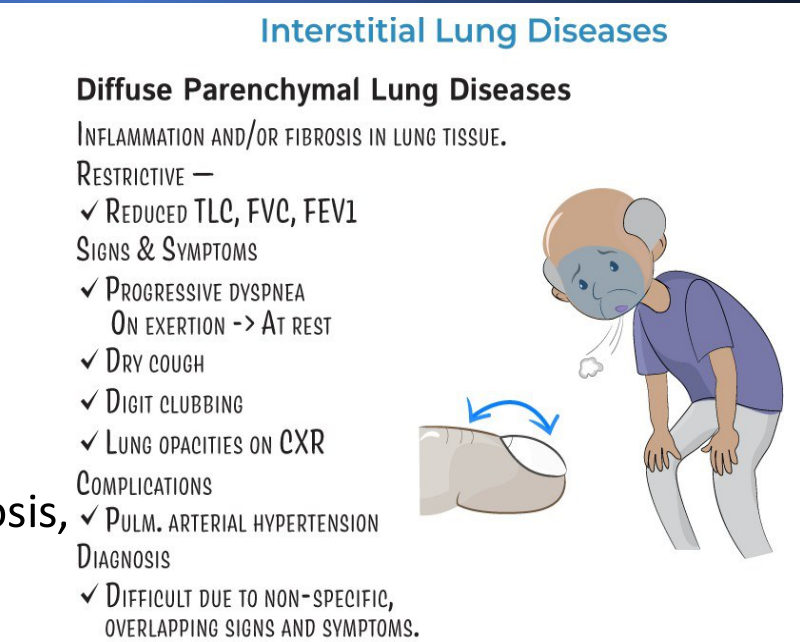

### 2.4 Diagnostics (Slides 10–12)
| Test | ⭐ Findings |
|---|---|
| **CXR** | **Diffuse opacification**: **reticular, reticulonodular, ground glass, honeycombing** |
| ⭐ **Chest CT (HRCT)** | Reticulation, ground glass, ⭐ **honeycombing** |
| ⭐⭐ **PFTs** | ⭐ **Restrictive pattern: FEV1/FVC normal or ↑** · ⭐ **↓ ALL lung volumes** · ⭐ **↓ DLCO** |

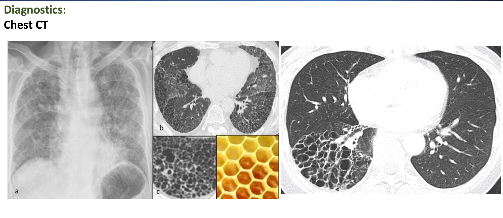 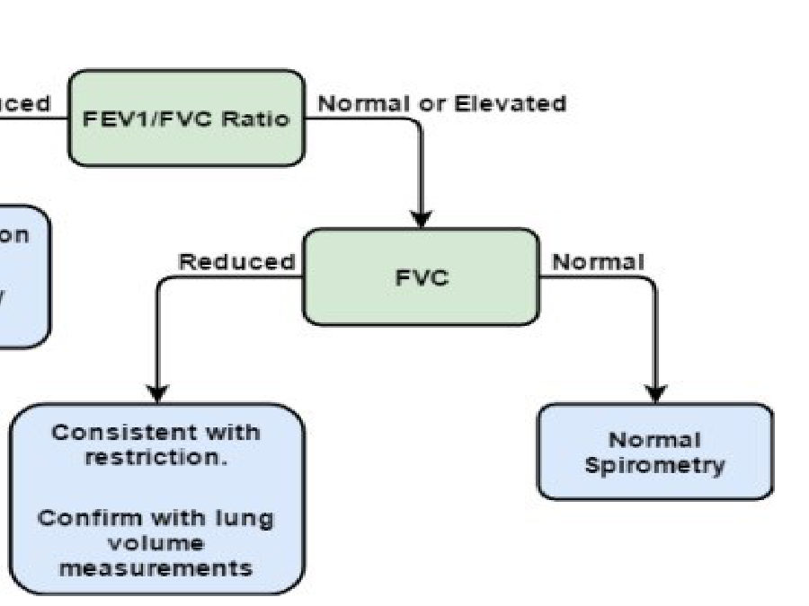

*[added: DLCO separates intrinsic (↓) from extrinsic restriction (usually normal), since the gas-exchange membrane is healthy in chest-wall or muscle disease.]*

### 2.5 Classification (Slide 13)
⭐ **DPLD** →
1. **Known cause**: **medications, autoimmune** (connective tissue disease)
2. ⭐ **Idiopathic interstitial pneumonias**: ⭐ **IPF**, desquamative interstitial pneumonia (**DIP**), respiratory-bronchiolitis ILD (**RB-ILD**), acute interstitial pneumonia (**AIP**), cryptogenic organising pneumonia (**COP**), non-specific interstitial pneumonia (**NSIP**), lymphocytic interstitial pneumonia (**LIP**)
3. ⭐ **Granulomatous**: e.g., **sarcoidosis**
4. **Other**: e.g., **LAM**, **histiocytosis X**, **eosinophilic**

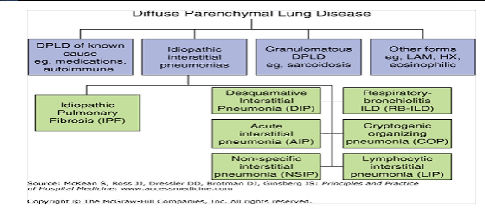

> 🔁 **Recap: DPLD basics.** Restrictive = low volumes, normal/high FEV1/FVC, low DLCO (if parenchymal). Intrinsic (fibrosis, granulomas, alveolar filling) vs extrinsic (pleura, chest wall, muscles). Injury + abnormal healing → fibrosis. Dyspnoea, dry cough, Velcro crackles, clubbing. HRCT honeycombing.
> 🔗 **Link:** The most common and most important idiopathic type comes next.
> ▶️ **Up next: IPF and other idiopathic types.**

---

### 2.6 Idiopathic Pulmonary Fibrosis (Slide 14)
⭐ **The most common ILD**: **irreversible fibrosis**, impaired lung function.
| | Details |
|---|---|
| ⭐ **Who** | **Middle-aged or older (> 50 y)**; chronic dry cough, **slowly worsening dyspnoea over months** |
| Course | **Not acutely ill, no fever**; very slow progression |
| ⭐ **Exam** | **Bibasilar Velcro crackles**; restrictive PFT (**↓ FVC, TLC, FRC**), ⭐ **↓ DLCO** |
| ⭐ **Diagnosis** | CXR diffuse infiltrates (non-specific); ⭐ **biopsy: usual interstitial pneumonia (UIP)**; ⭐ **HRCT: bibasilar reticular patchiness + honeycombing + traction bronchiectasis in subpleural areas** |
| Prognosis | ⭐ **Poor despite immunosuppression**; **transplant improves survival and quality of life** |

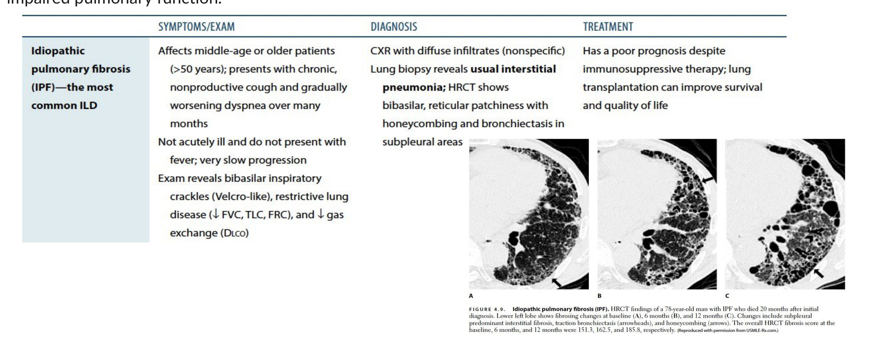

### 2.7 Cryptogenic Organising Pneumonia (Slide 15)
**Rare ILD**: inflammation of **bronchioles, alveolar ducts and alveolar walls**.
- ⭐ **Acutely ill over days to weeks**; ⭐ **mimics community-acquired pneumonia** (flu-like: fever, fatigue, dry cough); exertional dyspnoea, weight loss
- ⭐ **50% idiopathic**, 50% associated with toxic fumes, drugs, infection, connective tissue disease, immunodeficiency, radiation
- **CXR/CT:** ⭐ **bilateral patchy opacities with normal lung volumes**
- Biopsy shows organising pneumonia (not diagnostic on its own)
- ⭐ **Responds to corticosteroids**

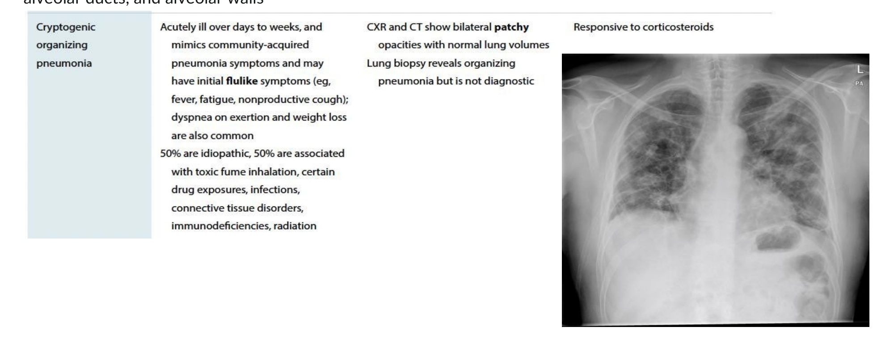

### 2.8 Other Idiopathic Types (Slide 16)
- ⭐ **Acute interstitial pneumonia (AIP, Hamman–Rich syndrome)**: **severe, acute**, can progress rapidly to **respiratory failure**
- ⭐ **Non-specific interstitial pneumonia (NSIP)**: associated with **connective tissue disease (e.g., systemic sclerosis)**, **HIV**, **hypersensitivity pneumonitis**
- Distinguished **histologically**

### 2.9 Radiation Pneumonitis (Slide 17)
- Occurs in ⭐ **5–15%** of patients given thoracic radiotherapy
- ⭐ **Acute: 1–6 months** after; **chronic: 1–2 years** after
- **Alveolar thickening and fibrosis**
- Low-grade fever, cough, chest fullness, dyspnoea, pleuritic pain, haemoptysis
- ⭐ **CT is the best study**; ⭐ **corticosteroids are the treatment of choice**

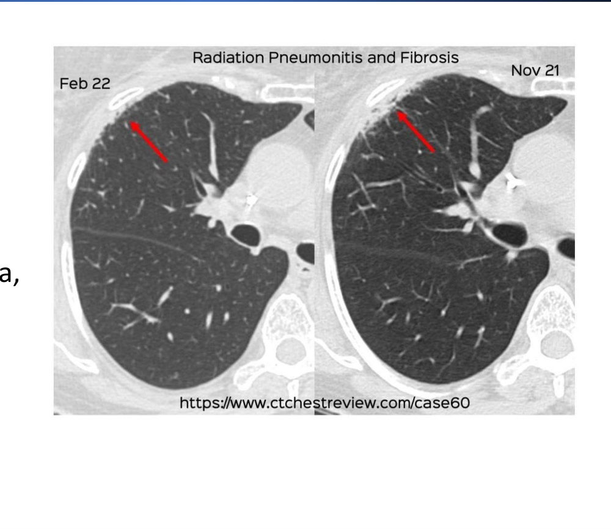

### 2.10 Treatment (Slide 18)
⭐⭐ **IPF:**
- **Antifibrotics** (may ↓ mortality and acute exacerbations; slow FVC decline):
  - ⭐ **Pirfenidone**: inhibits **TGF-β-stimulated collagen synthesis**
  - ⭐ **Nintedanib**: inhibits **tyrosine kinases** of fibrogenic growth factors
- ⭐ **Refer for lung transplant at diagnosis**
- ⚠️ ⭐ **Do NOT start immunosuppression in IPF**: it may **worsen outcomes**

**Non-IPF ILD:**
- **Treat the underlying condition**; antibiotics if bacterial interstitial pneumonia is suspected
- **Consider corticosteroids and/or immunomodulators**
- **Lung transplant**

> 🔁 **Recap: Idiopathic ILDs.** IPF (> 50 y, slow, no fever, UIP, basal subpleural honeycombing, poor prognosis) → pirfenidone/nintedanib + transplant referral, **no steroids**. COP (acute, mimics pneumonia, patchy opacities with normal volumes) → **steroids work**. AIP = rapid failure; NSIP = CTD/HIV. Radiation pneumonitis 1–6 months after radiotherapy → steroids.
> 🔗 **Link:** Granulomatous ILD behaves differently: young patients, many organs, often remits.
> ▶️ **Up next: Sarcoidosis.**

---

### 2.11 Sarcoidosis (Slides 19–23)
⭐⭐ **General characteristics:**
- ⭐ **Chronic systemic granulomatous disease** with ⭐ **non-caseating granulomas**, often **multi-organ**
- **Cause unknown**: genetic, environmental (e.g., **beryllium**), infections
- ⭐ Most often **African-American women**, **< 40 years**
- ⭐ **Good prognosis in most**: **~⅔ spontaneous remission**, **~⅓ chronic progressive**

⭐ **Presentation (Slides 20–21):**
| Area | Features |
|---|---|
| **General** | Often **asymptomatic** early; fever, malaise, anorexia, weight loss, ⭐ **lymphadenopathy** |
| **Pulmonary** | Dyspnoea, cough, chest pain, rales; ⭐ **bilateral hilar lymphadenopathy** |
| ⭐ **Hypercalcaemia** | **Granuloma macrophages make 1,25-(OH)₂ vitamin D (calcitriol)** |
| **Skin (~30%)** | ⭐ **Erythema nodosum** (commonest, non-specific) · ⭐ **lupus pernio** (**pathognomonic**: violaceous plaques on nose, cheeks, chin, ears) |
| **Joints / eyes** | **Polyarthralgia/arthritis** · ⭐ **anterior uveitis** |
| **Liver / spleen / heart** | Liver disease, splenomegaly, **cardiomyopathy** |
| ⭐ **Neurosarcoidosis** | ⭐ **Facial nerve palsy (uni/bilateral)**, **diabetes insipidus**, hypopituitarism, meningitis, neuropathy, myopathy |
| **Kidneys** | **Interstitial nephritis, nephrocalcinosis, nephrolithiasis** |

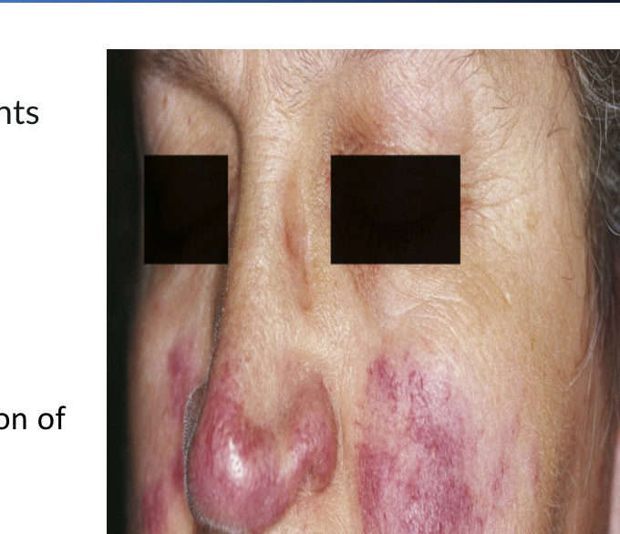 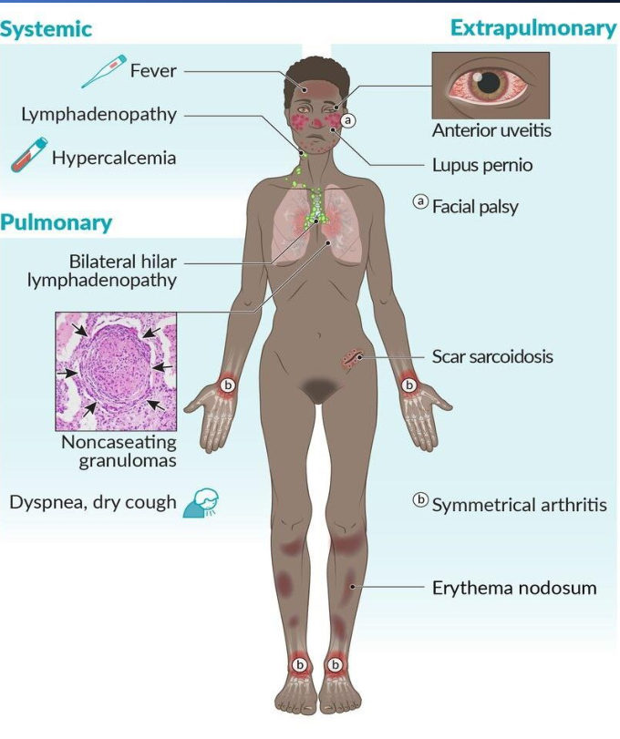

⭐⭐ **Diagnosis (Slide 22): a diagnosis of exclusion**
- ⭐ **Biopsy: non-caseating granulomas**
- **CXR, HRCT**
- **LFTs, ↑ calcium, BUN/creatinine**; **urinalysis (hypercalciuria)**
- ⭐ **↑ Angiotensin-converting enzyme (ACE)**
- **Eye exam**, **ECG** (cardiac sarcoid)
- **Spirometry**: usually **restrictive** (obstructive or mixed possible); ⭐ **↓ DLCO**

⭐⭐ **CXR staging (Table 4.16):**
| Stage | CXR | Spontaneous resolution |
|---|---|---|
| **0** | Normal | n/a |
| **1** | ⭐ **Bilateral hilar lymphadenopathy** | ⭐ **60–80%** |
| **2** | Hilar nodes **+ reticulonodular opacities** | **50–60%** |
| **3** | Reticulonodular opacities **without** nodes | **< 30%** |
| **4** | **Fibrosis** | n/a |

⭐ **Treatment:** **corticosteroids**; consider adding a **DMARD** *[added: e.g., methotrexate as a steroid-sparing agent]*

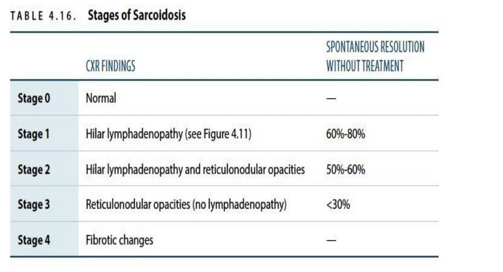 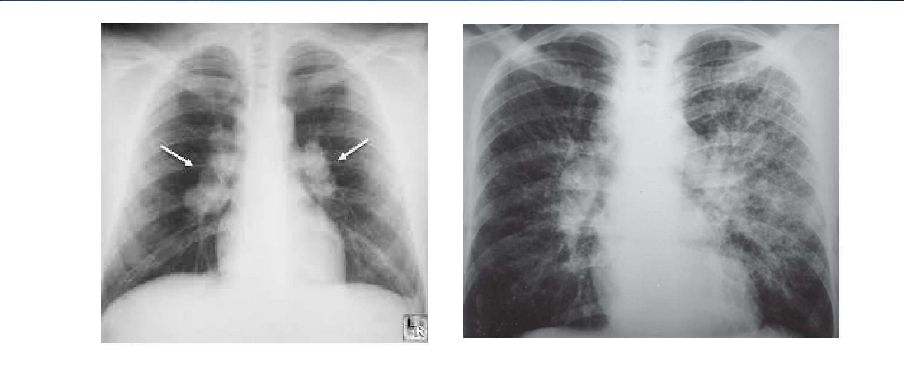

> 🔁 **Recap: Sarcoidosis.** Non-caseating granulomas; young African-American women. Bilateral hilar nodes, hypercalcaemia (calcitriol), ↑ ACE, erythema nodosum, lupus pernio, uveitis, facial palsy. Diagnosis of exclusion with biopsy. Staging 0–4 by CXR (stage 1 remits 60–80%). Steroids ± DMARD.
> 🔗 **Link:** Some ILDs are caused by what you breathe at work or home: organic antigens (hypersensitivity) and inorganic dust (pneumoconioses).
> ▶️ **Up next: Hypersensitivity pneumonitis.**

---

### 2.12 Hypersensitivity Pneumonitis (Slide 24)
⭐ **Allergic reaction to inhaled ORGANIC agents** (= extrinsic allergic alveolitis).
| Phase | Features |
|---|---|
| ⭐ **Acute** | **Fever, chills, cough, dyspnoea 4–8 hours after exposure**; inspiratory crackles; ⭐ **ground-glass opacities on CT** |
| **Chronic** | Gradual cough, dyspnoea, malaise, weight loss; **diffuse fibrosis** on biopsy |
| ⭐ **Treatment** | ⭐ **Avoid the agent** (mould, dust, **bird droppings**, aerosolised water/**hot tubs**, pesticides); **corticosteroids if acute and severe** |

⭐ **Causes ("Quick hit"):** **farmer's lung** (mouldy hay) · ⭐ **bird-breeder's lung** (avian droppings) · air-conditioner lung · **bagassosis** (mouldy sugar cane) · mushroom-worker's lung (compost)

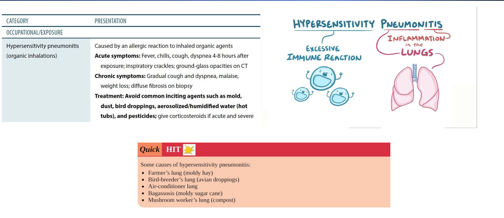

---

### 2.13 Pneumoconioses (Slides 25–30)
⭐ **Definition:** restrictive ILDs from **inhaled (mainly inorganic) dust**, often in **miners and agricultural workers**.
⭐ **Mechanism:** dust inhaled → **phagocytosis by alveolar macrophages** → **macrophage destruction + inflammation** → **scarring, granulomas**.

| Disease | Agent | Exposed workers |
|---|---|---|
| ⭐ **Asbestosis** | **Asbestos fibres** | Asbestos mining/milling, **brake linings, insulation**, ⭐ **shipbuilding**, firefighters, plumbers |
| ⭐ **Silicosis** | **Crystalline silica** | **Mining, quarries, pottery, sandblasting, glass manufacturing, construction** |
| **Byssinosis** | **Raw cotton** dust (less often flax, jute, hemp, sisal) | **Textile workers** |

⭐⭐ **Asbestosis (Slide 26):**
- **Diffuse interstitial fibrosis**, ⭐ **lower lobes**
- **Insidious**: ⭐ **> 15–20 years after exposure**
- ⭐ **↑ bronchogenic carcinoma (smoking is synergistic)** and ⭐ **malignant mesothelioma**
- Diagnosis: clinical + exposure history
- CXR: bilateral linear opacities; ⭐ **pleural plaques** (lower zones)
- **No specific treatment**
- *(Slide 29):* follow up for **bronchogenic adenocarcinoma** or **mesothelioma**, especially if **exposed > 30 years**; ⭐ **adenocarcinoma is the commonest lung cancer with asbestos**

⭐⭐ **Silicosis (Slide 27):**
- **Localised, nodular peribronchial fibrosis**, ⭐ **upper lobes**
- **Acute** (massive exposure → rapid death) or **chronic** (≥ 15 years)
- ⭐ **↑ risk of TB**: silica **impairs phagolysosome formation**, so **M. tuberculosis survives in macrophages** → ⭐ **annual tuberculin skin test** (Slide 30)
- Exertional dyspnoea; productive cough; restrictive PFT
- Treatment: **supportive + remove from exposure**
- *Quick hit:* ⭐ **asbestosis → pleural plaques**; ⭐ **silicosis → "eggshell" calcification** (of hilar nodes)

⭐ **Imaging summary (Slide 28):**
| Finding | Disease |
|---|---|
| **Bilateral hilar adenopathy** | **Sarcoidosis** |
| **Upper-lobe calcified nodules, eggshell calcification** | **Silicosis** |
| **Honeycomb parenchyma** | **IPF** |
| **Pleural effusions** | **Connective tissue disease** |
| **Linear pleural plaques** | **Asbestosis** |

**Treatment (Slides 29–30):** treat the cause; **avoid the occupational exposure**; ⭐ **quit smoking**. **Berylliosis** → **steroids + avoid beryllium**. Hypersensitivity pneumonitis → **remove the agent**, **steroids if severe**.

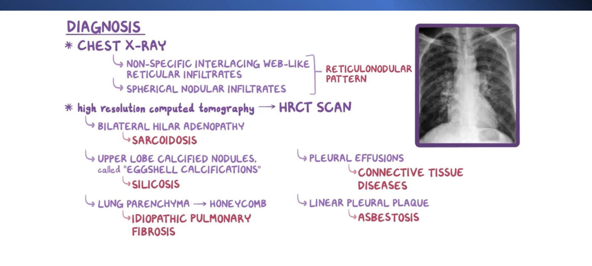

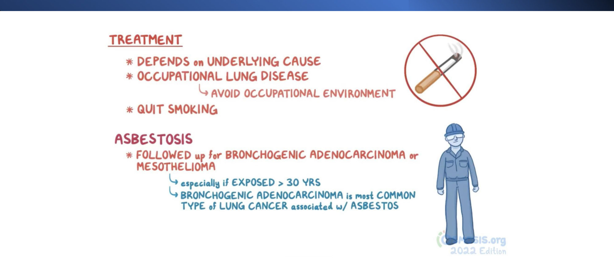 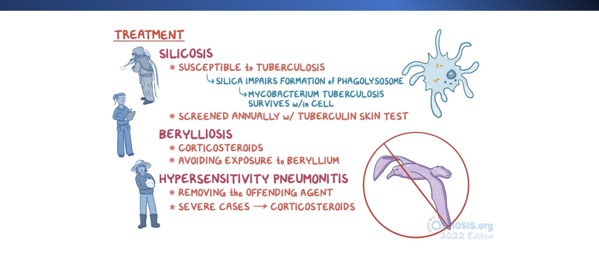

> 🔁 **Recap: Exposures.** Hypersensitivity pneumonitis = organic antigen (birds, mouldy hay) → fever 4–8 h later, ground glass → avoid ± steroids. Pneumoconiosis = inorganic dust → macrophages → fibrosis. Asbestosis: lower lobes, pleural plaques, cancer and mesothelioma. Silicosis: upper lobes, eggshell nodes, TB (yearly TST). Byssinosis: cotton.

---

## 3. High-Yield Comparison Tables

### Table A: Obstructive vs restrictive PFT *[obstructive column from the COPD/asthma lectures]*
| | Obstructive | **Restrictive** |
|---|---|---|
| FEV1/FVC | **↓ (< 70%)** | **Normal or ↑** |
| FVC | Normal or ↓ | **↓** |
| TLC, RV, FRC | **↑** (air trapping) | **↓** |
| DLCO | ↓ emphysema / normal asthma | **↓ intrinsic** / normal extrinsic |

### Table B: IPF vs COP vs sarcoidosis vs HP *(see the added diagram)*

### Table C: Upper vs lower lobe
| Upper lobe | Lower lobe |
|---|---|
| ⭐ **Silicosis**, coal *[added]*, **sarcoidosis** (reticular opacities in Case 2), HP (chronic) *[added]*, TB | ⭐ **Asbestosis**, **IPF** (basal subpleural) |
*Mnemonic [added]:* **"SCHoT on top"** (Silicosis, Coal, HP, TB); **"Asbestos sinks to the bases"**.

### Table D: Steroids: yes or no?
| Steroids help | Steroids NOT recommended |
|---|---|
| **COP**, **radiation pneumonitis**, **sarcoidosis**, **HP (severe acute)**, **berylliosis** | ⭐ **IPF** (immunosuppression worsens outcome) · asbestosis/silicosis (no specific therapy) |

### Table E: Sarcoid stages *(see §2.11)*

---

## 4. Rules, Exceptions, Patterns
- **Restriction = FEV1/FVC normal or high + all volumes low.**
- **Low DLCO = parenchymal; normal DLCO suggests extrinsic** *[added]*.
- **Velcro (fine, inspiratory, basal) crackles = fibrosis.**
- **IPF: older, slow, afebrile, basal subpleural honeycombing, UIP. Antifibrotics, not steroids.**
- **COP: acute, pneumonia-like, patchy, steroid-responsive.**
- **Sarcoidosis: non-caseating granulomas; caseating granulomas suggest TB** *[added]*.
- **Sarcoid hypercalcaemia comes from calcitriol made by macrophages.**
- **Lupus pernio is pathognomonic; erythema nodosum is the commonest skin sign.**
- **HP = organic; pneumoconiosis = inorganic.**
- **Asbestosis → lower lobes, pleural plaques, cancer (adenocarcinoma) and mesothelioma; smoking multiplies risk.**
- **Silicosis → upper lobes, eggshell calcification, TB (annual TST).**
- **Fever is a feature of HP and sarcoidosis, not IPF.**

---

## 5. Clinical Correlations
- **RA patient on methotrexate with dry cough, clubbing, basal crackles** → ILD (Case 1); consider **drug-induced** (methotrexate) vs **RA-ILD** *[added]*.
- **Young woman with bilateral hilar nodes, hypercalcaemia, erythema nodosum and ankle pain** → sarcoidosis (Löfgren syndrome *[added]*) (Case 2).
- **Bilateral facial palsy + polyuria** → neurosarcoidosis (DI).
- **Pigeon keeper with recurrent fevers after cleaning lofts** → bird-breeder's lung.
- **Retired shipyard worker with pleural plaques and new effusion** → mesothelioma until proven otherwise.
- **Sandblaster with weight loss and cavitation** → silicotuberculosis.
- **Breast cancer patient 3 months after radiotherapy with cough and dyspnoea** → radiation pneumonitis → CT, steroids.
- **Drugs causing ILD (pleurisy list in the Pleura lecture):** amiodarone, bleomycin, methotrexate, nitrofurantoin *[added]*.

---

## 6. Rapid Revision (Last-Day)
- Restrictive: ↓ volumes (TLC, VC, FRC, RV, VT); **FEV1/FVC normal or ↑**; **↓ DLCO** if parenchymal.
- **Intrinsic:** ILD, sarcoid, pneumoconioses, ARDS, IPF, HP, GPA, radiation, drugs, alveolar filling. **Extrinsic:** pleural disease, kyphoscoliosis, ankylosing spondylitis, pregnancy, ascites, phrenic palsy, myasthenia.
- DPLD = progressive inflammation → fibrosis; repeated injury + aberrant healing → collagen → remodelling.
- Features: progressive dyspnoea, dry cough, **Velcro crackles**, fatigue, **clubbing**, fever (HP/sarcoid); late cyanosis, PH.
- CXR: reticular, reticulonodular, ground glass, **honeycombing**.
- Classification: known cause · **idiopathic interstitial pneumonias (IPF, DIP, RB-ILD, AIP, COP, NSIP, LIP)** · granulomatous (sarcoid) · other (LAM, HX, eosinophilic).
- **IPF:** most common ILD; > 50 y; slow; no fever; **UIP**; **basal subpleural honeycombing + traction bronchiectasis**; poor prognosis; **pirfenidone (TGF-β), nintedanib (TKI)**, **transplant referral at diagnosis**, **no immunosuppression**.
- **COP:** days–weeks, mimics CAP, **patchy opacities, normal volumes**, 50% idiopathic, **steroids**.
- **AIP (Hamman–Rich):** rapid respiratory failure. **NSIP:** CTD (scleroderma), HIV, HP.
- **Radiation pneumonitis:** 5–15%; acute 1–6 months, chronic 1–2 years; **CT**; **steroids**.
- **Sarcoid:** non-caseating granulomas; AA women < 40; ⅔ remit; **bilateral hilar nodes**, **↑ Ca²⁺ (calcitriol)**, **↑ ACE**, **erythema nodosum**, **lupus pernio**, anterior uveitis, facial palsy, DI, nephrocalcinosis; diagnosis of exclusion + biopsy; stages 0–4 (stage 1 remits 60–80%); **steroids ± DMARD**.
- **HP:** organic antigens; acute fever **4–8 h** after; ground glass; farmer's, bird-breeder's, air-conditioner, bagassosis, mushroom; **avoid ± steroids**.
- **Pneumoconiosis:** dust → macrophages → fibrosis. **Asbestosis** (lower lobes, > 15–20 y, plaques, cancer + mesothelioma, adenocarcinoma commonest). **Silicosis** (upper lobes, nodular, **eggshell**, **TB → yearly TST**). **Byssinosis** (cotton). **Berylliosis** → steroids.

---

## 7. Exam-Style Questions

**Q1 (MCQ, lecture Case 1, Slide 31).** 55 ♀ with **rheumatoid arthritis on methotrexate**, ex-smoker; 8 months of **dry cough and exertional dyspnoea**; ⭐ **clubbing**, ⭐ **bibasilar inspiratory crackles**; HRCT shown (reticulation/honeycombing); ⭐ **↓ DLCO**. Diagnosis?
**f. Interstitial lung disease**
**Answer: f.** *[reasoning added; no key on the slide]* Dry cough + progressive dyspnoea + basal Velcro crackles + clubbing + low DLCO + fibrotic HRCT = **ILD** (RA-associated and/or methotrexate-induced). **Caplan syndrome** = RA + pneumoconiosis with **nodules**, and she has no dust exposure (receptionist). Emphysema doesn't cause basal crackles or clubbing; effusion and oedema don't fit the HRCT.

**Q2 (MCQ, lecture Case 2, Slide 32).** 35 ♀, 6 months of dry cough and exertional dyspnoea, **bilateral ankle pain**, **non-tender axillary lymphadenopathy**, ⭐ **Ca²⁺ 11.7**, CXR ⭐ **bilateral hilar enlargement + upper-zone reticular opacities**. Underlying mechanism?
**b. Granulomatous inflammation**
**Answer: b.** **Sarcoidosis** (stage 2): non-caseating granulomas; hypercalcaemia from granuloma calcitriol; arthralgia/ankle pain. Necrotising inflammation suggests TB or GPA; neoplastic transformation suggests lymphoma (possible differential, but hypercalcaemia + hilar nodes + young woman fits sarcoid better).

**Q3 (MCQ).** A 68-year-old man has slowly progressive dyspnoea, Velcro crackles and basal subpleural honeycombing on HRCT. Which treatment is **inappropriate**?
a) Nintedanib b) Pirfenidone c) Transplant referral **d) High-dose prednisone + azathioprine**
**Answer: d.** Immunosuppression worsens outcomes in IPF.

**Q4 (MCQ).** A sandblaster should be screened annually for which condition?
a) Mesothelioma **b) Tuberculosis** c) Sarcoidosis d) Byssinosis
**Answer: b.** Silica impairs phagolysosome formation → TB (yearly TST).

**Q5 (Short answer).** Give three differences between asbestosis and silicosis.
**Answer:** **Lobe**: asbestosis **lower**, silicosis **upper**. **Imaging**: asbestosis **pleural plaques**, silicosis **eggshell hilar calcification**/nodules. **Complication**: asbestosis → **bronchogenic carcinoma + mesothelioma**; silicosis → **TB**. (Exposure: shipbuilding/insulation vs mining/sandblasting/glass.)

---

## 8. Exam Pitfalls & Traps
1. **Restrictive FEV1/FVC is low.** No: **normal or ↑** (both FEV1 and FVC fall).
2. **Steroids for IPF.** Contraindicated; use **antifibrotics** and refer for transplant.
3. **IPF has fever.** No; fever points to **HP or sarcoid** (or COP).
4. **Sarcoid granulomas are caseating.** They're **non-caseating**.
5. **Sarcoid hypercalcaemia is from PTHrP.** No: **calcitriol** from granuloma macrophages (PTHrP = squamous cell lung cancer).
6. **HP vs pneumoconiosis:** **organic** antigens vs **inorganic** dust.
7. **Upper vs lower:** asbestosis lower; silicosis upper.
8. **Asbestos → squamous cancer.** The lecture says **adenocarcinoma** is the commonest; plus mesothelioma.
9. **COP = infection; give antibiotics only.** It mimics pneumonia but is **steroid-responsive**.
10. **Caplan syndrome** = RA + **pneumoconiosis** with lung nodules, not ordinary RA-ILD.
11. ⚠️ **Lecture title vs file:** the file is called "Restrictive lung disease"; the slides are titled **Diffuse Parenchymal Lung Diseases**. Same content.
12. ⚠️ **"Misc. DPLDs"** is in the subtopics but only LAM/HX/eosinophilic are named on the classification slide.
