# Cell Membrane and Its Functions
**Dr. Hader I. Sakr, Associate Professor, Medical Physiology** | Source: `02_Cell_membrane_and_its_functions.pdf` (25 slides) · Refs: Guyton & Hall 13th ed.; Ganong 25th ed.

> **Legend:** ⭐ = high-yield · *[added]* = not on slides · 📝 = the lecturer's handwritten annotation on the slide (these signal emphasis). Images marked "Slide N" come from the lecture.

> 🔗 **Bridge from Lecture 01 (Intro to Physiology):** Lecture 01 showed that ICF (K⁺-rich) and ECF (Na⁺-rich) differ sharply, while osmolarity stays at 290 everywhere. This lecture explains **the barrier that keeps them different** (the cell membrane) and starts on **how substances cross it**.

---

## 1. Title / Objectives
| Objective | Likely tested as |
|---|---|
| ⭐ **Composition** of the cell membrane | Percentages (55/25/13/4/3); amphipathic phospholipid |
| ⭐ **Functions** of the membrane (proteins) | Integral vs peripheral; junction types |
| ⭐ **Methods of transport** | Classification tree; simple vs facilitated diffusion; diffusion formula |

**Flow:** Structure & composition → functions of membrane proteins → transport classification → simple diffusion (bilayer, channels) → facilitated diffusion → conclusion → case.

---

## 2. Main Content (Lecture Order)

### 2.1 Structure & Composition (Slides 4–7)
- Surrounds the cell completely; **very thin, elastic, semipermeable**
- ⭐ **Thickness 7.5–10 nm** (= **75–100 Å**; 1 Å = 10⁻¹⁰ m)

⭐⭐ **Composition:**
| Component | % |
|---|---|
| ⭐ **Proteins** | ⭐ **55%** |
| **Phospholipids** | **25%** |
| **Cholesterol** | **13%** |
| Other lipids | **4%** |
| **Carbohydrates** | **3%** |
*Mnemonic [added]:* **"55-25-13-4-3"** (proteins > phospholipids > cholesterol > other lipids > carbohydrates).

⭐ **Phospholipid = "clothespin" shape:**
| Part | Chemistry | Faces |
|---|---|---|
| **Head** | **Phosphate** radical: **water-soluble, hydrophilic, polar** | The aqueous ECF outside and the cytoplasm inside |
| **Two tails** | **Fatty acids**: **insoluble in water, hydrophobic, non-polar** | Each other, in the water-poor membrane interior |

⭐ So the molecule (and the membrane) is **amphipathic**: one part hydrophilic, the other hydrophobic.

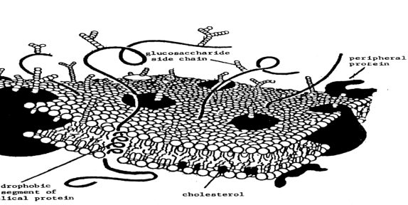

**Role of each component (Slide 7):**
1. **Lipid bilayer**: **flexibility** and **selective permeability**
2. ⭐ **Cholesterol**: affects **permeability** and gives **toughness**
3. **Proteins** float in the bilayer: **integral** and **peripheral** types
4. ⭐ **Carbohydrates** occur combined as **glycoproteins and glycolipids** (the glycocalyx *[term added]*). They act as:
   1. **Recognition sites**
   2. **Self-differentiation**
   3. **Immune responses**
   4. **Attaching cells together**

> 🔁 **Recap: Structure.** 7.5–10 nm, semipermeable. 55% protein, 25% phospholipid, 13% cholesterol, 4% other lipids, 3% carbohydrate. Amphipathic phospholipids form the bilayer (flexibility, selectivity). Cholesterol adds toughness. Carbohydrates handle recognition and immunity.
> 🔗 **Link:** Proteins are the largest share (55%) and do most of the membrane's work.
> ▶️ **Up next: Functions of membrane proteins.**

---

### 2.2 Functions of Cell Membrane Proteins (Slides 8–10)
| # | Function | Detail | 📝 Lecturer's grouping |
|---|---|---|---|
| 1 | **Structural** | Keep membrane **integrity and strength** | |
| 2 | **Passive channels** | | 📝 **Integral** |
| 3 | **Carriers in facilitated diffusion** | | 📝 **Integral** |
| 4 | **Carriers in active transport (pumps)** | | 📝 **Integral** |
| 5 | **Receptors** | | 📝 **Peripheral** |
| 6 | **Enzymes** | | 📝 **Peripheral** |
| 7 | ⭐ **Identity proteins** | Mostly 📝 **glycoproteins**; give the cell the individual's **identity label** so the **immune system doesn't attack** it | |
| 8 | ⭐ **Intercellular connections** | See below | 📝 "8 and 9: connection" |
| 9 | **Cell adhesion molecules (CAMs)** | Attach the cell to the **basal lamina** | 📝 connection |
| 10 | **Cytoskeleton** | Fibres that **maintain shape** and let the cell **change shape and move** | |

*[added caveat: receptors are often integral (transmembrane) proteins in textbooks; the lecturer's handwriting groups them with peripheral, so follow the lecture for this exam.]*

⭐⭐ **Intercellular connections (Slide 10):**
| Purpose | Junctions |
|---|---|
| **Fasten cells to each other and to surrounding tissue** | 1. ⭐ **Tight junctions (zonula occludens)** · 2. **Desmosomes** · 3. **Zonula adherens** |
| **Transfer ions and molecules between cells** | ⭐ **Gap junctions** (connexons, ~3.5 nm gap on the figure) |

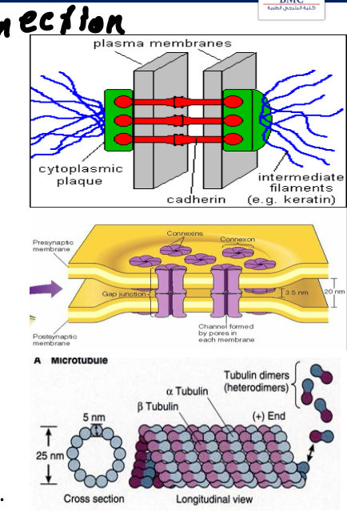

> 🔁 **Recap: Protein functions.** 10 functions. Channels and carriers/pumps are integral; receptors and enzymes are peripheral (per the lecturer). Identity glycoproteins protect against the immune system. Tight junctions, desmosomes and zonula adherens hold cells together; gap junctions let ions pass between them. CAMs bind to the basal lamina; the cytoskeleton gives shape and movement.
> 🔗 **Link:** Three of those protein functions (channels, facilitated carriers, pumps) are transport. The rest of the lecture classifies how substances cross.
> ▶️ **Up next: Methods of transport.**

---

### 2.3 Methods of Transport: Classification (Slides 11–12)
The ICF–ECF differences are vital to the cell; transport mechanisms maintain them. **Three ways:**

| **1. Diffusion** | **2. Active transport** | **3. Vesicular** |
|---|---|---|
| A. Simple · B. Facilitated · C. Osmosis | A. Primary · B. Secondary | A. Pinocytosis · B. Phagocytosis |
| 📝 **Small; passive, no energy, with the gradient** | 📝 **Small** | 📝 **Large (L)** |
| 📝 Simple = **no carrier needed** | | |

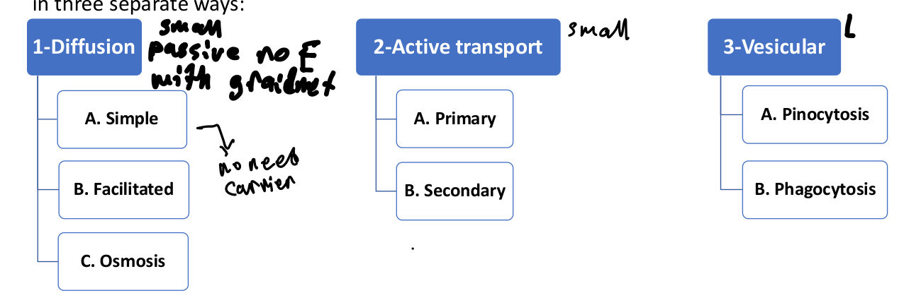

> 🔁 **Recap: Classification.** Diffusion (simple, facilitated, osmosis): passive, small molecules. Active (primary, secondary): small molecules against the gradient. Vesicular (pino-, phagocytosis): large molecules.
> 🔗 **Link:** The lecture starts with the simplest route, diffusion with no carrier at all.
> ▶️ **Up next: Simple diffusion.**

---

### 2.4 Simple Diffusion (Slides 13–17)
⭐ **Definition:** molecules/ions diffuse through the membrane **along the concentration gradient**, **passively**, **without binding to carrier proteins**.

⭐⭐⭐ **Rate of diffusion (Slide 13, starred by the lecturer):**

**Diffusion rate ∝ (Concentration difference × Surface area × Temperature) ÷ (Distance × √Molecular weight)**

📝 Numerator = **direct** relation; denominator = **inverse** relation.

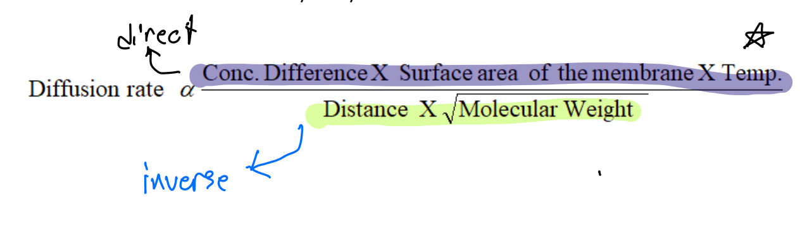

*[added: this is the basis of Fick's law of diffusion; e.g., thickened alveolar membranes (↑ distance) or lost lung surface (↓ area) reduce gas diffusion.]*

**Two routes:**

**1. Through the lipid bilayer**
| Substance | How |
|---|---|
| ⭐ **a) Lipid-soluble** (O₂, N₂) | Dissolve directly in the bilayer. ⭐ **Rate ∝ lipid solubility**. O₂ enters **"almost as though the membrane did not exist"** |
| ⭐ **b) Water** | Passes **directly through the bilayer** *and* through ⭐ **aquaporins**. Water is **insoluble** in lipid but molecules are **small** with high **kinetic energy**, so they **"penetrate like bullets"** |
| **c) Lipid-insoluble molecules** | Pass like water **if small and uncharged** |

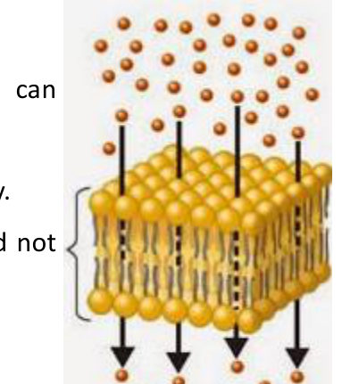 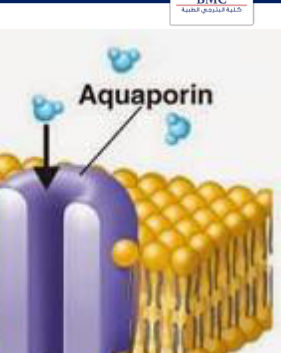

**2. Through protein channels (Slides 16–17)**
| Type | Behaviour |
|---|---|
| **I. Leak channels** | ⭐ **Always open (non-gated)** |
| **II. Gated channels** | Gate(s) on the inner, outer, or both surfaces; activity depends on gate opening/closing |

⭐⭐ **Gated channel types:**
| Gate | Opens/closes by | Example *[added]* |
|---|---|---|
| ⭐ **Voltage-gated** | Change in **transmembrane potential** | Na⁺ channels of the action potential |
| ⭐ **Mechanically gated** (stretch/pressure) | **Mechanosensitive**; important in **cell movement** | Touch receptors, hair cells |
| ⭐ **Ligand-gated** | **Ligand binds a receptor** (extracellular or intracellular) | Nicotinic ACh receptor |
| **Phosphorylation-gated** | Protein **phosphorylation / dephosphorylation** | |

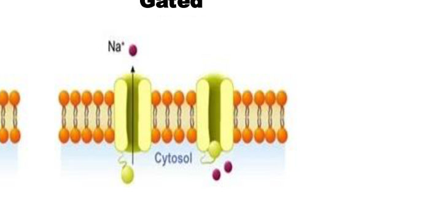 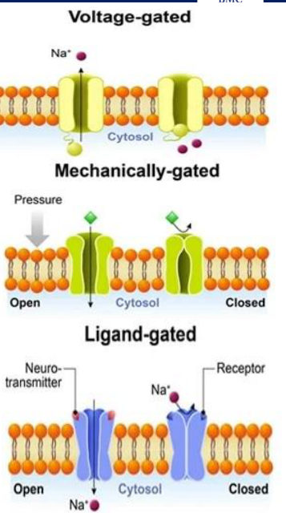

> 🔁 **Recap: Simple diffusion.** No carrier. Rate rises with ΔC, area and temperature, and falls with distance and √MW. Through the bilayer: lipid-soluble gases (∝ solubility), water (bilayer + aquaporins), small uncharged molecules. Through channels: leak (always open) or gated (voltage, mechanical, ligand, phosphorylation).
> 🔗 **Link:** Large polar molecules like glucose can't use either route, so they need a carrier.
> ▶️ **Up next: Facilitated diffusion.**

---

### 2.5 Facilitated (Carrier-Mediated) Diffusion (Slides 18–20)
**Mechanism:**
1. Carrier binds **large molecules** (e.g., ⭐ **glucose**)
2. Carrier has a channel open **part-way** through the membrane
3. Molecule enters and **binds a specific receptor** on the carrier
4. In a fraction of a second, a ⭐ **conformational change** opens the channel to the **opposite side**
5. Molecule is **released** on the other side

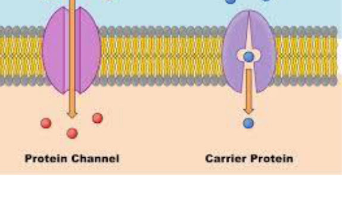 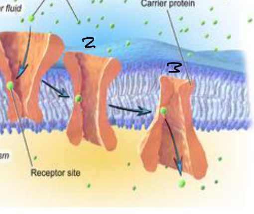

⭐⭐ **Properties:**
- ⭐ **Specificity** of each carrier
- ⭐ **Competition** between similar substances (**glucose vs galactose**) for one carrier
- ⭐ **Saturation**: rate rises with the gradient **up to a maximum (Vmax)**, limited by how fast the carrier can flip between its two states
- ⭐ **More temperature-sensitive than simple diffusion** (starred by the lecturer)

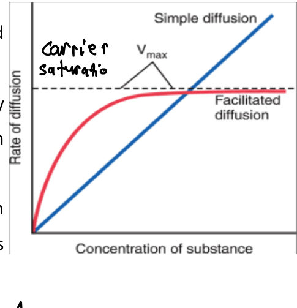

> 🔁 **Recap: Facilitated diffusion.** A carrier binds, changes shape and releases on the other side. It is specific, competitive and saturable (Vmax), and more temperature-sensitive than simple diffusion. It is still passive (down the gradient).
> 🔗 **Link:** Osmosis, active transport and vesicular transport continue in **Lecture 03**.
> ▶️ **Up next:** Conclusion and case.

---

### 2.6 Conclusion (Slide 22)
- The cell membrane is **amphipathic**
- Proteins **55%**, phospholipids **25%**, cholesterol **13%**, other lipids **4%**, carbohydrates **3%**
- Transport = **diffusion, active, or vesicular**
- Diffusion = **simple, facilitated, or osmosis**
- Simple diffusion = **directly through the membrane** or **through protein channels**

---

## 3. High-Yield Comparison Tables

### Table A: Simple vs facilitated diffusion
| | **Simple** | **Facilitated** |
|---|---|---|
| Carrier | ❌ None | ✅ Specific carrier |
| Energy | None | None |
| Direction | Down gradient | Down gradient |
| Rate vs concentration | ⭐ **Linear, no maximum** | ⭐ **Saturates (Vmax)** |
| Specificity / competition | No | ⭐ **Yes** (glucose vs galactose) |
| Temperature sensitivity | Less | ⭐ **More** |
| Examples | O₂, N₂, CO₂, water, small uncharged molecules, ions via channels | Glucose (GLUT) |

### Table B: Channel types *(see §2.4)*

### Table C: Integral vs peripheral (per lecturer)
| Integral | Peripheral |
|---|---|
| Channels, facilitated carriers, pumps | Receptors, enzymes |

### Table D: Junctions
| Junction | Function |
|---|---|
| Tight (zonula occludens) | Seal, fasten cells |
| Desmosome | Anchor cells (cadherin + keratin filaments on figure) |
| Zonula adherens | Fasten cells |
| **Gap junction** | **Communication**: ions/molecules pass cell to cell |
| CAMs | Cell to basal lamina |

---

## 4. Rules, Exceptions, Patterns
- **Proteins are the biggest component (55%)**, not lipids. Lipids together = 42%.
- **Amphipathic**: hydrophilic phosphate heads outward, hydrophobic fatty-acid tails inward.
- **Diffusion rate ∝ ΔC × area × T / (distance × √MW).**
- **Lipid-soluble gases cross freely** (rate ∝ lipid solubility).
- **Water is lipid-insoluble yet crosses the bilayer** (small, fast), plus aquaporins.
- **Charged ions need channels**; small **uncharged** molecules can use the bilayer.
- **Only facilitated diffusion saturates** among the passive processes.
- **Gap junctions are the only junction for communication**; the others fasten.

---

## 5. Clinical Correlations *[added; the lecture has none]*
- **Cystic fibrosis**: defective CFTR, a Cl⁻ channel (a membrane protein).
- **Diabetes and glucose uptake**: insulin increases GLUT4 carriers in muscle/fat (facilitated diffusion).
- **Pulmonary fibrosis/oedema**: ↑ diffusion distance → ↓ O₂ transfer (diffusion equation).
- **Nephrogenic diabetes insipidus**: aquaporin-2 defects.
- **Myasthenia gravis**: antibodies against a ligand-gated channel (ACh receptor).
- **Tissue matching / transplant rejection**: identity glycoproteins.

---

## 6. Rapid Revision (Last-Day)
- Membrane **7.5–10 nm (75–100 Å)**, elastic, **semipermeable**.
- **Proteins 55 · phospholipids 25 · cholesterol 13 · other lipids 4 · carbohydrates 3.**
- Phospholipid = **clothespin**: polar phosphate head, 2 non-polar fatty-acid tails → **amphipathic**.
- Bilayer → flexibility + selectivity; **cholesterol → permeability + toughness**; carbs → recognition, self-differentiation, immunity, adhesion.
- 10 protein functions; channels/carriers/pumps = **integral**, receptors/enzymes = **peripheral** (lecturer); identity = **glycoprotein**.
- Junctions: **tight, desmosome, zonula adherens** fasten; **gap** transfers. CAMs → basal lamina.
- Transport: **diffusion** (simple, facilitated, osmosis) · **active** (primary, secondary) · **vesicular** (pino-, phagocytosis).
- **Rate ∝ ΔC × area × T / (distance × √MW).**
- Bilayer: O₂/N₂ ∝ lipid solubility; **water like bullets + aquaporins**; small uncharged molecules.
- Channels: **leak (always open)** vs **gated** (voltage, mechanical, ligand, phosphorylation).
- Facilitated: glucose; **specific, competitive, saturable (Vmax), more temperature-sensitive**.

---

## 7. Exam-Style Questions

**Q1 (MCQ, lecture case, Slide 23).** O₂ moves from alveolar air into RBCs with no carrier or energy; the rate correlates with O₂'s lipid solubility. Mechanism?
1) Active transport via an ATP pump **2) Simple diffusion directly through the lipid bilayer** 3) Ligand-gated channel 4) Facilitated diffusion via a carrier
**Answer: 2.** No carrier, no energy, rate ∝ lipid solubility = simple diffusion through the bilayer (Slide 14).

**Q2 (MCQ).** Which property distinguishes facilitated from simple diffusion?
a) Requires ATP b) Moves against the gradient **c) Shows a maximum rate (saturation)** d) Occurs only in neurons
**Answer: c.** Both are passive and down-gradient; only facilitated has Vmax (plus specificity and competition).

**Q3 (MCQ).** Doubling the membrane thickness would change the simple diffusion rate how?
**Answer:** **Halve it**: rate is inversely proportional to distance.

**Q4 (MCQ).** Which junction lets ions pass directly from one cell to the next?
a) Tight junction b) Desmosome c) Zonula adherens **d) Gap junction**
**Answer: d.**

**Q5 (Short answer).** List the membrane composition by percentage and explain "amphipathic".
**Answer:** Proteins 55%, phospholipids 25%, cholesterol 13%, other lipids 4%, carbohydrates 3%. Amphipathic = each phospholipid has a hydrophilic polar phosphate head and hydrophobic non-polar fatty-acid tails.

---

## 8. Exam Pitfalls & Traps
1. **"Lipids are the main component."** No: **proteins 55%**.
2. **Water can't cross the bilayer.** It can (like bullets) **and** via aquaporins.
3. **Facilitated diffusion uses energy.** No, it's passive; only the carrier is extra.
4. **Simple diffusion saturates.** No; only carrier-mediated processes do.
5. **Rate ∝ molecular weight.** It's inversely ∝ **√MW**.
6. **Temperature:** facilitated diffusion is **more** temperature-sensitive than simple (starred).
7. **Receptors integral or peripheral?** The lecturer wrote **peripheral** next to receptors and enzymes. Textbooks often call many receptors integral; follow the lecture.
8. **Leak channels have gates.** No, they're always open.
9. **Gap junctions fasten cells.** No, they **communicate**; tight junctions/desmosomes fasten.
10. ⚠️ **"Zonula occludence / adherence"** on the slide = standard terms **zonula occludens / adherens**.
