# Transport Across the Cell Membrane
**Dr. Hader I. Sakr, Associate Professor, Medical Physiology** | Source: `03_Transport_across_the_cell_membrane.pdf` (26 slides) · Refs: Guyton & Hall 13th ed.; Ganong 25th ed.

> **Legend:** ⭐ = high-yield · *[added]* = not on slides · 📝 = the lecturer's handwritten annotation. Images marked "Slide N" come from the lecture; "Added diagram" = drawn for these notes.
> ⚠️ The lecturer **crossed out** Slide 9 (fluid-shift diagrams, marked "cancel") and items 2–6 of the Na⁺/K⁺ pump regulators (Slide 14). Both are shown here but marked as likely **not examinable**. Confirm with the lecturer.

> 🔗 **Bridge from Lecture 02 (Cell Membrane):** Lecture 02 built the membrane and covered the first two diffusion types, **simple** (no carrier) and **facilitated** (carrier, saturable). This lecture finishes transport: **osmosis** (the third diffusion type), **active transport** (primary and secondary), and **vesicular transport**.

---

## 1. Title / Objectives
| Objective | Likely tested as |
|---|---|
| ⭐ Different methods of transport across the membrane | Osmole/osmolarity definitions, tonicity of IV fluids, Na⁺/K⁺ pump facts, SGLT/GLUT, pino- vs phagocytosis |
| Types of **intercellular communication** | Only one conclusion line (gap junction, neuronal, endocrine); not taught on the slides |

**Flow:** Osmosis (definition, osmotic pressure, osmole, osmolality vs osmolarity, plasma 290, tonicity) → Active transport (definition, uniport/symport/antiport, primary Na⁺/K⁺ ATPase, secondary Na⁺–glucose) → Vesicular (endo-, exocytosis) → Conclusion → Case.

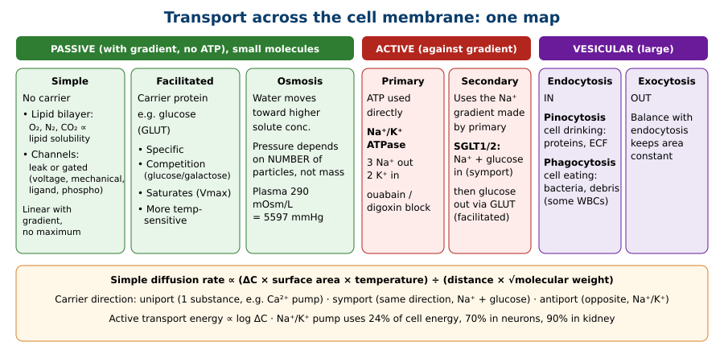

---

## 2. Main Content (Lecture Order)

### 2.1 Osmosis (Slides 4–9)
⭐ **Definition:** the tendency of **solvent (water)** to diffuse **down its own concentration gradient**, i.e., **toward the higher solute concentration**.

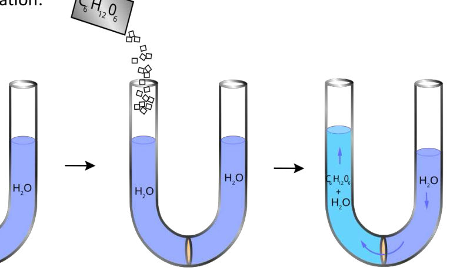

⭐ **Osmotic pressure** = the pressure that must be applied to the more concentrated solution to **prevent** osmosis.
- Measured in **mmHg**
- ⭐ Determined by the **NUMBER of particles per unit volume**, **not their mass**
- Osmosis ∝ number of particles / volume of solvent

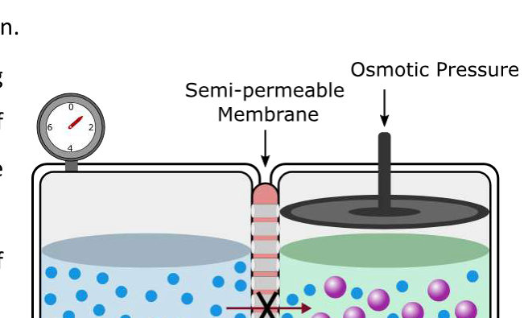

⭐⭐ **Definitions (Slide 6):**
| Term | Meaning |
|---|---|
| **Mole** | Contains **Avogadro's number** = **6.022 × 10²³** particles |
| ⭐ **Osmole** | Number of **osmotically active particles** one mole liberates in solution |
| Glucose example | ⭐ **1 mol glucose (180 g) = 1 osmole** (doesn't dissociate) |
| NaCl example | ⭐ **1 mol NaCl (58.5 g) = 2 osmoles** (→ Na⁺ + Cl⁻) |
| ⭐ **Osmolality** | Osmoles per **kilogram** of water |
| ⭐ **Osmolarity** | Osmoles per **litre** of water |
*Mnemonic [added]:* **osmolaRity = per litRe; osmoLaLity = per kiLo** (think "kg of water").

⭐ **Plasma osmolarity (Slide 7):**
- Summing all ions would give **> 300 mOsm/L**, but body fluids are **not ideal solutions**: ionic interaction reduces the particles free to act
- ⭐ **Real plasma osmolarity = 290 mOsm/L ≈ 5597 mmHg osmotic pressure** (starred)
- ⭐ **ICF = plasma = ISF = 290 mOsm/L**

⭐⭐ **Tonicity (Slide 8):** osmolality of a solution **relative to plasma**
| Type | Definition | Example / effect on RBC *[RBC effect added]* |
|---|---|---|
| ⭐ **Isotonic** | Same as plasma (**290 mOsm/L**) | ⭐ **0.9% NaCl** or **5% glucose**; RBC unchanged |
| **Hypertonic** | Higher than plasma | RBC **shrinks** (crenates) |
| **Hypotonic** | Lower than plasma | RBC **swells** (may lyse) |

⭐ **Key twist:** isosmotic solutions stay isotonic only if the solute doesn't enter cells or get metabolised.
- ⭐ **0.9% NaCl stays isotonic**
- ⭐ **5% glucose is isotonic at first, but once glucose is metabolised the net effect is a hypotonic (free-water) infusion**

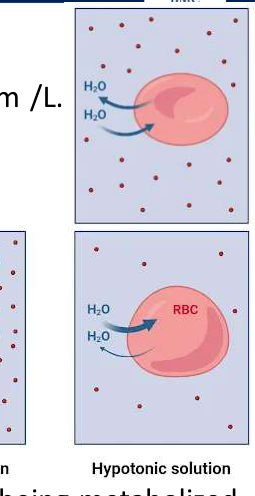

**Slide 9 (📝 crossed out, "cancel"):** fluid-shift (Darrow–Yannet) diagrams for diarrhoea, water deprivation, adrenal insufficiency, isotonic NaCl infusion, high NaCl intake, SIADH. The lecturer cancelled it, **but the closing case (Slide 24) uses exactly this diagram type**, so know the adrenal-insufficiency pattern (§7 Q1).

> 🔁 **Recap: Osmosis.** Water moves toward the higher solute concentration. Osmotic pressure depends on particle number, not mass. Glucose = 1 osmole/mol; NaCl = 2. Osmolality per kg, osmolarity per L. Plasma = 290 mOsm/L ≈ 5597 mmHg. 0.9% NaCl stays isotonic; 5% glucose becomes effectively hypotonic.
> 🔗 **Link:** Osmosis, like all diffusion, only goes downhill. To move substances against their gradient, the cell has to spend energy.
> ▶️ **Up next: Active transport.**

---

### 2.2 Active Transport: General (Slides 10–11)
⭐ **Definition:** transport **against an electrochemical gradient**.
- Uses **specific carrier proteins**
- ⭐ **Needs energy**, from **ATP**; the carrier has **ATPase activity**
- ⭐ **Energy required ∝ log ΔC**

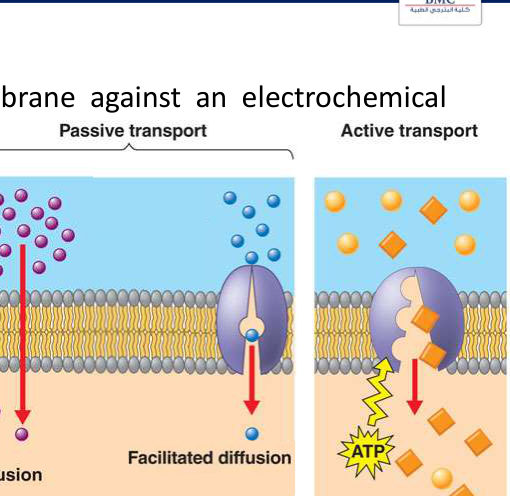

⭐⭐ **Carrier direction types (Slide 11):**
| Type | Moves | Slide example |
|---|---|---|
| ⭐ **Uniport** | **One** substance, one direction | **Ca²⁺ pump** |
| ⭐ **Symport** (co-transport) | **Two**, **same** direction | **Na⁺ + glucose** from intestinal lumen into cells |
| ⭐ **Antiport** (co-transport) | **Two**, **opposite** directions | **Na⁺/K⁺ pump** |

Active transport is classified as **A. Primary** or **B. Secondary**.

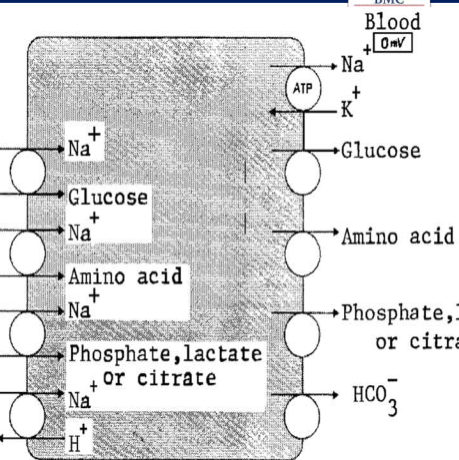

---

### 2.3 Primary Active Transport: Na⁺/K⁺ ATPase (Slides 12–14)
⭐⭐ **Energy use:** **24%** of cell energy; **70% in neurons**; **90% in kidneys** (📝 90% highlighted).

⭐⭐⭐ **Key facts (Slide 13):**
| Feature | Detail |
|---|---|
| ⭐ **Coupling ratio** | **3 Na⁺ out : 2 K⁺ in** (3:2) |
| ⭐ **Inhibitors** | **Ouabain** and related **digitalis glycosides** |
| Structure | **Heterodimer**; separating the subunits **abolishes activity** |
| ⭐ **α subunit** | **Intracellular** sites: **3 Na⁺**, **phosphorylation**, **ATP** · **Extracellular** sites: **2 K⁺** and ⭐ **ouabain** |
| **β subunit** | **Anchors** the complex in the membrane |

*[added consequence: the pump makes the inside more negative (electrogenic) and keeps Na⁺ low inside, K⁺ high inside: the ICF/ECF differences from Lecture 01.]*

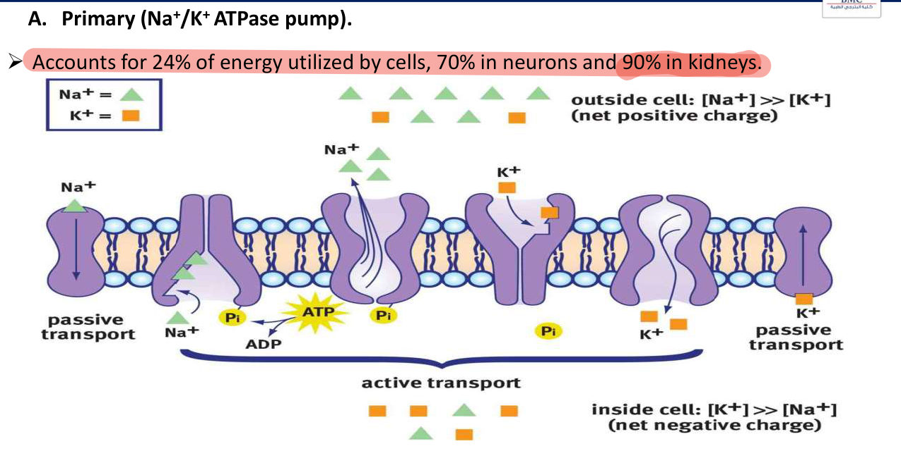

⭐ **Pump cycle (Slide 14):**
1. **3 Na⁺ bind** (inside)
2. **ATP binds** → ATP → **ADP**, phosphate transferred to the **phosphorylation site**
3. **Conformational change** → **Na⁺ extruded** outside
4. **2 K⁺ bind** (outside) → **dephosphorylation**
5. Return to the **original conformation** → **K⁺ released** into the cytoplasm

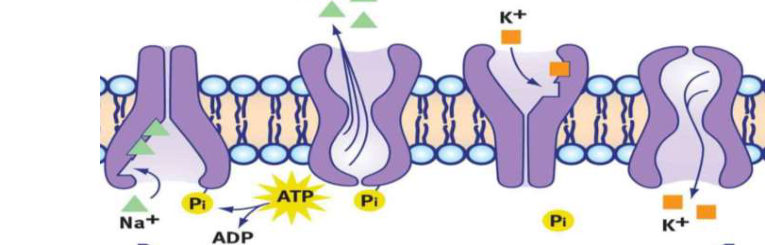

**Regulation (Slide 14):**
1. ⭐ **Substrate availability**: 📝 **Na⁺, K⁺, ATP** (the only item the lecturer kept)
2. <del>Thyroid hormones (genomic)</del> 📝 crossed out
3. <del>Aldosterone (secondary)</del> 📝 crossed out
4. <del>Insulin (↑ activity by several mechanisms)</del> 📝 crossed out
5. <del>2nd messengers (cAMP, DAG)</del> 📝 crossed out
6. <del>Dopamine (phosphorylation-mediated inhibition)</del> 📝 crossed out

> 🔁 **Recap: Primary.** Na⁺/K⁺ ATPase is an antiport: 3 Na⁺ out, 2 K⁺ in, one ATP per cycle *[added]*. It uses 24% of cell energy (70% neurons, 90% kidney). α subunit holds the Na⁺/ATP/phosphorylation sites (inside) and K⁺/ouabain sites (outside); β anchors. Blocked by ouabain/digitalis. Regulated mainly by Na⁺, K⁺, ATP availability.
> 🔗 **Link:** The Na⁺ gradient the pump builds is stored energy. Secondary transport spends it to drag other molecules, like glucose, uphill.
> ▶️ **Up next: Secondary active transport.**

---

### 2.4 Secondary Active Transport: Na⁺–Glucose (Slides 15–16)
⭐ **Definition:** carriage of glucose **secondary to the active transport of Na⁺**. Energy comes from the **ionic concentration difference created by primary active transport** (not from ATP directly).

⭐⭐ **Steps (renal proximal tubule / gut):**
1. 📝 **Primary**: Na⁺ pumped **out** at the **basolateral** membrane (Na⁺/K⁺ ATPase) → low intracellular Na⁺
2. 📝 **Secondary**: at the **apical** membrane, **Na⁺ + glucose bind the carrier (SGLT1 / SGLT2)** → shape change → **both enter** (symport)
3. This keeps intracellular Na⁺ low, **maintaining the gradient**
4. 📝 **Facilitated**: **glucose leaves** down its gradient through **GLUT1 / GLUT2** (basolateral)

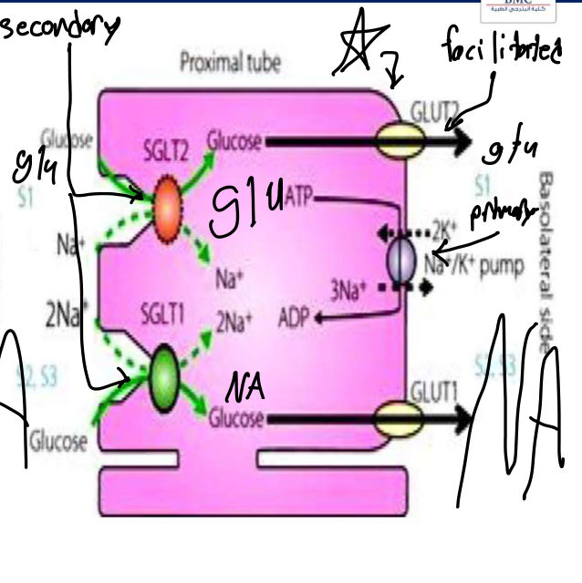

*[added from the figure: SGLT2 carries 1 Na⁺ per glucose (S1 segment); SGLT1 carries 2 Na⁺ per glucose (S2/S3). SGLT2 inhibitors (dapagliflozin) are diabetes drugs; see the CVD risk lecture.]*

> 🔁 **Recap: Secondary.** One epithelial cell uses three transport types: primary (Na⁺/K⁺ pump, basolateral), secondary (SGLT Na⁺-glucose symport, apical), facilitated (GLUT, basolateral).
> 🔗 **Link:** Diffusion and pumps handle small molecules. Proteins, bacteria and secretions are too big, so they travel inside vesicles.
> ▶️ **Up next: Vesicular transport.**

---

### 2.5 Vesicular Transport (Slides 17–19)
⭐ Movement of **macromolecules enclosed in membrane-bound vesicles**. Two types: **endocytosis** and **exocytosis**.

| Type | Direction | Detail |
|---|---|---|
| ⭐ **Pinocytosis** ("cell drinking") | In | The **only** way some very large water-soluble molecules (**proteins**) enter; small invaginations with ECF pinch off as **pinocytic vesicles** |
| ⭐ **Phagocytosis** ("cell eating") | In | Same process for **large particles**: **bacteria, dead tissue**. ⭐ **Only certain cells**, e.g., some **WBCs** |
| ⭐ **Exocytosis** | Out | Inside → outside |

⭐ **Balance:** exo- and endocytosis balance, so membrane area **neither shrinks** (if endocytosis dominates) **nor becomes redundant** (if exocytosis dominates).

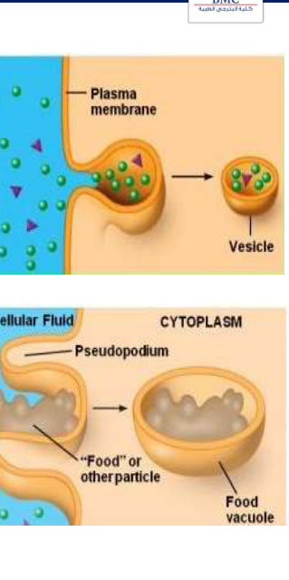 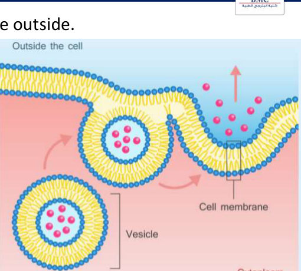

> 🔁 **Recap: Vesicular.** Pinocytosis (fluid, proteins), phagocytosis (bacteria, debris; only some WBCs), exocytosis (out). The two directions balance to keep membrane area constant.
> 🔗 **Link:** The conclusion ties together Lectures 01–03.
> ▶️ **Up next:** Conclusion + case.

---

### 2.6 Conclusion (Slides 21–22)
- Water distributes between **ICF (40%)**, **ISF (15%)**, **plasma (5%)**
- Homeostasis = keeping the internal environment constant
- Membrane: amphipathic; proteins 55%, phospholipids 25%, cholesterol 13%, other lipids 4%, carbohydrates 3%
- Transport: **diffusion, active, vesicular**
- ⭐ **Intercellular communication: gap junctions, neuronal, or endocrine** *(listed only here; the slides don't teach it further)*

---

## 3. High-Yield Comparison Tables

### Table A: All transport types
| | Simple diffusion | Facilitated | Osmosis | Primary active | Secondary active | Vesicular |
|---|---|---|---|---|---|---|
| Gradient | Down | Down | Water down its gradient | **Against** | **Against** (for glucose) | n/a |
| Energy | None | None | None | **ATP directly** | **Na⁺ gradient** (ATP indirectly) | ATP *[added]* |
| Carrier | No | Yes | No (aquaporins help) | Yes (ATPase) | Yes (SGLT) | Vesicles |
| Saturable | No | **Yes** | No | Yes | Yes | n/a |
| Example | O₂, CO₂ | Glucose via GLUT | Water | Na⁺/K⁺ pump, Ca²⁺ pump | Na⁺-glucose (SGLT) | Proteins, bacteria |

### Table B: Uniport / symport / antiport *(see §2.2)*

### Table C: IV fluids
| Fluid | Initially | After distribution/metabolism |
|---|---|---|
| **0.9% NaCl** | Isotonic | **Isotonic** (stays in ECF) *[ECF detail added]* |
| **5% glucose** | Isotonic | ⭐ **Hypotonic** (free water, distributes to all compartments) |

### Table D: Osmolality vs osmolarity
| | Osmolality | Osmolarity |
|---|---|---|
| Per | **kg** water | **L** water |
| Plasma | ≈ 290 | ≈ 290 |

---

## 4. Rules, Exceptions, Patterns
- **Osmotic pressure depends on particle NUMBER, not mass.**
- **NaCl gives 2 osmoles per mole; glucose gives 1.**
- **Real plasma osmolarity (290) < calculated (> 300)** because body fluids aren't ideal solutions.
- **5% glucose = isotonic in the bag, hypotonic in the body.**
- **Active = against gradient + carrier + energy (∝ log ΔC).**
- **Na⁺/K⁺ pump: 3 out, 2 in; ouabain/digitalis block the α subunit's extracellular site.**
- **Secondary active uses the Na⁺ gradient, not ATP directly.**
- **Glucose enters epithelia by secondary active (SGLT) and leaves by facilitated diffusion (GLUT).**
- **Phagocytosis only in certain cells**; pinocytosis is the only entry route for some large proteins.

---

## 5. Clinical Correlations
- **Digoxin toxicity** (digitalis glycoside) inhibits the Na⁺/K⁺ pump *[added: → ↑ intracellular Ca²⁺ via Na⁺/Ca²⁺ exchange → ↑ contractility; toxicity worsened by hypokalaemia]*.
- **5% dextrose given in excess** → free-water load → **hyponatraemia**, brain swelling *[added]*.
- **Oral rehydration solution** works through **Na⁺–glucose symport (SGLT1)**: water follows *[added]*.
- **SGLT2 inhibitors** (dapagliflozin) block renal glucose reabsorption → glycosuria; cardiorenal benefit (CVD lecture).
- **Addison's disease** (case): aldosterone deficiency → Na⁺ loss → hypovolaemic hyponatraemia → water shifts **into cells**.
- **Phagocyte defects** → recurrent bacterial infections *[added]*.

---

## 6. Rapid Revision (Last-Day)
- Osmosis: water → higher solute. Osmotic pressure (mmHg) ∝ **number of particles**.
- Avogadro **6.022 × 10²³**. **Glucose 180 g = 1 Osm; NaCl 58.5 g = 2 Osm.**
- **Osmolality = /kg; osmolarity = /L.**
- Plasma **290 mOsm/L = 5597 mmHg**; calculated > 300 (non-ideal solution).
- Tonicity = relative to plasma. **0.9% NaCl isotonic; 5% glucose isotonic → effectively hypotonic.**
- Active: against gradient, carrier, ATP (ATPase), **energy ∝ log ΔC**.
- **Uniport** (Ca²⁺ pump) · **symport** (Na⁺ + glucose) · **antiport** (Na⁺/K⁺).
- Na⁺/K⁺ ATPase: **24%** energy (**70% neurons, 90% kidney**); **3 Na⁺ : 2 K⁺**; **ouabain/digitalis**; **heterodimer**; α = 3 Na⁺ + P + ATP inside, 2 K⁺ + ouabain outside; β anchors.
- Cycle: 3 Na⁺ bind → ATP → phosphorylation → Na⁺ out → 2 K⁺ bind → dephosphorylation → K⁺ in.
- Regulation: **substrate (Na⁺, K⁺, ATP)** (others crossed out by lecturer).
- Secondary: **SGLT1/2** (apical, Na⁺ + glucose in) → **GLUT1/2** (basolateral, glucose out); pump basolateral.
- Vesicular: **pinocytosis** (drinking, proteins) · **phagocytosis** (eating, bacteria, some WBCs) · **exocytosis**. Balance keeps membrane area constant.
- Intercellular communication: **gap junctions, neuronal, endocrine**.

---

## 7. Exam-Style Questions

**Q1 (MCQ, lecture case, Slides 24–25).** 32 ♀, 3 months of fatigue, anorexia, **10 kg weight loss**, ↓ libido; **type 1 diabetes**. Pulse 105, **BP 95/63**. **Skin and oral mucosa darkening.** Na⁺ **130**, K⁺ **5.2**, fasting glucose **74**. Which change in body-fluid volume and osmolarity is expected?
**Answer: C** (the lecture's answer key, shown on Slide 25): **ECF volume ↓ and osmolarity ↓; water shifts from ECF to ICF → ICF volume ↑, ICF osmolarity ↓.**
Reasoning (from the slide): **Addison disease** (adrenocortical insufficiency) → **aldosterone deficiency** → **↑ Na⁺ excretion** → loss of more solute than water = **hyperosmotic fluid loss** → **hypovolaemic hyponatraemia**. Low ECF osmolarity pulls water into cells. Other causes of the same pattern: **loop diuretic overuse**, **21-hydroxylase deficiency**.

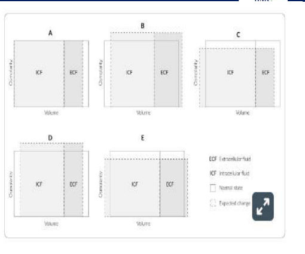

**Q2 (MCQ).** Which IV fluid is isotonic in the bag but acts as hypotonic after infusion?
a) 0.9% NaCl **b) 5% glucose** c) 3% NaCl d) Ringer's lactate
**Answer: b.** Glucose is metabolised, leaving free water.

**Q3 (MCQ).** Ouabain binds the Na⁺/K⁺ ATPase at:
a) β subunit, intracellular **b) α subunit, extracellular** c) α subunit, intracellular d) β subunit, extracellular
**Answer: b.** The α subunit's extracellular sites bind 2 K⁺ and ouabain.

**Q4 (Calculation).** How many osmoles does 1 mole of NaCl produce, and 1 mole of glucose?
**Answer:** NaCl → **2** (Na⁺ + Cl⁻); glucose → **1**.

**Q5 (Short answer).** Explain how glucose is absorbed across a renal tubular cell using three transport types.
**Answer:** **Primary active**: basolateral Na⁺/K⁺ ATPase keeps intracellular Na⁺ low. **Secondary active**: apical SGLT1/2 uses the Na⁺ gradient to bring Na⁺ + glucose in (symport). **Facilitated diffusion**: glucose exits basolaterally via GLUT1/2.

---

## 8. Exam Pitfalls & Traps
1. **Osmotic pressure depends on mass.** No: **number of particles**.
2. **Osmolality vs osmolarity:** per **kg** vs per **litre**.
3. **5% glucose is always isotonic.** Only initially; it acts hypotonic once metabolised.
4. **Secondary active transport uses ATP directly.** No, it uses the **Na⁺ gradient** from primary transport.
5. **Na⁺/K⁺ ratio:** **3 Na⁺ out, 2 K⁺ in** (not 2:3, not 1:1).
6. **Na⁺/K⁺ pump is a symport.** It's an **antiport**; Na⁺-glucose is the symport.
7. **Glucose leaves the tubular cell by active transport.** It leaves by **facilitated diffusion (GLUT)**.
8. **All cells can phagocytose.** Only certain cells (some WBCs).
9. ⚠️ **Crossed-out content:** Slide 9 fluid-shift diagrams ("cancel") and pump regulators 2–6 (thyroid, aldosterone, insulin, cAMP/DAG, dopamine). Likely not examinable, **but the closing case uses a fluid-shift diagram**. Ask the lecturer.
10. ⚠️ **Slide typo:** "SGLUT-II or I" = **SGLT2 / SGLT1**; "oubain" = **ouabain**.
11. **Intercellular communication** is an objective but appears only in the conclusion (gap junction, neuronal, endocrine). Expect it in a later lecture.
