# Regulatory Systems
**Dr. Hader I. Sakr, Associate Professor, Medical Physiology** | Source: `04_Regulatory_systems.pdf` (28 slides) · Refs: Guyton & Hall 13th ed. (Unit II ch. 6; Unit V ch. 25); Ganong 25th ed. (Section I ch. 2, 5)

> **Legend:** ⭐ = high-yield · *[added]* = not on slides · 📝 = the lecturer's handwritten annotation. Images marked "Slide N" come from the lecture; "Added diagram" = drawn for these notes.

> 🔗 **Bridge from Lectures 01–03:** Lecture 01 defined homeostasis and its **SRACEER** loop. Lecture 03 listed intercellular communication (gap junction, neuronal, endocrine) without teaching it. This lecture names the **two systems that run homeostasis** (nervous and endocrine) and covers the communication methods. SRACEER returns here as the **reflex arc**.

---

## 1. Title / Objectives
| Objective | Likely tested as |
|---|---|
| ⭐ **Compare** the two regulatory systems | Nervous vs endocrine table (unit, onset, duration, example) |
| ⭐ **Structure and functional unit** of the nervous system | Neuron parts, neuron types, myelin, reflex arc |
| ⭐ **List endocrine glands** and their hormones | Pituitary-controlled vs not; mixed glands; part-time endocrine organs |

**Flow:** Comparison table → nervous system (cells, neuron parts, axon, myelin, reflex arc) → endocrine system (chemical messengers, glands, hormones, other organs) → intercellular communication → conclusion → case.

---

## 2. Main Content (Lecture Order)

### 2.1 The Two Regulatory Systems (Slides 4–5, repeated 13 & 17)
⭐⭐⭐ **Comparison (shown three times in the lecture, so it's the key slide):**
| | **Endocrine system** | **Nervous system** |
|---|---|---|
| ⭐ **Structural unit** | **Ductless (endocrine) glands** | **Neurons and neuroglia** |
| ⭐ **Functional unit** | **Chemical messengers (hormones)** | ⭐ **Reflex arc** |
| ⭐ **Onset** | **Rapid, moderate, or slow** | ⭐ **Rapid** |
| ⭐ **Duration** | **Short or prolonged** | ⭐ **Short** |
| **Example** | **Metabolic functions** | **Muscular contractions** |

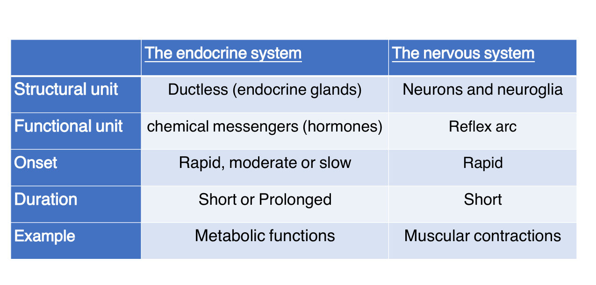

> 🔁 **Recap: Two systems.** Nervous = neurons/glia, reflex arc, rapid onset, short duration (e.g., muscle contraction). Endocrine = ductless glands, hormones, variable onset and duration (e.g., metabolism).
> 🔗 **Link:** The lecture takes the fast system first.
> ▶️ **Up next: The nervous system.**

---

### 2.2 Nervous System: Cells & the Neuron (Slides 6–9)
**Two cell types (billions of cells):**
1. ⭐ **Neurons**: the **basic structural unit** of nervous tissue, specialised to **transmit action potentials**
2. ⭐ **Glial cells (neuroglia)**: **supporting cells** (Greek "glue")
📝 The lecturer wrote that these together are **"the structure unit of NS"**.

⭐ **Neuron types (Slide 7 figure, starred):**
| Type | Example (figure) | 📝 Lecturer's note |
|---|---|---|
| **Bipolar** | Interneuron | |
| **Unipolar** | **Sensory neuron** | 📝 **Pseudounipolar** |
| ⭐ **Multipolar** | ⭐ **Motor neuron** (typical spinal motor neuron) | 📝 **Most common** |
| **Pyramidal** | Cortical cell | 📝 partly illegible ("most exi…", possibly "most excitable") |

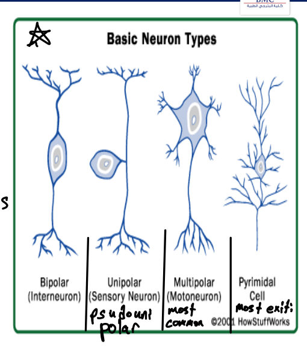

⭐⭐ **Parts of a typical (multipolar) neuron:**
| Part | Description |
|---|---|
| **a. Soma** (cell body) | Main body; ⭐ **processing centre** |
| **b. Dendrites** | **Antenna-like** processes; ↑ **surface area for receiving signals** |
| **c. Axon** (nerve fibre) | **Single, elongated** process |

⭐ **Axon details (Slide 9):**
1. Arises from a thickened area of the soma: the ⭐ **axon hillock**
2. First portion = the ⭐ **initial segment** *[added: where action potentials usually start]*
3. **Axis cylinder** surrounded by plasma membrane (continuous with the cell membrane)
4. Ends in **synaptic knobs** (= **terminal buttons**), containing **vesicles of synaptic transmitter**
5. ⭐ Impulses travel **away from the cell body** along the axon

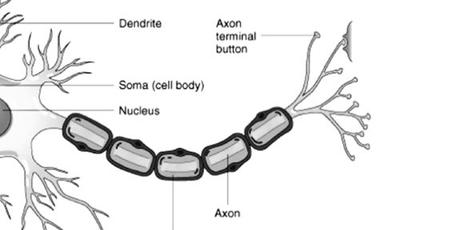 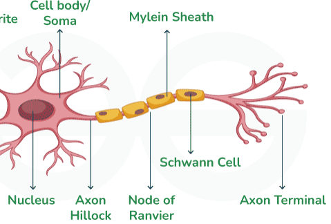

> 🔁 **Recap: Neuron.** Neurons (transmit) + glia (support) = the structural units. Multipolar (motor) is the most common type; the sensory neuron is pseudounipolar. Soma processes, dendrites receive, axon sends from hillock → initial segment → terminal buttons.
> 🔗 **Link:** How fast the axon conducts depends on its insulation.
> ▶️ **Up next: Myelinated vs non-myelinated fibres.**

---

### 2.3 Myelinated vs Non-Myelinated Fibres (Slides 10–11)
| | ⭐ **Myelinated** | **Non-myelinated** |
|---|---|---|
| Sheath | ⭐ **Sphingomyelin** myelin sheath: excellent **insulator** | Axon simply surrounded by **Schwann cells**, **no myelin** |
| Ion flow | ⭐ **↓ ~5000-fold** | Not reduced |
| Gaps | Covers the axon **except at the nodes of Ranvier** | n/a |
| Conduction | Fast (saltatory *[added]*) | Slow *[added]* |

⭐ **Loss of myelin → delayed or blocked conduction.** *[added: e.g., multiple sclerosis, Guillain–Barré.]*

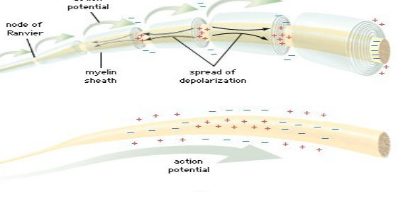

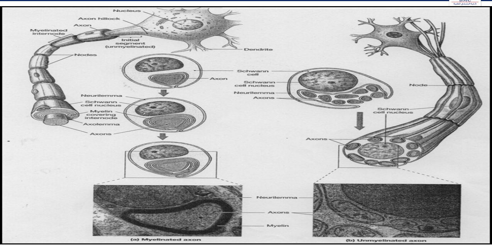

> 🔁 **Recap: Myelin.** Sphingomyelin insulation cuts ion flow ~5000× except at nodes of Ranvier. Non-myelinated fibres sit in Schwann cells without myelin. Demyelination slows or blocks conduction.
> 🔗 **Link:** Neurons are the structural unit; the functional unit is the circuit they form.
> ▶️ **Up next: The reflex arc.**

---

### 2.4 Functional Unit: The Reflex Arc (Slide 12)
⭐⭐ **Reflex arc = the functional unit of the nervous system** (📝 lecturer wrote **"homeostasis"** beside it). Components = **SRACEER** (same mnemonic as the homeostasis loop in Lecture 01):
| Letter | Component |
|---|---|
| **S** | A proper **Stimulus** |
| **R** | Sense organ (**Receptor**) |
| **A** | **Afferent** neuron |
| **C** | One or more synapses (**Centre**) |
| **E** | **Efferent** neuron |
| **E** | **Effector** organ |
| **R** | Proper **Response** |

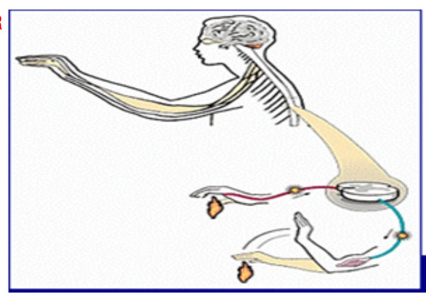

> 🔁 **Recap: Reflex arc.** SRACEER, the homeostasis loop built from neurons. The centre is one or more synapses.
> 🔗 **Link:** The second, slower regulatory system uses chemical messengers instead of wires.
> ▶️ **Up next: The endocrine system.**

---

### 2.5 Endocrine System & Chemical Messengers (Slides 14–16)
⭐ **Endocrine** glands are **ductless**: they secrete into the blood. *[added: exocrine glands secrete through ducts.]* Slide 15 compares the two (📝 "exocrine" labelled on the figure).

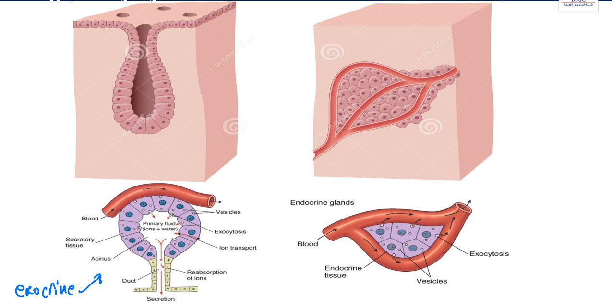

- Endocrine glands are a ⭐ **slow control system**
- They act by **secreting hormones**

⭐⭐ **Coordination by chemical messengers (Slide 16):**
| # | Messenger | Speed / scope (slide + 📝) |
|---|---|---|
| 1 | **Gap junctions** | 📝 **Direct, fast** |
| 2 | **Neurotransmitters (synaptic)** | ⭐ **Rapid mechanism** |
| 3 | **Endocrine hormones** | 📝 **Slow, systemic** |
| 4 | **Paracrine** | 📝 **Through ISF** (acts on neighbouring cells) |
| 5 | **Autocrine** | Acts on the **same cell** that secreted it *[definition added]* |
| 6 | **Neuroendocrine hormones** | ⭐ **Intermediate mechanism** |

---

### 2.6 Endocrine Glands & Their Hormones (Slides 18–20)
⭐⭐ **Glands and hormones (Slide 18 figure):**
| Gland | Hormones (figure) |
|---|---|
| **Pituitary (hypophysis)** | **GH, ACTH, TSH, FSH, LH, prolactin, ADH** |
| **Pineal (epiphysis)** | **Melatonin** |
| **Thyroid** | **Free T4, free T3, calcitonin** |
| **Parathyroids** | **PTH** |
| **Thymus** | (named only) |
| **Adrenals** | **Cortisol, aldosterone, DHEA-SO4** |
| **Pancreas** | **Insulin, glucagon** |
| **Ovaries** | **Estradiol, progesterone** |
| **Testes** | **Testosterone** (total and free) |

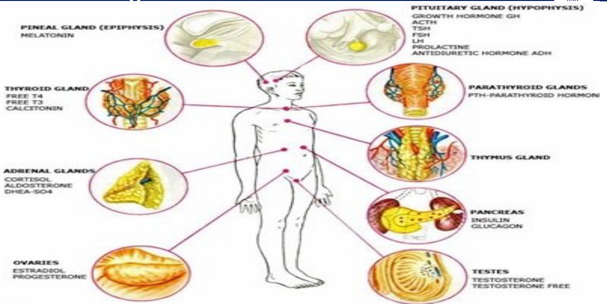

⭐⭐⭐ **Control by the pituitary (Slide 19, starred):**
- ⭐ **Pituitary = the master gland**
- ⭐ Pituitary is controlled by the **hypothalamus** (**neuro-endocrine**)

| **Under pituitary control** | **NOT under pituitary control** |
|---|---|
| 1. **Thyroid** | 1. **Parathyroids** |
| 2. **Suprarenal (adrenal) cortex** | 2. **Suprarenal (adrenal) medulla** |
| 3. **Gonads** (testes, ovaries) † | 3. **Pancreas** † |

📝 **† = mixed glands** (endocrine + exocrine): **gonads** and **pancreas**.

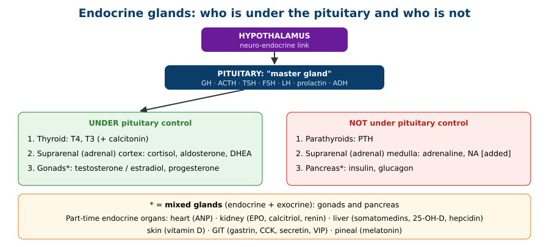

⭐⭐ **Organs with endocrine function alongside their main job (Slide 20):**
| Organ | Hormone(s) |
|---|---|
| ⭐ **Heart** | **Atrial natriuretic peptide (ANP)** |
| ⭐ **Kidney** | **Erythropoietin**, **1,25(OH)₂ cholecalciferol**, **renin**, among others |
| ⭐ **Liver** | **Somatomedins**, **25-hydroxycholecalciferol**, **hepcidin** |
| **Skin** | **Calciferol (vitamin D)** |
| **GIT** | **Gastrin, CCK, secretin, VIP**, etc. |
| **Pineal** | **Melatonin** |

*Pattern [added]:* vitamin D is made in **skin → 25-hydroxylated in liver → 1-hydroxylated in kidney** (active 1,25(OH)₂D). All three steps appear on this slide.

> 🔁 **Recap: Endocrine.** Ductless, slow. Messengers range from fast (gap junction, synaptic) through intermediate (neuroendocrine) to slow systemic (endocrine); paracrine and autocrine act locally. Hypothalamus → pituitary → thyroid, adrenal cortex, gonads. Parathyroid, adrenal medulla and pancreas are independent. Gonads and pancreas are mixed glands. Heart, kidney, liver, skin, GIT and pineal also secrete hormones.
> 🔗 **Link:** The lecture ends by comparing all the ways cells talk to each other.
> ▶️ **Up next: Intercellular communication.**

---

### 2.7 Intercellular Communication (Slides 21–22)
⭐⭐⭐
| | **Gap junctions** | **Synaptic** | **Paracrine & autocrine** | **Endocrine** |
|---|---|---|---|---|
| Route | **Directly cell to cell** | **Across the synaptic cleft** | **By diffusion in ISF** | **By circulating body fluids** |
| Range | Local | Local | Local | ⭐ **Systemic** (📝 starred) |

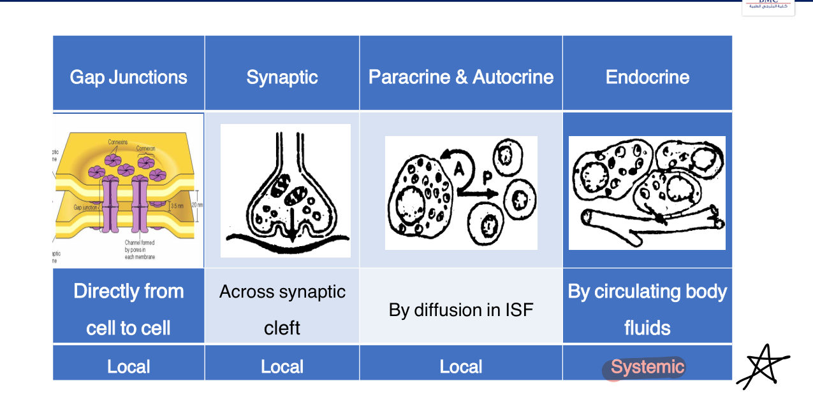

> 🔁 **Recap: Communication.** Gap junction (direct), synaptic (cleft), paracrine/autocrine (ISF) are all local. Endocrine (blood) is the only systemic one.
> 🔗 **Link:** Conclusion + case.

---

### 2.8 Conclusion (Slide 24)
- The **endocrine and nervous** systems are the **two regulatory systems**
- Nervous system: **structural units = neurons + neuroglia**, **functional unit = reflex arc**
- Different methods of chemical transmission between cells exist
- The body has several endocrine glands
- ⭐ **The endocrine and nervous systems are interconnected** (e.g., hypothalamus → pituitary)

---

## 3. High-Yield Comparison Tables

### Table A: Nervous vs endocrine *(see §2.1)*

### Table B: Neuron types
| Type | Processes | Example |
|---|---|---|
| Bipolar | 1 dendrite + 1 axon | Interneuron (per slide) *[added: retina, olfactory]* |
| Unipolar / pseudounipolar | Single process that splits | Sensory neuron (dorsal root ganglion *[added]*) |
| **Multipolar** | Many dendrites + 1 axon | **Motor neuron, most common** |
| Pyramidal | Pyramid-shaped soma | Cerebral cortex *[added]* |

### Table C: Chemical messengers by speed
| Fast | Intermediate | Slow |
|---|---|---|
| Gap junctions, neurotransmitters | Neuroendocrine hormones | Endocrine hormones |

### Table D: Pituitary control *(see §2.6)*

### Table E: Communication types *(see §2.7)*

---

## 4. Rules, Exceptions, Patterns
- **Nervous = rapid onset, short duration. Endocrine = variable onset, short or prolonged duration.**
- **Structural unit of NS = neurons + glia; functional unit = reflex arc.**
- **Impulses leave the soma via the axon** (hillock → initial segment → terminal buttons).
- **Myelin (sphingomyelin) cuts ion flow ~5000×** except at nodes of Ranvier.
- **Reflex arc = SRACEER**, the same letters as the homeostasis loop.
- **Pituitary controls thyroid, adrenal cortex, gonads. Not parathyroids, adrenal medulla, pancreas.**
- **Cortex yes, medulla no**: the adrenal is split between the two lists.
- **Mixed glands: gonads + pancreas.**
- **Only endocrine communication is systemic.**

---

## 5. Clinical Correlations *[added; the lecture has none]*
- **Multiple sclerosis** (CNS) and **Guillain–Barré** (PNS) = demyelination → slowed/blocked conduction.
- **Pituitary tumour/failure** affects thyroid, adrenal cortex and gonads, but **not** PTH, adrenaline or insulin.
- **Chronic kidney disease** → ↓ erythropoietin (anaemia) and ↓ 1,25(OH)₂D (bone disease).
- **Heart failure** → ↑ ANP/BNP (natriuretic peptides, used as markers).
- **Withdrawal reflex** (lecture case) happens before the pain is consciously felt.

---

## 6. Rapid Revision (Last-Day)
- Two regulatory systems: **nervous** (rapid, short, muscle) and **endocrine** (rapid-to-slow, short-or-prolonged, metabolism).
- NS structural units: **neurons + neuroglia**; functional unit: **reflex arc**.
- Neuron types: bipolar, **unipolar (pseudounipolar, sensory)**, **multipolar (motor, most common)**, pyramidal.
- Neuron: **soma** (processing), **dendrites** (receive, ↑ area), **axon** (hillock → initial segment → terminal buttons with transmitter vesicles). Impulses go **away from** the soma.
- Myelin = **sphingomyelin**, ↓ ion flow **5000×**, gaps = **nodes of Ranvier**; non-myelinated = Schwann cells without myelin.
- Reflex arc **SRACEER**.
- Messengers: gap junction (direct, fast), synaptic (rapid), endocrine (slow, systemic), paracrine (ISF), autocrine, neuroendocrine (intermediate).
- Pituitary (master) ← hypothalamus. **Controls thyroid, adrenal cortex, gonads**; **not parathyroid, adrenal medulla, pancreas**. **Mixed: gonads, pancreas.**
- Pituitary hormones: **GH, ACTH, TSH, FSH, LH, prolactin, ADH**.
- Other organs: **heart ANP**; **kidney EPO, 1,25(OH)₂D, renin**; **liver somatomedins, 25-OH-D, hepcidin**; **skin vit D**; **GIT gastrin, CCK, secretin, VIP**; **pineal melatonin**.
- Communication: gap junction, synaptic, paracrine/autocrine = **local**; endocrine = **systemic**.

---

## 7. Exam-Style Questions

**Q1 (MCQ, lecture case, Slide 25).** A child touches a hot stove and withdraws her hand within a fraction of a second; the response is brief. Which system, and why?
1) Endocrine, hormones act rapidly and briefly **2) Nervous, its onset and duration are both rapid and short** 3) Endocrine, it controls skeletal muscle 4) Both equally, with identical timing
**Answer: 2** (highlighted on the slide). Reflex arc = rapid onset, short duration; muscle contraction is the nervous system's example.

**Q2 (MCQ).** Which gland is **not** under pituitary control?
a) Thyroid b) Adrenal cortex c) Testis **d) Adrenal medulla**
**Answer: d.** Also parathyroids and pancreas.

**Q3 (MCQ).** The functional unit of the nervous system is:
a) Neuron b) Neuroglia **c) Reflex arc** d) Synapse
**Answer: c.** Neurons and glia are the **structural** units.

**Q4 (MCQ).** Which communication method is **systemic**?
a) Gap junction b) Synaptic c) Paracrine **d) Endocrine**
**Answer: d.**

**Q5 (Short answer).** Name the hormone produced by the heart, three by the kidney and three by the liver, per the lecture.
**Answer:** Heart: **ANP**. Kidney: **erythropoietin, 1,25(OH)₂ cholecalciferol, renin**. Liver: **somatomedins, 25-hydroxycholecalciferol, hepcidin**.

---

## 8. Exam Pitfalls & Traps
1. **Structural vs functional unit of NS:** structural = **neurons + glia**; functional = **reflex arc**.
2. **Endocrine is always slow.** The table says onset can be **rapid, moderate or slow**, and duration **short or prolonged**.
3. **Adrenal gland:** cortex **is** under pituitary control, medulla **is not**.
4. **Mixed glands** = gonads and pancreas (both endocrine + exocrine).
5. **Paracrine vs autocrine:** paracrine → neighbouring cells via ISF; autocrine → the secreting cell itself.
6. **Impulse direction:** along the axon, **away from** the soma.
7. **Myelin covers the nodes of Ranvier.** No, the nodes are the gaps.
8. **Neuroendocrine = intermediate speed**, between synaptic (rapid) and endocrine (slow).
9. ⚠️ **Handwriting:** the note under "Pyramidal cell" is partly illegible; don't rely on it.
10. ⚠️ **Slide text:** "Mylein" on Slide 9's figure = **myelin**; "acts asis" = **acts as**.
