# Hormones and Their Receptors
**Dr. Hader I. Sakr, Associate Professor, Medical Physiology** | Source: `05_Hormones_and_their_receptors.pdf` (25 slides) · Refs: Guyton & Hall 13th ed. (Unit II ch. 6); Ganong 25th ed. (Section I ch. 5)

> **Legend:** ⭐ = high-yield · *[added]* = not on slides · 📝 = the lecturer's handwritten annotation. Images marked "Slide N" come from the lecture; "Added diagram" = drawn for these notes.

> 🔗 **Bridge from Lecture 04 (Regulatory Systems):** Lecture 04 listed the endocrine glands, their hormones and the communication types, and ended by saying the nervous and endocrine systems are **interconnected**. This lecture shows **how** they are connected, what hormones **are chemically**, and **how a target cell detects them** (receptors and signalling).

---

## 1. Title / Objectives
| Objective | Likely tested as |
|---|---|
| ⭐ Hormone **characteristics and chemical nature** | Properties list; steroid vs amine vs peptide examples |
| ⭐ Receptor **structure, distribution, ligands** | Receptor location by hormone class; down/up-regulation; signalling pathways |

**Flow:** Properties of hormones → nervous–endocrine inter-relations → chemical nature → receptor locations → 2nd messengers → down-/up-regulation → intracellular signalling pathways → conclusion → case.

---

## 2. Main Content (Lecture Order)

### 2.1 Physiological Properties of Hormones (Slides 4–5)
1. ⭐ Produced in **small amounts (µg to ng)**
2. **Rate of secretion** is set by the **body's needs**
3. ⭐ **Superimposed rhythms**:
   - **Circadian** (daily), e.g., ⭐ **ACTH**
   - **Monthly**, e.g., **female gonadotropic hormones**
4. Act on **specific target organs** (e.g., **sex hormones**) or on **many tissues** (e.g., **insulin**). 📝 The lecturer wrote "synergise" here, meaning some hormones can also act together *[interpretation]*.
5. ⭐ Some hormones **antagonise** others (e.g., **insulin vs glucagon**)

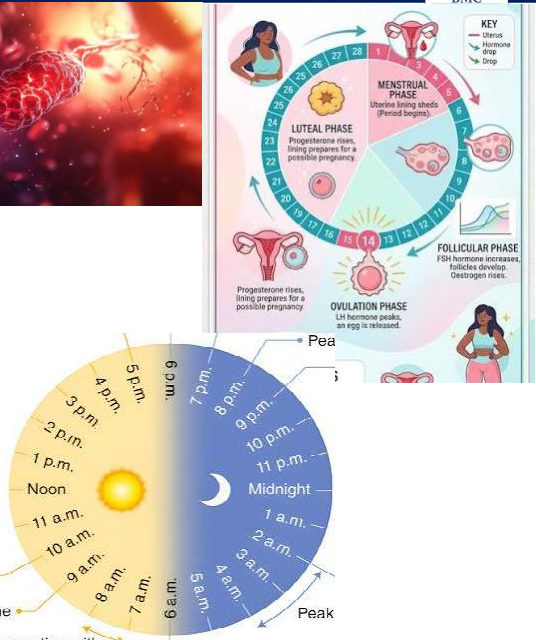

> 🔁 **Recap: Properties.** Tiny amounts (µg–ng), secreted on demand, with daily (ACTH) or monthly (gonadotropins) rhythms. Targeted (sex hormones) or widespread (insulin). Can antagonise (insulin/glucagon) or synergise.
> 🔗 **Link:** Hormone secretion is often switched on by the nervous system, and hormones in turn affect nerves: the interconnection promised in Lecture 04.
> ▶️ **Up next: Nervous–endocrine inter-relations.**

---

### 2.2 Inter-relation Between the Nervous and Endocrine Systems (Slides 6–9)
⭐⭐ **A. Nervous system → endocrine system**
| # | Connection | Between | How |
|---|---|---|---|
| 1 | ⭐ **Hypothalamo-hypophyseal portal circulation** | Hypothalamus → **anterior pituitary** | Hypothalamic **releasing / inhibiting hormones** travel in the **portal blood** and alter anterior pituitary secretion (e.g., **GHRH**) |
| 2 | ⭐ **Hypothalamo-hypophyseal tract** (nerve tract) | Hypothalamus → **posterior pituitary** | ⭐ **ADH and oxytocin** are **formed in the hypothalamus**, then **stored and secreted** from nerve endings in the **posterior pituitary** (📝 "oxyt, ADH") |
| 3 | **Direct neural connection** | Hypothalamus → **suprarenal (adrenal) medulla** | Controls **epinephrine and norepinephrine** release |
*(The slide numbers the third item "2." again, a numbering slip.)*

*[added from the Slide 8 figure: oxytocin comes from the paraventricular nucleus and ADH from the supraoptic nucleus.]*

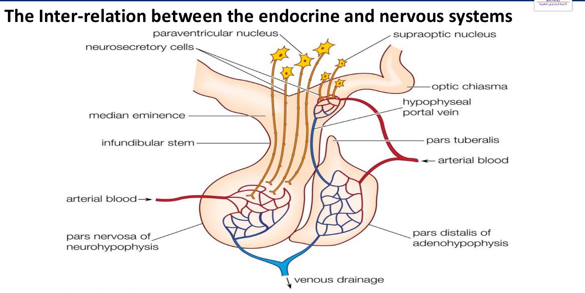

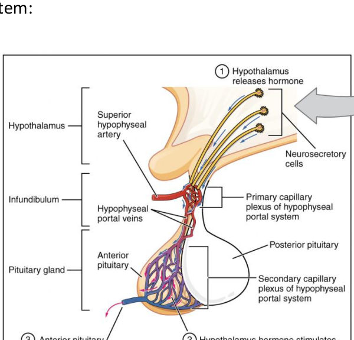 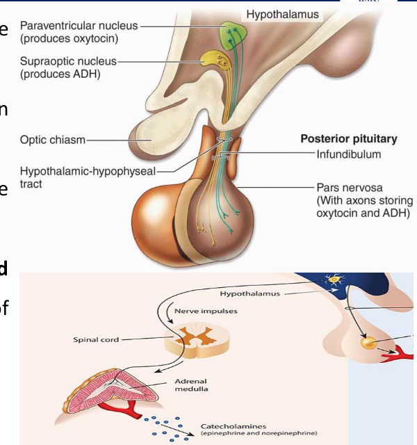

⭐ **B. Endocrine system → nervous system**
- **Parathyroids** control **blood Ca²⁺**, which affects **nerve excitability**
- **Thyroid hormones** affect **nervous-system excitability**

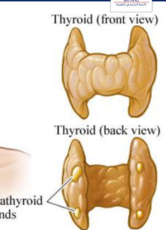

> 🔁 **Recap: Inter-relation.** Hypothalamus → anterior pituitary via portal **blood** (releasing/inhibiting hormones). Hypothalamus → posterior pituitary via **nerve tract** (ADH and oxytocin made in the hypothalamus). Hypothalamus → adrenal medulla by direct nerves. Back the other way: PTH (Ca²⁺) and thyroid hormones set nerve excitability.
> 🔗 **Link:** Before looking at how cells detect hormones, classify them chemically, because chemistry decides where the receptor sits.
> ▶️ **Up next: Chemical nature of hormones.**

---

### 2.3 Chemical Nature of Hormones (Slides 10–11)
| Class | Source → hormones |
|---|---|
| ⭐ **a) Steroids** | **Adrenal cortex**: cortisol, aldosterone, androgens · **Placenta & ovaries**: oestrogen, progesterone · **Testes**: testosterone |
| ⭐ **b) Amino-acid (tyrosine) derivatives** | **Thyroid**: thyroxine (T4), tri-iodothyronine (T3) · **Adrenal medulla**: dopamine, epinephrine, norepinephrine |
| ⭐ **c) Proteins & polypeptides** | **Pituitary** hormones · **Pancreas**: insulin, glucagon, somatostatin · **Parathyroid**: PTH · many others |

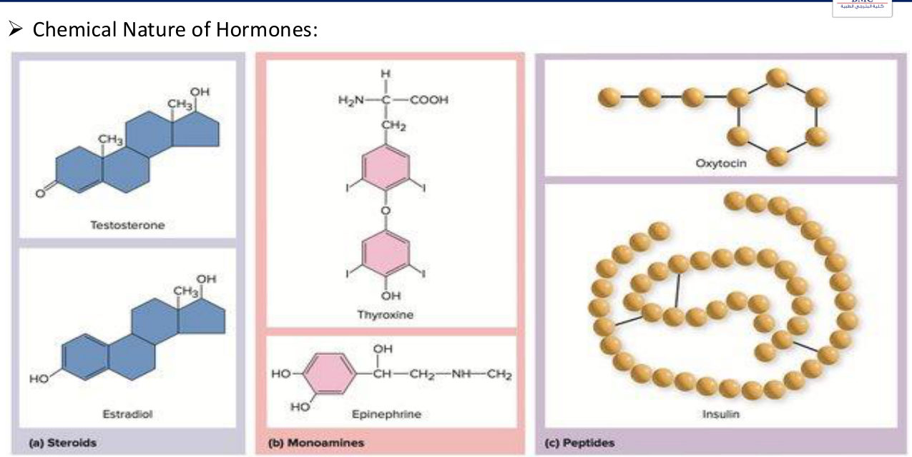

*Memory hook [added]:* **"Steroids come from the Cortex and Gonads; Tyrosine goes to Thyroid and adrenal medulla; everything else is Peptide."**

> 🔁 **Recap: Chemistry.** Steroids: adrenal cortex, gonads, placenta. Tyrosine derivatives: thyroid hormones and catecholamines. Proteins/peptides: pituitary, pancreas, PTH.
> 🔗 **Link:** A hormone does nothing until it binds its receptor.
> ▶️ **Up next: Receptors.**

---

### 2.4 Receptors: Location & Second Messengers (Slides 12–14)
- ⭐ **First step** of hormone action: binding to **specific receptors** on the target cell
- ⭐ Cells **without the receptor** do not respond (**"silent"**)

⭐⭐⭐ **Receptor location:**
| # | Location | Hormones |
|---|---|---|
| 1 | ⭐ **In/on the cell membrane surface** | **Protein, peptide and catecholamine** hormones |
| 2 | ⭐ **Cytoplasm** | **Steroid** hormones (primary receptors) |
| 3 | ⭐ **Nucleus** | ⭐ **Thyroid hormones**, directly associated with **one or more chromosomes** |

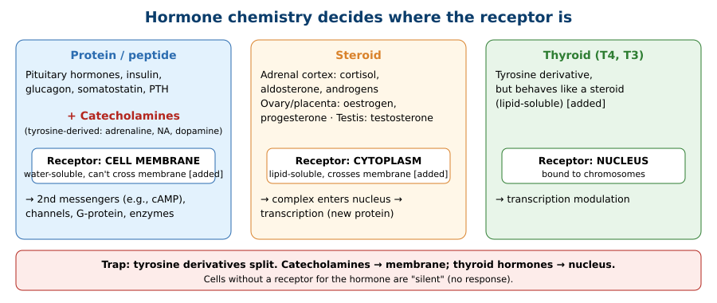

⭐ **Messengers:**
- Hormone = **"first messenger"**
- The substance produced **inside the cell** by hormone–receptor binding = ⭐ **"second messenger"** (e.g., **cAMP**, per the figure)
- ⭐ Second messengers can trigger reactions that **persist after the hormone has gone**

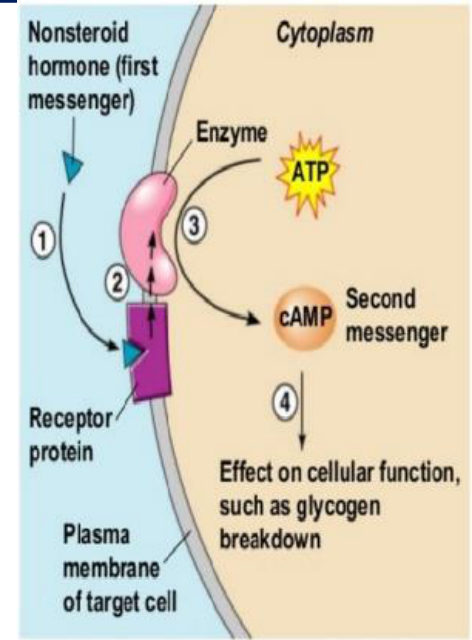 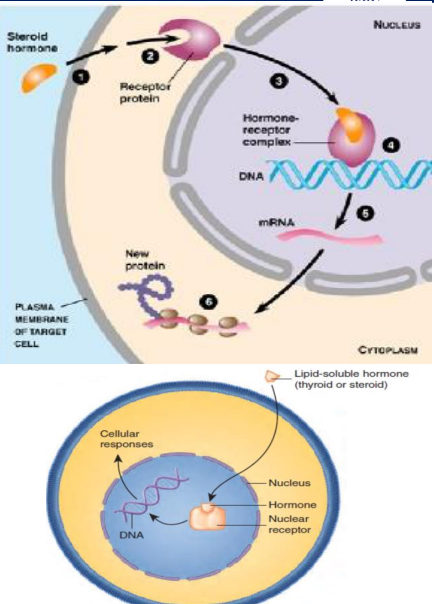

> 🔁 **Recap: Location.** Membrane: peptides and catecholamines. Cytoplasm: steroids. Nucleus: thyroid. Hormone = 1st messenger; cAMP etc. = 2nd messenger, whose effects can outlast the hormone.
> 🔗 **Link:** Receptor number isn't fixed; it adjusts to hormone levels, which changes how sensitive the tissue is.
> ▶️ **Up next: Down- and up-regulation.**

---

### 2.5 Receptor Regulation (Slides 15–17)
⭐ **The number of receptors in a target cell is not constant.**

#### ⭐⭐ Down-regulation
**Trigger:** ⭐ **↑ hormone concentration** and ↑ binding → **↓ receptor number** → ⭐ **↓ tissue responsiveness**

**Five mechanisms (Slide 16):**
1. **Inactivation** of some receptor molecules
2. **Decreased production** of receptors
3. **Temporary sequestration** of receptors inside the cell, away from the hormone
4. **Destruction by lysosomes** after internalisation
5. **Inactivation of intracellular signalling proteins**

Figure mapping (Slide 16): **1 & 5** = desensitised receptor uncoupled from the signalling cascade · **3** = receptor internalised in an endosome and recycled · **4** = receptor internalised and destroyed in a lysosome.

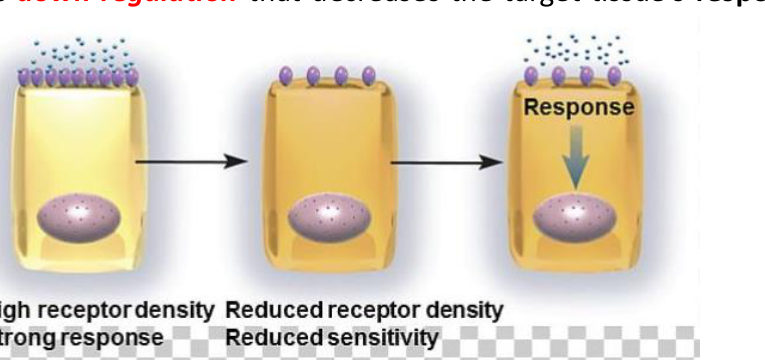

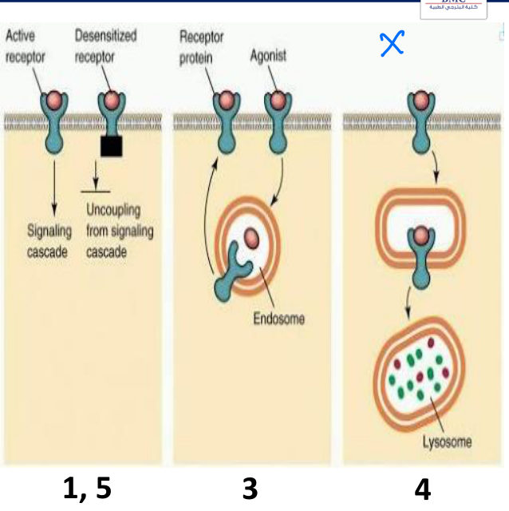

#### ⭐⭐ Up-regulation
**Trigger:** ⭐ **prolonged exposure to ↓ hormone** → ↑ cell response
- Target tissue becomes **progressively more sensitive**
- Mechanisms: ⭐ **↑ receptor expression** or ⭐ **↓ rate of receptor internalisation**

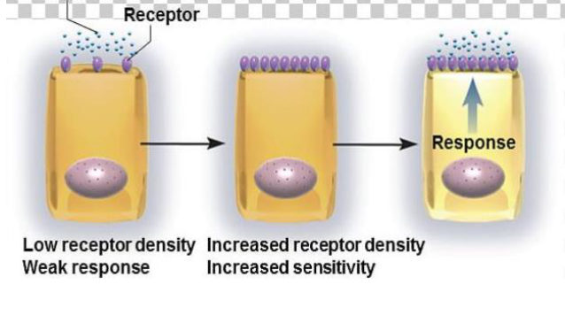

> 🔁 **Recap: Regulation.** High hormone → down-regulation (inactivate, make fewer, sequester, destroy, or block signalling) → less sensitive. Low hormone for a long time → up-regulation (more receptors, less internalisation) → more sensitive.
> 🔗 **Link:** Once bound, the receptor has to convert the signal into a cellular effect. The lecture ends with the four ways it does that.
> ▶️ **Up next: Intracellular signalling pathways.**

---

### 2.6 Intracellular Signalling Pathways (Slides 18–20)
⭐⭐⭐ **Four mechanisms:**
| | Mechanism | Receptor location | Figure example |
|---|---|---|---|
| **A** | ⭐ **Opening ion channels** | **Transmembrane** | **Ligand-gated ion channel** |
| **B** | ⭐ **G-protein activation** | **Transmembrane** | **G-protein-coupled receptor** (GDP/GTP, α β γ subunits) |
| **C** | ⭐ **Altering enzyme activity** | **Transmembrane or cytoplasmic** | **Receptor tyrosine kinase** (+ adaptor) |
| **D** | ⭐ **Activating transcription** | **Cytoplasmic or nuclear** | Steroid/thyroid receptors |

📝 On Slide 19, arrows from **G-protein activation** point to both **channel opening** and **altering enzymes**: a G-protein can act through either.

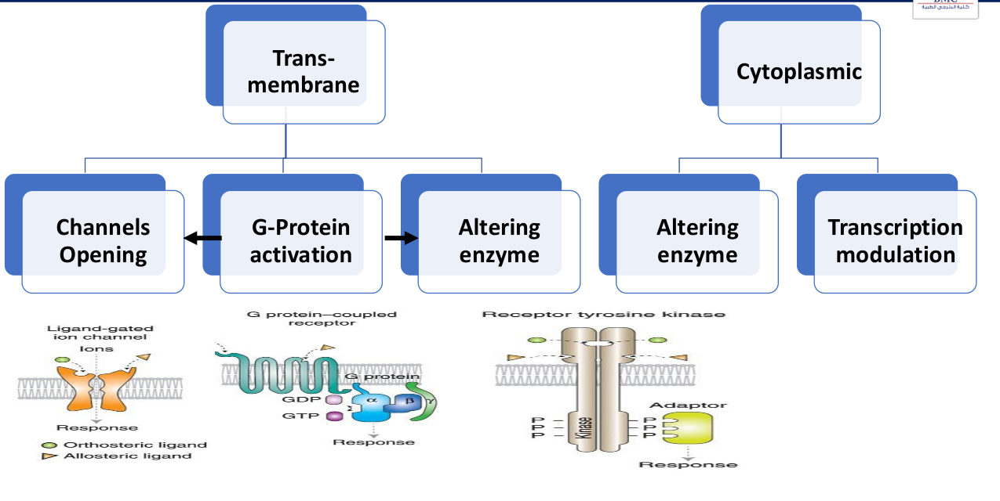

⭐ **What signalling pathways provide:**
1. ⭐ **Amplification** (same effect, bigger) and **distribution** (different effects)
2. ⭐ **Regulation and feedback control**

> 🔁 **Recap: Signalling.** Transmembrane receptors open channels, activate G-proteins or alter enzymes. Cytoplasmic/nuclear receptors alter enzymes or transcription. Pathways amplify, distribute and allow feedback.

---

### 2.7 Conclusion (Slide 22)
- Hormones have **different characteristics**
- Hormones may be **protein, polypeptide, steroid, or tyrosine derivatives**
- Receptors may be **transmembrane, cytoplasmic, or nuclear**

---

## 3. High-Yield Comparison Tables

### Table A: Class → source → receptor → action
| | **Peptide/protein** | **Catecholamine** | **Steroid** | **Thyroid** |
|---|---|---|---|---|
| Chemistry | Amino-acid chains | Tyrosine derivative | Cholesterol-derived *[added]* | Tyrosine derivative (iodinated) |
| Source | Pituitary, pancreas, parathyroid | Adrenal medulla | Adrenal cortex, gonads, placenta | Thyroid |
| ⭐ Receptor | **Membrane** | **Membrane** | **Cytoplasm** | **Nucleus** |
| Action | 2nd messengers, channels, enzymes | 2nd messengers | Transcription | Transcription |
| Onset *[added]* | Fast | Fast | Slower | Slowest |

### Table B: Down- vs up-regulation
| | **Down-regulation** | **Up-regulation** |
|---|---|---|
| Trigger | ↑ hormone | Prolonged ↓ hormone |
| Receptors | ↓ | ↑ |
| Sensitivity | ↓ | ↑ |
| Mechanisms | Inactivation, ↓ production, sequestration, lysosomal destruction, ↓ signalling proteins | ↑ expression, ↓ internalisation |

### Table C: Hypothalamus → pituitary links
| | Anterior pituitary | Posterior pituitary |
|---|---|---|
| Link | **Portal circulation (blood)** | **Nerve tract (axons)** |
| Carries | Releasing/inhibiting hormones (e.g., GHRH) | ADH, oxytocin (made in hypothalamus) |

### Table D: Signalling mechanisms *(see §2.6)*

---

## 4. Rules, Exceptions, Patterns
- **Hormones act in µg–ng amounts.**
- **Every hormone action starts with receptor binding**; no receptor = silent cell.
- **Water-soluble (peptides, catecholamines) → membrane receptors. Lipid-soluble steroids → cytoplasm. Thyroid → nucleus.**
- **Tyrosine derivatives split**: catecholamines = membrane; thyroid = nucleus.
- **ADH and oxytocin are made in the hypothalamus, not the posterior pituitary** (which only stores and secretes them).
- **Anterior pituitary = blood (portal) link; posterior pituitary = nerve link.**
- **More hormone → fewer receptors; less hormone → more receptors.**
- **Second messengers can outlast the hormone.**
- **G-proteins can open channels or alter enzymes.**

---

## 5. Clinical Correlations *[added; the lecture has none]*
- **Type 2 diabetes / obesity**: chronically high insulin → insulin-receptor down-regulation → insulin resistance.
- **Tolerance to β-agonists** (e.g., salbutamol overuse) = β-receptor down-regulation.
- **Denervation hypersensitivity** = up-regulation after loss of the transmitter.
- **Beta-blocker withdrawal** → rebound tachycardia from up-regulated β-receptors.
- **Pituitary stalk section** cuts both links: anterior hormones fall (except prolactin) and ADH is lost (diabetes insipidus).
- **Hypocalcaemia** (e.g., after parathyroidectomy) → ↑ nerve excitability → tetany; the endocrine → nervous link.
- **Hyperthyroidism** → nervousness, tremor, brisk reflexes (↑ neural excitability); ties to the Thyroid 1 lecture.

---

## 6. Rapid Revision (Last-Day)
- Hormones: **µg–ng**, secreted on demand, **circadian (ACTH)** / **monthly (gonadotropins)** rhythms, targeted (sex hormones) or wide (insulin), antagonism (insulin vs glucagon).
- Nervous → endocrine: **portal circulation → anterior pituitary** (releasing/inhibiting, e.g., GHRH); **hypothalamo-hypophyseal tract → posterior pituitary** (ADH, oxytocin made in hypothalamus); **direct nerves → adrenal medulla** (adrenaline, NA).
- Endocrine → nervous: **PTH (Ca²⁺)** and **thyroid hormones** set excitability.
- Steroids: **adrenal cortex, ovaries, placenta, testes**. Tyrosine: **T4/T3, dopamine, adrenaline, NA**. Peptides: **pituitary, insulin, glucagon, somatostatin, PTH**.
- Receptors: **membrane** (peptide, catecholamine), **cytoplasm** (steroid), **nucleus** (thyroid).
- Hormone = 1st messenger; **2nd messenger** (cAMP) persists after the hormone.
- **Down-regulation** (↑ hormone): inactivation, ↓ production, sequestration, lysosomal destruction, ↓ signalling proteins.
- **Up-regulation** (prolonged ↓ hormone): ↑ expression, ↓ internalisation.
- Signalling: **channels, G-protein, enzymes** (transmembrane); **enzymes, transcription** (cytoplasmic/nuclear). Gives **amplification, distribution, regulation, feedback**.

---

## 7. Exam-Style Questions

**Q1 (MCQ, lecture case, Slide 23).** Where is the primary receptor for **cortisol** (a steroid)?
1) Mitochondria 2) Cell-membrane surface **3) Cytoplasm** 4) Nucleus, bound to chromosomes
**Answer: 3.** Steroid receptors are cytoplasmic (Slide 14). Option 4 is the thyroid-hormone receptor; option 2 is for peptides and catecholamines. *[The slide doesn't mark an answer; this follows directly from Slide 14.]*

**Q2 (MCQ).** Which hormone's receptor is located in the nucleus?
a) Insulin b) Epinephrine c) Aldosterone **d) Thyroxine**
**Answer: d.**

**Q3 (MCQ).** ADH is:
a) Synthesised in the posterior pituitary **b) Synthesised in the hypothalamus and released from the posterior pituitary** c) Carried to the pituitary by portal blood d) A steroid
**Answer: b.** It travels down the hypothalamo-hypophyseal **tract** (axons), not the portal circulation.

**Q4 (MCQ).** Prolonged high hormone levels cause:
**a) Down-regulation with reduced sensitivity** b) Up-regulation c) More receptor synthesis d) Reduced internalisation
**Answer: a.**

**Q5 (Short answer).** List the four intracellular signalling mechanisms and where their receptors are.
**Answer:** (A) ion channel opening, transmembrane; (B) G-protein activation, transmembrane; (C) altering enzyme activity, transmembrane or cytoplasmic; (D) transcription activation, cytoplasmic or nuclear.

---

## 8. Exam Pitfalls & Traps
1. **All tyrosine derivatives use membrane receptors.** No: **thyroid hormones are nuclear**; only catecholamines are membrane.
2. **Steroid vs thyroid receptor:** steroid = **cytoplasm**; thyroid = **nucleus**.
3. **ADH/oxytocin are made in the posterior pituitary.** No, they're made in the **hypothalamus** and only stored/released there.
4. **Anterior pituitary is connected by nerves.** No, by **portal blood**; the posterior pituitary is the nerve connection.
5. **Down-regulation = more receptors.** No: down = fewer, less sensitive; triggered by **high** hormone.
6. **Second messengers stop when the hormone leaves.** Their effects **can persist**.
7. **Enzyme-altering receptors are only membrane receptors.** They can be **transmembrane or cytoplasmic**.
8. ⚠️ **Slide numbering:** the slides list the adrenal-medulla connection as "2." again; it's the **third** nervous → endocrine link.
9. ⚠️ **Slide typos:** "placent and aovaries" = placenta and ovaries.
