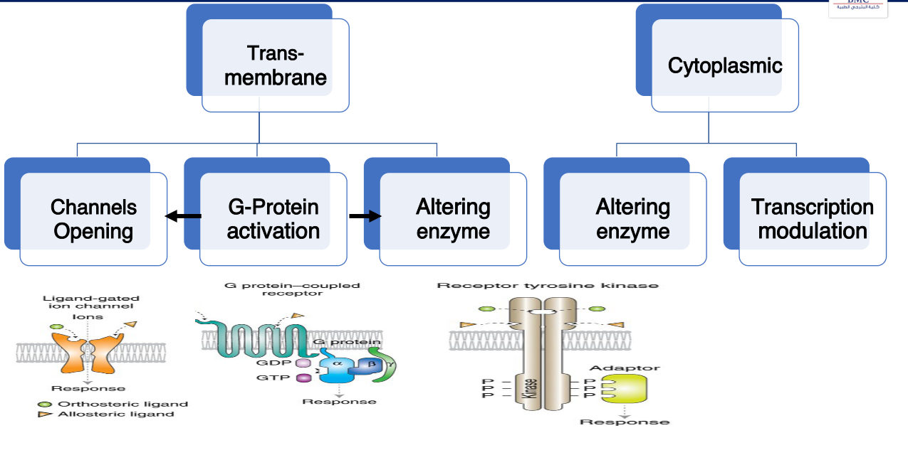
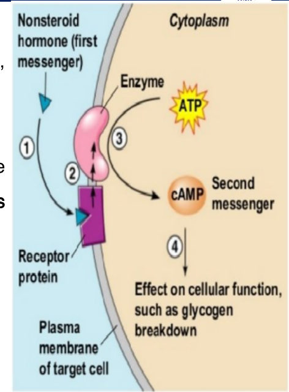
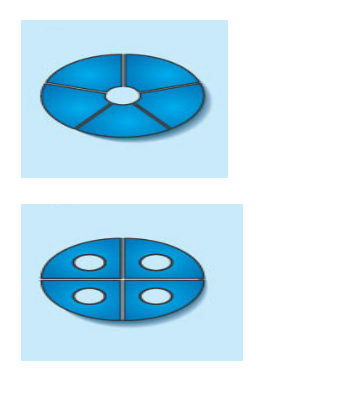
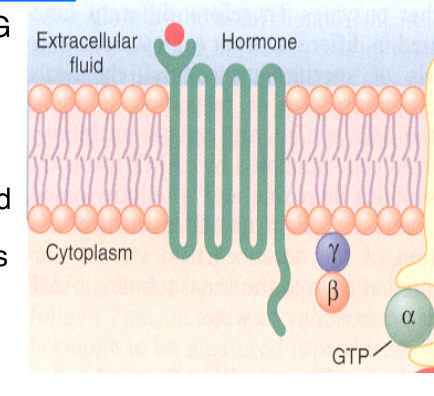
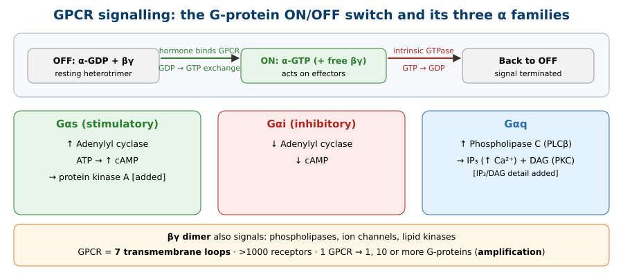
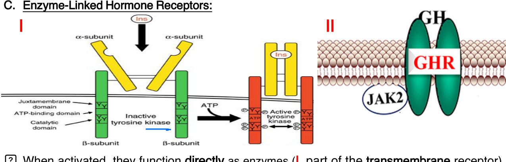
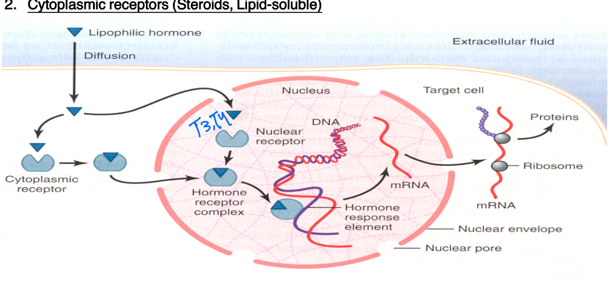
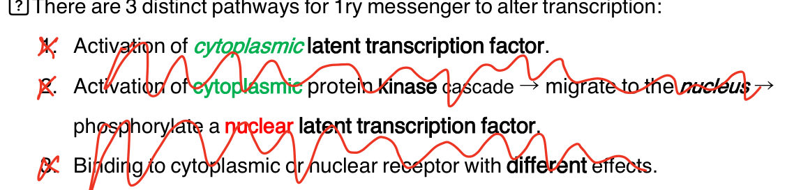

# Intracellular Signalling Pathways
**Dr. Hader I. Sakr, Associate Professor, Medical Physiology** | Source: `06_Intracellular_signaling_pathways_2.pdf` (19 slides) · Refs: Guyton & Hall 13th ed. (Unit II ch. 6); Ganong 25th ed. (Section I ch. 5)

> **Legend:** ⭐ = high-yield · *[added]* = not on slides · 📝 = the lecturer's handwritten annotation. Images marked "Slide N" come from the lecture; "Added diagram" = drawn for these notes.
> ⚠️ The lecturer **scribbled out** the "3 pathways to alter transcription" list (Slide 14). It is kept here with strikethrough and is likely **not examinable**; confirm with the lecturer.

> 🔗 **Bridge from Lecture 05 (Hormones & Receptors):** Lecture 05 ended with a tree of four ways a receptor turns a hormone signal into a cell effect (channels, G-protein, enzyme, transcription) and showed where each hormone class's receptor sits. This lecture **zooms into each branch** of that tree.

---

## 1. Title / Objectives
| Objective | Likely tested as |
|---|---|
| ⭐ Explain intracellular signalling pathways of hormone receptors | Transmembrane vs cytoplasmic; which hormones use which |
| ⭐ Describe **channel** activity | Pentameric ligand-gated (ACh, GABA) vs tetrameric aquaporin (ADH) |
| ⭐ Identify **G-protein-coupled receptors** | GDP/GTP switch; α, β, γ; **Gs / Gi / Gq**; 7 transmembrane loops |
| ⭐ Enzyme activation and transcription | Type I (intrinsic, insulin) vs type II (associated, GH–JAK2); HRE |

**Flow:** Pathway tree → transmembrane receptors → (A) ion channels → (B) GPCRs & heterotrimeric G-proteins → (C) enzyme-linked receptors → cytoplasmic/nuclear receptors & transcription → conclusion → case.

---

## 2. Main Content (Lecture Order)

### 2.1 The Pathway Tree (Slides 4–6), repeated from Lecture 05
| Receptor location | Mechanism |
|---|---|
| ⭐ **Transmembrane** | **A. Ion channel opening** · **B. G-protein activation** · **C. Altering enzyme activity** |
| ⭐ **Cytoplasmic** | **C. Altering enzyme activity** · **D. Transcription modulation** |

**What signalling pathways provide:**
1. ⭐ **Amplification** (same effect, bigger) and **distribution** (different effects)
2. ⭐ **Regulation and feedback control**

---

### 2.2 Transmembrane Receptors: General (Slide 7)
- ⭐ For **lipid-insoluble** hormones: **proteins & peptides, catecholamines, serotonin, melatonin**
- Located **in or on the cell-membrane surface**
- Hormone binding regulates **target proteins** (**enzymes or ion channels**) either:
  - ⭐ **Directly**, or
  - ⭐ **Through G-protein coupling**

> 🔁 **Recap: Transmembrane receptors.** Water-soluble hormones (peptides, catecholamines, serotonin, melatonin) can't enter the cell, so they bind surface receptors that act on channels or enzymes, directly or via G-proteins.
> 🔗 **Link:** The simplest and fastest action is a receptor that *is* a channel.
> ▶️ **Up next: (A) Ion channels.**

---

### 2.3 (A) Opening Ion Channels (Slide 8)
| Channel | Structure | Pore | Ligand / example |
|---|---|---|---|
| ⭐ **Pentameric ligand-gated** (📝 "ligand-gated" underlined) | **5 identical or similar subunits** | ⭐ **One single pore** formed by all 5 | ⭐ **Acetylcholine**, **GABA**; cation (K⁺ on slide) or anion (Cl⁻) channels |
| ⭐ **Aquaporin** water channel (📝 underlined) | **Tetramer** (4 subunits) | ⭐ **One pore per subunit** (4 pores) | ⭐ **ADH** |

*[added: the nicotinic ACh channel passes Na⁺ inward mostly (and K⁺ out), causing depolarisation; GABA-A opens Cl⁻ channels, causing inhibition. ADH (via V2 receptors and cAMP) inserts aquaporin-2 into collecting-duct membranes.]*

> 🔁 **Recap: Channels.** Ligand-gated pentamer = 5 subunits, 1 pore (ACh, GABA). Aquaporin = tetramer, 4 pores (ADH).
> 🔗 **Link:** Most hormone receptors don't open a channel themselves; they work through a G-protein relay.
> ▶️ **Up next: (B) G-protein-coupled receptors.**

---

### 2.4 (B) G-Protein-Coupled Receptors (Slides 9–11)
⭐⭐ **The G-protein switch (Slide 9):**
1. Named for their ability to **bind guanosine nucleotides**
2. Activating signal reaches the GPCR → G-protein ⭐ **exchanges GDP for GTP**
3. ⭐ The **GTP–protein complex** produces the effect
4. ⭐ **Intrinsic GTPase** converts **GTP → GDP**, restoring the **inactive resting state** and **terminating** the signal

⭐⭐ **Heterotrimeric G-proteins (Slide 10):**
- **Couple the surface GPCR** to an **ion channel** or an **intracellular catalytic unit** that makes the **second messenger**
- ⭐ **> 1000 receptors** use them; each GPCR has ⭐ **7 transmembrane loops** (📝 underlined)
- ⭐ **Amplification**: one active GPCR → **1, 10 or more** active G-proteins
- ⭐ **3 subunits: α, β, γ**
- **α subunits** fall into **3 subfamilies: s, i, q**; one GPCR can couple to one or more families

⭐⭐⭐ **Downstream effectors (Slide 11):**
| α subunit | Effector | Result |
|---|---|---|
| ⭐ **Gαs** | **Stimulates adenylyl cyclase** | ⭐ **↑ cAMP** (📝 "ATP → cAMP") |
| ⭐ **Gαi** | **Inhibits adenylyl cyclase** | ⭐ **↓ cAMP** |
| ⭐ **Gαq** | **Activates phospholipase C (PLCβ)** | *[added: → IP₃ (↑ Ca²⁺) + DAG (→ PKC)]* |
| **Gβγ dimer** | Activates **phospholipases, ion channels, lipid kinases** | |

*Mnemonic [added]:* **s = stimulate, i = inhibit (both on adenylyl cyclase/cAMP); q = the odd one → PLC.**

*[added examples: Gs, β-adrenergic, glucagon, TSH, ACTH, ADH-V2; Gi, α2-adrenergic, M2 muscarinic; Gq, α1-adrenergic, M1/M3 muscarinic, ADH-V1, angiotensin II.]*

> 🔁 **Recap: GPCRs.** 7-loop receptor. GDP → GTP turns the G-protein on; intrinsic GTPase turns it off. α, β, γ subunits; one receptor activates many G-proteins (amplification). Gs ↑ cAMP, Gi ↓ cAMP, Gq → PLC; βγ also signals.
> 🔗 **Link:** Some receptors skip the G-protein and are enzymes themselves, or grab an enzyme directly.
> ▶️ **Up next: (C) Enzyme-linked receptors.**

---

### 2.5 (C) Enzyme-Linked Hormone Receptors (Slide 12)
⭐ **Hormone-binding site outside; catalytic or enzyme-binding site inside.**
| | ⭐ **Type I: intrinsic enzyme** | ⭐ **Type II: enzyme-associated** |
|---|---|---|
| Enzyme | **Part of the transmembrane receptor** ("inherited") | The H–R complex **activates a separate cytoplasmic enzyme** |
| Inside site | **Catalytic** domain | **Enzyme-binding** domain |
| Slide example | ⭐ **Insulin receptor**: α-subunits bind insulin; β-subunits have **tyrosine kinase** (ATP → autophosphorylation, inactive → active) | ⭐ **Growth hormone receptor (GHR)** with **JAK2** |

> 🔁 **Recap: Enzyme-linked.** Type I receptor *is* the enzyme (insulin → tyrosine kinase). Type II recruits a cytoplasmic enzyme (GH → JAK2).
> 🔗 **Link:** Everything so far serves hormones that stay outside the cell. Lipid-soluble hormones walk straight in.
> ▶️ **Up next: Cytoplasmic/nuclear receptors and transcription.**

---

### 2.6 Cytoplasmic (& Nuclear) Receptors: Transcription (Slides 13–14)
- ⭐ For **lipid-soluble** hormones (**steroids**), which **cross the membrane** and bind **cytoplasmic (or nuclear)** receptors
- 📝 The lecturer wrote **"T3, T4"** beside the **nuclear receptor** on the figure (thyroid hormones bind in the nucleus, as in Lecture 05)
- ⭐ The activated **hormone–receptor (H–R) complex** binds the ⭐ **hormone response element (HRE)** in a gene's regulatory sequence (**promoter**) → alters **transcription and mRNA** → new **proteins**

**Three pathways by which a first messenger alters transcription (Slide 14), 📝 all three scribbled out:**
1. <del>Activation of a cytoplasmic latent transcription factor</del>
2. <del>Activation of a cytoplasmic protein-kinase cascade → migrates to the nucleus → phosphorylates a nuclear latent transcription factor</del>
3. <del>Binding to a cytoplasmic or nuclear receptor with different effects</del>

> 🔁 **Recap: Transcription.** Steroids (cytoplasm) and T3/T4 (nucleus) form an H–R complex that binds the HRE in the promoter → mRNA → protein. The detailed 3-pathway list was crossed out.

---

### 2.7 Conclusion (Slide 16)
- Receptors may be **transmembrane, cytoplasmic or nuclear**
- Transmembrane receptors act via **ion channels, GPCRs or enzyme-linked receptors**
- Ion channels have **different configurations** (pentamer vs tetramer)
- GPCRs are classified by G-protein into **small and heterotrimeric** *(only heterotrimeric is taught on the slides)*
- Hormone-activated enzymes may be **part of the receptor or cytoplasmic**

---

## 3. High-Yield Comparison Tables

### Table A: Receptor classes
| | Ion channel | GPCR | Enzyme-linked | Cytoplasmic/nuclear |
|---|---|---|---|---|
| Location | Membrane | Membrane | Membrane | Cytoplasm / nucleus |
| Hormone type | Water-soluble | Water-soluble | Water-soluble | **Lipid-soluble** (steroids, T3/T4) |
| Structure | Pentamer (1 pore) / tetramer (4 pores) | **7 TM loops** + αβγ G-protein | Outside binding site, inside catalytic/binding site | H–R complex + HRE |
| Example | ACh, GABA; ADH (aquaporin) | Many (> 1000) | **Insulin (type I)**, **GH–JAK2 (type II)** | Cortisol, T3/T4 |
| Speed *[added]* | Fastest (ms) | Seconds–minutes | Minutes | Hours |

### Table B: Gs vs Gi vs Gq *(see §2.4)*

### Table C: Type I vs type II enzyme-linked *(see §2.5)*

---

## 4. Rules, Exceptions, Patterns
- **Water-soluble → transmembrane receptor; lipid-soluble → cytoplasmic/nuclear.**
- **Pentamer = one shared pore; aquaporin tetramer = one pore per subunit.**
- **GDP = off, GTP = on**; the G-protein switches itself off with its **own GTPase**.
- **Every GPCR has 7 transmembrane loops.**
- **Gs ↑ cAMP, Gi ↓ cAMP, Gq → PLC.**
- **βγ is not just a passive partner**: it activates phospholipases, channels, lipid kinases.
- **Type I enzyme-linked = receptor is the enzyme (insulin); type II = recruits one (GH–JAK2).**
- **Steroid/thyroid H–R complex acts on the HRE in the promoter.**

---

## 5. Clinical Correlations *[added; the lecture's only clinical link is the case]*
- **Snake α-neurotoxins / myasthenia gravis** target the nicotinic ACh receptor (pentameric ligand-gated channel).
- **Benzodiazepines/barbiturates** enhance GABA-A (pentameric Cl⁻ channel).
- **Cholera toxin** locks **Gαs** on → ↑ cAMP → secretory diarrhoea. **Pertussis toxin** blocks **Gαi**.
- **Nephrogenic diabetes insipidus**: defective V2 receptor or aquaporin-2.
- **Type 2 diabetes**: impaired insulin-receptor tyrosine-kinase signalling (insulin resistance).
- **Tyrosine kinase inhibitors** (imatinib) target enzyme-linked signalling in cancer; **JAK inhibitors** (tofacitinib) target type II signalling.

---

## 6. Rapid Revision (Last-Day)
- Tree: **transmembrane** (channels, G-protein, enzyme) · **cytoplasmic** (enzyme, transcription). Gives **amplification, distribution, regulation, feedback**.
- Transmembrane receptors for **lipid-insoluble**: peptides, **catecholamines, serotonin, melatonin**; act **directly or via G-proteins**.
- Channels: **pentamer, 5 subunits, 1 pore (ACh, GABA)** · **aquaporin tetramer, 1 pore per subunit (ADH)**.
- GPCR: **GDP → GTP = on; intrinsic GTPase → GDP = off**. **7 TM loops**, **> 1000 receptors**, **α β γ**, **1 → 10+ G-proteins (amplification)**.
- **Gαs ↑ AC → ↑ cAMP · Gαi ↓ AC → ↓ cAMP · Gαq → PLC**. **βγ → phospholipases, channels, lipid kinases**.
- Enzyme-linked: **type I intrinsic (insulin, tyrosine kinase)** · **type II associated (GH + JAK2)**; binding site outside, catalytic/binding site inside.
- Lipid-soluble (steroids; T3/T4 nuclear) → **H–R complex → HRE in promoter → transcription → mRNA → protein**.

---

## 7. Exam-Style Questions

**Q1 (MCQ, lecture case, Slide 17).** A snake toxin irreversibly locks open the **nicotinic acetylcholine receptor** at the neuromuscular junction. This receptor's structural class?
**A. Pentameric ligand-gated ion channel** B. Heterotrimeric GPCR C. Enzyme-linked receptor with intrinsic catalytic activity E. Cytoplasmic (nuclear) receptor
**Answer: A.** Slide 8 names ACh (and GABA) receptors as pentameric ligand-gated channels. *[The slide doesn't mark an answer and skips option "D".]*

**Q2 (MCQ).** What terminates G-protein signalling?
a) GDP → GTP exchange **b) Intrinsic GTPase activity of the α subunit** c) Binding of βγ d) Adenylyl cyclase
**Answer: b.** GTP → GDP restores the resting state.

**Q3 (MCQ).** A hormone increases intracellular cAMP. Its receptor most likely couples to:
**a) Gαs** b) Gαi c) Gαq d) JAK2
**Answer: a.**

**Q4 (MCQ).** Which is a type II (enzyme-associated) receptor?
a) Insulin receptor **b) Growth hormone receptor** c) Nicotinic receptor d) Aquaporin
**Answer: b.** GHR activates cytoplasmic JAK2; the insulin receptor has its own tyrosine kinase (type I).

**Q5 (Short answer).** Contrast the pore structure of the nicotinic ACh receptor and aquaporin.
**Answer:** ACh receptor: **pentamer**, 5 subunits forming **one** central pore. Aquaporin: **tetramer** with **one pore in each subunit** (4 pores), regulated by ADH.

---

## 8. Exam Pitfalls & Traps
1. **GTP = off.** No, **GTP = on**, GDP = off.
2. **Gi activates PLC.** No: Gi **inhibits adenylyl cyclase**; **Gq** activates PLC.
3. **Aquaporin has one central pore.** No, **one per subunit**; the pentamer has one shared pore.
4. **Insulin receptor recruits JAK2.** No, it **is** a tyrosine kinase (type I); GH uses JAK2 (type II).
5. **Catecholamines enter the cell.** No, they are lipid-insoluble → membrane receptors (like serotonin and melatonin).
6. **βγ is inactive.** It activates phospholipases, channels and lipid kinases.
7. ⚠️ **Crossed-out content:** the 3 transcription pathways (Slide 14) were scribbled out; likely not examinable.
8. ⚠️ **"Small G-proteins"** appear in the conclusion but aren't taught on any slide.
9. ⚠️ **Slide wording:** "cation (K⁺)" for ligand-gated channels; the nicotinic receptor mainly carries **Na⁺** inward *[added]*. The case's option list jumps from C to E (no D).
