# Ischemic Heart Disease: Approach to a Case of Chest Pain
**Dr. Muhammad Reihan, Internal Medicine** | Source: `Reihan_CAD.pdf` (67 slides)

> **Legend:** ⭐ = high-yield / likely exam target · *[added]* = not on slides (context, mnemonic, or reconstruction). Everything else comes from the lecture.
> Some slide symbols (♂/♀) were lost in the PDF. Where the meaning was reconstructed, it is marked *[reconstructed]*.

---

## 1. Title / Objectives

| Domain | Objective | Likely tested as |
|---|---|---|
| Knowledge | Epidemiology, clinical manifestations, complications of CAD (KSA + worldwide) | KSA stats (37%, 5.5%) |
| Knowledge | ⭐ MI complications **by time of onset** post-infarction | Timeline MCQ ("day 5 post-MI, new murmur…") |
| Skill | ⭐ Interpret **ECG + biomarkers** → STEMI vs NSTEMI vs UA | ECG/troponin vignette |
| Skill | ⭐ Choose diagnostic test for stable angina by **pretest probability (PTP)** | Case-scenario MCQ (as in the lecture's opening case) |
| Skill | Management plan: pharmacotherapy, secondary prevention, revascularization indications | Drug lists, targets |
| Value | ⭐ Time-critical STEMI protocols (SCFHS/SMLE): **door-to-balloon / door-to-needle** | 90 min / 120 min / 30 min |

**Lecture flow:** Opening case → Coronary anatomy → IHD (definitions → epidemiology → etiology → pathophysiology → clinical features → diagnostics → management) → ACS → MI complications → Vasospastic angina → ACS algorithm → Cases.

---

## 2. Main Content (Lecture Order)

### 2.0 Opening Case (Slides 4–5)
67 ♂, 2-month episodic **left-sided, non-radiating** chest pain, **5–10 min**, resolves spontaneously, triggered by **anger/upset**. Stable pattern. PMH: **asthma**, HTN (albuterol, amlodipine). Swims weekly. Vitals normal, exam normal, **ECG normal**.
→ Question: next best step to evaluate for CAD? *(Answered in §7, Q1.)*

---

### 2.1 Coronary Artery Anatomy (Slide 6)
| Artery | Named branches on slide |
|---|---|
| **Right coronary artery (RCA)** | Sinoatrial nodal branch, conus arteriosus branch, right atrial branches, right ventricular branches, right marginal branches, **AV nodal branch**, right posterolateral branch, **posterior interventricular (descending) artery, PDA** |
| **Left coronary artery (LCA)** | Conus arteriosus branch, **LAD** (diagonal branch, interventricular septal branches), **circumflex (LCX)** (left marginal branch, left posterior ventricular branch) |

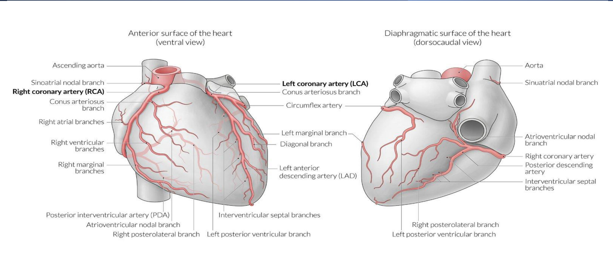


⭐ On the slide's diagram, the **PDA, AV nodal branch and SA nodal branch** arise from the **RCA** (right-dominant pattern). This explains why an **inferior MI (RCA)** can cause **bradycardia/AV block** *[added clinical link]*.

> 🔁 **Recap: Anatomy.** Two main arteries: RCA (right heart, inferior wall, PDA, SA/AV nodal branches) and LCA → LAD (anterior wall + septum) and LCX (lateral wall).
> 🔗 **Link:** Every later topic depends on this map. Ischemia happens in a territory, the ECG leads "look at" territories, and STEMI localization (§2.9) is anatomy read through the ECG.
> ▶️ **Up next: IHD definitions.** What happens when these arteries narrow, and how the disease spectrum is classified.

---

### 2.2 Definitions (Slides 7–9)
⭐ **CAD** = ischemic heart disease from **narrowing or blockage of coronary arteries** → **mismatch between myocardial O₂ supply and demand**.

**CAD spectrum:**
```
CAD
├── Stable angina
└── Acute coronary syndrome (ACS)
      ├── Unstable angina
      ├── NSTEMI
      └── STEMI
```

| Entity | Mechanism (Slide 8) |
|---|---|
| **Stable angina** | ↑ O₂ **demand** with a fixed ↓ **supply** |
| **Unstable angina** | Demand **unchanged**, ↓ **supply** |
| **Myocardial infarction** | **Necrosis** of myocardium due to ↓ supply |

**The four entities side by side (Slide 8 infographic):**
| | Stable angina | Unstable angina | NSTEMI | STEMI |
|---|---|---|---|---|
| Mechanism | ↑ demand on a **stable plaque** (vessel can't dilate enough) | Plaque **ruptures**, thrombus → **partial occlusion**; pain at rest or rapidly progressive | Rupture + thrombus → partial occlusion | **Complete occlusion** of the lumen |
| Result | **Demand ischemia, no infarct** | **Supply ischemia, no infarct** | **Subendocardial infarct** | **Transmural infarct** |
| ECG | Normal | Normal, inverted T, or ST↓ | Normal, inverted T, or ST↓ | **Hyperacute T or ST↑** |
| Troponin | Normal | **Normal** | **Elevated** | **Elevated** |

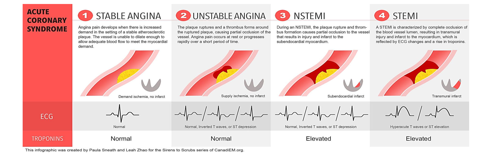


⭐ **Chest pain classification (Slide 9)**. The 3 characteristics:
1. **Substernal** chest discomfort of characteristic **quality and duration**
2. **Provoked by exertion or emotional stress**
3. **Relieved by rest and/or nitrates within minutes**

| Type | Criteria met |
|---|---|
| **Typical (definite) angina** | **All 3** |
| **Atypical (probable) angina** | **2** |
| **Non-anginal chest pain** | **1 or none** |

> 🔁 **Recap: Definitions.** CAD = supply/demand mismatch. Stable angina = demand-driven. UA/MI = supply-driven. Classify pain with the 3 characteristics (3 = typical, 2 = atypical, ≤1 = non-anginal).
> 🔗 **Link:** Once we know what CAD is, the next question is how common it is, both globally and in KSA.
> ▶️ **Up next: Epidemiology.** The burden figures.

---

### 2.3 Epidemiology (Slide 10)
- ⭐ CAD = **leading cause of death worldwide**
- CVD = **37% of all deaths in KSA (2018)** (WHO NCD country profile)
- ⭐ Overall **CAD prevalence in KSA = 5.5%** (Al-Nozha et al., 2004)
  - **Males 6.6%** vs **females 4.4%**

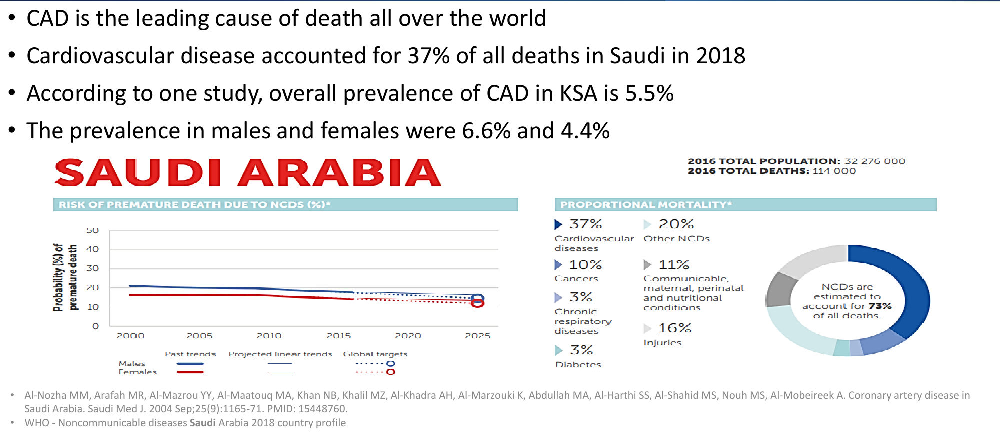


> 🔁 **Recap: Epidemiology.** Top global killer. 37% of KSA deaths. KSA prevalence 5.5% (♂ 6.6 > ♀ 4.4).
> 🔗 **Link:** Burden raises the question of cause. The dominant cause is atherosclerosis, which is driven by risk factors.
> ▶️ **Up next: Etiology.** Atherosclerosis and its modifiable vs non-modifiable risk factors.

---

### 2.4 Etiology (Slide 11)
⭐ **Atherosclerosis = most common cause.**

| Modifiable | Non-modifiable |
|---|---|
| Smoking | **Family history**: CV event in a **first-degree relative** below age **55 (♂) / 65 (♀)** *[sex symbols reconstructed]* |
| DM | **Age**: **♂ ≥ 45 y**, **♀ ≥ 55 y** |
| HTN | |
| Dyslipidemia | |
| High homocysteine | |
| Obesity | |
| High fibrinogen | |
| **Hyperphosphatemia** | |
| Stress | |
| Increased alcohol consumption | |

*Mnemonic [added]:* the less obvious modifiable factors are **"Hi-Pho-Fi-Ho"**: **Hi**gh **Pho**sphate, **Fi**brinogen, **Ho**mocysteine.

> 🔁 **Recap: Etiology.** Atherosclerosis is #1. Ten modifiable factors (including homocysteine, fibrinogen, phosphate). Non-modifiable: age (♂45/♀55) and premature family history (♂<55/♀<65).
> 🔗 **Link:** Risk factors cause damage at the arterial wall. Next is how that damage becomes a plaque and then ischemia.
> ▶️ **Up next: Pathophysiology.** Arterial wall → inflammation → plaque → rupture/thrombosis → ischemia, plus coronary steal.

---

### 2.5 Pathophysiology (Slides 12–18)
**Arterial wall (Slide 12): three structural components**
| Layer | Function (slide) |
|---|---|
| **Adventitia** | Vascularization, innervation |
| **Media** | **Vascular tone** |
| **Intima**, lined by **endothelium** | **Hemostasis vs thrombosis**, **vascular tone regulation**, **vascular permeability regulation**; expresses **adhesion molecules** |

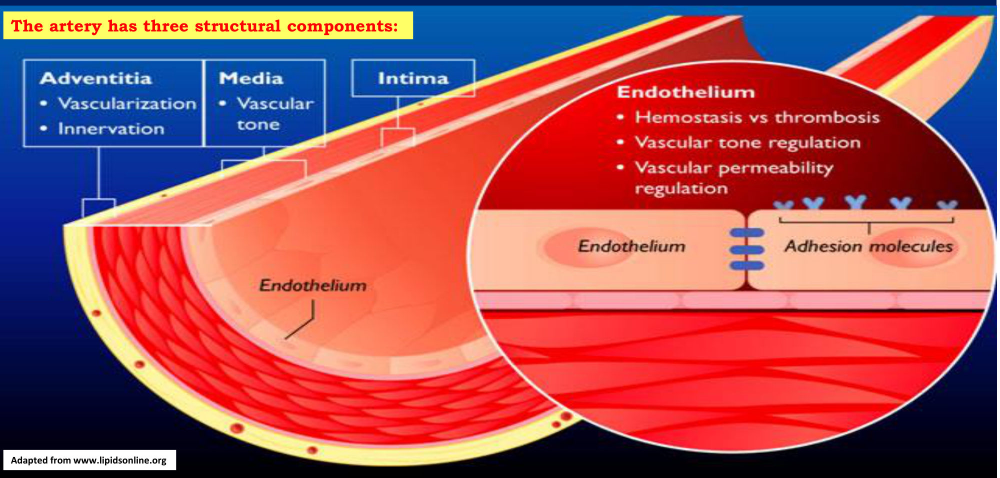

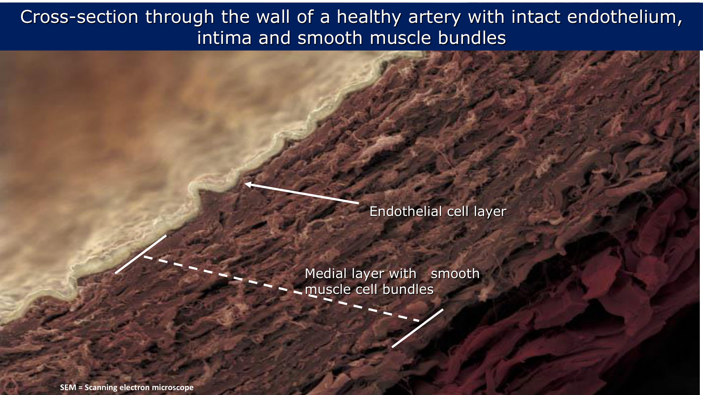 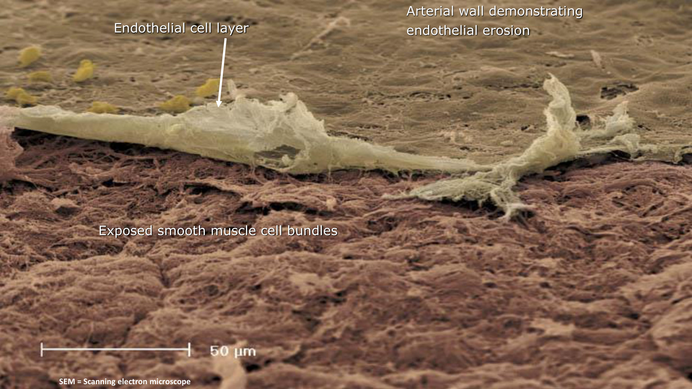


**Sequence:**
1. Healthy artery: **intact endothelium**, intima, smooth-muscle bundles (SEM)
2. **Atherosclerosis = an inflammatory disease** (Slide 14)
3. **Endothelial erosion** → exposed smooth-muscle bundles (SEM)
4. **Plaque rupture → thrombosis** (Slide 16) → the ACS mechanism

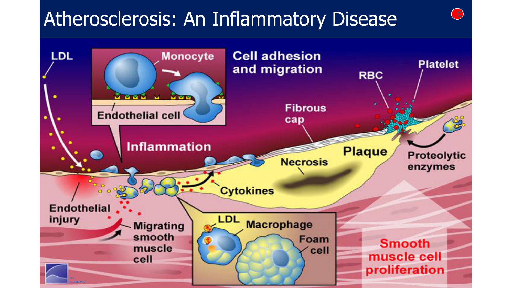

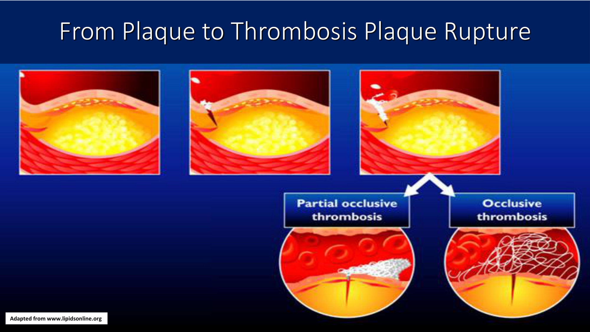


⭐ **Stable plaque cascade (Slide 17), in order:**
1. Stable atherosclerotic plaque
2. → Vascular **stenosis**
3. → ↑ **Resistance** to coronary flow
4. → ↓ Myocardial blood flow
5. → **O₂ supply–demand mismatch**
6. → **Myocardial ischemia**

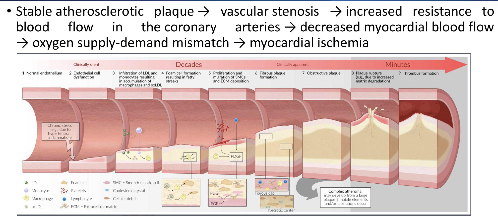


⭐ **Coronary steal syndrome (Slide 18):**
- In CAD, arterioles distal to a stenosis are **already fully dilated** (autoregulation). Normal areas keep **normal arteriolar tone**.
- A **vasodilator** (e.g., adenosine, dipyridamole) dilates only the **normal** bed, which has room to dilate → **flow to normal area ↑**, **flow to ischemic area ↓** (blood is "stolen", including through collaterals).
- This is the **basis of pharmacologic vasodilator stress testing**.

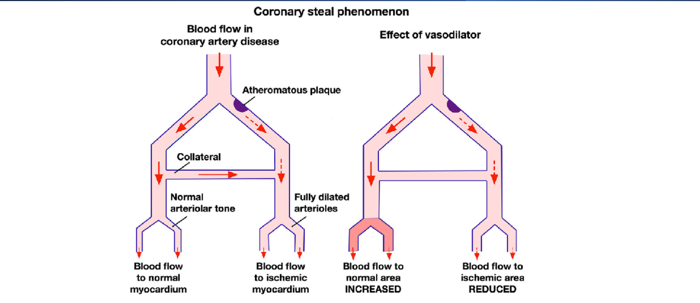


> 🔁 **Recap: Pathophysiology.** Inflammation → endothelial erosion → plaque. Stable plaque = fixed stenosis → demand ischemia. Rupture + thrombosis = ACS. Vasodilators "steal" flow from already-maximally-dilated ischemic beds.
> 🔗 **Link:** Ischemia is the mechanism. Next is what the patient actually feels and shows.
> ▶️ **Up next: Clinical features.** The typical pain, and who presents atypically.

---

### 2.6 Clinical Features (Slide 19)
- Typically **retrosternal chest pain or pressure**
- ⭐ Pain **may be absent**, especially in **geriatric, women, and diabetic** patients
- Dyspnea
- Dizziness, palpitations
- Restlessness, anxiety
- **Autonomic**: diaphoresis, nausea, vomiting, syncope

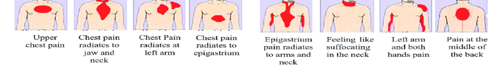


> 🔁 **Recap: Clinical features.** Retrosternal pressure plus autonomic symptoms. The elderly, women and diabetics may have no pain.
> 🔗 **Link:** Symptoms raise suspicion. Diagnostics confirm it. For stable angina, the choice of test depends on how likely CAD is beforehand.
> ▶️ **Up next: Stable angina diagnostics.** ECG → pretest probability → stress testing → CT → catheterization.

---

### 2.7 Stable Angina: Diagnostics (Slides 20–27)
**ECG = best initial test** ⭐
- **Usually normal** in stable CAD
- May show **Q waves** (prior MI)
- **Nonspecific T-wave changes** (inversion, flattening). Slide 21 shows T-wave inversions in II, III, aVF and V1–V6.

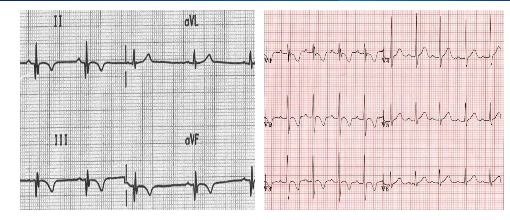


⭐⭐ **Pretest probability (PTP) of CAD (Slide 22):**
| PTP | Clinical presentation | Recommendation |
|---|---|---|
| **Low (<10%)** | Asymptomatic, all ages · Atypical chest pain in **women < 50** | Further testing **often unnecessary** |
| **Intermediate (20–80%)** | Atypical angina in **men, all ages** · Atypical angina in **women ≥ 50** · Typical angina in **women 30–50** | **Exercise stress test** |
| **High (>90%)** | Typical angina in **men ≥ 40** · Typical angina in **women ≥ 60** | Exercise stress test **vs. proceed to cardiac catheterization** |

**Cardiac stress testing (Slides 23–25):** detects **stress-induced ischemia**
- Target = ⭐ **85% of maximum HR**, max HR = **220 − age**
- Stress type + stress diagnostic modality (see Table C)
- ⭐ **Test termination criteria:**
  1. Reaching a **diagnostic endpoint**
  2. Reaching **target HR** (no diagnostic endpoint)
  3. Significant **cardiac arrhythmia**
  4. **Patient unable** to complete

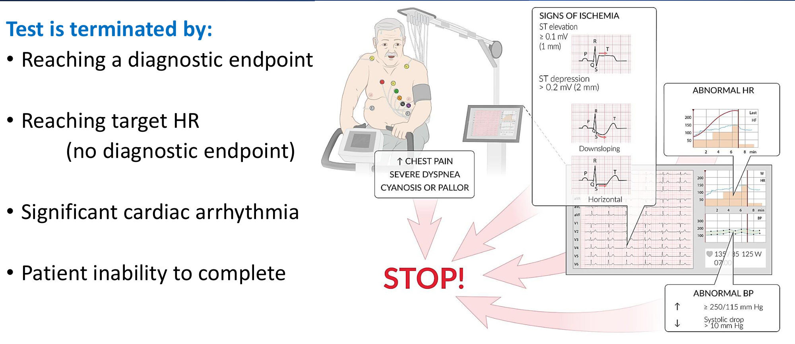


**Types of stress (Slide 24):**
- **Exercise**: "Everyone who can exercise should!" Must reach 85% of predicted HR.
- **Pharmacologic, vasodilators** (adenosine, dipyridamole, regadenoson): ↑ cAMP → vascular smooth-muscle relaxation → coronary vasodilation.
  - ⭐ **Contraindications:** **bradycardia & hypotension** (avoid in **2nd/3rd-degree heart block without pacemaker**) and **bronchoconstriction** (avoid in **severe COPD and asthma**)
- **Pharmacologic, inotropes** (**dobutamine**, β1 + β2 agonist)
  - ⭐ Contraindication: **ventricular arrhythmias**

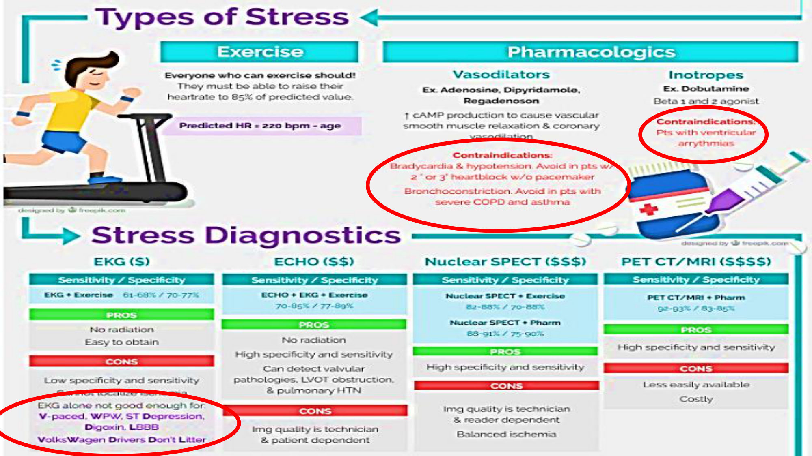


⭐ **Mnemonic (on slide): "VolksWagen Drivers Don't Litter"** = ECG alone is **not enough** (baseline ECG uninterpretable for ischemia) with:
**V**-paced · **W**PW · baseline **S**T **D**epression · **D**igoxin · **L**BBB → add imaging (echo/nuclear).

**Other non-invasive tests (Slide 26):** Coronary **CT angiography** · **Coronary artery calcium (CAC) scoring**

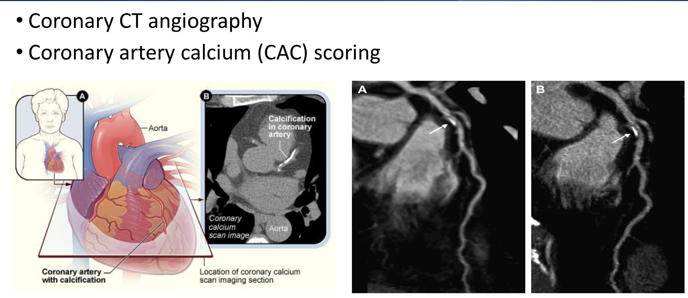


**Cardiac catheterization = gold standard** ⭐ (Slide 27). Indications:
1. **Acute MI**
2. **Positive stress test**
3. Non-invasive tests **non-diagnostic / contraindicated**
4. Angina **despite medical therapy**

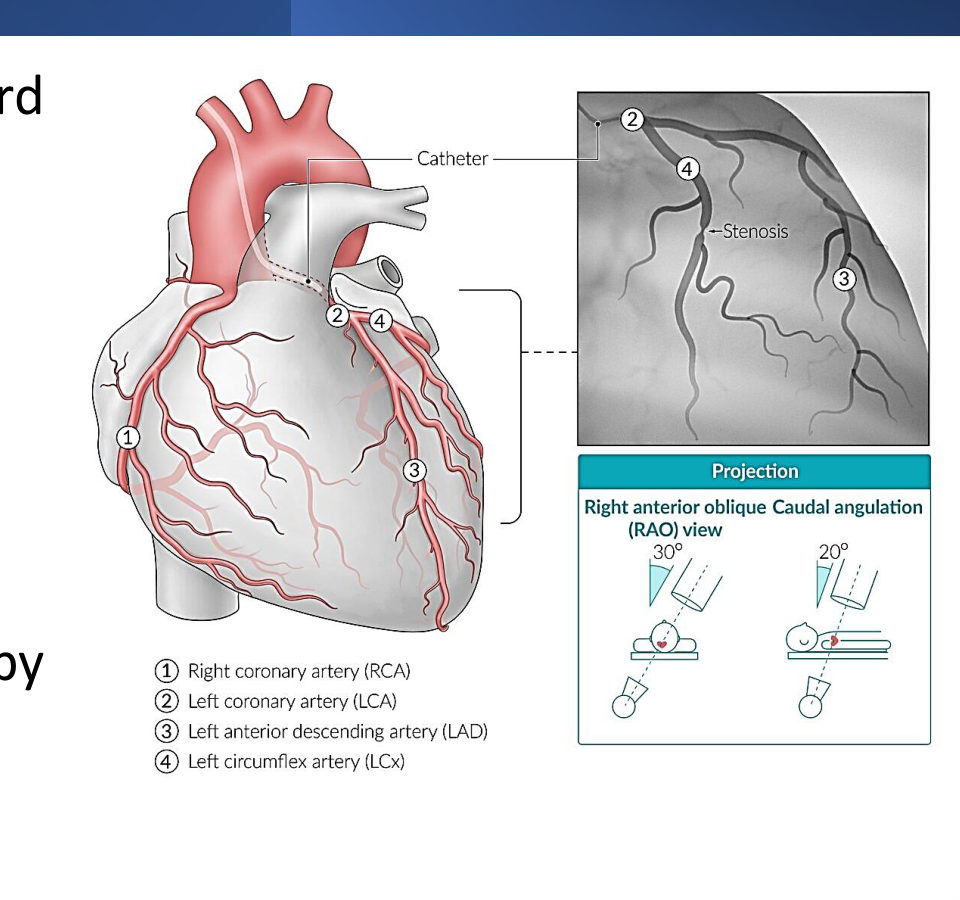


> 🔁 **Recap: Stable angina diagnostics.** ECG first (usually normal). PTP decides the next step: low → no test, intermediate → exercise stress, high → stress or cath. Target 85% of (220 − age). Vasodilators are contraindicated in asthma/COPD and heart block, dobutamine in ventricular arrhythmias. Cath is the gold standard.
> 🔗 **Link:** Once stable CAD is confirmed, every patient needs a treatment plan. Diagnosis tells us who has the disease, management tells us how to reduce ischemia and future events.
> ▶️ **Up next: Stable angina management.** Lifestyle, comorbidity targets, antianginal vs secondary-prevention drugs, and the limited role of revascularization.

---

### 2.8 Stable Angina: Management (Slides 28–32)
**All patients:** pharmacotherapy = comorbidity management + **secondary prevention** + **antianginals**
**Select patients:** revascularization, either **PCI** or **CABG**

**Lifestyle (all):** smoking cessation, ↑ physical activity

⭐ **Comorbidity targets:**
| Comorbidity | Target |
|---|---|
| HTN | **BP < 130/80 mm Hg** |
| DM | Individualized, ideally **HbA1c < 7%** |
| Hyperlipidemia | **LDL < 70 mg/dL** |

**Drug classes (Slide 30):**
| Role | Drugs |
|---|---|
| **Antianginal only** | Nitrates, CCBs, metabolic modulators |
| ⭐ **Both antianginal + secondary prevention** | **Beta-blockers** |
| **Secondary prevention only** | ACEi/ARB (selected patients), lipid-lowering agents, antiplatelet agents |

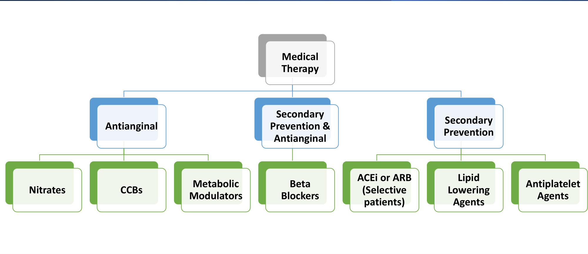


**Secondary-prevention meds (Slide 31):**
- **Aspirin**
- **Clopidogrel** (P2Y12 antagonist) **if aspirin is contraindicated**
- **ACEi/ARB** if **HTN, DM, CKD, or LVEF < 40%**
- **High-intensity statin**
- **PCSK9 inhibitor** if LDL not at goal on statin

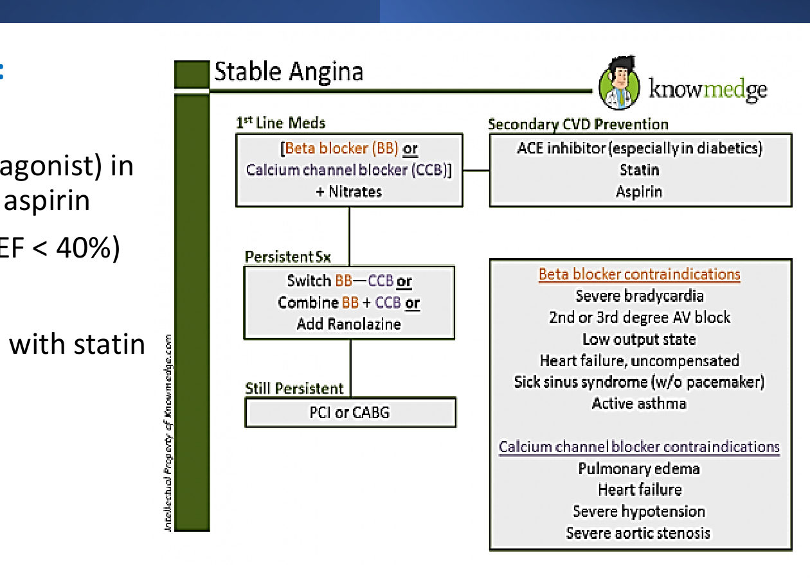


**Revascularization in stable CAD (Slide 32):**
- **Controversial**
- ⭐ **COURAGE trial:** **no improvement in mortality or MI** vs medical therapy alone
- Decided by the cardiologist

> 🔁 **Recap: Stable angina management.** Lifestyle + targets (130/80, HbA1c <7, LDL <70). β-blockers are the only class that is both antianginal and secondary prevention. Aspirin (or clopidogrel), statin, ACEi/ARB if indicated. COURAGE: PCI doesn't beat meds in stable disease.
> 🔗 **Link:** Stable angina comes from a fixed plaque. When the plaque ruptures and a thrombus forms (§2.5), the picture becomes an acute coronary syndrome, where time is myocardium.
> ▶️ **Up next: ACS.** How UA, NSTEMI and STEMI are distinguished (biomarkers + ECG), how they present, and how they are diagnosed.

---

### 2.9 Acute Coronary Syndrome: Definitions, Features, Diagnostics (Slides 33–44)

⭐⭐ **ACS classification:**
| | Biomarkers (troponin) | ST elevation on ECG |
|---|---|---|
| **Unstable angina** | **Negative** | No |
| **NSTEMI** | **Positive** | **No** |
| **STEMI** | **Positive** | **Yes** |

**Clinical features (Slides 34–35):**
- Chest pain: dull, squeezing pressure, acute, retrosternal. Precipitated by stress.
- Dyspnea, pallor, nausea, vomiting, diaphoresis, anxiety, dizziness/lightheadedness/syncope
- **Atypical** in the elderly, diabetics, women
- ⭐ **"Silent MI" in diabetics** due to **polyneuropathy**
- ⭐ **RV infarction triad:** **Hypotension + elevated JVP + clear lung fields**

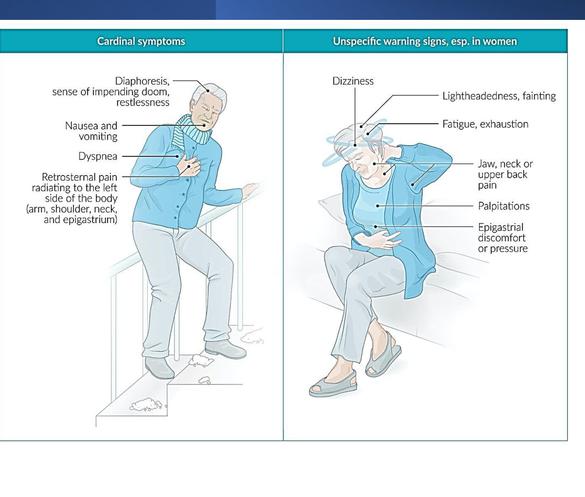


**Diagnostics:**
1. ⭐ **ECG immediately** when ACS is suspected (**best initial test**)
2. **Administer ASA + obtain ECG** →
   - **STEMI** → **immediate revascularization, door-to-balloon 90 min**
   - **NSTEMI** → strategy guided by ECG, troponin, clinical features, risk factors
3. ⭐ **Troponin T/I = most important cardiac marker** (high sensitivity)
   - **Trend until peaked**. Repeat if symptoms or ECG change.
   - ⭐ **CK-MB** is useful for evaluating **reinfarction**
4. **Echocardiography** is generally **not necessary** and **must not delay reperfusion**
   - Indications: **cardiogenic shock**, infarct-like symptoms with **inconclusive ECG**, evaluation for **MI complications**
   - Findings: **wall-motion abnormalities**, ↓ LV function

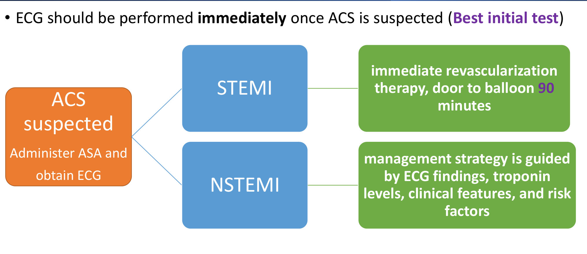

**Cardiac marker kinetics (Slide 37 graph):**
| Marker | Rises | Peaks | Back to normal |
|---|---|---|---|
| **Myoglobin** | First (hours) | ~6–12 h | ~1 day |
| **CK-MB** | ~3–6 h | ~18–24 h | ~2–3 days (so it is useful for **reinfarction**) |
| ⭐ **Troponin** | ~3–6 h | ~day 1–2 (up to ~50× ULN in extensive MI) | ~1–2 weeks |
| **LDH** | ~day 1 | ~day 4 | ~2–3 weeks |
*Times are read off the slide's graph (approximate).*

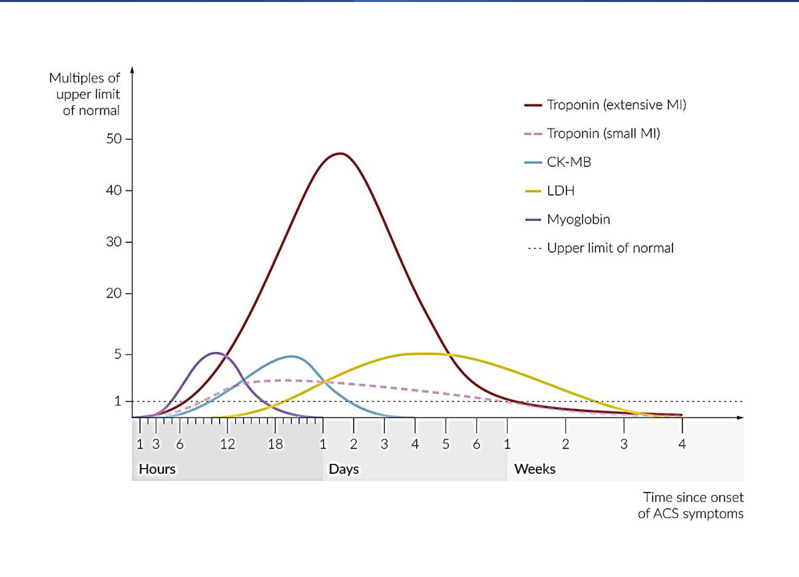


⭐ **STEMI ECG evolution (Slide 39):**
| # | Time | Changes |
|---|---|---|
| 1 | Normal | Normal |
| 2 | **Acute** | **ST elevation** (hyperacute) |
| 3 | **Hours** | ST elevation, **↓ R wave**, **Q wave begins** |
| 4 | **Day 1–2** | **T-wave inversion**, **Q wave deeper** |
| 5 | **Days later** | **ST normalizes**, T still inverted |
| 6 | **Weeks later** | ST & T normal, ⭐ **Q wave persists** |
*With successful early reperfusion, ST returns to baseline **without** T inversion or Q waves.*

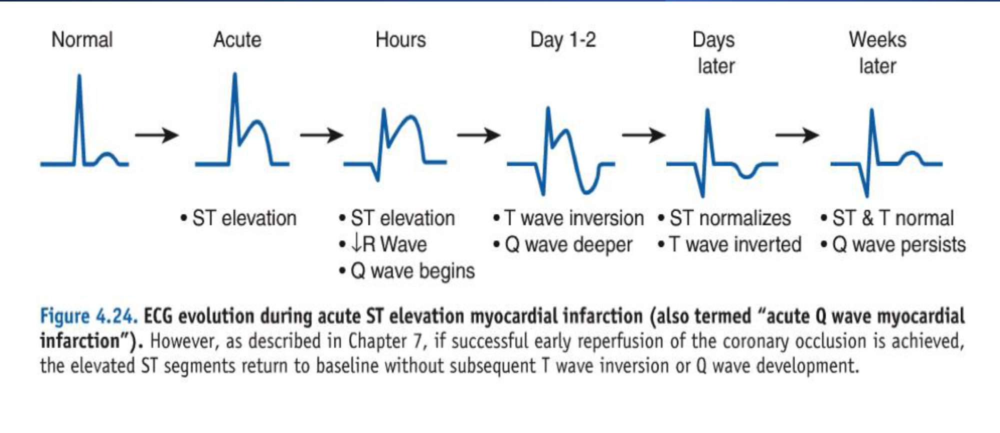


⭐⭐ **STEMI localization (Slide 42):**
| Infarct location | Leads (ST↑ or Q) | Vessel |
|---|---|---|
| **Anteroseptal** | **V1–V2** | **LAD** |
| **Anteroapical** | **V3–V4** | **Distal LAD** |
| **Anterolateral** | **V5–V6** | **LCX** (per slide) |
| **Lateral** | **I, aVL** | **LCX** |
| **Inferior** | **II, III, aVF** | **RCA** |
| **Posterior** | **V7–V9** | **PDA** |

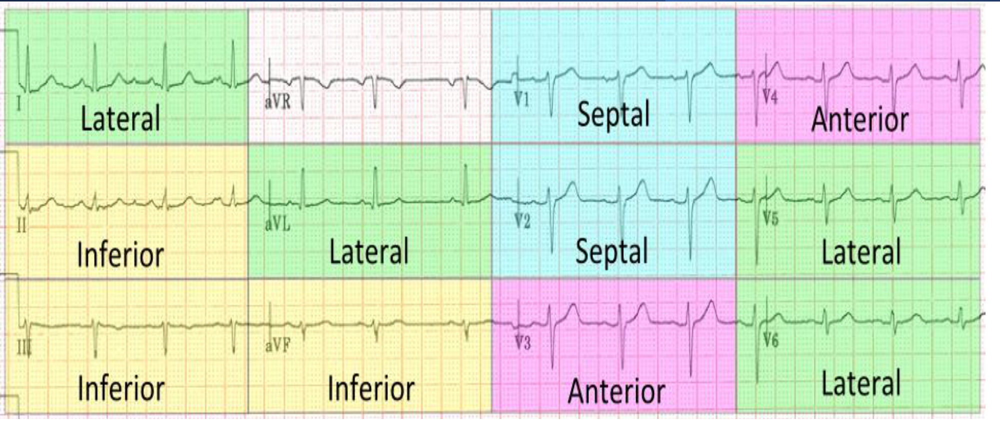

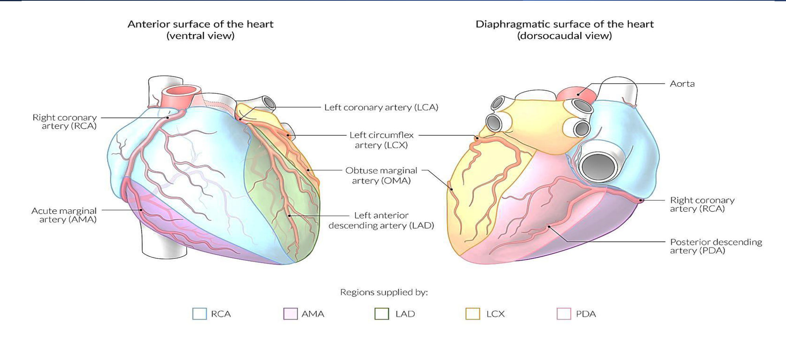


Example ECGs: Slide 43 shows an **inferior** STEMI pattern (ST↑ II, III, aVF). Slide 44 shows an **anterior/anteroseptal** STEMI (ST↑ V1–V5) *[interpretation added]*.

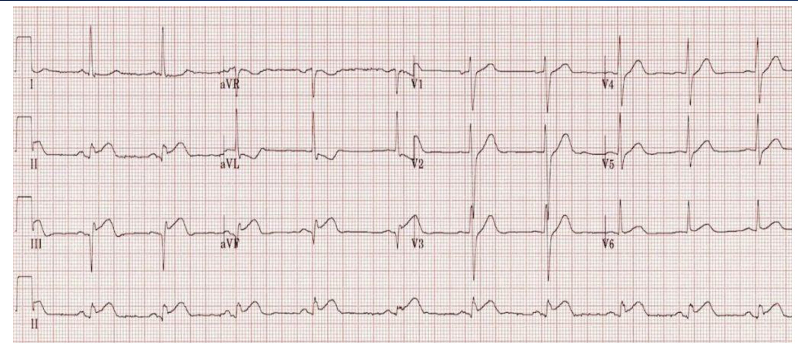

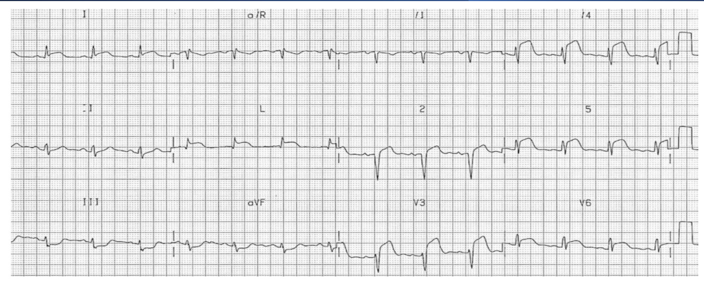


*Mnemonic [added]:* **"2-4-6 → S-A-L"**: V1–**2** **S**eptal, V3–**4** **A**pical, V5–**6** **L**ateral. **"I Love aVL → Lateral"**; **"II, III, aVF → Inferior → RCA"**.

> 🔁 **Recap: ACS diagnosis.** UA (troponin −) / NSTEMI (troponin +, no ST↑) / STEMI (troponin +, ST↑). ECG immediately plus aspirin. Trend troponin; CK-MB for reinfarction. Echo must never delay reperfusion. ECG evolution: ST↑ → Q → T inversion → Q persists. Localize by leads (Table E).
> 🔗 **Link:** The ECG split (ST↑ or not) decides treatment. STEMI = complete occlusion → reperfuse now. NSTEMI/UA = risk-stratify first.
> ▶️ **Up next: STEMI management.** Reperfusion (PCI vs fibrinolysis), time targets, fibrinolysis contraindications, and adjunct drugs.

---

### 2.10 Management: STEMI (Slides 45–49)
Pillars: **Oxygen (SpO₂ < 90%)** · **Revascularization** · **Medications**
⭐ Prompt reperfusion **restores flow, limits myocardial damage, ↓ mortality**.

⭐⭐ **Reperfusion choice:**
| | **Emergency coronary angiography + PCI** (preferred) | **Fibrinolytic therapy** |
|---|---|---|
| Indication | Within **12 h** of symptom onset **AND** ≤ **90 min** from first medical contact (**PCI-capable** facility) **OR** ≤ **120 min** (**non-PCI-capable**, i.e., transfer) | PCI **cannot** be done **≤ 120 min** from first medical contact **AND** **no contraindications** |
| Procedure / agents | **Balloon dilatation + stent implantation** | **Tenecteplase, Alteplase, Reteplase, Streptokinase** |

**Reperfusion strategy details (Slide 45):**
- ⭐ **FMC → STEMI diagnosis < 10 min** (at any site)
- At a **PCI centre**: FMC → primary PCI **< 90 min**
- At a **non-PCI centre**: if FMC → PCI **< 120 min**, **transfer for PCI** (transfer time **≤ 60 min**)
- If PCI can't happen within 120 min → **fibrinolysis, FMC → needle < 30 min** (the slide prints "30 h"; this is a typo for minutes)
- After lysis: **routine rapid transfer**. **Failed fibrinolysis → immediate PCI**. **Successful → routine PCI within 24 h** (the **pharmacoinvasive strategy**)

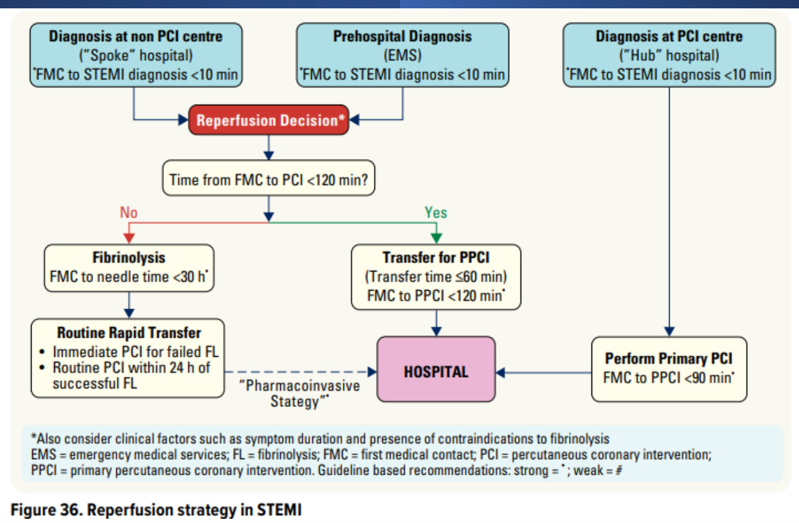

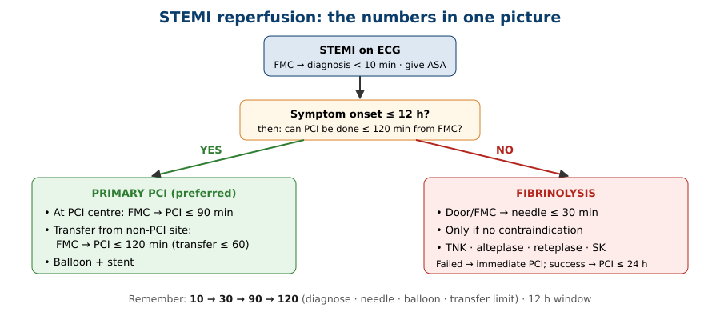


⭐ **Fibrinolysis contraindications (Slide 47):**
| Absolute | Relative |
|---|---|
| Prior **intracranial hemorrhage** (any time) | Chronic, severe, poorly controlled HTN |
| Known structural **cerebral vascular lesion** | **Uncontrolled HTN (SBP > 180, DBP > 110)** |
| Known malignant **intracranial neoplasm** | Current **anticoagulation** |
| Significant closed-head/facial **trauma ≤ 3 mo** | **Noncompressible** vascular punctures |
| **Ischemic stroke ≤ 3 mo** | Ischemic stroke **≥ 3 mo** |
| **Active bleeding** | Recent internal bleeding (**≤ 2–4 wk**) |
| Suspected **aortic dissection** | Prolonged CPR or major surgery (**≤ 3 wk**) |
| | **Pregnancy** |
| | Active **peptic ulcer** disease |

*Pattern:* stroke **≤ 3 mo = absolute**, **≥ 3 mo = relative**.

Slide 48: drug-eluting (sirolimus) stent, angiographic patency sustained at 4, 12, 24, 48 months.

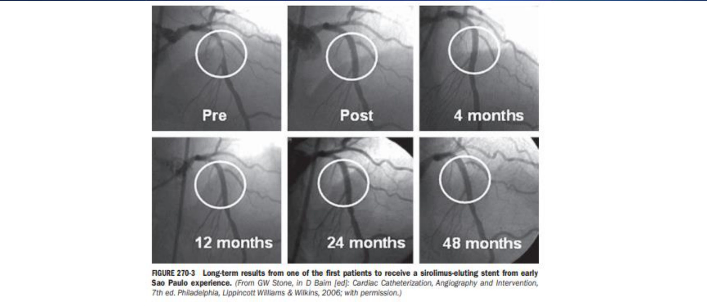


⭐ **STEMI medications (Slide 49):** mnemonic ***"MONA + BASH C"*** *[added]*
| Drug | Note |
|---|---|
| **M**orphine | Pain |
| **O**xygen | Only if **SpO₂ < 90%** |
| **N**itrates | |
| **A**SA | |
| **B**eta-blockers | ⭐ **Only if NOT in HF / not at risk of shock** |
| **A**CEi | STEMI, HTN, DM, HFrEF |
| **S**tatin | **High-intensity** |
| **H**eparin | **48 hours** |
| **C**lopidogrel | P2Y12 receptor blocker (DAPT with ASA) |

> 🔁 **Recap: STEMI management.** Reperfuse. PCI if ≤90 min (PCI centre) or ≤120 min (transfer), within 12 h. Otherwise lyse if no contraindications. Know absolute vs relative contraindications. Drugs: MONA + BASH C, with β-blocker only if no HF/shock risk.
> 🔗 **Link:** Without ST elevation (no complete occlusion), there is no emergency reperfusion. Management is instead driven by risk stratification.
> ▶️ **Up next: NSTEMI/UA.** ECG findings, the same drug backbone, TIMI/GRACE risk strata, and indications for urgent revascularization.

---

### 2.11 NSTEMI / Unstable Angina (Slides 50–55)
**ECG:** **No ST elevation.** Nonspecific ischemia may be present: **ST depression, T-wave inversion**. Slide 51 shows ST depression/T inversion in the lateral leads *[interpretation added]*.

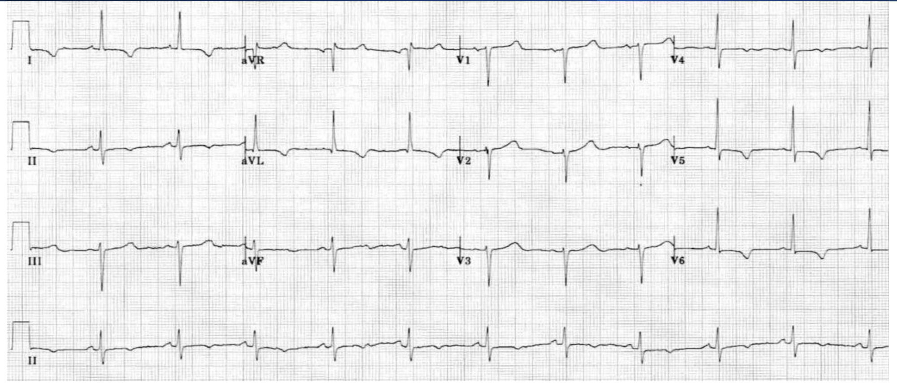


**Medications (Slide 52):** **same list as STEMI** (morphine, O₂ if SpO₂ < 90%, nitrates, ASA, β-blockers only if no HF/shock risk, ACEi for **HTN, DM, HFrEF**, high-intensity statin, heparin 48 h, clopidogrel).
*Only difference on the slides:* for STEMI, ACEi indications include **"STEMI"** itself. For NSTEMI, only HTN/DM/HFrEF.

⭐⭐ **Risk stratification (Slide 53)**. Start aspirin, β-blocker, nitrates, statin, then:
| Risk | **TIMI** | **GRACE** | Strategy | Timing |
|---|---|---|---|---|
| **High** | **5–7** | **141–372** | **Early invasive** | **Within 24 h** (urgent/immediate angiography) |
| **Intermediate** | **3–4** | **109–140** | **Delayed invasive** | **25–72 h** (consider angiography) |
| **Low** | **0–2** | **1–108** | **Ischemia-guided** | → **Stress testing** |

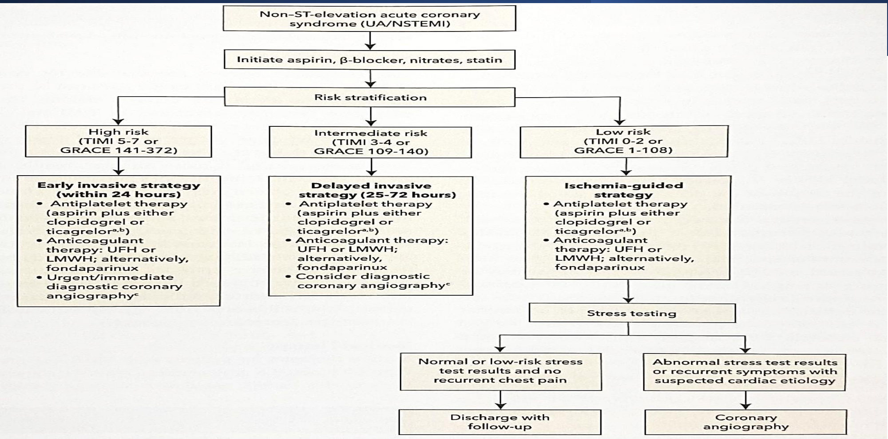


All strata: **antiplatelet** (aspirin + clopidogrel **or** ticagrelor) + **anticoagulant** (UFH or LMWH; alternatively **fondaparinux**).
Low-risk pathway: stress test **normal/low-risk + no recurrent pain → discharge with follow-up**. **Abnormal or recurrent symptoms → coronary angiography.**

- ⭐ **> 90%** improve with medical regimen within **1–2 days** (Slide 54)
- Further management depends on **mortality risk (TIMI)**, clinical findings, resources → **invasive vs ischemia-guided**

⭐ **TIMI UA/NSTEMI risk score (Slide 54):** 1 point each, 7 items
1. **Age ≥ 65**
2. **≥ 3 risk factors for CAD**
3. **Use of ASA in the last 7 days**
4. **Known CAD (prior stenosis ≥ 50%)**
5. **> 1 episode of rest angina in < 24 h**
6. **ST-segment deviation**
7. **Elevated cardiac markers**

*Mnemonic [added]:* **"AGE-3-ASA-CAD-2-ST-Marker"**, or count **7 items for TIMI 0–7**.
**GRACE** (also on the slide) uses age, HR, SBP, creatinine, Killip/CHF class, cardiac arrest at admission, ST deviation, elevated enzymes.

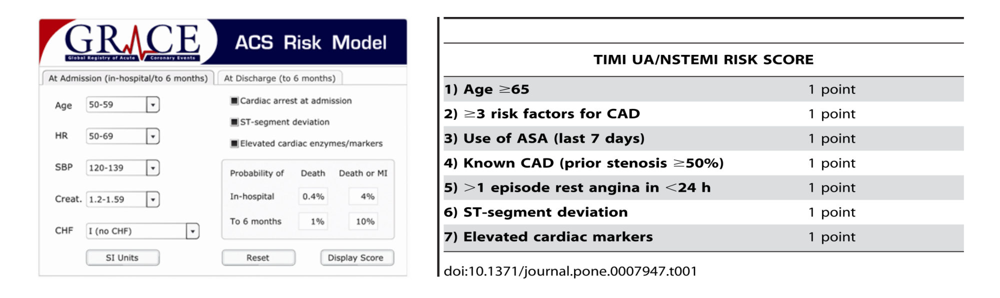


⭐ **Urgent revascularization indications in NSTEMI (Slide 55):**
1. **Hemodynamic instability**
2. **Life-threatening arrhythmias**
3. **Refractory ischemic pain**
4. **Acute heart failure**
5. **Mechanical complications** (e.g., new/worsened **MR**)

> 🔁 **Recap: NSTEMI/UA.** No ST↑ (ST↓ / T inversion possible). Same drug backbone. TIMI/GRACE → high (<24 h invasive), intermediate (25–72 h), low (ischemia-guided + stress test). Urgent revasc for instability, arrhythmia, refractory pain, AHF, mechanical complications.
> 🔗 **Link:** Whatever the type of ACS, dead myocardium causes predictable problems at predictable times. Electrical problems come first, then inflammatory, then mechanical, then remodeling.
> ▶️ **Up next: MI complications.** Arranged as a timeline, the objective the lecture explicitly flagged.

---

### 2.12 MI Complications (Slides 56–57)
⭐⭐⭐ **Timeline:**
| # | Time post-MI | Complications |
|---|---|---|
| 1 | **0–24 h** | **Sudden cardiac death** · ⭐ **Arrhythmias** (**most common cause of death in first 24 h**) · **Acute LHF** · **Cardiogenic shock** |
| 2 | **1–3 days** | **Acute pericarditis** |
| 3 | **3–14 days** | **Papillary muscle rupture (→ MR)** · **Free wall rupture (→ tamponade)** · **Ventricular septal rupture** · **LV pseudoaneurysm** |
| 4 | **2 weeks → months** | **Atrial & ventricular aneurysms** · **Dressler syndrome** (post-MI syndrome) · Arrhythmias · HF |

*Mnemonic [added]:* **"Electric → Inflamed → Rupture → Remodel"** (24 h → 1–3 d → 3–14 d → weeks). The 3–14 d rupture window corresponds to macrophage clearance of necrotic tissue, when the wall is weakest *[added]*.

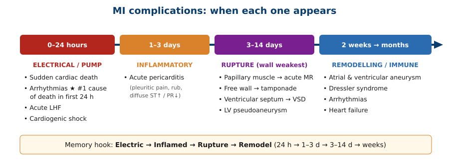


**Post-cardiac injury syndrome, PCIS (Slide 57):**
- **Acute pericarditis**: **≥ 2 of 4**: (1) pericarditic chest pain, (2) pericardial rub, (3) **diffuse ST elevation or PR depression**, (4) new/worsening pericardial effusion
- **Incessant pericarditis**: continuous symptoms **> 4–6 weeks and < 3 months**
- **Chronic pericarditis**: **> 3 months**
- **Recurrent pericarditis**: recurrence after a **symptom-free period of 4–6 weeks**
- **Cardiac tamponade**: rapid/large fluid accumulation compressing the heart
- **Pericardial effusion**: **small < 10 mm**, **moderate 10–20 mm**, **large > 20 mm**
- **Constrictive pericarditis**: abnormal diastolic filling from thickened/fibrotic pericardium
  - **Transient**: reversible after anti-inflammatory therapy
  - **Effusive-constrictive**: **RA pressure > 10 mm** persistent after pericardiocentesis
  - **Chronic constrictive**: persists after **3–6 months** of medical therapy

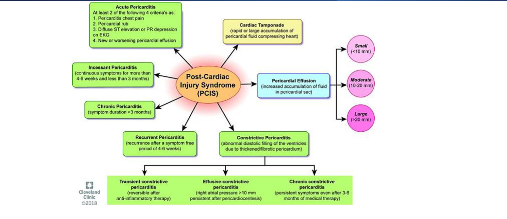


> 🔁 **Recap: MI complications.** 0–24 h arrhythmia/death/shock. 1–3 d pericarditis. 3–14 d ruptures (papillary → MR, free wall → tamponade, septum → VSD, pseudoaneurysm). Weeks: aneurysm, Dressler, HF. PCIS subtypes are defined by duration cut-offs (4–6 wk, 3 mo).
> 🔗 **Link:** Everything so far came from atherosclerotic plaque. The last topic is an angina variant where the arteries can be normal and the problem is spasm, so the rules (risk factors, drugs) partly invert.
> ▶️ **Up next: Vasospastic (Prinzmetal) angina.** Who gets it, how to diagnose it, and why β-blockers are avoided.

---

### 2.13 Subtypes: Vasospastic Angina (Slides 58–60)
**Definition / risk:**
- **Transient coronary spasm**
- Often **young women**, onset **~50 y**
- ⭐ **Not related to exertion**; may occur **at rest**
- Triggers: **cigarette smoking**; **stimulants (cocaine, amphetamines)**, **alcohol**, **triptans**; **stress, hyperventilation, cold**
- Associated with other vasospastic disorders: **Raynaud phenomenon, migraine**
- ⭐ **Common atherosclerotic risk factors do NOT apply, except smoking**

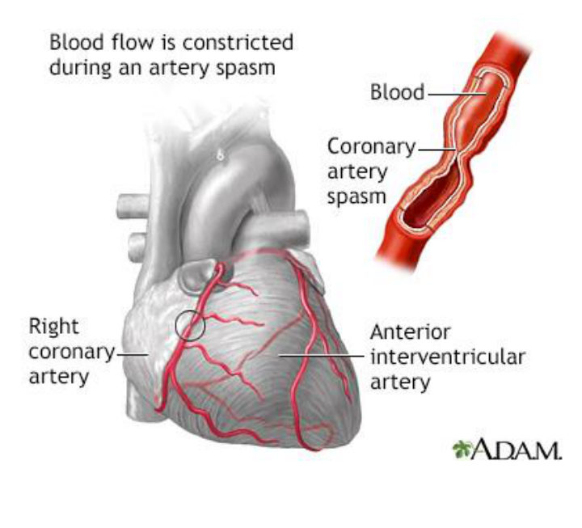


**Diagnostics:**
- **Resting ECG**: ⭐ **transient ST elevation**, **U waves**
- **Serial troponin I/T** during pain episodes, which are ⭐ **usually NOT elevated** (transient ischemia)

**Management:**
- Smoking cessation
- ⭐ **Avoid β-blockers** and other vasoconstricting agents
- Atherosclerotic risk-factor modification as appropriate
- ⭐ **1st line: CCBs** (verapamil, diltiazem, nifedipine)
- Alternative: **long-acting nitrates** (isosorbide dinitrate)
- Prognosis good: **5-year survival > 90%** with treatment

> 🔁 **Recap: Vasospastic angina.** Spasm, not plaque. Rest pain in younger women. Transient ST↑, troponin usually normal. CCB first line, nitrates second, never β-blockers. Smoking is the only classic risk factor that applies.
> 🔗 **Link:** With every entity covered, the lecture closes by putting ACS into one algorithm from first contact to disposition.
> ▶️ **Up next: ACS treatment algorithm.**

---

### 2.14 Summary: ACS Treatment Algorithm (Slides 61–62)

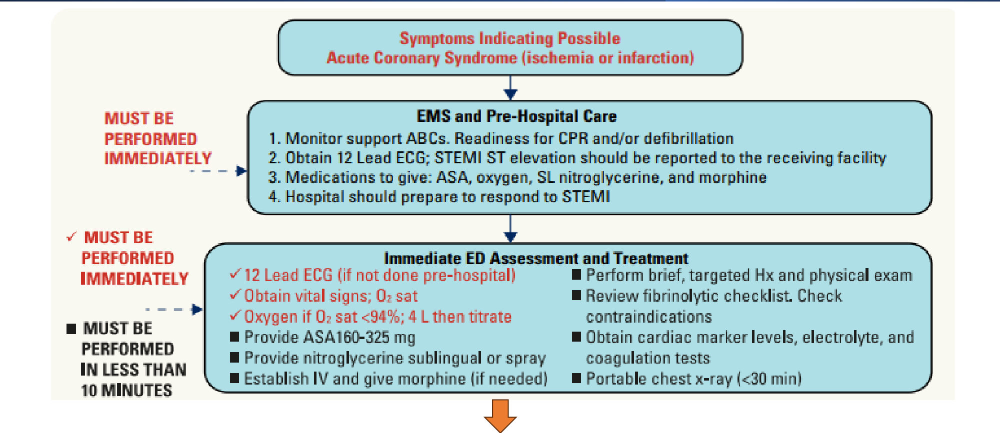

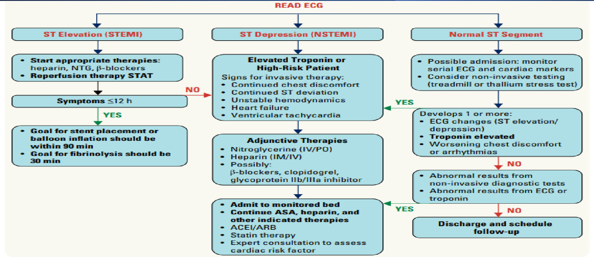

**EMS / pre-hospital (immediately):**
1. Monitor/support **ABCs**; be ready for CPR/defibrillation
2. **12-lead ECG**; report STEMI to the receiving facility
3. Give **ASA, oxygen, SL nitroglycerin, morphine**
4. Hospital prepares to respond to STEMI

**ED, performed in < 10 minutes:**
- 12-lead ECG (if not done) · vitals, O₂ sat · ⚠️ **O₂ if sat < 94%** (4 L then titrate)
- ⭐ **ASA 160–325 mg** · **nitroglycerin** SL/spray · IV access + **morphine** if needed
- Brief history/exam · **fibrinolytic checklist** (contraindications)
- Cardiac markers, electrolytes, coagulation · **portable CXR (< 30 min)**

**Read the ECG → 3 arms:**
| ST elevation (STEMI) | ST depression (NSTEMI) | Normal ST |
|---|---|---|
| Heparin, NTG, β-blockers + **reperfusion STAT** | **Elevated troponin or high-risk** → invasive therapy if: continued pain, continued ST deviation, unstable hemodynamics, HF, VT | Possible admission, serial ECG + markers, consider non-invasive test (treadmill/thallium) |
| Symptoms **≤ 12 h** → ⭐ **stent/balloon ≤ 90 min**, ⭐ **fibrinolysis (door-to-needle) ≤ 30 min** | Adjuncts: NTG, heparin, ± β-blocker, clopidogrel, **GP IIb/IIIa inhibitor** | New ECG changes / ↑ troponin / worsening pain → **NSTEMI arm** |
| > 12 h → NSTEMI-type pathway | Admit monitored bed; continue ASA, heparin; ACEi/ARB, statin | Abnormal tests → admit; all normal → **discharge + follow-up** |

> 🔁 **Recap: Algorithm.** EMS: ABC, ECG, ASA/O₂/NTG/morphine. ED within 10 min: ECG, ASA 160–325, checklist, CXR <30 min. Then the ECG decides: STEMI → balloon ≤90 / needle ≤30 min; NSTEMI → troponin/risk → invasive vs medical; normal → observe and test.
> 🔗 **Link:** The closing cases test the two skills the lecture emphasized most: choosing a test from pretest probability, and the mechanism of vasodilator stress (coronary steal).
> ▶️ **Up next:** Cases 1 & 2, answered in §7.

---

## 3. High-Yield Comparison Tables

### Table A: Stable angina vs UA vs NSTEMI vs STEMI vs Vasospastic
| Feature | Stable angina | Unstable angina | NSTEMI | STEMI | Vasospastic |
|---|---|---|---|---|---|
| Mechanism | ↑ Demand, fixed stenosis | ↓ Supply, demand unchanged | ↓ Supply → necrosis | Complete occlusion → necrosis | Transient spasm |
| Trigger | Exertion / emotion | Rest / crescendo | Rest | Rest | **Rest**, not exertion |
| Troponin | − | **−** | **+** | **+** | Usually − |
| ECG | Usually normal | ST↓ / T inv or normal | ST↓ / T inv, **no ST↑** | **ST↑** | **Transient ST↑**, U waves |
| Key Rx | Meds ± revasc | Risk-stratify | Risk-stratify (TIMI/GRACE) | **PCI ≤ 90/120 min** or lysis | **CCB**; avoid β-blocker |

### Table B: Pretest probability → test *(see §2.7)*
| PTP | Who | Next step |
|---|---|---|
| Low < 10% | Asymptomatic; atypical ♀ < 50 | No testing |
| Intermediate 20–80% | Atypical ♂ any age; atypical ♀ ≥ 50; typical ♀ 30–50 | Exercise stress test |
| High > 90% | Typical ♂ ≥ 40; typical ♀ ≥ 60 | Stress test vs cath |

### Table C: Stress modalities
| Modality | Sens / Spec | Pros | Cons |
|---|---|---|---|
| **ECG ($)** + exercise | 61–68% / 70–77% | No radiation, easy | Low sens/spec, can't localize ischemia, useless with **VWDDL** |
| **Echo ($$)** + ECG + exercise | 70–85% / 77–89% | No radiation, high sens/spec, detects valve disease, LVOT obstruction, pulm HTN | Technician- & patient-dependent |
| **Nuclear SPECT ($$$)** | Exercise 82–88% / 70–88%; Pharm 88–91% / 75–90% | High sens/spec | Reader-dependent; misses **balanced ischemia** |
| **PET CT/MRI ($$$$)** + pharm | 92–93% / 83–85% | Highest sens/spec | Less available, costly |

| Stressor | Agents | Mechanism | Contraindications |
|---|---|---|---|
| Exercise | Treadmill | Physiologic ↑HR to 85% of (220 − age) | Can't exercise |
| **Vasodilator** | **Adenosine, dipyridamole, regadenoson** | ↑cAMP → coronary vasodilation → **steal** | **Bradycardia/hypotension, 2nd/3rd AV block w/o pacer, severe asthma/COPD** |
| **Inotrope** | **Dobutamine** | β1/β2 agonist → ↑ demand | **Ventricular arrhythmias** |

### Table D: PCI vs fibrinolysis in STEMI *(see §2.10)*

### Table E: STEMI localization *(see §2.9)*

### Table F: MI complications timeline *(see §2.12)*

### Table G: Stable angina drugs by role
| Antianginal only | Both | Secondary prevention only |
|---|---|---|
| Nitrates, CCBs, metabolic modulators | **β-blockers** | ASA (clopidogrel if ASA-CI), statin (high-intensity) ± PCSK9i, ACEi/ARB (HTN, DM, CKD, LVEF < 40%) |

### Table H: Time targets
| Target | Value |
|---|---|
| Door-to-balloon (PCI-capable) | **≤ 90 min** |
| First contact → PCI (non-PCI centre, transfer) | **≤ 120 min** |
| Door-to-needle (fibrinolysis) | **≤ 30 min** |
| Reperfusion window from symptom onset | **≤ 12 h** |
| ED initial assessment | **< 10 min** |
| Portable CXR | **< 30 min** |
| Heparin duration | **48 h** |
| NSTEMI early invasive / delayed invasive | **< 24 h / 25–72 h** |

---

## 4. Rules, Exceptions, Patterns
- **ECG = best initial test** for both stable angina and ACS. **Cath = gold standard.**
- **Stable CAD ECG is usually normal.** A normal ECG does not rule out CAD.
- **Exercise if able.** Pharmacologic stress only if the patient can't exercise or has an uninterpretable ECG (**VWDDL**, which needs imaging).
  - Exception: **vasodilator stress is contraindicated in asthma/COPD and high-grade AV block**. **Dobutamine is contraindicated in ventricular arrhythmias.**
- **Revascularization does not reduce mortality/MI in stable CAD** (COURAGE). Exception: it is lifesaving in STEMI.
- **β-blockers**: antianginal + secondary prevention. Exceptions: **HF or risk of shock** in ACS, and **vasospastic angina** (avoid).
- **Oxygen only if hypoxic** (SpO₂ < 90% on the management slides; < 94% on the algorithm slide).
- **Clopidogrel replaces aspirin** only when aspirin is contraindicated (stable CAD). In ACS they are given together.
- **Troponin** = diagnosis. **CK-MB** = reinfarction.
- **Echo never delays reperfusion.**
- **Fibrinolysis only if PCI is not possible within 120 min** and there are no contraindications.
- **Stroke ≤ 3 mo = absolute CI; ≥ 3 mo = relative.** **Any prior ICH = absolute.**
- **Atherosclerotic risk factors don't apply to vasospastic angina.** Exception: **smoking**.
- **Q waves persist** after MI. With early reperfusion, Q/T changes may never develop.
- **Silent/atypical presentations** occur in the **elderly, women, and diabetics** (neuropathy).

---

## 5. Clinical Correlations
- **RV infarct** (hypotension + ↑JVP + clear lungs), usually with **inferior MI (RCA)**. *[added: preload-dependent, so avoid nitrates/morphine and give fluids; not stated on slides]*
- **Inferior MI → bradycardia/AV block**: the RCA supplies the AV nodal branch (Slide 6 anatomy) *[added link]*.
- **New murmur 3–14 d post-MI**: papillary muscle rupture (MR) vs VSR. **Sudden shock/tamponade** in the same window points to free wall rupture.
- **Pericarditis at 1–3 d** (diffuse ST↑ / PR↓) vs **Dressler at weeks**. Don't confuse either with re-infarction (localized ST↑ + reciprocal changes).
- **Diabetic with dyspnea/fatigue only** can be a silent MI from autonomic neuropathy.
- **Asthmatic needing pharmacologic stress** → **dobutamine**, not adenosine/dipyridamole.
- **Cocaine/amphetamine/triptan user with rest pain** → vasospasm; avoid β-blockers.
- **COURAGE trial**: stable angina patients are managed with **optimal medical therapy first**.

---

## 6. Rapid Revision (Last-Day)
- CAD = supply/demand mismatch. **Atherosclerosis** is the #1 cause.
- KSA: CVD **37%** of deaths (2018); CAD prevalence **5.5%** (♂ **6.6**, ♀ **4.4**).
- Age risk: ♂ **≥45**, ♀ **≥55**. Family history: 1st-degree relative ♂ **<55**, ♀ **<65**.
- Typical angina = **3/3** (substernal, provoked by exertion/emotion, relieved by rest/NTG). Atypical = **2/3**. Non-anginal = **≤1**.
- PTP: **<10%** no test · **20–80%** exercise stress · **>90%** stress vs cath.
- Stress target: **85% × (220 − age)**.
- **VWDDL** → ECG stress is not enough.
- Adenosine/dipyridamole: CI in **asthma/COPD, AV block**. Dobutamine: CI in **VT**.
- Coronary steal = vasodilator diverts flow away from the stenotic bed.
- Targets: **BP <130/80**, **HbA1c <7%**, **LDL <70**.
- **β-blocker** = the only drug that is both antianginal and secondary prevention.
- **COURAGE**: PCI doesn't ↓ mortality/MI in stable CAD.
- UA troponin **−** · NSTEMI troponin **+**, no ST↑ · STEMI troponin **+**, ST↑.
- RV infarct triad: **hypotension, ↑JVP, clear lungs**.
- **Troponin** diagnoses; **CK-MB** detects reinfarction.
- Leads: **V1–2** septal (LAD) · **V3–4** apical (distal LAD) · **V5–6, I, aVL** lateral (LCX) · **II, III, aVF** inferior (RCA) · **V7–9** posterior (PDA).
- PCI: **≤12 h** from onset; **≤90 min** (PCI centre) / **≤120 min** (transfer). Lysis if PCI >120 min; door-to-needle **30 min**.
- Lytics: **tenecteplase, alteplase, reteplase, streptokinase**.
- Meds: **MONA + BASH C**. Heparin **48 h**. β-blocker only if no HF/shock. O₂ only if SpO₂ **<90%**.
- ED: ASA **160–325 mg**; everything in **<10 min**.
- NSTEMI: TIMI **5–7 → <24 h** · **3–4 → 25–72 h** · **0–2 → ischemia-guided**. **>90%** improve in 1–2 d.
- Complications: **0–24 h arrhythmia** (#1 cause of early death) · **1–3 d pericarditis** · **3–14 d ruptures** · **weeks: aneurysm/Dressler**.
- Vasospastic: young ♀ ~50, rest pain, **transient ST↑**, troponin −, **CCB**, **no β-blocker**, 5-y survival **>90%**.

---

## 7. Exam-Style Questions

**Q1 (MCQ, lecture opening case, Slides 4–5).** 67 ♂, 2 mo of left-sided, non-radiating chest pain, 5–10 min, resolves spontaneously, triggered by anger. **Asthma**, HTN. Swims weekly. ECG normal. Next best step to evaluate for CAD?
a) No testing b) Troponin I c) Stress myocardial perfusion imaging d) Cardiac catheterization e) Dipyridamole stress echo **f) Exercise stress test**

**Answer: f.** Apply the 3 criteria. Not substernal (✗), provoked by emotional stress (✓), relieved by rest (✓) = **2/3 = atypical angina** in a **man → intermediate PTP (20–80%) → exercise stress test**. He **can exercise** (swims) and his **ECG is interpretable** (normal), so no imaging or pharmacologic stress is needed. **Dipyridamole is contraindicated in asthma** (bronchoconstriction). Troponin is for ACS (pain is stable, currently pain-free). Cath is for high PTP or a positive stress test.

---

**Q2 (MCQ, Case 1, Slide 63).** 54 ♂, 1 week of left-sided, non-radiating chest pain lasting **30–45 min**, sometimes with anger, **no relieving factors**. Takes ketorolac for disc herniation. Swims 3×/week. Vitals and ECG normal. Next step?
**Answer: a) No testing needed.** *[reasoning added; the lecture does not reveal its answer key]*
Criteria: not substernal and duration atypical (30–45 min is too long) ✗, provoked by emotion ✓, not relieved by rest/nitrates ✗ = **1/3 = non-anginal chest pain → low PTP → further testing often unnecessary**. ⚠️ The slide's PTP table does not explicitly list "non-anginal pain in men". The answer relies on the 1/3 classification, so confirm it with your instructor.

---

**Q3 (MCQ, Case 2, Slide 64).** 72 ♂, DM, HTN, hip OA (on ibuprofen), exertional retrosternal tightness, troponin normal, resting ECG **RBBB**. **Adenosine** stress reproduces symptoms with new **ST depression > 1 mm in V2–V4**. Most important mechanism?
**Answer: c) Diversion of blood flow from stenotic coronary arteries (coronary steal).** Adenosine dilates healthy vessels only. Arterioles beyond the stenosis are already maximally dilated, so flow shifts away from them → ischemia. **Not** (f) increased O₂ demand, which is the mechanism of **exercise/dobutamine**. Not vasospasm (a) or plaque rupture (b), since troponin is normal and the pattern is stable. He received pharmacologic stress because hip OA limits exercise.

---

**Q4 (MCQ).** Day 5 after an inferior STEMI, a patient develops sudden dyspnea, pulmonary edema, and a new **holosystolic apical murmur radiating to the axilla**. Most likely cause?
a) Dressler syndrome b) **Papillary muscle rupture** c) Free wall rupture d) Acute pericarditis e) LV aneurysm
**Answer: b.** 3–14 d window + apical murmur → acute **MR** from papillary muscle rupture. Free wall rupture → **tamponade** (no murmur). VSR → murmur at the left sternal border *[added]*. Pericarditis is 1–3 d; Dressler and aneurysm occur weeks later.

---

**Q5 (Short answer).** A STEMI patient arrives at a non-PCI hospital 3 h after onset. The nearest PCI centre is 150 min away. He had an **ischemic stroke 5 months ago**. What reperfusion strategy, and is the stroke a barrier?
**Answer:** PCI cannot be done ≤120 min from first contact → **fibrinolysis** (door-to-needle ≤30 min, e.g., tenecteplase). An ischemic stroke **≥3 months ago is a *relative*** contraindication, so weigh the risks. **≤3 months or any prior ICH would be *absolute*.**

---

## 8. Exam Pitfalls & Traps
1. **"Normal ECG = no CAD."** Wrong. The ECG is usually normal in stable CAD.
2. **Using the exercise ECG when the baseline ECG is uninterpretable** (**VWDDL**). You need imaging.
3. **Picking adenosine/dipyridamole in an asthmatic.** Use exercise, or dobutamine if they can't exercise.
4. **Confusing mechanisms:** vasodilator stress = **steal**; exercise/dobutamine = **↑ demand**.
5. **UA vs NSTEMI:** both have no ST↑. **Only troponin** separates them.
6. **Ordering echo before reperfusion** in STEMI. Never delay.
7. **Giving β-blockers in HF, shock risk, or vasospastic angina.**
8. **Routine oxygen.** Only if hypoxic. ⚠️ The lecture gives **SpO₂ < 90%** on the management slides and **< 94%** on the algorithm slide. Know both, and use the one your exam's source uses.
9. **Stroke timing:** ≤3 mo absolute vs ≥3 mo relative. Don't swap them.
10. **The 90 / 120 / 30 numbers:** 90 = door-to-balloon (PCI centre), 120 = the PCI-feasibility cut-off (transfer), 30 = door-to-needle.
11. **Anterolateral V5–V6.** The slide attributes it to the **LCX**, while some sources say LAD/diagonal. Answer per the lecture.
12. **The PTP bands have gaps** (<10%, 20–80%, >90%). That is how the slide shows them. Don't invent intermediate cut-offs.
13. **Arrhythmia, not pump failure,** is the #1 cause of death in the first 24 h.
14. **Pericarditis (1–3 d) vs Dressler (weeks).** Both have diffuse ST↑, so timing decides.
15. **Vasospastic angina:** the classic risk factors don't apply, but **smoking does**. Troponin is usually **normal**.
16. **Assuming PCI beats meds in stable angina.** COURAGE says it does not for mortality/MI.
