# Cardiac Arrhythmias: Approach to a Case of Palpitation and/or Syncope
**Dr. Muhammad Reihan, Internal Medicine** | Source: `Approach to a case of palpitation and/or syncope – Cardiac Arrhythmia` (86 slides)

> **Legend:** ⭐ = high-yield · *[added]* = not on slides. Images marked "Slide N" come from the lecture; "Added diagram" = drawn for these notes.

> 🔗 **Bridge from earlier lectures:**
> - **CAD:** **right coronary (inferior) MI → bradycardia/AV block**. VT/VF is the early killer after MI.
> - **Valvular heart disease:** **mitral stenosis → AF** (LA enlargement) → stroke. "Valvular AF" is an automatic anticoagulation indication.
> - **Thyroid 1:** **thyrotoxicosis → sinus tachycardia/AF**.
> - **Hypo/hyperparathyroidism:** **hypocalcaemia → long QT → torsades**; hypercalcaemia → short QT.
> - **COPD/PE lectures:** **MAT** in COPD exacerbation; sinus tachycardia is the commonest ECG finding in PE.
> - **Pericardial:** **electrical alternans** in tamponade.

---

## 1. Title / Objectives

| Domain | Objective | Likely tested as |
|---|---|---|
| Knowledge | ⭐ Clinical features and **ECG characteristics** of the major brady- and tachyarrhythmias | ECG strip → name |
| Knowledge | ⭐ Components of **CHA₂DS₂-VASc** and its role in AF anticoagulation | Calculate the score → OAC or not |
| Knowledge | Mechanisms of **AVNRT, AVRT, AF, VT** | Dual pathway; accessory pathway |
| Skill | ⭐ Classify tachyarrhythmia by **QRS width** and **regularity** | The 4 groups |
| Skill | ⭐ **Rate vs rhythm control** + anticoagulation plan in AF | Drug choice; > 48 h rule |
| Skill | ⭐ Emergency plan for the **unstable** tachyarrhythmia | Synchronised DC shock |

**Lecture flow:** Opening case → Definitions → Causes (brady, tachy) → Clinical picture → Classification → **Bradyarrhythmias** (sinus, AV blocks) → Bradycardia management → **Tachyarrhythmias** (SVT types, VT types, ECG gallery) → Tachycardia management (stable/unstable; 4 groups) → Narrow regular (sinus tach, AVNRT, AVRT) → Narrow irregular (**AF**) → Wide regular (**VT**, TdP) → Wide irregular (VF, **AF + WPW**) → Non-pharmacological therapy (vagal, cardioversion, ablation, pacing) → Drug classes → Summary algorithm.

---

## 2. Main Content (Lecture Order)

### 2.0 Opening Case (Slides 5–6)
- **Patient:** 16-year-old boy with palpitations and light-headedness for 16 h after **binge drinking** ("holiday heart" *[added]*). He was sedated and **electrically cardioverted**.
- **ECG after cardioversion:** HR 80, ⭐ **short PR + wide QRS with a slurred upstroke** (= **delta wave → WPW**). Electrolytes and creatinine normal.
- **12 h later:** palpitations again, **HR 220**, BP **112/84** (stable), SpO₂ 98%. ECG: **regular, short PR, wide monomorphic QRS**.

→ *Next step?* (A) synchronised cardioversion · (B) MgSO₄ · (C) verapamil · (D) atenolol · (E) **procainamide** · (F) adenosine. *(Answered in §7, Q1.)*

### 2.1 Definitions (Slide 7)
**Arrhythmias** = accelerated, slowed or irregular heart rates caused by abnormal myocardial electrical impulses.

| Term | Rate |
|---|---|
| **Bradyarrhythmia** | **< 60/min** |
| **Tachyarrhythmia** | **> 100/min** |

### 2.2 Causes (Slides 8–9)

| | **Bradyarrhythmia** | **Tachyarrhythmia** |
|---|---|---|
| **Physiological** | **Athletes** | Physiological response in healthy people |
| **Cardiac** | ⭐ **Sick sinus syndrome**; IHD, valvular disease; **↑ vagal tone**; SA and AV conduction disease; ⭐ **right coronary (inferior) infarction** | Structural disease (**VHD, myocarditis, MI, CHF**); sympathetic activation or vagal withdrawal; **ectopic foci** (single/multiple); **accessory pathways** and **macro-re-entry**; ⭐ **channelopathies**: **congenital long QT**, **Brugada**, **CPVT** |
| **Extracardiac** | ⭐ **Drugs: digoxin, β-blockers, CCBs** (*[added]* also hypothyroidism, hyperkalaemia, hypothermia, ↑ICP) | **Electrolyte imbalance**; **COPD exacerbation, PE, thyrotoxicosis**; drugs: ⭐ **digitalis toxicity, theophylline** |

**Clinical picture (slide 10):**
- Often **asymptomatic**.
- When symptomatic:
    - **palpitations**
    - **light-headedness**
    - **dyspnoea**
    - ⭐ **syncope**

### 2.3 Classification (Slides 11–12, 24–25)
- **Supraventricular**: origin in the **SA node, atrial myocardium or AV node** (usually narrow QRS).
- **Ventricular**: origin **below the AV node** (⭐ **wide QRS**).

| | **Bradyarrhythmias** | **Supraventricular tachy** | **Ventricular tachy** |
|---|---|---|---|
| **Atrial / sinus** | Respiratory sinus arrhythmia · sinus bradycardia · sinus pause/arrest · **tachy-brady syndrome** | SV premature beats · sinus tachycardia · **atrial flutter** · **AF** · atrial tachycardia (~5%) · **MAT** | — |
| **AV node** | **AV block**: 1st · 2nd (**Mobitz I / Wenckebach**, **Mobitz II**) · **3rd** | **AVRT** (**orthodromic = narrow**; **antidromic = wide with delta waves**) · **AVNRT** · junctional tachycardia | — |
| **Ventricle** | — | — | **Monomorphic VT (most common)** · polymorphic VT · **torsades de pointes** · **VF** |

> 🔁 **Recap: Framework.** Brady < 60, tachy > 100. Causes: physiological (athletes), cardiac (SSS, IHD, inferior MI, accessory pathways, channelopathies), extracardiac (drugs: digoxin, β-blockers, CCB; electrolytes; thyroid; PE; COPD). Symptoms: palpitations, light-headedness, dyspnoea, syncope. SVT starts above or at the AV node (narrow); VT starts below (wide).
> 🔗 **Link:** The slow rhythms come first, from the SA node down to complete heart block.
> ▶️ **Up next: Bradyarrhythmias.**

---

### 2.4 Bradyarrhythmia ECG Gallery (Slides 13–21)

**Normal sinus rhythm (slide 13):**
- HR **60–100**, regular
- A **P before each QRS**, all identical
- **PR 0.12–0.20 s**
- **QRS < 0.12 s**

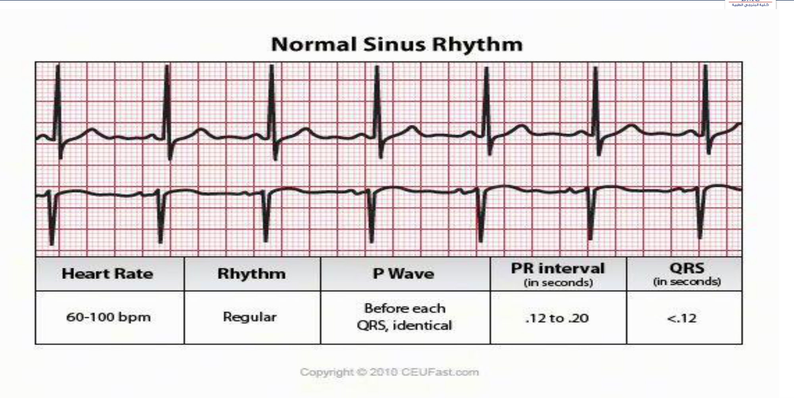 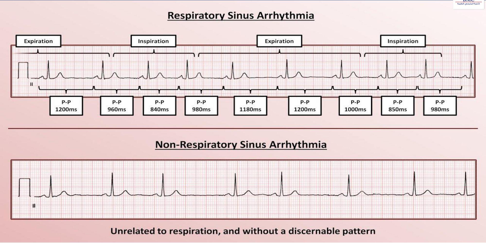

| Rhythm | ECG key *[added explanation]* | Significance |
|---|---|---|
| **Respiratory sinus arrhythmia** | P–P **shortens on inspiration**, lengthens on expiration | **Normal** (young people); non-respiratory variation has no respiratory pattern |
| **Sinus bradycardia** | Normal P-QRS, rate < 60 (slide example **HR 37**) | Athletes, drugs, inferior MI, hypothyroid |
| **Sinus pause / arrest** | Sudden absent P-QRS; **sinus exit block** = pause an exact multiple of the P–P interval | Sick sinus syndrome |
| ⭐ **Tachy-brady syndrome** | Runs of AF/flutter/SVT followed by long pauses on stopping | Form of **sick sinus syndrome** → pacemaker + rate control |

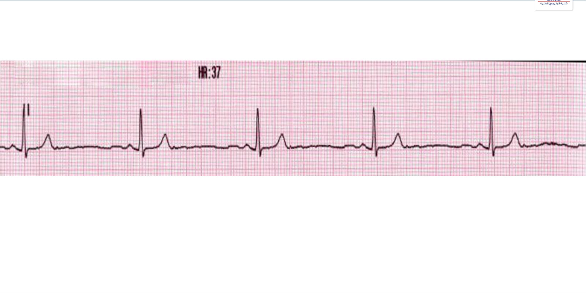 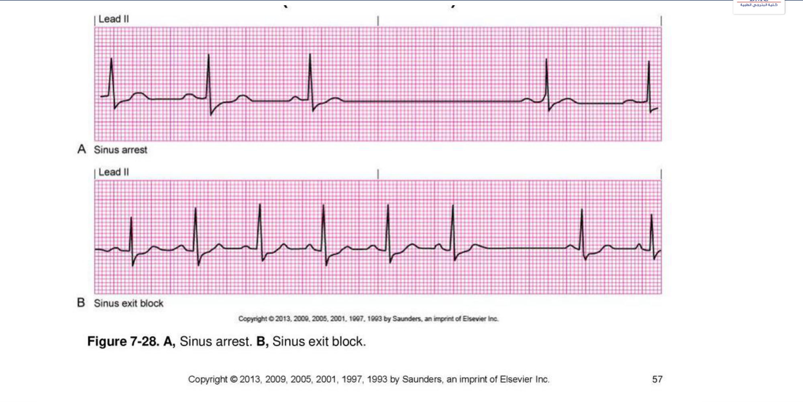

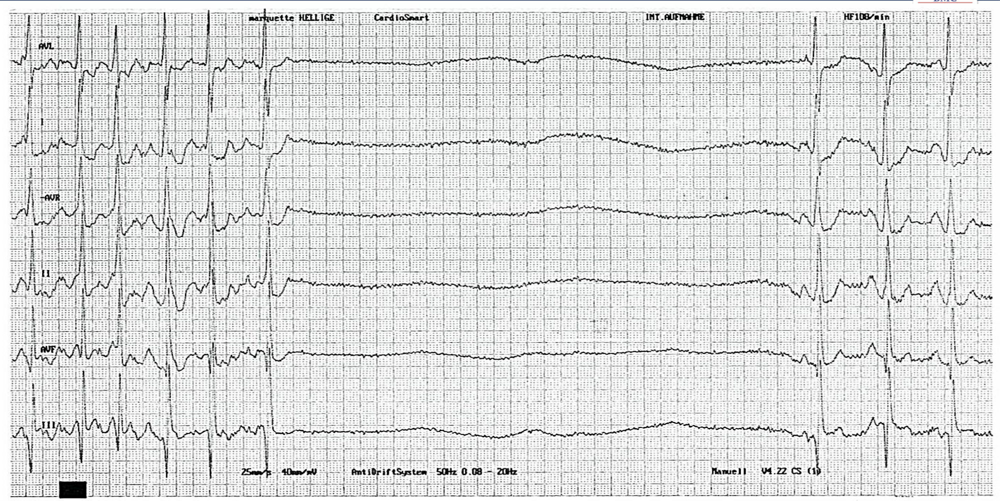

**AV blocks (slides 19–21)** ⭐

| Block | ECG |
|---|---|
| **1st degree** | **PR > 0.20 s**, constant; every P conducted |
| **2nd: Mobitz I (Wenckebach)** | **PR progressively lengthens until a P is dropped**; then the cycle resets |
| **2nd: Mobitz II** | **PR constant**; **sudden non-conducted P** |
| **High-grade block** | ≥ 2 consecutive non-conducted P waves |
| **3rd degree (complete)** | **P waves and QRS independent (AV dissociation)**. Slide: sinus rate ~83 with a **junctional escape ~45** (narrow) or a **ventricular escape ~45** (wide) |

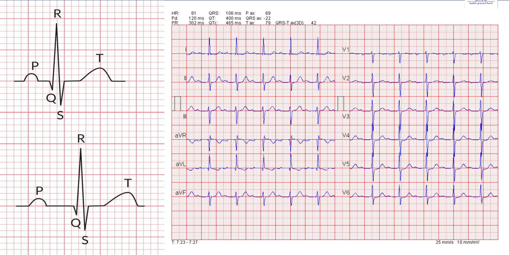 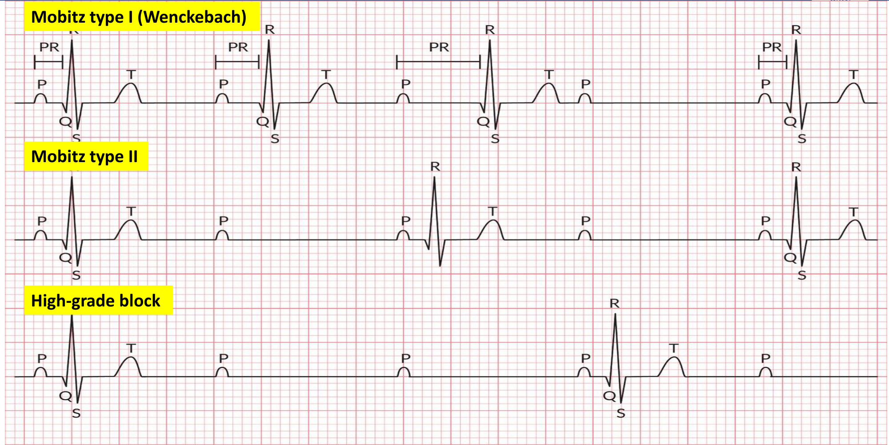

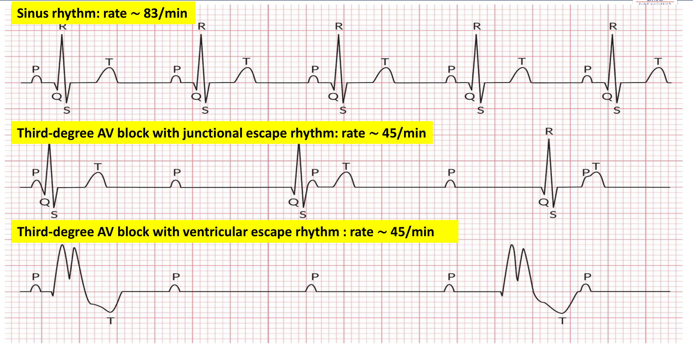

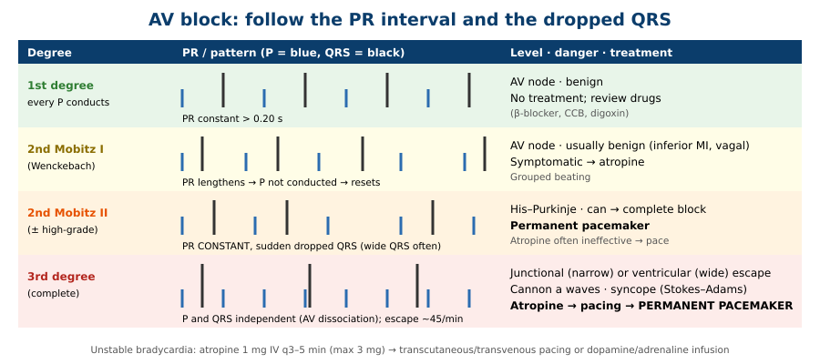

### 2.5 Management of Bradycardia (Slides 22–23) ⭐
1. **Is the rhythm appropriate for the clinical condition?** (HR typically **< 50/min** if a bradyarrhythmia is the problem.)
2. **Identify and treat the cause.**
    - **Airway** and **breathing**: give **O₂** if short of breath.
    - **Cardiac monitor**, BP, oximetry.
    - **IV access**.
    - **12-lead ECG** (don't delay therapy).
3. **Persistent bradyarrhythmia causing any of these?**
    - **hypotension**
    - **acutely altered mental status**
    - **shock**
    - **ischaemic chest discomfort**
    - **acute heart failure**

    **No → monitor and observe.**

| **Unstable** | **Stable** |
|---|---|
| ⭐ **Atropine 1 mg IV**, repeat every **3–5 min** (max **3 mg**) | **Observation**: continuous monitoring; **atropine** and **transcutaneous pacemaker** ready at the bedside |
| **If not effective → temporising measures:** **transcutaneous OR transvenous pacing**, OR **dopamine / epinephrine infusion** | If the patient deteriorates → atropine pathway |

**Then:**
- **identify and treat reversible causes** (hypoxaemia, **ACS**, electrolytes, **β-blocker/CCB poisoning**)
- **cardiology consult** (TTE; long-term **PPM**)

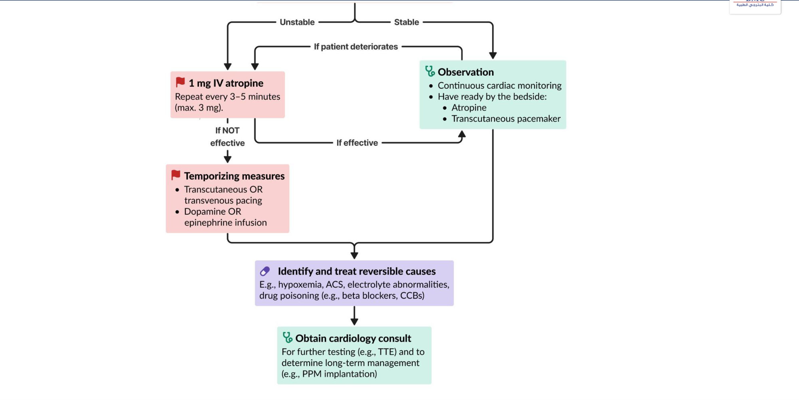

*[added] Atropine is often **ineffective in Mobitz II/3rd degree with wide escape** and in **heart transplant** patients (denervated heart), so go straight to pacing. Antidotes: **glucagon** for β-blocker overdose, **calcium** for CCB overdose, **digoxin Fab** for digoxin toxicity.*

> 🔁 **Recap: Bradyarrhythmias.** Sinus arrhythmia is normal. Sinus brady, pauses and tachy-brady (SSS). AV blocks: 1st (PR > 0.2), Mobitz I (PR lengthens then drops, benign), Mobitz II (constant PR then drops, dangerous), 3rd (dissociation, escape ~45). If unstable (↓BP, confusion, shock, chest pain, HF): atropine 1 mg q3–5 min (max 3 mg) → pacing or dopamine/adrenaline → find the cause → PPM.
> 🔗 **Link:** At the other end of the rate spectrum, the first job is to recognise which tachycardia it is.
> ▶️ **Up next: Tachyarrhythmia ECG gallery.**

---

### 2.6 Tachyarrhythmia ECG Gallery (Slides 26–39)

| Rhythm | ECG key |
|---|---|
| **Sinus tachycardia** | Normal P before each QRS, rate > 100 (usually ≤ 150 at rest *[added]*) |
| **Sinus vs focal atrial tachycardia (slide 27)** | **Sinus P:** round, **upright in II**, normal axis, atrial rate **≤ 150**. **Atrial focus P:** not round, **abnormal axis (inverted in II)**, rate **> 150** |
| **SV premature beats** | Early, abnormal P-QRS with a normal QRS |
| ⭐ **MAT** | **≥ 3 different P-wave morphologies**, irregular, rate > 100 (*[added]* COPD, hypoxia, theophylline) |
| ⭐ **Atrial flutter** | ⭐ **Sawtooth flutter waves** (lead II), atrial ~300/min, often **2:1 → ventricular rate ~150** *[added]* |
| ⭐ **AF** | **No P waves; fibrillatory baseline; irregularly irregular** QRS |
| **AF with rapid ventricular response** | AF with a ventricular rate > 100–110 |
| **PVCs** | **Unifocal** (identical) vs **multifocal** (> 1 shape); wide, bizarre, early, compensatory pause *[added]* |
| **Ventricular bigeminy** | Every other beat is a PVC |
| ⭐ **Monomorphic VT** | Regular wide-complex tachycardia, identical QRS (slide example **HR 182**) |
| ⭐ **Torsades de pointes** | **Polymorphic VT twisting around the baseline** |
| ⭐ **VF** | Chaotic, no QRS. **Fine VF** < 3 mm vs **coarse VF** > 3 mm |

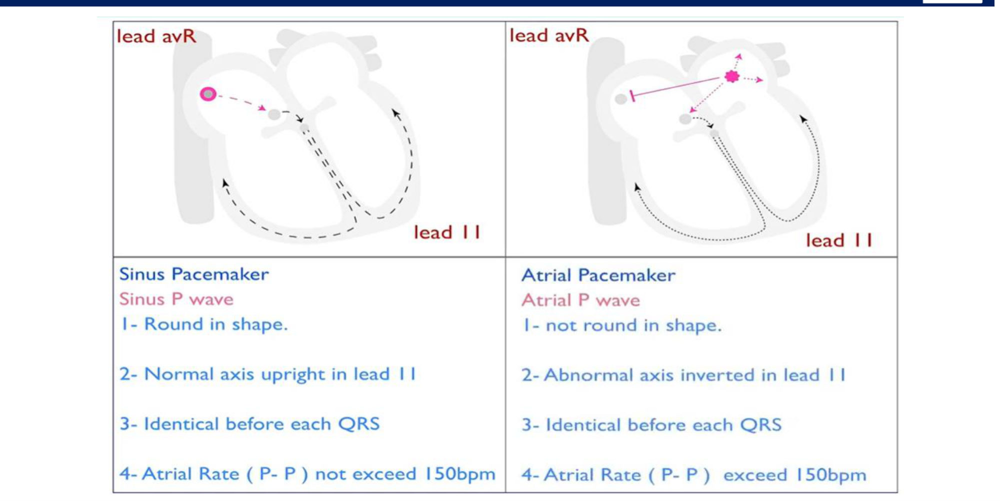 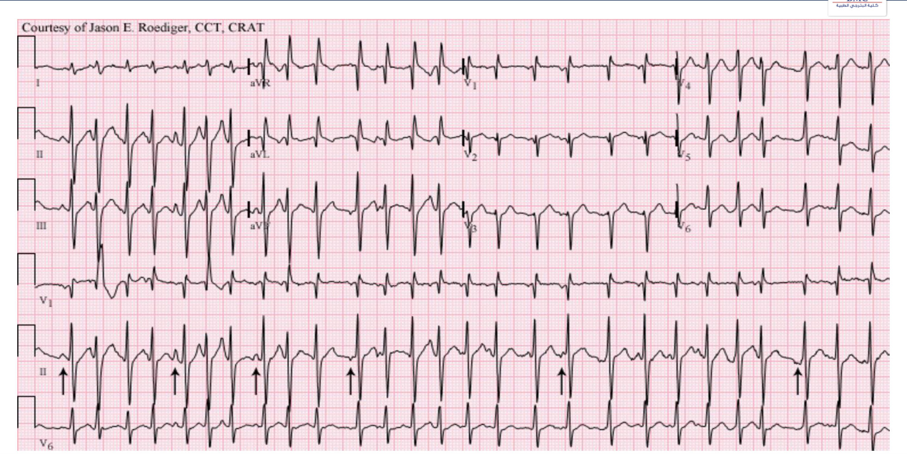

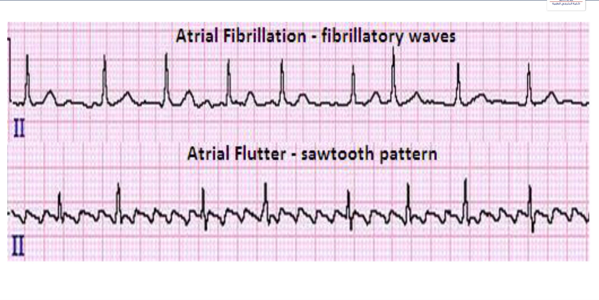 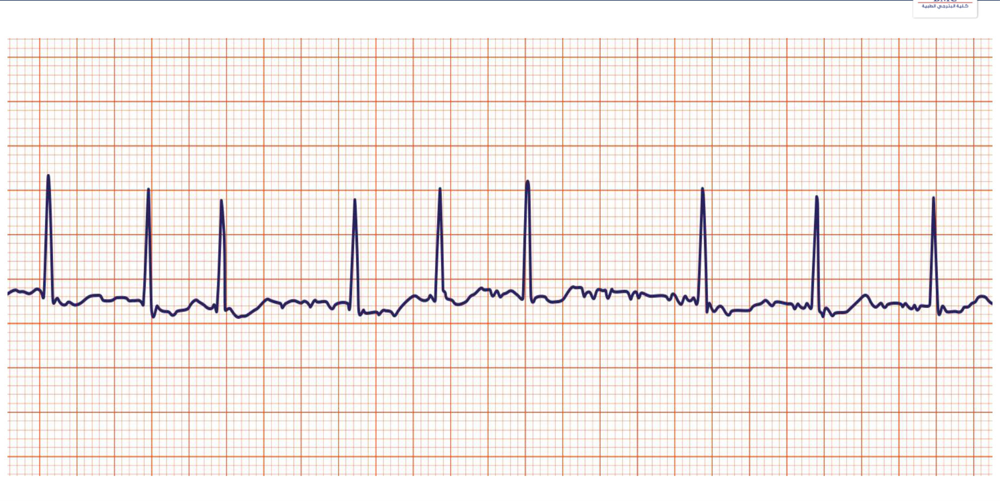

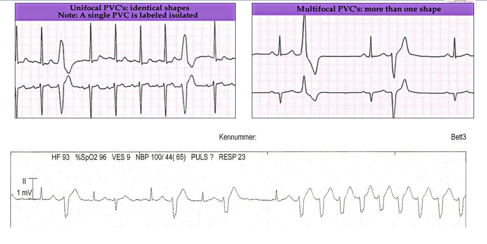 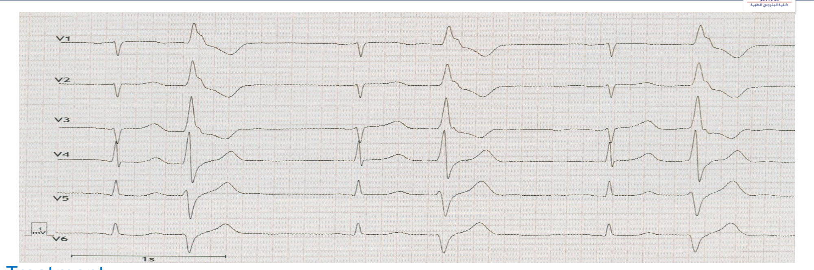

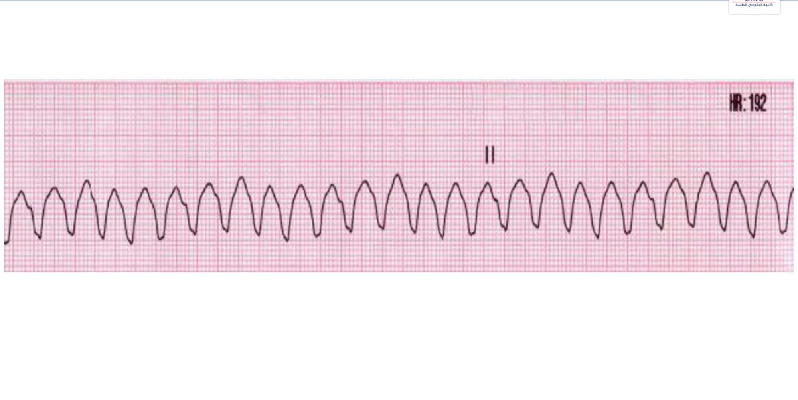 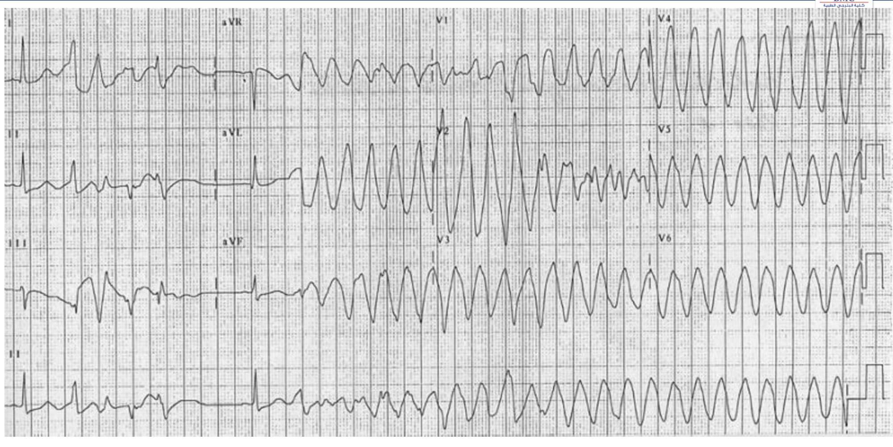

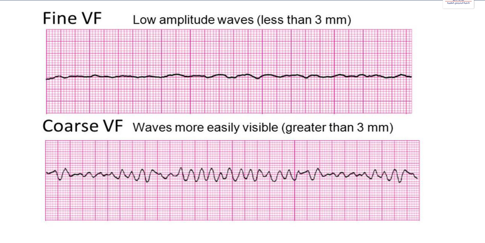 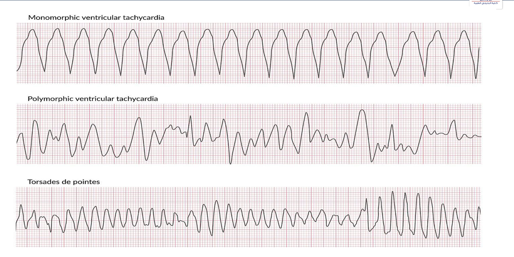

**PVC treatment (slide 34):**
- **Most patients (asymptomatic) need none**.
- **Treat the underlying disease**.
- Treat only **frequent and significantly symptomatic** PVCs, with **β-blockers**.

### 2.7 Tachycardia Management Framework (Slides 40–43) ⭐
**Step 1: stable or unstable?**
- **Signs of haemodynamic instability:**
    - **chest pain**
    - **altered mental status**
    - **acute pulmonary oedema**
    - **hypotension**
    - **cardiogenic shock**
- ⭐ **Unstable → DC cardioversion.**

**Step 2 (stable): regular or irregular × narrow or wide → four groups**

| | **Narrow QRS** | **Wide QRS** |
|---|---|---|
| **Regular** | **Sinus tach, SVT (AVNRT/AVRT), atrial flutter, atrial tachycardia** | **VT** (or SVT + **accessory pathway / BBB**) |
| **Irregular** | **AF, MAT** | **AF + (accessory pathway or BBB)**, **VF** |

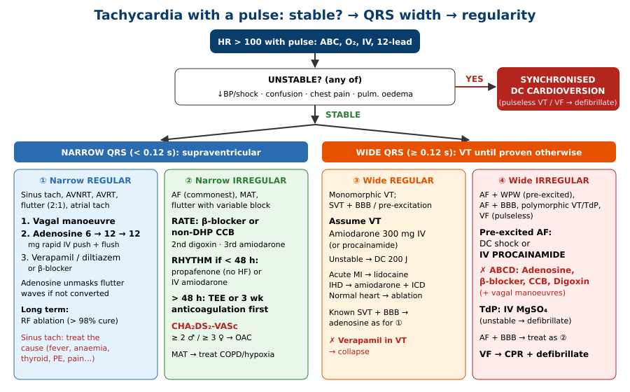

> 🔁 **Recap: Tachyarrhythmia types.** Sinus vs atrial tachycardia by P shape and axis. MAT = ≥ 3 P morphologies. Flutter = sawtooth. AF = no P, irregularly irregular. PVCs are benign unless frequent and symptomatic (β-blocker). VT = regular wide. TdP = twisting polymorphic. VF = chaos. Management: unstable → DC shock; stable → sort into narrow/wide × regular/irregular.
> 🔗 **Link:** The four groups, one at a time, starting with narrow regular (SVTs).
> ▶️ **Up next: Narrow regular tachycardia.**

---

### 2.8 Narrow Regular: Sinus Tachycardia, AVNRT, AVRT (Slides 44–58)
**Causes:**
- **sinus tachycardia**
- **AVNRT**
- **AVRT**
- **atrial flutter**
- **atrial tachycardia**

**Sinus tachycardia treatment (slide 46):**
- **Asymptomatic** without structural heart disease → **no treatment**.
- **Symptomatic:**
    - reduce triggers (**caffeine, alcohol, stress, smoking**)
    - treat **correctable causes** (**anaemia, thyrotoxicosis, fever**)
    - **β-blockers** for persistent symptoms

**AVNRT (slides 47–49)** ⭐
- **Mechanism:**
    - **Re-entry using dual pathways** within or near the AV node: **fast** (β-fibres; long refractory period) and **slow** (α-fibres; short refractory period).
    - It is usually triggered by a **premature beat**: the beat goes down the slow pathway (the fast one is still refractory), then back up the fast pathway, which creates a re-entry circuit.
- **Usually a structurally normal heart**; idiopathic (familial cases reported).
- **Sudden onset and offset**; ⭐ **"neck pounding"** (*[added]* frog sign: atria contract against closed AV valves).
- **Regular, 150–250 bpm**.
- ⭐ **60–70% of all paroxysmal SVTs** (the commonest).
- **Retrograde P waves are usually lost in the QRS** (or just after it; *[added]* pseudo-r′ in V1).

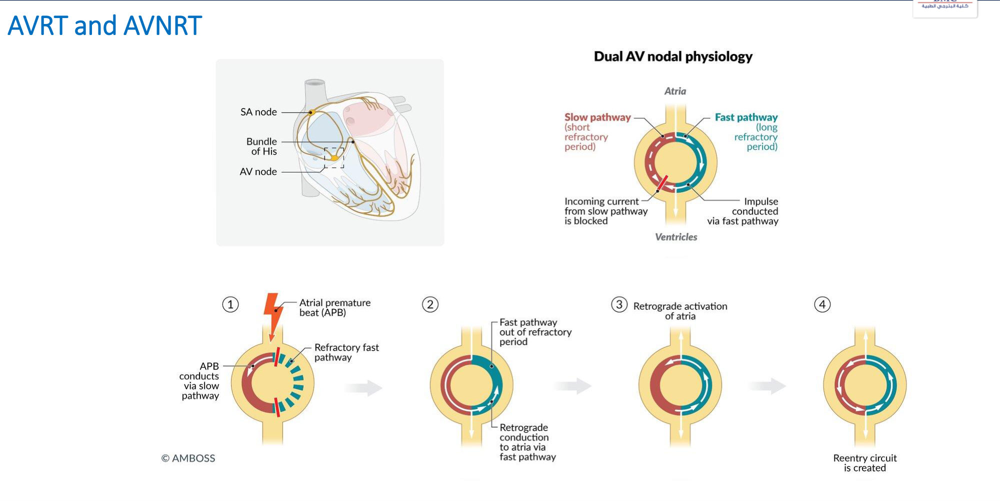 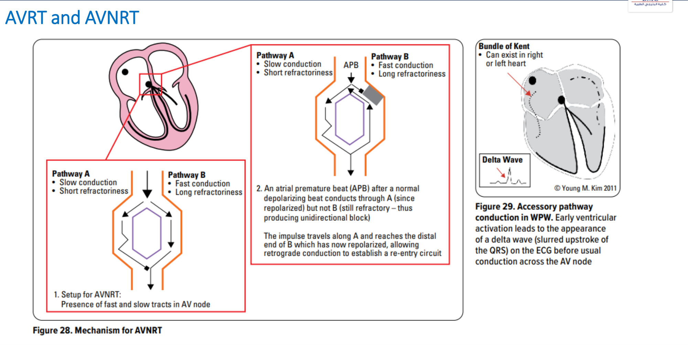

**AVRT (slide 50)** ⭐
- **Re-entrant loop**: down the **normal conduction system (antegrade)** and **up an accessory pathway (retrograde)** = ⭐ **orthodromic (narrow QRS)**.
    - The reverse direction (down the accessory pathway) = **antidromic (wide QRS)**.
- Usually in patients with an **antegradely conducting bypass tract (WPW)**.
- With a **concealed** (retrograde-only) pathway, the resting **ECG is normal, with no delta waves**.
- **Triggered by a premature atrial or ventricular complex.**

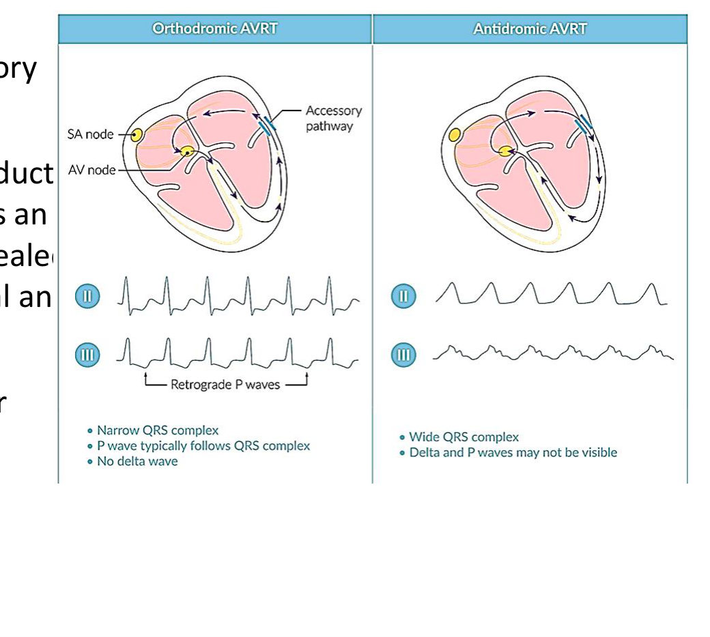 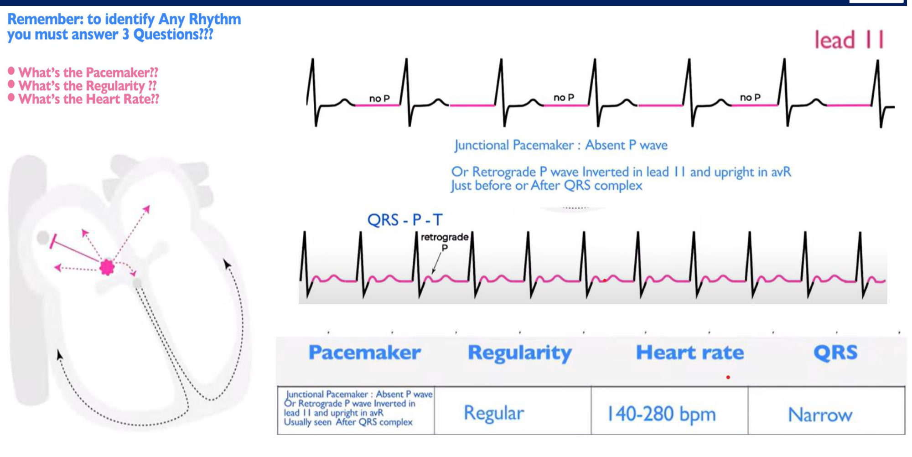

*Slide 53 analysis:* pacemaker **junctional** (absent P, or retrograde P inverted in II and upright in aVR, just before or after the QRS) · **regular** · **140–280 bpm** · **narrow** QRS.

**Treatment (slides 51–52, 54–58)** ⭐

| | **AVNRT** | **AVRT** |
|---|---|---|
| **Unstable** | **Electrical cardioversion** | Same |
| **Acute, stable** | 1. **Vagal manoeuvres**: Valsalva or carotid sinus pressure (*with precautions*). 2. ⭐ **Adenosine 6 mg rapid IV** (incremental doses) = **first choice if vagal fails**. 3. **Verapamil (Isoptin) 5 mg IV over 3–5 min**, repeated. 4. If no response: **metoprolol, digoxin, diltiazem** | **As for AVNRT**, but ⭐ **avoid long-acting AV-nodal blockers (digoxin, verapamil)** |
| **Long-term** | ⭐ **1st line: radiofrequency ablation** (**> 98% cure, < 1% complications**); or β-blocker, diltiazem, digoxin. **2nd line: flecainide, propafenone** | ⭐ **Ablation of the bypass tract** for recurrence; drugs: **flecainide, procainamide** |

*[added]:*
- Adenosine doses: **6 → 12 → 12 mg** rapid push with a flush, through a proximal (antecubital) vein.
- Warn the patient about **transient chest discomfort / sense of doom**.
- **Contraindicated in asthma** (bronchospasm).
- **Dipyridamole** potentiates adenosine; **theophylline** blocks it.
- Carotid massage is **contraindicated with a carotid bruit or a recent TIA/stroke**. These are the "precautions" the slide refers to.

**After reversion (slide 57):**
- **ECG normal** → maintenance with a **β-blocker or verapamil**.
- **WPW pattern** → ⭐ **refer for EP study + RF ablation**.

**RF ablation:** tissue destruction by **radiofrequency current (~80 °C)**. Success **97% vs 60% with amiodarone** (slide 58).

> 🔁 **Recap: Narrow regular.** Sinus tach → treat the cause. AVNRT is the commonest PSVT (60–70%): dual AV-nodal pathways, sudden onset, neck pounding, 150–250 bpm, P hidden in the QRS. AVRT uses an accessory pathway (orthodromic narrow; WPW). Treatment: unstable → DC; stable → vagal → adenosine 6 mg rapid → verapamil 5 mg / β-blocker / diltiazem. In AVRT avoid long-acting nodal blockers. Cure = RF ablation (> 98%); WPW → EP study + ablation.
> 🔗 **Link:** If the narrow rhythm is irregular, it is almost always AF.
> ▶️ **Up next: Atrial fibrillation.**

---

### 2.9 Narrow Irregular: Atrial Fibrillation (Slides 59–68) ⭐
**Causes:** most commonly **AF** (also MAT, flutter with variable block *[added]*).

**AF classification (slide 59):**

| Basis | Type | Definition |
|---|---|---|
| **Ventricular rate** | AF with **rapid** ventricular response | Ventricular rate **> 100–110/min** (tachycardic AF) |
| | AF with **slow** ventricular response | **< 60/min** (bradycardic AF) |
| **Onset and duration** | **New-onset** | First presentation, regardless of duration |
| | **Paroxysmal** | **Resolves within 7 days** (spontaneously or with treatment); may recur |
| | **Persistent** | Continuous **> 7 days** |
| | **Long-standing persistent** | Continuous **> 1 year** |
| | **Permanent** | Persistent AF where **no further attempts** at sinus rhythm are planned (patient and physician agree) |

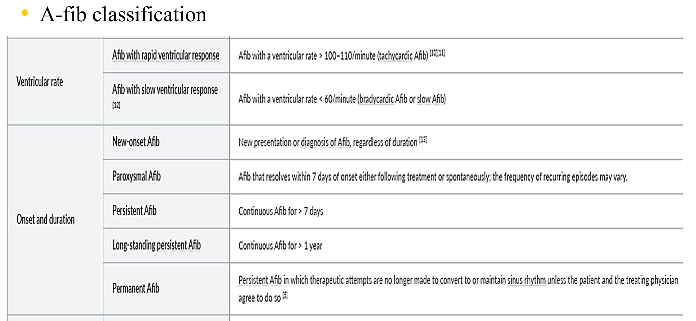

**Management overview (slide 68):**
- **Diagnosis of AF.**
- **Identify and treat reversible precipitants.**
- Three parallel assessments:
    - **thromboembolic risk (CHA₂DS₂-VASc)** → **OAC** for those at risk
    - **arrhythmia management** → **rate** and/or **rhythm control**
    - **risk factors** → **risk-factor modification**

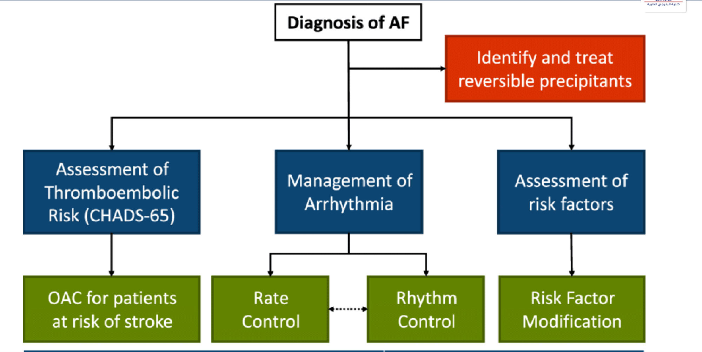

**Rhythm control (slides 60–63):**

| Situation | Management |
|---|---|
| ⭐ **Haemodynamically unstable** | **DC shock 150 J** (synchronised, biphasic) |
| **Stable, recent onset (< 48 h)** | **Medical reversion:** **oral propafenone 600 mg** (**only if no CHF / impaired LV function**), OR **IV amiodarone**: **loading 300 mg IV over 40 min**, then **1800 mg/24 h** infusion |
| ⭐ **AF > 48 h** | **Exclude LA thrombus by TEE**, and/or **anticoagulate before reversion**. **Anticoagulate after reversion** with **warfarin (INR 2–3)** (*[added]* ≥ 4 weeks; the atria are stunned) |
| **Maintenance after cardioversion** | **Amiodarone 200 mg/day** or **sotalol 80 mg bid** |
| **Frequent recurrence** | ⭐ **Pulmonary vein isolation** (catheter ablation around the PV ostia) |

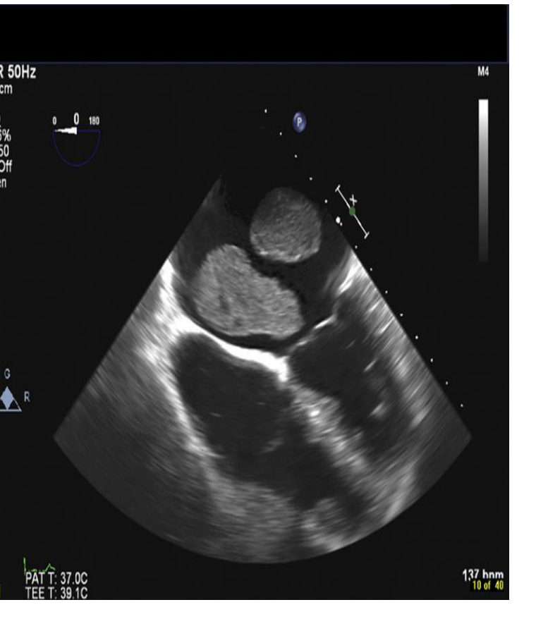 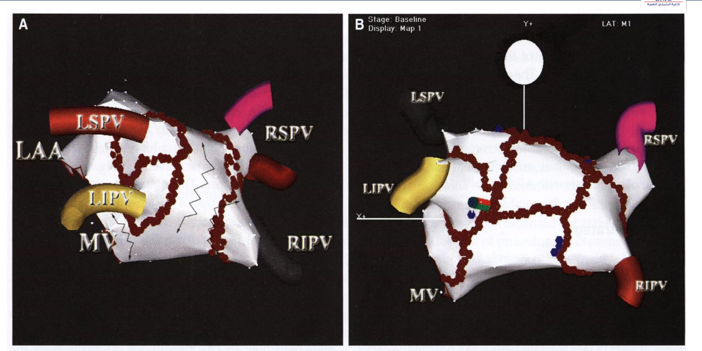

**Rate control (slide 64):**
- **First line:** ⭐ **β-blockers** or **non-DHP CCBs** (verapamil, diltiazem; *[added]* avoid in HFrEF)
- **Second line:** **digoxin** (*[added]* useful in HF or sedentary patients)
- **Third line:** **amiodarone**
- **Non-drug:** **AV-node ablation + permanent ventricular pacemaker** ("ablate and pace")
- ⭐ **"Do not forget to anticoagulate": INR 2–3**

**Stroke prevention: CHA₂DS₂-VASc (slide 65)** ⭐

| Letter | Condition | Points |
|---|---|---|
| **C** | **Congestive HF** / LV systolic dysfunction | 1 |
| **H** | **Hypertension** (> 140/90 or treated) | 1 |
| **A₂** | **Age ≥ 75** | **2** |
| **D** | **Diabetes** | 1 |
| **S₂** | **Stroke / TIA / thromboembolism** | **2** |
| **V** | **Vascular disease** (PAD, MI, aortic plaque) | 1 |
| **A** | **Age 65–74** | 1 |
| **Sc** | **Sex category: female** | 1 |

*CHADS₂ (the older score) has only C, H, A (≥ 75 = 1), D, S₂. CHA₂DS₂-VASc refines patients scoring 0–1 on CHADS₂ and identifies those at truly low risk.*

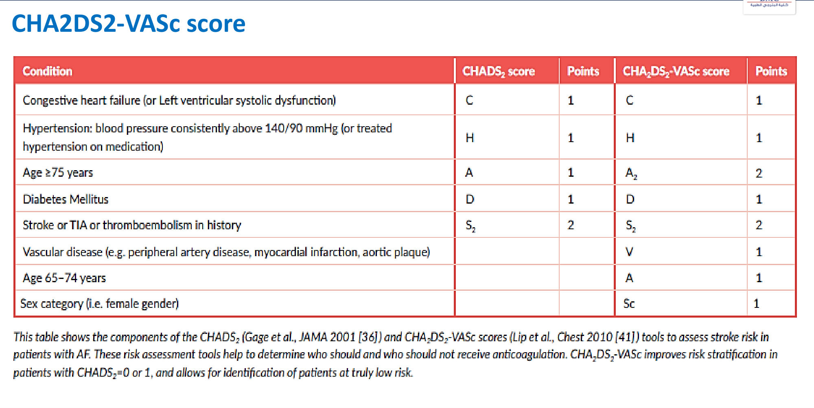

**Who to anticoagulate (slide 66)** ⭐

| Risk | Criteria | Action |
|---|---|---|
| **High** | ⭐ **Valvular disease** (*[added]* moderate–severe MS or mechanical valve), **HCM**, and/or **CHA₂DS₂-VASc ≥ 2 (men) / ≥ 3 (women)** | **Long-term anticoagulation** |
| **Medium** | Non-valvular AF with a score of **1 (men) / 2 (women)** | **Consider** anticoagulation |
| **Low** | Non-valvular AF with a score of **0 (men) / 1 (women)** | **Not routinely recommended** |

⭐ **Always weigh the bleeding risk before starting anticoagulation.**

**Bleeding risk: HAS-BLED (slide 67)**

| Letter | Item | Points |
|---|---|---|
| **H** | Hypertension, uncontrolled (SBP > 160) | 1 |
| **A** | Abnormal renal (dialysis, transplant, Cr > 200 µmol/L) and/or liver function (cirrhosis, bilirubin > 2× ULN, AST/ALT/ALP > 3× ULN) | 1 each (1–2) |
| **S** | Stroke history | 1 |
| **B** | Bleeding history or predisposition | 1 |
| **L** | Labile INR (TTR < 60%) | 1 |
| **E** | Elderly (> 65) | 1 |
| **D** | Drugs (antiplatelets, NSAIDs) and/or alcohol (≥ 8 drinks/week) | 1 each (1–2) |

Risk bands on the slide: **0 = low · 1–2 = moderate · ≥ 3 = high**.

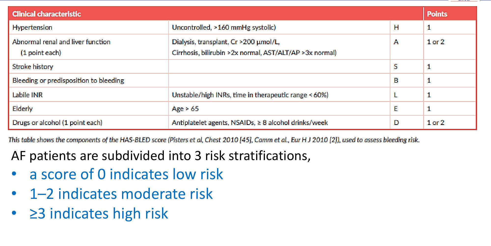

*[added] A high HAS-BLED means **correct the modifiable bleeding factors and monitor closely**. It is **not by itself a reason to withhold OAC**. Non-valvular AF → **DOACs preferred** over warfarin. **Mechanical valves / moderate–severe MS → warfarin only.***

> 🔁 **Recap: AF.**
> - **Classification:** rapid vs slow response; new-onset, paroxysmal (≤ 7 d), persistent (> 7 d), long-standing (> 1 y), permanent.
> - **Unstable:** DC 150 J.
> - **< 48 h:** propafenone (no HF) or IV amiodarone 300 mg then 1800 mg/24 h.
> - **> 48 h:** TEE / anticoagulate first, warfarin INR 2–3 after. Maintain with amiodarone 200 or sotalol 80 bid; recurrent → PV isolation.
> - **Rate control:** β-blocker / non-DHP CCB → digoxin → amiodarone → ablate and pace.
> - **Stroke prevention:** CHA₂DS₂-VASc ≥ 2 ♂ / ≥ 3 ♀ (or valvular, HCM) → OAC; weigh HAS-BLED.
> 🔗 **Link:** Wide regular means VT until proven otherwise.
> ▶️ **Up next: Wide-complex tachycardias.**

---

### 2.10 Wide Regular: VT (Slides 69–73) ⭐
**Causes:** **VT** or **SVT with aberration** (*[added]* BBB, pre-excitation).

**Definition:**
- **VT** = **≥ 3 consecutive ventricular complexes (wide QRS) at ≥ 100/min**.
- **Non-sustained VT (NSVT):** **< 30 s**. **Sustained VT:** **≥ 30 s**.
- **Monomorphic:** identical QRS, from **a single focus**. **Polymorphic:** varying QRS, from **multiple foci**.

**VT management (slide 69):**

| Setting | Treatment |
|---|---|
| ⭐ **Unstable** | **DC shock 200 J** |
| **Complicated acute MI** | **Lidocaine (Xylocaine)** |
| **Complicated IHD** | ⭐ **Amiodarone + ICD (AICD)**, or RF ablation (low success rate) |
| **Normal heart (young)** | ⭐ **RF ablation** (*[added]* idiopathic RVOT/fascicular VT) |

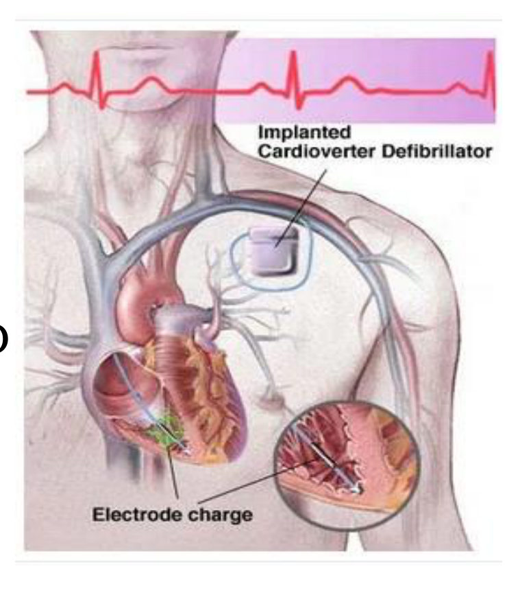

*[added] Stable VT: **amiodarone 300 mg IV over 20–60 min, then 900 mg/24 h** (slide 84), or procainamide. Clues that a wide-complex tachycardia is VT, not SVT with aberrancy:*
- *AV dissociation, capture or fusion beats*
- *QRS > 0.16 s*
- *extreme axis*
- *concordance in V1–V6*
- *history of IHD*

***Never give verapamil to a wide-complex tachycardia.***

**Torsades de pointes (slide 72)** ⭐
- **Etiology:** **congenital long QT syndrome** or **acquired LQTS**: drugs, **electrolyte abnormalities** (*[added]* ↓K, ↓Mg, ↓Ca), heart disease.
- **ECG:** **polymorphic VT** with QRS **twisting around the isoelectric line**.
- **Acute management:**
    - ⭐ **Unstable → defibrillation + CPR**
    - ⭐ **Stable → IV magnesium sulfate** (*[added]* 2 g over 10 min)
- **Complication:** can progress to **VF**.

*[added] QT-prolonging drugs:*
- *class IA/III antiarrhythmics*
- *macrolides, fluoroquinolones*
- *haloperidol, antipsychotics*
- *TCAs, methadone, ondansetron*

*Also: stop the offending drug, correct K⁺, and use **overdrive pacing / isoprenaline** if recurrent.*

### 2.11 Wide Irregular: VF and Pre-excited AF (Slides 74–77) ⭐
**Causes:** ⭐ **VF** or **AF complicating WPW**. Both are usually **haemodynamically unstable → DC cardioversion** (VF needs *[added]* **unsynchronised** defibrillation + CPR).

⭐ **All drugs that block the AV node are CONTRAINDICATED in AF with an accessory pathway (WPW).**
- *[added] Reason:* blocking the node pushes all impulses down the accessory pathway, which can conduct at up to 300/min → **VF**.

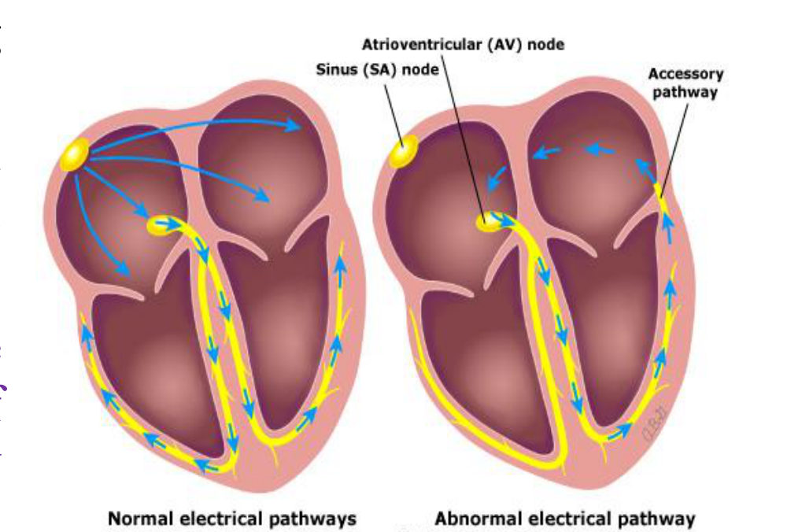 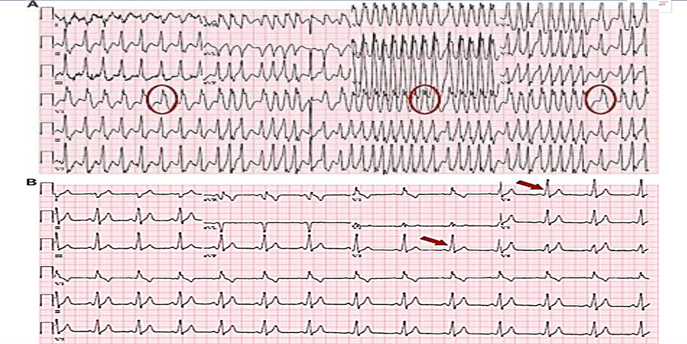

**WPW treatment (slide 77):**
- **Unstable** → **electrical cardioversion**.
- **Stable** → assess the underlying rhythm.
    - **Wide-complex tachycardia**: **irregular** (underlying AF or MAT) or **regular** (underlying flutter or focal AT).
    - ⭐ **Avoid AV-nodal blocking agents AND vagal manoeuvres.**
    - ⭐ **Rhythm control (cardioversion or IV procainamide) is the safest option.**
- *[added]* Then **EP study + ablation of the pathway**.

> **Mnemonic: in WPW + AF avoid "ABCD"** *[added]* = **A**denosine · **B**eta-blockers · **C**alcium-channel blockers (verapamil, diltiazem) · **D**igoxin (± amiodarone IV in some guidance).

> 🔁 **Recap: Wide tachycardias.**
> - **Wide regular** = VT until proven otherwise: unstable → DC 200 J; acute MI → lidocaine; IHD → amiodarone + ICD; normal heart → ablation.
> - **TdP:** long QT; stable → IV Mg; unstable → defibrillate.
> - **Wide irregular** = VF (CPR + defibrillate) or AF + WPW (DC shock or procainamide; never ABCD or vagal manoeuvres).
> 🔗 **Link:** The non-drug tools used so far, in one place.
> ▶️ **Up next: Non-pharmacological therapy and drug classes.**

---

### 2.12 Non-Pharmacological Management (Slides 78–83)
**Summary of tools (slide 78):**
- **vagal manoeuvres**
- **drugs** (anti-tachycardia and anti-bradycardia agents)
- **cardioversion** (electrical and chemical)
- **RF catheter ablation**
- **pacemaker therapy**

**Vagal manoeuvres (slides 79–80)** increase parasympathetic tone. They are used to **abort stable SVT** or **differentiate SVT from VT**.

| Manoeuvre | Technique |
|---|---|
| **Carotid sinus massage** | **Supine**, neck **extended and rotated to the opposite side**. Carotid sinus = pulse **just below the angle of the mandible**, anterior to SCM, at the **upper level of the thyroid cartilage**. Index + middle fingertips press **posteromedially for 5–10 s**. **Repeat after 1 min** if unsuccessful, then try the **opposite side** (*[added]* never both at once) |
| **Valsalva** | **Supine**, deep breath, **blow against a closed glottis for 10–15 s** (*[added]* modified Valsalva: then lie flat and raise the legs, which doubles success) |

**Cardioversion (slide 82):**
1. **Electrical cardioversion:** a high-energy shock resets the rhythm.
    - ⭐ **Synchronised** (timed to the R wave; *[added]* AF, flutter, SVT, VT with pulse).
    - **Unsynchronised = defibrillation**: for life-threatening rhythms, especially **VF** and **pulseless VT**.
    - ⭐ **Asystole cannot be restarted by a defibrillator** → **CPR** (*[added]* + adrenaline).
2. **Chemical cardioversion:** drugs restore sinus rhythm.

**Interventional therapy (slide 83):** **radiofrequency catheter ablation**.

### 2.13 Antiarrhythmic Drug Classes (Slide 81)

**Vaughan Williams classification:**

| Class | Mechanism | Drugs |
|---|---|---|
| **IA** | Block fast **Na⁺** channels (moderate) | **Quinidine, procainamide, disopyramide**, moricizine |
| **IB** | Na⁺ (weak; ischaemic tissue) | **Lidocaine**, tocainide, **mexiletine** |
| **IC** | Na⁺ (strong) | **Flecainide, propafenone** |
| **II** | **β-blockers** (↓ depolarisation rate) | **Esmolol, propranolol**, acebutolol |
| **III** | Block **K⁺** channels (prolong repolarisation) | ⭐ **Amiodarone, sotalol**, ibutilide, dofetilide, bretylium |
| **IV** | Block slow **Ca²⁺** channels | **Verapamil, diltiazem** |
| **Misc.** | | **Adenosine, digoxin, magnesium, potassium** |

**By site of action:**

| Supraventricular only | Supraventricular + ventricular | Ventricular only |
|---|---|---|
| **Adenosine, verapamil, diltiazem, dronedarone, digoxin** | **Amiodarone, β-blockers (propranolol, sotalol, esmolol), procainamide, disopyramide, quinidine, flecainide, propafenone** | **Lidocaine, mexiletine** |

**Pro-arrhythmic effects:**
- **Class Ia, Ic:** prolong QT; can cause **VT/VF in CAD and HF** (*[added]* CAST trial: flecainide after MI ↑ mortality)
- **Class III:** like Ia/Ic (QT → TdP)
- **Class II, IV:** **bradycardia**

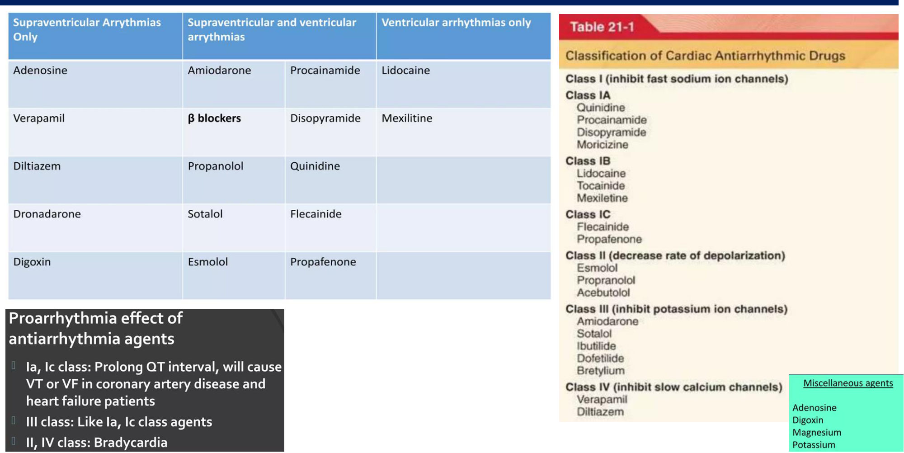

> **Mnemonic: "Some Block Potassium Channels"** *[added]* = class **I** Sodium · **II** Beta · **III** Potassium · **IV** Calcium. For subclasses: **IA "Double Quarter Pounder"** (Disopyramide, Quinidine, Procainamide) · **IB "Lettuce, Tomato, Mayo"** (Lidocaine, Tocainide, Mexiletine) · **IC "Fries Please"** (Flecainide, Propafenone).

### 2.14 Summary Algorithm (Slide 84) ⭐
**Tachycardia with a pulse:**
- **Support ABCs**: O₂, IV, monitor ECG/BP/SpO₂, 12-lead, treat reversible causes.
- **Unstable** (↓ consciousness, chest pain, **SBP < 90**, heart failure; rate-related symptoms are uncommon < 150 bpm):
    - **synchronised DC shock, up to 3 attempts** (under sedation/anaesthesia)
    - then **amiodarone 300 mg IV over 10–20 min** and repeat the shock
    - then **amiodarone 900 mg over 24 h**
- **Stable → QRS narrow (< 0.12 s)?**

| | **Regular** | **Irregular** |
|---|---|---|
| **Narrow** | **Vagal manoeuvres** → **adenosine 6 mg rapid IV**, then **12 mg**, then **12 mg** → if sinus restored = **re-entry PSVT** (record ECG; if it recurs give adenosine again and consider prophylaxis); if not restored = **possible flutter** → **rate control** (β-blocker) | **Probable AF** → rate control: **IV β-blocker or digoxin**; if onset < 48 h consider **amiodarone 300 mg over 20–60 min, then 900 mg/24 h** |
| **Broad** | **VT (or uncertain)** → **amiodarone 300 mg IV over 20–60 min, then 900 mg/24 h**. **Known SVT + BBB** → adenosine as for narrow | **Seek expert help.** Possibilities: **AF + BBB** (treat as narrow) · **pre-excited AF** (consider amiodarone*) · **polymorphic VT/TdP** → **magnesium 2 g over 10 min** |

*Cardioversion of AF present > 48 h carries a stroke risk.*

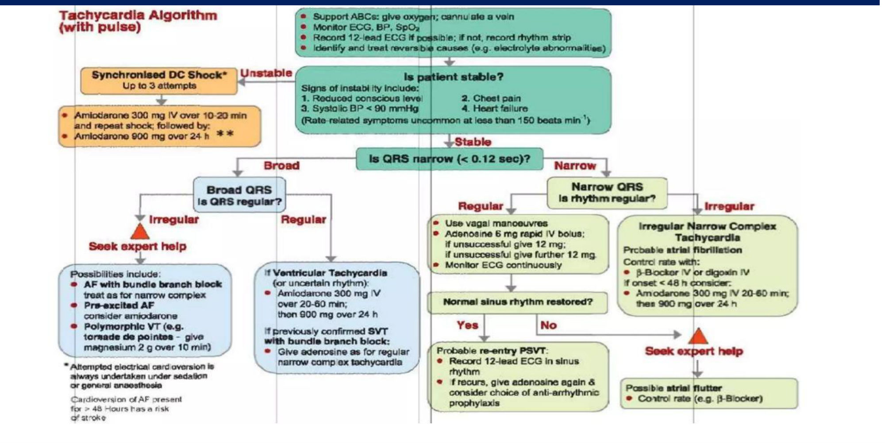

---

## 3. High-Yield Comparison Tables

### Table A: The 4 Tachycardia Groups
| Group | Differential | First-line (stable) | Contraindicated |
|---|---|---|---|
| **Narrow regular** | Sinus tach, **AVNRT**, AVRT (ortho), **flutter 2:1**, atrial tach | **Vagal → adenosine** → verapamil/β-blocker | Adenosine in asthma *[added]* |
| **Narrow irregular** | **AF**, MAT, flutter with variable block | **Rate:** β-blocker / non-DHP CCB; anticoagulate | Propafenone if HF |
| **Wide regular** | **VT**, SVT + BBB, antidromic AVRT | **Amiodarone / procainamide**; DC if unstable | ⭐ **Verapamil** |
| **Wide irregular** | **VF**, **AF + WPW**, AF + BBB, TdP | DC; **procainamide** (pre-excited AF); **Mg** (TdP) | ⭐ **AV-nodal blockers + vagal** (WPW) |

### Table B: AVNRT vs AVRT
| | **AVNRT** | **AVRT** |
|---|---|---|
| Circuit | **Dual pathways in/near the AV node** | **AV node + accessory pathway** |
| Frequency | **60–70% of PSVT** (commonest) | Less common; WPW |
| Resting ECG | Normal | **Short PR + delta wave** (unless concealed) |
| Tachycardia QRS | Narrow | **Orthodromic narrow / antidromic wide** |
| P waves | **Hidden in QRS** | Retrograde P after QRS *[added]* |
| Acute treatment | Vagal → adenosine → verapamil/β-blocker | Same, but **avoid long-acting nodal blockers** (digoxin, verapamil) |
| Cure | **RF ablation** (slow pathway) | **Ablation of the bypass tract** |

### Table C: AV Blocks
| | PR | Dropped beats | Site | Risk | Treatment |
|---|---|---|---|---|---|
| **1st** | > 0.20, constant | None | AV node | Benign | None |
| **Mobitz I** | **Progressive ↑** | Periodic | AV node | Low | Atropine if symptomatic |
| **Mobitz II** | **Constant** | Sudden | Infranodal | **High → CHB** | **Pacemaker** |
| **3rd** | No relation | AV dissociation | Any | **High** | **Pacemaker** |

### Table D: AF: Rate vs Rhythm
| | **Rate control** | **Rhythm control** |
|---|---|---|
| Drugs | **β-blocker, non-DHP CCB** → digoxin → amiodarone | **Propafenone** (no HF), **amiodarone**, sotalol |
| Procedure | **AV-node ablation + PPM** | **DC cardioversion** (150 J), **PV isolation** |
| Anticoagulation | **Yes, by CHA₂DS₂-VASc** | **Yes**: TEE or anticoagulate before (> 48 h) and **after** |

### Table E: Cardioversion vs Defibrillation
| | **Synchronised cardioversion** | **Defibrillation (unsynchronised)** |
|---|---|---|
| Timing | Delivered on the **R wave** (avoids R-on-T) | Random |
| Rhythms | **Unstable SVT, AF (150 J), flutter, VT with pulse (200 J)** | **VF, pulseless VT** |
| Asystole | — | ❌ **Not shockable** → CPR + adrenaline |

---

## 4. Rules, Exceptions, Patterns

| Rule | Exception / nuance |
|---|---|
| Unstable tachycardia → synchronised DC shock | **VF / pulseless VT → unsynchronised defibrillation**; **asystole → CPR** (not shockable) |
| Adenosine for narrow regular SVT | **Not in WPW with AF**, not in asthma *[added]*; it reveals but **doesn't convert flutter** |
| Verapamil for SVT | **Never in wide-complex tachycardia** or **WPW** |
| AV-nodal blockers control AF rate | ⭐ **AF + WPW → contraindicated** → procainamide/DC |
| Wide QRS = VT | Could be **SVT + BBB/aberrancy**. Treat as VT if in doubt |
| Propafenone for recent AF | **Not if CHF / impaired LV** (use amiodarone) |
| Cardiovert AF | **> 48 h → TEE or anticoagulate first**; anticoagulate after |
| CHA₂DS₂-VASc decides OAC | **Valvular AF and HCM → anticoagulate regardless** |
| Female sex = 1 point | Female sex **alone** (score 1) → low risk; thresholds are ≥ 3 for women |
| Atropine for bradycardia | Often ineffective in **infranodal block / transplant** → pace |
| Sinus arrhythmia | **Respiratory** variation is **normal** |
| Antiarrhythmics treat arrhythmias | **Class Ia, Ic, III prolong QT → can cause VT/VF** (pro-arrhythmia) |
| PVCs need treatment | **Most don't**: only frequent and symptomatic (β-blocker) |

---

## 5. Clinical Correlations
- **Young WPW patient, binge drinking, then a regular wide-complex tachycardia at 220, stable** → **antidromic AVRT / pre-excited tachycardia** → **IV procainamide** (opening case).
- **Young woman with sudden palpitations, neck pounding, HR 180, narrow regular** → **AVNRT** → vagal → adenosine → ablation.
- **Inferior STEMI with HR 38 and Mobitz I** → AV-nodal ischaemia (RCA) → atropine if symptomatic; usually transient.
- **Anterior MI with new Mobitz II / CHB** → infranodal → **pacing**.
- **Elderly patient with AF, HTN, DM, age 76** → CHA₂DS₂-VASc = H1 + D1 + A₂ 2 = **4 → anticoagulate**.
- **AF in a patient with rheumatic MS** → **valvular AF → warfarin** regardless of score.
- **COPD exacerbation with irregular narrow tachycardia and ≥ 3 P-wave shapes** → **MAT** → treat COPD/hypoxia; avoid theophylline.
- **Patient on azithromycin + ondansetron with low K⁺/Mg²⁺, now polymorphic twisting VT** → **TdP** → **IV MgSO₄**.
- **Post-MI patient with sustained monomorphic VT and low EF** → amiodarone + **ICD**.
- **Thyrotoxic patient with AF** → β-blocker (propranolol) + treat the thyroid.
- **Digoxin toxicity** (*[added]* nausea, yellow vision, bidirectional VT, atrial tachycardia with block) → digoxin Fab.
- **Collapse: VF on the monitor** → **CPR + unsynchronised defibrillation**.

---

## 6. Rapid Revision (Last-Day)
1. Brady **< 60**, tachy **> 100**. SVT = SA node/atria/AV node; VT = below the AV node (**wide QRS**).
2. Brady causes: athletes, **SSS**, IHD, ↑vagal tone, **RCA/inferior MI**, **digoxin/β-blocker/CCB**.
3. Tachy causes: structural disease, ectopic foci, **accessory pathways**, **LQTS/Brugada/CPVT**, electrolytes, **COPD/PE/thyrotoxicosis**, **digoxin toxicity/theophylline**.
4. NSR: 60–100, P before every QRS, **PR 0.12–0.20**, **QRS < 0.12**.
5. AV blocks: **1st** PR > 0.2 · **Mobitz I** progressive PR → drop · **Mobitz II** constant PR → drop · **3rd** dissociation, escape ~45.
6. Unstable brady (↓BP, confusion, shock, chest pain, HF): **atropine 1 mg q3–5 min (max 3 mg)** → **pacing or dopamine/adrenaline** → treat the cause → **PPM**.
7. Instability: **chest pain, altered mental status, pulmonary oedema, hypotension, shock** → **DC cardioversion**.
8. Four groups: **narrow regular** (ST, SVT, flutter, AT) · **wide regular** (VT ± SVT + AP/BBB) · **narrow irregular** (AF, MAT) · **wide irregular** (AF + AP/BBB, VF).
9. Sinus tach: treat the cause; **β-blocker** if persistent symptoms.
10. **AVNRT** = dual pathways, **60–70% of PSVT**, 150–250, neck pounding, P hidden. **AVRT** = accessory pathway; orthodromic narrow, antidromic wide.
11. Acute SVT: **vagal → adenosine 6 mg rapid IV (→ 12 → 12)** → **verapamil 5 mg IV** → metoprolol/digoxin/diltiazem. AVRT: avoid digoxin and verapamil.
12. Long-term SVT: **RF ablation (> 98%, < 1% complications)**; 2nd line flecainide/propafenone. **WPW → EP study + ablation**.
13. AF types: paroxysmal **≤ 7 d**, persistent **> 7 d**, long-standing **> 1 y**, permanent.
14. AF unstable → **DC 150 J**. **< 48 h:** **propafenone 600 mg PO** (no HF) or **amiodarone 300 mg/40 min → 1800 mg/24 h**. **> 48 h:** **TEE**, anticoagulate before and after (**warfarin INR 2–3**). Maintenance **amiodarone 200 / sotalol 80 bid**; recurrence → **PV isolation**.
15. Rate control: **β-blocker/non-DHP CCB → digoxin → amiodarone → AV-node ablation + PPM**.
16. **CHA₂DS₂-VASc:** C1 H1 **A₂ 2** D1 **S₂ 2** V1 A1 Sc1. **OAC if ≥ 2 ♂ / ≥ 3 ♀, valvular AF, HCM**; consider at 1 ♂ / 2 ♀.
17. **HAS-BLED** for bleeding risk (≥ 3 high). Bleeding risk must always be weighed.
18. **VT** = ≥ 3 ventricular beats ≥ 100/min; NSVT < 30 s, sustained ≥ 30 s. Unstable → **DC 200 J**; acute MI → **lidocaine**; IHD → **amiodarone + ICD**; normal heart → **ablation**.
19. **TdP:** long QT; stable → **IV MgSO₄**; unstable → **defibrillation + CPR**.
20. **AF + WPW:** **no AV-nodal blockers or vagal manoeuvres** → **DC or IV procainamide**.
21. Carotid massage: supine, neck extended and rotated, **5–10 s**, repeat after 1 min, then the other side. Valsalva: **10–15 s** against a closed glottis.
22. **Synchronised** = AF/SVT/VT with pulse. **Defibrillation** = VF/pulseless VT. **Asystole → CPR**.
23. Classes: **I Na (IA quinidine/procainamide/disopyramide; IB lidocaine/mexiletine; IC flecainide/propafenone) · II β · III K (amiodarone, sotalol) · IV Ca (verapamil, diltiazem)**; misc: adenosine, digoxin, Mg, K.
24. Pro-arrhythmia: **Ia, Ic, III → QT/VT/VF**; **II, IV → bradycardia**.

---

## 7. Exam-Style Questions

**Q1 (lecture opening case).** A 16-year-old with a WPW pattern on sinus ECG (short PR, slurred upstroke) now has a **regular wide monomorphic tachycardia at 220/min**. BP 112/84, alert, no chest pain. What is the next step?
A. Synchronised cardioversion · B. MgSO₄ · C. Verapamil · D. Atenolol · E. **Procainamide** · F. Adenosine

> **Answer: E. IV procainamide.** *[reasoning added; key not on slides]*
> - He has **WPW** with a **stable** wide-complex tachycardia (pre-excited / antidromic AVRT).
> - Slide 77: **avoid AV-nodal blockers and vagal manoeuvres**; **rhythm control with cardioversion or IV procainamide is the safest**. As he is **stable**, chemical cardioversion with procainamide comes first.
> - Synchronised DC (A) is for **instability**.
> - **Verapamil, atenolol and adenosine** (C, D, F) block the AV node and can precipitate **VF**.
> - **MgSO₄** (B) is for torsades.

**Q2.** A 72-year-old woman with hypertension and type 2 diabetes has new non-valvular AF. What is her CHA₂DS₂-VASc score and the recommendation?
A. 2; no anticoagulation · B. 3; consider · C. **4; long-term anticoagulation** · D. 4; aspirin only · E. 5; anticoagulate

> **Answer: C.**
> - Score: **H 1 + D 1 + age 65–74 = 1 + female 1 = 4**.
> - Women **≥ 3 → long-term anticoagulation** (slide 66).

**Q3.** A 25-year-old woman has sudden palpitations with neck pounding. HR 190, regular, narrow QRS, BP 118/76. Vagal manoeuvres fail. What next?
A. DC cardioversion · B. **Adenosine 6 mg rapid IV push** · C. Amiodarone 300 mg · D. Digoxin · E. Lidocaine

> **Answer: B.**
> - **AVNRT**: adenosine is **first choice if vagal manoeuvres fail** (slide 51).
> - DC is only if **unstable**.

**Q4.** A patient with AF of **unknown duration**, stable, rate 110, is planned for cardioversion. What must be done first?
A. Immediate DC shock · B. Oral propafenone now · C. **TEE to exclude LA thrombus or ≥ 3 weeks of anticoagulation, then cardioversion and anticoagulation after** · D. Digoxin then discharge · E. Aspirin only

> **Answer: C.**
> - Unknown duration = treat as **> 48 h** → **exclude LA thrombus by TEE** and anticoagulate before and after (slide 62).

**Q5.** A hospitalised patient on haloperidol and azithromycin with K⁺ 3.0 develops polymorphic VT twisting around the baseline. BP 110/70, conscious. What is the best immediate treatment?
A. Amiodarone · B. Procainamide · C. **IV magnesium sulfate** · D. Adenosine · E. Unsynchronised shock

> **Answer: C.**
> - **Torsades** from acquired long QT; the patient is stable → **IV MgSO₄** (slide 72).
> - **Amiodarone and procainamide prolong QT** and worsen it.
> - Unsynchronised shock is for the **unstable/pulseless** patient.
> - *[added]* Also stop the offending drugs and correct K⁺.

**Q6.** A 3rd-degree AV block with a wide ventricular escape at 35/min, BP 78/40 and confusion does not respond to atropine 3 mg. What next?
A. More atropine · B. **Transcutaneous pacing (or dopamine/adrenaline infusion)** · C. Adenosine · D. Amiodarone · E. Observe

> **Answer: B.**
> - Atropine has failed (max 3 mg reached) → **temporising pacing or dopamine/epinephrine**, then a permanent pacemaker (slide 23).

---

## 8. Exam Pitfalls & Traps
- **Synchronised vs unsynchronised:** pulse present → synchronised. VF/pulseless VT → defibrillation. **Asystole is never shocked.**
- **Energy numbers on the slides:** **AF DC 150 J**; **VT DC 200 J**. *[added]* Device-specific (biphasic); quote the slide numbers.
- **Slide 67 HAS-BLED caption:** the 0 / 1–2 / ≥ 3 bands sit under a **HAS-BLED (bleeding)** table, on a slide titled "thromboembolic". They refer to **bleeding risk**. Stroke risk uses CHA₂DS₂-VASc thresholds (slide 66).
- **CHA₂DS₂-VASc:** age ≥ 75 = **2** and stroke = **2**. Female sex alone doesn't trigger OAC. Thresholds: **≥ 2 men / ≥ 3 women**.
- **Valvular AF / HCM** → anticoagulate **regardless of score**. *[added]* Warfarin (not DOAC) for mechanical valves or moderate–severe MS.
- **AVRT acute treatment:** the slide says avoid **long-acting** AV-nodal blockers (digoxin, verapamil). In **pre-excited AF**, **all** AV-nodal blockers + vagal manoeuvres are contraindicated (slides 74, 77).
- **Orthodromic = narrow; antidromic = wide** with delta waves.
- **Slide 84 vs slide 77 on pre-excited AF:** the older algorithm (84) says "consider amiodarone". The lecture's WPW slide (77) says **procainamide or cardioversion**, which is the current answer. *[added]* IV amiodarone has AV-nodal effects and is now discouraged.
- **Verapamil in a wide-complex tachycardia** can cause collapse. Treat as VT unless proven SVT with aberrancy.
- **Slide 53 PSVT rate 140–280** vs **slide 49 AVNRT 150–250**: different sources. Either range is acceptable; know "~150–250".
- **Slide 51** writes "Isoptin": that is **verapamil**. The "precautions ??" for carotid massage = **bruit, recent stroke/TIA, elderly with carotid disease** *[added]*.
- **Propafenone** (class IC) is contraindicated in **HF / structural heart disease / IHD**; use amiodarone.
- **Atrial flutter** with 2:1 block gives a regular **~150** rate. Any regular narrow tachycardia at exactly 150 → think flutter.
- **Respiratory sinus arrhythmia** is normal. Don't treat it.
- **Mobitz I vs II:** the PR **changes** in I and is **constant** in II. Mobitz II needs a pacemaker.
