# Hypertension: Approach to a Case of Hypertension
**Dr. Muhammad Reihan, Internal Medicine** | Source: `Reihan_HTN.pdf` (54 slides)

> **Legend:** ⭐ = high-yield · *[added]* = not on slides. Images marked "Slide N" come from the lecture; "Added diagram" = drawn for these notes.

> 🔗 **Bridge from earlier lectures (same lecturer):** In **CVD Risk Reduction**, BP was one of the modifiable risk factors, with a target of **< 130/80**. In **CAD**, HTN was a major risk factor and **LVH** a complication. In **Thyroid 1**, **hyperthyroidism** caused **isolated systolic HTN**. This lecture covers HTN itself: how to define it, find a secondary cause, treat it and handle crises.

---

## 1. Title / Objectives

| Domain | Objective | Likely tested as |
|---|---|---|
| Knowledge | ⭐ Define HTN and classify BP by **ACC/AHA** and **JNC 8** | Cut-off numbers (130/80 vs 140/90) |
| Knowledge | Primary vs secondary HTN by **mechanism** | "RECENT" causes; clue → cause |
| Skill | ⭐ Recognize **clinical clues to secondary HTN** → targeted work-up | Case MCQ: bruit → CT angiography; hypoK → aldosterone |
| Skill | ⭐ Choose the **initial regimen** from BP severity, comorbidity and patient factors | Black patient → thiazide/CCB; DM + albuminuria → ACEI/ARB |

**Lecture flow:** Opening case → Definitions → Types (primary/secondary) → Etiology & risk factors → BP categories (AHA 2022 / 2025, ESH/ESC) → Measurement → Variants (masked, white-coat, ISH) → Clinical features → Secondary causes (renal, endocrine, coarctation, OSA, substances) → Diagnostics & screening → Treatment (lifestyle, indications, initial choice, 1st/2nd-line drugs, follow-up) → Complications → Hypertensive crisis → Pregnancy.

---

## 2. Main Content (Lecture Order)

### 2.0 Opening Case (Slides 5–6)
**10-year-old boy**: vomiting + severe headache, trouble dressing himself, confused (oriented to person only). **BP 185/125**, pulse 100, afebrile. **Bilateral optic disc swelling (papilloedema)**. **Abdominal bruit at the right costovertebral angle**. CBC normal.
→ *Which test is most likely to confirm the diagnosis?* (A) oral sodium loading · (B) **CT angiography** · (C) IGF-1 · (D) PTH · (E) high-dose dexamethasone suppression · (F) 17-OH-progesterone · (G) urinary catecholamine metabolites. *(Answered in §7, Q1.)*

### 2.1 Definitions (Slide 7) ⭐

| Term | Definition |
|---|---|
| **HTN, ACC/AHA 2017 & 2022** | BP **≥ 130/80** mmHg |
| **HTN, JNC 8** | BP **≥ 140/90** mmHg |
| ⭐ **Resistant HTN** | Uncontrolled (**≥ 130/80**) despite **≥ 3 antihypertensives**, OR needs **≥ 4 drugs** to be controlled |
| Prevalence | **1 in 3 adults** |

*[added] Resistant HTN means the 3 drugs are at optimal doses and one of them is a diuretic. Exclude pseudo-resistance first: bad cuff/technique, non-adherence, white-coat effect.*

### 2.2 Types (Slides 8–9)
- **Primary (essential): 90%**
- **Secondary: 10%**. Underlying conditions (slide 9 mind-map): **renal**, **endocrine**, **drugs**, **obstructive sleep apnoea**, **vascular**. The map also lists **renal failure**, **primary hyperaldosteronism** and **coarctation of the aorta** as examples.

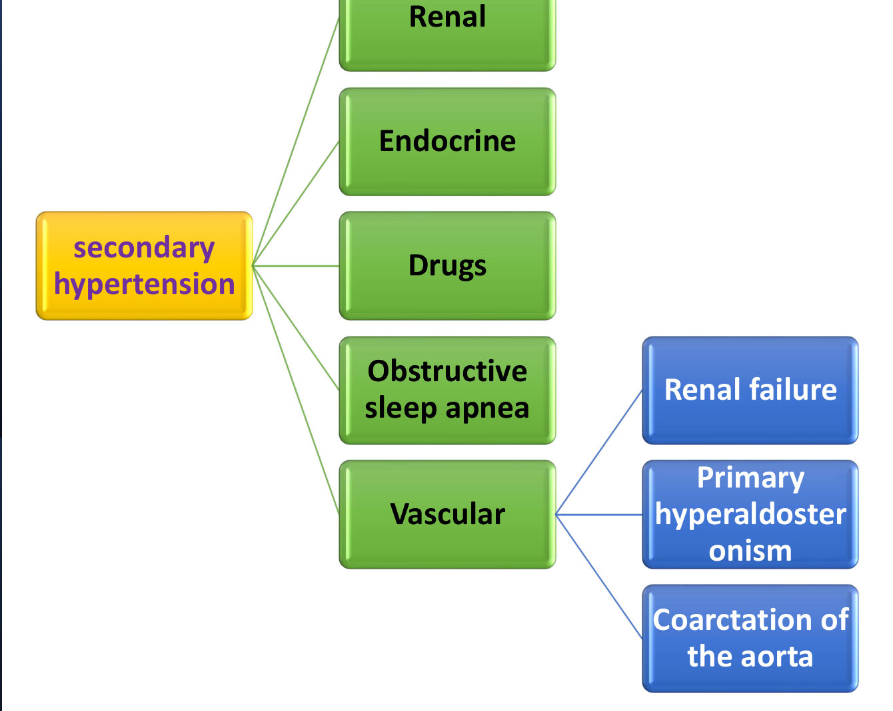

### 2.3 Etiology & Risk Factors of Primary HTN (Slide 10)
Primary HTN is directly related to **total peripheral resistance × cardiac output** (BP = CO × TPR).

| Non-modifiable | Modifiable |
|---|---|
| Positive family history | ⭐ **Obesity: the greatest modifiable risk factor** |
| Ethnicity | Diabetes |
| Advanced age | Smoking |
| | Excessive alcohol |
| | High-sodium diet |
| | Physical inactivity |
| | Psychological stress |

### 2.4 BP Categories (Slides 11–13) ⭐

**AHA 2022 / 2025 (the ones to memorise):**

| Category | Systolic | | Diastolic |
|---|---|---|---|
| **Normal** | < 120 | **and** | < 80 |
| **Elevated** | 120–129 | **and** | < 80 |
| **Stage 1 HTN** | 130–139 | **or** | 80–89 |
| **Stage 2 HTN** | ≥ 140 | **or** | ≥ 90 |
| **Hypertensive crisis** | > 180 | **and/or** | > 120 |

- BP must be based on the **average of ≥ 2 careful readings on ≥ 2 occasions** (slide 13, AHA 2025 Table 4).
- If SBP and DBP fall in different categories, use the **higher** one.

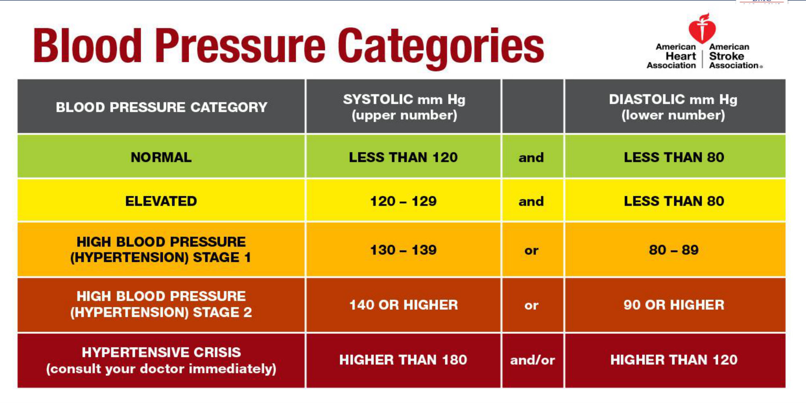 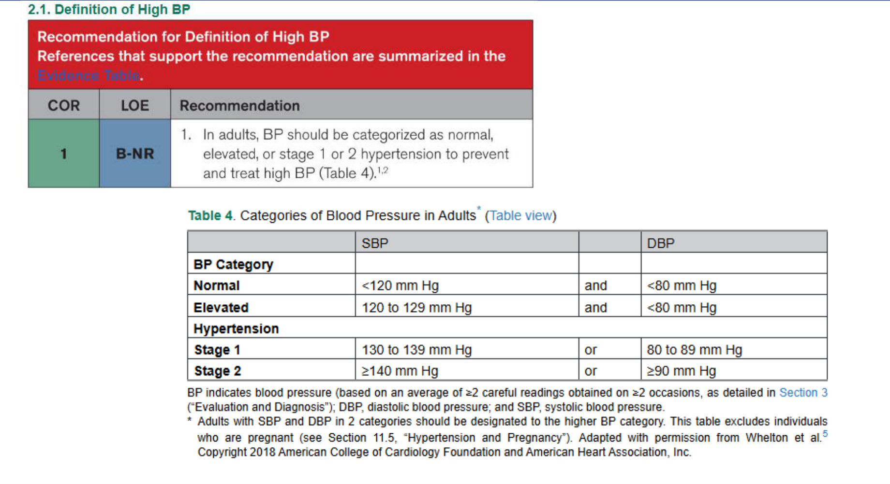

**Guideline comparison (slide 12):**

| Guideline | Labels (SBP / DBP) |
|---|---|
| **ACC/AHA 2017** | Normal < 120/< 80 · Elevated 120–129/< 80 · Stage 1 130–139/80–89 · Stage 2 ≥ 140/≥ 90 |
| **ESH 2023** | Optimal < 120/< 80 · Normal 120–129/80–84 · **High-normal 130–139/85–89** · Grade 1 140–159/90–99 · Grade 2 160–179/100–109 · Grade 3 ≥ 180/≥ 110 |
| **ESC 2024** | Non-elevated < 120/< 70 · **Elevated 120–139/70–89** · Hypertension ≥ 140/≥ 90 |

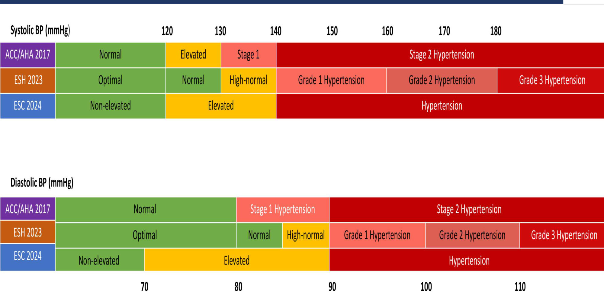

> **Mnemonic:** *American = 130, European = 140.* Only ACC/AHA calls 130–139 "hypertension". ESH calls it "high-normal" and ESC calls it "elevated".

### 2.5 Thresholds & Follow-up Algorithm (Slide 14, AHA 2025)

| Category | Action | Reassess |
|---|---|---|
| Normal | Lifestyle | **1 year** |
| Elevated | Lifestyle | **3–6 months** |
| Stage 1 | Lifestyle. **If DM, CKD or 10-y PREVENT risk ≥ 7.5% → drug.** If not, reassess in 3–6 mo; still stage 1 → drug | 1 month on drug |
| Stage 2 | Lifestyle **+ drug** | **1 month** |
| On drug: goal met? | Yes → reassess **3–6 months**. No → intensify and optimise adherence | |

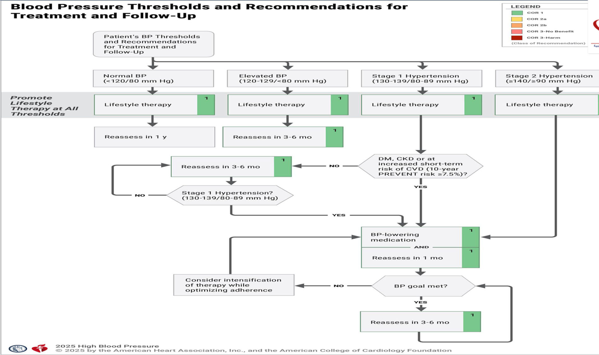

### 2.6 BP Measurement (Slide 15): Office Technique
1. No **caffeine, exercise or smoking** for **≥ 30 min**; **empty bladder**.
2. Use a **validated** device (validatebp.org).
3. Correct cuff on a **bare arm**.
4. Arm supported at **heart level**.
5. Seated, feet flat, legs uncrossed, back supported, **> 5 min rest**.
6. **No talking** by patient or clinician; no phone.
7. Temperature-controlled room.
8. Take **≥ 2 readings 1 min apart** and average them; tell the patient the result.

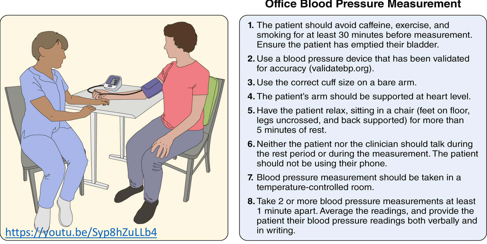

### 2.7 Subtypes & Variants (Slides 16–17)

**Office vs out-of-office BP (slide 16).** Office threshold is SBP **140/90**. Ambulatory thresholds: daytime **135/85**, night-time **120/70**, morning **135/85**, 24-h **130/80**.

| | Ambulatory LOW | Ambulatory HIGH |
|---|---|---|
| **Office LOW** | Normotension | ⭐ **Masked HTN** (missed in clinic) |
| **Office HIGH** | ⭐ **White-coat HTN** (high only in clinic) | Sustained HTN |

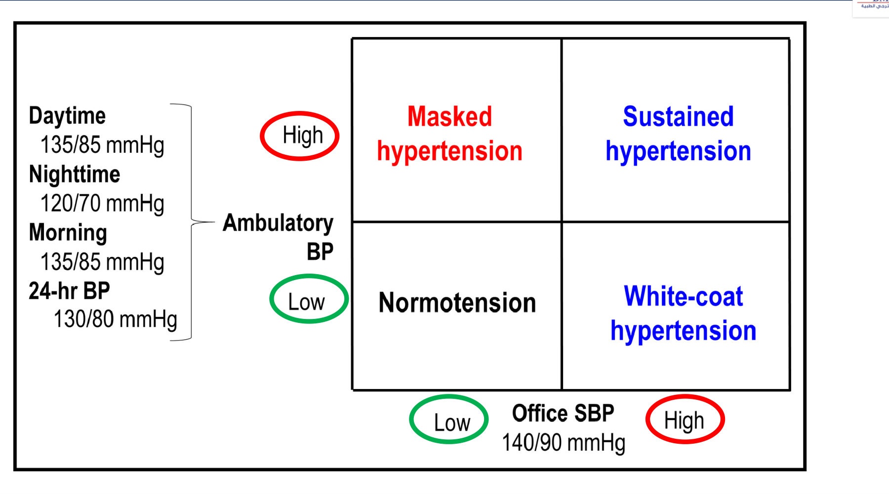

**Isolated systolic HTN (slide 17)** ⭐

| Feature | Detail |
|---|---|
| Definition | SBP **≥ 140** with DBP **≤ 90** |
| Cause | ↓ arterial **elasticity/compliance with ageing** |
| Treatment | Lifestyle + drugs: **thiazide diuretic OR dihydropyridine CCB** |

### 2.8 Clinical Features (Slide 18)
- HTN is usually **asymptomatic** until either:
    - **end-organ damage** develops, or
    - BP rises acutely (**hypertensive crisis**).
- **Secondary HTN** usually shows the **symptoms of the underlying disease**.
- Slide figure, crisis ≥ 180 and/or ≥ 120:
    - **Urgency** (no acute organ damage): headache, light-headedness/vertigo, epistaxis, restlessness/insomnia.
    - **Emergency** (with acute organ damage): ICH/stroke, hypertensive encephalopathy, retinal haemorrhages, acute HF/MI, hypertensive pulmonary oedema, aortic dissection, renal failure.

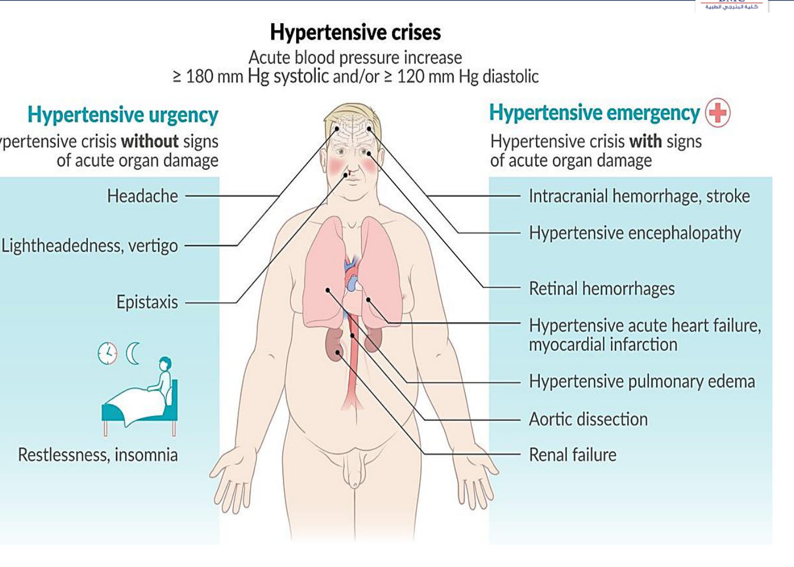

> 🔁 **Recap: Defining and classifying HTN.** HTN is ≥ 130/80 (ACC/AHA) or ≥ 140/90 (JNC 8 and Europe). It is 90% primary; obesity is the biggest modifiable risk. Categories: normal < 120/< 80, elevated 120–129/< 80, stage 1 130–139 or 80–89, stage 2 ≥ 140 or ≥ 90. Measure properly and use ambulatory readings to catch white-coat and masked HTN. ISH in the elderly → thiazide or CCB. Usually silent.
> 🔗 **Link:** 10% of patients have a curable cause. Spotting it changes management completely.
> ▶️ **Up next: Secondary hypertension.**

---

### 2.9 Secondary HTN: Causes & Clues (Slides 19–20) ⭐

> **Mnemonic RECENT** (slide 19): **R**enal · **E**ndocrine · **C**oarctation of the aorta · **E**strogen (OCPs) · **N**eurological (↑ ICP, psychostimulants) · **T**reatment (drugs)

**Signs suggesting a secondary cause (slide 20):**

| Clue | Think of |
|---|---|
| ⭐ **Onset < 30 years** | Any secondary cause, especially renovascular (FMD) and coarctation |
| ⭐ **Right vs left arm BP difference** | **Aortic dissection** (rare, life-threatening) |
| ⭐ **Upper vs lower limb BP difference** | **Coarctation of the aorta** |
| *[added]* Resistant HTN, sudden onset or worsening, hypokalaemia | Hyperaldosteronism, RAS |

### 2.10 Renal HTN (Slide 21)
1. **Renal artery stenosis.** Causes: **atherosclerosis**, **fibromuscular dysplasia**, **polyarteritis nodosa**. Further work-up is indicated if:
    - Recurrent **flash pulmonary oedema**
    - **Abdominal bruit**
    - ⭐ **Serum creatinine ↑ ≥ 50% within 1 week of starting an ACEI or ARB**
    - **Hypokalaemia** (from secondary hyperaldosteronism)
    - **Asymmetric kidney size**
2. **Renal parenchymal disease:** glomerulonephritis, polycystic kidney disease.
3. **Chronic kidney disease.**

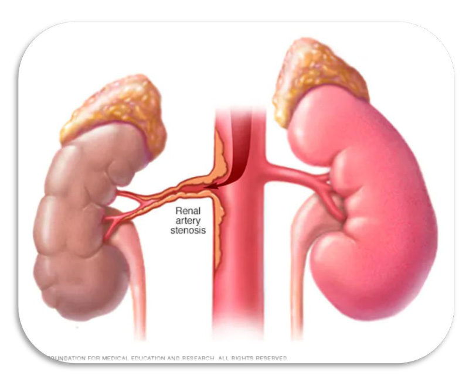

*[added]* **Atherosclerotic RAS** affects the **ostium/proximal artery** in **older smokers with vascular disease**. **FMD** affects the **mid/distal artery** ("string of beads") in **young women** and also children. Diagnosis is by **duplex US, CT angiography or MR angiography**; catheter angiography is the gold standard.

### 2.11 Endocrine HTN (Slides 22–24)

| Cause | Key point |
|---|---|
| ⭐ **Primary hyperaldosteronism (Conn)** | HTN + **hypokalaemia**. Rx: **spironolactone/eplerenone** (slide 37) |
| ⭐ **Pheochromocytoma** | See below |
| Hypercortisolism (Cushing) | |
| Hyperthyroidism | Systolic HTN, wide pulse pressure *[added]* |
| Primary hyperparathyroidism | Hypercalcaemia |
| Congenital adrenal hyperplasia | 11β- or 17α-hydroxylase deficiency *[added]* |
| Acromegaly | |

**Pheochromocytoma (slides 23–24):**
- **Features:** resistant HTN · **paroxysmal** HTN · episodic headaches · palpitations · diaphoresis.
- **Suspect when:** family history of endocrine tumours (*[added]* MEN2, VHL) · cutaneous features of **NF type 1**.
- **Tests:** ↑ **24-h urinary fractionated metanephrines** · ↑ **plasma metanephrines**.

> **Mnemonic: the 5 P's** (slide 23) = **P**ressure (HTN) · **P**ain (headache) · **P**erspiration · **P**alpitation · **P**allor.

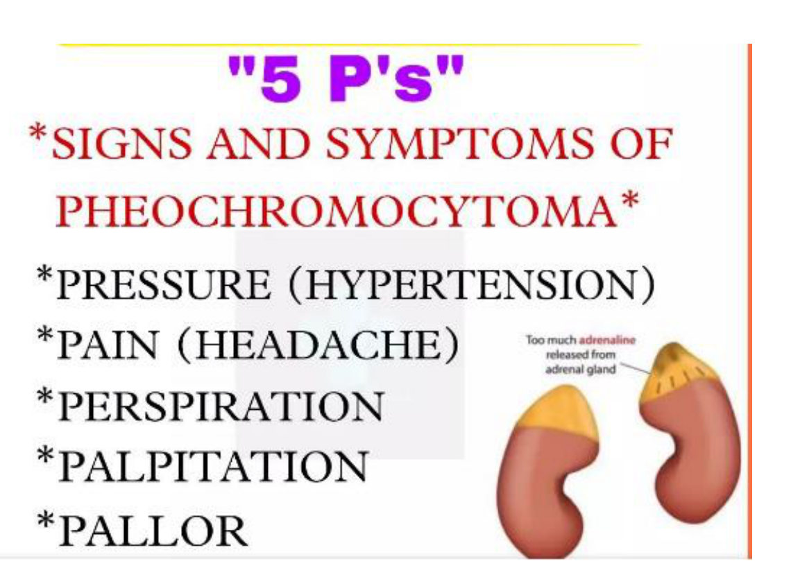 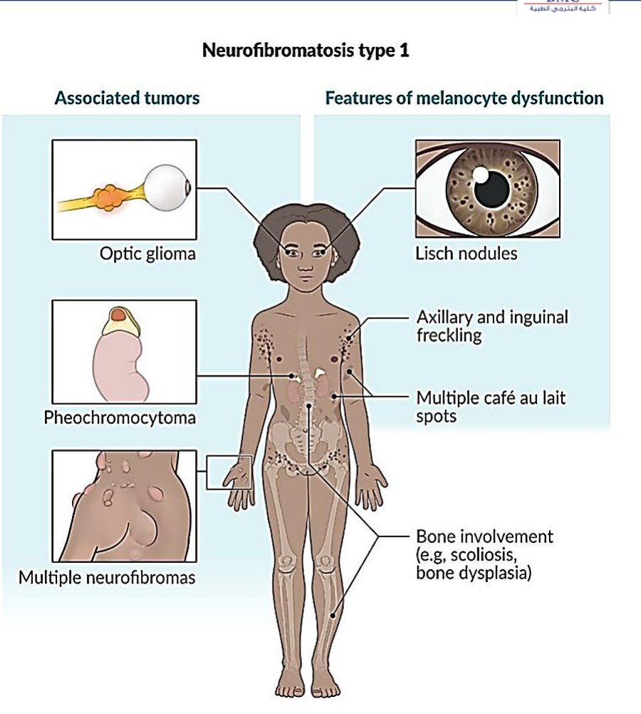

*NF1 figure (slide 24):* associated tumours (optic glioma, **pheochromocytoma**, multiple neurofibromas); melanocyte features (**Lisch nodules**, axillary/inguinal **freckling**, **café-au-lait** spots); bone involvement (scoliosis, bone dysplasia).

### 2.12 Coarctation & OSA (Slide 25)
- **Coarctation of the aorta distal to the left subclavian artery** gives a **BP difference between the upper and lower limbs**.
    - *[added]* Other signs: radio-femoral delay, rib notching, "3" sign on CXR. Associated with **Turner** syndrome and a bicuspid aortic valve.
- **Obstructive sleep apnoea.** Work-up is indicated if:
    - resistant HTN
    - daytime sleepiness
    - ➤ **Treating OSA with sleep studies (→ CPAP) often resolves the HTN.**

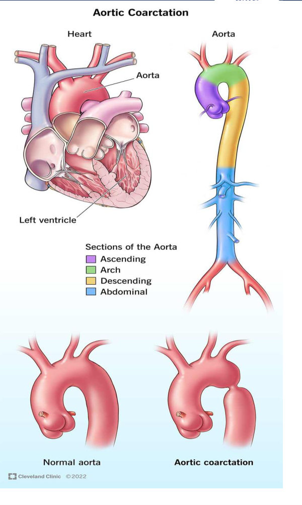

### 2.13 Substance-Related HTN (Slide 26)

| Recreational | Medications |
|---|---|
| Amphetamines | Sympathomimetics (decongestants) |
| Cocaine | Corticosteroids |
| Phencyclidine (PCP) | **NSAIDs** |
| | **Oral contraceptives** |

➤ **Urine drug screen** belongs in the work-up.

> 🔁 **Recap: Secondary HTN.** RECENT. Clues: age < 30, resistant, hypoK, bruit, creatinine jump on ACEI/ARB, flash oedema, arm–arm or arm–leg BP gap. Renal artery stenosis (atherosclerosis or FMD) → CTA/MRA/duplex. Conn → hypoK. Pheo → 5 P's + metanephrines (NF1 link). Coarctation → upper vs lower limb gap. OSA → CPAP. Drugs: cocaine, amphetamine, NSAIDs, OCPs, steroids, decongestants.
> 🔗 **Link:** Before treating, establish the diagnosis, screen the right people and assess organ damage and CVD risk.
> ▶️ **Up next: Diagnostics and screening.**

---

### 2.14 Diagnostics & Screening (Slides 27–28)
- **Approach:** do a secondary-cause work-up when the patient has suggestive signs.
- **Screening:**
    - **Annual:** age **> 40 years**, or **any age with risk factors** for primary HTN.
    - **Every 3–5 years:** age **18–39** with previously normal BP (**< 130/85**) and no risk factors.

**New HTN: initial evaluation (slide 28).**
The exam focuses on three things:
- ✓ Signs of a **secondary** cause
- ✓ **Target-organ damage**
- ✓ **ASCVD risk**

| Routine studies | Additional |
|---|---|
| Fasting glucose | **HbA1c** |
| Serum Na, K, Ca | |
| Creatinine + eGFR | |
| Lipid profile (HDL, LDL, TG) | |
| Urinalysis | |
| **ECG** | |

> 🔁 **Recap: Diagnosis.** Screen yearly if over 40 or at risk; every 3–5 years if 18–39 and normal. Baseline tests: glucose, electrolytes incl. Ca, creatinine/eGFR, lipids, UA, ECG, ± HbA1c. Look for a secondary cause, organ damage and ASCVD risk.
> 🔗 **Link:** Once confirmed, start lifestyle therapy for everyone and choose who gets drugs.
> ▶️ **Up next: Treatment.**

---

### 2.15 Treatment Approach (Slides 29–30)
- **Lifestyle changes for ALL** patients with **SBP > 120 or DBP > 80**.
- **Titrate** to target: **< 130/80** for most adults.
- **Follow up regularly** and tailor therapy.

**Risk-based thresholds (slide 30, AHA 2025):**

| Question | Yes → |
|---|---|
| Average BP **≥ 140/90**? | Start drug (lower BP + CVD prevention) |
| Existing **clinical CVD** (CHD, stroke, HF)? | Drug if average SBP ≥ 130 or DBP ≥ 80 (secondary prevention) |
| **DM or CKD**, or **10-y PREVENT-CVD ≥ 7.5%**? | Drug if SBP ≥ 130 or DBP ≥ 80 (primary prevention) |
| None of the above | Drug if still **≥ 130/80 after 3–6 months of lifestyle** |

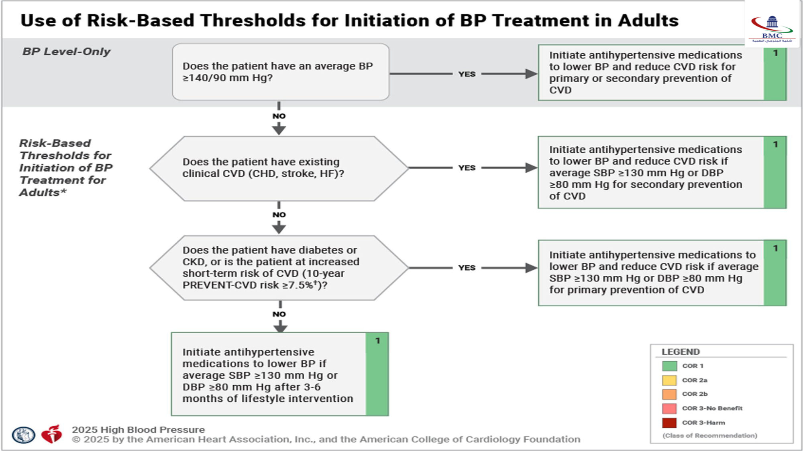

### 2.16 Lifestyle (Slides 31–32) ⭐

| Intervention (in order of effect) | Target | ≈ SBP reduction |
|---|---|---|
| ⭐ **Weight loss (most effective)** | Ideal body weight | **~1 mmHg per kg** lost |
| **DASH diet** | Fruit, vegetables, whole grains; low saturated/trans fat | **11 mmHg** |
| ↓ **Dietary sodium** | **< 1500 mg/day** | **5–6 mmHg** |
| ↑ **Dietary potassium** | **3.5–5 g/day** (fruit, vegetables) | **4–5 mmHg** |
| **Aerobic exercise** | **90–150 min/week** | **5–8 mmHg** |
| **Dynamic resistance** (weights) | 90–150 min/week | **4 mmHg** |
| **Isometric resistance** (hand grip) | **3 sessions/week** | **5 mmHg** |

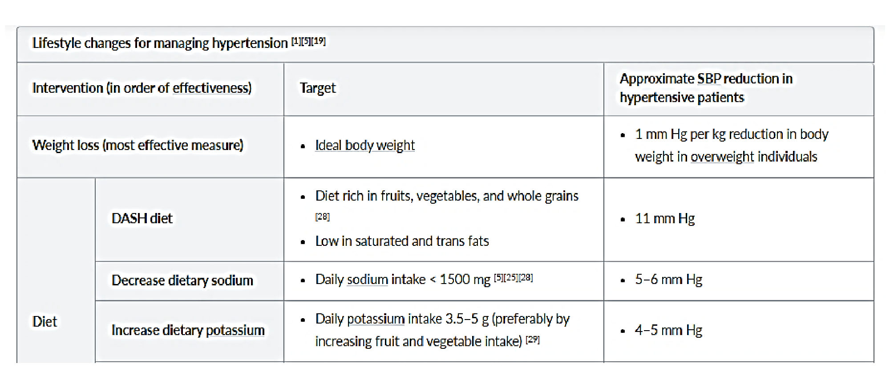 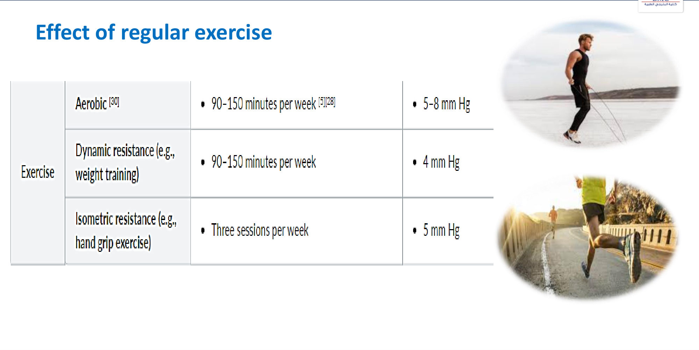

### 2.17 Indications for Drug Therapy (Slide 33) ⭐
- **SBP ≥ 140 or DBP ≥ 90**, OR
- **SBP ≥ 130 or DBP ≥ 80** plus **≥ 1** of:
    - **Clinical ASCVD** (IHD, PAD, previous stroke) or **CHF**
    - **10-y ASCVD risk ≥ 10%**; **age ≥ 65**; **diabetes**

*The 2017 list (slide 33) uses 10-y risk ≥ 10%. The 2025 algorithm (slide 30) uses PREVENT ≥ 7.5% and adds CKD. Know both, and say which guideline you mean.*

### 2.18 Choosing the Initial Drug (Slide 34) ⭐

| Situation | Start with |
|---|---|
| **Stage 1** (130–139 / 80–89) | **Monotherapy** |
| **≥ 140/90 AND > 20/10 above target** | ⭐ **Combination therapy**: **ACEI or ARB + DHP-CCB**, OR **ACEI or ARB + thiazide-type diuretic** |
| **Black patients** (incl. diabetics) **without CHF or CKD** | ⭐ **Thiazide-type diuretic or CCB** |
| Major comorbidities | Choose by comorbidity (table below) |

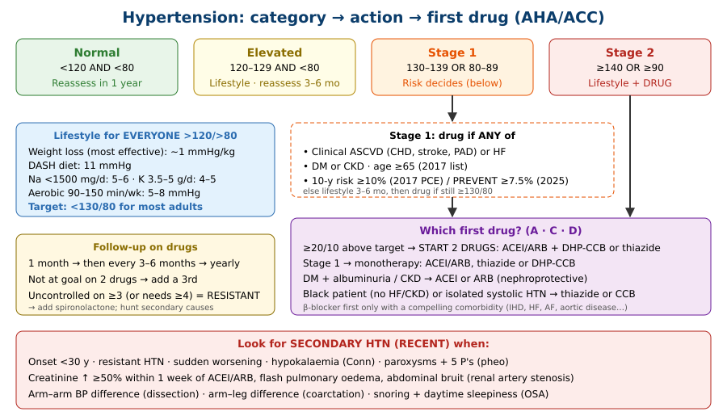

### 2.19 First-Line Agents (Slide 35)

| Class | Examples | Preferred when |
|---|---|---|
| **ACEI** | **Lisinopril, enalapril, captopril** | ⭐ **Nephroprotective** → **DM with albuminuria**, **renal disease** |
| **ARB** | **Losartan, valsartan** | Same as ACEI (*[added]* use if ACEI cough) |
| **Thiazide diuretics** | **Chlorthalidone, hydrochlorothiazide** | ⭐ **Black patients** (initial therapy); **isolated systolic HTN** |
| **DHP-CCB** | **Amlodipine (preferred)**, nifedipine | ⭐ **Black patients**; **ISH** |
| Non-DHP CCB | Diltiazem, verapamil | **Less commonly used** |

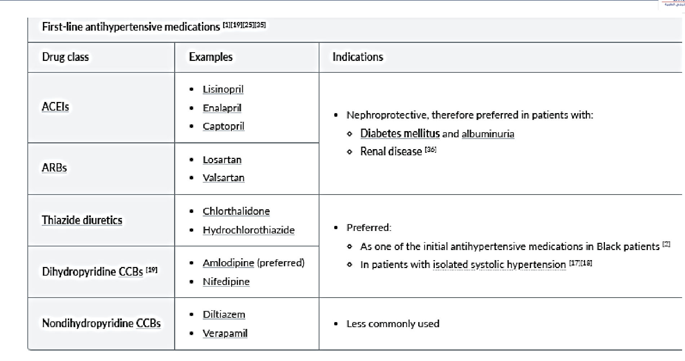

> **Mnemonic: A–C–D** = **A**CEI/ARB · **C**CB · **D**iuretic (thiazide). These are the three first-line groups. **B**eta-blockers are first-line only with a compelling indication.

*[added] Never combine ACEI + ARB. Both are contraindicated in pregnancy and bilateral RAS, and cause hyperkalaemia. ACEI → dry cough and angioedema (bradykinin). DHP-CCB → ankle oedema. Thiazides → see the 4 hypos/4 hypers below.*

### 2.20 Second-Line Agents (Slides 36–38)

**β-blockers (slide 36).**
- Combined α + β: **carvedilol, labetalol**
- Non-cardioselective: **nadolol, propranolol**
- Cardioselective: **atenolol, bisoprolol, metoprolol succinate**

⭐ **First-line only with these comorbidities:**
- IHD
- **Heart failure**
- **AF**
- **Thoracic aortic disease** (dissection, aneurysm)
- **Thyrotoxicosis**
- **Migraine**
- **Essential tremor**

> **Mnemonic for β-blocker indications: "HIT-MAT"** *[added]* = **H**eart failure · **I**HD · **T**hyrotoxicosis · **M**igraine · **A**F / **A**ortic disease · **T**remor.

**Loop diuretics (slide 37):** **furosemide, torsemide**. Preferred in **symptomatic HF** and **CKD with GFR < 30 mL/min** (thiazides lose efficacy).

**Side effects of furosemide and thiazides (slide 37):**

| 4 **hypo** | 4 **hyper** (glucose) |
|---|---|
| 1. **Hypokalaemia** (↑ risk of **digitalis toxicity**) | 5. Hyperglycaemia |
| 2. Hypovolaemia | 6. Hyperlipidaemia |
| 3. Hyponatraemia | 7. Hyperuricaemia (gout) |
| 4. Hypochloraemic metabolic alkalosis | 8. ⭐ **Hypercalcaemia (thiazide ONLY)** |

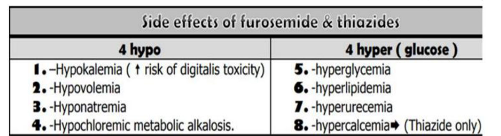

*[added] Loops cause **hypo**calcaemia ("loops lose calcium"). That is why thiazides are used for calcium kidney stones.*

**Potassium-sparing diuretics (slide 37):**
- **Aldosterone antagonists**:
    - Steroidal: **spironolactone, eplerenone**. Non-steroidal: **finerenone**.
    - Preferred for HTN from **primary hyperaldosteronism**. Frequent **add-on in resistant HTN**.
- **ENaC blockers**: **amiloride, triamterene**. Add-on for patients with **hypokalaemia on thiazides**.

**Others (slide 38):**

| Class | Drugs | Use |
|---|---|---|
| **α1-blockers** | Prazosin, doxazosin | **Pheochromocytoma** (*[added]* α before β!); adjunct in **BPH** |
| **Direct arteriolar vasodilators** | **Hydralazine**, minoxidil | ⭐ **Hydralazine is an option in pregnancy** |
| **Combined α + β** | Carvedilol, labetalol | *[added]* Labetalol is first-line in pregnancy and IV in crisis |

### 2.21 Long-Term Follow-up (Slide 39)
- After starting drugs: **follow up at ~1 month**, **reassess every 3–6 months**, then **annually**.
- **Titrate** to goal. **If not at goal on 2 drugs → add a 3rd** and **evaluate for secondary HTN** if indicated.

> 🔁 **Recap: Treatment.** Lifestyle for everyone over 120/80: weight loss is most effective at ~1 mmHg/kg; DASH 11; Na < 1.5 g 5–6; K 4–5; aerobic 5–8. Drugs for ≥ 140/90, or ≥ 130/80 with ASCVD, DM, CKD, age ≥ 65 or high risk. Start 2 drugs if > 20/10 above target. First-line A-C-D: ACEI/ARB (DM + albuminuria, CKD), thiazide/DHP-CCB (Black patients, ISH). β-blockers need a compelling indication. Loops for HF/GFR < 30; spironolactone for Conn and resistant HTN; α-blockers for pheo/BPH; hydralazine in pregnancy. Follow up at 1 mo → 3–6 mo → yearly.
> 🔗 **Link:** Untreated HTN damages blood vessels. What follows is the target-organ damage, chronic and acute.
> ▶️ **Up next: Complications and hypertensive crises.**

---

### 2.22 Complications (Slides 40–42)

| System | Complications |
|---|---|
| **Cardiovascular** (hypertensive vascular disease) | **LVH**/hypertrophic cardiomyopathy, **CHF**, **CAD/MI**, **AF**, **aortic aneurysm**, **aortic dissection**, **carotid stenosis**, **PAD**, atherosclerosis |
| **Brain** | **Stroke** |
| **Kidneys** | **Hypertensive nephrosclerosis** (renal vascular injury from long-standing HTN), **CKD** |
| **Eyes** | **Hypertensive retinopathy**; arteriosclerotic/HTN-related retinal vessel changes |

⭐ **Papilloedema in a hypertensive patient may indicate a hypertensive crisis** and needs urgent BP lowering (slide 42).

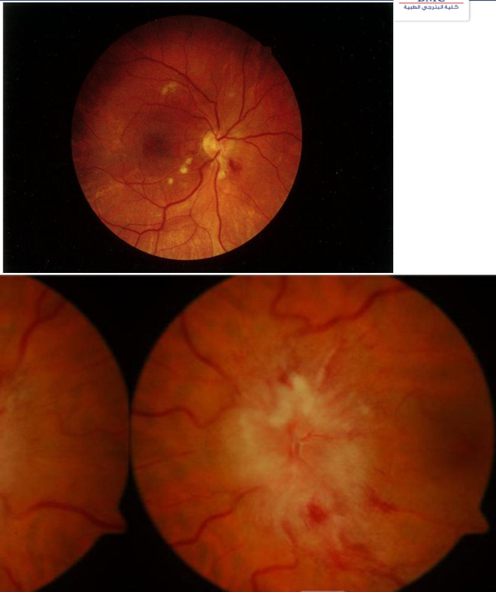

*[added] Keith–Wagener–Barker grades: I arteriolar narrowing → II AV nicking → III flame haemorrhages + cotton-wool spots + hard exudates → IV **papilloedema** (malignant HTN).*

### 2.23 Hypertensive Crisis (Slides 43–46) ⭐

| Term | Definition |
|---|---|
| **Hypertensive crisis** (acute severe HTN, the preferred term) | SBP **≥ 180** and/or DBP **≥ 120** |
| **Hypertensive urgency** | Crisis that is asymptomatic or has isolated nonspecific symptoms (headache, dizziness, epistaxis), **WITHOUT acute organ damage** |
| **Hypertensive emergency** | Crisis **WITH signs of acute end-organ damage**, mainly cardiovascular, CNS and renal |

**Etiology (slide 44):**
- **Drug-related**
    - **Non-adherence** to antihypertensives
    - **Exacerbating drugs**: MAOIs, TCAs, NSAIDs, cocaine, amphetamines, ecstasy, stimulant diet pills
    - ⭐ **Tyramine-rich foods on MAOIs**: wine, chocolate, aged cheese, cured meat
    - **MAOI overlap** with other monoamine-raising drugs (e.g., SSRIs) from inadequate washout
- **Pheochromocytoma**
- **Hyperthyroidism**
- **Acute/rapidly progressive renal disorders**
- **Collagen vascular disease** (e.g., SLE)
- **Eclampsia/pre-eclampsia**

**Emergency: organ damage by system (slide 45):**

| System | Damage |
|---|---|
| Cardiac | **HF exacerbation, MI, aortic dissection** |
| Neuro | **Hypertensive encephalopathy, stroke** |
| Renal | **Acute hypertensive nephrosclerosis, AKI** |
| Ophthalmic | **Acute hypertensive retinopathy** |
| Other | **Microangiopathic haemolytic anaemia** (fatigue, pallor) |

**Management (slide 46, AHA 2025):**

| Scenario | Target |
|---|---|
| ⭐ **Emergency → admit to ICU** | |
| **Aortic dissection** | **SBP < 120 within the 1st hour** |
| **Pheochromocytoma crisis** | **SBP < 140 within the 1st hour** |
| **All other emergencies** | ↓ **SBP by 25% in the 1st hour** → **< 160/100–110 over the next 6 h** → **normal over 24–48 h** |
| **Severe HTN without organ damage** (identified in ED or OPD) | ⭐ **Avoid parenteral BP lowering or intensified oral therapy acutely**. Reinstitute/intensify oral meds. **OPD follow-up within 4 weeks** |

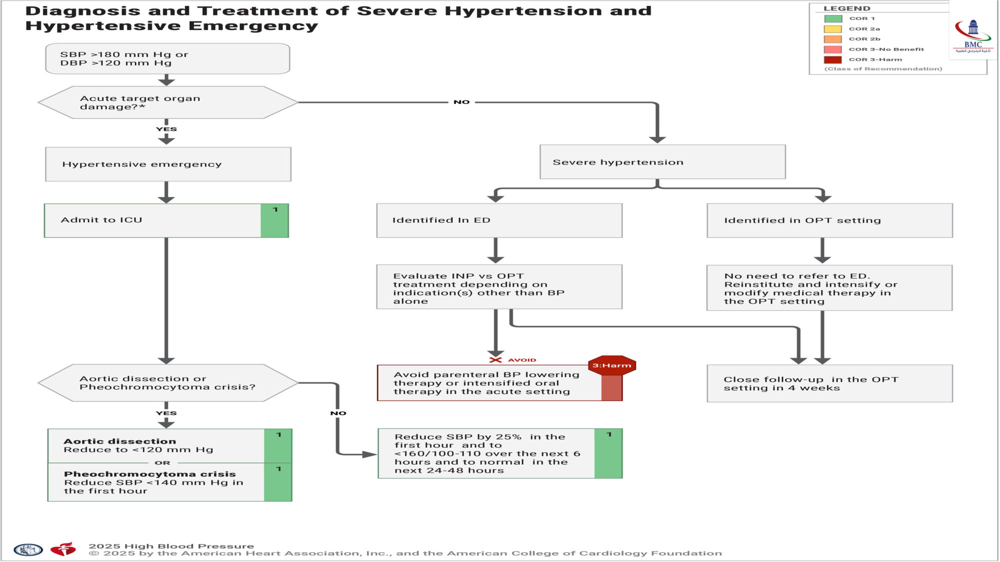

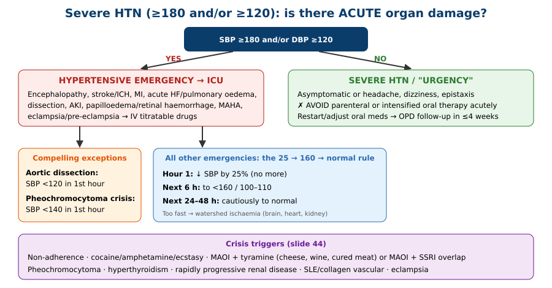

> **Rule: "25 – 160 – Normal"** → 25% in 1 h, 160/100 by 6 h, normal by 24–48 h. **Dissection is the exception: < 120 fast.**

> 🔁 **Recap: Complications and crises.** Chronic damage hits the heart (LVH, HF, CAD, AF, aorta), brain (stroke), kidney (nephrosclerosis, CKD) and eyes (retinopathy). Crisis ≥ 180/≥ 120: urgency has no organ damage (oral meds, no rush, review in 4 weeks); emergency has organ damage (ICU, IV, 25% in hour 1). Dissection: SBP < 120 in hour 1; pheo: < 140. Triggers include non-adherence, cocaine, MAOI + tyramine, pheo, eclampsia.
> 🔗 **Link:** Pregnancy has its own definitions, its own emergencies (pre-eclampsia, eclampsia, HELLP) and its own cure (delivery).
> ▶️ **Up next: Hypertensive disorders of pregnancy.**

---

### 2.24 Hypertensive Disorders of Pregnancy (Slides 47–52) ⭐

| Disorder | Definition |
|---|---|
| **Gestational HTN** | SBP **≥ 140** or DBP **≥ 90** on **2 readings ≥ 4 h apart**, **WITHOUT proteinuria or end-organ dysfunction**. Diagnosed **after 20 weeks**; **resolves by 12 weeks postpartum** |
| **Chronic HTN** | Diagnosed **before pregnancy or in the first 20 weeks** |
| **Hypertensive crisis in pregnancy** | SBP **> 160** or DBP **> 110** persisting **≥ 15 min** |
| **Pre-eclampsia** | New-onset gestational HTN **with proteinuria OR end-organ dysfunction** |
| **Superimposed pre-eclampsia** | Pre-eclampsia in a patient with **chronic HTN** |
| ⭐ **HELLP** | Life-threatening form of pre-eclampsia: **H**aemolysis, **E**levated **L**iver enzymes, **L**ow **P**latelets. **Can occur without HTN or proteinuria** |
| ⭐ **New HTN/proteinuria/organ dysfunction < 20 weeks** | Suggests **gestational trophoblastic disease** (molar pregnancy) |
| **Eclampsia** | **New-onset seizures** with no other cause, a convulsive manifestation of hypertensive pregnancy disorders |
| **Postpartum HTN** | Persists after delivery and usually resolves **within 12 weeks**. **> 12 weeks → consider a secondary cause** |

> **Number anchors: 20 – 4 – 12 – 160/110 – 15 – 34.**
> - **20** weeks splits chronic from gestational.
> - **4** h between the two readings.
> - **12** weeks postpartum to resolve.
> - **160/110** for **15** min = crisis.
> - **34** weeks = deliver.

**Management of urgent HTN in pregnancy (slide 50):**
- Start **antihypertensives** for urgent BP control (*[added]* labetalol, hydralazine, nifedipine; NO ACEI/ARB).
- **Magnesium sulfate** for seizure prophylaxis.
- Check for **indications for immediate delivery regardless of gestational age**:
    - **If present:** urgent delivery after **maternal haemodynamic stabilisation**.
    - **If absent:**
        - **≥ 34 weeks → deliver**
        - **24–34 weeks → corticosteroids for fetal lung maturity, then expedited delivery**
- ⭐ **Delivery is the only cure for pre-eclampsia, eclampsia and HELLP.**

**Indications for expedited delivery (slide 51):**
- **Eclampsia** (cerebral symptoms)
- **Pulmonary oedema**
- **DIC**
- **Placental abruption**
- **Labour or premature rupture of membranes**
- **Severe oligohydramnios**

**Eclampsia: medical management (slide 52):**
1. Treat the seizure; put the patient in the **left lateral decubitus** position.
2. Anticonvulsant: **magnesium sulfate first line**.
3. Antihypertensives for urgent BP control.
4. **Eclampsia is an indication for immediate delivery regardless of gestational age.**
5. ⭐ **Deliver only after the mother is stable and seizures have stopped.**

*[added] Watch for MgSO₄ toxicity: loss of patellar reflexes → respiratory depression → cardiac arrest. Antidote: **calcium gluconate**.*

> 🔁 **Recap: Pregnancy.** Gestational HTN is ≥ 140/90 twice ≥ 4 h apart, after 20 weeks, with no proteinuria, and resolves by 12 weeks postpartum. Chronic HTN starts before 20 weeks. Pre-eclampsia = HTN + proteinuria or organ dysfunction. HELLP can occur without HTN. Under 20 weeks think molar pregnancy. Crisis > 160/110 for 15 min. Treatment: MgSO₄ + antihypertensives + delivery (≥ 34 wk deliver; 24–34 wk steroids first). Eclampsia: left lateral, MgSO₄, stabilise, then deliver. Postpartum HTN > 12 weeks → secondary cause.

---

## 3. High-Yield Comparison Tables

### Table A: Clue → Secondary Cause → Test
| Clue | Cause | Confirmatory test |
|---|---|---|
| Young (esp. child/young woman), abdominal/flank bruit, creatinine ↑ ≥ 50% on ACEI/ARB, flash pulmonary oedema, asymmetric kidneys | **Renal artery stenosis** (FMD if young; atherosclerosis if old) | **CT angiography** / MRA / duplex US *[added]* |
| HTN + **hypokalaemia** (± metabolic alkalosis), resistant HTN | **Primary hyperaldosteronism** | *[added]* Aldosterone:renin ratio → **oral sodium loading** / saline suppression |
| **Paroxysmal** HTN + headache + sweating + palpitations + pallor; NF1 | **Pheochromocytoma** | **Plasma or 24-h urine metanephrines** |
| Central obesity, striae, proximal myopathy | **Cushing** | *[added]* 24-h urine cortisol, late-night salivary cortisol, 1 mg dex test (high-dose test localises) |
| Tremor, weight loss, tachycardia, wide pulse pressure | **Hyperthyroidism** | TSH, free T4 |
| Hypercalcaemia, stones | **Primary hyperparathyroidism** | **PTH** |
| Large hands/jaw | **Acromegaly** | **IGF-1** |
| Virilisation/ambiguity + HTN + hypoK | **CAH** (11β-OH) | **17-OH-progesterone** / 11-deoxycortisol *[added]* |
| **Arm–leg BP gap**, radio-femoral delay | **Coarctation** | *[added]* Echo / CT/MR angiography |
| **Right–left arm gap** + tearing pain | **Aortic dissection** | *[added]* CTA |
| Snoring, daytime sleepiness, obesity | **OSA** | Sleep study |

*Note: the wrong options in the opening MCQ (Q1) match this table. Each option is the confirmatory test for a different secondary cause.*

### Table B: Antihypertensive Classes
| Class | Examples | Preferred for | Classic side effects / cautions *[added unless on slide]* |
|---|---|---|---|
| **ACEI** | Lisinopril, enalapril, captopril | **DM + albuminuria**, CKD, HF, post-MI | Cough, angioedema, ↑ K, ↑ creatinine (RAS!), teratogenic |
| **ARB** | Losartan, valsartan | Same; ACEI cough | ↑ K, teratogenic |
| **Thiazide** | Chlorthalidone, HCTZ | **Black patients, ISH**, osteoporosis | 4 hypo/4 hyper; **↑ Ca** (slide 37) |
| **DHP-CCB** | **Amlodipine**, nifedipine | **Black patients, ISH** | Ankle oedema, flushing, reflex tachycardia |
| Non-DHP CCB | Diltiazem, verapamil | Rate control (AF) | Bradycardia, constipation (verapamil); avoid in HFrEF |
| **β-blocker** | Metoprolol, bisoprolol, atenolol, propranolol, carvedilol, labetalol | **IHD, HF, AF, aortic disease, thyrotoxicosis, migraine, tremor** | Bronchospasm, masks hypoglycaemia; never alone in pheo or cocaine |
| **Loop** | Furosemide, torsemide | **HF, GFR < 30** | ↓ K, ↓ **Ca**, ototoxic |
| **MRA** | Spironolactone, eplerenone, finerenone | **Conn**, **resistant HTN** | ↑ K, gynaecomastia (spironolactone) |
| **ENaC blocker** | Amiloride, triamterene | **Hypokalaemia on thiazide** | ↑ K |
| **α1-blocker** | Prazosin, doxazosin | **Pheo** (pre-op), **BPH** | First-dose orthostatic hypotension |
| **Vasodilator** | **Hydralazine**, minoxidil | **Pregnancy** (hydralazine) | Reflex tachycardia, drug-induced lupus (hydralazine), hirsutism (minoxidil) |

### Table C: Urgency vs Emergency
| | **Urgency** | **Emergency** |
|---|---|---|
| BP | ≥ 180 and/or ≥ 120 | ≥ 180 and/or ≥ 120 |
| Acute organ damage | **None** | **Present** (brain, heart, aorta, kidney, eyes, MAHA) |
| Symptoms | None or headache, dizziness, epistaxis | Encephalopathy, chest pain, dyspnoea, neuro deficit, ↓ urine |
| Setting | ED/OPD → home | **ICU** |
| Route | Oral (restart/adjust) | **IV titratable** |
| Speed | **No acute lowering**; follow-up ≤ 4 weeks | **↓ 25% in 1 h** (dissection < 120; pheo < 140) |

### Table D: Hypertensive Disorders of Pregnancy
| | Timing | Proteinuria / organ dysfunction | Key |
|---|---|---|---|
| Chronic | Before pregnancy or **< 20 wk** | No | Persists > 12 wk postpartum |
| Gestational | **> 20 wk** | **No** | Resolves **≤ 12 wk** postpartum |
| Pre-eclampsia | > 20 wk | **Yes** | MgSO₄; delivery cures |
| Superimposed | Chronic HTN + new pre-eclampsia | Yes | |
| HELLP | Usually 3rd trimester | Haemolysis, ↑ LFT, ↓ Plt | May lack HTN/proteinuria |
| Eclampsia | Any | + **Seizures** | Left lateral, MgSO₄, stabilise → deliver |
| < 20 wk pre-eclampsia picture | **< 20 wk** | Yes | **Molar pregnancy** |

### Table E: White-Coat vs Masked HTN
| | Office | Ambulatory/home | Risk |
|---|---|---|---|
| White-coat | **High** | Normal | ≈ low *[added]* |
| Masked | Normal | **High** | ≈ sustained HTN; often missed *[added]* |

---

## 4. Rules, Exceptions, Patterns

| Rule | Exception / nuance |
|---|---|
| HTN = ≥ 130/80 (ACC/AHA) | JNC 8, ESH and ESC use **≥ 140/90** |
| Use the **higher** category when SBP and DBP disagree | Stage uses "**or**"; normal and elevated use "**and**" |
| First-line = **ACEI/ARB, thiazide, DHP-CCB** | **β-blockers** are first-line only with a compelling comorbidity |
| Start monotherapy for stage 1 | **> 20/10 above target → start 2 drugs** |
| ACEI/ARB for diabetics with albuminuria | **Black patients without CKD/HF → thiazide or CCB** first |
| Diuretics cause hypo-everything | **Thiazides raise calcium**; loops lower it |
| Lower crisis BP by 25% in the first hour | **Dissection → SBP < 120**; **pheo → < 140** in the first hour |
| Severe HTN must be lowered | **Without organ damage: do NOT lower acutely with IV drugs** |
| Gestational HTN appears after 20 weeks | **< 20 weeks** with pre-eclampsia features → **molar pregnancy** |
| Pre-eclampsia requires HTN | **HELLP can occur without HTN or proteinuria** |
| Eclampsia → immediate delivery | **Only after the mother is stable and seizures stop** |
| Postpartum HTN resolves ≤ 12 weeks | **> 12 weeks → look for a secondary cause** |
| Creatinine rises a little on ACEI | **≥ 50% within 1 week → suspect bilateral RAS** |

---

## 5. Clinical Correlations
- **Child or young adult with severe HTN** → secondary cause until proven otherwise. A **flank or abdominal bruit** points to **renovascular** disease (FMD in the young) → **CT angiography** (opening case).
- **Papilloedema + confusion + BP 185/125** = **hypertensive emergency (encephalopathy)** → ICU, IV agent, 25% reduction in hour 1.
- **Hypokalaemia in a hypertensive patient not on diuretics** → think **Conn syndrome**; spironolactone is the drug of choice.
- **NF1 patient** with headaches and palpitations → screen for **pheochromocytoma** with metanephrines. *[added]* Before surgery, give **α-blockade before β-blockade** (unopposed α → crisis).
- **Patient on phenelzine who eats aged cheese** → hypertensive crisis (tyramine).
- **Arm–leg BP difference in a young patient** (*[added]* Turner syndrome) → coarctation.
- **Obese snorer with resistant HTN** → sleep study; CPAP may cure the HTN.
- **Elderly with SBP 165, DBP 78** → ISH → thiazide or amlodipine.
- **Black diabetic without CKD** → thiazide or CCB. **Diabetic with albuminuria** → ACEI/ARB.
- **Pregnant patient at 36 weeks with BP 165/112, headache and proteinuria** → MgSO₄ + labetalol/hydralazine + **deliver**.
- *[added]* Link to **CAD**: HTN drives LVH → ↑ O₂ demand → angina even with normal coronaries.

---

## 6. Rapid Revision (Last-Day)
1. **≥ 130/80** ACC/AHA; **≥ 140/90** JNC 8. **Resistant** = uncontrolled on ≥ 3 drugs or needing ≥ 4.
2. **90% primary / 10% secondary**. **Obesity** is the greatest modifiable risk factor.
3. **Normal < 120/< 80 · Elevated 120–129/< 80 · Stage 1 130–139 or 80–89 · Stage 2 ≥ 140 or ≥ 90 · Crisis ≥ 180 and/or ≥ 120.**
4. **Masked** = high only outside clinic; **white-coat** = high only in clinic.
5. **ISH** (SBP ≥ 140, DBP ≤ 90, ageing) → thiazide or DHP-CCB.
6. **RECENT**: Renal, Endocrine, Coarctation, Estrogen, Neuro, Treatment drugs.
7. **RAS clues**: flash oedema, bruit, **creatinine ↑ ≥ 50% within 1 week of ACEI/ARB**, hypoK, asymmetric kidneys.
8. **Pheo** = 5 P's + **metanephrines** (plasma or 24-h urine); NF1 link.
9. Arm–arm difference → **dissection**; arm–leg difference → **coarctation**.
10. Screen **yearly if > 40** or at risk; **every 3–5 years** if 18–39 and normal.
11. **Lifestyle for everyone > 120/80**: weight ~1 mmHg/kg (most effective), DASH 11, Na 5–6, K 4–5, aerobic 5–8.
12. **Target < 130/80.** Drugs if ≥ 140/90 or ≥ 130/80 + ASCVD, HF, DM, CKD, age ≥ 65 or high risk.
13. **> 20/10 above target → 2 drugs** (ACEI/ARB + CCB or thiazide).
14. **Black patients → thiazide or CCB**. **DM + albuminuria / CKD → ACEI/ARB**.
15. **β-blockers** only for IHD, HF, AF, aortic disease, thyrotoxicosis, migraine, tremor.
16. **Thiazide** → hypercalcaemia; **loops** for HF and **GFR < 30**; **spironolactone** for Conn and resistant HTN; **amiloride** for thiazide hypoK; **α-blockers** for pheo/BPH; **hydralazine** in pregnancy.
17. Follow-up: **1 month → 3–6 months → yearly**. Not controlled on 2 drugs → add a 3rd and look for a secondary cause.
18. **Emergency** = organ damage → ICU; **↓ 25% in 1 h → 160/100–110 by 6 h → normal by 24–48 h**. **Dissection < 120**; **pheo < 140**. **Urgency** → no acute IV; review ≤ 4 weeks.
19. **Gestational** HTN > 20 weeks, resolves ≤ 12 weeks; **pregnancy crisis > 160/110 for ≥ 15 min**; **< 20 weeks → molar**.
20. **Delivery cures** pre-eclampsia, eclampsia and HELLP. **≥ 34 weeks deliver**; **24–34 weeks steroids, then deliver**. **MgSO₄** for seizures.

---

## 7. Exam-Style Questions

**Q1 (lecture opening case).** A 10-year-old boy has severe headache, vomiting and confusion, BP 185/125, bilateral papilloedema and a bruit at the right costovertebral angle. Which test is most likely to confirm the diagnosis?
A. Oral sodium loading test · B. CT angiography · C. Serum IGF-1 · D. Serum PTH · E. High-dose dexamethasone suppression test · F. 17-OH-progesterone · G. Urinary catecholamine metabolites

> **Answer: B. CT angiography.** *[reasoning added; key not given on slides]*
> - The patient is a child with severe HTN and a **flank/abdominal bruit**. That means **renal artery stenosis**, most likely from **fibromuscular dysplasia**.
> - Encephalopathy and papilloedema make this a **hypertensive emergency**.
> - Imaging of the renal arteries confirms the diagnosis.
> - Each distractor tests for a different secondary cause:
>     - A: Conn
>     - C: acromegaly
>     - D: hyperparathyroidism
>     - E: Cushing localisation
>     - F: CAH
>     - G: pheochromocytoma

**Q2.** A 58-year-old Black man with type 2 diabetes, no albuminuria, normal eGFR and no heart failure has an average BP of 142/88. Which is the most appropriate initial drug?
A. Metoprolol · B. Lisinopril · C. Chlorthalidone · D. Furosemide · E. Doxazosin

> **Answer: C.** For **Black patients, including diabetics, without CHF or CKD**, start with a **thiazide-type diuretic or CCB** (slide 34).
> - Lisinopril would be preferred **if albuminuria or CKD** were present.
> - β-blockers need a compelling indication.
> - Loops are for HF or GFR < 30.
> - α-blockers are not first-line.

**Q3.** A 45-year-old woman's BP has stayed at 152/94 despite amlodipine, lisinopril and hydrochlorothiazide at full doses. Potassium is 3.1 mmol/L. Which drug is the most appropriate add-on?
A. Spironolactone · B. Hydralazine · C. Atenolol · D. Clonidine · E. Furosemide

> **Answer: A.** This is **resistant HTN** (≥ 3 drugs including a diuretic) with **hypokalaemia**, which suggests **primary hyperaldosteronism**.
> - Spironolactone treats Conn and is the frequent add-on in resistant HTN (slide 37). It also corrects K⁺.
> - She should also have an **aldosterone:renin ratio** checked *[added]*.

**Q4.** A man presents with BP 220/130, tearing chest pain radiating to the back, and a 25 mmHg difference between arms. What is the target in the first hour?
A. ↓ SBP by 25% · B. SBP < 160 · C. **SBP < 120** · D. SBP < 140 · E. No acute lowering; follow up in 4 weeks

> **Answer: C.** For **aortic dissection**, lower SBP to **< 120 within the first hour** (slide 46).
> - The 25% rule (A) is for other emergencies.
> - < 140 (D) is for pheochromocytoma crisis.
> - E applies to severe HTN *without* organ damage.

**Q5.** A 31-year-old woman at 30 weeks' gestation has BP 168/114 sustained for 20 minutes, 2+ proteinuria and headache. She has no seizures, the CTG is reassuring, and she has no DIC, abruption or pulmonary oedema. Beyond antihypertensives, what is the best management?
A. Immediate caesarean section · B. MgSO₄ + corticosteroids, then expedited delivery · C. Expectant management to 37 weeks · D. ACE inhibitor + discharge · E. MgSO₄ only, deliver at 40 weeks

> **Answer: B.** This is pre-eclampsia with crisis-level BP (> 160/110 for ≥ 15 min).
> - She has no indication for immediate delivery.
> - At **24–34 weeks**, give **corticosteroids for fetal lung maturity, then expedited delivery**, plus **MgSO₄ prophylaxis** (slide 50).
> - **ACEIs are contraindicated** in pregnancy *[added]*.

---

## 8. Exam Pitfalls & Traps
- **Mixing guideline numbers.** "Stage 1 HTN" (130–139) exists only in ACC/AHA. ESH calls 130–139/85–89 **high-normal** and starts "Grade 1" at 140. Read which guideline the question names.
- **AHA 2022 vs 2025 risk thresholds.** Slide 33 uses **10-y ASCVD ≥ 10%** (PCE); slides 14 and 30 use **PREVENT ≥ 7.5%**. The lecture shows both, so answer with the guideline the stem cites.
- **Crisis category on slide 11** reads "higher than 180 and/or higher than 120". Slide 43 says **≥ 180 / ≥ 120**. Treat the boundary value as crisis.
- **"And" vs "or".** Elevated BP needs **DBP < 80**: a reading of 125/82 is **stage 1**, not elevated.
- **Urgency is not an emergency.** Giving IV labetalol to an asymptomatic patient with BP 190/115 is **wrong**. Restart oral meds and follow up within 4 weeks.
- **Over-correction.** Dropping BP to normal in the first hour causes watershed stroke and MI. Use 25% in hour 1, with **dissection the only "fast and low" exception**.
- **Thiazides cause hypercalcaemia**; loops cause hypocalcaemia. Diuretic hypokalaemia raises **digoxin toxicity** risk.
- **β-blocker alone in pheochromocytoma or cocaine** → unopposed α → crisis. **α-blockade first** *[added]*.
- **Creatinine rise on ACEI**: up to ~30% is acceptable *[added]*. **≥ 50% within a week → RAS work-up** (slide 21).
- **HELLP without HTN** is still HELLP. **Pre-eclampsia before 20 weeks** = **molar pregnancy** until proven otherwise.
- **Eclampsia**: the order is **stabilise → stop seizures (MgSO₄) → deliver**, never "rush to theatre while seizing".
- **Coarctation vs dissection**: **upper vs lower** limb BP gap = coarctation; **right vs left arm** gap = dissection.
- **Lifestyle ranking**: the most effective single measure is **weight loss** (slide 31 lists it first). The **largest single number** on the table is **DASH (11 mmHg)**. If asked "most effective", answer weight loss, as the slide labels it.
