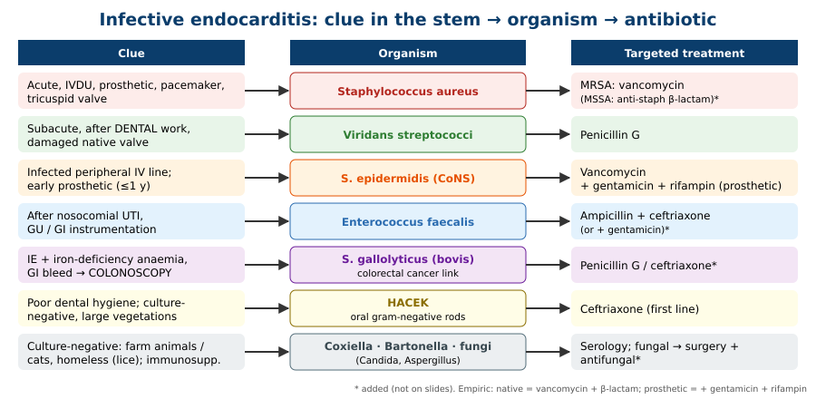
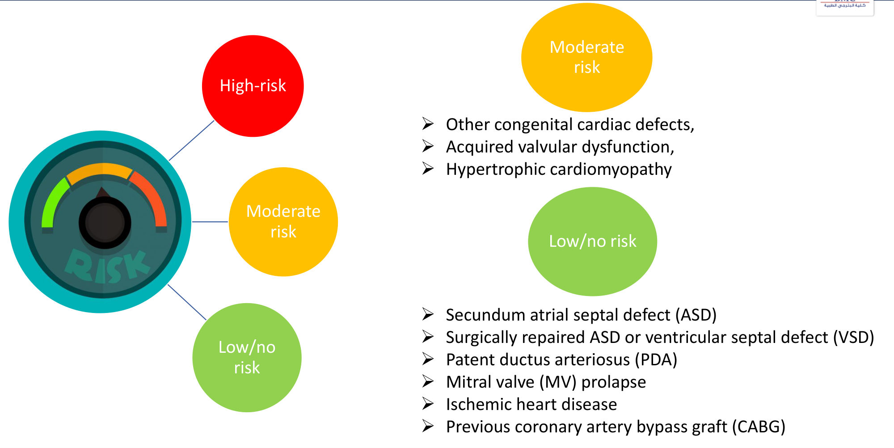
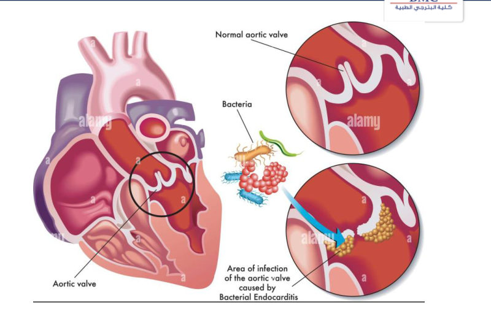
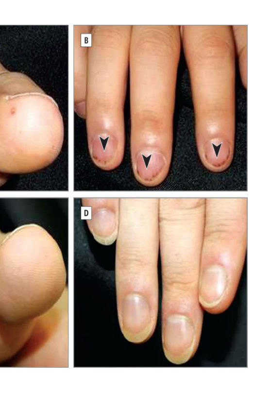
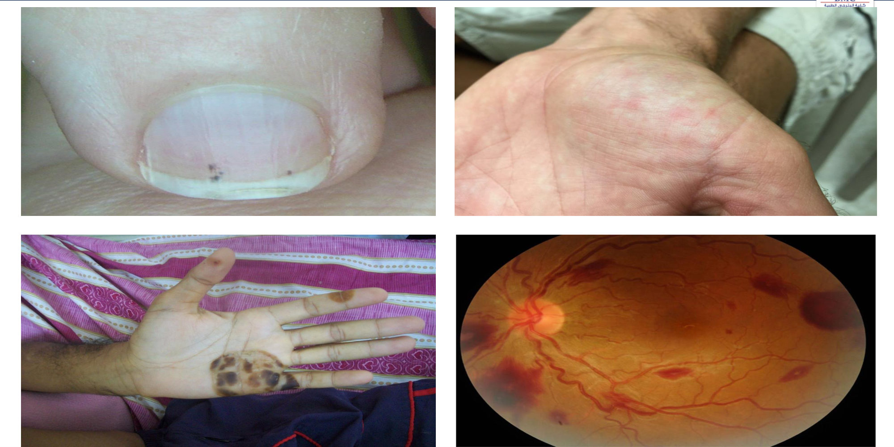
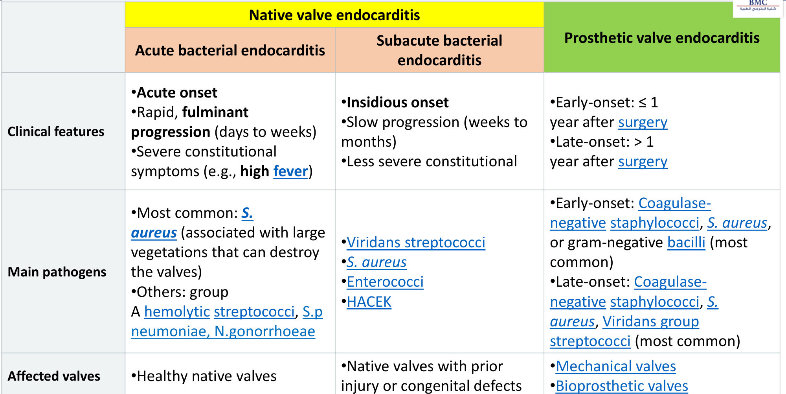
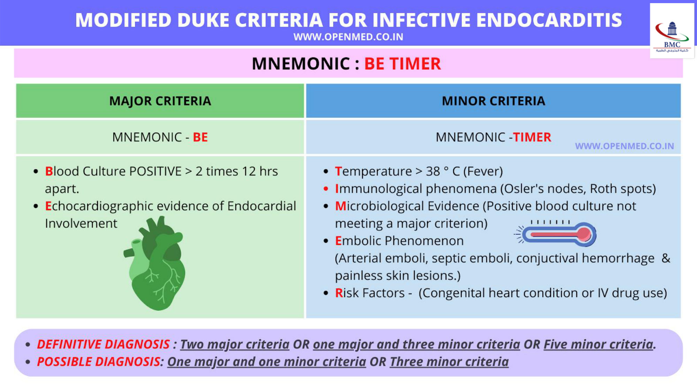

# Infective Endocarditis: Approach to a Case of Fever and Palpitation
**Dr. Muhammad Reihan, Internal Medicine** | Source: `Fever & Palpitation – Infective endocarditis` (31 slides)

> **Legend:** ⭐ = high-yield · *[added]* = not on slides. Images marked "Slide N" come from the lecture; "Added diagram" = drawn for these notes.

> 🔗 **Bridge from earlier lectures:**
> - **CAD lecture:** IE is a cause of **acute MR** and **acute AR**, the same "new murmur + pulmonary oedema" picture as papillary muscle rupture after MI.
> - **Pericardial diseases:** **perivalvular abscess** can extend into the conduction system or pericardium.
> - **Lung abscess / pulmonary vascular:** **right-sided (tricuspid) IE in IVDU** throws **septic pulmonary emboli** (multiple cavitating nodules).
> - **Rheumatic fever** (the companion lecture) leaves the damaged valves that IE later colonises.

---

## 1. Title / Objectives

| Domain | Objective | Likely tested as |
|---|---|---|
| Knowledge | ⭐ **Cardiac and extracardiac** manifestations of IE | Osler vs Janeway vs Roth; FROM JANE |
| Knowledge | ⭐ Cardiac conditions and **risk categories** (high / moderate / low) that warrant **prophylaxis** | "Who gets amoxicillin before a tooth extraction?" |
| Skill | ⭐ Apply the **modified Duke criteria** → definite vs possible | Count majors and minors |
| Skill | Management plan for IE with a **complication** | Heart block → abscess; HF → surgery |

**Lecture flow:** Opening case → Definition → Etiology (organisms, risk factors, risk classes) → Pathophysiology → Clinical features (constitutional, cardiac, extracardiac, FROM JANE) → Classification (acute / subacute / prosthetic) → Diagnostics (Duke, labs, echo) → Differential → Treatment → Prognosis → Prevention.

---

## 2. Main Content (Lecture Order)

### 2.0 Opening Case (Slides 5–6)
- **Patient:** 72-year-old man wants **medical clearance for a molar extraction**. He feels well and climbs 3 flights of stairs without dyspnoea.
- **History:** HTN, T2DM, IHD. **Aortic valve replacement for severe AS last year.** Two coronary stents 12 years ago.
- **Drugs:** aspirin, **warfarin**, lisinopril, metformin, sitagliptin, simvastatin.
- **Exam:** afebrile. A "grade 6/6" **systolic ejection click** at the right 2nd ICS (*= the prosthetic valve click*).

→ *Most appropriate next step?* (A) **oral amoxicillin 1 h before** · (B) echo before the procedure · (C) avoid nitrous oxide · (D) stop aspirin + warfarin 72 h before · (E) azithromycin 1 h before and 2 h after. *(Answered in §7, Q1.)*

### 2.1 Definition (Slide 7)
**Infective endocarditis** = infection of the **endocardium**, typically affecting **one or more heart valves**.

### 2.2 Etiology: Organisms (Slides 8–10) ⭐

| Organism | Setting |
|---|---|
| ⭐ ***Staphylococcus aureus*** | **Most common cause of ACUTE IE**, including **people who inject drugs**, **prosthetic valves**, **pacemakers/ICDs** |
| ⭐ **Viridans streptococci** | **Most common cause of SUBACUTE IE**, especially **after dental procedures** |
| ***Staphylococcus epidermidis*** | Bacteraemia from **infected peripheral venous catheters** (*[added]* and early prosthetic valve IE) |
| **Enterococci** (esp. *E. faecalis*) | IE **after nosocomial UTIs** (*[added]* GU/GI instrumentation) |
| ⭐ ***Streptococcus gallolyticus*** subsp. *gallolyticus* (Sgg; formerly *S. bovis*) | Associated with **colorectal cancer** → *[added]* **colonoscopy** |
| **HACEK** (gram-negative) | **Poor dental hygiene / periodontal infection** |
| **Fungal** (*Candida*, *Aspergillus fumigatus*) | **Immunosuppressed** (HIV, transplant), **IVDU**, **after cardiac surgery**, **long-term indwelling IV catheters** |
| ***Coxiella burnetii***, ***Bartonella*** spp. | Gram-negatives responsible for **culture-negative** endocarditis |

> **HACEK** = **H**aemophilus · **A**ggregatibacter · **C**ardiobacterium · **E**ikenella · **K**ingella (slide 9).

### 2.3 Risk Factors (Slide 11)

| Cardiac | Non-cardiac |
|---|---|
| Acquired valvular disease | **Poor dental status**, **dental procedures** |
| **Prosthetic heart valves** | **Non-sterile IV injection (IVDU)** |
| Congenital heart defects | **Intravascular devices** |
| | Surgery · **HIV** · **haemodialysis** |

### 2.4 Risk Classification (Slides 12–13) ⭐

| Class | Conditions |
|---|---|
| 🔴 **High risk** | **Prosthetic cardiac valve** · **previous IE** · **congenital heart disease** (unrepaired, **repaired within 6 months**, or repaired **with residual defects**) · **cardiac transplant with valve disease** · surgically constructed **systemic-to-pulmonary shunts or conduits** |
| 🟡 **Moderate risk** | **Other congenital cardiac defects** · **acquired valvular dysfunction** (e.g., rheumatic) · **hypertrophic cardiomyopathy** |
| 🟢 **Low / no risk** | **Secundum ASD** · **surgically repaired ASD or VSD** · **PDA** (*repaired, [added]*) · **mitral valve prolapse** · **ischaemic heart disease** · **previous CABG** |

### 2.5 Pathophysiology (Slide 14)
1. **Damaged valvular endothelium** → **sterile vegetation** (platelets + fibrin)
2. → **Bacterial colonisation** of the vegetation
3. → **Valve destruction with loss of function** (**valve regurgitation**)

- **Frequency of valve involvement:** ⭐ **mitral > aortic > tricuspid > pulmonary**.
- ⭐ **Tricuspid valve = most commonly affected in people who inject drugs** (associated with **Pseudomonas, S. aureus, Candida**).
- **Clinical consequences:** vegetation → **septic thromboemboli** → vessel occlusion → **infarction**; emboli can seed **metastatic infection** in other organs.

> 🔁 **Recap: Who gets IE and why.**
> - **Organisms:** S. aureus = acute (IVDU, prosthetics, devices); viridans = subacute after dental work; S. epidermidis = lines; Enterococcus = after UTI; S. gallolyticus = colon cancer; HACEK = poor teeth, culture-negative; fungi = immunosuppressed, IVDU; Coxiella/Bartonella = culture-negative.
> - **Risk classes:** high = prosthetic valve, previous IE, complex/unrepaired CHD, transplant valvulopathy. Moderate = other CHD, acquired valve disease, HCM. Low = ASD, repaired defects, MVP, IHD, CABG.
> - **Mechanism:** damaged endothelium → sterile vegetation → colonised → regurgitation + emboli. Mitral is the commonest valve; tricuspid in IVDU.
> 🔗 **Link:** Vegetations produce three groups of signs: infection (fever), a destroyed valve (murmur) and emboli/immune complexes (peripheral stigmata).
> ▶️ **Up next: Clinical features.**

---

### 2.6 Clinical Features (Slides 15–20) ⭐
**Constitutional:** **fever and chills**, **tachycardia**, malaise, weakness, **weight loss**, **night sweats**, dyspnoea.

**Cardiac (slide 16):**
- ⭐ **New murmur, or a change in a pre-existing murmur**
- **Tricuspid regurgitation** in **IVDU**, immunocompromised patients, congenital heart disease, and **right-heart instrumentation** (central lines)
- **Aortic regurgitation**, **mitral regurgitation**
- **Heart failure** (*[added]* the commonest cause of death and the commonest surgical indication)
- ⭐ **Arrhythmia: a NEW conduction abnormality (e.g., heart block) → suspect a perivalvular ABSCESS**

**Extracardiac (slides 17–19).** Peripheral embolic and immunologic phenomena are seen in **only 5–10%** of patients.

| Sign | Description | Mechanism *[added]* |
|---|---|---|
| **Petechiae**, especially ⭐ **splinter haemorrhages** | Under the fingernails | Microemboli / vasculitis |
| ⭐ **Janeway lesions** | **Small, NON-tender, erythematous macules** on **palms and soles** | **Septic emboli** (microabscesses) |
| ⭐ **Osler nodes** | **PAINFUL nodules** on the **pads of fingers and toes** | **Immune complex** deposition |
| ⭐ **Roth spots** | **Round retinal haemorrhages with pale centres** | Immune complex |

> **Mnemonic:** **J**aneway = **J**ust painless (embolic). **O**sler = **O**uch (immunologic).

 

**Emboli to other organs (slide 19):**
- **Kidney:** **AKI**, haematuria, anuria (*[added]* emboli or immune-complex GN)
- **Spleen:** **splenomegaly**, LUQ pain, **splenic abscess**
- **Neurological:** ⭐ **septic embolic stroke** (*[added]* also mycotic aneurysm)
- **Pulmonary:** **septic emboli** (right-sided IE)
- **Others:** **arthritis**

> ⭐ **Mnemonic: FROM JANE** (slide 20) = **F**ever · **R**oth spots · **O**sler nodes · **M**urmur · **J**aneway lesions · **A**cute glomerulonephritis · **N**ail-bed haemorrhage · **E**mbolism.

### 2.7 Classification (Slide 21) ⭐

| | **Acute bacterial (native)** | **Subacute bacterial (native)** | **Prosthetic valve IE** |
|---|---|---|---|
| Course | **Acute onset**; **fulminant** over **days–weeks**; severe constitutional symptoms (high fever) | **Insidious**; **weeks–months**; milder | **Early: ≤ 1 year** after surgery · **Late: > 1 year** |
| Pathogens | ⭐ **S. aureus** (large vegetations that **destroy valves**); group A strep, *S. pneumoniae*, *N. gonorrhoeae* | ⭐ **Viridans strep**, S. aureus, enterococci, HACEK | **Early:** **CoNS**, S. aureus, gram-negative bacilli · **Late:** CoNS, S. aureus, **viridans strep** (most common) |
| Valves | **Healthy native valves** | Native valves **with prior injury or congenital defect** | Mechanical and bioprosthetic |

> 🔁 **Recap: Clinical picture.** Fever plus a new or changed murmur is IE until proven otherwise. New heart block = perivalvular abscess. Peripheral signs are rare (5–10%): splinters, Janeway (painless, embolic), Osler (painful, immune), Roth spots. Emboli cause stroke, renal infarct/GN, splenic infarct/abscess and septic lung emboli. Acute (S. aureus, normal valves, days) vs subacute (viridans, damaged valves, months) vs prosthetic (early CoNS; late resembles native).
> 🔗 **Link:** Clinical suspicion is converted into a diagnosis with blood cultures + echo, scored by Duke.
> ▶️ **Up next: Diagnostics.**

---

### 2.8 Diagnostics (Slides 22–24) ⭐
- **Suspect IE** from clinical findings (e.g., **fever without a focus + new murmur**) and predisposing conditions.
- The **modified Duke criteria** classify the likelihood as **definite vs possible**.
- ⭐ **All patients get MULTIPLE blood cultures AND echocardiography.**

**Modified Duke criteria (slide 23). Mnemonic: "BE TIMER"**

| **Major: BE** | **Minor: TIMER** |
|---|---|
| **B**lood cultures positive: typical organism in **> 2 cultures taken 12 h apart** | **T**emperature **> 38 °C** |
| **E**chocardiographic evidence of endocardial involvement (vegetation, abscess, new regurgitation) | **I**mmunological phenomena (Osler, Roth, GN, *[added]* RF+) |
| | **M**icrobiological evidence (positive culture **not meeting a major criterion**) |
| | **E**mbolic/vascular phenomena (arterial emboli, septic pulmonary emboli, conjunctival haemorrhage, **Janeway lesions**) |
| | **R**isk factors (predisposing heart condition or **IV drug use**) |

| ⭐ **Diagnosis** | Rule |
|---|---|
| **DEFINITE** | **2 major** · OR **1 major + 3 minor** · OR **5 minor** |
| **POSSIBLE** | **1 major + 1 minor** · OR **3 minor** |

> **Count rule: "2 – 1+3 – 5" definite; "1+1 – 3" possible.**

*[added] Blood cultures: take **3 sets from separate sites, ≥ 1 h apart for the first and last, BEFORE antibiotics**. A **single culture of Coxiella** or phase I IgG > 1:800 counts as a major criterion.*

**Laboratory (slide 24):**
- **CBC:** **leukocytosis with left shift**
- **↑ CRP, ↑ ESR**
- *[added]* Normocytic anaemia, **haematuria** on urinalysis, ↑ RF

**Echocardiography (slide 24):**
- ⭐ **TTE is the INITIAL test of choice** for all suspected IE: vegetations, new regurgitation.
- ⭐ **TEE if TTE is non-diagnostic** in patients with at least possible IE.
- *[added]* Go straight to TEE for **prosthetic valves**, **suspected abscess** or **intracardiac devices**.

### 2.9 Differential Diagnosis (Slide 25)
- **Non-infective (nonbacterial thrombotic / marantic) endocarditis**: *[added]* advanced cancer, hypercoagulable states
- ⭐ **Libman–Sacks endocarditis**: **verrucous vegetations** in **SLE or antiphospholipid syndrome** (*[added]* both sides of the leaflet, mitral)
- **Prosthetic valve thrombosis**

### 2.10 Treatment (Slide 26) ⭐

| Setting | Regimen |
|---|---|
| **Empiric: native valve** | ⭐ **Vancomycin + a β-lactam** |
| **Empiric: prosthetic valve** | ⭐ Add **gentamicin + rifampin** |
| **Targeted: MRSA** | **Vancomycin** |
| **Targeted: staphylococcal prosthetic valve IE** | Native-valve regimen **+ gentamicin + rifampin** |
| **Targeted: viridans group strep** | ⭐ **Penicillin G** |
| **Targeted: HACEK** | ⭐ **Ceftriaxone (first line)** |

*[added]:*
- **Duration:** 4–6 weeks IV.
- **MSSA:** cefazolin or an anti-staphylococcal penicillin.
- **Enterococcus:** ampicillin + ceftriaxone.
- **Surgical indications** (objective: "IE with a complication"):
    - **Heart failure** from valve dysfunction
    - **Perivalvular abscess / heart block**
    - **Fungal** or highly resistant organism
    - **Persistent bacteraemia > 5–7 days** on therapy
    - **Recurrent emboli** with a vegetation > 10 mm
    - Most **early prosthetic valve IE**
- **Do not anticoagulate for the IE itself**, because of haemorrhagic transformation of septic emboli.

### 2.11 Prognosis (Slide 27)
**Adverse prognostic factors:** **CHF** · **prosthetic valve infection** · **valvular/myocardial abscess** · **embolisation** · **persistent bacteraemia** · **altered mental status**.

| Group | Mortality |
|---|---|
| **Prosthetic valve IE** | **25–50%** |
| **Non-IVDU S. aureus IE** | **30–45%** |
| **IVDU S. aureus or streptococcal IE** | **10–15%** (right-sided disease does better) |

### 2.12 Prevention (Slides 28–29) ⭐
**Who:** patients with **high-risk cardiac features** only.

**Recommendations for IE prophylaxis (slide 29), high risk:**
1. **Prosthetic cardiac valves**
2. **Prosthetic material used for valve repair** (annuloplasty rings, chords)
3. **Previous IE**
4. **Unrepaired cyanotic CHD**, or repaired CHD with **residual shunts or valvular regurgitation** at or next to a prosthetic patch or device
5. **Cardiac transplant with valve regurgitation** from a structurally abnormal valve

**Procedures needing prophylaxis (slide 28):**
- **Some dental procedures, including tooth extraction** (*[added]* any manipulation of gingival tissue, the periapical region, or perforation of oral mucosa)
- **Placement of a cardiac implantable electronic device (CIED)**

**Regimens:** given **30–60 minutes before** the procedure.
- **No penicillin allergy:** ⭐ **amoxicillin** (*[added]* 2 g PO single dose)
- **Penicillin allergy:** **macrolide (azithromycin)** or **doxycycline**

*[added] Not needed for GI/GU procedures, routine dental cleaning without gingival bleeding, or for MVP/IHD/CABG/stents. **Good oral hygiene** matters more than antibiotics.*

> 🔁 **Recap: Diagnosis → treatment → prevention.**
> - **Diagnosis:** multiple blood cultures + TTE (then TEE). Duke BE TIMER: definite = 2 major, 1 major + 3 minor, or 5 minor; possible = 1 + 1 or 3 minor.
> - **Differential:** marantic, Libman–Sacks, valve thrombosis.
> - **Empiric treatment:** vanco + β-lactam; prosthetic adds gentamicin + rifampin. **Targeted:** MRSA vanco, viridans penicillin G, HACEK ceftriaxone.
> - **Worst prognosis:** prosthetic valve, abscess, HF.
> - **Prophylaxis:** only high-risk hearts (prosthetic valve or material, previous IE, complex CHD, transplant valvulopathy), before dental extraction or CIED. Amoxicillin 30–60 min before; azithromycin/doxycycline if allergic.

---

## 3. High-Yield Comparison Tables

### Table A: Osler vs Janeway vs Roth vs Splinter
| Sign | Painful? | Site | Mechanism *[added]* | Duke category |
|---|---|---|---|---|
| **Osler nodes** | ✅ **Painful** | **Pads** of fingers and toes | **Immunologic** | Immunologic (minor) |
| **Janeway lesions** | ❌ **Painless** | **Palms and soles** | **Embolic** microabscess | Vascular (minor) |
| **Roth spots** | ❌ | **Retina**, pale centre | Immunologic | Immunologic (minor) |
| **Splinter haemorrhages** | ❌ | **Nail beds** | Embolic / capillary | Nonspecific (trauma also) |
| **Conjunctival haemorrhage** | ❌ | Conjunctiva | Embolic | Vascular (minor) |

### Table B: Acute vs Subacute vs Prosthetic
| | Acute | Subacute | Early PVE | Late PVE |
|---|---|---|---|---|
| Organism | **S. aureus** | **Viridans** | **CoNS**, S. aureus, GNB | CoNS, S. aureus, **viridans** |
| Valve | **Normal** | **Damaged** | Prosthetic ≤ 1 y | Prosthetic > 1 y |
| Speed | Days–weeks | Weeks–months | | |
| Destruction | **Severe, large vegetations** | Less | Abscess-prone | |

### Table C: Left- vs Right-Sided IE *[added, consistent with slides]*
| | Left (mitral / aortic) | Right (tricuspid) |
|---|---|---|
| Typical patient | Damaged or prosthetic valve, elderly | **IVDU**, central lines, pacemakers |
| Organism | Viridans, S. aureus | **S. aureus**, Pseudomonas, Candida |
| Emboli to | **Brain, kidney, spleen, skin** | **Lungs** (septic emboli, cavitating) |
| Murmur | MR / AR | **TR** (louder on inspiration) |
| Mortality | Higher | **Lower (10–15%)** |

### Table D: Infective vs Non-Infective Vegetations
| | **IE** | **Libman–Sacks** | **Marantic (NBTE)** |
|---|---|---|---|
| Setting | Bacteraemia + valve damage | **SLE / APS** | **Advanced cancer**, hypercoagulable |
| Cultures | **Positive** (usually) | Negative | Negative |
| Vegetation | Destructive, mobile | **Verrucous, both leaflet surfaces** *[added]* | Small, sterile, embolise |
| Fever | ✅ | ± | ± |

---

## 4. Rules, Exceptions, Patterns

| Rule | Exception / nuance |
|---|---|
| Mitral is the commonest valve | **IVDU → tricuspid** |
| S. aureus = acute | It is also found in subacute and prosthetic IE |
| Blood cultures diagnose IE | **Culture-negative**: prior antibiotics, **HACEK**, **Coxiella**, **Bartonella**, fungi |
| TTE first | **TEE** if TTE is non-diagnostic, prosthetic valve or suspected abscess |
| Peripheral stigmata are classic | They appear in **only 5–10%** |
| New murmur + fever → IE | New **heart block** → **perivalvular abscess** → surgery |
| Prophylaxis before dental work | **Only high-risk** hearts and **only** for gingival/periapical manipulation or CIED |
| MVP is a valve lesion | **Low/no risk**: no prophylaxis (slide 13) |
| Repaired congenital defect | High risk only **within 6 months** or with **residual defects** |
| Streptococcal IE | **S. gallolyticus → colonoscopy** |

---

## 5. Clinical Correlations
- **IVDU with fever, tricuspid murmur louder on inspiration, multiple cavitating lung nodules** → **right-sided S. aureus IE with septic pulmonary emboli**.
- **Elderly patient with subacute fever and weight loss after a dental procedure, MR murmur, splinter haemorrhages** → **viridans** → penicillin G.
- **IE with S. gallolyticus** → **colonoscopy** for colorectal cancer.
- **New PR prolongation / AV block in aortic valve IE** → **aortic root abscess** → TEE + surgery.
- **Sudden hemiparesis in a febrile patient with a murmur** → **septic embolic stroke**. *[added]* Avoid thrombolysis.
- **Fever, haematuria, low complement** → immune-complex **GN** (the "A" of FROM JANE).
- **Prosthetic valve 3 months post-op, fever** → **early PVE** (CoNS) → vanco + gentamicin + rifampin; TEE.
- **Culture-negative IE in a farmer** → **Coxiella**. **Homeless with body lice** → **Bartonella quintana**. *[added]*
- **SLE patient with a mitral vegetation and negative cultures** → **Libman–Sacks**.
- **Patient with a prosthetic valve before tooth extraction** → **amoxicillin 30–60 min before**. Do not stop warfarin.

---

## 6. Rapid Revision (Last-Day)
1. IE = infection of the endocardium, usually the valves.
2. **S. aureus = acute** (IVDU, prosthetic, devices). **Viridans = subacute** (dental). S. epidermidis = lines. Enterococcus = after UTI. **S. gallolyticus = colon cancer**. **HACEK = poor teeth**. Fungi = immunosuppressed / IVDU. **Coxiella, Bartonella = culture-negative**.
3. **High risk:** prosthetic valve, previous IE, unrepaired / recently repaired / residual-defect CHD, transplant valvulopathy, surgical shunts.
4. **Moderate:** other CHD, acquired valvular dysfunction, HCM. **Low:** secundum ASD, repaired ASD/VSD, PDA, **MVP**, IHD, **CABG**.
5. Endothelial damage → sterile vegetation → colonised → regurgitation + septic emboli.
6. **Mitral > aortic > tricuspid > pulmonary**; **tricuspid in IVDU** (S. aureus, Pseudomonas, Candida).
7. Fever + **new or changed murmur**. **New heart block = abscess**.
8. Peripheral signs in only **5–10%**: splinters, **Janeway (painless palms/soles)**, **Osler (painful pads)**, **Roth (retina)**.
9. **FROM JANE.**
10. Acute: days, healthy valve, S. aureus. Subacute: months, damaged valve, viridans. **PVE early ≤ 1 y** (CoNS) / late > 1 y.
11. **Duke BE TIMER:** major = **B**lood cultures (≥ 2, 12 h apart), **E**cho. Minor = **T**emp > 38, **I**mmunologic, **M**icrobiologic, **E**mbolic, **R**isk factor.
12. **Definite: 2M / 1M + 3m / 5m. Possible: 1M + 1m / 3m.**
13. Labs: leukocytosis with left shift, ↑CRP/ESR. **TTE first → TEE** if non-diagnostic.
14. DDx: **marantic**, **Libman–Sacks (SLE/APS)**, prosthetic valve thrombosis.
15. Empiric: **native = vancomycin + β-lactam**; **prosthetic = + gentamicin + rifampin**.
16. Targeted: **MRSA → vancomycin · viridans → penicillin G · HACEK → ceftriaxone**.
17. Bad prognosis: CHF, prosthetic, abscess, emboli, persistent bacteraemia, altered mental status. **PVE 25–50%**; non-IVDU S. aureus 30–45%; IVDU 10–15%.
18. Prophylaxis: **high-risk only**, for **dental extraction / gingival work** and **CIED placement**. **Amoxicillin 30–60 min before**; allergy → **azithromycin or doxycycline**.

---

## 7. Exam-Style Questions

**Q1 (lecture opening case).** A 72-year-old man with an **aortic valve replacement last year**, on aspirin and warfarin, is well and needs a **molar extraction**. What is the most appropriate next step?
A. Oral amoxicillin 1 h before · B. Echo before the procedure · C. Avoid nitrous oxide · D. Stop aspirin and warfarin 72 h before · E. Azithromycin 1 h before and 2 h after

> **Answer: A.** *[reasoning added; key not on slides]*
> - A **prosthetic valve** is **high risk**, and **tooth extraction** needs prophylaxis (slides 28–29).
> - No allergy → **amoxicillin 30–60 min before** as a single dose.
> - He is asymptomatic, so echo is not needed (B).
> - **Don't stop warfarin** for a dental extraction; bleeding is managed locally (D) *[added]*.
> - Azithromycin is only for **penicillin allergy**, and post-procedure doses are not needed (E).
> - The "6/6 systolic ejection click" is the normal mechanical valve click.

**Q2.** A 28-year-old who injects heroin has fever for 5 days, a pansystolic murmur at the left lower sternal border that increases on inspiration, and CXR showing multiple peripheral cavitating nodules. What is the most likely organism?
A. Viridans streptococci · B. **Staphylococcus aureus** · C. Enterococcus faecalis · D. S. gallolyticus · E. Coxiella burnetii

> **Answer: B.**
> - **Tricuspid IE** in IVDU (TR louder on inspiration) with **septic pulmonary emboli** points to S. aureus, the most common cause of acute IE in IVDU (slides 8, 14).

**Q3.** A febrile patient with a new MR murmur has 2 positive blood cultures for *S. mitis* taken 12 h apart. TTE shows no vegetation. Temperature is 38.6 °C and he has a history of rheumatic heart disease. How does Duke classify this, and what is the next test?
A. Definite; no further imaging · B. Rejected; look for another source · C. Possible; TEE · D. Definite; repeat TTE in 1 week · E. Possible; repeat blood cultures only

> **Answer: C. Possible IE → TEE.** *[reasoning added]*
> - **Major:** blood cultures (typical organism, ≥ 2, 12 h apart).
> - **Minor:** **fever** and a **predisposing heart condition** (RHD).
> - That makes **1 major + 2 minor**, which meets "possible" (1 + 1) but not "definite" (needs 1 + 3).
> - TTE is non-diagnostic in at least possible IE → **TEE** (slide 24). A vegetation on TEE would add a second major → definite.

**Q4.** A patient on treatment for aortic valve IE develops a **new first-degree AV block progressing to second-degree block**. What is the most likely complication?
A. Septic embolic stroke · B. Drug toxicity · C. **Perivalvular (aortic root) abscess** · D. Libman–Sacks · E. Acute pericarditis

> **Answer: C.**
> - A **new conduction abnormality → suspect perivalvular abscess** (slide 16).
> - *[added]* Next steps: **TEE**, then **surgery**.

**Q5.** Which painless lesion on the palms and soles is caused by septic microemboli?
A. Osler nodes · B. **Janeway lesions** · C. Roth spots · D. Splinter haemorrhages · E. Erythema marginatum

> **Answer: B** (slide 17).
> - **Osler** nodes are **painful** finger pads.
> - **Roth** spots are retinal.
> - **Erythema marginatum** belongs to rheumatic fever.

---

## 8. Exam Pitfalls & Traps
- **Osler = painful (pads); Janeway = painless (palms/soles).** This is the most common swap.
- **MVP, IHD, CABG, stents, repaired ASD/VSD (> 6 months, no residua)** need **no** prophylaxis.
- **Slide 12** garbles the transplant line ("Cardiac transplant with valve disease (surgically constructed systemic-to-pulmonary shunts or conduits)"). These are **two separate** high-risk items: (1) transplant valvulopathy; (2) surgically constructed shunts/conduits (older AHA list).
- **Slide 13 layout:** the text order makes moderate and low look mixed. The diagram is clear: **moderate = other CHD, acquired valve dysfunction, HCM**; **low = secundum ASD, repaired ASD/VSD, PDA, MVP, IHD, CABG**. This is the older risk-tier list; current AHA guidance gives prophylaxis to high-risk patients only.
- **Prophylaxis timing:** the slide says **30–60 min before** a single dose. "1 h before and 2 h after" (azithromycin) is outdated.
- **Don't stop anticoagulation** for dental extraction. Option D in the case is a trap.
- **Duke counts:** 1 major + **3** minor = definite; 1 + **1** = possible. Students often say 1 + 2 = definite. It isn't.
- **TTE vs TEE:** TTE is the **initial** test; TEE is more sensitive and is used when TTE is non-diagnostic (or for prosthetic valves/abscess *[added]*).
- **S. gallolyticus (bovis) → colonoscopy.** Missing this step is a classic error.
- **Culture-negative IE:** think prior antibiotics first, then HACEK, Coxiella, Bartonella, fungi.
- **Empiric regimen:** **gentamicin + rifampin** are added for **prosthetic** valves, not native.
- **Mortality numbers:** PVE 25–50% > non-IVDU S. aureus 30–45% > IVDU / strep 10–15%.
