# Pericardial Diseases: Approach to a Case of Chest Pain
**Dr. Muhammad Reihan, Internal Medicine** | Source: `Reihan_pericardial_disease.pdf` (33 slides)

> **Legend:** ⭐ = high-yield · *[added]* = not on slides. Images marked "Slide N" come from the lecture; "Added diagram" = drawn for these notes.

> 🔗 **Bridge from earlier lectures:**
> - **CAD:** acute pericarditis is the key **STEMI mimic**. Post-MI pericarditis and **Dressler syndrome** were MI complications in that lecture's timeline.
> - **Pulmonary vascular disease:** massive PE was another cause of **↑JVP + hypotension + clear lungs**.
> - **Thyroid 2:** **hypothyroidism** causes **pericardial effusion**.
> - **Pleural diseases:** pleuritic pain and a **friction rub** appeared there too. The pericardial rub persists when the patient holds their breath; the pleural rub stops.

---

## 1. Title / Objectives

| Domain | Objective | Likely tested as |
|---|---|---|
| Knowledge | ⭐ Clinical features of **acute pericarditis**, **cardiac tamponade (Beck's triad)** and **constrictive pericarditis** | Vignette → diagnosis |
| Knowledge | ⭐ Management of all three | NSAID + colchicine / pericardiocentesis / pericardiectomy |
| Skill | ⭐ Recognise tamponade and constriction signs on exam | Pulsus paradoxus, Kussmaul, knock, Ewart |
| Skill | Management plan for pericarditis, effusion/tamponade, constriction | Next best step |

**Lecture flow:** Opening case → **Acute pericarditis** (definition, etiology, features, ECG evolution vs STEMI, labs, treatment) → **Effusion & tamponade** (definition, etiology, rate of accumulation, Beck/Ewart, ECG/CXR/echo, management, pericardiocentesis) → **Constrictive pericarditis** (definition, etiology, Kussmaul, knock, dip-and-plateau, pericardiectomy) → Summary.

---

## 2. Main Content (Lecture Order)

### 2.0 Opening Case (Slide 4)
- **Patient:** 23-year-old man with **1 week** of **sharp substernal chest pain**, **worse on inspiration** and **relieved by leaning forward**.
- **History:** nausea and **myalgia**. His father has CAD.
- **Exam:** T 37.3 °C, pulse 110, BP 130/84. **High-pitched rubbing sound between S1 and S2 at the left sternal border.**
- **ECG:** **PR depression** and **diffuse ST elevation**.

→ *Most likely cause?* (a) Dressler syndrome · (b) acute MI · (c) TB · (d) SLE · (e) **acute viral infection**. *(Answered in §7, Q1.)*

### 2.1 Anatomy Refresher (Slide 5)

| Layer | Detail |
|---|---|
| **Fibrous pericardium** | **Tough outer "bag"** attached to the **central tendon of the diaphragm** |
| **Serous pericardium: parietal layer** | **Lines the fibrous pericardium** |
| **Pericardial cavity** | Small space with **< 50 mL fluid** |
| **Serous pericardium: visceral layer (epicardium)** | **Outer covering of the heart** |

- In response to injury, the pericardium **increases fluid production**. The fluid can contain **fibrin and inflammatory cells**.
- The pericardium **can distend to hold fluid, up to a point**.

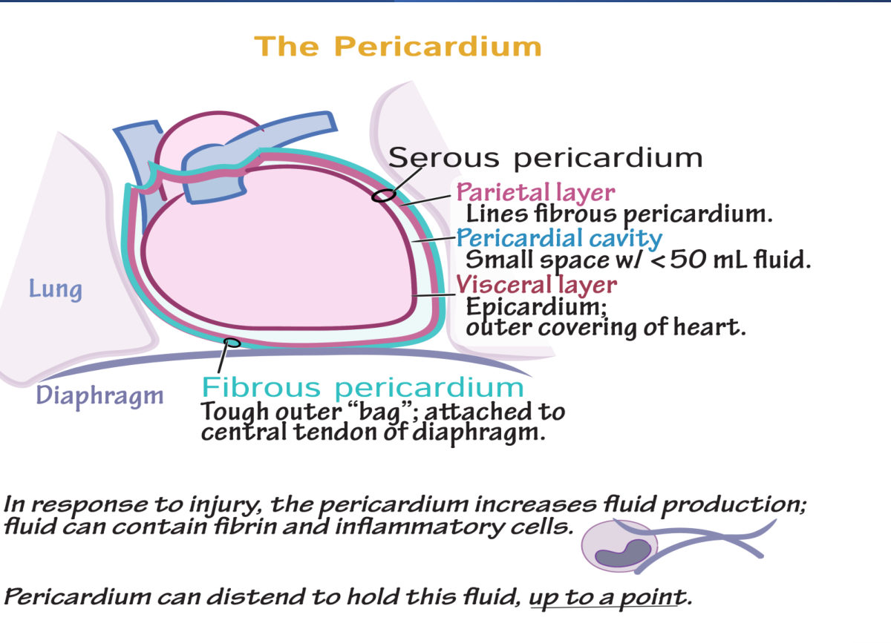

---

### 2.2 Acute Pericarditis: Definition & Etiology (Slides 5–6)
**Acute pericarditis** = inflammation of the pericardium. Its exact incidence is unknown because **subclinical courses are common**.

**Etiology (slide 6):**
- **Idiopathic**
- ⭐ **Infectious (most commonly viral)**
- **Acute MI**
- **Uraemia**
- **Autoimmune connective tissue disease**
- **Neoplasms**
- **After cardiac surgery**
- **Radiation**
- **Trauma**

**Slide 6 figure (cohort data, *Chest* 2020):**

| A. Etiology | % | B. Outcomes | % |
|---|---|---|---|
| **Idiopathic** | **53%** | Composite outcome | **34%** |
| **Post-cardiac injury** | **33%** | **Recurrent pericarditis** | **16%** |
| Infectious | 8% | **Cardiac tamponade** | **13%** |
| Neoplastic | 3% | Treatment failure | 7% |
| CTD / uraemic-metabolic / vasculitis | ~1% each | **Constrictive pericarditis** | **4%** |
| | | Death | 4% |

*The legend colours were read from the slide image. Post-cardiac injury at 33% reflects that study's cohort (hospitalised, many post-surgical). In the general population, **idiopathic/viral** causes dominate (~80–90%) *[added]*. Recurrence (16%) is the most common single complication. This is why colchicine matters.*

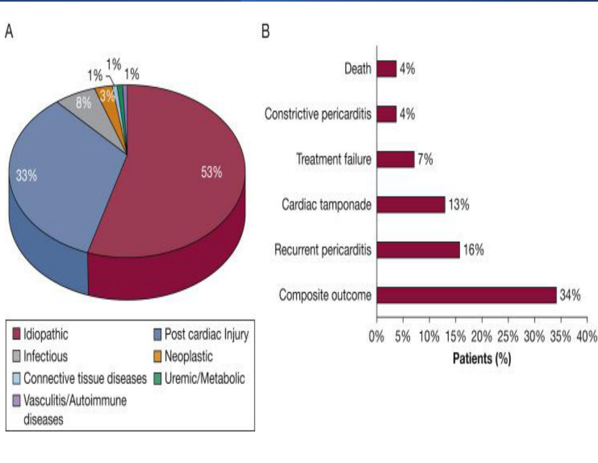

> **Mnemonic for causes: "CARDIAC RIND"** *[added]*
> - **C**ollagen vascular
> - **A**ortic dissection
> - **R**adiation
> - **D**rugs (hydralazine, procainamide, isoniazid)
> - **I**nfection
> - **A**cute renal failure (uraemia)
> - **C**ardiac (MI, Dressler)
> - **R**heumatic fever
> - **I**njury
> - **N**eoplasm
> - **D**ressler

### 2.3 Clinical Features (Slide 7) ⭐
- ⭐ **Positional chest pain**:
    - Severe, sharp, retrosternal, **worse with each breath** and **when supine**.
    - **Better sitting upright and leaning forward**.
- ⭐ **Pericardial friction rub: 3 components**:
    - **Ventricular systole**
    - **Ventricular diastole**
    - **Atrial systole**
- Low-grade fever
- Dyspnoea, tachypnoea, cough
- **Hiccups** (*[added]* phrenic nerve runs over the pericardium)
- Pericardial effusion

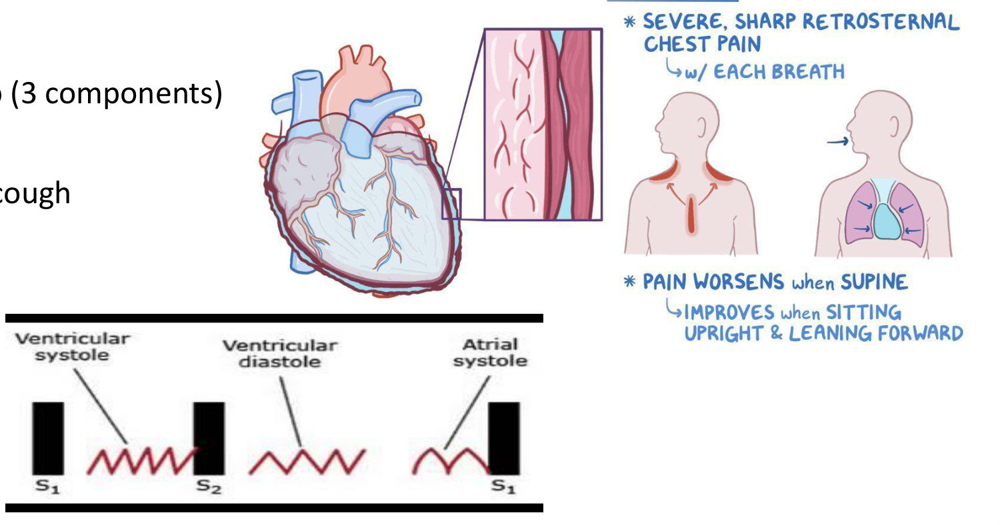

*[added] The rub is high-pitched and scratchy, best heard at the **left lower sternal border, leaning forward, at end-expiration**. It is often **transient**, so listen repeatedly. Pain radiating to the **trapezius ridge** is highly specific (phrenic nerve).*

### 2.4 Diagnostics (Slides 8–12) ⭐

**ECG:**
- Changes **evolve over days to weeks**.
- **Widespread ST elevation + PR depression**.
- **Reciprocal ST depression + PR elevation in aVR and V1**.

**Labs:**
- **Leukocytosis**
- **↑ Troponin I (minimal)**
- **↑ ESR, ↑ CRP**
- **↑ CK**

**Echocardiogram** to look for effusion.

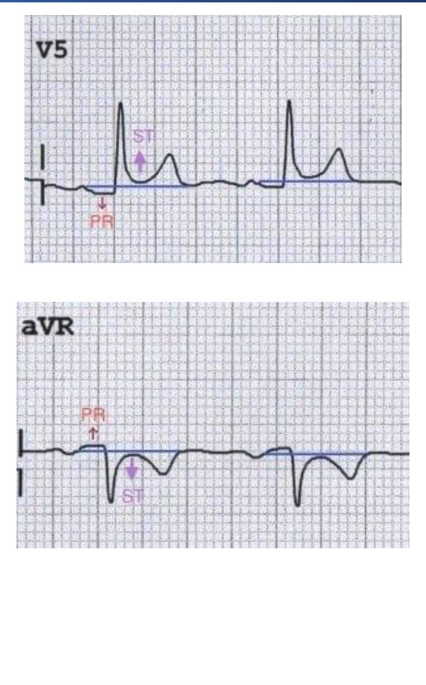

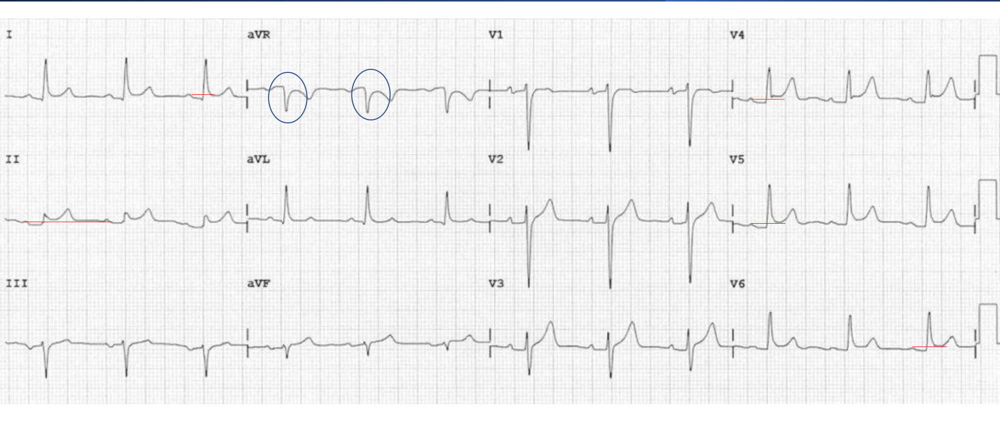 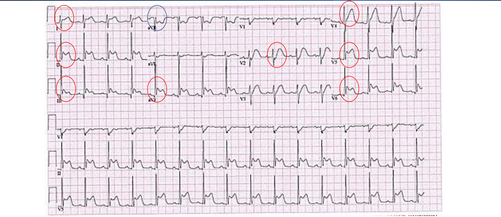

**Pericarditis vs STEMI (slide 12)** ⭐

| | ST shape | Which leads? | ST-T evolution | PR segment |
|---|---|---|---|---|
| **Pericarditis** | **Concave** ("smiley" coving) | **Diffuse** | **Days–weeks** | **Depressed** |
| **Acute STEMI** | **Convex** (dome/tombstone) | **Localised** (coronary territory) **+ reciprocal ST↓** | **Hours** | **Normal** |

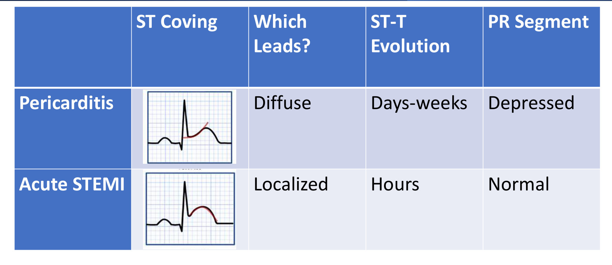

*[added]* **Four ECG stages of pericarditis:**
1. Diffuse ST↑ + PR↓
2. ST normalises, T flattens
3. **T-wave inversion** (only *after* ST returns to baseline, unlike MI)
4. Normalisation

**Spodick sign** = down-sloping TP segment. In STEMI, **Q waves** develop and T waves invert **while ST is still elevated**.

### 2.5 Management (Slide 13) ⭐

| Line | Therapy |
|---|---|
| **First line** | ⭐ **High-dose NSAID (or aspirin) + colchicine** |
| **Second line** | **Glucocorticoids** |
| Always | **Gastro-protective therapy** (PPI) |

- **ICAP trial** (*NEJM* 2013): colchicine added to anti-inflammatory therapy **reduced recurrence** of acute pericarditis.
- **CORP trial** (*Ann Intern Med* 2011): colchicine **reduced recurrence in recurrent pericarditis**.

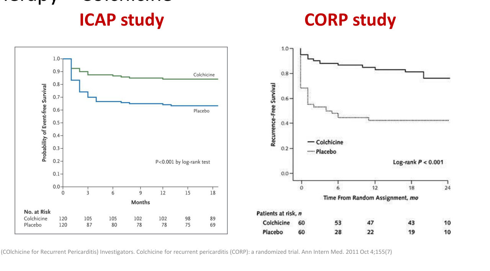

*[added]:*
- Typical regimen: ibuprofen 600–800 mg TDS or aspirin 750–1000 mg TDS for 1–2 weeks, then taper. Colchicine 0.5 mg once or twice daily for **3 months**.
- **Aspirin, not NSAIDs, after MI** (NSAIDs impair scar healing).
- **Steroids increase recurrence**, so reserve them for contraindication or failure, CTD, or pregnancy.
- **Admit** if: fever > 38 °C, subacute onset, large effusion/tamponade, failure of NSAID, immunosuppression, trauma, anticoagulation, or myopericarditis (high troponin).

> 🔁 **Recap: Acute pericarditis.** Inflamed pericardium, mostly idiopathic or viral. Sharp pleuritic pain, better leaning forward; 3-component rub. ECG: diffuse concave ST↑ + PR↓, reciprocal in aVR/V1, evolving over days. Troponin only minimally ↑; ESR/CRP ↑. Treat with high-dose NSAID + colchicine + PPI; steroids second line. Colchicine halves recurrence (ICAP, CORP).
> 🔗 **Link:** Inflamed pericardium produces fluid. Whether that fluid is harmless or lethal depends on how fast it accumulates.
> ▶️ **Up next: Pericardial effusion and cardiac tamponade.**

---

### 2.6 Effusion & Tamponade: Definitions (Slide 14)
- **Pericardial effusion**: abnormal collection of fluid in the pericardial space.
- ⭐ **Cardiac tamponade**: fluid accumulation **raises intra-pericardial pressure** → **cardiac compression** → **impaired ventricular filling** → **↓ cardiac output**.

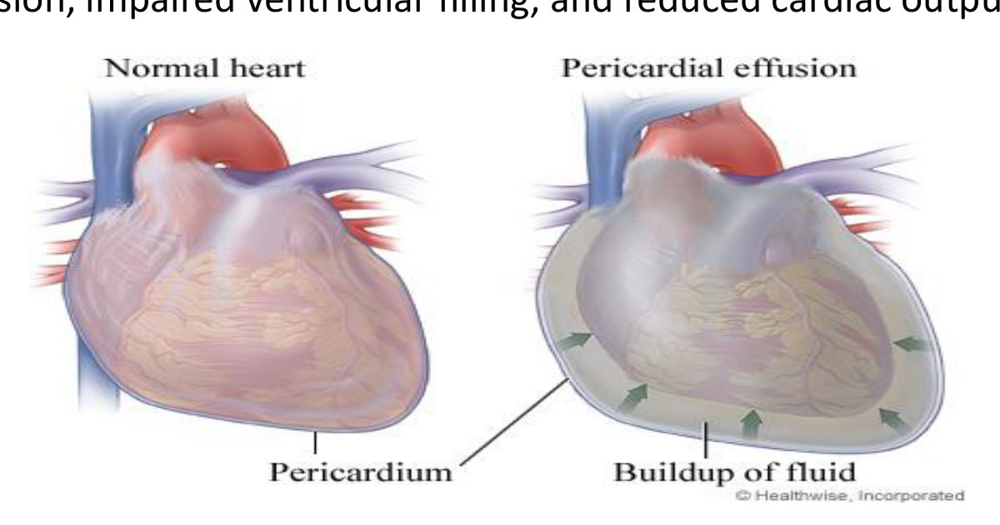

### 2.7 Etiology (Slide 15)

| Rapid (haemopericardium, often tamponade) | Slower |
|---|---|
| **Cardiac wall rupture** (post-MI free wall) | Idiopathic |
| **Chest trauma** | **Acute pericarditis** (viral, **TB**, bacterial) |
| **Aortic dissection** (type A) | **Malignancy** |
| | **Uraemia** |
| | Autoimmune disorders |
| | ⭐ **Hypothyroidism** |

*[added]* Iatrogenic causes: post-cardiac surgery, catheter perforation, pacemaker lead.

### 2.8 Pathophysiology: Rate > Volume (Slide 16) ⭐
- Haemodynamic consequences **depend on the RATE of accumulation**.
- ⭐ **A small rapid accumulation can be more dangerous than a large slow one.** Summary slide 30: **~200 mL acutely** vs **> 1 L if slow**.
- Cascade (slide 16 sketch):
    1. **↑ Pressure** on the heart
    2. The heart cannot stretch out fully between contractions
    3. Chambers don't fill properly
    4. **↓ Cardiac output**
    5. **Hypotension**

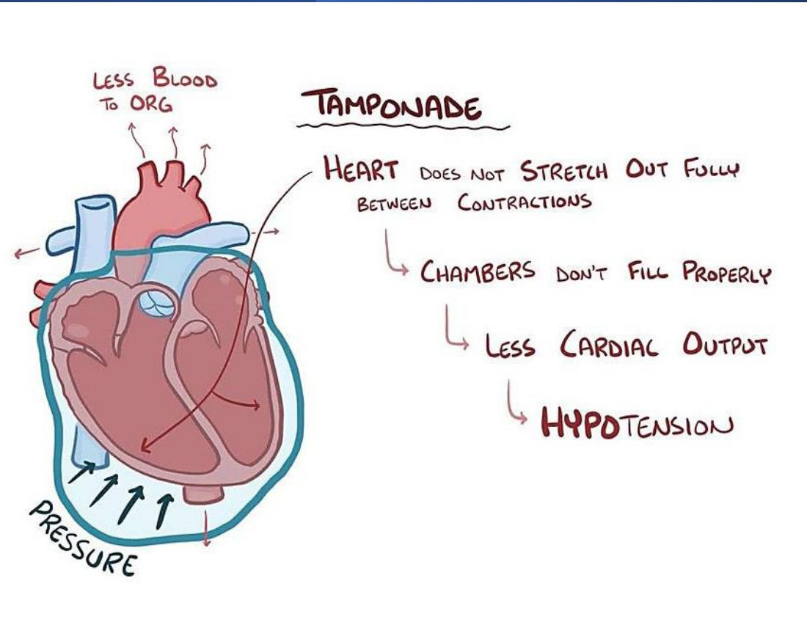

### 2.9 Clinical Features (Slides 17–19)

**Effusion (slide 17):**
- Dyspnoea, orthopnoea, chest pain
- **Compressive symptoms**: **hoarseness** (recurrent laryngeal), cough, **hiccups** (phrenic)
- **Apical impulse difficult to locate**
- ⭐ **Ewart sign**, from compression of lung parenchyma at the **base of the left lung**:
    - **Dullness to percussion**
    - **↑ Vocal fremitus**
    - **Bronchial breathing**

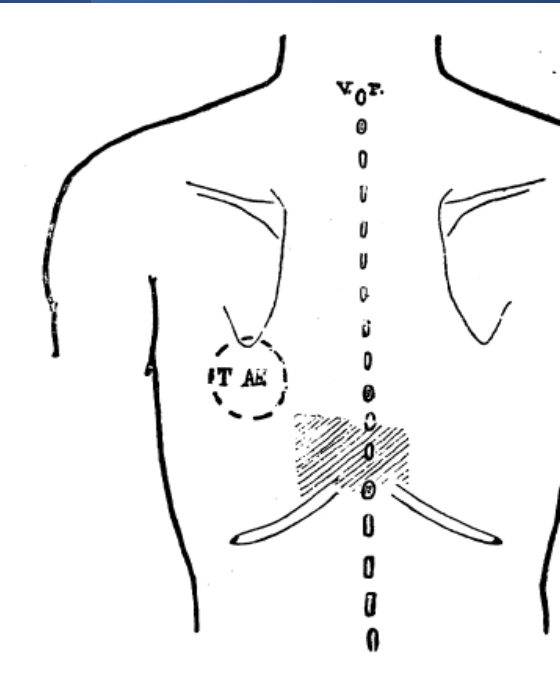

**Tamponade (slide 18):**
- ⭐ **Beck's triad**:
    - **Hypotension**
    - **Muffled heart sounds**
    - **Distended neck veins**
- **Tachycardia**
- **Tachypnoea**
- ⭐ **Pulsus paradoxus**
- Slide 18 note: **not everyone with tamponade shows all 3 signs** of Beck's triad. Tachycardia and dyspnoea may be the clues.

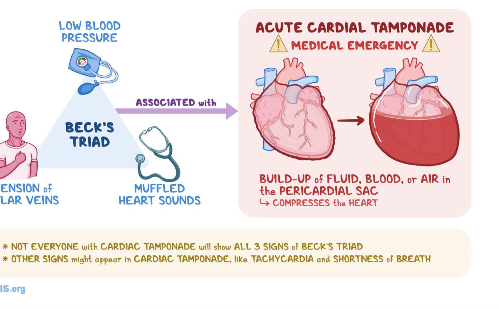

> **Mnemonic: Beck's = "3 D's"** *[added]* → **D**istant heart sounds · **D**istended neck veins · **D**ecreased BP.

**Pulsus paradoxus (slide 19):**
- **Definition:** inspiratory fall in SBP **> 10 mmHg** (normal respiratory variation is 0–10 mmHg).
- **Inspiration:**
    1. ↑ Venous return to the right heart
    2. **The septum is displaced towards the left**
    3. LV filling ↓
    4. **Stroke volume ↓**
- **Expiration:** the septum moves back to the right and stroke volume increases.

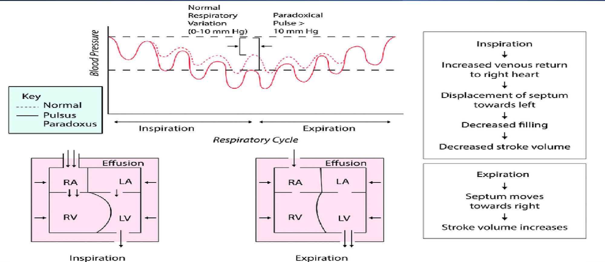

*[added] Other causes of pulsus paradoxus: severe **asthma/COPD**, massive PE, constrictive pericarditis (uncommon), hypovolaemic shock. In tamponade the **y-descent is absent** on the JVP; in constriction it is **steep**.*

### 2.10 Diagnostics (Slides 20–22) ⭐

| Test | Finding |
|---|---|
| **ECG** | **Low-voltage QRS** + ⭐ **electrical alternans** (beat-to-beat QRS amplitude change as the heart swings in the fluid) |
| **CXR** | Enlarged cardiac silhouette: ⭐ **"water-bottle" heart** (needs > ~200 mL *[added]*) |
| **Echocardiography** | ⭐ **Imaging modality of choice**. *[added]* Tamponade signs: **RA collapse in systole, RV collapse in diastole**, plethoric IVC |

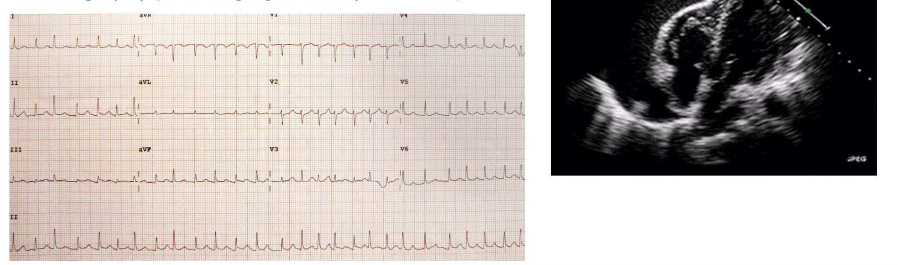 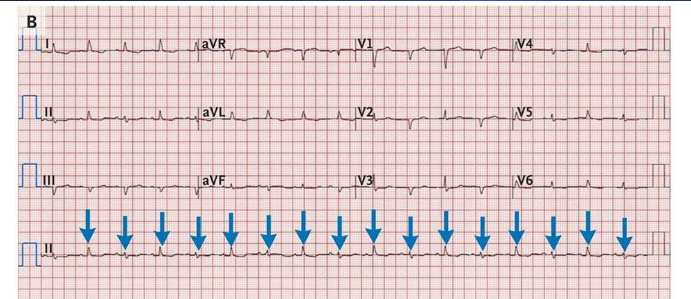

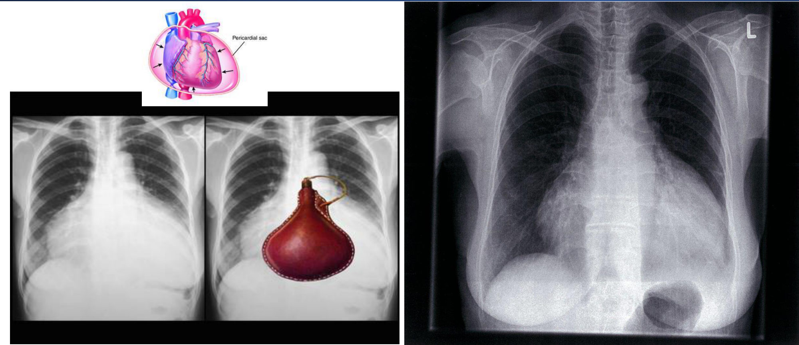

### 2.11 Management (Slide 23) ⭐
- **Routine drainage is unnecessary without haemodynamic compromise.** Treat the cause.
- ⭐ **Tamponade is a life-threatening emergency** → **urgent drainage** (pericardiocentesis).
- ⭐ **Fluid resuscitation** **↑ preload** and filling of the cardiac chambers.
- **Chronic recurrent effusions** → surgical **pleuropericardial window**.

**Pericardiocentesis (slide 23 figure):** **subxiphoid approach**, needle at a **45° angle aimed at the left shoulder**.

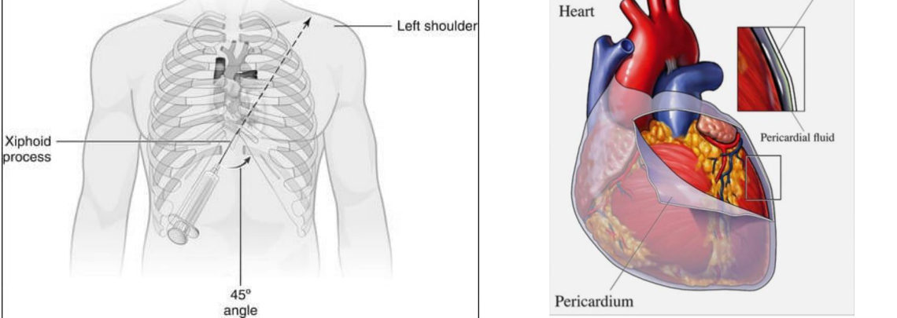

*[added] **Avoid diuretics, nitrates and positive-pressure ventilation** in tamponade, because each ↓ preload and can precipitate arrest. Traumatic or post-MI rupture with clot needs **surgery** rather than a needle.*

> 🔁 **Recap: Effusion and tamponade.** Fluid in the pericardial sac; rate beats volume. Effusion signs: hard-to-find apex, Ewart sign. Tamponade: Beck's triad (↓BP, muffled sounds, ↑JVP), tachycardia, pulsus paradoxus > 10 mmHg. ECG: low voltage + electrical alternans. CXR: water-bottle heart. Echo is the test of choice. Tamponade → urgent pericardiocentesis + IV fluids; asymptomatic → don't drain; recurrent → pericardial window.
> 🔗 **Link:** If inflammation heals with fibrosis instead of fluid, the pericardium becomes a rigid shell. The filling problem is the same, but it is chronic.
> ▶️ **Up next: Constrictive pericarditis.**

---

### 2.12 Constrictive Pericarditis: Definition & Etiology (Slides 24–25)
- **Definition:** pericardial constriction from **inflammation → scarring, fibrosis and adhesion of the pericardial layers**.
- **Mechanism:** a **rigid, scarred pericardium limits diastolic filling** of the ventricles → **↑ intracardiac pressures**.
- **Etiology:**
    - Infections
    - ⭐ **Prior cardiac surgery**
    - Trauma
    - ⭐ **Irradiation**
    - Connective tissue disorders
    - Uraemia
    - Neoplastic involvement
    - ⭐ **Tuberculous pericarditis**

*[added] **TB is the commonest cause in developing countries** and an exam favourite. Post-surgery and radiation are the commonest causes in developed countries.*

### 2.13 Clinical Features (Slide 26) ⭐
- **Fatigue, dyspnoea on exertion**
- **Lower-extremity oedema**, ⭐ **ascites** (often out of proportion to the oedema *[added]*)
- Tachycardia
- **JVD**
- ⭐ **Kussmaul sign**: **JVP rises (or fails to fall) on inspiration**
- ⭐ **Pericardial knock**: early diastolic sound when ventricular filling stops abruptly

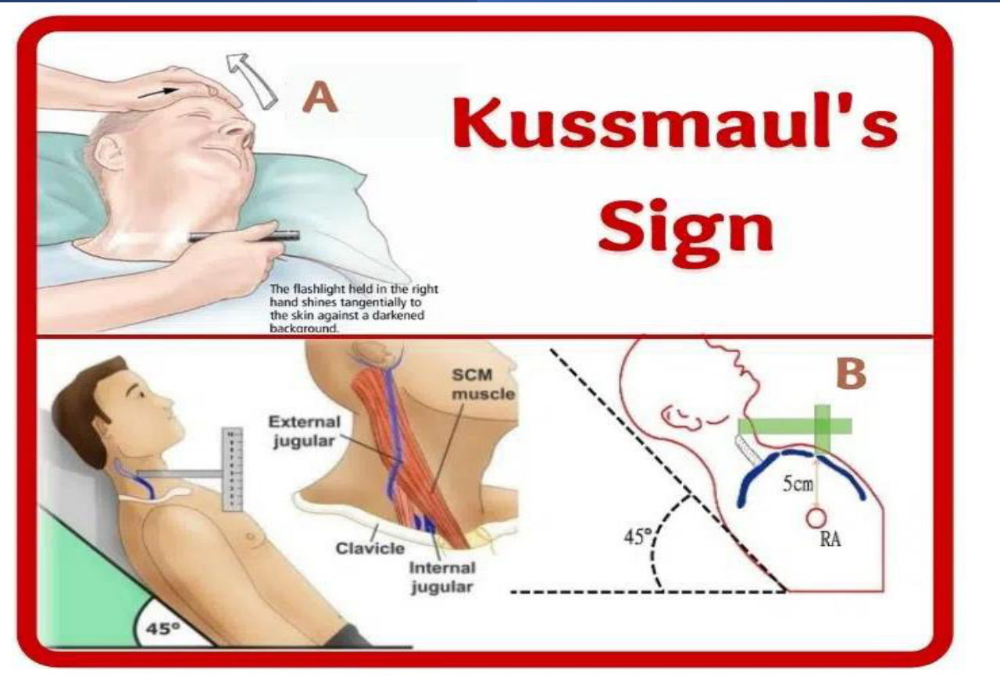

*[added] Patients present like **right heart failure with clear lungs**, and are often mistaken for **cirrhosis**. Clue: ↑JVP, which cirrhosis lacks. Hepatomegaly is common.*

### 2.14 Diagnostics (Slides 27–28)

| Test | Finding |
|---|---|
| ECG | **Low QRS voltage**, **left atrial enlargement** (*[added]* ± AF) |
| CXR | ⭐ **Pericardial calcification** (best seen on the lateral film) |
| Echo | **↑ Pericardial thickness** |
| Cardiac CT/MRI | Thickened/calcified pericardium (*[added]* > 4 mm) |
| **Cardiac catheterisation** | **↑ ventricular diastolic pressures** · ⭐ **equalisation of diastolic pressures** across chambers · ⭐ **"dip and plateau" ("square-root sign")** |

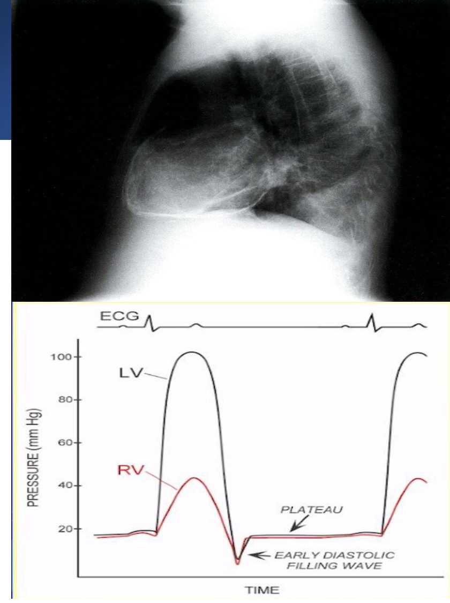

**Slide 28 explained:**
- **Normal heart:** atrial contraction gives the **A wave**. The initial small C wave and atrial relaxation give the **X descent**. Passive atrial filling gives the **V wave**. AV valve opening gives the **Y descent**.
- **Constriction:**
    1. **High atrial pressure when the AV valves open → rapid early filling (rapid Y descent, Y > X)**.
    2. Filling then **stops abruptly** at the stiff shell (**square-root sign**).
    3. **Late diastolic pressures equalise**.
    4. **RV diastolic pressure is usually > ⅓ of RV systolic pressure.**

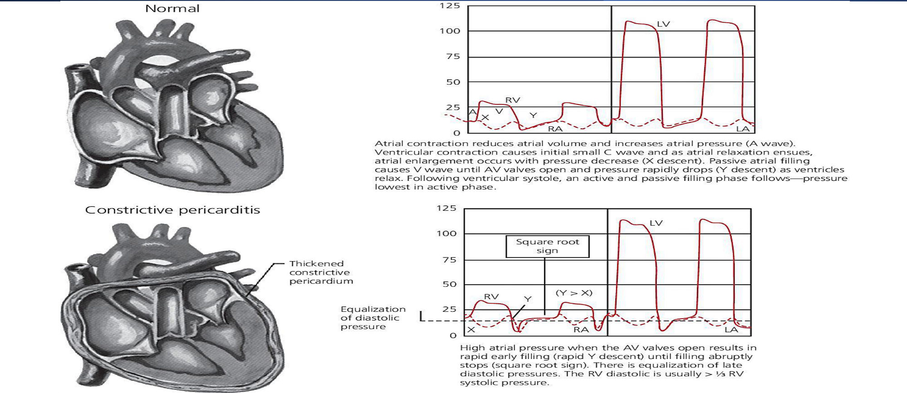

### 2.15 Management (Slide 29)
- ⭐ **Pericardiectomy is the ONLY definitive treatment.**
- **Na restriction + diuretics** for non-surgical candidates.

*[added] For TB pericarditis: anti-TB therapy (± steroids) to reduce progression to constriction.*

> 🔁 **Recap: Constriction.** A rigid, scarred, often calcified pericardium limits diastolic filling. Causes: TB, surgery, radiation, CTD, uraemia, cancer. Right-heart-failure picture with ascites, ↑JVP, Kussmaul sign, pericardial knock. ECG low voltage + LAE; CXR calcification; echo/CT/MRI thick pericardium. Cath: equal ↑ diastolic pressures with dip-and-plateau. Pericardiectomy is the only cure; diuretics + salt restriction if the patient is not fit for surgery.

---

### 2.16 Lecturer Summary (Slides 30–31)

| | Diagnosis | Treatment |
|---|---|---|
| **Acute pericarditis** (inflammation of the pericardium) | **↑ WBC, ESR, CRP**; ECG: **ST elevation in several leads**, **PR depression** | **Anti-inflammatory drugs**, can combine **with colchicine** |
| **Pericardial effusion** (**200 mL acutely**, **> 1 L if slowly**) | **Small** → asymptomatic, unless associated with pericarditis. **Large** → cardiac tamponade | **Small → no treatment**. **Tamponade → hospital admission, pericardiocentesis, volume expansion** |
| **Constrictive pericarditis** (fibrinous scarring and calcification) | | **Pericardiectomy** |

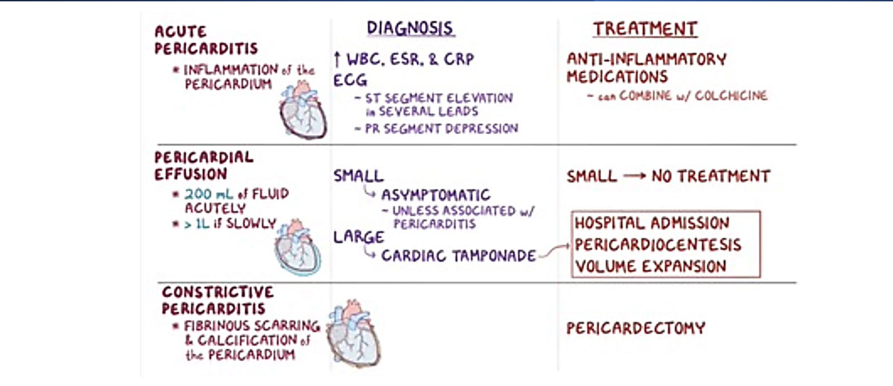

**Slide 31 (Osmosis):**
- A **pericardial effusion** builds slowly, so the pericardium stretches and symptoms are chest pain, shortness of breath and compression of nearby structures.
- **Acute tamponade** is **sudden** fluid accumulation into a sac that cannot adapt.
    - Causes: **chest trauma**, **ruptured aorta**, **ventricular rupture after heart attack**.
    - It **can progress to circulatory shock and cardiac arrest**.

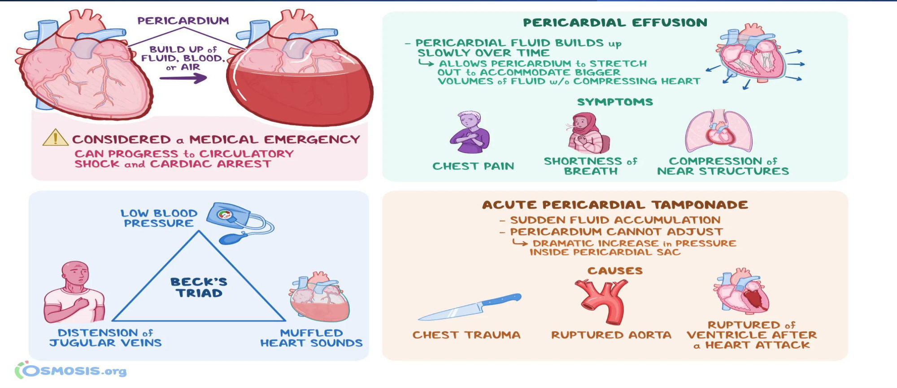

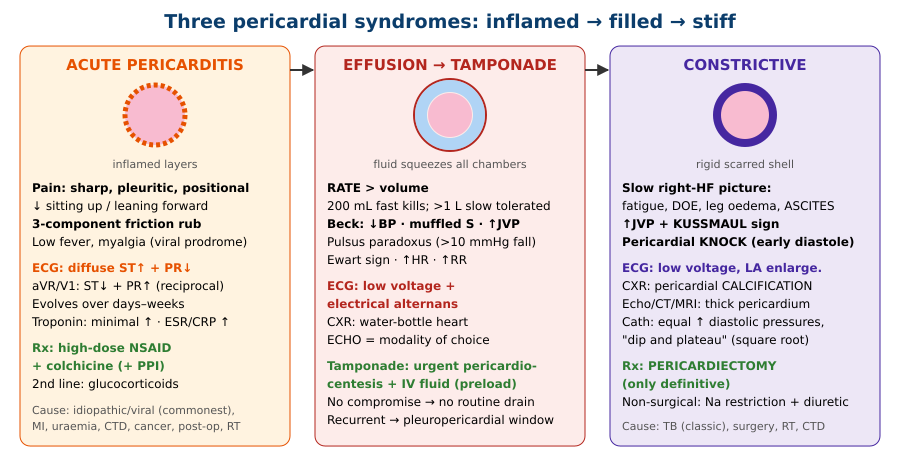

---

## 3. High-Yield Comparison Tables

### Table A: Pericarditis vs STEMI ⭐
| Feature | **Acute pericarditis** | **STEMI** |
|---|---|---|
| Pain | Sharp, **pleuritic, positional** (better leaning forward) | Pressure/heaviness, not positional |
| Exam | **Friction rub** | ± S4, new MR murmur |
| ST elevation | **Diffuse**, **concave** | **Territorial**, **convex** |
| Reciprocal ST↓ | **Only aVR (± V1)** | **Yes**, in opposite leads |
| PR segment | **Depressed** (↑ in aVR) | **Normal** |
| Evolution | **Days–weeks**; T inverts **after** ST normalises | **Hours**; Q waves; T inverts while ST still ↑ |
| Troponin | **Minimal ↑** | **Marked rise and fall** |
| Echo | ± effusion; normal wall motion | **Regional wall-motion abnormality** |
| Treatment | NSAID + colchicine | Reperfusion (PCI/lysis), antiplatelets |

### Table B: Tamponade vs Constrictive Pericarditis ⭐
| Feature | **Cardiac tamponade** | **Constrictive pericarditis** |
|---|---|---|
| Onset | **Acute** | **Chronic** |
| Pericardium | Fluid-filled | **Thick, fibrotic, calcified** |
| Haemodynamics | Compression throughout the cardiac cycle | Early filling is free, then stops abruptly |
| BP | **Hypotension** (Beck) | Usually normal/low |
| JVP | ↑ | ↑ |
| JVP y-descent *[added]* | **Absent/blunted** | **Steep (prominent)** |
| ⭐ Signature sign | **Pulsus paradoxus** | ⭐ **Kussmaul sign** |
| Heart sounds | **Muffled** | **Pericardial knock** |
| Ascites/oedema | Not prominent | **Prominent ascites**, oedema |
| ECG | Low voltage + **electrical alternans** | Low voltage + **LA enlargement** |
| CXR | **Water-bottle heart** | **Pericardial calcification** |
| Echo | Effusion; RA/RV diastolic collapse *[added]* | **Thickened pericardium**; septal bounce *[added]* |
| Cath | Equalised diastolic pressures *[added]* | Equalised diastolic pressures + **dip and plateau** |
| Treatment | **Urgent pericardiocentesis + fluids** | **Pericardiectomy** (diuretics if not a surgical candidate) |

### Table C: Signs Dictionary
| Sign | Definition | Disease |
|---|---|---|
| **Beck's triad** | Hypotension + muffled heart sounds + distended neck veins | **Tamponade** |
| **Pulsus paradoxus** | SBP falls **> 10 mmHg** on inspiration | **Tamponade** (also severe asthma, PE) |
| **Ewart sign** | Dullness + ↑ fremitus + bronchial breathing at the **left lung base** | **Large effusion** compressing the lung |
| **Kussmaul sign** | **JVP rises on inspiration** | **Constriction** (*[added]* also RV infarct, restrictive CMP, massive PE) |
| **Pericardial knock** | Early diastolic sound | **Constriction** |
| **Friction rub (3 components)** | Ventricular systole + ventricular diastole + atrial systole | **Acute pericarditis** |
| **Electrical alternans** | Alternating QRS amplitude | **Large effusion/tamponade** |
| **Water-bottle heart** | Globular, enlarged silhouette | **Large effusion** |
| **Square-root sign** | Dip-and-plateau ventricular diastolic pressure | **Constriction** |

### Table D: Treatment Ladder
| Condition | First | If fails / special |
|---|---|---|
| Acute pericarditis | **High-dose NSAID/aspirin + colchicine + PPI** | **Glucocorticoids** (2nd line); aspirin post-MI *[added]* |
| Recurrent pericarditis | **Colchicine** (CORP) + NSAID | Steroids; *[added]* anakinra/rilonacept |
| Effusion, no compromise | **No routine drainage**; treat the cause | |
| **Tamponade** | ⭐ **Urgent pericardiocentesis + IV fluids** | Surgery if rupture/clot |
| Recurrent effusions | | **Pleuropericardial window** |
| Constriction | ⭐ **Pericardiectomy** | **Na restriction + diuretics** if not a surgical candidate |

---

## 4. Rules, Exceptions, Patterns

| Rule | Exception / nuance |
|---|---|
| Pericarditis has ST elevation in many leads | **aVR (± V1) shows ST depression + PR elevation** (the reciprocal mirror) |
| Troponin ↑ suggests MI | In pericarditis troponin is **minimally ↑** (epicardial inflammation). Marked ↑ = **myopericarditis** *[added]* |
| NSAIDs for pericarditis | **Post-MI → aspirin** (NSAIDs impair healing) *[added]* |
| Steroids are anti-inflammatory | They are **second line** because they **increase recurrence** *[added]* |
| Bigger effusion = sicker | ⭐ **Rate beats volume**: 200 mL fast can kill; > 1 L slow may be tolerated |
| Hypotension + ↑JVP = give diuretics? | ⭐ **NO in tamponade. Give fluids** (↑ preload) |
| Drain effusions | **Not routinely** if haemodynamically stable |
| Beck's triad defines tamponade | **Not all 3 are always present** (slide 18) |
| Pulsus paradoxus = tamponade | Also severe asthma/COPD, massive PE *[added]* |
| Kussmaul = constriction | Also RV infarct, restrictive CMP *[added]*; **rare in tamponade** |
| Constriction is medical | **Pericardiectomy is the only definitive treatment** |

---

## 5. Clinical Correlations
- **Young man with a viral prodrome, pleuritic pain better leaning forward, rub, diffuse ST↑/PR↓** → viral pericarditis → NSAID + colchicine (opening case).
- **Day 2–4 after a transmural MI with pleuritic pain** → **early post-MI pericarditis**. **Weeks after MI or cardiac surgery** → **Dressler / post-cardiac injury syndrome** (autoimmune; 33% in the slide 6 cohort). *[CAD lecture link]*
- **Patient 5 days after MI with sudden PEA, ↑JVP and muffled sounds** → **free wall rupture → tamponade**.
- **Stab wound to the chest + hypotension + ↑JVP + muffled sounds** → tamponade → pericardiocentesis/surgery.
- **Uraemic patient with a rub** → **uraemic pericarditis** → *[added]* urgent **dialysis** is an indication.
- **Hypothyroid patient with an enlarged cardiac silhouette** → effusion (usually slow, rarely tamponade).
- **Lung or breast cancer patient with dyspnoea, low-voltage ECG and alternans** → malignant effusion/tamponade → drain, then window if recurrent.
- **Immigrant with prior TB, ascites, ↑JVP that rises on inspiration, and pericardial calcification** → **TB constrictive pericarditis** → pericardiectomy.
- **Post-mediastinal radiation (lymphoma) years later** → constriction.
- *[added]* **Hypotension + ↑JVP + clear lungs** differential: **tamponade**, **tension pneumothorax**, **massive PE**, **RV infarct**. Echo separates them.

---

## 6. Rapid Revision (Last-Day)
1. Pericardium: **fibrous** outer bag (attached to the diaphragm) + **serous** parietal/visceral layers; **< 50 mL** fluid normally.
2. Acute pericarditis: **idiopathic/viral** commonest; also MI, uraemia, CTD, cancer, post-op, radiation, trauma.
3. **Positional pleuritic pain**, better leaning forward; **3-component rub**; fever, hiccups.
4. ECG: **diffuse ST↑ + PR↓**, **reciprocal ST↓ + PR↑ in aVR/V1**, evolving over **days–weeks**.
5. vs STEMI: **diffuse / days–weeks / PR depressed** vs **localised / hours / PR normal**.
6. Labs: WBC, ESR, CRP, CK ↑; **troponin minimal**.
7. Rx: **high-dose NSAID + colchicine + gastroprotection**; steroids 2nd line. **ICAP** (first episode) and **CORP** (recurrent) prove colchicine works.
8. Tamponade = ↑ intrapericardial pressure → ↓ filling → ↓ CO. **Rate > volume** (200 mL fast vs > 1 L slow).
9. Effusion: hard-to-find apex, **Ewart sign**, compressive hoarseness and hiccups.
10. **Beck's triad**: hypotension, muffled sounds, distended neck veins (+ ↑HR, ↑RR, **pulsus paradoxus > 10 mmHg**).
11. ECG **low voltage + electrical alternans**; CXR **water-bottle**; **echo is the test of choice**.
12. No compromise → no routine drainage. **Tamponade → urgent pericardiocentesis (subxiphoid, 45°, towards the left shoulder) + IV fluids**. Recurrent → **pleuropericardial window**.
13. Constriction: scarred, rigid pericardium; **TB, surgery, radiation**.
14. **Kussmaul sign, pericardial knock, ascites**, ↑JVP, leg oedema.
15. ECG low voltage + **LAE**; CXR **calcification**; echo/CT/MRI **thickening**; cath **equal diastolic pressures + dip-and-plateau (square root)**.
16. **Pericardiectomy is the only definitive treatment**; salt restriction + diuretics if not operable.

---

## 7. Exam-Style Questions

**Q1 (lecture opening case).** A 23-year-old man has 1 week of sharp substernal pain, worse with inspiration and relieved by leaning forward, plus nausea and myalgia. He has a high-pitched rub at the LSB and an ECG with PR depression and diffuse ST elevation. What is the most likely cause?
a. Dressler syndrome · b. Acute MI · c. *M. tuberculosis* · d. SLE · e. Acute viral infection

> **Answer: e. Acute viral infection.** *[reasoning added; key not on slides]*
> - Young patient with a **viral prodrome (myalgia, nausea)** and classic pericarditis → **idiopathic/viral** is the commonest cause.
> - Wrong options:
>     - **Dressler** needs a preceding MI or cardiac surgery.
>     - **Acute MI** gives localised convex ST↑ without PR depression; his father's CAD is a distractor.
>     - **TB** is subacute with constitutional symptoms and an endemic exposure.
>     - **SLE** would need other systemic features.

**Q2.** A 60-year-old man has had dyspnoea for 2 days. BP 82/60, HR 122, JVP raised, heart sounds faint, lungs clear. SBP falls by 18 mmHg on inspiration. The ECG shows low-voltage QRS with alternating amplitude. What is the most appropriate immediate management?
A. IV furosemide · B. IV nitroglycerin · C. Urgent pericardiocentesis with IV fluid · D. NSAID + colchicine · E. Pericardiectomy

> **Answer: C.**
> - **Beck's triad + pulsus paradoxus + electrical alternans** = **cardiac tamponade**, a life-threatening emergency.
> - Management is **urgent drainage**, and **fluid resuscitation supports preload** (slide 23).
> - **Diuretics and nitrates** drop preload and can cause arrest *[added]*.
> - **Pericardiectomy** is for constriction.

**Q3.** A 45-year-old man who had TB pericarditis 6 years ago now has ascites, leg oedema and fatigue. His JVP rises on inspiration, and an early diastolic sound is heard. The lateral CXR shows a rim of calcification around the heart. What is the definitive treatment?
A. Pericardiocentesis · B. Pericardial window · C. Pericardiectomy · D. Colchicine · E. Diuretics + salt restriction

> **Answer: C.**
> - **Kussmaul sign + pericardial knock + calcification** after TB = **constrictive pericarditis**.
> - **Pericardiectomy is the only definitive treatment** (slide 29).
> - Diuretics and salt restriction (E) are only for **non-surgical candidates**.
> - There is no fluid to drain, so A and B are wrong.

**Q4.** Which ECG feature best distinguishes acute pericarditis from acute anterior STEMI?
A. ST elevation in V2–V4 · B. **PR-segment depression with diffuse ST elevation evolving over days** · C. Hyperacute T waves · D. Pathological Q waves · E. Raised troponin

> **Answer: B** (slide 12).
> - Pericarditis is **diffuse** with **PR depression**, evolving over **days–weeks**.
> - STEMI is **localised** with a **normal PR**, evolving over **hours**, and produces Q waves.
> - Troponin can rise in both (minimal in pericarditis).

**Q5.** Which statement about pericardial effusion is correct?
A. Every effusion > 500 mL should be drained · B. Tamponade depends only on effusion volume · C. **A small, rapidly accumulating effusion can cause tamponade while a large, slow one may not** · D. CXR is the imaging modality of choice · E. Recurrent effusions are best treated by repeated pericardiocentesis

> **Answer: C** (slide 16).
> - A is wrong: **no routine drainage** without haemodynamic compromise.
> - D is wrong: **echo** is the modality of choice.
> - E is wrong: recurrent effusions need a **pleuropericardial window**.

---

## 8. Exam Pitfalls & Traps
- **Leaning forward relieves pericarditis pain.** Lying supine worsens it. Don't swap these.
- **Diffuse ST elevation ≠ STEMI.** Look for **PR depression** and the **aVR mirror**. Thrombolysing pericarditis risks **haemopericardium** *[added]*.
- **Troponin positive does not exclude pericarditis.** It is minimally raised (slide 8).
- **Dressler vs viral**: Dressler requires a **preceding MI or cardiac surgery** (weeks before). Without that history, choose viral.
- **"3 components" of the rub** = ventricular systole, ventricular diastole, **atrial systole**. Atrial systole is lost in **AF**, leaving 2 components *[added]*.
- **Tamponade + hypotension → fluids, NOT diuretics**, even with a high JVP.
- **Beck's triad can be incomplete** (slide 18). Don't exclude tamponade because one sign is missing.
- **Pulsus paradoxus = tamponade; Kussmaul = constriction.** This is the classic swap trap. Kussmaul can appear in effusive-constrictive disease but is **not** a tamponade sign *[added]*.
- **Ewart sign** is a **lung** finding (left base: dullness, bronchial breathing). It is easily mistaken for left lower lobe pneumonia.
- **Electrical alternans** = tamponade or a large effusion. **Low voltage alone** is nonspecific: effusion, constriction, obesity, COPD, hypothyroidism *[added]*.
- **Calcification** on CXR → **constriction**, not tamponade. **Water-bottle heart** → **effusion**.
- **Slide 30 numbers:** 200 mL acutely can cause tamponade; **> 1 L** if slow. Normal pericardial fluid is **< 50 mL** (slide 5).
- **Slide 6 etiology chart** shows **post-cardiac injury at 33%**. That is a cohort-specific figure. For "most common cause", the answer is **idiopathic/viral**.
- **Constriction mimics cirrhosis** (ascites, oedema). **↑JVP is the discriminator.**
