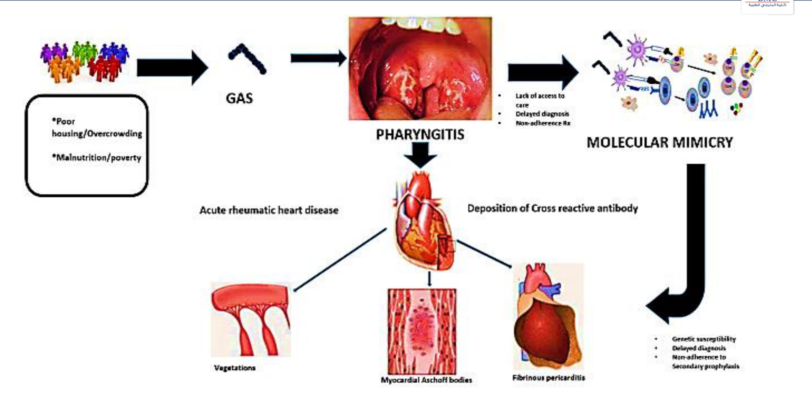
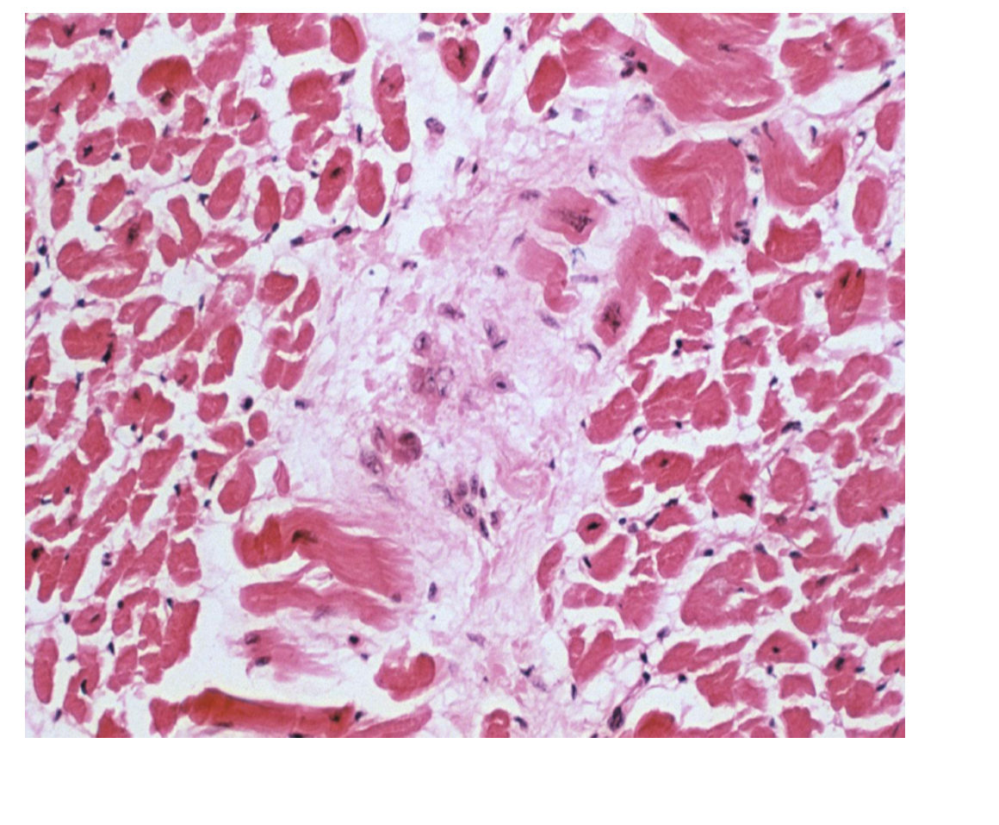
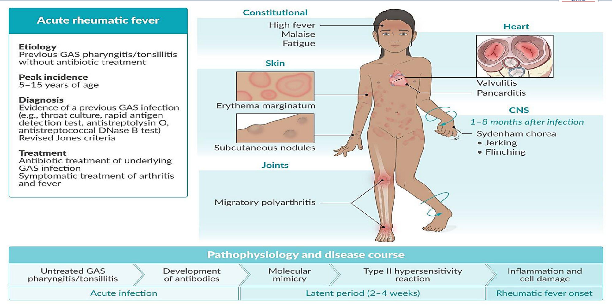
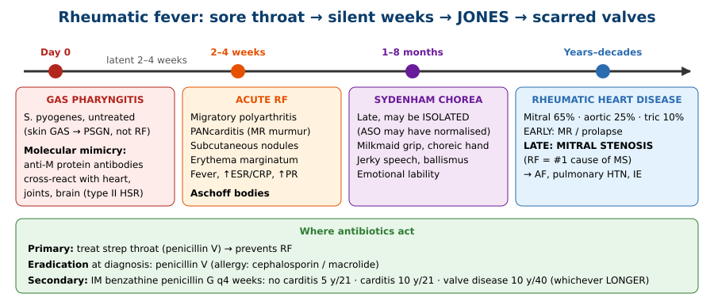
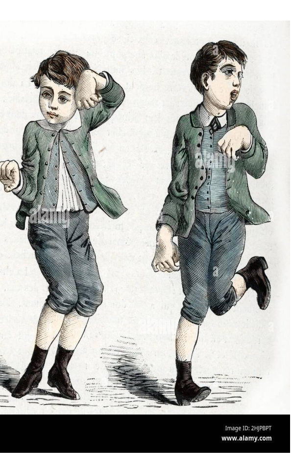
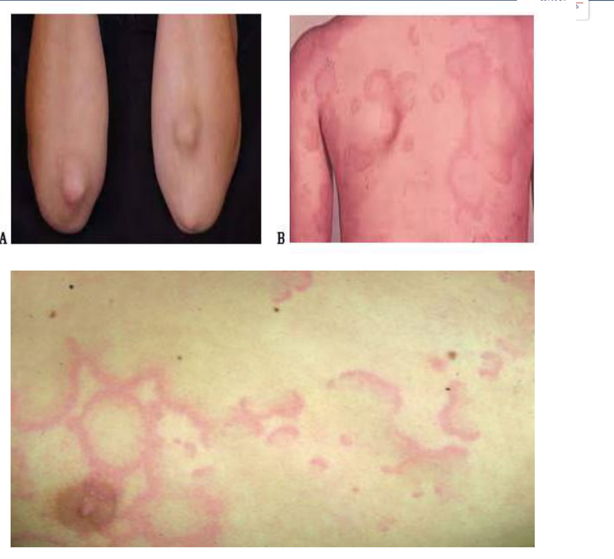
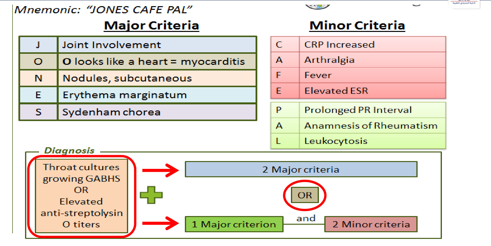
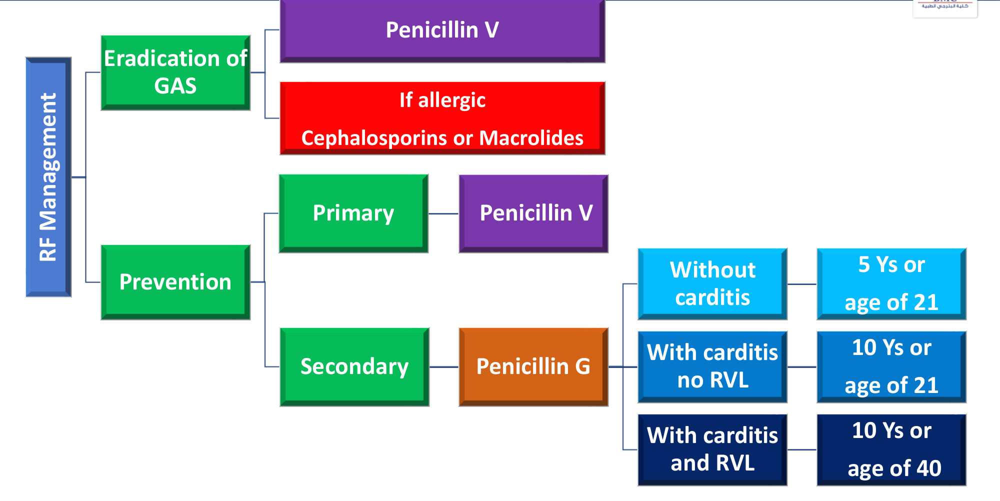

# Rheumatic Fever: Approach to a Case of Fever and Palpitation
**Dr. Muhammad Reihan, Internal Medicine** | Source: `Fever & Palpitation – Rheumatic fever` (21 slides)

> **Legend:** ⭐ = high-yield · *[added]* = not on slides. Images marked "Slide N" come from the lecture; "Added diagram" = drawn for these notes.

> 🔗 **Bridge from Infective Endocarditis (same lecture block):** Both are **"fever + palpitation + murmur"** problems, but the mechanisms are opposite. **IE** is bacteria growing **on** the valve. **Rheumatic fever** is **sterile autoimmune** inflammation weeks after a strep throat. The links:
> - Rheumatic valves are **"acquired valvular dysfunction"**, the moderate-risk IE group.
> - RF scarring is the **#1 cause of mitral stenosis** (next lecture: **Valvular Heart Disease**).
> - Pericarditis from the **Pericardial lecture** is one part of rheumatic **pancarditis**.

---

## 1. Title / Objectives

| Domain | Objective | Likely tested as |
|---|---|---|
| Knowledge | Pathophysiological basis and etiology | GAS pharyngitis → molecular mimicry |
| Knowledge | ⭐ Epidemiology, manifestations, complications | **Jones criteria**; mitral valve |
| Skill | ⭐ Comprehensive management plan | Penicillin V eradication; **benzathine penicillin G prophylaxis durations** |

**Lecture flow:** Opening case → Definition → Etiology (GAS; ARF vs RHD) → Pathophysiology → Pathology (Aschoff bodies) → Clinical features (constitutional, joints, heart, CNS, skin) → Jones criteria → Confirmation of GAS → Management (eradication) → Prevention (primary / secondary) → Summary.

---

## 2. Main Content (Lecture Order)

### 2.0 Opening Case (Slides 4–5)
- **Patient:** 14-year-old boy with **3 days** of fever, malaise and **severe right knee pain and swelling**.
- **History:** abdominal pain and **epistaxis**. **Left ankle** pain and swelling **5 days ago, now resolved** (= **migratory**). **Sore throat 3 weeks ago** while camping, treated **symptomatically only**.
- **Exam:** T 38.7 °C, HR 119, BP 90/60. Swollen tender right knee. ⭐ **Painless 3–4 mm nodules over the elbow**. Cardiopulmonary exam normal.
- **Labs:** Hb 12.3, WBC 11 800, ⭐ **ESR 63**.
- **Knee aspirate:** clear straw-coloured fluid, **WBC 1350 with 17% neutrophils**, Gram stain negative (= non-septic).

→ *Most likely diagnosis?* (A) **acute rheumatic fever** · (B) septic arthritis · (C) ALL · (D) IE · (E) Kawasaki · (F) JIA. *(Answered in §7, Q1.)*

### 2.1 Definition & Epidemiology (Slide 6)
**Rheumatic fever** = an **inflammatory sequela** involving the:
- **heart**
- **joints**
- **skin**
- **CNS**

It occurs ⭐ **2–4 weeks after an UNTREATED group A streptococcus (GAS) infection**.
- **Prevalence:** **more common in resource-limited countries** (*[added]* overcrowding, poverty).
- **Peak age 5–15 years** (slide 11 figure).

### 2.2 Etiology (Slides 7–8) ⭐
- Previous infection with **group A β-haemolytic streptococcus (GAS)** = ***Streptococcus pyogenes***.
- Usually ⭐ **acute tonsillitis or pharyngitis ("strep throat")**.
- ⭐ **GAS SKIN infections** (erysipelas, impetigo, cellulitis) lead to **post-streptococcal glomerulonephritis**, NOT rheumatic fever.

| Term | Meaning |
|---|---|
| **Acute rheumatic fever (ARF)** | **Multisystem disease** from an **autoimmune reaction** to GAS infection |
| **Rheumatic heart disease (RHD)** | **Valvular damage that persists** after the other ARF features have gone |

> **Mnemonic:** **Throat → heart; skin → kidney.** (PSGN can follow either, but RF follows only pharyngitis.)

### 2.3 Pathophysiology (Slide 9)
1. **Risk factors:** poor housing/overcrowding, malnutrition/poverty.
2. **GAS pharyngitis**.
3. Lack of access to care, delayed diagnosis, no adherence.
4. ⭐ **Molecular mimicry**: antibodies against streptococcal antigens (*[added]* **M protein**) **cross-react** with host tissue (*[added]* cardiac myosin, valve endothelium, synovium, basal ganglia). **Type II hypersensitivity** (slide 11).
5. **Deposition of cross-reactive antibody** → acute rheumatic heart disease: **vegetations** (valvulitis), **myocardial Aschoff bodies**, **fibrinous pericarditis**.
6. Genetic susceptibility, recurrent GAS, no secondary prophylaxis → **chronic RHD**.

### 2.4 Pathology (Slide 10)
⭐ **Aschoff bodies** (myocardium) = **fibrinoid necrosis with histiocytic infiltrate**.

*[added]* They contain **Anitschkow cells** ("caterpillar cells": macrophages with wavy, ribbon-like chromatin). Pathognomonic of rheumatic carditis.

*Slide 11 summary:* etiology = previous GAS pharyngitis **without antibiotic treatment**; **peak 5–15 years**; diagnosis = evidence of GAS + **revised Jones criteria**; treatment = antibiotics for GAS + **symptomatic treatment of arthritis and fever**. Course: untreated pharyngitis → antibody formation → molecular mimicry → type II hypersensitivity → inflammation, during a **latent period of 2–4 weeks**.

> 🔁 **Recap: Cause.** ARF = autoimmune sequela 2–4 weeks after **untreated GAS pharyngitis** (skin GAS → PSGN instead). Mechanism: molecular mimicry (type II HSR). Hallmark: Aschoff bodies. ARF is acute and multisystem; RHD is the chronic valve scarring left behind.
> 🔗 **Link:** Antibodies cross-react with joints, heart, skin and brain, and those targets are the clinical features.
> ▶️ **Up next: Clinical features and Jones criteria.**

---

### 2.5 Clinical Features (Slides 12–14) ⭐

| System | Features |
|---|---|
| **Constitutional** | Fever, malaise, fatigue |
| **Joints** | ⭐ **Migratory polyarthritis** (*[added]* large joints, hugely responsive to aspirin, **no permanent damage**) |
| **Heart** | ⭐ **PANcarditis** (endocarditis + myocarditis + pericarditis) |
| **CNS** | ⭐ **Sydenham chorea** |
| **Skin** | ⭐ **Subcutaneous nodules** · ⭐ **erythema marginatum** |

**Heart: valvular lesions** mostly on **high-pressure (left) valves**:

| Valve | Frequency | Lesion |
|---|---|---|
| ⭐ **Mitral** | **~65%** | **EARLY: mitral regurgitation or prolapse** · **LATE: mitral STENOSIS**. ⭐ **RF is the most frequent cause of mitral stenosis** |
| **Aortic** | **~25%** | (*[added]* AR > AS; usually with mitral disease) |
| **Tricuspid** | **~10%** | |

**CNS: Sydenham chorea (slide 13)**
- **Involuntary, irregular, non-repetitive** movements of the limbs, neck, head and/or face.
- ⭐ Appears **1–8 months after** the inciting infection (late; *[added]* may be the **only** manifestation, and ASO may be normal by then).
- **Additional motor symptoms:**
    - **Ballismus**
    - **Muscle weakness**
    - **Speech disorders** (slurred / "jerky")
    - ⭐ **Milkmaid grip** (rhythmic squeezing)
    - **Choreic hand**

**Skin (slide 14):**
- **Subcutaneous nodules**: *[added]* painless, firm, over **extensor surfaces / bony prominences** (elbows, knees, occiput). Associated with **carditis**.
- ⭐ **Erythema marginatum**: **centrifugally expanding** pink/light-red rash with a **well-defined outer border and central clearing**. **Painless and non-pruritic** (*[added]* trunk and proximal limbs, never the face).

### 2.6 Diagnostic Criteria: Jones (Slide 15) ⭐
> **Mnemonic: "JONES CAFE PAL"**

| **Major (JONES)** | **Minor (CAFE PAL)** |
|---|---|
| **J**oint involvement (migratory polyarthritis) | **C**RP increased |
| **O** looks like a heart ♥ = (pan)**carditis** | **A**rthralgia |
| **N**odules, subcutaneous | **F**ever |
| **E**rythema marginatum | **E**levated ESR |
| **S**ydenham chorea | **P**rolonged PR interval |
| | **A**namnesis (history) of rheumatism (previous RF/RHD) |
| | **L**eukocytosis |

⭐ **Diagnosis = evidence of preceding GAS infection** (throat culture growing GABHS **or** elevated ASO titre) **+** **2 major** criteria, **OR** **1 major + 2 minor**.

*[added] Key 2015 AHA revision points:*
- Separate **low-risk** and **moderate/high-risk** populations.
- In high-risk populations, **monoarthritis** or **polyarthralgia** can count as major.
- **Subclinical carditis on echo** counts as carditis.
- **Arthralgia cannot be a minor criterion if arthritis is already counted as major.**
- **Prolonged PR cannot be counted if carditis is a major criterion.**
- **Recurrent RF:** 2 major, or 1 major + 2 minor, or **3 minor**.
- **Chorea alone** is enough (GAS evidence not required).

### 2.7 Confirmation of GAS Infection (Slide 16)
Any of the following:
- ↑ **Antistreptolysin O (ASO) titre**
- ↑ **Anti-streptococcal DNase B (ADB) titre**
- *(Slide 15:)* **throat culture** growing GABHS
- *[added]* rapid antigen test

*[added] Rising titres on paired samples are best. ADB stays raised longer, which helps for late chorea.*

> 🔁 **Recap: Diagnosis.**
> - **Major (JONES):** migratory polyarthritis, pancarditis (mitral early MR → late MS), nodules, erythema marginatum, Sydenham chorea (1–8 months later).
> - **Minor (CAFE PAL):** CRP, arthralgia, fever, ESR, prolonged PR, previous RF, leukocytosis.
> - **Rule:** GAS evidence (culture/ASO/ADB) + 2 major, or 1 major + 2 minor.
> 🔗 **Link:** Once diagnosed, treatment has two jobs: eradicate any remaining GAS now, and stop the next attack.
> ▶️ **Up next: Management and prevention.**

---

### 2.8 Management (Slide 17)
**GAS eradication:**
- ⭐ **First line: penicillin V**.
- **Penicillin allergy:**
    - **Cephalosporins** for hypersensitivity **without anaphylaxis**
    - **Macrolides** for **severe β-lactam hypersensitivity**

*[added] Not on the slides but standard:*
- **Arthritis/fever:** high-dose **aspirin or NSAIDs** (dramatic response).
- **Moderate–severe carditis/heart failure:** **corticosteroids** ± diuretics, ACEI.
- **Chorea:** haloperidol / valproate, plus rest.
- **Bed rest** while carditis is active.
- **Echo** for every patient.

### 2.9 Prevention (Slides 18–19) ⭐

| Level | What |
|---|---|
| **Primary prevention** | **Prompt antibiotic treatment of GAS tonsillopharyngitis** (e.g., **penicillin V**) → *[added]* prevents RF if started within **9 days** of symptoms |
| **Secondary prevention** | ⭐ **ALL patients need antibiotic prophylaxis.** **Drug of choice: IM benzathine penicillin G every 4 weeks** |

**Secondary prophylaxis duration:** use whichever gives the **LONGEST** course.

| Category | Duration |
|---|---|
| **RF without carditis** | **5 years** or until age **21** |
| **RF with carditis, no residual heart disease** | **10 years** or until age **21** |
| **RF with carditis AND permanent valvular disease** | **10 years** or until age **40** (*[added]* sometimes lifelong) |

> **Mnemonic: "5-21, 10-21, 10-40"**: no heart → 5/21; heart healed → 10/21; heart scarred → 10/40.

> 🔁 **Recap: Management.** Eradicate GAS with penicillin V (cephalosporin if non-anaphylactic allergy; macrolide if severe allergy). Primary prevention = treat every strep throat. Secondary prevention = IM benzathine penicillin G every 4 weeks for 5 y/21 (no carditis), 10 y/21 (carditis healed) or 10 y/40 (valve disease), whichever is longer. *[added]* Aspirin/NSAIDs for arthritis, steroids for severe carditis.

---

## 3. High-Yield Comparison Tables

### Table A: Major Criteria in Detail
| Major | Frequency *[added]* | Key detail | Leaves damage? |
|---|---|---|---|
| **Polyarthritis** | ~75% (commonest) | **Migratory**, large joints, aspirin-responsive | **No** |
| **Carditis** | ~50–60% | **Pancarditis**; **mitral** (MR → MS) | **Yes** (RHD) |
| **Sydenham chorea** | ~10–30% | **1–8 months** late; milkmaid grip | No (resolves) |
| **Subcutaneous nodules** | Rare | Painless, extensor surfaces; with carditis | No |
| **Erythema marginatum** | Rare | Central clearing, non-pruritic, trunk | No |

> **"RF licks the joints but bites the heart."** *[added]*

### Table B: Rheumatic Fever vs PSGN (same bug, different site)
| | **Rheumatic fever** | **PSGN** *[added detail]* |
|---|---|---|
| Preceding infection | **Pharyngitis only** | Pharyngitis **or skin** (impetigo) |
| Latency | **2–4 weeks** | 1–2 weeks (throat) / 3–6 weeks (skin) |
| Mechanism | **Type II** (molecular mimicry) | **Type III** (immune complex) |
| Prevented by antibiotics? | **Yes** | **No** |
| Target | Heart, joints, skin, brain | Kidney |

### Table C: RF Arthritis vs Septic Arthritis vs JIA (opening case)
| | **ARF** | **Septic arthritis** | **JIA** |
|---|---|---|---|
| Pattern | **Migratory** large joints | Single, fixed | Persistent ≥ 6 weeks |
| Synovial WBC | **Inflammatory but modest** (1000s), not neutrophil-dominant | **> 50 000**, **> 90% neutrophils**, organisms | Inflammatory |
| Clue | Sore throat 2–4 weeks earlier, nodules, ↑ESR | Fever, toxic, Gram stain positive | Morning stiffness, uveitis |

### Table D: Secondary Prophylaxis
| Carditis? | Residual valve disease? | Duration |
|---|---|---|
| No | — | **5 y or age 21** |
| Yes | No | **10 y or age 21** |
| Yes | **Yes** | **10 y or age 40** |

---

## 4. Rules, Exceptions, Patterns

| Rule | Exception / nuance |
|---|---|
| GAS → RF | **Skin GAS → PSGN, not RF** |
| Jones needs GAS evidence | *[added]* **Sydenham chorea alone** is diagnostic (ASO may be normal by then) |
| Arthritis heals | **Carditis leaves RHD**, the only permanent damage |
| Mitral lesion = MS | **Early = MR**; **late = MS** |
| Aspirin for arthritis | Arthralgia and arthritis can't both be counted *[added]* |
| PR prolongation is a minor criterion | Not counted if carditis is already counted as major *[added]* |
| Penicillin V for eradication | **Benzathine penicillin G IM monthly** for secondary prevention |
| Prophylaxis stops at 21 | With **valve disease, continue to 40** (whichever is **longer**) |
| Allergy → macrolide | **Non-anaphylactic** allergy → **cephalosporin** first |

---

## 5. Clinical Correlations
- **Child with an untreated sore throat, then migratory knee and ankle arthritis, nodules and high ESR** → ARF (opening case).
- **Girl with clumsy writing, emotional lability, milkmaid grip; strep throat 4 months ago** → **Sydenham chorea**. Isolated chorea is diagnostic.
- **Young adult from a low-income country with dyspnoea, AF, malar flush, opening snap** → **rheumatic mitral stenosis** (next lecture).
- **New murmur + fever in a patient with RHD** → think **IE** on a rheumatic valve. Rheumatic valves are a moderate-risk IE group.
- **Impetigo followed 3 weeks later by cola-coloured urine and oedema** → **PSGN**, not RF.
- **Prolonged PR on ECG during the acute illness** → minor criterion. *[added]* It does not by itself mean carditis.

---

## 6. Rapid Revision (Last-Day)
1. RF = inflammatory sequela (heart, joints, skin, CNS) **2–4 weeks after untreated GAS pharyngitis**; resource-limited countries; peak **5–15 years**.
2. **Skin GAS → PSGN, not RF.**
3. **ARF** = acute multisystem autoimmune disease. **RHD** = persistent valve damage.
4. **Molecular mimicry** (type II HSR). **Aschoff bodies** = fibrinoid necrosis + histiocytes.
5. **Migratory polyarthritis · pancarditis · Sydenham chorea · subcutaneous nodules · erythema marginatum.**
6. Valves: **mitral 65%** (early MR/prolapse → late **MS**), **aortic 25%**, **tricuspid 10%**. **RF = #1 cause of MS.**
7. Chorea: involuntary, irregular, non-repetitive; **1–8 months later**; ballismus, weakness, jerky speech, **milkmaid grip**, choreic hand.
8. Erythema marginatum: expanding, sharp outer edge, central clearing, **painless, non-pruritic**.
9. **JONES CAFE PAL.** **GAS evidence + 2 major, or 1 major + 2 minor.**
10. GAS evidence: **throat culture, ↑ ASO, ↑ anti-DNase B**.
11. Eradication: **penicillin V**; allergy → **cephalosporin** (non-anaphylactic) or **macrolide** (severe).
12. Primary prevention: treat strep throat (penicillin V).
13. Secondary: **IM benzathine penicillin G every 4 weeks**: **5 y/21 · 10 y/21 · 10 y/40**, whichever is longest.

---

## 7. Exam-Style Questions

**Q1 (lecture case).** A 14-year-old with a sore throat 3 weeks ago (symptomatic treatment only) has migratory arthritis (left ankle, then right knee), fever, painless elbow nodules and ESR 63. Synovial fluid: WBC 1350, 17% neutrophils, Gram stain negative. What is the most likely diagnosis?
A. **Acute rheumatic fever** · B. Septic arthritis · C. ALL · D. Infective endocarditis · E. Kawasaki disease · F. JIA

> **Answer: A.** *[reasoning added; key not on slides]*
> - **Two major criteria** (migratory polyarthritis + subcutaneous nodules) plus minors (fever, ↑ESR, leukocytosis) after an untreated pharyngitis.
> - GAS confirmation (ASO/culture) would complete the Jones criteria.
> - Wrong options:
>     - **Septic arthritis:** the fluid is non-septic (low WBC, few neutrophils, no organisms) and the joints migrate.
>     - **ALL:** epistaxis and bone pain could fit, but the CBC is normal.
>     - **Kawasaki:** no conjunctivitis, mucositis or rash, and he is too old.
>     - **JIA:** needs ≥ 6 weeks.
>     - **IE:** no murmur and no risk factor.

**Q2.** Which streptococcal infection is LEAST likely to be followed by rheumatic fever?
A. Tonsillitis · B. Pharyngitis · C. **Impetigo** · D. Scarlet fever · E. Untreated strep throat

> **Answer: C.**
> - **Skin GAS infections lead to PSGN rather than RF** (slide 7).

**Q3.** A 12-year-old had ARF with carditis but **no residual valve disease** on echo. How long should secondary prophylaxis last?
A. 5 years or to age 21 · B. **10 years or to age 21, whichever is longer** · C. 10 years or to age 40 · D. Lifelong · E. Until ASO normalises

> **Answer: B** (slide 18).
> - Age 21 is 9 years away; 10 years takes him to age 22. The longer option wins, so he continues **to age 22**.

**Q4.** What is the drug of choice for secondary prevention of RF?
A. Oral penicillin V daily · B. **IM benzathine penicillin G every 4 weeks** · C. Oral azithromycin weekly · D. Amoxicillin before dental work · E. IV ceftriaxone monthly

> **Answer: B** (slide 18).
> - **D** is IE prophylaxis, a different indication.

**Q5.** A 35-year-old woman who had RF as a child now has exertional dyspnoea, haemoptysis, a loud S1, an opening snap and a mid-diastolic apical rumble. Which valve lesion does she have, and why?
A. MR, early rheumatic lesion · B. **MS, late rheumatic lesion** · C. AS, calcific · D. AR, aortic root dilatation · E. TR, functional

> **Answer: B.**
> - Rheumatic **mitral** disease starts as **MR** and ends as **MS** (slide 12). RF is the most common cause of MS.

---

## 8. Exam Pitfalls & Traps
- **RF follows pharyngitis only.** Skin infection → PSGN.
- **The minor criteria on slide 15 include "Anamnesis of rheumatism" and "Leukocytosis".** These come from the older Jones version. The **2015 AHA** minors are fever, arthralgia (polyarthralgia in high-risk populations), **ESR ≥ 60 / CRP ≥ 3 mg/dL**, prolonged PR. For the local exam, learn the lecturer's **CAFE PAL** list.
- **Double counting:** arthritis (major) and arthralgia (minor) can't both be counted; carditis (major) and prolonged PR (minor) can't both be counted *[added]*.
- **Chorea can appear alone** and late, when ASO may have normalised. Don't reject the diagnosis.
- **Early mitral lesion = MR**, not MS. MS is the **late** scar.
- **Prophylaxis durations:** "whichever is LONGER". A child of 8 without carditis → 5 years would end at 13, but "until 21" is longer, so prophylaxis runs to 21.
- **Penicillin V (oral)** eradicates and gives primary prevention. **Benzathine penicillin G (IM)** is for secondary prevention. Don't swap them.
- **Allergy:** cephalosporin for non-anaphylactic allergy; macrolide for **severe** β-lactam hypersensitivity.
- **Management slides omit anti-inflammatory therapy.** Know aspirin/NSAIDs for arthritis and steroids for severe carditis *[added]*.
- **Slide 15 shows a heart symbol** in the "O" of JONES. It stands for **carditis**: "O looks like a heart".
