# Valvular Heart Disease: Approach to a Case of Dyspnoea
**Dr. Muhammad Reihan, Internal Medicine** | Source: `Approach to a case of Dyspnea – VHD` (61 slides)

> **Legend:** ⭐ = high-yield · *[added]* = not on slides. Images marked "Slide N" come from the lecture; "Added diagram" = drawn for these notes.

> 🔗 **Bridge from earlier lectures:**
> - **Rheumatic fever** scars the mitral valve: early **MR**, late **MS**.
> - **Infective endocarditis** causes **acute AR/MR** and colonises damaged or prosthetic valves.
> - **CAD:** **papillary muscle rupture** → acute MR; ischaemic LV → **secondary (functional) MR**.
> - **Pulmonary vascular disease:** MS → **pulmonary hypertension** (group 2 PH) → **functional TR**.
> - **Pericardial:** constriction and TR both cause **ascites + raised JVP**.
> - **Hypertension:** chronic AR gives a **wide pulse pressure**; AS gives a **narrow** one.

---

## 1. Title / Objectives

| Domain | Objective | Likely tested as |
|---|---|---|
| Knowledge | ⭐ Clinical features, **auscultatory findings** and complications of each major VHD | Murmur ↔ lesion; manoeuvres |
| Knowledge | Types, indications and **thromboembolic risk factors** of **prosthetic valves** | Mechanical vs bioprosthetic by age |
| Skill | ⭐ Choose **surgical vs medical** management by severity, symptoms and **LV function** | LVEF cut-offs (AR ≤ 55%, MR ≤ 60%) |
| Skill | ⭐ Urgent plan for **acute severe regurgitation** | Acute MR/AR → urgent surgery |

**Lecture flow:** Opening case → Overview (definition, valve anatomy, epidemiology, auscultatory sites, stenosis vs regurgitation) → **AR** → **AS** → **MR** → **MVP** → **MS** → **TR** → Auscultation summary → **Prosthetic valves**.

---

## 2. Main Content (Lecture Order)

### 2.0 Opening Case (Slides 5–6)
- **Patient:** 75-year-old woman, **syncope during aerobic exercise** (10 s).
- **History:** 3 years of progressive **exertional dyspnoea + chest discomfort**.
- **Exam:** radial pulses **decreased and delayed bilaterally** (= *pulsus parvus et tardus*).
- **Question:** a plot of **LV pressure and LV volume** against time with points **A–E**. At which point does the murmur **start**? *(Answered in §7, Q1.)*

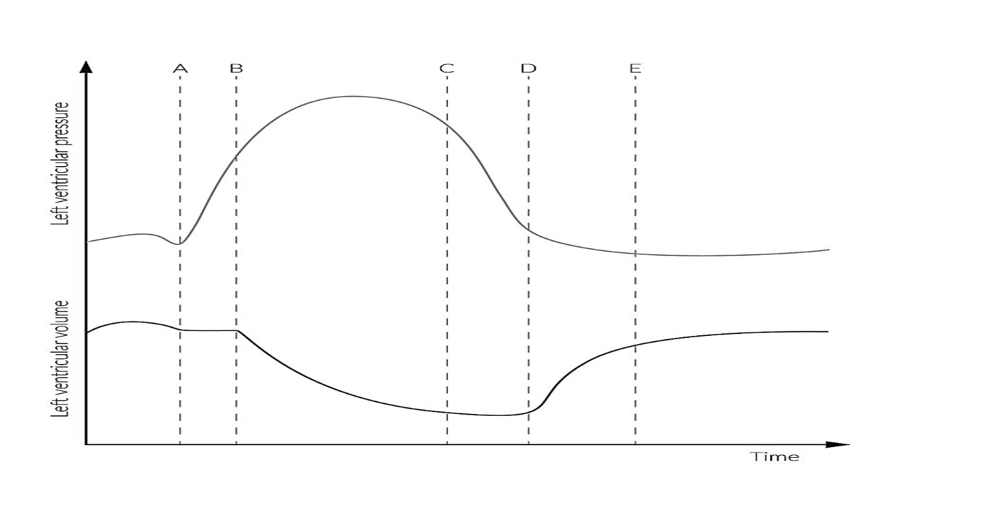

*[added] Reading the curve:*
- **A** = mitral valve closes (S1; isovolumetric contraction starts; volume flat).
- **B** = **aortic valve opens** (volume starts to fall = ejection).
- **C** = aortic valve closes (S2; pressure falls steeply).
- **D** = mitral valve opens (volume rises = filling).
- **E** = mid/late diastole.

### 2.1 Definition & Anatomy (Slides 7–10)
**VHD** = a group of conditions affecting the heart valves. They are **acquired or congenital** and manifest as **stenosis and/or insufficiency (regurgitation)**.

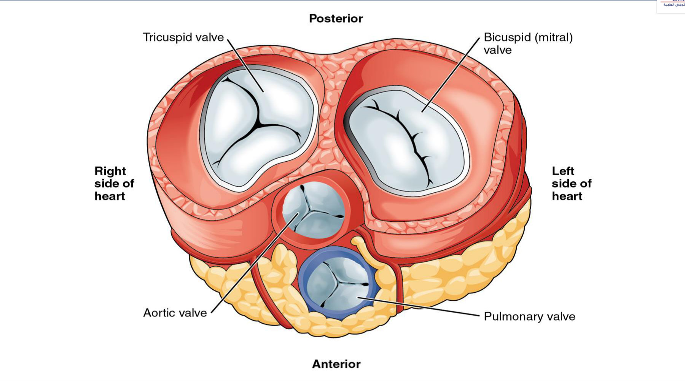 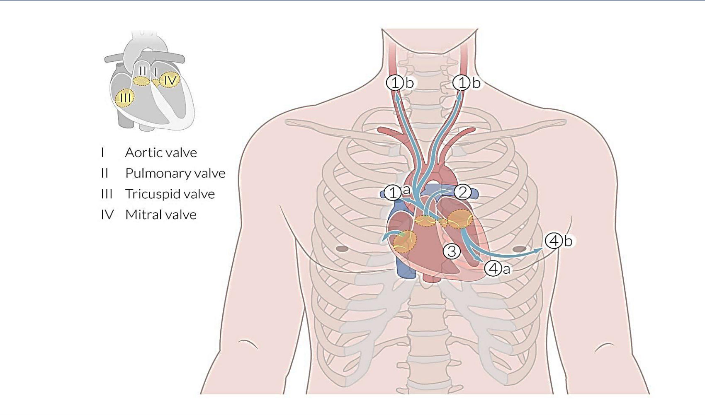

**Epidemiology (slide 9):**

| Lesion | Fact |
|---|---|
| ⭐ **Aortic stenosis** | **Most common valve defect in industrialised countries**; mostly **degenerative**; usually symptomatic **after 75**. In **young people** it is usually **congenital (bicuspid valve)** |
| **Mitral stenosis** | Symptom onset **20–39 years** (rheumatic) |
| **Mitral regurgitation** | **Second most common** valve defect |

**Auscultation areas** *[added, standard]*:
- **Aortic:** right 2nd ICS
- **Pulmonary:** left 2nd ICS
- **Tricuspid:** left lower sternal edge
- **Mitral:** apex (5th ICS, mid-clavicular line)

### 2.2 Effects of Stenosis vs Regurgitation (Slide 11) ⭐

| | **Stenosis** | **Regurgitation** |
|---|---|---|
| Load | **Pressure overload** on the chamber **behind** the valve | **Volume overload**: the heart pumps the **same blood twice** |
| Adaptation | **Hypertrophy** (concentric *[added]*) → dilatation | **Dilatation** (eccentric hypertrophy *[added]*) |
| End result | **Heart failure** | **Heart failure** |

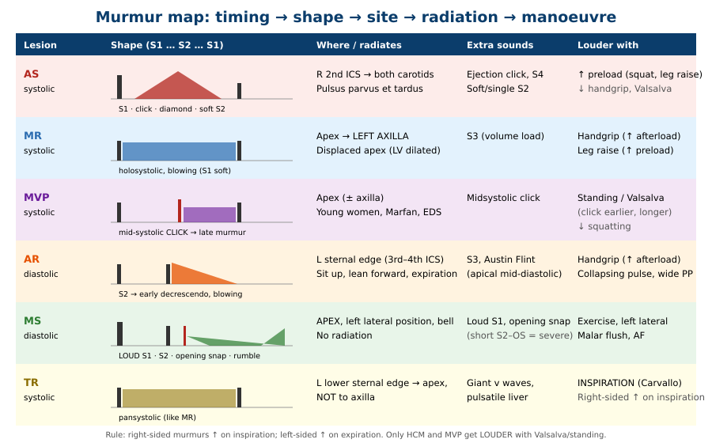

> 🔁 **Recap: Overview.** Stenosis = pressure load → hypertrophy; regurgitation = volume load → dilatation; both end in HF. AS is the commonest lesion in industrialised countries (degenerative, > 75; bicuspid if young). MR is second. MS presents at 20–39 years (rheumatic).
> 🔗 **Link:** The lecture starts with the aortic valve, beginning with regurgitation.
> ▶️ **Up next: Aortic regurgitation.**

---

### 2.3 Aortic Regurgitation (Slides 12–23) ⭐
**Causes:**

| **Acute AR** | **Chronic AR: valve** | **Chronic AR: root** |
|---|---|---|
| ⭐ **Infective endocarditis** | ⭐ **Congenital bicuspid AV**: most common cause in **young adults, high-income countries** | **Aortic dilatation** |
| ⭐ **Aortic dissection** | ⭐ **Rheumatic heart disease**: most common cause in **lower-income countries** | **Connective tissue disease**: **Marfan**, **Ehlers–Danlos** |
| **Chest trauma** | | **Tertiary syphilis** |

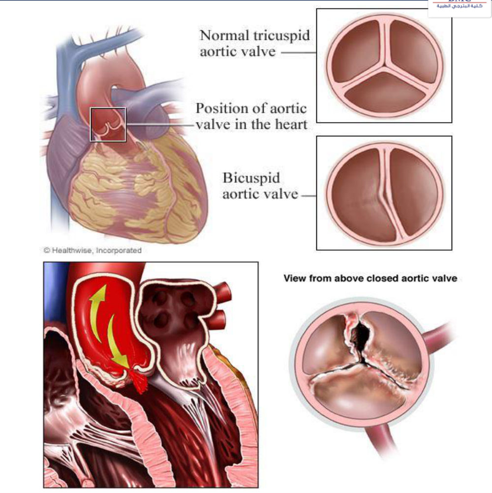

**Clinical features:**
- ⭐ **Acute AR:** **sudden severe dyspnoea**, **rapid decompensation**, **pulmonary oedema**. The LV has no time to dilate, so there are *[added]* **no** peripheral signs.
- **Chronic AR:** **may be asymptomatic for decades** despite progressive LV dilatation.
    - **Palpitations**.
    - **High pulse pressure signs:** water-hammer pulse, Traube, Quincke.
    - **Left HF:** exertional dyspnoea, **angina**, orthopnoea, fatigue, **syncope**.

**Peripheral signs of AR (slide 18)** ⭐

| Sign | Finding |
|---|---|
| **De Musset** | **Head bobbing** with each heartbeat |
| **Becker** | Visible **retinal arteriole** pulsation |
| **Müller** | Pulsating **uvula** |
| **Quincke** | **Capillary pulsation in the nail bed** on light compression |
| **Corrigan pulse** | Rapid forceful distension with **quick collapse** (= **water-hammer pulse**) |
| **Traube** | **"Pistol-shot"** sounds over the femoral artery |
| **Duroziez** | Gradual femoral compression → **systolic AND diastolic bruit** |
| ⭐ **Hill** | **Popliteal SBP exceeds brachial SBP by ≥ 60 mmHg** → **most sensitive sign of AR** |

> **Mnemonic:** the signs move **head → eye → mouth → nail → pulse → groin → knee**: **D**e Musset · **B**ecker · **M**üller · **Q**uincke · **C**orrigan · **T**raube · **D**uroziez · **H**ill.

**Auscultation (slides 19–20):**
- **S3**
- ⭐ **High-pitched, blowing, DECRESCENDO EARLY DIASTOLIC murmur**, best heard at the **left sternal edge with the patient sitting up, leaning forward, breath held in expiration** (slide 19 figure)
- ⭐ **Austin Flint murmur**: *[added]* apical mid-diastolic rumble; the regurgitant jet stops the anterior mitral leaflet opening fully ("relative mitral stenosis", slide 20 figure)
- Severe stages: a harsh **crescendo–decrescendo mid-systolic** flow murmur

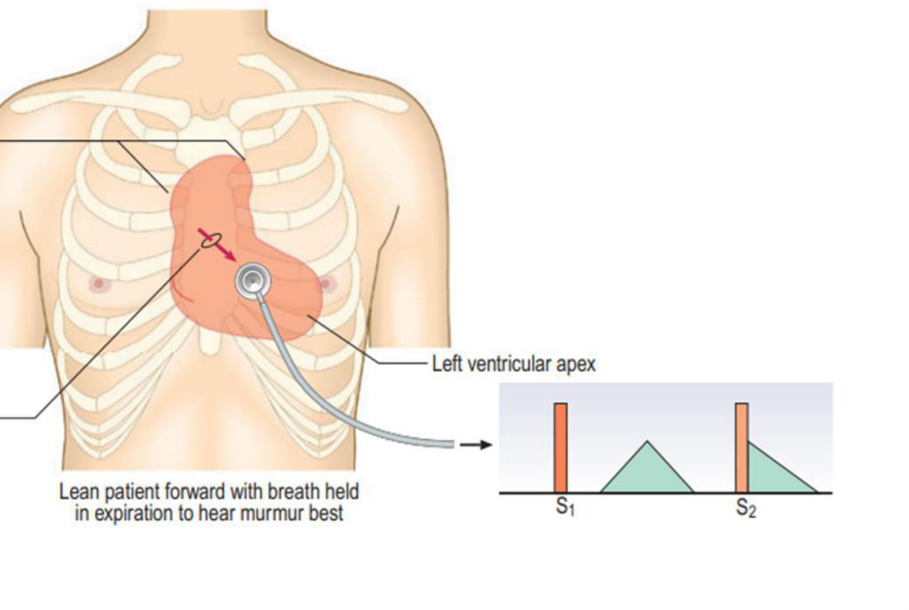 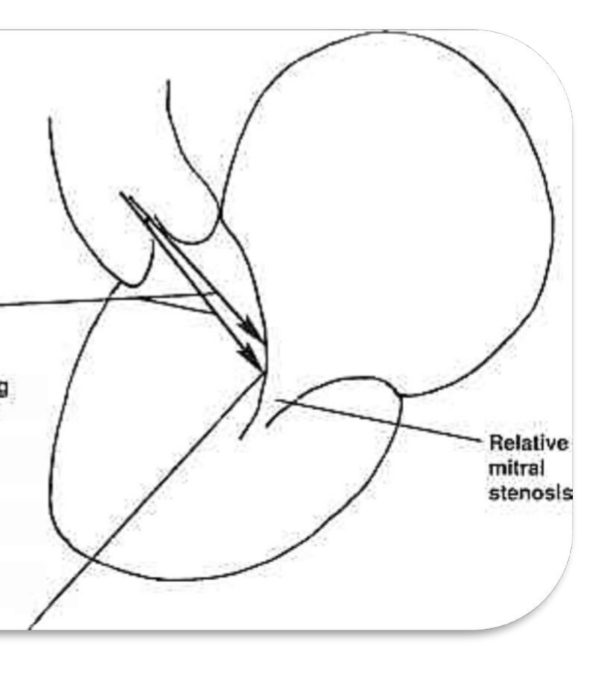

**Diagnostics (slides 21–22):**
- **Echocardiography, TTE = modality of choice**: valve structure and function, cause, **severity**, LV, other valves.
- **CXR:** pulmonary oedema / other causes of dyspnoea. Chronic AR: **enlarged cardiac silhouette** + **prominent aortic root/arch**.

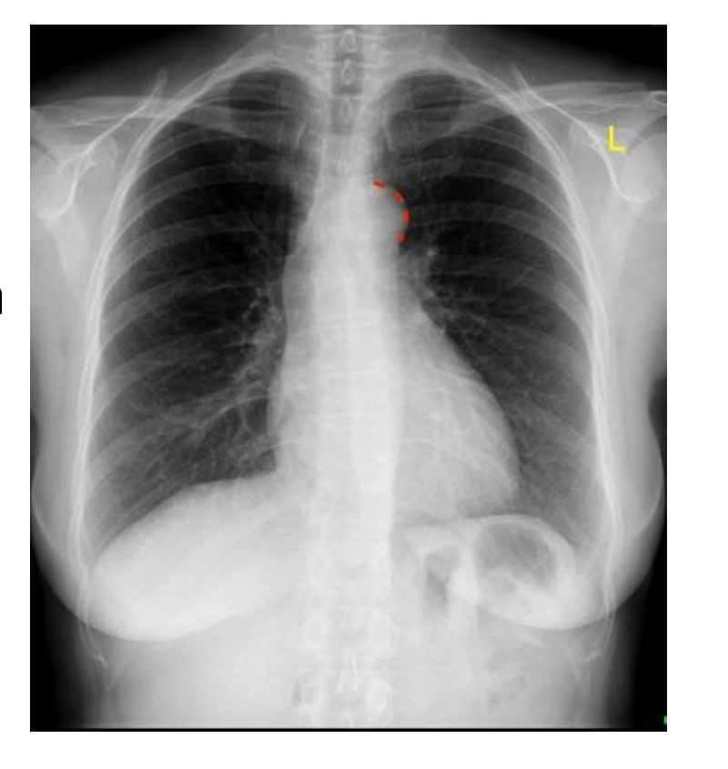

**Treatment (slide 23)** ⭐

| Surgical indications (AVR) | Medical |
|---|---|
| **Acute severe AR** | **Treat heart failure** (*[added]* vasodilators: ACEI/ARB, DHP-CCB; avoid β-blockers in acute AR) |
| **Symptomatic chronic severe AR** | |
| **Asymptomatic chronic severe AR** with **LVEF ≤ 55%**, or **consider if LVESD > 50 mm** | |

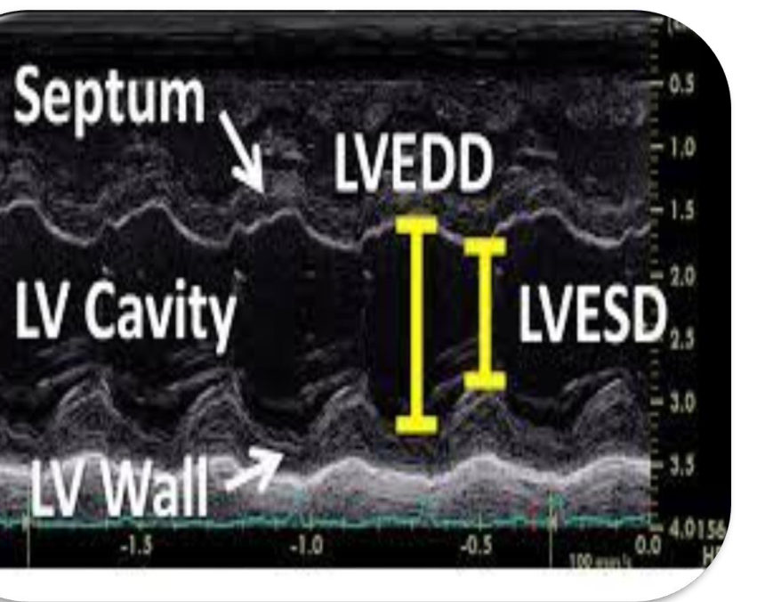

> 🔁 **Recap: AR.** Acute AR (IE, dissection, trauma) → flash pulmonary oedema → urgent surgery. Chronic AR (bicuspid/rheumatic valve, or dilated root from Marfan/EDS/syphilis) is silent for years. Signs: wide pulse pressure, collapsing pulse, De Musset … Hill (most sensitive). Early diastolic decrescendo murmur at the LSE leaning forward; Austin Flint at the apex. Operate if symptomatic, or if asymptomatic with EF ≤ 55% / LVESD > 50 mm.
> 🔗 **Link:** Same valve, opposite problem: obstruction to outflow.
> ▶️ **Up next: Aortic stenosis.**

---

### 2.4 Aortic Stenosis (Slides 24–32) ⭐
**Etiology (slides 25–27):**

| Cause | Detail |
|---|---|
| ⭐ **Aortic valve sclerosis / calcification** | **Most common cause**; prevalence ↑ with age |
| ⭐ **Bicuspid aortic valve (BAV)** | Two of three leaflets fused in utero → **symptoms EARLIER** than senile calcification |
| **Rheumatic fever** | *[added]* almost always with mitral disease |

**BAV classification (slide 27, Sievers):**
- **Type 0** (no raphe, "true" BAV): **6%**
- **Type 1** (1 raphe): **89%** (1a R–L 71%, 1b R–N 15%, 1c L–N 3%)
- **Type 2** (2 raphes, functionally unicuspid): **5%**

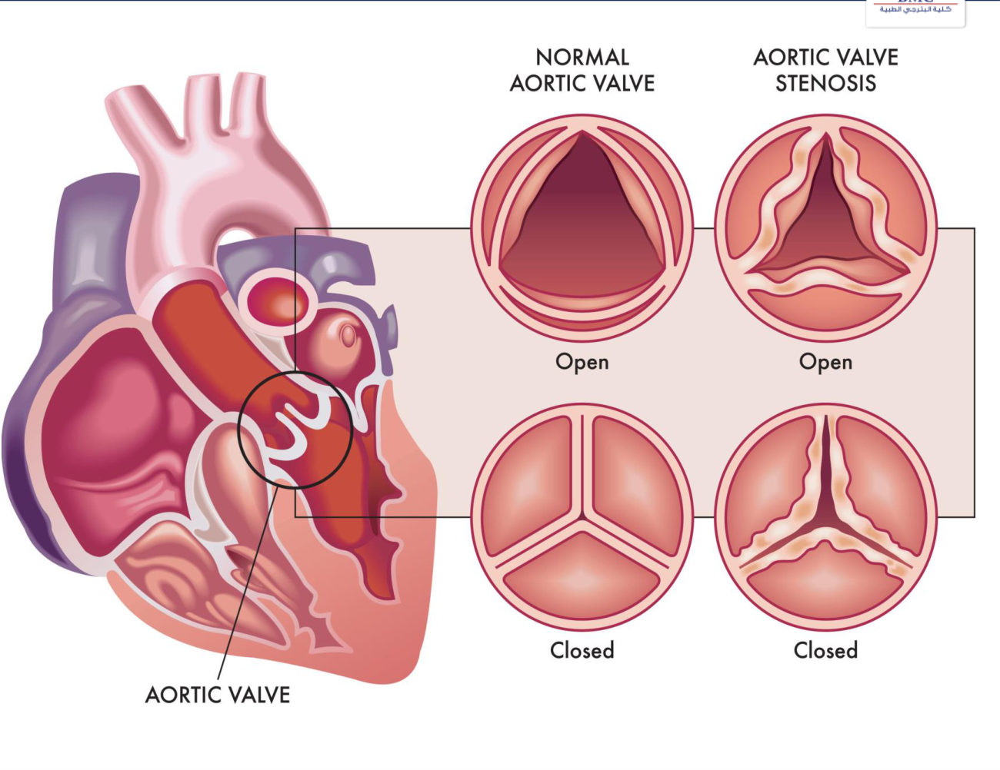 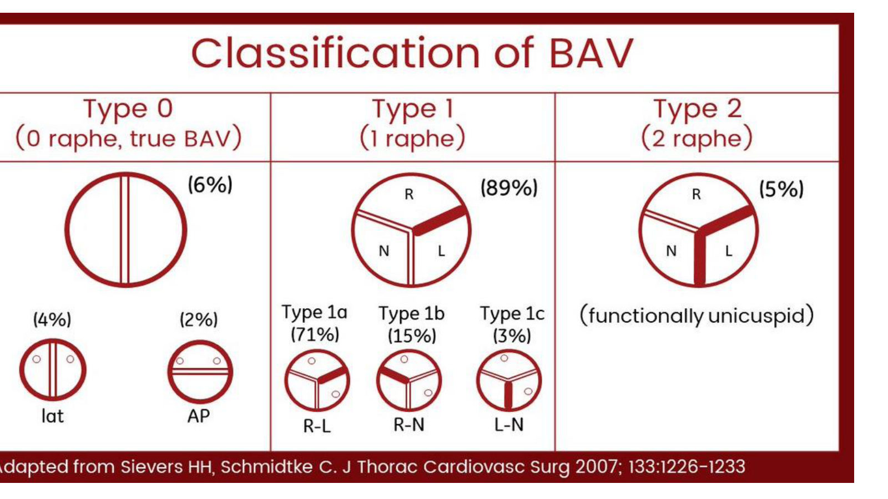

**Clinical features (slide 28)**: may be **asymptomatic for years**.

> ⭐ **Mnemonic: SAD** = **S**yncope (and dizziness) · **A**ngina · **D**yspnoea (HF).
> *[added] Untreated survival after symptom onset: angina ~5 y, syncope ~3 y, HF ~2 y.*

**Examination:**
- **Small BP amplitude / narrow pulse pressure**.
- ⭐ **Pulsus parvus et tardus**: **weak (parvus) and delayed (tardus)** carotid/distal pulse.

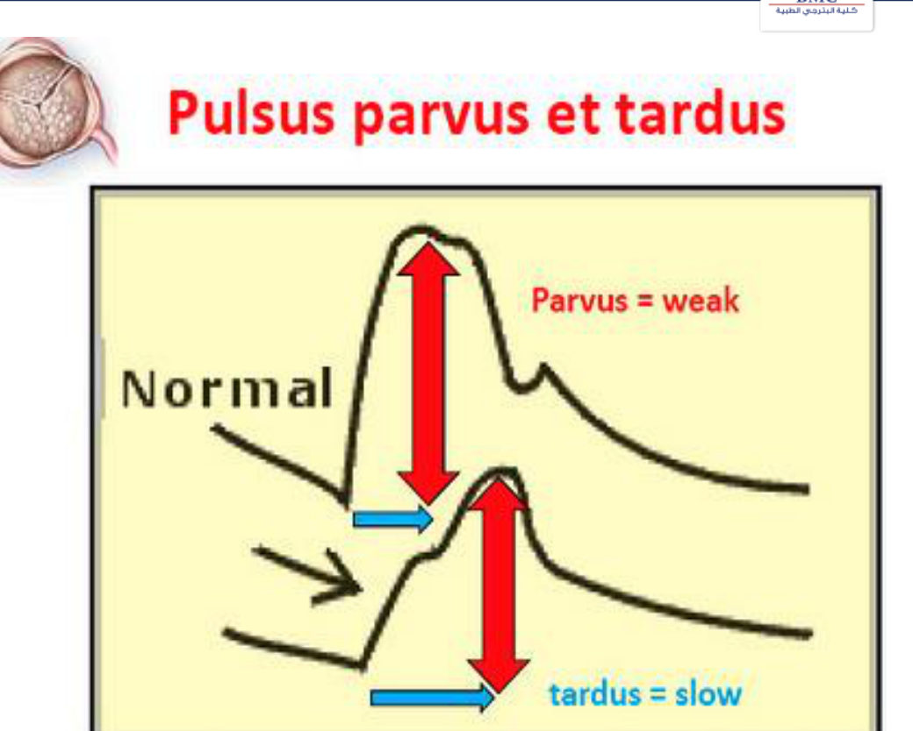 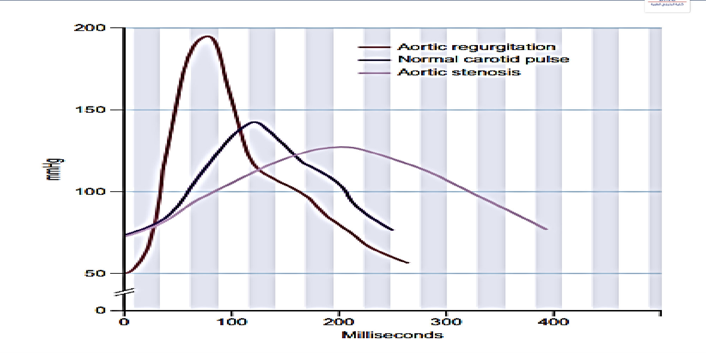

**Auscultation (slide 30)** ⭐
- **Harsh crescendo–decrescendo ("diamond") systolic ejection murmur**, radiating **bilaterally to the carotids**.
- **Handgrip → DECREASES** the murmur (↑ afterload → less gradient).
- **Valsalva and standing from squatting → decrease** it, or leave it unchanged (↓ preload).
- **Soft S2** (*[added]* single/paradoxically split when severe).
- **S4**, best heard at the apex.
- **Early systolic ejection click** (bicuspid valve).

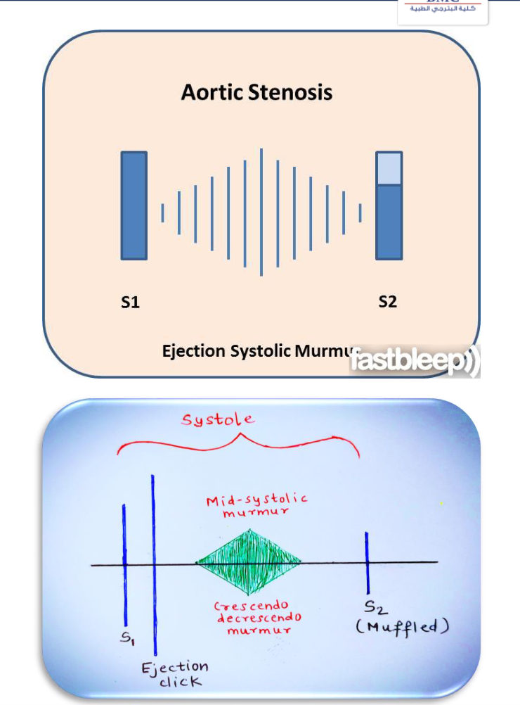

**Diagnostics (slide 31):**
- **Echocardiography**: **primary test**; confirms the diagnosis and grades severity (*[added]* severe = **AVA < 1.0 cm²**, **mean gradient ≥ 40 mmHg**, **Vmax ≥ 4 m/s**).
- **CXR:** pulmonary oedema, other causes of dyspnoea, **valve calcification** (more severe disease), **LVH**.
- **Cardiac catheterisation:** **accurate** measurement of **valve area**, cardiac output and **mean aortic gradient** (*[added]* used when echo is discordant).

**Treatment (slide 32)** ⭐

| AVR indications | Procedures |
|---|---|
| ⭐ **ALL symptomatic patients** | **Surgical AVR (SAVR)** |
| **Asymptomatic severe AS** with **significantly ↓ LVEF** (*[added]* < 50%) | ⭐ **Transcatheter AVR (TAVR)**: *[added]* elderly / high surgical risk |
| **Asymptomatic severe AS undergoing other cardiac surgery** (e.g., CABG) | **Percutaneous balloon valvuloplasty** (*[added]* bridge / palliation; restenosis) |

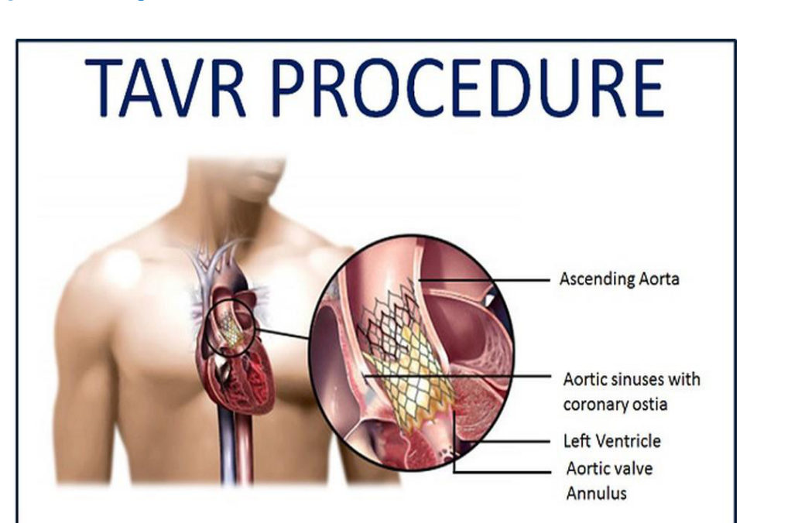

*[added] Avoid **vasodilators/nitrates** in severe AS: with a fixed outflow, preload drop → syncope/shock. **No medical therapy changes the natural history.***

> 🔁 **Recap: AS.** The commonest valve lesion: senile calcific (> 75), bicuspid (younger), rheumatic. SAD = syncope, angina, dyspnoea. Pulsus parvus et tardus, narrow pulse pressure, ejection click, diamond murmur to the carotids, soft S2, S4. Handgrip and Valsalva soften it. Echo grades severity; cath gives the exact area. AVR (SAVR/TAVR) for any symptoms, low EF or concurrent surgery.
> 🔗 **Link:** Moving to the mitral valve, the regurgitant lesion comes first.
> ▶️ **Up next: Mitral regurgitation.**

---

### 2.5 Mitral Regurgitation (Slides 33–40) ⭐

| **Primary (organic)**: leaflets/chordae | **Secondary (functional)**: LV problem |
|---|---|
| **Degenerative:** ⭐ **MVP**, **mitral annular calcification**, **ruptured chordae** | ⭐ **CAD / prior MI** affecting the **papillary muscles** |
| **Rheumatic fever** | **Dilated cardiomyopathy** (annular dilatation) |
| **Infective endocarditis** | |

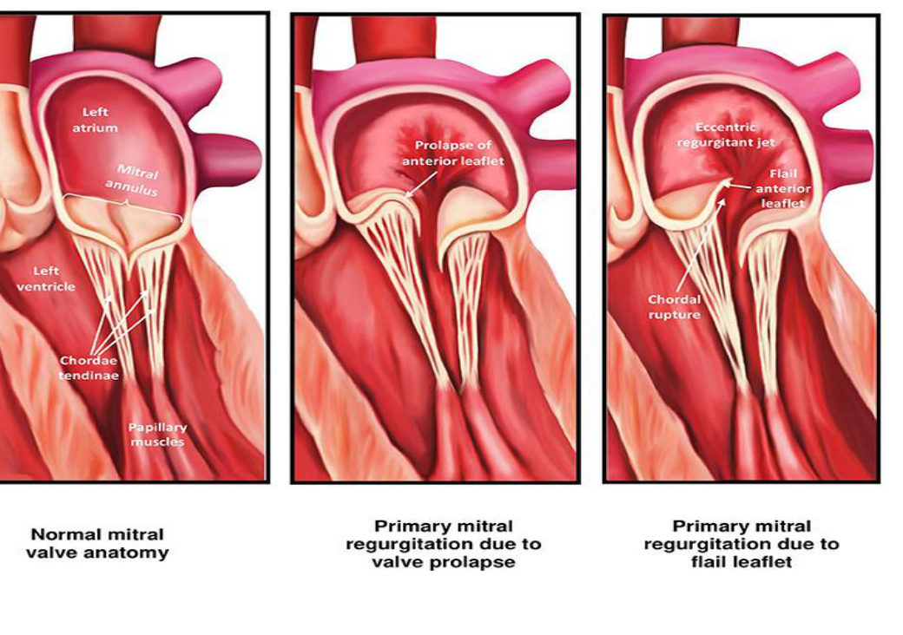 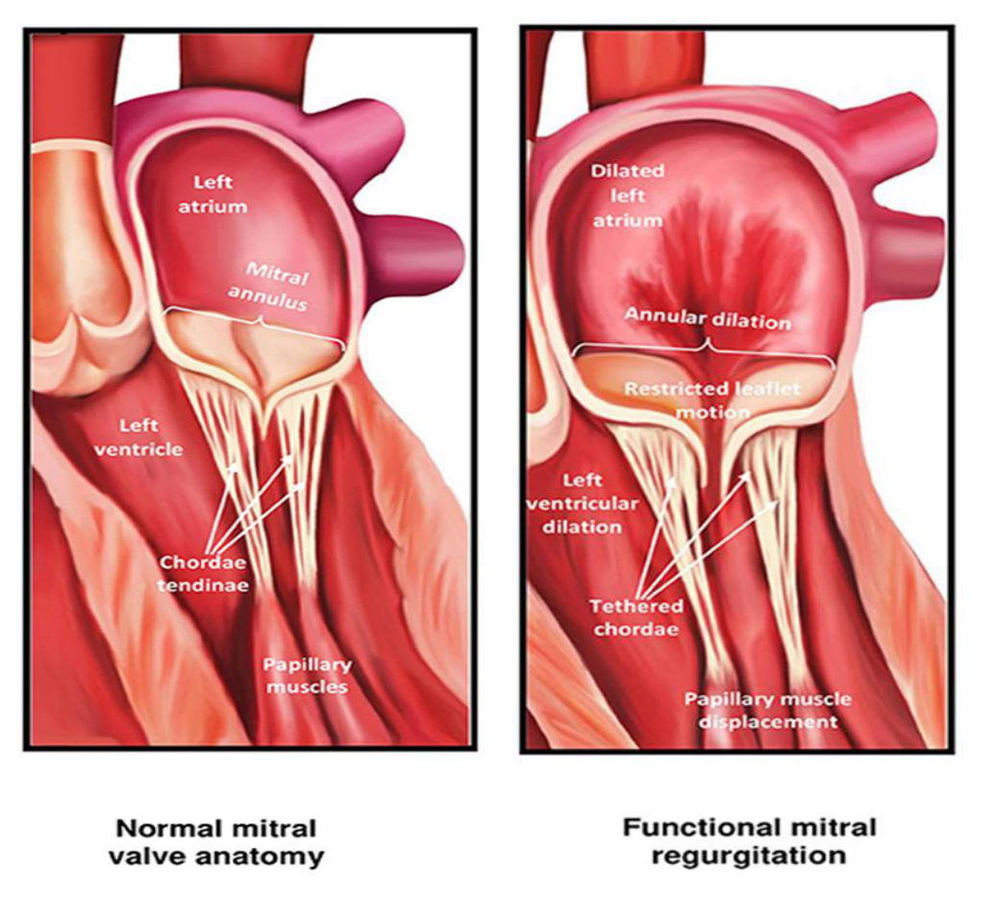

**Clinical features (slide 36):**
- **Acute MR:** **left HF**, **pulmonary oedema**, **cardiogenic shock** (*[added]* papillary rupture after MI, IE, chordal rupture).
- **Chronic MR:** dyspnoea (exertional), **dry cough**, **palpitations** (*[added]* AF), left HF.

**Auscultation (slide 37)** ⭐
- **S3** in advanced disease
- ⭐ **Holosystolic (pansystolic), high-pitched, blowing** murmur, **best at the apex**, radiating to the **LEFT AXILLA**
- **Louder with ↑ preload** (leg raise) and **↑ afterload (handgrip)** (more regurgitation)
- *[added]* **Soft S1**

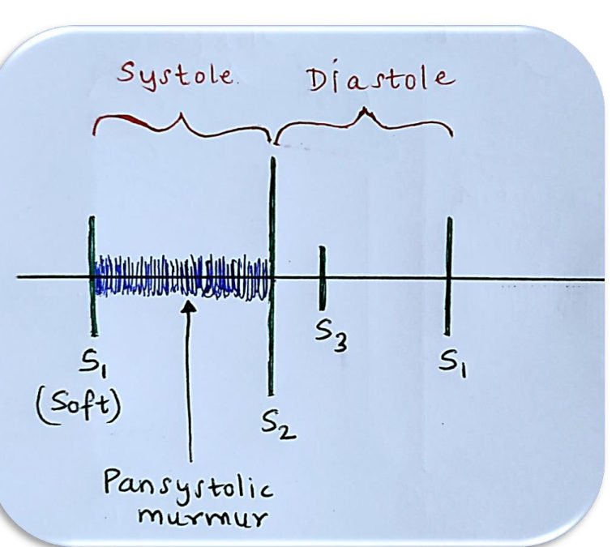

**Diagnostics (slide 38):**
- **Echo (TTE = modality of choice)**: valve apparatus, LV/LA size and function, **grade MR**.
- **ECG** (remodelling): **LVH**, ⭐ **P mitrale** (*[added]* AF).
- **CXR:** pulmonary congestion, **LV and LA enlargement**.

**Treatment (slides 39–40)** ⭐

| | |
|---|---|
| ⭐ **Acute primary MR** | **Urgent surgical repair or replacement for ALL**. Meanwhile manage HF medically (**diuretics, nitrates, afterload reduction**; *[added]* ± IABP) |
| **Procedure** | ⭐ **Valve REPAIR is preferred** over replacement |
| **Chronic severe primary MR**: surgery or **transcatheter mitral repair** (*[added]* MitraClip) | **Symptomatic** (irrespective of LV function) · **Asymptomatic with LV dysfunction, LVEF ≤ 60%** (*[added]* or LVESD ≥ 40 mm) |

> ⭐ **EF cut-offs:** **AR ≤ 55% · MR ≤ 60%.** In MR, the EF is flattered by ejection into the low-pressure LA, so a "normal-looking" 60% already means dysfunction *[added]*.

### 2.6 Mitral Valve Prolapse (Slides 41–45)
- **Epidemiology:** ⭐ **the most common cause of MR in developed countries**.
- **Etiology:** mostly **idiopathic**; **Marfan**, **Ehlers–Danlos**; acute rheumatic heart disease; IE.
- **Pathology:** ⭐ **myxomatous degeneration** → prolapse → **flail leaflet**.
- **Clinical:**
    - **Most patients are asymptomatic**.
    - ⭐ **Mid-systolic click** (high-frequency, mitral area) → **mid-to-late systolic murmur**, radiating to the axilla.
    - **Squatting diminishes the murmur**; *[added]* standing/Valsalva bring the click **earlier** and lengthen the murmur (slide 44 figure).
- **Diagnosis:** **TTE (test of choice)**.
- **Treatment:** **none in most cases**.
- **Complication:** **IE** (*[added]* plus severe MR, arrhythmia, rarely sudden death).

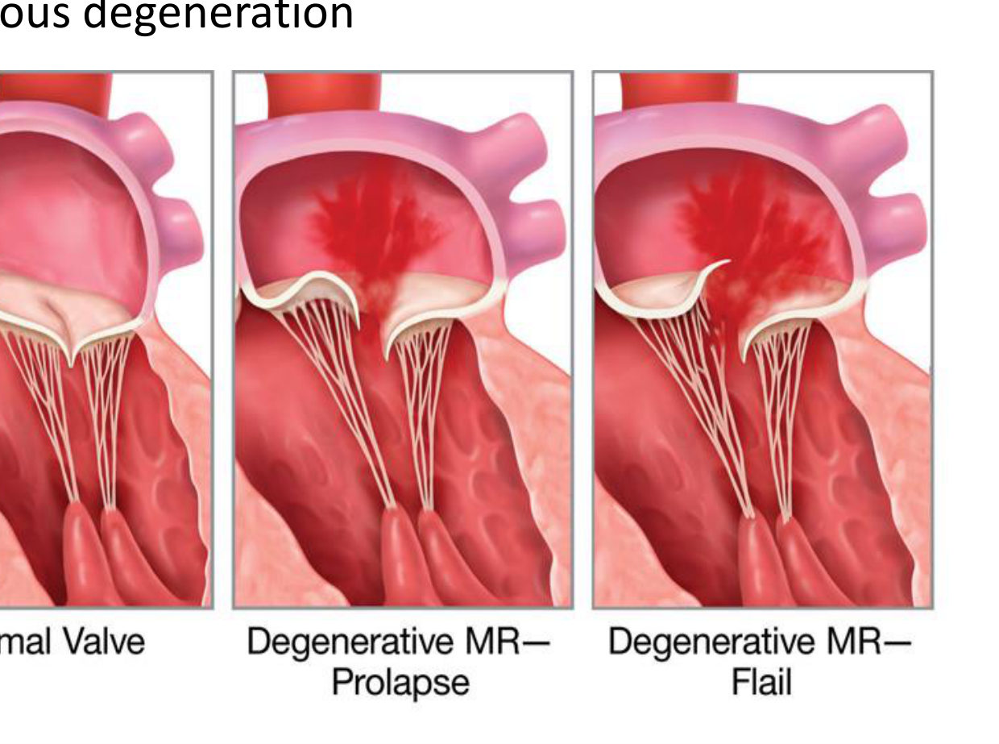 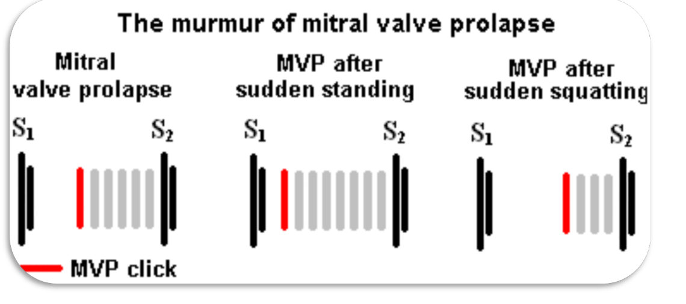

> 🔁 **Recap: MR and MVP.**
> - **MR:** primary (MVP, annular calcification, chordal rupture, RF, IE) vs secondary (ischaemic papillary dysfunction, DCM). Acute MR → pulmonary oedema/shock → urgent surgery (repair preferred). Chronic MR → pansystolic apical murmur to the axilla, S3, P mitrale, LA/LV enlargement. Operate if symptomatic or EF ≤ 60%.
> - **MVP:** myxomatous; the commonest MR cause in developed countries; click then late systolic murmur; squatting softens it; usually no treatment.
> 🔗 **Link:** The other rheumatic mitral lesion is the late, scarred one: stenosis.
> ▶️ **Up next: Mitral stenosis.**

---

### 2.7 Mitral Stenosis (Slides 46–53) ⭐
- **Etiology:** ⭐ **most commonly rheumatic fever**.

**Clinical features (slide 47):**
- **Dyspnoea**
- ⭐ **Hoarseness**: *[added]* **Ortner syndrome**; a big LA compresses the left recurrent laryngeal nerve
- ⭐ **Dysphagia**: *[added]* LA compresses the oesophagus
- **Later stages:**
    - **right HF symptoms**
    - **PND**
    - **orthopnoea**
    - ⭐ **haemoptysis** (*[added]* bronchial vein rupture)

**Malar flush vs malar rash (slide 48):**
- ⭐ **Malar flush (mitral facies):** **pinkish-purple patches** on the cheeks + **peripheral cyanosis** (lips, nose tip, cheeks). *[added]* Low cardiac output + vasoconstriction.
- **SLE butterfly rash:** erythematous, flat or raised, **spares the nasolabial folds**, photosensitive.

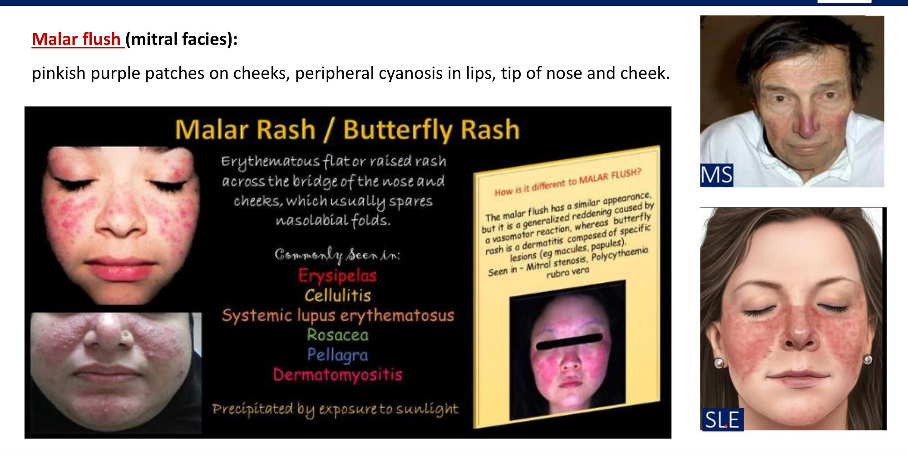

**Auscultation (slide 49)** ⭐
- **Low-pitched diastolic rumbling murmur**, **best at the apex** (*[added]* bell, left lateral decubitus)
- ⭐ **Loud S1**
- ⭐ **Opening snap**. *[added]* **The shorter the S2–OS interval, the more severe the MS** (slide 49 diagram: severe = OS closer to S2, longer rumble)
- *[added]* **Pre-systolic accentuation** (lost in AF)

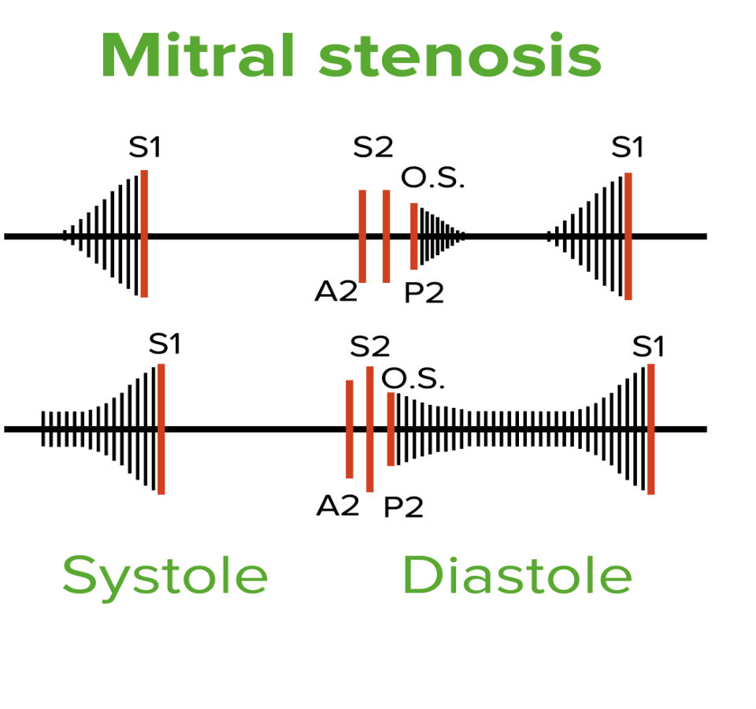

**Diagnostics (slides 50–51):**
- **TTE = most important** for diagnosis and guiding treatment:
    - **↓ mitral valve area** (*[added]* severe ≤ 1.5 cm²)
    - **Thickened, calcified leaflets with commissural fusion** (*[added]* "hockey-stick" anterior leaflet)
    - **LA enlargement**
- **ECG:** **LA enlargement = P mitrale** (*[added]* AF).
- **CXR (PA + lateral):**
    - **LA enlargement**
    - **Enlarged LA appendage** (*[added]* straight left heart border, double right-heart contour, splayed carina)
    - **Pulmonary congestion**

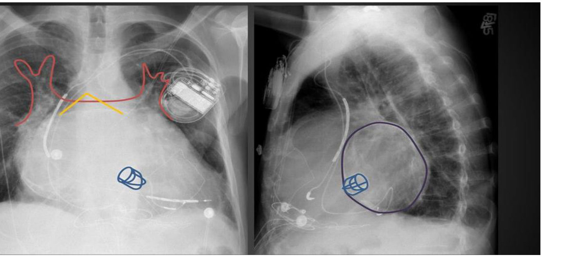

**Treatment (slide 52):**
- **Acute stabilisation:** standard HF therapy (**diuretics**; *[added]* **rate control** in AF, since a slower rate allows LV filling; **anticoagulate if AF**).
- ⭐ **Percutaneous mitral balloon commissurotomy (PMBC)**: **preferred intervention** for most severe MS (*[added]* if the valve is pliable, no LA thrombus, ≤ moderate MR).
- **Surgery:** **open commissurotomy** or **mitral valve replacement** (mechanical or bioprosthetic).

**Complications (slide 53):**
- ⭐ **Atrial fibrillation** (*[added]* → LA thrombus → **stroke**)
- **Pulmonary oedema**
- **Pulmonary hypertension**
- **CHF**

> 🔁 **Recap: MS.** Rheumatic, presenting at 20–39 years. Dyspnoea, haemoptysis, Ortner hoarseness, dysphagia, malar flush. Loud S1, opening snap, apical mid-diastolic rumble (short S2–OS = severe). P mitrale, AF, LA enlargement. PMBC is first-line intervention; surgery (commissurotomy/MVR) otherwise. Complications: AF/stroke, pulmonary oedema, pulmonary HTN, HF.
> 🔗 **Link:** Pulmonary hypertension from left-sided disease dilates the RV, which stretches the tricuspid ring.
> ▶️ **Up next: Tricuspid regurgitation.**

---

### 2.8 Tricuspid Regurgitation (Slide 54)
- **Aetiology:** ⭐ **usually FUNCTIONAL**: RV enlargement → **dilatation of the tricuspid ring** (*[added]* from pulmonary HTN, left-heart disease or MS). Primary causes *[added]*: IE (IVDU), carcinoid, Ebstein, pacemaker leads, rheumatic disease.
- **Haemodynamics:** in systole, blood regurgitates from RV → RA → **↑ RA pressure** → RA enlargement + **systemic congestion** + **low cardiac output (LCOP)**.
- **Clinical picture = RV failure:**
    - **Congested, pulsating neck veins with systolic expansion** (*[added]* giant cv waves)
    - **Enlarged, tender, pulsating liver** with mild jaundice
    - ⭐ **Ascites BEFORE lower-limb oedema**
    - **LCOP:** cold hands, weak pulse, low SBP, peripheral cyanosis
- **Auscultation:** ⭐ **pansystolic murmur INCREASED BY INSPIRATION** (*[added]* **Carvallo sign**). Maximal over the **tricuspid area**, **propagated to the apex but NOT the axilla**.

### 2.9 Cardiac Auscultation Summary (Slide 55)

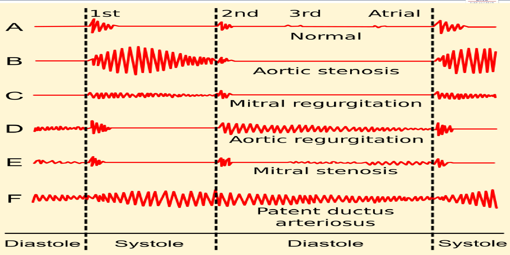

| Trace | Pattern |
|---|---|
| A. Normal | S1, S2 only |
| B. **AS** | Crescendo–decrescendo **systolic** (diamond) |
| C. **MR** | **Holosystolic** plateau |
| D. **AR** | **Early diastolic decrescendo** |
| E. **MS** | **Mid-diastolic rumble** with presystolic accentuation |
| F. **PDA** | **Continuous "machinery"** murmur through S2 |

> 🔁 **Recap: TR and auscultation.** TR is mostly functional (dilated RV ring). Raised JVP with systolic waves, pulsatile liver, ascites before oedema. Pansystolic murmur ↑ on inspiration, radiating to the apex but not the axilla. **Systolic:** AS (diamond), MR/TR (holosystolic), MVP (click + late). **Diastolic:** AR (early), MS (mid + snap). **Continuous:** PDA.
> 🔗 **Link:** When a valve must be replaced, the choice of prosthesis decides lifelong anticoagulation.
> ▶️ **Up next: Prosthetic valves.**

---

### 2.10 Prosthetic Valves (Slides 56–59) ⭐
**Types (slide 57).** Identification *[added, reconstructed from the standard figure]*:

| Letter | Probable type |
|---|---|
| A | Bileaflet mechanical (St Jude) |
| B | Tilting-disc mechanical |
| C | Caged-ball (Starr–Edwards) |
| D | Stented porcine bioprosthesis |
| E | Stented pericardial bioprosthesis |
| F | Stentless / homograft |
| G, H | **Transcatheter (TAVR)** valves: balloon-expandable and self-expanding |

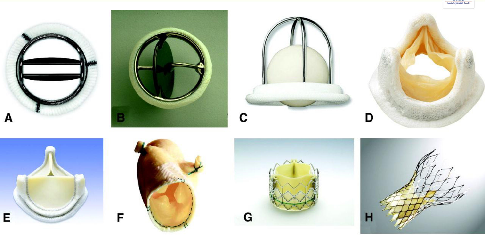

**Choosing the valve (slide 58, ACC/AHA 2020)** ⭐
- **Shared decision-making** first.
- **VKA possible:**

| Position | Age | Recommendation |
|---|---|---|
| **Aortic** | **< 50 y** | **Mechanical AVR (2a)** |
| | | If a bioprosthesis is preferred and anatomy suits → **pulmonic autograft (Ross procedure) at a comprehensive valve centre (2b)** |
| **Aortic** | **50–65 y** | **Mechanical OR bioprosthetic** (2a) |
| **Aortic** | **> 65 y** | **Bioprosthetic AVR (2a)** |
| **Mitral** (if repair not possible) | **< 65 y** | **Mechanical MVR (2a)** |
| **Mitral** | **≥ 65 y** | **Bioprosthetic MVR (2a)** |

- **VKA contraindicated, cannot be managed or not desired** → ⭐ **bioprosthetic valve (class 1)**.

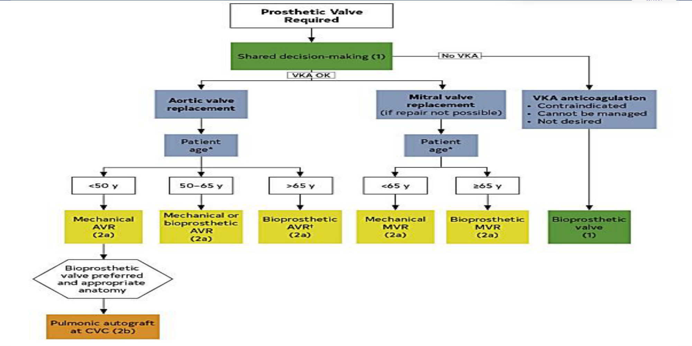

| | **Mechanical** *[added]* | **Bioprosthetic** *[added]* |
|---|---|---|
| Durability | **Lifelong** | 10–15 years (faster degeneration in the young) |
| Anticoagulation | **Lifelong warfarin** (INR 2.5–3.5 depending on position/risk); **DOACs contraindicated** | Usually 3–6 months, then aspirin |
| Best for | Young, can take warfarin | Elderly, **women wanting pregnancy**, bleeding risk, poor adherence |

**Thromboembolic risk factors for prosthetic valves (slide 59):**
- **Older-generation valve** (e.g., caged-ball)
- **AF**
- **Previous thromboembolism**
- **Hypercoagulable state**
- **LV systolic dysfunction**

> 🔁 **Recap: Prosthetics.** Mechanical valves last but need lifelong warfarin; bioprosthetic valves need no long-term VKA but wear out. Aortic: < 50 mechanical (or Ross), 50–65 either, > 65 bio. Mitral: < 65 mechanical, ≥ 65 bio. Can't take VKA → bio. Higher thrombosis risk with older valves, AF, prior emboli, hypercoagulability, poor LV. All prosthetic valves are **high risk for IE** (amoxicillin before dental extraction).

---

## 3. High-Yield Comparison Tables

### Table A: The Big Five Lesions
| | **AS** | **AR** | **MS** | **MR** | **TR** |
|---|---|---|---|---|---|
| Commonest cause | **Calcific** (old), **bicuspid** (young) | **Bicuspid** (rich countries), **rheumatic** (poor); root disease | **Rheumatic** | **MVP** (developed), ischaemic, DCM | **Functional** (RV dilatation) |
| Load | Pressure (LV) | Volume (LV) | Pressure (LA) | Volume (LA + LV) | Volume (RA/RV) |
| Murmur | **Ejection crescendo–decrescendo**, R 2nd ICS → **carotids** | **Early diastolic decrescendo**, LSE, leaning forward | **Mid-diastolic rumble**, apex, **opening snap** | **Holosystolic**, apex → **axilla** | **Holosystolic**, LLSE → apex, **↑ inspiration** |
| Heart sounds | Soft S2, **S4**, ejection click | **S3**, Austin Flint | **Loud S1**, OS | Soft S1, **S3** | |
| Pulse / periphery | **Parvus et tardus**, narrow PP | **Collapsing**, wide PP, Hill | AF, malar flush | ± AF | Giant v waves, pulsatile liver |
| ECG / CXR | LVH, valve calcium | LV dilatation, prominent root | **P mitrale, AF, big LA** | LVH, P mitrale, big LA + LV | RA/RV enlargement |
| Key symptom | **SAD** | Palpitations, dyspnoea | Dyspnoea, **haemoptysis, hoarseness, dysphagia** | Dyspnoea, fatigue | Ascites, oedema |
| Intervention | **AVR (SAVR/TAVR)** if symptomatic, ↓EF, or other cardiac surgery | AVR if symptomatic, **EF ≤ 55%**, LVESD > 50 | **PMBC** first | **Repair** if symptomatic or **EF ≤ 60%**; acute → urgent | Treat the cause *[added]* |

### Table B: Dynamic Auscultation (Manoeuvres)
| Manoeuvre | Effect on haemodynamics | AS | MR | AR | MVP | HCM *[added]* |
|---|---|---|---|---|---|---|
| **Handgrip** | ↑ afterload | **↓** | **↑** | **↑** | ↓ (later click) | ↓ |
| **Valsalva / standing** | ↓ preload | **↓ or =** | ↓ | ↓ | **↑ (earlier click, longer)** | **↑** |
| **Squatting / leg raise** | ↑ preload | ↑ | **↑** | ↑ | **↓** | ↓ |
| **Inspiration** | ↑ right venous return | — | — | — | — | — (**TR ↑**) |

### Table C: Acute vs Chronic Regurgitation
| | **Acute AR / MR** | **Chronic AR / MR** |
|---|---|---|
| Causes | **IE, dissection, trauma** (AR); **papillary rupture, chordal rupture, IE** (MR) | Valve or root disease, MVP, RF, DCM |
| LV | Normal size (no time to adapt) → **pressures spike** | **Dilated**, compliant |
| Presentation | **Sudden pulmonary oedema, shock** | Silent for years, then HF |
| Signs | Murmur may be short or soft; **no wide pulse pressure** (AR) | Classic murmurs + peripheral signs |
| Rx | ⭐ **Urgent surgery** + afterload reduction | Surgery by symptoms and EF/LV size |

### Table D: Surgical Thresholds from This Lecture
| Lesion | Operate when |
|---|---|
| **AS** | Symptomatic · asymptomatic severe with **↓ LVEF** · undergoing other cardiac surgery |
| **AR** | Acute severe · symptomatic chronic severe · asymptomatic severe with **LVEF ≤ 55%** (consider if **LVESD > 50 mm**) |
| **MR** | **Acute primary → urgent** · chronic severe primary: symptomatic, or asymptomatic with **LVEF ≤ 60%** |
| **MS** | Severe → **PMBC** preferred; else surgery |
| **MVP** | Usually none |

---

## 4. Rules, Exceptions, Patterns

| Rule | Exception / nuance |
|---|---|
| Murmurs louder with ↑ preload | **MVP and HCM** get louder/longer with ↓ preload (Valsalva, standing) |
| Handgrip ↑ regurgitant murmurs | It **↓ AS** and HCM *[added]* |
| Left-sided murmurs ↑ on expiration | **Right-sided (TR) ↑ on inspiration** |
| AS = elderly | **Bicuspid** valves give AS (and AR) in younger adults |
| Regurgitation → dilatation | **Acute** regurgitation has a **normal-sized LV**, hence sudden oedema without peripheral signs |
| MR EF "normal" = 55–70% | In MR, **EF ≤ 60%** already means dysfunction |
| Valve replacement for MR | **Repair is preferred** |
| MS → surgery | **PMBC** is first choice if anatomy suits |
| TR = valve disease | Usually **functional** (RV dilatation) |
| Mechanical valve for the young | Bioprosthetic if **VKA can't be used** (incl. pregnancy wishes *[added]*) |
| Ascites in HF follows leg oedema | In **TR** (and constriction), **ascites precedes LL oedema** |

---

## 5. Clinical Correlations
- **Elderly patient with exertional syncope, angina, slow-rising pulse** → **severe AS** → echo → TAVR/SAVR. Avoid nitrates.
- **Tall young man with long limbs, lens dislocation and an early diastolic murmur** → **Marfan root dilatation → AR** (also MVP). *[added]* Watch for dissection.
- **Sudden pulmonary oedema 5 days after inferior MI with a new apical pansystolic murmur** → **papillary muscle rupture → acute MR** → urgent surgery. *[CAD lecture link]*
- **Fever + new early diastolic murmur + heart block** → **IE with aortic root abscess** → surgery. *[IE lecture link]*
- **Tearing chest pain + new AR murmur** → **type A dissection** → emergency surgery.
- **Young woman from a low-income country, pregnant, with dyspnoea, haemoptysis, AF** → **rheumatic MS** (pregnancy volume load unmasks it). *[added]* β-blocker ± PMBC.
- **Hoarseness + loud S1 + opening snap** → **Ortner syndrome** from a giant LA in MS.
- **IVDU with pansystolic murmur ↑ on inspiration and a pulsatile liver** → **TR** from tricuspid IE.
- **55-year-old needing AVR who refuses warfarin** → **bioprosthetic** valve.
- **Mechanical valve + AF + previous stroke** → highest thromboembolic risk → strict INR, *[added]* ± aspirin.

---

## 6. Rapid Revision (Last-Day)
1. Stenosis = pressure overload → hypertrophy; regurgitation = volume overload → dilatation; both → HF.
2. **AS** is the commonest valve lesion in industrialised countries (degenerative, > 75; bicuspid if young). **MR** is second. **MS** presents at 20–39.
3. **Acute AR:** IE, dissection, trauma → sudden oedema. **Chronic AR:** bicuspid (rich), rheumatic (poor), root dilatation (Marfan, EDS, syphilis).
4. AR signs: water-hammer/Corrigan, **De Musset, Becker, Müller, Quincke, Traube, Duroziez, Hill (≥ 60 mmHg, most sensitive)**.
5. AR murmur: **early diastolic decrescendo**, LSE, leaning forward; **S3**; **Austin Flint**.
6. AR surgery: acute severe · symptomatic · asymptomatic with **EF ≤ 55%** (consider **LVESD > 50 mm**).
7. AS causes: **calcific (commonest)**, **bicuspid (earlier)**, rheumatic. **SAD.** **Pulsus parvus et tardus**, narrow PP.
8. AS murmur: **diamond ejection → carotids**; ↓ with handgrip and Valsalva/standing; **soft S2, S4, ejection click**.
9. AS: echo first; cath for exact area/gradient. **AVR (SAVR/TAVR)** if symptomatic, ↓ EF, or other cardiac surgery; balloon valvuloplasty is an option.
10. **MR primary:** MVP, annular calcification, ruptured chordae, RF, IE. **Secondary:** ischaemic papillary dysfunction, DCM.
11. MR: **holosystolic, apex → axilla**, ↑ handgrip and leg raise; S3; **P mitrale**; LA + LV enlargement.
12. **Acute primary MR → urgent surgery**; **repair preferred**. Chronic severe: symptomatic or **EF ≤ 60%**.
13. **MVP:** commonest MR cause in developed countries; myxomatous; **mid-systolic click + late murmur**; **squatting ↓**; usually no treatment; IE risk.
14. **MS:** rheumatic; dyspnoea, **hoarseness, dysphagia**, later right HF, PND, orthopnoea, **haemoptysis**; **malar flush**.
15. MS: **loud S1, opening snap, apical diastolic rumble**; P mitrale; big LA / LA appendage on CXR; **PMBC preferred**; complications AF, oedema, pulmonary HTN, CHF.
16. **TR:** mostly functional; congested pulsating neck veins, pulsatile tender liver, **ascites before oedema**; pansystolic murmur **↑ on inspiration**, to the apex **not the axilla**.
17. **Prosthetics:** aortic < 50 mechanical (or Ross), 50–65 either, > 65 bio. Mitral < 65 mechanical, ≥ 65 bio. **No VKA → bio.**
18. Prosthetic thrombosis risk: **old-generation valve, AF, previous TE, hypercoagulable state, LV dysfunction**.

---

## 7. Exam-Style Questions

**Q1 (lecture case).** A 75-year-old woman has exertional syncope, 3 years of exertional dyspnoea and chest discomfort, and weak delayed radial pulses. On the LV pressure–volume vs time plot (points A–E), where does her murmur start?
A · **B** · C · D · E

> **Answer: B.** *[reasoning added; key not on slides]*
> - **SAD + pulsus parvus et tardus** = **aortic stenosis**. Its murmur is an **ejection** murmur that starts when the **aortic valve opens**.
> - That is point **B**, where LV pressure has risen and **LV volume starts to fall**.
> - **A** = mitral closure (S1, isovolumetric contraction; no flow across the aortic valve yet).
> - **C** = aortic closure (S2; an AR murmur would start here).
> - **D** = mitral opening (an MS rumble/opening snap would start here).
> - **E** = late diastole.

**Q2.** A 30-year-old man with Marfan syndrome has a high-pitched early diastolic decrescendo murmur at the left sternal edge, BP 150/50, and head bobbing. Echo: severe AR, LVEF 52%, LVESD 48 mm. He is asymptomatic. What is the management?
A. Observe, repeat echo in 1 year · B. **Aortic valve (± root) replacement** · C. Start β-blocker only · D. Balloon valvuloplasty · E. TAVR

> **Answer: B.**
> - **Asymptomatic severe AR with LVEF ≤ 55%** is a surgical indication (slide 23).
> - *[added]* In Marfan, the root is usually replaced too.
> - Balloon valvuloplasty and TAVR are for **stenosis** (TAVR is not standard for AR).

**Q3.** Six days after an inferior STEMI, a patient develops sudden severe dyspnoea, hypotension and a new apical holosystolic murmur radiating to the axilla. Echo shows a flail posterior leaflet. What is the definitive management?
A. IV furosemide and observe · B. **Urgent mitral valve surgery (repair if possible)** · C. Elective MitraClip in 3 months · D. PMBC · E. Pericardiocentesis

> **Answer: B.**
> - **Acute primary MR** (papillary muscle rupture) → **urgent surgical repair or replacement for all**, with medical stabilisation meanwhile (slide 39).
> - PMBC is for **MS**.

**Q4.** Which manoeuvre makes the murmur of mitral valve prolapse **softer and shorter**, with the click moving later?
A. Valsalva · B. Standing from squatting · C. **Squatting** · D. Amyl nitrite · E. Inspiration

> **Answer: C.**
> - **Squatting ↑ preload** → LV larger → less prolapse → later click and shorter murmur (slide 44).

**Q5.** A 52-year-old needs aortic valve replacement and has no contraindication to warfarin. Which ACC/AHA 2020 option is reasonable?
A. Mechanical only · B. Bioprosthetic only · C. **Mechanical OR bioprosthetic after shared decision-making** · D. Ross procedure mandatory · E. Balloon valvuloplasty

> **Answer: C.**
> - **Age 50–65 → either valve (2a)**. Mechanical (2a) is for < 50; bioprosthetic (2a) for > 65 (slide 58).

---

## 8. Exam Pitfalls & Traps
- **Slide 21 (AR diagnostics)** says TTE is used "to confirm diagnosis and determine **AS** severity". This is a copy error from the AS slides; it means **AR** severity.
- **Hill sign:** the slide gives **≥ 60 mmHg** and calls it the "most sensitive sign for AR". Classically > 20 mmHg is abnormal and **> 60 mmHg indicates severe AR** *[added]*. Quote ≥ 60 mmHg for the exam.
- **AS manoeuvres:** handgrip **decreases** AS, Valsalva decreases or doesn't change it. **Only HCM (and MVP) get louder with Valsalva/standing**. This is the classic AS vs HCM discriminator *[added]*.
- **EF cut-offs differ:** **AR ≤ 55%**, **MR ≤ 60%**. Don't mix them.
- **MR "repair preferred"**: replacement is a wrong answer when repair is feasible.
- **MS intervention:** **PMBC first**, not valve replacement, if anatomy suits.
- **Acute regurgitation** lacks the classic chronic signs. A short or soft murmur with flash pulmonary oedema is still acute MR/AR.
- **TR radiates to the apex but NOT the axilla**. MR radiates **to the axilla**. Inspiration ↑ TR only.
- **Ascites before leg oedema** points to **TR or constrictive pericarditis**, not left HF.
- **Malar flush (MS)** vs **butterfly rash (SLE)**: the SLE rash spares the nasolabial folds and is photosensitive.
- **Prosthetic valve selection** follows **ACC/AHA 2020 age bands** (slide 58). ESC uses slightly different ages *[added]*. Use the slide's numbers.
- **DOACs are contraindicated with mechanical valves** *[added]*. Warfarin only.
- **Slide 57 valve letters (A–H) are not labelled on the slide.** The identification above is reconstructed; know the categories (mechanical: bileaflet, tilting disc, caged-ball; bioprosthetic: stented, stentless; transcatheter) rather than the letters.
