# Thyroid Disorders 1: Approach to Goiter, Thyroid Function Tests & Hyperthyroidism
**Internal Medicine Department** | Source: `1-Thyroid - Approach to a Case of Goiter and TFT Interpretation & Hyperthyroidism.pdf` (50 slides)

> **Legend:** ⭐ = high-yield / likely exam target · *[added]* = not on slides (context, mnemonic, or reasoning). Everything else comes from the lecture. Images marked "Slide N" come from the lecture; "Added diagram" = drawn for these notes.
> The slides contain some typos and internal contradictions (PTU vs methimazole in thyroid storm, some unit typos). They are kept as written and flagged in §8.

---

## 1. Title / Objectives

| Domain | Objective | Likely tested as |
|---|---|---|
| Knowledge | Pathophysiology & aetiology of thyroid disorders | Synthesis steps, HPT axis, TBG changes |
| Knowledge | ⭐ Epidemiology, manifestations, complications, management of **hyperthyroidism** | Graves features, eye signs, storm |
| Skill | ⭐ Interpret **clinical findings + TFTs** → diagnosis | TSH/FT4 patterns, RAIU, antibodies |
| Skill | ⭐ Evidence-based management | Thionamides vs RAI vs surgery; pregnancy |
| Skill | ⭐ Recognise **emergencies** (thyroid storm) | Storm treatment sequence |

**Lecture flow:** Anatomy & physiology → Thyroid function tests (1–10) → Goiter → Thyrotoxicosis (definition, causes) → Graves' disease (aetiology, 10 systems of features, storm) → Differential diagnosis → Treatment (medical, RAI, surgery, pregnancy, complications, storm) → Case.

---

## 2. Main Content (Lecture Order)

### 2.1 Anatomy, Relations & Histology (Slides 4–7)
- ⭐ One of the **biggest endocrine glands**, in the neck **anterior to the trachea, below the thyroid cartilage**
- **Butterfly-shaped**: **two lobes joined by the isthmus**
- ⭐ **Weight 12–20 g**

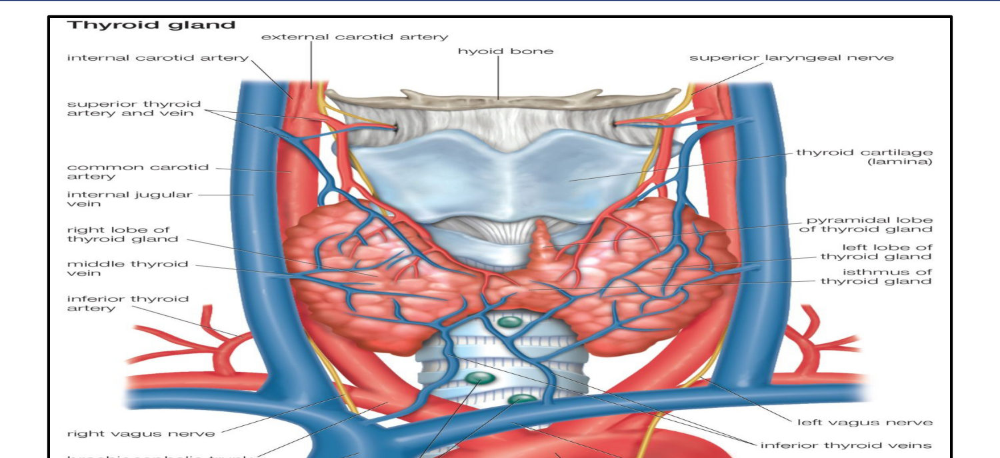

⭐ **Relations (Slide 6):**
| Direction | Structures |
|---|---|
| **Posterior** | Prevertebral fascia, **carotid sheath** (common carotid, IJV, vagus), **parathyroids**, trachea |
| **Medial** | ⭐ **Recurrent laryngeal nerve**, trachea, larynx, oesophagus |
| **Anterior** | Pretracheal fascia, **sternohyoid, sternothyroid** (strap muscles) |

*[added clinical link: the posterior parathyroids and the medial recurrent laryngeal nerve are exactly the structures injured in thyroidectomy (§2.8).]*

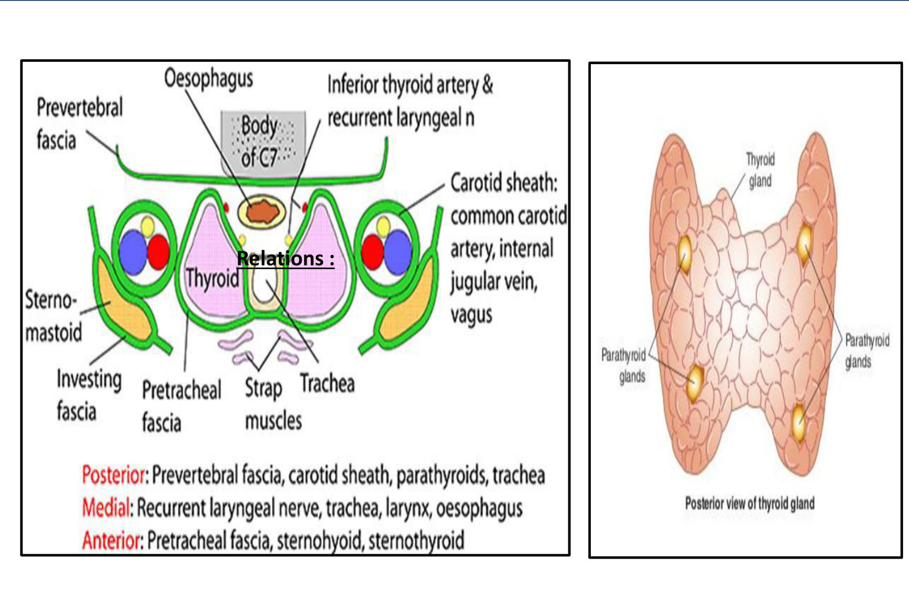

**Histology (Slide 7):** numerous **follicles**, each lined by a **single layer of epithelial cells**, filled with **colloid** rich in **thyroglobulin**, the precursor of **T4 (thyroxine) and T3 (tri-iodothyronine)**. Parafollicular **C cells** (calcitonin) are shown between the follicles.

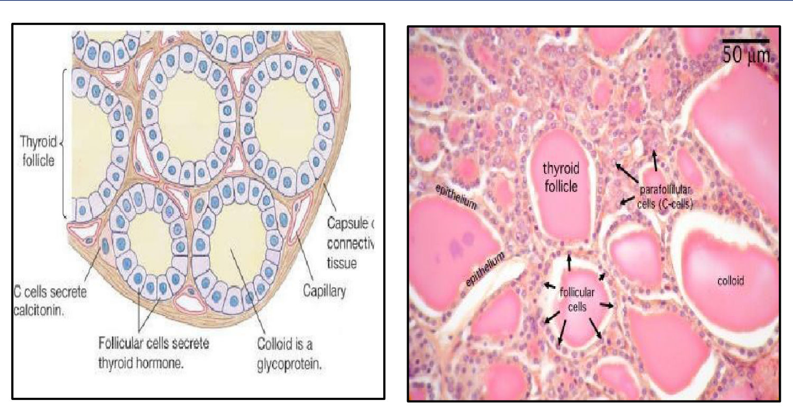

> 🔁 **Recap: Anatomy.** 12–20 g butterfly gland in front of the trachea. Parathyroids sit posteriorly and the recurrent laryngeal nerve runs medially. Follicles store thyroglobulin in colloid.
> 🔗 **Link:** Structure explains function: the follicle is a hormone factory, and the next slides show what the hormone does and how the factory is controlled.
> ▶️ **Up next: Physiology.** Effects, HPT axis, synthesis steps.

---

### 2.2 Physiology: Effects, Control, Synthesis (Slides 8–11)
⭐ **Physiological effects of thyroid hormones (Slide 8):**
1. ↑ **O₂ consumption** in all tissues; ↑ **glucose absorption**
2. ↑ **HR, cardiac output, excitability & conductivity** (+ arteriolar dilatation)
3. ↑ **Skeletal growth & sexual maturation**
4. ↓ **Serum cholesterol**

*[added: every hyper/hypothyroid feature in §2.6 and Lecture 2 follows from these four effects: too much → hot, thin, fast, low cholesterol; too little → cold, heavy, slow, high cholesterol.]*

⭐ **Hypothalamic–pituitary–thyroid axis (Slide 9):**
- **TRH** (hypothalamus) → **TSH** (anterior pituitary thyrotropes) → T4/T3 synthesis & secretion
- Adequate thyroid hormone → **negative feedback** ↓ TRH & TSH
- ↓ Thyroid hormone → ↑ TRH & TSH
- ⭐ **TSH = the most useful physiological marker of thyroid hormone function**

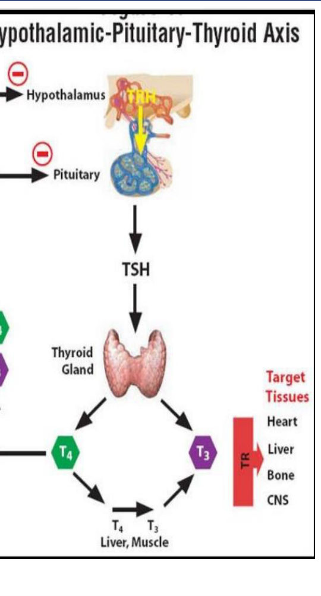

⭐ **Hormone synthesis, 4 steps (Slide 10):**
| # | Step | What happens |
|---|---|---|
| 1 | **Iodine trapping** | Iodide absorbed from gut is taken up by the thyroid (under **TSH**) and converted to iodine by **peroxidase** |
| 2 | **Binding (organification)** | Iodine + tyrosine → **MIT** (mono-iodotyrosine) and **DIT** (di-iodotyrosine) |
| 3 | **Coupling** | MIT + DIT → **T3**; DIT + DIT → **T4** *[pairings added; the slide lists the products only]* |
| 4 | **Release** | Thyroglobulin → **protease** → free T4, T3; controlled by TSH (feedback) |

⭐ **Transport proteins:** **TBG 75%**, **prealbumin 15%**, **albumin 10%**.

*Mnemonic [added]:* **"Trap → Bind → Couple → Release" (TBCR)**.

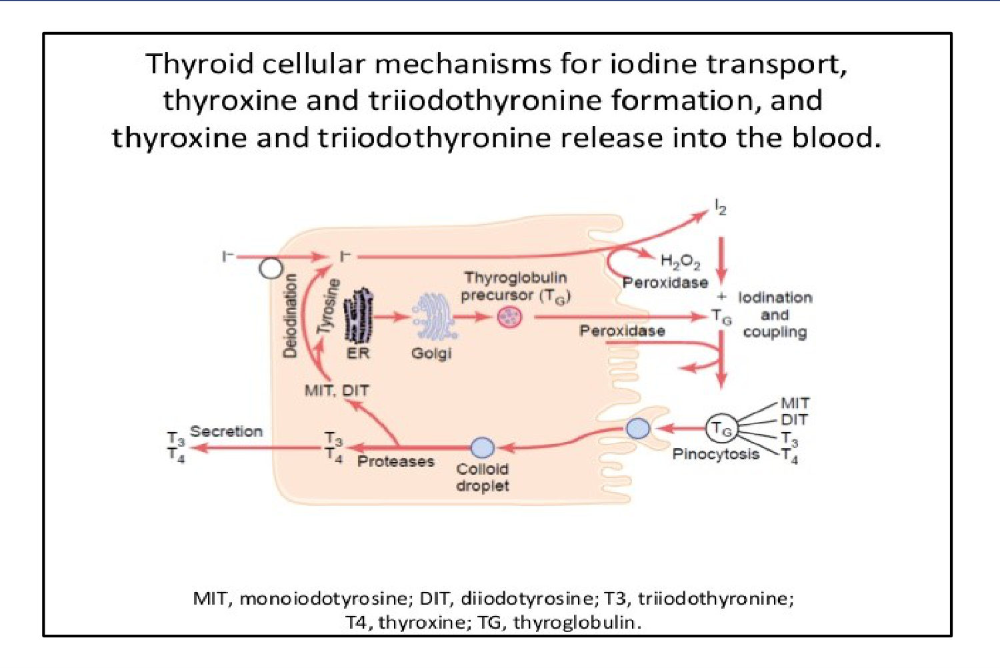

> 🔁 **Recap: Physiology.** Hormones raise metabolism, heart rate and growth, and lower cholesterol. TRH → TSH → T4/T3 with negative feedback. Synthesis = trap, bind, couple, release. 75% travels on TBG.
> 🔗 **Link:** Every lab test checks one piece of this chain: hormone levels, the TSH signal, iodine trapping, or antibodies against the machinery.
> ▶️ **Up next: Thyroid function tests.** The lecture's 10 investigations.

---

### 2.3 Thyroid Function Tests (Slides 12–18)
**1. Total T4 / T3** (RIA)
- ⭐ **Total T4 normal 4–12 µg/dL**; **Total T3 normal 80–120 ng/dL**
- ⭐ Totals are **affected by TBG changes**:

| ↑ TBG | ↓ TBG |
|---|---|
| **Pregnancy** | **Liver cell failure** |
| **Oestrogen** (OCPs) | **Nephrotic syndrome** |
| Congenital | **Malnutrition** |
| | Congenital |
| | **Androgens** |

*[added: TBG changes alter TOTAL T4/T3 only; FREE hormone and TSH stay normal, so the patient is euthyroid.]*

**2. Free T3 / T4:** ~0.4 ng/dL and ~1.6 ng/dL respectively.

**3. ⭐⭐ Serum TSH:** normal **0.5–5 µU/mL**
- ⭐ **Most sensitive test for primary hypothyroidism**; separates **primary (TSH ↑)** from **secondary (TSH ↓)** hypothyroidism

| Level of disease | Hyperthyroidism | Hypothyroidism |
|---|---|---|
| ⭐ **Primary (thyroid)** | **↑ T4 + ↓ TSH** | **↓ T4 + ↑ TSH** |
| ⭐ **Secondary (pituitary)** | **↑ T4 + ↑ TSH** | **↓ T4 + ↓ TSH** |

*Rule [added]:* **TSH and T4 move in OPPOSITE directions → thyroid problem; SAME direction → pituitary problem.**

**4. ⭐ Radioactive iodine uptake (RAIU):** I-131 or **I-123 (preferable)**
- **Normal 24-h uptake = 5–30%** of the dose
- Useful in diagnosing **hyperthyroidism**; poor for hypothyroidism (discriminates low vs normal poorly)
- ⭐ Most causes of thyrotoxicosis → **↑ RAIU, EXCEPT**:
  1. **Thyrotoxicosis factitia**
  2. **Thyroiditis (subacute & chronic)**
  3. **Ectopic thyroid tissue**
- ⚠️ **RAIU scans are contraindicated in pregnancy and lactation** (Slide 14 caution)

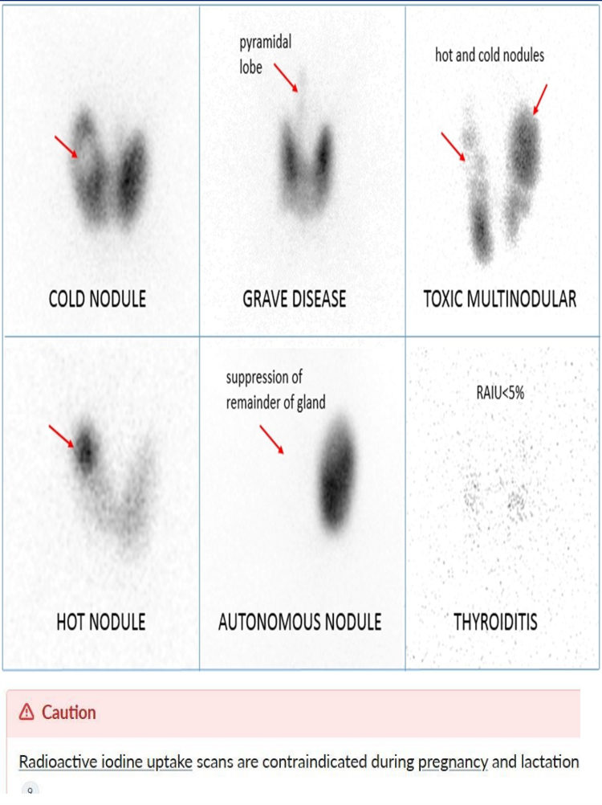

**5. T3 suppression test:** T4 or RAIU before and after giving T3. ⭐ **Failure to suppress = hyperthyroidism** (autonomous gland).

**6. Thyroid scan (⁹⁹ᵐTc)**. Useful for:
1. ⭐ **Hot (↑ uptake) vs cold (↓ uptake) nodules**
2. **Retrosternal goiter**
3. **Ectopic thyroid tissue**
4. **Functioning metastases** of thyroid carcinoma

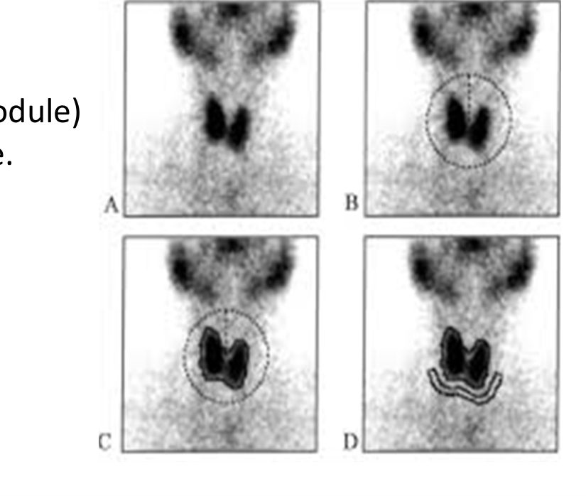

**7. ⭐ Anti-thyroid antibodies (Slide 16):**
| Antibody | Disease |
|---|---|
| **TSI** (thyroid-stimulating Ig, formerly **LATS**) | ⭐ **Graves' disease** |
| **Antimicrosomal (anti-TPO) & antithyroglobulin** | ⭐ **Hashimoto's thyroiditis**; may be in 1° hypothyroidism, Graves' |
| **TBII** (TSH-binding inhibitory Ig) | **Primary hypothyroidism** |

⭐⭐ **Antibody prevalence (Slide 17):**
| | **TRAb** | **Anti-TPO** | **Anti-Tg** |
|---|---|---|---|
| **Graves** | ⭐ **~90%** | ~70% | ~50–70% |
| **Hashimoto** | ~10–15% | ⭐ **> 90%** | ⭐ **> 80%** |
| **Thyroid cancer** | No association | Sporadic | **~25%** (important for follow-up!) |
| **Other** | ~15% in multinodular goiter | **> 60% in postpartum thyroiditis** | ~40% in other autoimmune disease (e.g., T1DM) |
| **General population** | **Negative** | ~5% | ~5% |

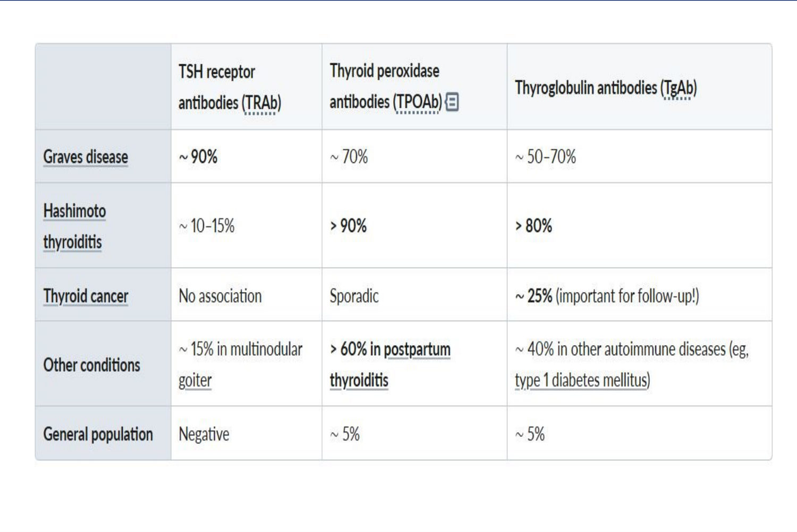

**8. Thyroglobulin:** ↑ in differentiated thyroid cancer. ⭐ **Tumour marker to follow differentiated cancer after thyroidectomy.** *[added: anti-Tg antibodies (~25% of cancers) interfere with the Tg assay, which is why the table says "important for follow-up".]*

**9. Thyroid ultrasound (Slide 18):**
| Advantages | Disadvantages |
|---|---|
| **Cystic vs solid** | **Operator-dependent** |
| Blood flow (**Doppler**) | ⭐ **No information on function** |
| **Biopsy guidance** (also lymph nodes) | Not feasible in **substernal goiter** |
| Moderate precision for volume | **Poor prediction of malignancy** |

**10. FNA biopsy:** ideally from the **periphery** of the lesion; **re-aspirate after fluid is drawn**; **smear and fix immediately**.

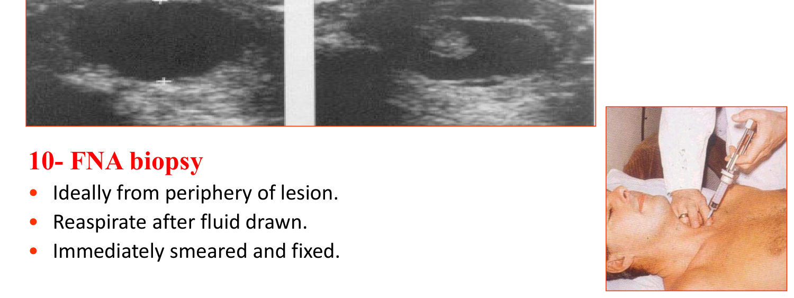

> 🔁 **Recap: TFTs.** TSH first (0.5–5). TBG changes affect totals only. RAIU is high in most thyrotoxicosis except factitia, thyroiditis and ectopic tissue. TRAb → Graves, anti-TPO/Tg → Hashimoto. Thyroglobulin is the cancer follow-up marker. US gives structure, not function.
> 🔗 **Link:** With the tools defined, the lecture applies them to the commonest presenting problem: an enlarged thyroid.
> ▶️ **Up next: Goiter.**

---

### 2.4 Goiter (Slides 19–20)
⭐ **Definition:** diffuse or focal enlargement of the thyroid that may be **hyperactive, hypoactive, or normoactive (euthyroid)**.

| Function | Example |
|---|---|
| **Hyperthyroid** | **Graves' disease**, **multinodular goiter** |
| **Euthyroid** | **Simple diffuse goiter** |
| **Hypothyroid** | **Hashimoto thyroiditis** |

⭐ **Thyroid ultrasound = most accurate way to assess thyroid size.**

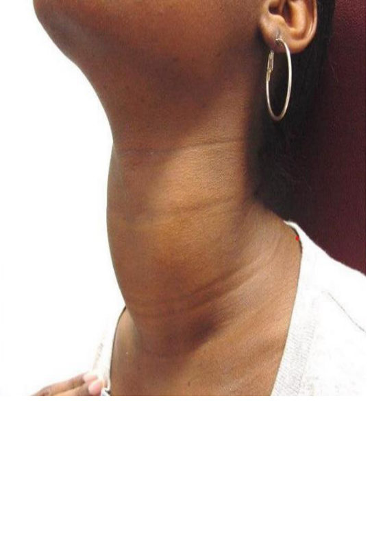

> 🔁 **Recap: Goiter.** Goiter describes size, not function. It can be hyper-, eu- or hypothyroid. US measures size best.
> 🔗 **Link:** The first functional category, too much hormone, is the focus of the rest of this lecture.
> ▶️ **Up next: Thyrotoxicosis.** Definition and causes.

---

### 2.5 Thyrotoxicosis: Definition & Causes (Slides 21–23)
⭐⭐ **Thyrotoxicosis** = the clinical syndrome of **excess circulating thyroid hormone** (any source).
⭐⭐ **Hyperthyroidism** = thyrotoxicosis where the **thyroid gland itself is the source**.

| Mechanism | Causes (slide) |
|---|---|
| **A. Thyroid hyperfunction** | 1. ⭐ **Graves' disease: most common cause** · 2. **Toxic nodular goiter** · 3. **Toxic adenoma** · 4. **Iodine-induced (Jod-Basedow)** · 5. **TSH-secreting pituitary tumor** · 6. **Choriocarcinoma / hydatidiform mole** (hCG resembles TSH) |
| **B. Abnormal release** (leak) | 1. **Subacute thyroiditis** · 2. **Hashitoxicosis** (chronic thyroiditis with transient thyrotoxicosis) · 3. **"Hamburger" thyroiditis** *[added: from eating meat contaminated with thyroid tissue]* |
| **C. Extra-thyroid source** | 1. **Thyrotoxicosis factitia** (exogenous thyroxine) · 2. **Ectopic tissue**: **struma ovarii**, **functioning metastatic (follicular) carcinoma** |

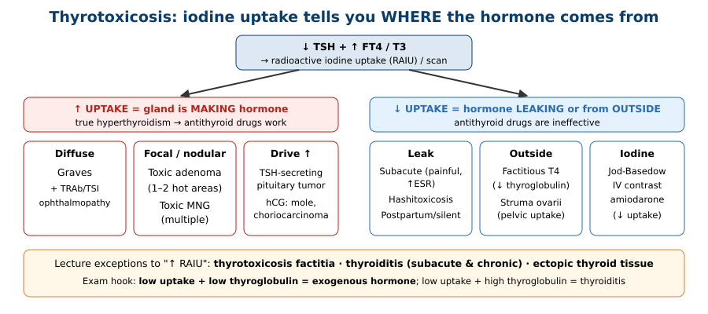

> 🔁 **Recap: Causes.** Hyperfunction (Graves #1, toxic MNG/adenoma, iodine, TSH tumour, hCG), leak (thyroiditis) or outside source (factitia, struma ovarii, metastases). Only hyperfunction gives ↑ uptake.
> 🔗 **Link:** Graves' is the commonest cause and the only one with eye and skin disease, so the lecture examines it in depth.
> ▶️ **Up next: Graves' disease.** Aetiology.

---

### 2.6 Graves' Disease: Aetiology & Clinical Features (Slides 24–31)
**Also called:** **Basedow disease**, **toxic diffuse goitre**.

⭐ **Aetiology (Slide 24):**
- **TSI** (formerly **LATS**), a **TSH-receptor antibody (TRAb)**, **binds TSH receptors** → **diffuse goitre + ↑ hormone production**
- ⭐ TSI is **IgG** → **crosses the placenta** (neonatal thyrotoxicosis)
- Associated with other autoimmune disease, e.g., **autoimmune polyglandular syndrome II**
- ⭐ **HLA-B8, DR3**; **smoking ↑ risk**

⭐ **Epidemiology:** **middle age (30–50 y)**, **♀ > ♂ by 5–10×**. **Insidious onset**, course of **remissions and exacerbations**.

⭐⭐ **Classic triad: diffuse vascular goitre + ophthalmopathy + dermopathy.**

**Clinical features by system:**
| # | System | Features |
|---|---|---|
| 1 | **General / metabolic** | ⭐ **Weight loss despite good appetite**; **heat intolerance** (tolerate winter better than summer) |
| 2 | **Neuropsychiatric** | Nervousness, emotional lability; **brisk reflexes**; ⭐ **fine tremor** (outstretched hands, protruded tongue) |
| 3 | **Cardiovascular** | Sinus tachycardia, SVT, ⭐ **AF** (**any arrhythmia except heart block**); **high-output failure**; flow murmur |
| 4 | **GIT** | ↑ appetite, ↑ motility → diarrhoea (rare) |
| 5 | **Musculoskeletal** | **Myopathy**, myasthenia gravis; bone resorption > formation → **hypercalciuria**, sometimes **hypercalcaemia**, **osteoporosis** in the elderly |
| 6 | **Reproductive** | ♀ **oligomenorrhoea**, ↓ fertility; ♂ impotence, ↓ sperm count, ⭐ **gynaecomastia** (↑ peripheral androgen → oestrogen conversion) |
| 7 | **Skin** | Warm, sweaty; ⭐ **onycholysis ("Plummer's nail")**; ⭐ **pretibial myxoedema** (orange-peel thickening, rare); **thyroid acropachy** (clubbing) |
| 8 | **Thyroid gland** | **Diffusely enlarged, firm**; ⭐ **bruit** (↑ blood flow) |
| 9 | **Eyes** | See next table |
| 10 | **Thyroid storm** | See below |

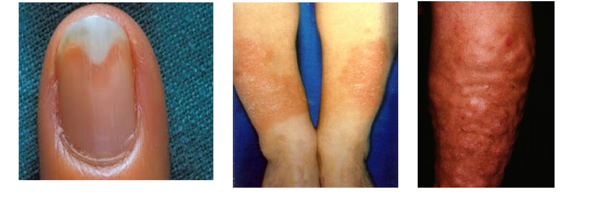 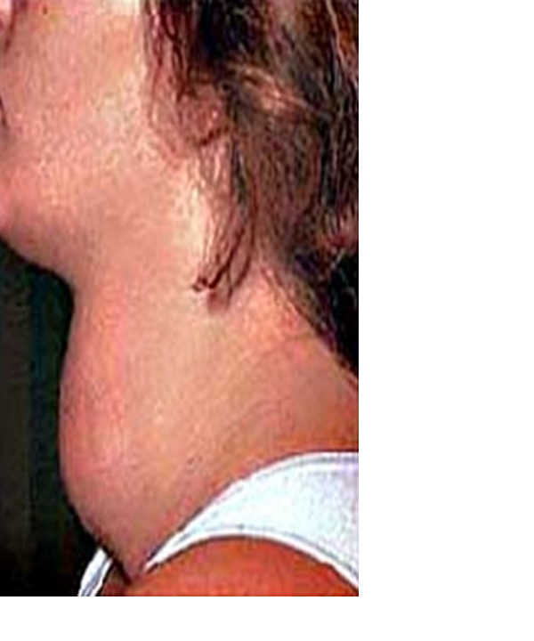

⭐⭐ **Ocular manifestations (Slide 29):**
| **Spastic** (sympathetic overactivity; any thyrotoxicosis) | **Mechanical** (infiltrative; ⭐ **Graves' ONLY**) |
|---|---|
| **Rosenbach's**: tremor of closed eyelids | ⭐ **Proptosis**, **ophthalmoplegia** (diplopia) |
| **Joffroy's**: no forehead wrinkling on upward gaze | **Möbius**: inability to converge at near vision |
| **Dalrymple's**: staring look (lid retraction) | Conjunctivitis, **chemosis**, periorbital swelling |
| **Von Graefe's**: **lid lag** on downward gaze | Late: **corneal ulceration**, **optic neuritis, optic atrophy** |
| **Stellwag's**: infrequent blinking | |

*The slide prints the note **"(DR must be very simple)"** next to the spastic signs without explaining it.* *Mnemonic [added]:* **"R-J-D-V-S"** (Rosenbach, Joffroy, Dalrymple, Von Graefe, Stellwag) for the five spastic signs; **M**öbius = **M**echanical (convergence).

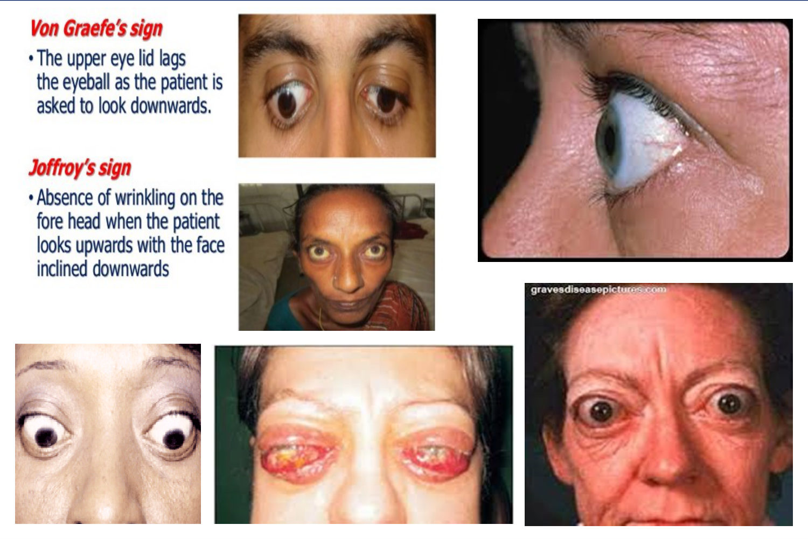

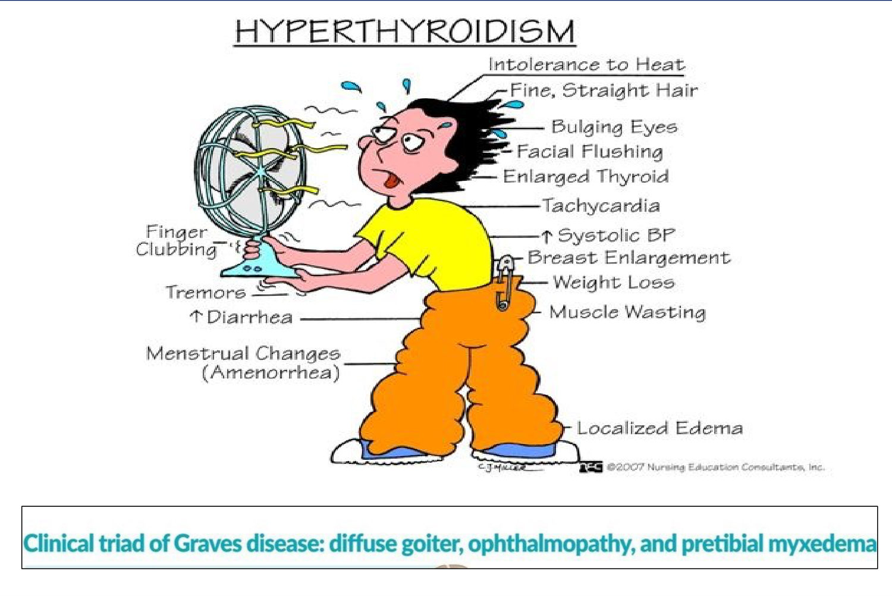

⭐⭐ **Thyroid storm (thyrotoxic crisis) (Slide 32):** dangerous **decompensated thyrotoxicosis**.
- **Causes:** **excessive manipulation of the thyroid during thyroidectomy**; **neglected severe hyperthyroidism + intercurrent illness** (pneumonia, gastroenteritis)
- **Picture:** **tachycardia, fever**, irritability, **psychosis**, nausea, vomiting, diarrhoea

> 🔁 **Recap: Graves.** TSI (IgG) stimulates the TSH receptor. Women aged 30–50, HLA-B8/DR3, smoking. Triad = goitre + eyes + skin. Ten-system picture: weight loss with appetite, tremor, AF, gynaecomastia, onycholysis, bruit. Spastic eye signs occur in any thyrotoxicosis; infiltrative ones only in Graves. Storm = fever + tachycardia + CNS change after surgery or illness.
> 🔗 **Link:** Before treating, confirm the diagnosis and rule out mimics and the other causes of thyrotoxicosis.
> ▶️ **Up next: Differential diagnosis.**

---

### 2.7 Investigations & Differential Diagnosis (Slides 33–34)
**Investigations:** see §2.3.

**A. Mimics:**
- ⭐ **Anxiety neurosis**: **cold sweaty skin + normal sleeping pulse** *(Graves: warm skin, tachycardia persists during sleep [added])*
- Anaemia · cardiac failure · COPD · malignancy · malabsorption & DM · myopathies & myasthenia gravis

**B. Other causes of thyrotoxicosis (clinical clues):**
| Clue | Diagnosis |
|---|---|
| **Nodular gland + ↑ RAIU** | Toxic nodular goiter / toxic adenoma |
| ⭐ **Tender gland + firm nodularity** | **Subacute thyroiditis** |
| **Small firm non-tender goitre** | Hashimoto's → **hashitoxicosis** |
| ⭐ **No palpable thyroid** | **Extra-thyroid source**: struma ovarii, factitia |

*Antithyroid antibodies help differentiate.*

⭐ **Graves vs toxic nodular goiter (Slide 34):**
| | **Graves** (1° thyrotoxicosis, toxic diffuse goitre) | **Toxic nodular goiter** |
|---|---|---|
| Gland | **Diffusely enlarged** | **Nodular** |
| CVS features | + | ⭐ **+++** |
| Nervous features | ⭐ **+++** | + |
| **Infiltrative ophthalmopathy** | ⭐ **Usually present** | **Absent** |
| Treatment | **Usually medical** | **Usually surgical** |

> 🔁 **Recap: Differential.** Anxiety = cold hands and a normal sleeping pulse. Tender gland = subacute thyroiditis. No gland = outside source. Graves is more nervous with eye signs; toxic MNG is more cardiac with no eye signs.
> 🔗 **Link:** Once the cause is known, the treatment matches it: drugs block synthesis, radioiodine or surgery remove tissue, and adjuncts control symptoms.
> ▶️ **Up next: Treatment.** Medical first.

---

### 2.8 Treatment (Slides 35–45)

#### A. Medical therapy (Slide 35)
| ✅ Indicated | ❌ Contraindicated |
|---|---|
| **Pregnancy** | ⭐ **Huge goitre** (pressure symptoms) |
| **Heart failure** | **Retrosternal goitre** |
| ⭐ **Graves' in a patient < 25 y** | **Suspected malignancy** |
| **Pre-medication before surgery** | |

**1. ⭐⭐ Thionamides (Slides 36–37)**
| Point | Detail |
|---|---|
| Mechanism (all) | ⭐ **Inhibit thyroid peroxidase (TPO)** → ↓ synthesis |
| **PTU** extra | ⭐ **↓ peripheral T4 → T3 conversion** |
| **Carbimazole** extra | **↓ TSI production** (immunosuppressive) |
| Doses | **PTU 300–600 mg/day** (3 divided doses) · **Methimazole 30–60 mg/day** · **Carbimazole (Neo-Mercazole) 30–60 mg/day** (once daily or 3 divided) |
| Follow-up | Reduce to **½–⅔** of initial dose after control; continue ⭐ **1–2 years** |
| ⭐ Side effects | ⭐ **Agranulocytosis** (→ **CBC if sore throat**), arthralgia, rash, serum sickness |
| Prognosis | ⭐ **Long-term remission in ½**; relapses usually **within the 1st year**; some become hypothyroid later |

⚠️ **Caution (Slide 39):** get a **CBC and liver chemistries immediately** if fever or signs of **hepatotoxicity** on antithyroid drugs.
💡 **Clinical pearl (Slide 39):** ⭐ **Antithyroid drugs are INEFFECTIVE in destructive thyroiditis** (preformed hormone leaking out).

**Sites of drug action (Slide 39 diagram):**
| Site | Drug |
|---|---|
| Na⁺/I⁻ symporter (trapping) | **Perchlorate** |
| TPO (organification/coupling) | **Thionamides**; **iodide > 5 mg** |
| Proteolysis / release | **Lithium**, **iodide > 5 mg** |
| Peripheral **deiodinase** (T4 → T3) | **Dexamethasone, PTU, amiodarone, propranolol** |

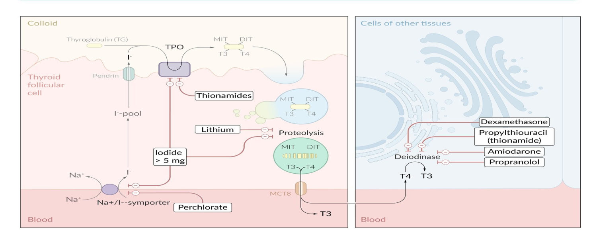

**2. β-blockers (Slide 38):** ⭐ **Propranolol**. ↓ adrenergic activity + **↓ T4 → T3**. **20–40 mg q6h**, titrated to **HR ~80/min**.

**3. Other agents (Slide 38):**
| Agent | Dose | Role |
|---|---|---|
| **Sodium ipodate** | 1 g/day | ↓ T4 → T3 |
| ⭐ **Potassium iodide** | **5 drops (250 mg) bid** | **Pre-op**: ↓ gland vascularity. ⚠️ **Escape after ~10 days** |
| **Dexamethasone** | 8 mg/day | ↓ secretion + ↓ T4 → T3 |

#### B. ⭐ Radioiodine (I-131) (Slides 40–41)
| Indications | Contraindications | Side effects |
|---|---|---|
| **Recurrence after thyroidectomy** | ⭐ **Pregnancy, lactation, childhood** | ⭐ **Hypothyroidism**: in 1st month = **transient**; after 1 year = **permanent** |
| **Failed medical therapy + unfit for surgery** | **Huge / retrosternal goiter** | May cause thyroid carcinoma (per slide) |
| **Refuses surgery** | | Fetal anomalies & neonatal hypothyroidism if given in pregnancy |

⭐ **Timing (Slide 41):** give thionamides first (to avoid an acute hormone release), **stop 3–5 days before I-131**, **restart 14 days later**. Antithyroid drugs may be needed for a few months because RAI takes time to work.

#### C. ⭐ Surgery: subtotal (or total) thyroidectomy (Slide 42)
| Indications | Preparation | Complications |
|---|---|---|
| **Allergy to antithyroid drugs** | **Thionamides for several months** (→ euthyroid) | **Hypothyroidism** |
| **Refuses I-131** | ⭐ **Inorganic iodine 7–10 days pre-op** (↓ vascularity) | ⭐ **Hypoparathyroidism** |
| **Big / retrosternal goiter** | β-blockers short-term | **Recurrent hyperthyroidism** |
| **Toxic multinodular goiter** | | ⭐ **Recurrent laryngeal nerve injury** |
| **Suspected malignancy** | | |

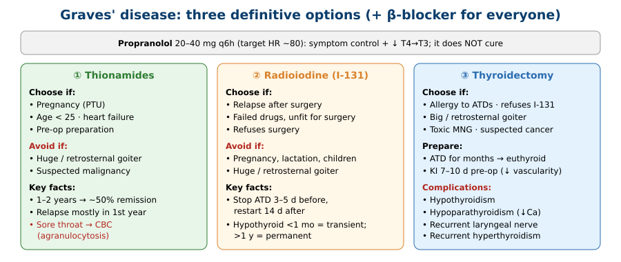

#### D. ⭐⭐ Pregnancy (Slide 43)
1. ⭐ **I-131 is contraindicated** (crosses the placenta)
2. ⭐ **PTU preferred**: crosses the placenta **less** than other thionamides
3. Surgery if necessary → ⭐ **1st or 2nd trimester** (GA in the 3rd trimester → premature labour)
4. ⭐ **Newborn may be hyperthyroid** (transplacental **TSI**) → watch closely

*[added: current guidance is PTU in the 1st trimester (methimazole embryopathy), then switch to methimazole for the 2nd/3rd (PTU hepatotoxicity).]*

#### E. Complications (Slide 44)
| Complication | Treatment |
|---|---|
| **Ophthalmopathy** | Protect eye (ointment, sunglasses, methylcellulose); ⭐ **prednisone** (↓ lymphocytic infiltration); **orbital decompression** |
| **Heart failure** | Bed rest, salt restriction, digitalis, diuretics |
| **Pretibial myxoedema** | Remits spontaneously over months–years; **topical betamethasone** for pruritus |

#### F. ⭐⭐⭐ Thyroid storm (Slide 45)
1. **Ice bags** (hyperpyrexia), **fluids & electrolytes**
2. ⭐ **IV dexamethasone 4–8 mg/day**: ↓ T4 → T3 and covers **adrenal insufficiency**
3. ⭐ **IV propranolol** → ↓ HR
4. **Sodium ipodate 1 g/day × 2 weeks**
5. ⭐ **High-dose antithyroid drug**: PTU 600 mg then 300 mg q6h *can* be used, **but methimazole is the treatment of choice** because of PTU side effects (per slide)
6. **Antibiotics** for underlying infection

⚠️ **Caution:** storm with **congestive heart failure** → ⭐ **esmolol is the preferred β-blocker**; monitor all β-blocked patients for HF.
💡 **Student pearl (on slide):** ***"PROverbial PROficiency and POetic GLUttony"*** → **PRO**pranolol, **PRO**pylthiouracil, **PO**tassium iodide, **GLU**cocorticoids.
*[added: give the thionamide at least 1 hour BEFORE iodide, so the iodide isn't used as substrate for new hormone.]*

> 🔁 **Recap: Treatment.** Thionamides block TPO (PTU also blocks conversion) for 1–2 y (~50% remission; watch for agranulocytosis). Propranolol for symptoms. RAI for relapse or unfit patients, never in pregnancy. Surgery for big, retrosternal or suspicious glands and toxic MNG (prepare with iodide 7–10 d). Pregnancy: PTU, surgery in T1/T2. Storm: cool, steroid, β-block, thionamide then iodide, antibiotics.
> 🔗 **Link:** The lecture ends with a case asking for the best first drug in a symptomatic thyrotoxic patient with AF.
> ▶️ **Up next:** Case, answered in §7.

---

## 3. High-Yield Comparison Tables

### Table A: TSH / FT4 patterns
| TSH | FT4 | Diagnosis |
|---|---|---|
| ↓ | ↑ | **Primary hyperthyroidism** (Graves, toxic nodule, thyroiditis…) |
| ↓ | Normal | **Subclinical hyperthyroidism** or **T3 toxicosis** |
| ↓ | ↓ | **Central hypothyroidism** or non-thyroidal illness |
| ↑ | ↓ | **Primary hypothyroidism** |
| ↑ | Normal | **Subclinical hypothyroidism** |
| ↑ | ↑ | **TSH-secreting pituitary tumour** (secondary hyperthyroidism) |
| Normal | Abnormal total T4 only | **TBG change** (pregnancy/OCP ↑; nephrotic/liver/androgens ↓) |

### Table B: Antibodies *(see §2.3)*

### Table C: RAIU in thyrotoxicosis
| ↑ Uptake | ↓ Uptake |
|---|---|
| Graves (diffuse) · toxic adenoma (single hot) · toxic MNG (multiple hot) · TSH tumour · hCG | ⭐ **Factitia** · ⭐ **thyroiditis** (subacute, chronic, postpartum) · ⭐ **ectopic tissue** (struma ovarii) · iodine load |

### Table D: Spastic vs infiltrative eye signs *(see §2.6)*

### Table E: Graves vs toxic nodular goiter *(see §2.7)*

### Table F: Thionamides
| | **PTU** | **Methimazole / Carbimazole** |
|---|---|---|
| Blocks TPO | ✓ | ✓ |
| Blocks T4 → T3 | ⭐ ✓ | ✗ |
| ↓ TSI | | Carbimazole ✓ |
| Dose | 300–600 mg/d in 3 doses | 30–60 mg/d, once daily possible |
| Pregnancy | ⭐ **Preferred** (less placental transfer) | |
| Thyroid storm | Can be used | ⭐ **Treatment of choice** (per slide) |
| Shared SE | **Agranulocytosis**, rash, arthralgia, serum sickness | |

### Table G: Definitive treatment choice
| | Thionamides | I-131 | Surgery |
|---|---|---|---|
| **Pregnancy** | ✅ (PTU) | ❌ | T1/T2 only |
| **< 25 y** | ✅ | ❌ (childhood) | |
| **Huge / retrosternal** | ❌ | ❌ | ✅ |
| **Suspected cancer** | ❌ | | ✅ |
| **Toxic MNG** | | | ✅ |
| **Relapse after surgery** | | ✅ | |
| Main risk | Agranulocytosis | Hypothyroidism | Hypoparathyroidism, RLN palsy |

---

## 4. Rules, Exceptions, Patterns
- **TSH is the best single test**; TSH and T4 in opposite directions → thyroid disease; same direction → pituitary.
- **TBG changes alter total T4/T3, not free hormone or TSH.**
- **Most thyrotoxicosis → ↑ RAIU.** Exceptions: **factitia, thyroiditis, ectopic tissue**.
- **Spastic eye signs occur in any thyrotoxicosis; infiltrative signs are Graves-only.**
- **Graves = +++ nervous, eye disease present. Toxic MNG = +++ cardiac, no eye disease.**
- **Any arrhythmia EXCEPT heart block** in hyperthyroidism.
- **Antithyroid drugs don't work in destructive thyroiditis.**
- **PTU is the only thionamide that also blocks peripheral conversion.**
- **Propranolol, dexamethasone, ipodate, PTU** all ↓ T4 → T3.
- **Iodide works for ~10 days (escape)**, so it is used only pre-op or in storm.
- **I-131: never in pregnancy, lactation, childhood.** Hold thionamides 3–5 d before, restart after 14 d.
- **Pregnancy: PTU; surgery only in T1/T2.**
- **Storm with heart failure → esmolol.**

---

## 5. Clinical Correlations
- **Sore throat or fever on carbimazole/PTU** → stop and check CBC urgently (agranulocytosis).
- **Hoarse voice after thyroidectomy** → recurrent laryngeal nerve injury. **Perioral tingling / tetany** → hypoparathyroidism (hypocalcaemia) *[added]*.
- **New AF in an older patient** → check TSH *[added]*.
- **Pregnant woman on OCP / in pregnancy with ↑ total T4 but normal TSH** → ↑ TBG, not hyperthyroidism.
- **Thyrotoxic patient with no palpable goitre and low uptake** → factitious thyroxine intake (low thyroglobulin) or struma ovarii.
- **Neonate of a Graves mother** (even if mother is post-treatment) → transplacental TSI → neonatal thyrotoxicosis.
- **Post-thyroidectomy fever, tachycardia, psychosis** → thyroid storm triggered by gland handling.

---

## 6. Rapid Revision (Last-Day)
- Thyroid: 12–20 g, two lobes + isthmus. RLN medial, parathyroids posterior.
- Effects: ↑ O₂ use, ↑ HR/CO, ↑ growth, ↓ cholesterol.
- Synthesis: **trap → bind (MIT/DIT) → couple (T3/T4) → release**. TBG **75%**, prealbumin 15, albumin 10.
- Total T4 **4–12 µg/dL**, T3 **80–120 ng/dL**, TSH **0.5–5**.
- ↑ TBG: **pregnancy, oestrogen**. ↓ TBG: **liver failure, nephrotic, malnutrition, androgens**.
- RAIU normal **5–30%** at 24 h. **I-123 preferred.** Low uptake: **factitia, thyroiditis, ectopic**.
- T3 suppression: failure to suppress = hyperthyroid.
- TRAb **~90% Graves**; anti-TPO **> 90%**, anti-Tg **> 80% Hashimoto**; anti-TPO **> 60% postpartum**.
- Thyroglobulin = follow-up marker for differentiated cancer.
- US: structure only, poor for malignancy prediction. FNA from periphery.
- Thyrotoxicosis = excess hormone; hyperthyroidism = gland is the source. **Graves = #1 cause.**
- Graves: **TSI (IgG, crosses placenta)**, **HLA-B8/DR3**, smoking, ♀ 30–50, **5–10× ♀**.
- Triad: **goitre + ophthalmopathy + dermopathy**.
- Eye: spastic (**Rosenbach, Joffroy, Dalrymple, Von Graefe, Stellwag**) vs infiltrative (**proptosis, ophthalmoplegia, Möbius, chemosis → optic atrophy**).
- Skin: **onycholysis, pretibial myxoedema, acropachy**. Gland: **bruit**.
- Storm: fever, tachycardia, psychosis, GI; after **surgery** or **illness**.
- Anxiety: **cold sweaty skin + normal sleeping pulse**.
- Medical Rx for: pregnancy, HF, **< 25 y**, pre-op. Not for huge/retrosternal/malignant.
- **PTU 300–600**, **methimazole/carbimazole 30–60** mg/day; **1–2 years**; **50% remission**; **agranulocytosis**.
- **Propranolol 20–40 mg q6h** → HR 80. **KI 5 drops bid**, escape at **10 d**. **Dexamethasone 8 mg**. **Ipodate 1 g**.
- I-131: relapse post-surgery, failed drugs + unfit, refuses surgery. ❌ pregnancy/lactation/children, huge goiter. Hypo <1 mo transient, >1 y permanent.
- Surgery: allergy, refuses I-131, big/retrosternal, **toxic MNG**, cancer suspicion. Prep: thionamide + **iodine 7–10 d**. Complications: hypothyroid, **hypoparathyroid**, recurrence, **RLN**.
- Pregnancy: **PTU**, surgery **T1/T2**, watch neonate.
- Storm: ice, fluids, **IV dexamethasone 4–8 mg**, **IV propranolol** (esmolol if HF), ipodate, **methimazole (choice)**/PTU, antibiotics. **PRO-PRO-PO-GLU.**

---

## 7. Exam-Style Questions

**Q1 (MCQ, lecture case, Slides 46–47).** 35 ♀, 3 weeks of palpitations with sharp left chest pain, appears nervous. **Pulse 110, irregularly irregular**, BP 135/85. **Fine tremor**, **digital swelling**, **left upper eyelid retraction**, systolic flow murmur, warm extremities. Most appropriate pharmacotherapy to **address her symptoms**?
A) PTU **B) Propranolol** C) Digoxin D) Amiodarone E) Warfarin F) Diltiazem

**Answer: B.** *[reasoning added; the slide has a stray "A" above the options but gives no answer key, so confirm with your instructor]*
- The picture is **Graves' disease** (lid retraction, acropachy, tremor) with **AF**.
- The question asks about **symptoms**: a **β-blocker** controls tachycardia, tremor and palpitations immediately and also ↓ T4 → T3.
- **PTU (A)** treats the cause but takes **weeks** to work, so it isn't the answer for symptom relief.
- **Digoxin** is less effective in thyrotoxicosis (↑ clearance) *[added]*. **Amiodarone** is iodine-rich and worsens thyrotoxicosis. **Warfarin** is for stroke prevention, not symptoms. **Diltiazem** is an alternative only if β-blockers are contraindicated *[added]*.

---

**Q2 (MCQ).** A woman has thyrotoxicosis with a **tender, firmly nodular thyroid** two weeks after a viral URTI. RAIU is **low** and ESR is **high**. Which treatment is **not** useful?
a) Aspirin b) Prednisone c) Propranolol **d) Methimazole**
**Answer: d.** Subacute thyroiditis is a **leak** of preformed hormone; ⭐ **antithyroid drugs are ineffective** (Slide 39 pearl). Treat symptoms with aspirin (mild) or prednisone (severe) plus propranolol.

---

**Q3 (MCQ).** A 28-year-old woman in her 2nd trimester has Graves' disease. Which is contraindicated?
a) PTU b) Propranolol short-term **c) Radioactive iodine** d) Subtotal thyroidectomy
**Answer: c.** I-131 crosses the placenta (fetal hypothyroidism/anomalies). Surgery is acceptable in the 1st/2nd trimester.

---

**Q4 (Short answer).** TSH is **high** and FT4 is **high**. What is the diagnosis and the next investigation?
**Answer:** **Secondary (central) hyperthyroidism**: a **TSH-secreting pituitary adenoma**. TSH and T4 moving in the same direction points to the pituitary → **MRI pituitary** (Lecture 2, Slide 38 algorithm).

---

**Q5 (Short answer).** List the preparation for thyroidectomy in Graves' disease and two nerve/gland-related complications.
**Answer:** **Thionamides for several months** to reach euthyroidism, **inorganic iodine (KI) 7–10 days before surgery** to reduce vascularity, ± short-term β-blocker. Complications: **recurrent laryngeal nerve injury** (hoarseness) and **hypoparathyroidism** (hypocalcaemia); also hypothyroidism and recurrence.

---

## 8. Exam Pitfalls & Traps
1. **Thyrotoxicosis ≠ hyperthyroidism.** Thyroiditis and factitia cause thyrotoxicosis without the gland over-producing.
2. **Giving antithyroid drugs for thyroiditis.** They don't work on leaked hormone.
3. **Assuming all thyrotoxicosis has high uptake.** Factitia, thyroiditis and ectopic tissue have low uptake.
4. **Diagnosing hyperthyroidism from a high TOTAL T4 in pregnancy/OCP use.** Check TSH/free T4 (TBG effect).
5. **Attributing lid lag or stare only to Graves.** Spastic signs occur in any thyrotoxicosis; **proptosis/ophthalmoplegia are Graves-only**.
6. **"Heart block" in hyperthyroidism.** It's the one arrhythmia the lecture excludes.
7. **Choosing PTU for symptom relief.** Thionamides take weeks; β-blockers act now.
8. **Iodide long-term.** Escape after ~10 days; use it pre-op or in storm only.
9. **RAI in pregnancy, lactation or children**, or for huge/retrosternal goitre.
10. ⚠️ **PTU vs methimazole contradiction:** Slide 43 says **PTU is preferred in pregnancy**; Slide 45 says **methimazole is the treatment of choice in storm** (because of PTU side effects), while also listing a PTU regimen. Both statements are from the lecture. Answer by context (pregnancy → PTU; storm → methimazole per this lecture).
11. ⚠️ **Slide unit typos:** "Total T3 normal 80–120 ng/all" = **ng/dL**. The storm slide says dexamethasone "4–8 mg/day (3 unless…)", where the "3" is probably a stray fragment.
12. **Graves vs toxic MNG:** Graves → nervous +++, eyes present, medical Rx. Toxic MNG → cardiac +++, no eyes, surgical Rx.
13. **Beta-blocker in storm with heart failure:** use **esmolol** (short-acting), not a long-acting agent.
14. **Radioiodine hypothyroidism timing:** within 1 month = transient; after 1 year = permanent.
