# Thyroid Disorders 2: Hypothyroidism, Thyroiditis, Thyroid Carcinoma & Solitary Thyroid Nodule
**Internal Medicine Department** | Source: `2-Thyroid - Hypothyroidism & Thyroiditis, Thyroid Carcinoma, Solitary Thyroid Nodule.pdf` (45 slides)

> **Legend:** ⭐ = high-yield / likely exam target · *[added]* = not on slides. Images marked "Slide N" come from the lecture; "Added diagram" = drawn for these notes.
> ⚠️ The two thyroid-cancer slides give **different frequencies** (table vs infographic). Both are shown and flagged in §8.

> 🔗 **Bridge from Thyroid Lecture 1:** Lecture 1 covered the axis (TRH → TSH → T4/T3), the tests (TSH first; primary disease moves TSH and T4 in opposite directions) and the **too-much-hormone** states. This lecture is the mirror image: **too little hormone**, the **inflammatory** conditions that can swing either way, and **structural** disease (nodules and cancer). It ends with lab-based algorithms that tie both lectures together.

---

## 1. Title / Objectives

| Domain | Objective | Likely tested as |
|---|---|---|
| Knowledge | Pathophysiology & aetiology of **hypothyroidism** and other thyroid disorders | Goitrous vs non-goitrous causes |
| Knowledge | ⭐ Manifestations, complications, management of hypothyroidism | Carpal tunnel, anaemia types, myxoedema coma |
| Skill | ⭐ Interpret clinical findings & investigations | TSH algorithms, subclinical disease |
| Skill | ⭐ Management plans (thyroxine dosing, thyroiditis, cancer, nodule work-up) | Slow vs rapid replacement; FNA indications |
| Skill | ⭐ Emergencies | **Myxoedema coma** treatment |

**Lecture flow:** Hypothyroidism (causes → features by system → myxoedema coma → investigations/DDx → treatment) → Thyroiditis (subacute, Hashimoto) → Solitary thyroid nodule → Thyroid cancer → Subclinical hypo/hyperthyroidism → Diagnostic algorithms & thyrotoxicosis table → Case.

---

## 2. Main Content (Lecture Order)

### 2.1 Hypothyroidism: Causes (Slides 4–7)
| Level | Share |
|---|---|
| ⭐ **Primary** (thyroid) | ⭐ **95%** |
| **Secondary** (hypothalamic/pituitary) | **5%** |
| **Tissue resistance** to thyroid hormone | Rare |

⭐⭐ **Primary hypothyroidism: non-goitrous vs goitrous (Slide 6):**
| **Non-goitrous** (small/absent gland) | **Goitrous** (enlarged gland) |
|---|---|
| **Congenital developmental defect** | ⭐ **Pendred syndrome**: inherited biosynthetic defect **+ congenital deafness** |
| ⭐ **Post-surgery** | ⭐ **Iodine deficiency → endemic goitre** |
| ⭐ **Post-I-131 therapy** | **Maternally transmitted** (antithyroid drug or I-131 in pregnancy) |
| **Idiopathic (atrophic)**: may have antithyroid or TSH-receptor-blocking antibodies; associated with other endocrine autoantibodies and autoimmune disease (SLE, myasthenia gravis) | **Drug-induced**: phenylbutazone, **PAS**, antithyroid drugs |
| | ⭐ **Chronic thyroiditis**: **Hashimoto's**, **Riedel's** |
| | **Self-limited**: **subacute thyroiditis**, **postpartum thyroiditis** |

**Myxoedema vs hypothyroidism (Slide 7):** **myxoedema** = skin and tissue swelling from **accumulated mucopolysaccharides**; it is a **sign**, not a disease. Hypothyroidism is the broader condition.
⭐ **Epidemiology:** much more common in **♀ than ♂**, usually **30–50 y**, mostly **autoimmune** (**thyroid antibodies in > 80%**).

> 🔁 **Recap: Causes.** 95% primary. Non-goitrous = gland removed, ablated or absent. Goitrous = gland trying (iodine deficiency, Pendred, drugs) or inflamed (Hashimoto, subacute, postpartum). Mostly autoimmune women aged 30–50.
> 🔗 **Link:** Whatever the cause, low hormone slows every system. The lecture walks through them one by one.
> ▶️ **Up next: Clinical picture by system.**

---

### 2.2 Hypothyroidism: Clinical Picture (Slides 8–14)
| # | System | Features |
|---|---|---|
| 1 | ⭐ **Neurological** | ↓ memory, mental slowing, dementia ("**myxoedema madness**"), depression · ⭐ **delayed relaxation of tendon jerks** ("hung-up" reflexes) · **Mucinous infiltration**: flexor retinaculum → ⭐ **carpal tunnel syndrome**; inner ear → **progressive deafness**; vocal cords → **hoarseness**; tongue → **slurred speech** |
| 2 | ⭐ **Cardiovascular** | ⭐ **Sinus bradycardia** · cardiomyopathy → HF · **cholesterol pericarditis / pericardial effusion** · atherosclerosis → angina, claudication · ⭐ **hypertension** (↑ peripheral resistance, diastolic *[added]*) |
| | ⭐ **Haematological (anaemia)** | **Normocytic**: marrow depression & ↓ O₂ need · **Megaloblastic**: associated **pernicious anaemia** · **Microcytic**: **menorrhagia & achlorhydria** |
| 3 | **Pulmonary** | Pleural effusion · ↓ ventilatory response to hypoxia/hypercapnia → **CO₂ retention** |
| 4 | **Renal** | ↓ free-water excretion → ⭐ **hyponatraemia** (may be SIADH) |
| 5 | **GIT** | **Adynamic ileus**: constipation, even obstruction · achlorhydria (pernicious anaemia) · **ascites** (high cholesterol) |
| 6 | **Musculoskeletal** | Arthralgia, joint effusions, **stiff muscles** |
| 7 | ⭐ **Skin & hair** | **Puffy face, coarse features** · **dry cold skin** · ⭐ **orange tint (carotenaemia**: carotene → vitamin A conversion needs thyroxine) · malar flush · hair **sparse, brittle, coarse** · ⭐ **loss of the outer ⅓ of eyebrows** · **xanthelasma** (↑ cholesterol) |
| 8 | **Reproductive** | ⭐ **Menorrhagia** (anovulatory cycles): **the commonest** · late: amenorrhoea & galactorrhoea (↑ prolactin) |
| 9 | **Metabolic / endocrine** | Growth retardation in children (**juvenile myxoedema**) · **GH deficiency** · ⭐ **weight gain despite ↓ appetite** · **hypothermia, cold intolerance** · **hyperlipidaemia** (↓ lipoprotein degradation) |
| 10 | **Thyroid gland** | **Atrophic**, **enlarged**, or **post-thyroidectomy scar** |

*Mnemonic [added]:* **"Everything slows, swells, and gets cold"**: slow brain/heart/gut/reflexes; mucin swelling (carpal tunnel, voice, face); cold, dry, pale-orange skin.

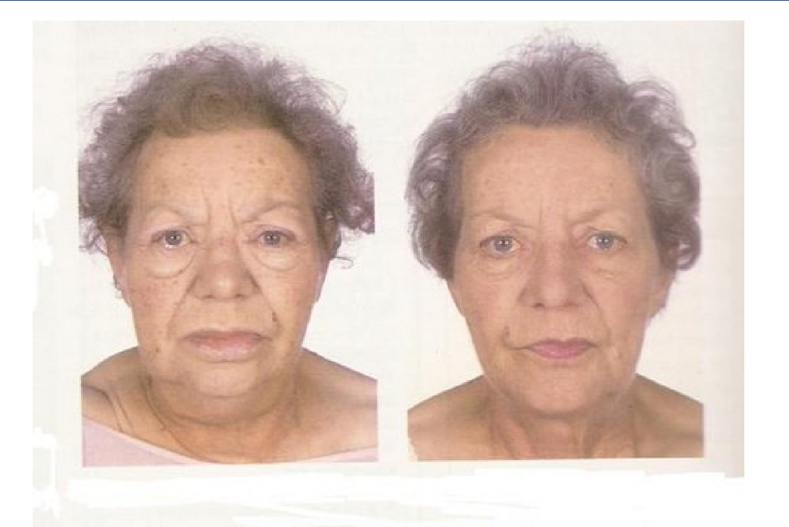 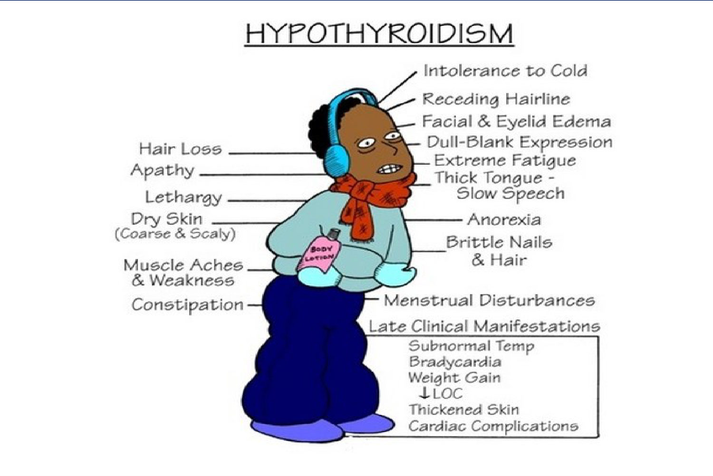

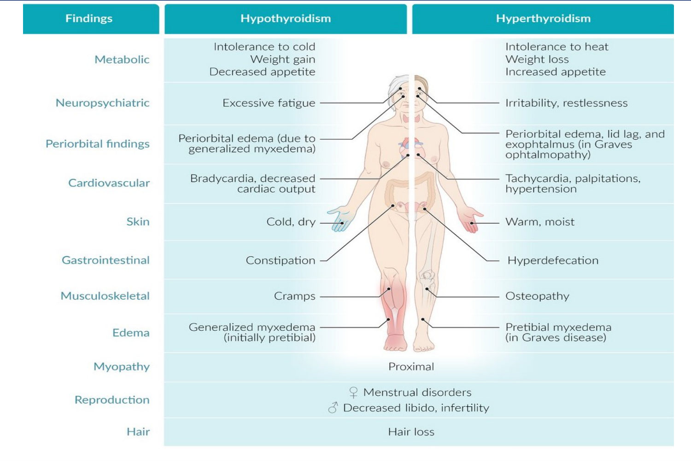

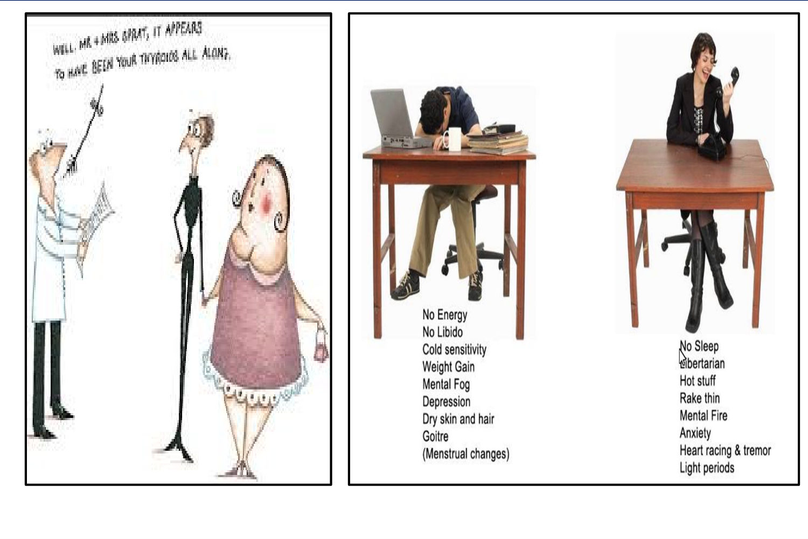

⭐⭐⭐ **Myxoedema coma (Slide 15):**
- **Causes:** long-standing **untreated** hypothyroidism; hypothyroid + exposure to ⭐ **cold, infection, trauma, CNS depressants**
- **Picture:** severe hypothyroid features + **bradycardia** · ⭐ **hypothermia** · ⭐ **dilutional hyponatraemia** · **alveolar hypoventilation → CO₂ retention & narcosis** · **loss of consciousness** · **hypoglycaemia** · **heart failure & hypotension**

> 🔁 **Recap: Clinical picture.** Slow brain and reflexes, carpal tunnel, deafness, hoarseness. Bradycardia, effusions, diastolic HTN. Three anaemia types. Hyponatraemia, constipation. Cold, dry, orange skin with lost outer eyebrows. Menorrhagia. Weight gain with poor appetite. Coma = hypothermia + hyponatraemia + hypoventilation + hypoglycaemia in an untreated patient after cold, infection or sedatives.
> 🔗 **Link:** Several conditions mimic this puffy, pale, high-cholesterol picture, so the lecture shows how to confirm the diagnosis and exclude look-alikes.
> ▶️ **Up next: Investigations and differential diagnosis.**

---

### 2.3 Investigations & Differential Diagnosis (Slide 16)
**Investigations:**
1. ⭐ **Thyroid function** (TSH first, see algorithms in §2.8)
2. **CXR** → pericardial or pleural effusion
3. ⭐ **ECG** → **low voltage, bradycardia**

**Differential diagnosis:**
| Condition | **Similar** to myxoedema | **Different** |
|---|---|---|
| **Primary vs secondary hypothyroidism** | Low T4 | TSH ↑ (primary) vs ↓/normal (secondary) |
| ⭐ **Nephrotic syndrome** | Facial puffiness, pallor · hypercholesterolaemia · ⭐ **↓ total T4/T3** (TBG lost in urine) | ⭐ **Normal TSH** · **heavy proteinuria** |
| **Chronic renal failure** | Facial puffiness, pallor · hypertension · dry skin | **Polyuria, pruritus** · **normal thyroid function** |

> 🔁 **Recap: Diagnosis.** TSH + FT4, CXR for effusions, ECG with low voltage and bradycardia. Nephrotic syndrome lowers total T4 (lost TBG) but TSH stays normal. CRF looks similar but thyroid function is normal.
> 🔗 **Link:** With the diagnosis confirmed, treatment is simple in principle (replace T4), but speed matters: too fast can precipitate angina.
> ▶️ **Up next: Treatment.**

---

### 2.4 Hypothyroidism: Treatment (Slides 17–18)
**A. Preparations**
- ⭐ **Levothyroxine (L-thyroxine): drug of choice**
- Desiccated thyroid extract (**T4 : T3 = 4 : 1**)
- Synthetic T3: **no real indication** (T4 is converted to T3 in the body)

**B. ⭐ Rapid correction** in:
- **Neonatal, infantile, juvenile** hypothyroidism
- ⭐ **Myxoedema coma**
- **Emergency surgery** in a hypothyroid patient → ⭐ **IV L-thyroxine + hydrocortisone**

**C. ⭐ Slow correction** in **elderly or cardiac patients**:
- Start ⭐ **25–50 µg/day** → ↑ by **25–50 µg every month** (clinical response) → full replacement ⭐ **150–200 µg/day**
- *[added: fast replacement increases myocardial O₂ demand and can precipitate angina or MI]*

**D. Clinical response:** full effect takes ⭐ **2–3 months**.

**E. ⭐ Monitoring (time to normalise):**
| Test | Normalises in |
|---|---|
| T4 | **A few days** |
| T3 (better) | **2–4 weeks** |
| ⭐ **TSH** | ⭐ **6–8 weeks** |
*[added: so recheck TSH no sooner than 6–8 weeks after a dose change.]*

⭐⭐⭐ **Myxoedema coma treatment (Slide 18):**
1. ⭐ **L-thyroxine 500 µg IV**
2. ⭐ **Hydrocortisone 100 mg** (possible **adrenal insufficiency**)
3. **Hypertonic saline (+ glucose)** (hyponatraemia, hypoglycaemia)
4. **Assisted ventilation** (CO₂ retention)
5. ⭐ **Avoid further heat loss** *[added: passive rewarming; active rewarming causes vasodilatation and collapse]*

*Mnemonic [added]:* **"T-H-S-V-W"**: **T**hyroxine, **H**ydrocortisone, **S**aline + sugar, **V**entilate, **W**arm passively. Give **steroid with (or before) thyroxine** *[added]*.

> 🔁 **Recap: Treatment.** Levothyroxine. Rapid for neonates, coma and emergency surgery (IV + hydrocortisone). Slow in elderly/cardiac patients (25–50 µg, up 25–50 monthly to 150–200). Full effect 2–3 months; TSH takes 6–8 weeks. Coma: 500 µg IV T4 + hydrocortisone 100 mg + hypertonic saline/glucose + ventilation + no heat loss.
> 🔗 **Link:** Two causes of hypothyroidism listed earlier, subacute and Hashimoto's thyroiditis, can also cause temporary **thyrotoxicosis**. The lecture looks at thyroiditis next.
> ▶️ **Up next: Thyroiditis.**

---

### 2.5 Thyroiditis (Slides 21–24)

#### A. ⭐⭐ Subacute (de Quervain) thyroiditis
- **Cause:** usually **follows an upper respiratory tract infection** (various **viruses**)
- **Clinical:** ⭐ **stretching of the capsule → pain over the thyroid**, or referred to the **lower jaw, ear, or occiput** · fever · nodularity · **dysphagia**
- **Investigations:** ⭐ **↑ T4** (leak) → euthyroid/hypothyroid phase → recovery · ⭐ **↓ RAIU**, ⭐ **↑ ESR**
- **Treatment:** mild → ⭐ **aspirin**; severe → ⭐ **prednisone 15–20 mg tid** + **propranolol** (thyrotoxic symptoms)

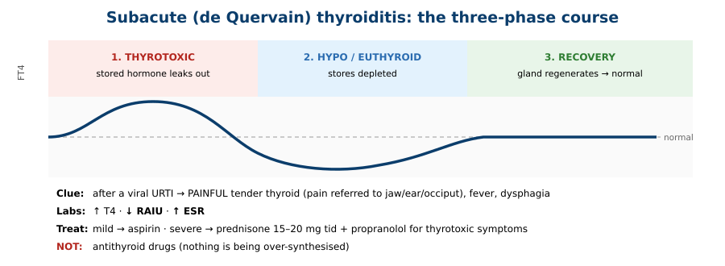

#### B. ⭐⭐ Chronic lymphocytic (Hashimoto's) thyroiditis
- **Cause:** **autoimmune**; may coexist with **SLE, pernicious anaemia, Sjögren's**
- **Clinical:** goitre (may be asymptomatic) → **thyroid failure** usually follows
- Initially **T4 ↑**, then **↓ → frank hypothyroidism**
- ⭐ **High-titre antimicrosomal (anti-TPO) antibodies**; can cause simultaneous thyroiditis + hyperthyroidism → ⭐ **hashitoxicosis**
- **Treatment:** ⭐ **levothyroxine (replacement doses)** → **goitre regresses**

| | **Subacute (de Quervain)** | **Hashimoto's** |
|---|---|---|
| Cause | **Viral**, post-URTI | **Autoimmune** |
| Gland | ⭐ **Painful, tender** | ⭐ **Painless**, firm goitre |
| ESR | ⭐ **↑** | Normal *[added]* |
| Antibodies | Usually absent *[added]* | ⭐ **High anti-TPO** |
| RAIU (thyrotoxic phase) | **↓** | ↓ (hashitoxicosis) |
| Outcome | **Recovery** (self-limited) | **Permanent hypothyroidism** |
| Treatment | Aspirin / prednisone + propranolol | **Levothyroxine** |

> 🔁 **Recap: Thyroiditis.** Subacute = painful post-viral gland, ↑ ESR, ↓ uptake, three phases; aspirin or prednisone. Hashimoto = painless autoimmune goitre, anti-TPO, ends in hypothyroidism; levothyroxine.
> 🔗 **Link:** Thyroiditis can feel nodular, but a single discrete lump raises a different question: is it cancer?
> ▶️ **Up next: Solitary thyroid nodule.**

---

### 2.6 Solitary Thyroid Nodule (Slides 25–28)
- ⭐ **Very common**: clinically palpable in **~4%**, found in **~50% at autopsy**
- One prominent nodule on exam may be **multiple** on ultrasound
- ⭐ **Most are benign**; a small percentage are malignant; most thyroid cancers are **low-grade**
- ⭐ **Major aetiological factor for thyroid cancer: childhood/adolescent head & neck radiation**
  - Irradiated patients → **baseline US** + palpation **every 1–2 years**
- ⭐⭐ **FNA indications:** **dominant nodule > 1–1.5 cm** or **suspicious US features**
- ⭐ **Levothyroxine suppression of benign nodules is NO LONGER recommended** (nodules rarely shrink)

⭐⭐ **High-risk factors for malignancy in a nodule (Table 66-6):**
| History | Examination | Lab & imaging |
|---|---|---|
| **Head & neck irradiation** | ⭐ **Hard** consistency | ⭐ **↑ Serum calcitonin** (medullary) |
| **Nuclear radiation exposure** | ⭐ **Fixation** | ⭐ **Cold nodule** on technetium scan |
| **Rapid growth** | **Lymphadenopathy** | ⭐ **Solid lesion with microcalcifications** on US |
| **Recent onset** | ⭐ **Vocal cord paralysis** | |
| **Young age** | **Distant metastasis** | |
| ⭐ **Male sex** | | |
| **Familial** (medullary; ~5% of papillary) | | |

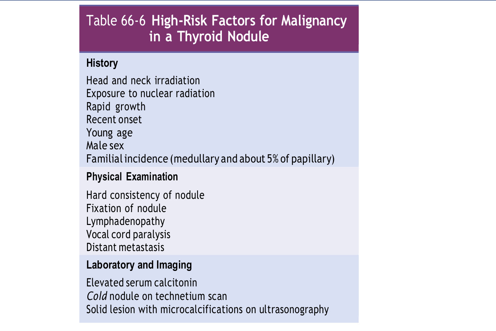

> 🔁 **Recap: Nodule.** Common (4% palpable, 50% at autopsy), mostly benign. FNA if > 1–1.5 cm or suspicious on US. Red flags: radiation, male, young, rapid growth, hard/fixed, nodes, hoarseness, calcitonin, cold nodule, microcalcifications. Don't suppress with thyroxine.
> 🔗 **Link:** When the FNA shows malignancy, the cell type decides spread, treatment and prognosis.
> ▶️ **Up next: Thyroid cancer types.**

---

### 2.7 Thyroid Cancer (Slides 29–31)
⭐⭐⭐ **Cancer types (Slide 31 table):**
| Type | Frequency | Behaviour | Spread | Treatment / prognosis |
|---|---|---|---|---|
| ⭐ **Papillary** | **70%** | ⭐ **Commonest**; may be **multifocal**; **young people (F > M)** | ⭐ **Lymph nodes**; local LN metastases **even with occult tumours < 1 cm** | **Total thyroidectomy + adjuvant I-131**; thyroxine for hypothyroidism and ↓ recurrence; ⭐ **good prognosis** |
| **Follicular** | **20%** | **Single encapsulated** lesion; mean age **50 y** (F > M) | ⭐ **Blood → lung, bone** | As papillary |
| ⭐ **Anaplastic** | **< 5%** | ⭐ **Most aggressive**; hard, rapidly enlarging; weight loss, **stridor, hoarseness** | **Locally invasive** | Surgery/chemo/radio **useless**; ⭐ **80% die within 1 year** |
| **Lymphoma** | **2%** | Variable | | Sometimes responsive to **radiotherapy** |
| ⭐ **Medullary** | **5%** | From ⭐ **calcitonin-secreting parafollicular C cells**; often **familial**, ⭐ **MEN** syndromes | **Lymphatic** spread frequent | ⭐ **Total thyroidectomy**; ⭐ **I-131 has no role**; poor prognosis but **indolent** |

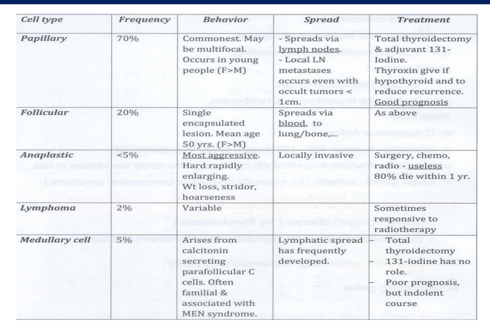

**Infographic (Slide 30):** Papillary **75–85%** (most common) · Follicular **15%** (well-differentiated) · Medullary **3%** (parafollicular cells) · Anaplastic **1%** (most aggressive).

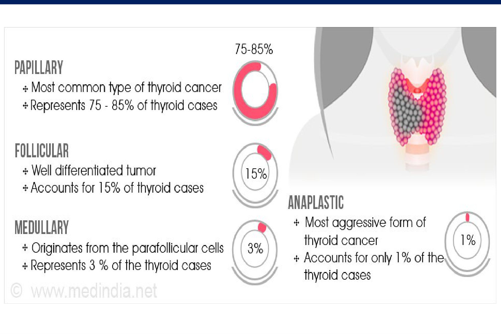

*Mnemonics [added]:* **"Papillary = Popular, Palpable nodes, Positive prognosis"** · **"Follicular = Far (blood → bone/lung)"** · **"Medullary = MEN, calcitonin, No iodine"** · **"Anaplastic = Aggressive, Aged, Awful"**.
*[added link to Lecture 1: thyroglobulin is the follow-up marker for papillary/follicular (differentiated) cancer; calcitonin is the marker for medullary.]*

> 🔁 **Recap: Cancer.** Papillary (commonest, young, lymph nodes, excellent), follicular (blood → bone/lung), medullary (C cells, calcitonin, MEN, no I-131), anaplastic (elderly, fast, fatal within a year), lymphoma (radiotherapy). Differentiated types → total thyroidectomy + I-131 + thyroxine.
> 🔗 **Link:** The last clinical topic returns to function, specifically the grey zone where TSH is abnormal but T4/T3 are normal.
> ▶️ **Up next: Subclinical hypo- and hyperthyroidism.**

---

### 2.8 Subclinical Thyroid Disease & Diagnostic Algorithms (Slides 32–40)
| | **Subclinical hypothyroidism** | **Subclinical hyperthyroidism** |
|---|---|---|
| Definition | ⭐ **↑ TSH, normal T4 & T3** | ⭐ **↓ TSH, normal T4 & T3** |
| Symptoms | Usually none; subtle fatigue, constipation | Mild anxiety, palpitations, weight loss |
| Complications | ↑ **cardiovascular** risk (esp. severe) | ⭐ **Atrial fibrillation**, ⭐ **bone loss**, heart problems |

⭐⭐ **Managing subclinical hypothyroidism (Slide 34):**
1. **Elevated TSH** → **confirm**; check **FT4, anti-TPO, lipids**
2. ⭐ **TSH ≥ 10 mU/L → treat with levothyroxine**
3. **TSH < 10**:
   - **Anti-TPO +** → **consider levothyroxine**
   - **Anti-TPO −** + symptoms, goitre, young/middle-aged, **pregnant or planning pregnancy**, or dyslipidaemia → **consider levothyroxine**
   - **Anti-TPO −** + **elderly** or none of the above → **close follow-up** (or treatment)

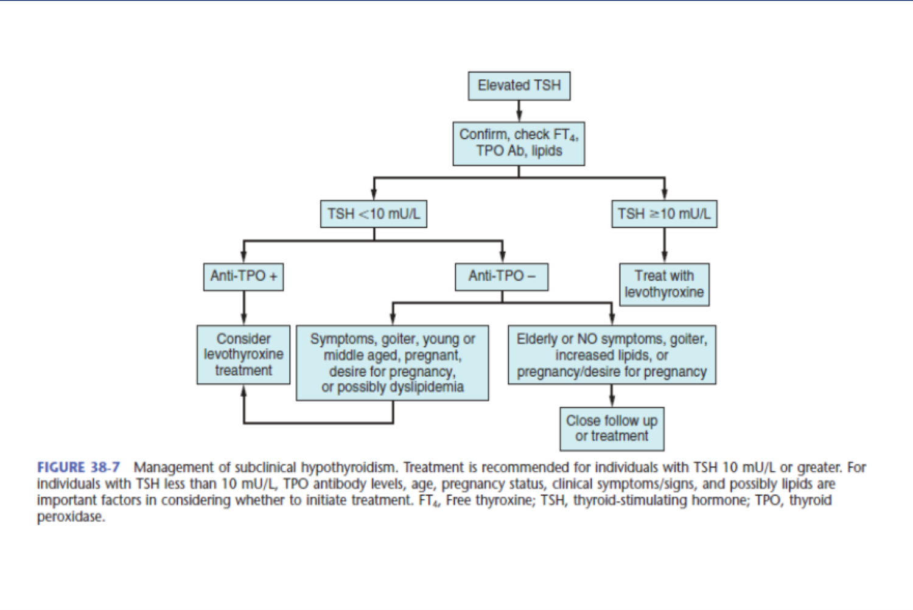

⭐⭐ **Managing subclinical hyperthyroidism (Slide 35):**
| TSH | **> 60 y, heart disease, osteoporosis, or symptoms** | **< 60 y, no risk factors** |
|---|---|---|
| ⭐ **< 0.1 mU/L** (esp. if FT4/T3 high-normal) | ⭐ **Treat** | Observe or treat |
| **0.1–0.5 mU/L** | Clinical judgement (**treatment suggested**) | ⭐ **No treatment** |

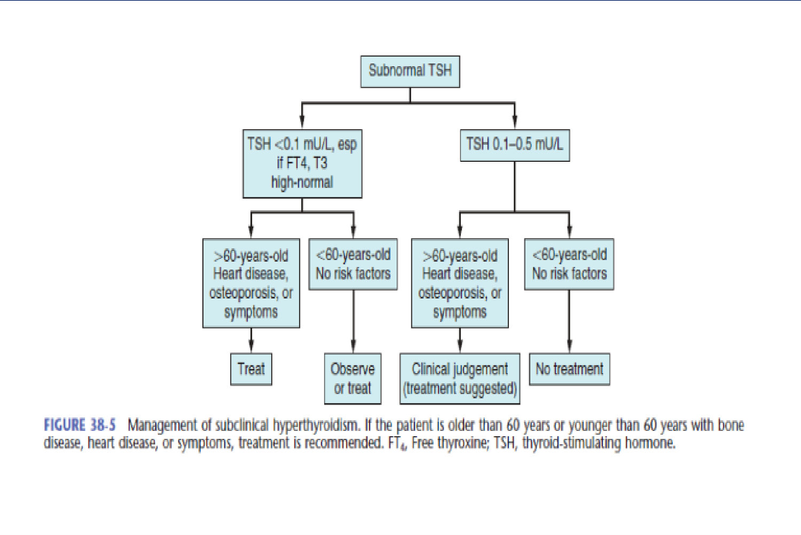

⭐⭐⭐ **TSH-first testing (Slide 37):**
| TSH | FT4 | Diagnosis |
|---|---|---|
| **Low** | Low | **Central hypothyroidism** or **non-thyroidal illness (NTI)** |
| **Low** | Normal | **Subclinical hyperthyroidism** or **T3 toxicosis** |
| **Low** | High | ⭐ **Thyrotoxicosis** |
| **Normal** | | **Euthyroid** |
| **High** | Low | ⭐ **Primary hypothyroidism** |
| **High** | Normal | **Subclinical hypothyroidism** |
| **High** | High | ⭐ **TSH-secreting tumour** |
*TSH-first is for screening asymptomatic people; if symptoms are present, measure FT4 too.*

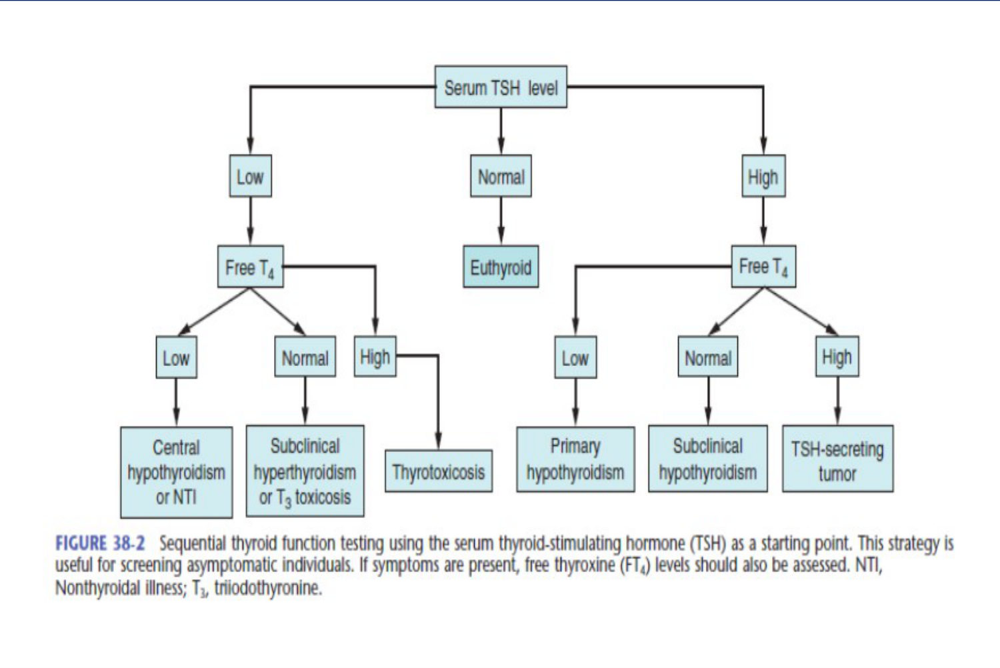

⭐ **Diagnosis of hypothyroidism (Slide 39):** TSH → **low**: secondary/tertiary likely → FT4 low = secondary/tertiary hypothyroidism (normal/high = hyperthyroidism) · **normal**: hypothyroidism unlikely · **high**: primary likely → FT4 **low = primary**, **normal = subclinical**.

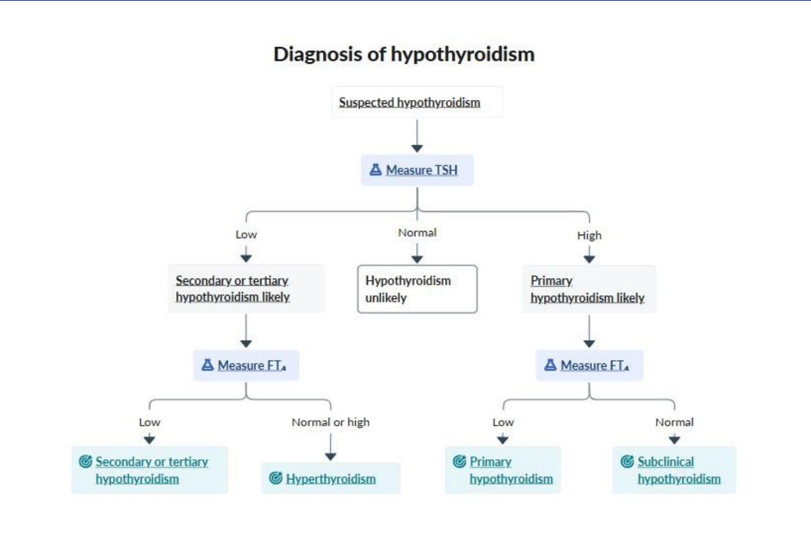

⭐⭐ **Diagnosis of hyperthyroidism (Slide 38):**
1. Measure **TSH, free T4, total T3**
2. **↑/normal TSH + ↑ FT4/T3** → ⭐ **thyrotropic (TSH) adenoma likely → MRI pituitary**
3. **↓ TSH + ↑ FT4/T3** → **overt hyperthyroidism**
4. **↓ TSH + normal FT4/T3** → measure ⭐ **β-hCG**: negative → **subclinical hyperthyroidism**; positive → consider **hCG-associated** (gestational transient thyrotoxicosis, trophoblastic disease)
5. Overt/subclinical → **diagnostic criteria for Graves met?** Yes → **Graves**. If not, high suspicion → ⭐ **check TRAb** (positive → Graves)
6. Otherwise → **thyroid imaging** (nuclear scan / RAIU; **US with Doppler** if pregnant/breastfeeding):
   - **High uptake, diffuse** → **Graves**
   - **High uptake, nodular**: 1–2 areas → **toxic adenoma**; multiple → **toxic multinodular goitre**
   - **Low uptake** → anti-TPO/anti-Tg: **positive → hashitoxicosis**; negative → **thyroglobulin**: high/normal → **endogenous (thyroiditis)**; ⭐ **low → exogenous hyperthyroidism**

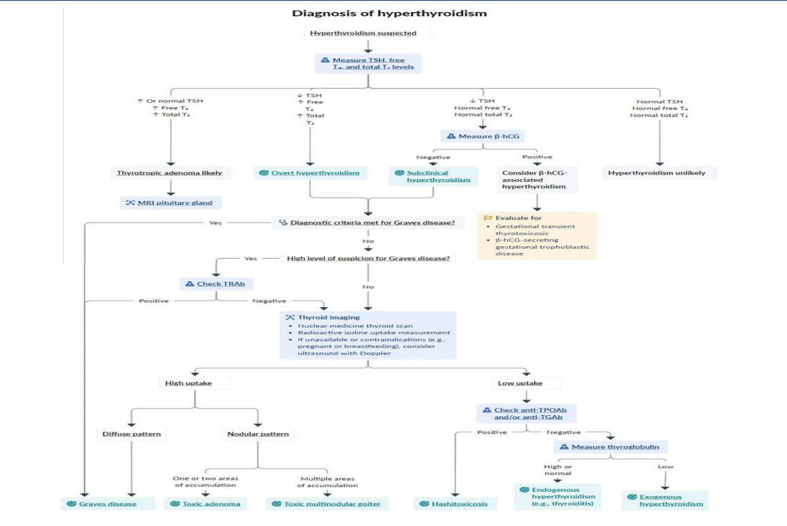

⭐⭐ **Diagnosis & management of thyrotoxicosis by aetiology (Slide 40, Table 38-2):**
| Aetiology | Mechanism | Gland | Key labs | RAIU | Treatment |
|---|---|---|---|---|---|
| **Graves** | Stimulating anti-TSH-R Ab | **Diffuse goitre** | + antibodies, ↑ Tg | ⭐ **↑ diffuse** | ATDs, RAI, surgery |
| **Toxic MNG / solitary nodule** | Activating gene mutations | Nodule(s), usually **> 3 cm** | − TSI/TRAb, ↑ Tg | ⭐ **↑ focal** | ⭐ **RAI = treatment of choice**; ATDs temporising; surgery if compressive or cancer risk |
| **Thyroiditis** (thyrotoxic phase) | Follicular destruction | **Tender** (subacute) / non-tender ("silent") | − Abs, ↑ Tg | ⭐ **↓** | **Prednisone** |
| **Iodine-induced** | Iodine load (IV dye, **amiodarone type 1**) | Nodular or diffuse | − Abs, ↓ Tg | **↓** | Withdraw agent; ATDs/RAI/surgery if selected |
| **Choriocarcinoma** | **hCG** stimulates | Minimal goitre | ↑ Tg | ↑ | Treat tumour |
| **TSH-secreting pituitary tumour** | TSH overproduction | Goitre | ⭐ **TSH normal/↑** | ↑ | Treat adenoma |
| **Struma ovarii** | Ectopic tissue in ovarian tumour | Normal | ↑ Tg | ⭐ **↓ neck, ↑ pelvis** | Treat tumour |
| **Exogenous / factitious** | Excess thyroxine intake | Normal | ⭐ **↓ thyroglobulin** | **↓** | Withdraw agent |
| **Drug-induced** | Amiodarone, **interferon-α**, **tyrosine kinase inhibitors** | Normal | ↓ Tg | ↓ | Withdraw agent |

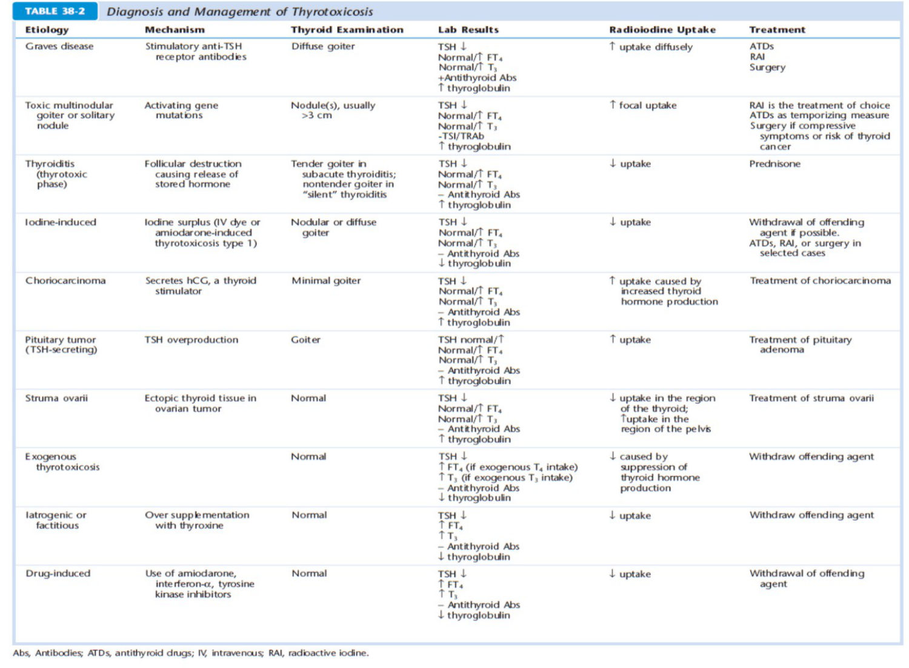

> 🔁 **Recap: Subclinical & algorithms.** Subclinical = abnormal TSH with normal hormones. Treat subclinical hypo if TSH ≥ 10 (or < 10 with anti-TPO/symptoms/pregnancy). Treat subclinical hyper if TSH < 0.1 and > 60 y or heart/bone disease. Always start with TSH. In thyrotoxicosis, uptake + antibodies + thyroglobulin identify the cause.
> 🔗 **Link:** The closing case puts it together: a set of vague symptoms that point to one unifying diagnosis.
> ▶️ **Up next:** Case, answered in §7.

---

## 3. High-Yield Comparison Tables

### Table A: Hypothyroidism vs hyperthyroidism
| | **Hypothyroidism** | **Hyperthyroidism** |
|---|---|---|
| Metabolic | Cold intolerance, weight gain, ↓ appetite | Heat intolerance, weight loss, ↑ appetite |
| Neuro | Fatigue, slow, **delayed reflex relaxation** | Irritable, **brisk reflexes, fine tremor** |
| Eyes | Periorbital oedema | Lid lag, exophthalmos (Graves) |
| CVS | **Bradycardia**, ↓ CO, diastolic HTN, effusion | **Tachycardia, AF**, systolic HTN |
| Skin | **Cold, dry**, orange (carotene) | **Warm, moist** |
| GI | **Constipation** | Hyperdefecation |
| MSK | Cramps, stiffness | **Osteoporosis** |
| Oedema | **Generalised myxoedema** | **Pretibial myxoedema** (Graves) |
| Shared | **Proximal myopathy**, menstrual disorders, ↓ libido/infertility, hair loss | |
| Lipids | **↑ cholesterol** | ↓ cholesterol |
| Emergency | **Myxoedema coma** | **Thyroid storm** |

### Table B: Myxoedema coma vs thyroid storm
| | **Myxoedema coma** | **Thyroid storm** |
|---|---|---|
| Trigger | Cold, infection, trauma, **CNS depressants** in untreated hypothyroid | Surgery, infection in untreated hyperthyroid |
| Temperature | ⭐ **Hypothermia** | ⭐ **Hyperpyrexia** |
| HR | Bradycardia | Tachycardia |
| Na / glucose | **Hyponatraemia, hypoglycaemia** | |
| Resp | **Hypoventilation, CO₂ narcosis** | |
| Steroid | **Hydrocortisone 100 mg** | **Dexamethasone 4–8 mg** |
| Hormone step | **IV T4 500 µg** | **Methimazole/PTU → then iodide** |
| Temperature Rx | **Avoid heat loss** (passive) | **Ice bags** |

### Table C: Subacute vs Hashimoto *(see §2.5)*

### Table D: Thyroid cancer *(see §2.7)*

### Table E: TSH / FT4 grid *(see §2.8)*

### Table F: Subclinical disease: when to treat
| | Treat | Consider / judgement | Observe |
|---|---|---|---|
| **Subclinical hypo** | **TSH ≥ 10** | TSH < 10 + anti-TPO+, symptoms, goitre, pregnancy (planned), dyslipidaemia | Elderly, TSH < 10, anti-TPO − |
| **Subclinical hyper** | **TSH < 0.1** + > 60 y / heart / bone / symptoms | TSH 0.1–0.5 + risk factors; TSH < 0.1 + young | TSH 0.1–0.5, < 60 y, no risk |

### Table G: Thyroxine dosing
| Situation | Regimen |
|---|---|
| Young, healthy | Full replacement (150–200 µg) *[added: ~1.6 µg/kg]* |
| **Elderly / heart disease** | **25–50 µg**, ↑ **25–50 µg monthly** |
| **Neonates, coma, emergency surgery** | **Rapid; IV + hydrocortisone** |
| **Myxoedema coma** | **500 µg IV** |
| Monitoring | TSH at **6–8 weeks**; full effect **2–3 months** |

---

## 4. Rules, Exceptions, Patterns
- **95% of hypothyroidism is primary**; TSH ↑ is the key.
- **Nephrotic syndrome** lowers total T4 but **TSH is normal**; don't treat.
- **Rapid replacement only** for neonates, myxoedema coma and emergency surgery. **Everyone elderly/cardiac: start low, go slow.**
- **Give hydrocortisone with IV thyroxine** in coma or emergencies (occult adrenal insufficiency).
- **TSH lags**: check it at **6–8 weeks**, not sooner.
- **Synthetic T3 has no real indication.**
- **Subacute thyroiditis = painful + ↑ ESR + ↓ RAIU**; no antithyroid drugs.
- **Hashimoto's = painless, anti-TPO +**; treat with thyroxine; the goitre regresses.
- **FNA for nodules > 1–1.5 cm or suspicious US.** **No thyroxine suppression** for benign nodules.
- **Cold nodule and microcalcifications = suspicious.** Hot nodule is usually benign *[added]*.
- **I-131 treats papillary/follicular, not medullary or anaplastic.**
- **Papillary → lymph; follicular → blood.**
- **Subclinical hypo: treat at TSH ≥ 10. Subclinical hyper: treat at TSH < 0.1 with age > 60 or heart/bone disease.**
- **Low uptake + low thyroglobulin = exogenous thyroxine.**

---

## 5. Clinical Correlations
- **Carpal tunnel + constipation + bradycardia + fatigue + weight gain** → check TSH (lecture case).
- **Hyponatraemia, unexplained** → include hypothyroidism *[added: and adrenal insufficiency]* in the work-up.
- **Elderly hypothyroid patient with angina** → start 25 µg; rapid dosing can precipitate MI *[added]*.
- **Menorrhagia + microcytic anaemia** → consider hypothyroidism.
- **Postpartum woman with transient hyper → hypothyroid swing** → postpartum thyroiditis (anti-TPO > 60%).
- **Neck pain radiating to the jaw after a cold** → subacute thyroiditis (not dental or ENT pathology).
- **Hoarseness + hard fixed rapidly enlarging mass in an elderly patient** → anaplastic carcinoma.
- **Thyroid nodule + ↑ calcitonin + phaeochromocytoma / hyperparathyroidism** → **medullary cancer in MEN 2** *[MEN detail added]*.
- **Amiodarone** → can cause hypo- or hyperthyroidism *[added]*; type 1 (iodine-induced) is in the Slide 40 table.

---

## 6. Rapid Revision (Last-Day)
- Hypothyroidism: **95% primary**, 5% secondary; ♀ 30–50, **> 80% antibody +**.
- Non-goitrous: congenital, **post-surgery, post-I-131**, idiopathic. Goitrous: **Pendred (+ deafness)**, **iodine deficiency**, drugs (PAS, phenylbutazone, ATDs), **Hashimoto, Riedel**, subacute, postpartum.
- Myxoedema = mucopolysaccharide swelling (a sign).
- Neuro: **delayed reflex relaxation**, **carpal tunnel**, deafness, hoarseness, myxoedema madness.
- CVS: **bradycardia**, effusion, diastolic HTN, cardiomyopathy. Anaemia: **normo** (marrow), **megalo** (pernicious), **micro** (menorrhagia/achlorhydria).
- **Hyponatraemia**, **CO₂ retention**, **constipation/ileus**, ascites.
- Skin: **cold, dry, orange (carotene)**, **outer ⅓ eyebrow loss**, xanthelasma. **Menorrhagia = commonest** reproductive sign.
- **Myxoedema coma:** hypothermia, hyponatraemia, hypoventilation, hypoglycaemia, hypotension. Triggers: **cold, infection, trauma, sedatives**.
- Rx coma: **T4 500 µg IV, hydrocortisone 100 mg, hypertonic saline + glucose, ventilation, avoid heat loss**.
- ECG: **low voltage + bradycardia**. Nephrotic: ↓ total T4, **normal TSH**.
- **Levothyroxine**; elderly **25–50 µg → +25–50 monthly → 150–200**. T4 normal in days, T3 **2–4 wk**, **TSH 6–8 wk**; full effect **2–3 mo**.
- Subacute: post-viral, **painful**, **↑ ESR, ↓ RAIU**, 3 phases; **aspirin / prednisone 15–20 mg tid + propranolol**.
- Hashimoto: autoimmune (SLE, PA, Sjögren's), **anti-TPO high**, hashitoxicosis → **levothyroxine**.
- Nodules: **4% palpable, 50% autopsy**; radiation = main cancer risk; **FNA > 1–1.5 cm**; no T4 suppression.
- Red flags: radiation, rapid growth, young, **male**, family, **hard, fixed, nodes, cord palsy**, **calcitonin, cold nodule, microcalcifications**.
- Cancer: **papillary 70%** (lymph, young, good) · **follicular 20%** (blood → lung/bone, 50 y) · **medullary 5%** (C cells, MEN, **no I-131**) · **anaplastic < 5%** (80% dead in 1 y) · **lymphoma 2%** (radiotherapy).
- Subclinical hypo: ↑ TSH, normal T4 → **treat if TSH ≥ 10**. Subclinical hyper: ↓ TSH → AF, bone loss → **treat if < 0.1 + > 60 y/heart/bone**.
- TSH-first grid: ↑↑ = TSH tumour; ↓↓ = central/NTI.
- Hyperthyroid work-up: **β-hCG** if subclinical; **TRAb**; **RAIU** (diffuse/nodular/low); low uptake → antibodies → **thyroglobulin (low = exogenous)**.

---

## 7. Exam-Style Questions

**Q1 (MCQ, lecture case, Slides 41–42).** 50 ♀, 6 weeks of **right-hand pain and numbness (thumb/index), worse at night, relieved by shaking**. Episodic knee pain. Takes OTC medicine for **constipation**. **BMI 35**. **Fatigued**, **pulse 57**, BP 120/75. **DTRs 1+**, **mild leg oedema**. Mother has RA. Which treatment is most likely to benefit her?
**A) L-thyroxine** B) Methotrexate C) Ibuprofen D) Surgical decompression E) Oral prednisone

**Answer: A.** *[reasoning added]* Carpal tunnel syndrome (mucinous infiltration of the flexor retinaculum) + constipation + bradycardia + fatigue + obesity + hyporeflexia + oedema = **hypothyroidism**. Treating the cause with **levothyroxine** relieves the carpal tunnel. The family history of RA is a distractor (normal wrist range of motion, no synovitis), so methotrexate/prednisone are wrong. **Surgical decompression** is premature when the cause is reversible (no thenar atrophy).

---

**Q2 (MCQ).** A 78-year-old man with stable angina has TSH 45 mU/L and low FT4. Best initial levothyroxine dose?
a) 200 µg daily b) 100 µg daily **c) 25 µg daily, increase monthly** d) 500 µg IV
**Answer: c.** Elderly/cardiac: **start 25–50 µg, ↑ 25–50 µg every month**. Full doses risk precipitating ischaemia. 500 µg IV is only for myxoedema coma.

---

**Q3 (MCQ).** An elderly hypothyroid woman is found drowsy after a winter night alone and a dose of sedative. T 33 °C, Na 121, glucose 3.0 mmol/L, PaCO₂ raised. Which is **wrong**?
a) IV levothyroxine 500 µg b) IV hydrocortisone 100 mg c) Hypertonic saline + glucose **d) Active external rewarming with heating blankets** e) Ventilatory support
**Answer: d.** The lecture says **avoid further heat loss** (passive measures). *[added: aggressive active rewarming causes peripheral vasodilatation and cardiovascular collapse.]*

---

**Q4 (MCQ).** A 45-year-old man has a 2-cm hard thyroid nodule; serum **calcitonin is raised**; his father had a phaeochromocytoma. Which statement is correct?
a) Radioiodine ablation is first-line b) It arises from follicular cells **c) Total thyroidectomy; I-131 has no role** d) It spreads mainly by the blood
**Answer: c.** Medullary carcinoma arises from **parafollicular C cells** (calcitonin), is often **familial / MEN**, spreads via **lymphatics**, and does not take up iodine.

---

**Q5 (Short answer).** A patient has TSH 7 mU/L with normal FT4. When would you treat?
**Answer:** This is **subclinical hypothyroidism** with TSH **< 10**. Confirm, then check **anti-TPO and lipids**. **Consider levothyroxine** if **anti-TPO positive**, or if there are symptoms, goitre, young/middle age, **pregnancy or plans for pregnancy**, or dyslipidaemia. If elderly and none of these → **close follow-up**. Treat everyone at **TSH ≥ 10**.

---

## 8. Exam Pitfalls & Traps
1. ⚠️ **Cancer frequencies differ between slides:** table (Slide 31): papillary **70%**, follicular **20%**, medullary **5%**, anaplastic **< 5%**, lymphoma **2%**. Infographic (Slide 30): papillary **75–85%**, follicular **15%**, medullary **3%**, anaplastic **1%**. The **rank order is the same**; know the order and quote the table if asked for exact numbers.
2. **Full-dose thyroxine in the elderly or cardiac patient.** Start low.
3. **Rechecking TSH at 2 weeks.** It takes **6–8 weeks** to settle.
4. **Forgetting hydrocortisone** in myxoedema coma or emergency surgery.
5. **Treating a nephrotic patient's low total T4.** TSH is normal; it's lost TBG.
6. **Actively rewarming** in myxoedema coma. Avoid heat loss instead.
7. **Antithyroid drugs for subacute thyroiditis.** Leak, not over-production.
8. **Confusing painful (subacute) with painless (Hashimoto, silent/postpartum)** thyroiditis.
9. **Thyroxine suppression for benign nodules** is outdated per the lecture.
10. **I-131 for medullary or anaplastic cancer.** No role.
11. **Papillary → blood, follicular → lymph.** It's the other way round: **papillary → lymph, follicular → blood**.
12. **Hot nodule = cancer.** It's the **cold** nodule that raises suspicion.
13. **Subclinical ≠ "no action".** Treat hypo at TSH ≥ 10; treat hyper at TSH < 0.1 in older/cardiac/osteoporotic patients.
14. **TSH ↑ and FT4 ↑ together** isn't lab error: think **TSH-secreting adenoma → MRI**.
15. **Low uptake thyrotoxicosis with low thyroglobulin** = factitious thyroxine, not thyroiditis.
16. **Hypertension in hypothyroidism** is real (↑ peripheral resistance). Don't assume BP must be low.
17. **Symbols lost in the PDF:** "much common in ___ than ___" on Slide 7 reads **♀ than ♂** on the rendered slide.
